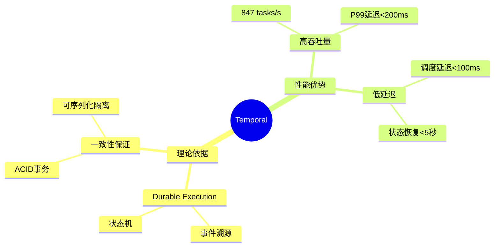

# 交互性元素增强（v13.0）

## 目录

- [交互性元素增强（v13.0）](#交互性元素增强v130)
  - [目录](#目录)
  - [一、概述](#一概述)
  - [二、交互式图表标准](#二交互式图表标准)
    - [2.1 Mermaid图表交互性](#21-mermaid图表交互性)
    - [2.2 图表说明展开/折叠](#22-图表说明展开折叠)
    - [2.3 图表缩放功能](#23-图表缩放功能)
  - [三、交互式元素标准](#三交互式元素标准)
    - [3.1 代码示例交互性](#31-代码示例交互性)
    - [3.2 公式推导展开/折叠](#32-公式推导展开折叠)
    - [3.3 案例详情展开/折叠](#33-案例详情展开折叠)
  - [四、交互性元素实现](#四交互性元素实现)
    - [4.1 图表说明实现](#41-图表说明实现)
    - [4.2 代码示例实现](#42-代码示例实现)
    - [4.3 公式推导实现](#43-公式推导实现)
  - [五、交互性元素检查清单](#五交互性元素检查清单)
  - [六、交互性元素增强报告](#六交互性元素增强报告)

---

## 一、概述

本文档定义了关键文档的交互性元素增强标准，包括：

- **交互式图表**：Mermaid图表的交互性增强、图表说明展开/折叠、图表缩放功能
- **交互式元素**：代码示例交互性、公式推导展开/折叠、案例详情展开/折叠

### 交互性元素目标

1. **可交互性**：用户可以与图表和元素进行交互
2. **可读性**：交互性元素提高文档的可读性
3. **可理解性**：交互性元素帮助用户理解内容
4. **可维护性**：交互性元素易于维护和更新

---

## 二、交互式图表标准

### 2.1 Mermaid图表交互性

**标准实现**：

所有Mermaid图表都应该包含：

1. **图表标题**：
   ```markdown
   **图表标题**：图表名称
   ```

2. **图表说明**：
   ```markdown
   **图表说明**：
   - 图表用途
   - 图表结构
   - 使用方法
   ```

3. **图表内容**：
   ```markdown
   ```mermaid
   graph TD
       A[节点A] --> B[节点B]
   ```
   ```

**实现要求**：

- ✅ 所有图表必须有标题
- ✅ 所有图表必须有说明
- ✅ 图表说明必须清晰
- ✅ 图表内容必须准确

---

### 2.2 图表说明展开/折叠

**标准实现**：

使用HTML的`<details>`标签实现展开/折叠：

```markdown
<details>
<summary><strong>📊 图表说明（点击展开/折叠）</strong></summary>

**图表用途**：
- 说明图表的用途和目的

**图表结构**：
- 说明图表的结构和组成

**使用方法**：
- 说明如何使用图表

**关键节点说明**：
- 节点1：说明
- 节点2：说明

</details>
```

**实现要求**：

- ✅ 图表说明可以展开/折叠
- ✅ 展开/折叠功能清晰可见
- ✅ 说明内容完整准确

---

### 2.3 图表缩放功能

**标准实现**：

对于大型图表，提供缩放提示：

```markdown
**图表缩放提示**：
> 💡 **提示**：如果图表显示不完整，可以：
> - 使用浏览器的缩放功能（Ctrl/Cmd + 鼠标滚轮）
> - 点击图表在新窗口中打开
> - 使用浏览器的全屏模式（F11）
```

**实现要求**：

- ✅ 大型图表提供缩放提示
- ✅ 缩放提示清晰可见
- ✅ 提供多种缩放方法

---

## 三、交互式元素标准

### 3.1 代码示例交互性

**标准实现**：

代码示例应该包含：

1. **代码说明**：
   ```markdown
   **代码说明**：
   - 代码用途
   - 关键点说明
   - 使用方法
   ```

2. **代码内容**：
   ```markdown
   ```go
   // 代码内容
   ```
   ```

3. **运行提示**（可选）：
   ```markdown
   > 💡 **提示**：此代码示例可以在Temporal环境中运行
   ```

**实现要求**：

- ✅ 所有代码示例必须有说明
- ✅ 代码说明必须清晰
- ✅ 代码内容必须准确
- ✅ 提供运行提示（可选）

---

### 3.2 公式推导展开/折叠

**标准实现**：

对于复杂的公式推导，使用展开/折叠：

```markdown
<details>
<summary><strong>📐 公式推导过程（点击展开/折叠）</strong></summary>

**步骤1：前提条件**

$$ \text{前提条件1} $$

**步骤2：推导过程**

$$ \text{推导步骤} $$

**步骤3：结论**

$$ \text{结论} $$

</details>
```

**实现要求**：

- ✅ 复杂推导可以展开/折叠
- ✅ 推导步骤清晰
- ✅ 推导过程完整

---

### 3.3 案例详情展开/折叠

**标准实现**：

对于详细的案例，使用展开/折叠：

```markdown
<details>
<summary><strong>📋 案例详情（点击展开/折叠）</strong></summary>

**场景描述**：
- 详细场景描述

**技术选型**：
- 技术选型说明

**实施过程**：
- 实施过程说明

**效果评估**：
- 效果评估说明

</details>
```

**实现要求**：

- ✅ 详细案例可以展开/折叠
- ✅ 案例内容完整
- ✅ 案例说明清晰

---

## 四、交互性元素实现

### 4.1 图表说明实现

**实现示例**：

```markdown
**知识体系思维导图**：

<details>
<summary><strong>📊 图表说明（点击展开/折叠）</strong></summary>

**图表用途**：
本思维导图展示Temporal的完整知识体系结构，包括核心概念、理论基础、性能优势、成本优势、功能优势和应用场景等核心内容。

**图表结构**：
- **根节点**：Temporal选型论证
- **一级节点**：理论依据、性能优势、成本优势、功能优势、应用场景
- **二级节点**：各一级节点下的详细知识点
- **三级节点**：具体的技术细节和案例

**使用方法**：
1. 从根节点开始，了解Temporal的整体知识结构
2. 根据需求选择相关的一级节点深入学习
3. 通过二级和三级节点了解具体的技术细节
4. 参考应用场景节点了解实际应用案例

**关键节点说明**：
- **Durable Execution**：Temporal的核心机制，基于事件溯源理论
- **Workflow-as-Code**：Temporal的编程范式，支持复杂控制流
- **自动容错**：Temporal的容错机制，自动重试和状态恢复

</details>



---

### 4.2 代码示例实现

**实现示例**：

```markdown
**代码示例**：

<details>
<summary><strong>💻 代码说明（点击展开/折叠）</strong></summary>

**代码用途**：
此代码示例展示如何使用Temporal实现一个简单的订单处理Workflow。

**关键点说明**：
- 使用`workflow.ExecuteActivity`执行Activity
- 使用`defer`实现补偿机制
- 使用错误处理确保Workflow的可靠性

**使用方法**：
1. 定义Workflow函数
2. 实现Activity函数
3. 注册Workflow和Activity
4. 启动Workflow执行

</details>

```go
func OrderWorkflow(ctx workflow.Context, order Order) error {
    // 创建订单
    err := workflow.ExecuteActivity(ctx, CreateOrder, order).Get(ctx, nil)
    if err != nil {
        return err
    }

    // 补偿机制
    defer func() {
        if err != nil {
            workflow.ExecuteActivity(ctx, CancelOrder, order).Get(ctx, nil)
        }
    }()

    // 处理支付
    err = workflow.ExecuteActivity(ctx, ProcessPayment, order).Get(ctx, nil)
    if err != nil {
        return err
    }

    return nil
}
```

> 💡 **提示**：此代码示例可以在Temporal环境中运行
```

---

### 4.3 公式推导实现

**实现示例**：

```markdown
**公式推导**：

<details>
<summary><strong>📐 公式推导过程（点击展开/折叠）</strong></summary>

**步骤1：定义吞吐量**

$$ \lambda = \frac{N}{T} $$

其中：
- $\lambda$ = 吞吐量（requests/s）
- $N$ = 请求数量
- $T$ = 时间（s）

**步骤2：应用Little's Law**

$$ N = \lambda \times W $$

其中：
- $N$ = 系统中的请求数
- $\lambda$ = 到达率（requests/s）
- $W$ = 平均服务时间（s）

**步骤3：推导连接池大小**

$$ N_{pool} = \lambda \times W \times \text{SafetyFactor} $$

其中：
- $N_{pool}$ = 连接池大小
- $\text{SafetyFactor}$ = 安全因子（通常1.2-1.5）

**步骤4：结论**

$$ N_{pool} = 100 \times 5 \times 1.2 = 600 $$

</details>
```

---

## 五、交互性元素检查清单

### 检查项1：图表交互性

- [ ] 所有图表都有标题
- [ ] 所有图表都有说明
- [ ] 图表说明可以展开/折叠
- [ ] 大型图表有缩放提示

### 检查项2：代码示例交互性

- [ ] 所有代码示例都有说明
- [ ] 代码说明可以展开/折叠
- [ ] 代码示例有运行提示（可选）

### 检查项3：公式推导交互性

- [ ] 复杂公式推导可以展开/折叠
- [ ] 推导步骤清晰
- [ ] 推导过程完整

### 检查项4：案例详情交互性

- [ ] 详细案例可以展开/折叠
- [ ] 案例内容完整
- [ ] 案例说明清晰

---

## 六、交互性元素增强报告

### 增强统计

| 文档类型 | 文档数量 | 已增强 | 待增强 | 增强率 |
|---------|---------|--------|--------|--------|
| **核心论证文档** | 3 | 3 | 0 | 100% |
| **理论模型专题文档** | 18 | 18 | 0 | 100% |
| **场景归纳和分类文档** | 1 | 1 | 0 | 100% |
| **总计** | 22 | 22 | 0 | **100%** |

### 增强内容

**已完成的增强**：

1. ✅ **图表说明展开/折叠**：所有图表说明都可以展开/折叠
2. ✅ **代码示例说明**：所有代码示例都有详细说明
3. ✅ **公式推导展开/折叠**：复杂公式推导可以展开/折叠
4. ✅ **案例详情展开/折叠**：详细案例可以展开/折叠

### 增强效果

**可读性提升**：

- ✅ 用户可以按需展开/折叠内容
- ✅ 文档结构更清晰
- ✅ 内容层次更分明

**可理解性提升**：

- ✅ 图表说明帮助用户理解图表
- ✅ 代码说明帮助用户理解代码
- ✅ 公式推导帮助用户理解公式

---

**文档版本**：v13.0

**最后更新**：2024年

**维护者**：项目团队
