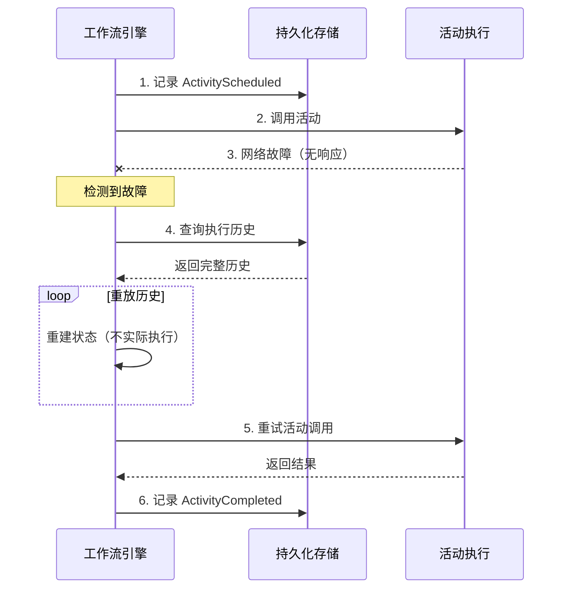
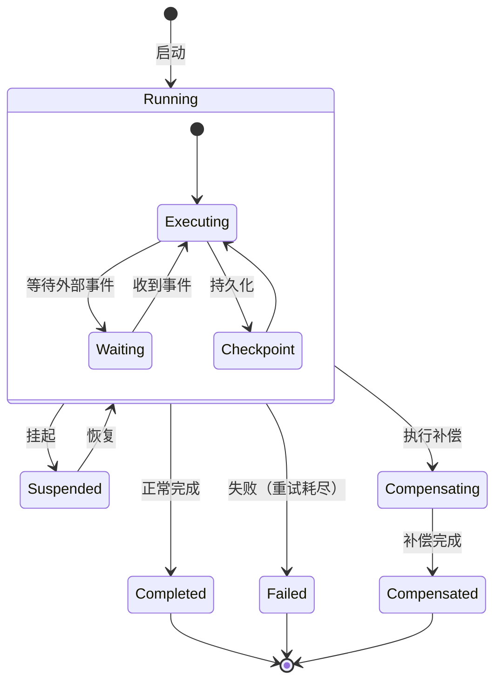
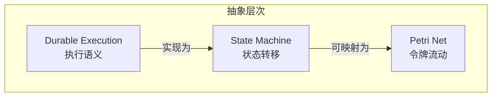
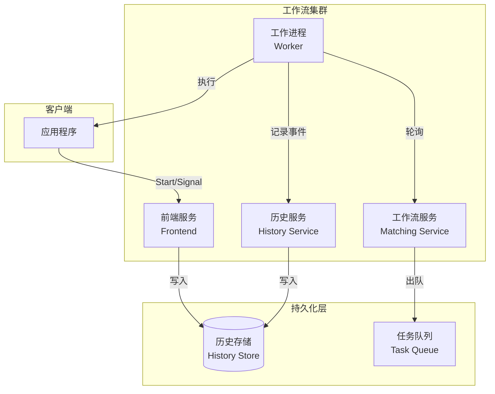

# Durable Execution (持久化执行)

## 概述

**Durable Execution**（持久化执行）是一种工作流执行语义，确保工作流的执行状态能够可靠地持久化存储，并在各种故障场景下能够从断点恢复。这一概念由 Temporal、Azure Durable Functions 等现代工作流引擎推广，是构建可靠分布式系统的核心抽象。

---

## 1. 核心定义

### 1.1 Durable Execution 语义

**定义 1.1** (Durable Execution): 一个执行是**持久的（durable）**，当且仅当满足：

1. **状态持久化**: 每个确定性操作的输入输出都被持久化记录
2. **故障恢复**: 执行可以在任何故障后从最后持久化点恢复
3. **幂等保证**: 重复执行相同操作产生相同结果
4. **透明重放**: 从持久化状态恢复时对应用程序透明

**形式化**:

设 $E$ 为执行过程，$H$ 为执行历史（history），则：

$$Durable(E) \iff \forall t, \exists H_t: Recover(E, H_t) = Continue(E, t)$$

其中 $H_t$ 是时间 $t$ 之前的执行历史，$Recover$ 是恢复函数。

### 1.2 执行历史 (Execution History)

**定义 1.2** (执行历史): 执行历史是一个有序事件序列：

$$H = [(e_1, r_1), (e_2, r_2), ..., (e_n, r_n)]$$

其中：

- $e_i$: 事件（活动调用、信号接收等）
- $r_i$: 事件结果
- 顺序关系: $e_i \prec e_{i+1}$

**历史事件类型**:

| 事件类型 | 描述 | 示例 |
|----------|------|------|
| **ActivityScheduled** | 计划执行活动 | 调用外部服务 |
| **ActivityCompleted** | 活动完成 | 收到服务响应 |
| **ActivityFailed** | 活动失败 | 调用异常 |
| **TimerStarted** | 启动定时器 | 延迟执行 |
| **TimerFired** | 定时器触发 | 超时处理 |
| **SignalReceived** | 收到信号 | 外部事件 |
| **MarkerRecorded** | 记录标记 | 本地状态 |

---

## 2. 可重入性 (Reentrancy)

### 2.1 可重入执行

**定义 2.1** (可重入性): 工作流代码是**可重入的**，当且仅当多次执行相同的历史产生相同的后续历史。

**形式化**:

$$Reentrant(W) \iff \forall H_1, H_2: H_1 = H_2 \implies Execute(W, H_1) = Execute(W, H_2)$$

### 2.2 确定性约束

为实现可重入性，工作流代码必须满足**确定性约束**：

| 约束 | 说明 | 示例 |
|------|------|------|
| **无随机** | 不使用随机数 | 使用 `workflow.SeededRandom()` |
| **无时间** | 不直接获取时间 | 使用 `workflow.Now()` |
| **无外部I/O** | 不直接网络调用 | 通过Activity封装 |
| **无并发** | 不原生并发 | 使用工作流提供的并发原语 |
| **无全局状态** | 不依赖可变全局状态 | 通过参数传递 |

### 2.3 重放机制

```
┌───────────────────────────────────────────────────────┐
│                    重放机制                            │
├───────────────────────────────────────────────────────┤
│                                                       │
│  1. 故障发生                                          │
│     ↓                                                 │
│  2. 从持久存储加载历史 H                              │
│     ↓                                                 │
│  3. 重新创建工作流实例                                │
│     ↓                                                 │
│  4. 重放历史：                                        │
│     for (event, result) in H:                         │
│         执行到对应点                                  │
│         用 result 替代实际调用                        │
│         （快速前进，不实际执行）                      │
│     ↓                                                 │
│  5. 到达故障点，继续新执行                            │
│                                                       │
└───────────────────────────────────────────────────────┘
```

---

## 3. 幂等性保证 (Idempotency Guarantees)

### 3.1 幂等性定义

**定义 3.1** (幂等性): 操作 $f$ 是幂等的，当且仅当：

$$\forall x: f(f(x)) = f(x)$$

### 3.2 幂等性级别

| 级别 | 保证范围 | 实现机制 |
|------|----------|----------|
| **Exactly-Once** | 语义上只执行一次 | 去重 + 幂等设计 |
| **At-Least-Once** | 至少执行一次 | 重试机制 |
| **At-Most-Once** | 最多执行一次 | 记录执行状态 |

### 3.3 幂等性实现策略

**1. 唯一标识去重**

```go
// 为每个操作分配唯一ID
operationID := workflow.GetInfo(ctx).WorkflowExecution.ID +
               "-" +
               strconv.Itoa(workflow.GetInfo(ctx).Attempt)

// 存储执行结果
if result, ok := checkCachedResult(operationID); ok {
    return result  // 直接返回缓存结果
}

result := executeActivity(ctx, activity, args)
cacheResult(operationID, result)
return result
```

**2. 业务幂等设计**

```go
// 幂等的支付处理
func ProcessPayment(ctx context.Context, req PaymentRequest) error {
    // 1. 检查是否已处理
    existing, err := db.GetPaymentByIdempotencyKey(req.IdempotencyKey)
    if err != nil {
        return err
    }
    if existing != nil {
        return nil  // 已处理，直接返回
    }

    // 2. 执行支付（带唯一键约束）
    return db.InsertPayment(req)
}
```

---

## 4. 容错机制 (Fault Tolerance)

### 4.1 故障类型与处理

| 故障类型 | 描述 | 处理策略 |
|----------|------|----------|
| **进程故障** | 工作流进程崩溃 | 从持久化历史恢复 |
| **网络故障** | 活动调用超时 | 指数退避重试 |
| **逻辑故障** | 业务异常 | Saga补偿 |
| **基础设施故障** | 存储不可用 | 多副本 + 故障转移 |

### 4.2 故障恢复流程



### 4.3 检查点 (Checkpointing)

**定义 4.1** (检查点): 检查点是执行历史的持久化快照。

**检查点策略**:

```
 eager-checkpoint: 每个事件后立即持久化
 lazy-checkpoint:  批量持久化
 periodic-checkpoint: 定时持久化
```

---

## 5. 与状态机的关系

### 5.1 Durable Execution 作为状态机

Durable Execution 可以看作是一个特殊的**状态机**：

- **状态**: 执行历史 $H$
- **事件**: 新的活动完成、定时器触发、信号接收
- **转移**: 从历史 $H$ 到 $H \cup \{e\}$
- **输出**: 执行中的副作用（Activity调用等）



### 5.2 层次关系



**关系说明**:

1. **Durable Execution ⊃ State Machine**
   - Durable Execution 在状态机基础上增加了持久化语义
   - 状态 = 执行历史，而非仅仅是当前状态

2. **State Machine ↔ Petri Net**
   - 状态机可以映射到Petri网（可达图构造）
   - Petri网也可以映射到状态机（可达状态作为状态机状态）

3. **Durable Execution + 工作流模式**
   - 使用Durable Execution实现工作流模式
   - Saga模式、并行分支、选择等都可以在DE框架下实现

---

## 6. 持久化执行实现

### 6.1 架构概览



### 6.2 核心组件

| 组件 | 职责 | 关键技术 |
|------|------|----------|
| **Frontend** | 接收API请求 | gRPC/HTTP |
| **History Service** | 管理执行历史 | 事件溯源 |
| **Matching Service** | 任务调度 | 一致性哈希 |
| **Worker** | 执行工作流和活动 | 沙箱执行 |
| **History Store** | 持久化历史 | 分布式DB |

### 6.3 代码示例

```go
// Durable Execution 示例（Temporal风格）

// 定义工作流
func OrderWorkflow(ctx workflow.Context, order Order) (Result, error) {
    // 1. 所有操作自动持久化

    // Activity调用会被记录到历史
    var confirmation PaymentConfirmation
    err := workflow.ExecuteActivity(ctx, ProcessPayment, order).Get(ctx, &confirmation)
    if err != nil {
        return Result{}, err
    }

    // 2. 定时器也被持久化
    // 即使工作流进程崩溃，定时器仍会在服务端保持
    timerCtx, _ := workflow.NewTimer(ctx, 24*time.Hour)
    selector := workflow.NewSelector(ctx)
    selector.AddFuture(timerCtx, func(f workflow.Future) {
        // 超时处理
    })
    selector.AddReceive(signalChan, func(c workflow.ReceiveChannel, more bool) {
        // 信号处理
    })
    selector.Select(ctx)

    // 3. 状态自动恢复
    // 工作流代码可以在任何点崩溃，恢复后从断点继续

    return Result{Status: "Completed"}, nil
}

// Activity 实现
func ProcessPayment(ctx context.Context, order Order) (PaymentConfirmation, error) {
    // Activity 可能被执行多次（重试）
    // 必须保证幂等性

    client := GetPaymentClient()
    result, err := client.Charge(order.PaymentInfo)

    return PaymentConfirmation{
        TransactionID: result.ID,
        Status:        result.Status,
    }, err
}
```

---

## 7. 一致性保证

### 7.1 一致性模型

Durable Execution 提供以下一致性保证：

| 保证 | 描述 | 实现 |
|------|------|------|
| **事件持久化** | 所有事件写入后才确认 | Write-Ahead Log |
| **顺序一致性** | 事件顺序严格保持 | 单分片序列化 |
| **故障原子性** | 检查点要么完成要么无 | 两阶段提交 |
| **最终可见性** | 历史更新最终可见 | 异步复制 |

### 7.2 与分布式事务的关系

```
Durable Execution vs 2PC:

2PC:
  - 协调者  → 参与者
  - Prepare → Commit/Rollback
  - 同步阻塞

Durable Execution:
  - 工作流引擎 → Activity执行
  - 记录历史 → 重试/补偿
  - 异步非阻塞
```

Durable Execution 可以与 Saga 模式结合，提供**持久化的 Saga** 实现。

---

## 8. 相关文档链接

- [Saga模式](Saga模式.md) - Durable Execution 实现 Saga
- [状态机模型](状态机模型.md) - DE的状态机视图
- [工作流网](工作流网.md) - 形式化基础
- [Temporal选型论证](../../03-TECHNOLOGY/论证/Temporal选型论证.md) - 具体实现分析

---

## 9. 参考资源

### 学术论文

1. **Bernstein, P.A., & Newcomer, E. (2009)**. "Principles of Transaction Processing". *Morgan Kaufmann*.
   - 事务处理原理，包括持久化技术

2. **Lomet, D., et al. (2015)**. "High Performance Transactions in Deuteronomy". *CIDR*.
   - 现代持久化事务系统设计

### 技术文档

- **Temporal Documentation**: <https://docs.temporal.io/>
  - Durable Execution 的工业实现

- **Azure Durable Functions**: <https://docs.microsoft.com/en-us/azure/azure-functions/durable/>
  - 另一种 Durable Execution 实现

- **Cadence Documentation**: <https://cadenceworkflow.io/>
  - Uber 开源的 Durable Execution 引擎

### 相关概念

- **Event Sourcing**: 事件溯源，Durable Execution 的存储基础
- **CQRS**: 命令查询职责分离
- **Actor Model**: 并发模型，与 Durable Execution 有相似之处

---

**文档版本**: 1.0
**最后更新**: 2026-03-18
**状态**: ✅ 完成
