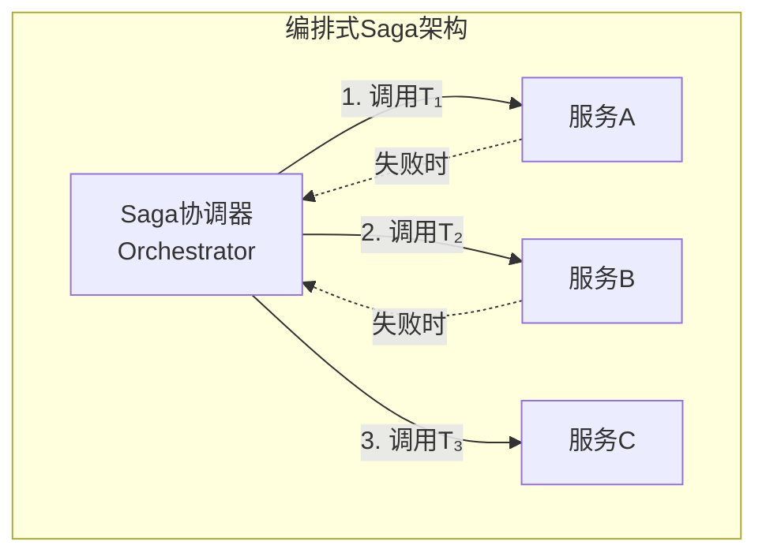
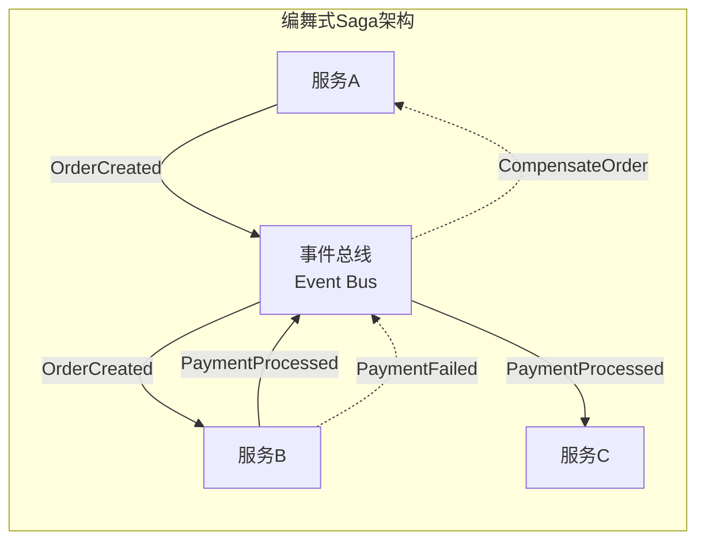

# Saga模式

## 概述

**Saga模式** 是一种用于管理分布式长事务（Long-Running Transaction）的设计模式，由 Hector Garcia-Molina 和 Kenneth Salem 于1987年提出。Saga通过将长事务分解为一系列本地事务，并使用**补偿操作（Compensation）**处理故障，在分布式系统中实现**最终一致性**。

---

## 1. 语义定义

### 1.1 Saga的形式化定义

**定义 1.1** (Saga): 一个Saga是一个四元组 $S = (T, C, \prec, S_0)$，其中：

- $T = \{T_1, T_2, ..., T_n\}$: 本地事务集合
- $C = \{C_1, C_2, ..., C_n\}$: 补偿操作集合，$C_i$ 对应 $T_i$
- $\prec$: 事务间的偏序关系（执行顺序）
- $S_0$: 初始状态

**定义 1.2** (执行语义): Saga的执行是事务序列的依次执行：

$$
\text{Execute}(S) = \begin{cases}
T_1; T_2; ...; T_n & \text{如果全部成功} \\
T_1; ...; T_k; C_k; C_{k-1}; ...; C_1 & \text{如果 } T_{k+1} \text{ 失败}
\end{cases}
$$

### 1.2 ACID特性对比

| 特性 | ACID事务 | Saga |
|------|----------|------|
| **原子性** | 强原子性 (All or Nothing) | 弱原子性 (通过补偿实现) |
| **一致性** | 强一致性 | 最终一致性 |
| **隔离性** | 可序列化 | 无隔离性 (可见中间状态) |
| **持久性** | 持久保存 | 持久保存 |

### 1.3 补偿操作

**定义 1.3** (补偿操作): 对于事务 $T_i$，其补偿操作 $C_i$ 是一个函数：

$$C_i: State \rightarrow State$$

满足语义约束：
$$C_i(StateAfter(T_i)) \approx StateBefore(T_i)$$

**补偿操作的要求**:

1. **幂等性**: $C_i(C_i(s)) = C_i(s)$
2. **可重试性**: 补偿失败后可重试
3. **语义正确性**: 业务上撤销原操作的效果

---

## 2. 编排式实现 (Orchestration)

### 2.1 架构

**编排式Saga** 使用中央协调器（Orchestrator/Saga Coordinator）控制整个事务流程。



### 2.2 执行流程

```
协调器执行流程:
┌─────────────────────────────────────────────────────┐
│ for i = 1 to n:                                     │
│   result = execute(Tᵢ)                              │
│   if result == FAIL:                                │
│     for j = i-1 downto 1:                           │
│       retry_until_success(Cⱼ)  // 反向补偿          │
│     return FAILURE                                  │
│ return SUCCESS                                      │
└─────────────────────────────────────────────────────┘
```

### 2.3 代码示例 (Temporal风格)

```go
// OrderSaga - 订单处理Saga（编排式）
func OrderSagaWorkflow(ctx workflow.Context, order Order) error {
    // 配置选项
    ao := workflow.ActivityOptions{
        StartToCloseTimeout: 10 * time.Second,
    }
    ctx = workflow.WithActivityOptions(ctx, ao)

    // Saga补偿函数列表
    var compensations []func() error

    // 延迟执行补偿
    defer func() {
        if err := recover(); err != nil {
            // 反向执行补偿
            for i := len(compensations) - 1; i >= 0; i-- {
                compensations[i]()
            }
        }
    }()

    // 1. 创建订单
    var orderID string
    err := workflow.ExecuteActivity(ctx, CreateOrder, order).Get(ctx, &orderID)
    if err != nil {
        return err
    }
    compensations = append(compensations, func() error {
        return workflow.ExecuteActivity(ctx, CancelOrder, orderID).Get(ctx, nil)
    })

    // 2. 扣减库存
    err = workflow.ExecuteActivity(ctx, ReserveInventory, order).Get(ctx, nil)
    if err != nil {
        panic(err)  // 触发补偿
    }
    compensations = append(compensations, func() error {
        return workflow.ExecuteActivity(ctx, ReleaseInventory, order).Get(ctx, nil)
    })

    // 3. 处理支付
    err = workflow.ExecuteActivity(ctx, ProcessPayment, order).Get(ctx, nil)
    if err != nil {
        panic(err)  // 触发补偿
    }
    compensations = append(compensations, func() error {
        return workflow.ExecuteActivity(ctx, RefundPayment, order).Get(ctx, nil)
    })

    return nil
}
```

### 2.4 编排式的优缺点

| 优点 | 缺点 |
|------|------|
| 流程清晰可见 | 协调器成为单点 |
| 易于监控和调试 | 集中式复杂度 |
| 业务逻辑集中 | 服务间紧耦合到协调器 |
| 易于实现补偿顺序 | 协调器需要高可用 |

---

## 3. 编舞式实现 (Choreography)

### 3.1 架构

**编舞式Saga** 没有中央协调器，各服务通过**事件**进行协调。



### 3.2 事件流

**正常流程**:

```
订单服务      库存服务      支付服务
   |             |             |
   |--T1完成---->|             |
   |   [OrderCreated]          |
   |             |--T2完成---->|
   |             | [InventoryReserved]
   |             |             |--T3完成
   |             |             | [PaymentProcessed]
   |<------------|-------------| [OrderCompleted]
```

**补偿流程**:

```
订单服务      库存服务      支付服务
   |             |             |
   |             |             | T3失败
   |             |<------------| [PaymentFailed]
   |<------------| [ReleaseInventory]
   | [CancelOrder]
```

### 3.3 代码示例

```go
// 服务A: 订单服务
func OrderServiceHandler(event Event) {
    switch event.Type {
    case "CreateOrderRequest":
        // 执行T1: 创建订单
        order, err := createOrder(event.Data)
        if err != nil {
            return
        }
        // 发布事件
        publish(Event{
            Type: "OrderCreated",
            Data: order,
        })

    case "PaymentFailed":
        // 执行C1: 补偿（取消订单）
        orderID := event.Data.OrderID
        cancelOrder(orderID)  // 幂等操作
    }
}

// 服务B: 库存服务
func InventoryServiceHandler(event Event) {
    switch event.Type {
    case "OrderCreated":
        // 执行T2: 扣减库存
        err := reserveInventory(event.Data)
        if err != nil {
            publish(Event{Type: "InventoryFailed", ...})
            return
        }
        publish(Event{Type: "InventoryReserved", ...})

    case "PaymentFailed":
        // 执行C2: 补偿（释放库存）
        releaseInventory(event.Data.OrderID)  // 幂等操作
    }
}

// 服务C: 支付服务
func PaymentServiceHandler(event Event) {
    switch event.Type {
    case "InventoryReserved":
        // 执行T3: 处理支付
        err := processPayment(event.Data)
        if err != nil {
            publish(Event{Type: "PaymentFailed", ...})
            return
        }
        publish(Event{Type: "PaymentProcessed", ...})
    }
}
```

### 3.4 编舞式的优缺点

| 优点 | 缺点 |
|------|------|
| 松耦合 | 流程分散难追踪 |
| 无单点故障 | 业务逻辑分散 |
| 服务自治 | 难以保证补偿顺序 |
| 易于扩展 | 循环依赖风险 |

---

## 4. 编排式 vs 编舞式对比

| 特性 | Orchestration | Choreography |
|------|---------------|--------------|
| **耦合度** | 服务与协调器耦合 | 服务间松耦合 |
| **可理解性** | ⭐⭐⭐⭐⭐ | ⭐⭐⭐ |
| **可测试性** | ⭐⭐⭐⭐ | ⭐⭐ |
| **可扩展性** | ⭐⭐⭐ | ⭐⭐⭐⭐⭐ |
| **故障隔离** | 协调器是热点 | 分布式故障 |
| **复杂度** | 集中式复杂 | 分布式复杂 |
| **适用规模** | 中小型 | 大型 |

---

## 5. 补偿机制设计

### 5.1 补偿设计原则

**1. 幂等性设计**

```go
// 幂等的补偿操作
func CancelOrderCompensation(orderID string) error {
    // 1. 检查是否已补偿
    status := getOrderStatus(orderID)
    if status == "CANCELLED" {
        return nil  // 已取消，幂等返回
    }

    // 2. 记录补偿日志（去重）
    err := compensationLog.Log("cancel_order", orderID)
    if err != nil {
        return err  // 已记录，跳过
    }

    // 3. 执行补偿
    return updateOrderStatus(orderID, "CANCELLED")
}
```

**2. 补偿粒度**

| 粒度 | 示例 | 适用场景 |
|------|------|----------|
| 粗粒度 | 取消整个订单 | 简单场景 |
| 细粒度 | 逐项撤销 | 复杂订单 |
| 混合 | 部分撤销+重新计算 | 优惠、积分 |

**3. 不可补偿操作**

某些操作无法补偿，需要特殊处理：

- **发送邮件**: 已发送无法撤回
- **物理发货**: 货已发出无法取消
- **第三方调用**: 外部系统无补偿接口

**处理策略**:

1. **预检查**: 执行前检查是否可补偿
2. **延迟执行**: 将不可补偿操作放在最后
3. **人工介入**: 记录异常等待人工处理

### 5.2 补偿执行顺序

```
正向执行: T1 → T2 → T3 → T4 → T5
           ↓   ↓   ↓   ↓   ↓
补偿操作: C1 ← C2 ← C3 ← C4 ← C5

如果 T4 失败:
执行: C3 → C2 → C1
```

**关键规则**: 补偿必须按正向执行的**逆序**进行。

---

## 6. 与2PC的对比

### 6.1 两阶段提交 (2PC)

```
阶段1 - 准备:
协调器 → 询问所有参与者是否可以提交
参与者 → 锁定资源，回复 Yes/No

阶段2 - 提交/回滚:
如果全部Yes → 协调器发送Commit
如果任一个No → 协调器发送Rollback
```

### 6.2 Saga vs 2PC

| 特性 | 2PC | Saga |
|------|-----|------|
| **一致性** | 强一致性 | 最终一致性 |
| **隔离性** | 可序列化 | 无隔离性 |
| **阻塞** | 准备阶段阻塞 | 非阻塞 |
| **持久化** | 协调器状态 | 事件/状态日志 |
| **故障恢复** | 复杂 | 通过补偿 |
| **性能** | 低（锁竞争） | 高（无锁） |
| **复杂度** | 协议复杂 | 业务复杂 |
| **适用场景** | 短事务 | 长事务 |

### 6.3 选择决策树

```
需要强一致性?
├── 是 → 使用2PC/TCC
└── 否 → 事务执行时间长?
    ├── 是 → 使用Saga
    └── 否 → 使用本地事务
```

---

## 7. Saga的正确性

### 7.1 最终一致性定理

**定理**: 如果所有补偿操作满足：

1. **幂等性**: $\forall C_i: C_i \circ C_i = C_i$
2. **终止性**: 补偿操作最终成功
3. **语义正确性**: $C_i$ 正确撤销 $T_i$

则Saga保证**最终一致性**。

**证明概要**:

- 情况1: 全部成功 → 最终状态一致
- 情况2: $T_k$ 失败 → 执行 $C_{k-1}, ..., C_1$ → 回到初始状态
- 情况3: 补偿失败 → 重试（幂等保证安全）→ 最终成功

### 7.2 语义异常

Saga存在隔离性异常：

| 异常类型 | 描述 | 缓解策略 |
|----------|------|----------|
| **脏读** | 读取未提交的中间状态 | 业务语义设计 |
| **丢失更新** | 覆盖其他Saga的中间结果 | 乐观锁/版本控制 |
| **不可重复读** | 多次读取结果不同 | 业务容忍/补偿 |

---

## 8. 相关文档链接

- [工作流网](工作流网.md) - Saga的Petri网建模
- [工作流模式](工作流模式.md) - Saga作为取消模式
- [状态机模型](状态机模型.md) - Saga状态机视图
- [Durable Execution](Durable-Execution.md) - Saga的持久化实现
- [CAP定理专题文档](../../02-THEORY/distributed-systems/CAP定理专题文档.md) - 分布式理论基础
- [一致性模型专题文档](../../02-THEORY/distributed-systems/一致性模型专题文档.md) - 最终一致性

---

## 9. 参考资源

### 原始论文

1. **Garcia-Molina, H., & Salem, K. (1987)**. "Sagas". *ACM SIGMOD Conference*, pp.249-259.
   - Saga模式的原始论文

2. **Richardson, C. (2018)**. "Microservices Patterns". *Manning Publications*.
   - 第4章详细介绍了Saga模式

3. **J. S. R. (2020)**. "Implementing Saga Pattern with Temporal". *Temporal Blog*.
   - Temporal工作流引擎中的Saga实现

### 在线资源

- [Microservices.io - Saga Pattern](https://microservices.io/patterns/data/saga.html)
- [AWS Blog: Saga Pattern](https://aws.amazon.com/blogs/compute/building-a-serverless-distributed-application-using-a-saga-orchestration-pattern/)
- [Microsoft Docs: Saga](https://docs.microsoft.com/en-us/azure/architecture/reference-architectures/saga/saga)

### 开源实现

- **Temporal**: `workflow.SetQueryHandler` + 补偿列表
- **Axon Framework**: `@SagaEventHandler` 注解支持
- **Seata**: Alibaba开源的分布式事务框架，支持Saga模式
- **Eventuate**: 事件溯源框架，支持Saga

---

**文档版本**: 1.0
**最后更新**: 2026-03-18
**状态**: ✅ 完成
