# 工作流模式 (Workflow Patterns)

## 概述

**工作流模式** 是描述工作流系统功能的标准化模式集合，由 Wil van der Aalst 等人于2003年提出。该框架通过系统性地分类和描述工作流系统的各种行为特征，为工作流语言、引擎和系统的设计与评估提供了基准。

---

## 1. 模式分类体系

工作流模式分为三大类：

1. **控制流模式** (Control Flow Patterns) - 43个模式
2. **数据模式** (Data Patterns) - 40个模式
3. **资源模式** (Resource Patterns) - 43个模式

本文档重点介绍**43个控制流模式**。

---

## 2. 基本控制流模式 (Basic Control Patterns)

### 2.1 顺序模式 (Sequence) - Pattern 1

**描述**: 活动按顺序执行，前一个活动完成后才能启动下一个。

**形式化**:
$$Sequence(A, B): A \rightarrow B$$

**语义**: $\forall e_A, e_B: Complete(e_A) \prec Start(e_B)$


---

### 2.2 并行分支 (Parallel Split) - Pattern 2

**描述**: 一个活动完成后，多个后续活动并行启动。

**形式化**:
$$ParallelSplit(A, \{B_1, B_2, ..., B_n\}): A \rightarrow (B_1 \parallel B_2 \parallel ... \parallel B_n)$$

**语义**: $\forall i: Complete(A) \prec Start(B_i)$

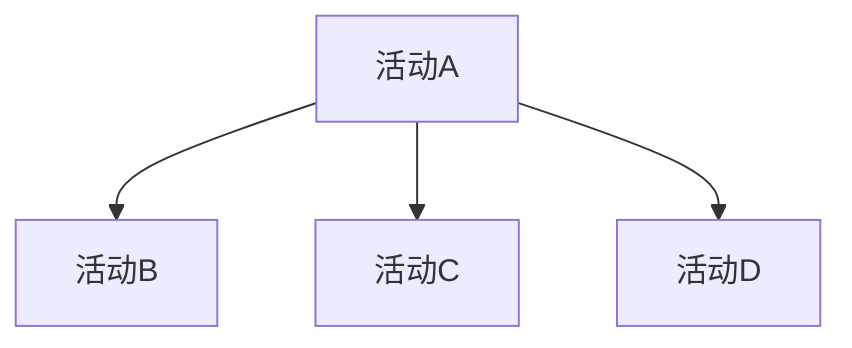

---

### 2.3 同步 (Synchronization) - Pattern 3

**描述**: 多个并行活动都完成后，才能启动后续活动。

**形式化**:
$$Synchronization(\{A_1, A_2, ..., A_n\}, B): (A_1 \land A_2 \land ... \land A_n) \rightarrow B$$

**语义**: $(\forall i: Complete(A_i)) \prec Start(B)$

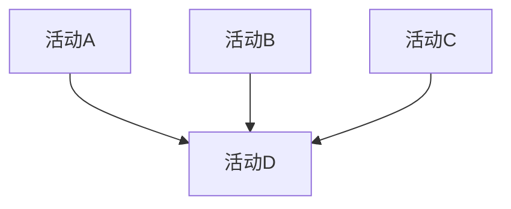

---

### 2.4 排他选择 (Exclusive Choice) - Pattern 4

**描述**: 根据条件，从多条路径中选择一条执行。

**形式化**:
$$ExclusiveChoice(A, \{B_1, B_2, ..., B_n\}, \{c_1, c_2, ..., c_n\}): A \xrightarrow{c_i} B_i$$

**语义**: $\exists! i: c_i(A) = true \land Complete(A) \prec Start(B_i)$

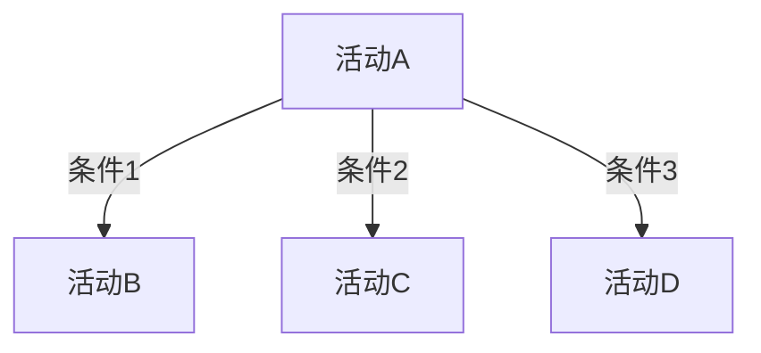

---

### 2.5 简单合并 (Simple Merge) - Pattern 5

**描述**: 多条备选路径汇聚，无需同步（假设路径互斥）。

**形式化**:
$$SimpleMerge(\{A_1, A_2, ..., A_n\}, B): (\bigvee_i Complete(A_i)) \prec Start(B)$$

**语义**: 任一 $A_i$ 完成即可启动 $B$

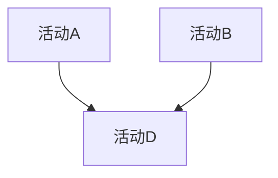

---

## 3. 高级分支与同步模式

### 3.1 多选择 (Multi-Choice) - Pattern 6

**描述**: 根据条件，可能选择多条路径并行执行。

**形式化**:
$$MultiChoice(A, \{B_1, ..., B_n\}, \{c_1, ..., c_n\}): A \xrightarrow{c_i} B_i \text{ (多条件可为真)}$$

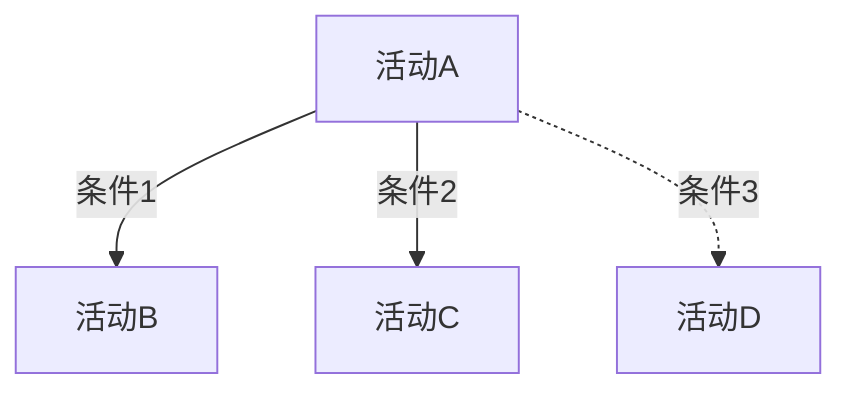

---

### 3.2 同步合并 (Synchronizing Merge) - Pattern 7

**描述**: 合并多个路径，仅等待实际激活的路径完成。

**与简单合并的区别**: 需要知道哪些分支被实际选择了。

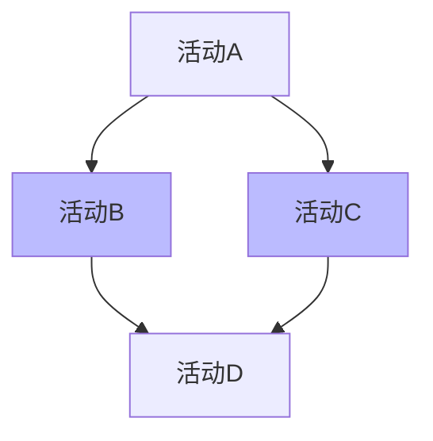

---

### 3.3 多合并 (Multi-Merge) - Pattern 8

**描述**: 每个输入路径到达都触发一次后续活动。

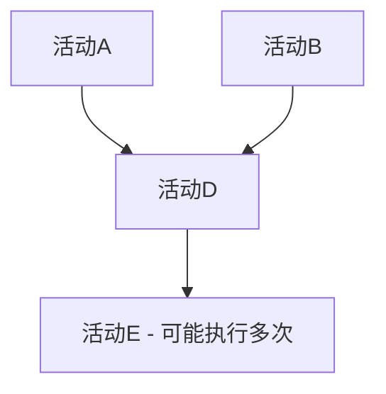

---

### 3.4 鉴别器 (Discriminator) - Pattern 9

**描述**: 多个并行活动，第一个完成后继续，其余忽略。

**语义**: $FirstComplete(\{A_1, ..., A_n\}) \prec Start(B)$

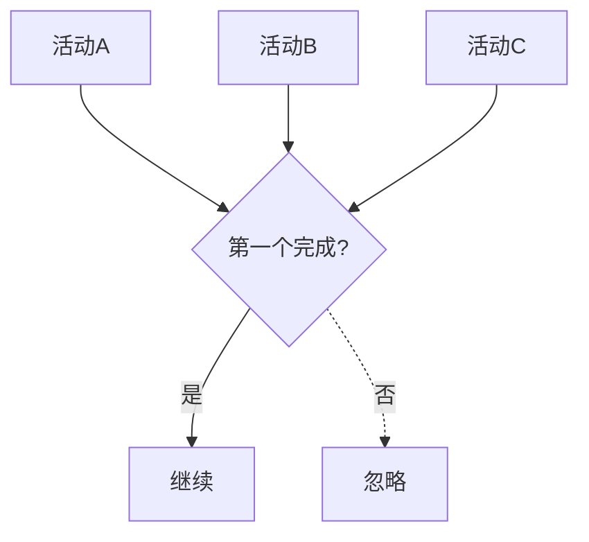

---

### 3.5 部分合并 (Partial Join) - Pattern 10

**描述**: $N$ 个输入中 $M$ 个完成后即可继续。

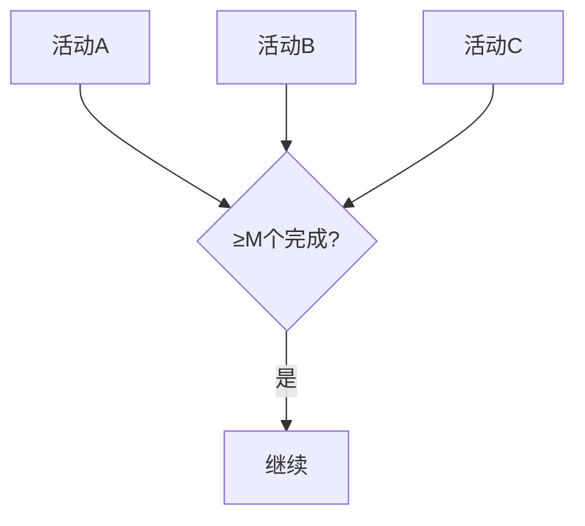

---

## 4. 多实例模式 (Multiple Instances)

### 4.1 设计时确定多实例 - Pattern 12

**描述**: 活动实例数量在设计时已知。

```
for i = 1 to N:
    create Activity(i)
wait for all
```

### 4.2 运行时确定多实例 - Pattern 13

**描述**: 活动实例数量在运行时确定。

```
N = calculate_instances()
for i = 1 to N:
    create Activity(i)
wait for all
```

### 4.3 运行时动态多实例 - Pattern 14

**描述**: 实例可在执行过程中动态创建。

```
while (condition):
    create Activity()
wait for all
```

---

## 5. 状态模式 (State Patterns)

### 5.1 延迟选择 (Deferred Choice) - Pattern 16

**描述**: 选择由外部事件决定，而非预设条件。

**应用场景**: 用户交互、外部信号等待

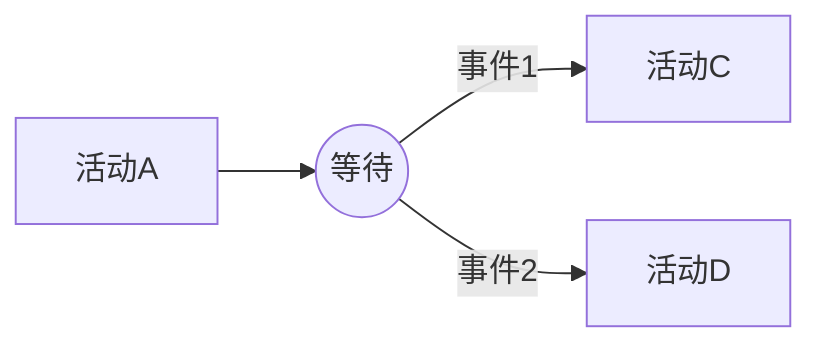

---

### 5.2 交错并行路由 (Interleaved Parallel Routing) - Pattern 17

**描述**: 活动可任意顺序执行，但不能同时执行（互斥）。

**形式化**: $\forall A, B \in S: \neg(Executing(A) \land Executing(B))$

---

### 5.3 里程碑 (Milestone) - Pattern 18

**描述**: 活动能否执行取决于某个状态是否达成。

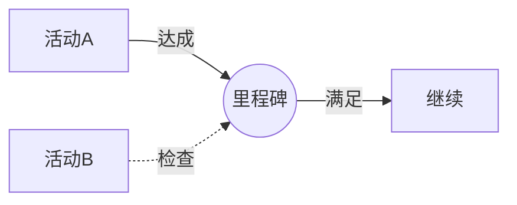

---

## 6. 取消模式 (Cancellation Patterns)

### 6.1 取消任务 (Cancel Task) - Pattern 19

**描述**: 使一个已启用的活动失效。

### 6.2 取消案例 (Cancel Case) - Pattern 20

**描述**: 强制终止整个工作流实例。

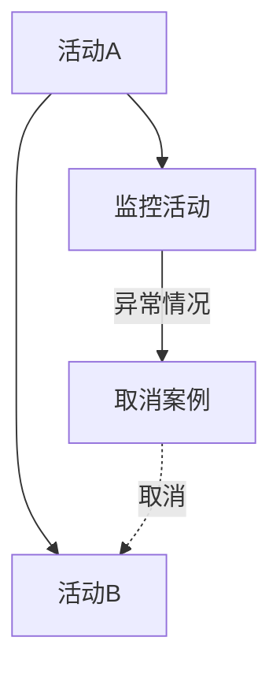

---

## 7. 迭代模式 (Iteration Patterns)

### 7.1 结构化循环 (Structured Loop) - Pattern 10

**描述**: WHILE/REPEAT循环结构。

**形式化**:

```
WHILE condition DO
    Activity
END WHILE
```

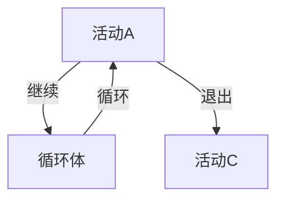

---

### 7.2 任意循环 (Arbitrary Cycles) - Pattern 10

**描述**: 非结构化的循环（GOTO风格）。

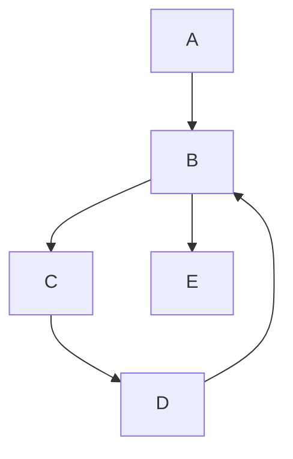

---

## 8. 终止模式 (Termination Patterns)

### 8.1 隐式终止 (Implicit Termination) - Pattern 11

**描述**: 当所有活动都完成且无法继续时终止。

### 8.2 显式终止 (Explicit Termination) - Pattern 42

**描述**: 需要显式的结束活动。

---

## 9. 43个控制流模式总览

| 类别 | 编号 | 模式名称 | 复杂度 |
|------|------|----------|--------|
| **基本** | 1 | Sequence | ⭐ |
| | 2 | Parallel Split | ⭐ |
| | 3 | Synchronization | ⭐ |
| | 4 | Exclusive Choice | ⭐ |
| | 5 | Simple Merge | ⭐ |
| **高级分支** | 6 | Multi-Choice | ⭐⭐ |
| | 7 | Synchronizing Merge | ⭐⭐⭐ |
| | 8 | Multi-Merge | ⭐⭐ |
| | 9 | Discriminator | ⭐⭐ |
| | 10 | Partial Join | ⭐⭐⭐ |
| | 15 | Structured Loop | ⭐⭐ |
| **多实例** | 12 | MI Design-time | ⭐⭐ |
| | 13 | MI Run-time | ⭐⭐ |
| | 14 | MI Dynamic | ⭐⭐⭐ |
| **状态** | 16 | Deferred Choice | ⭐⭐ |
| | 17 | Interleaved Routing | ⭐⭐⭐ |
| | 18 | Milestone | ⭐⭐ |
| **取消** | 19 | Cancel Task | ⭐⭐ |
| | 20 | Cancel Case | ⭐⭐ |
| **终止** | 11 | Implicit Termination | ⭐ |
| | 42 | Explicit Termination | ⭐ |
| **其他** | 21-41 | 其他高级模式 | ⭐⭐-⭐⭐⭐ |

---

## 10. 模式的形式化语义

### 10.1 基于Petri网的语义

```
Sequence(A, B):     A → p → B
ParallelSplit:      A → (B || C || ...)
Synchronization:    (A && B && ...) → C
ExclusiveChoice:    A --|cond|--> B
```

### 10.2 基于Pi-演算的语义

**顺序**: $A.B$

**并行**: $A | B$

**选择**: $A + B$

---

## 11. 模式的应用与评估

### 11.1 工作流系统评估框架

使用模式评估工作流系统的能力：

| 系统 | 基本模式 | 高级模式 | 多实例 | 取消 | 总分 |
|------|---------|---------|--------|------|------|
| BPMN | 5/5 | 8/10 | 3/3 | 2/2 | 18/20 |
| Temporal | 5/5 | 9/10 | 3/3 | 2/2 | 19/20 |
| Airflow | 5/5 | 5/10 | 2/3 | 1/2 | 13/20 |

### 11.2 模式选择决策树

```
需要并行执行?
├── 否 → 顺序
└── 是 → 需要全部完成?
    ├── 是 → 同步 (Synchronization)
    └── 否 → 需要选择?
        ├── 是 → 排他选择 / 多选择
        └── 否 → 鉴别器 / 部分合并
```

---

## 12. 相关文档链接

- [工作流网](工作流网.md) - 模式的Petri网基础
- [Saga模式](Saga模式.md) - 分布式事务模式
- [状态机模型](状态机模型.md) - 状态机视角的模式
- [Petri网专题文档](../../02-THEORY/formal-verification/Petri网专题文档.md) - 形式化基础

---

## 13. 参考资源

### 原始论文

1. **van der Aalst, W.M.P., ter Hofstede, A.H.M., Kiepuszewski, B., & Barros, A.P. (2003)**. "Workflow Patterns". *Distributed and Parallel Databases*, 14(1):5-51.
   - 43个控制流模式的原始论文

2. **Russell, N., ter Hofstede, A.H.M., van der Aalst, W.M.P., & Mulyar, N. (2006)**. "Workflow Control-Flow Patterns: A Revised View". *BPM Center Report*.
   - 修订版模式

3. **Russell, N., ter Hofstede, A.H.M., Edmond, D., & van der Aalst, W.M.P. (2005)**. "Workflow Data Patterns". *ER 2005*.
   - 40个数据模式

4. **Russell, N., van der Aalst, W.M.P., ter Hofstede, A.H.M., & Edmond, D. (2005)**. "Workflow Resource Patterns". *ER 2005*.
   - 43个资源模式

### 在线资源

- [Workflow Patterns Website](http://www.workflowpatterns.com/) - 官方网站
- [Pattern Library](http://www.workflowpatterns.com/patterns/control/) - 交互式模式库

---

**文档版本**: 1.0
**最后更新**: 2026-03-18
**状态**: ✅ 完成
