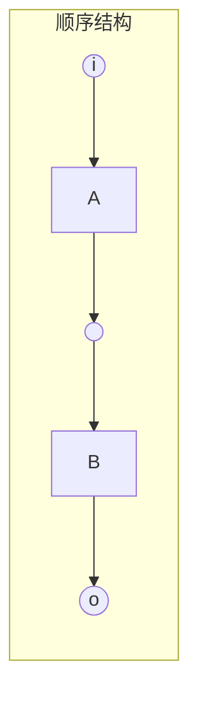
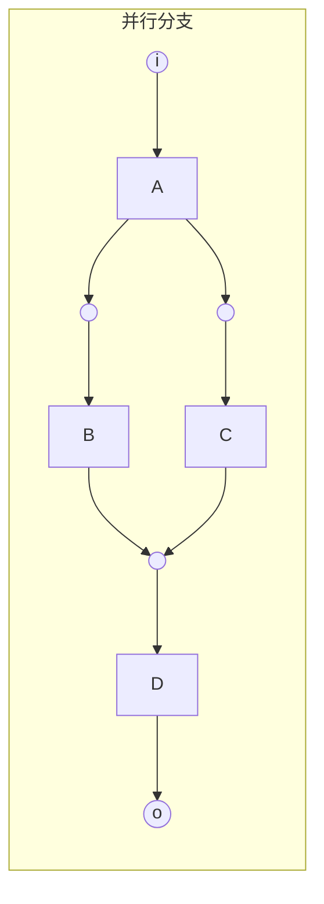
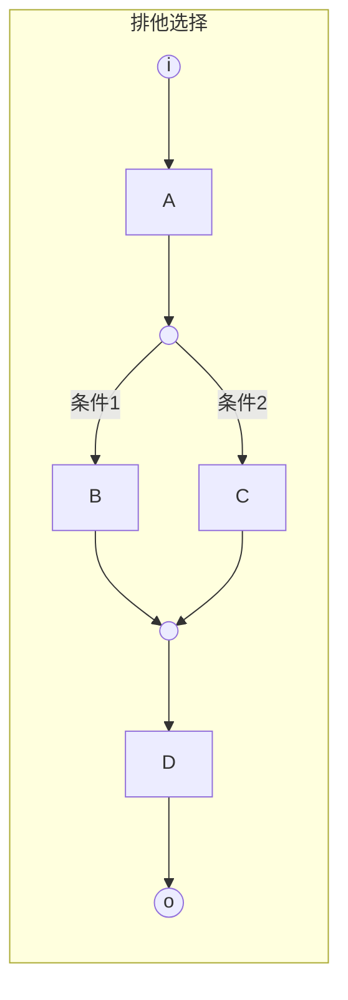
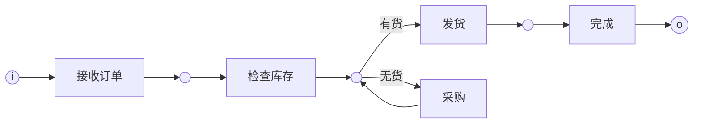
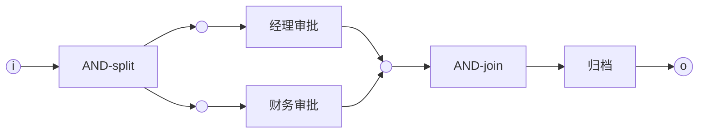

# 工作流网 (Workflow Net)

## 概述

**工作流网（Workflow Net, WF-net）** 是Petri网在工作流领域的特殊化形式，由Wil van der Aalst于1998年提出。它为业务流程的形式化建模和分析提供了严格的数学基础。

---

## 1. 形式化定义

### 1.1 WF-net定义

**定义 1.1** (Workflow Net): 一个Petri网 $N = (P, T, F, M_0)$ 称为**工作流网**，当且仅当满足以下条件：

1. **单一入口**: 存在唯一的源库所 $i \in P$，使得 $\bullet i = \emptyset$（没有输入转换）
2. **单一出口**: 存在唯一的汇库所 $o \in P$，使得 $o \bullet = \emptyset$（没有输出转换）
3. **强连通性**: 若添加一个新转换 $t^*$，使得 $t^*$ 的输入为 $\{o\}$、输出为 $\{i\}$，则扩展后的网是强连通的

**形式化表述**:

$$WF\text{-}net(N) \iff \exists! i, o \in P: \bullet i = \emptyset \land o \bullet = \emptyset \land SC(N^*)$$

其中 $N^* = (P, T \cup \{t^*\}, F \cup \{(o, t^*), (t^*, i)\}, M_0)$，$SC$ 表示强连通。

### 1.2 扩展工作流网

**定义 1.2** (Extended Workflow Net): 工作流网 $N$ 的**扩展工作流网** $N^*$ 定义为：

$$N^* = (P, T \cup \{t^*\}, F \cup \{(o, t^*), (t^*, i)\}, M_0)$$

其中 $t^*$ 是一个额外的"短路"转换，连接输出库所 $o$ 到输入库所 $i$。

---

## 2. 正确性准则

### 2.1 Soundness (安全性/合理性)

**定义 2.1** (Soundness): 工作流网 $N$ 是**正确的（sound）**，当且仅当满足以下三个条件：

#### 2.1.1 正确完成 (Proper Completion)

**条件**: 从初始标识 $M_0 = [i]$（仅在 $i$ 处有一个令牌）出发，总可以到达终止标识 $M_f = [o]$（仅在 $o$ 处有一个令牌）。

**形式化**:
$$\forall M_0 = [i]: \exists M_f = [o]: M_0 \xrightarrow{*} M_f$$

#### 2.1.2 活性 (Liveness / 无死锁)

**条件**: 不存在死锁状态，即从任何可达标识，要么可以到达终止标识，要么可以继续执行。

**形式化**:
$$\forall M \in R(M_0): M = [o] \lor \exists t \in T: M \xrightarrow{t}$$

#### 2.1.3 无残留 (No Orphan Tokens)

**条件**: 当到达终止标识时，所有库所（除 $o$ 外）都不包含令牌。

**形式化**:
$$M_0 \xrightarrow{*} M \land M \ge [o] \implies M = [o]$$

### 2.2 Soundness的完整定义

$$Sound(N) \iff ProperCompletion(N) \land Liveness(N) \land NoOrphanTokens(N)$$

---

## 3. 核心定理

### 定理 3.1 (Soundness与活性和有界性的关系)

**定理**: 工作流网 $N$ 是sound的，当且仅当扩展工作流网 $N^*$ 是**活的（live）**和**有界的（bounded）**。

**形式化**:
$$Sound(N) \iff Live(N^*) \land Bounded(N^*)$$

**证明概要**:

**($\Rightarrow$) 必要性**:

- 若 $N$ 是sound的，则从任意可达标识都可到达 $[o]$
- $t^*$ 在 $[o]$ 处可触发，回到 $[i]$，因此 $N^*$ 是活的
- $N$ 的无残留性质保证 $N^*$ 是有界的

**($\Leftarrow$) 充分性**:

- $N^*$ 的活性保证从 $[i]$ 可达 $[o]$
- $N^*$ 的有界性保证 $N$ 满足无残留条件
- 因此 $N$ 满足所有soundness条件

---

## 4. 工作流网的构建方法

### 4.1 基本构建块







### 4.2 结构化构建规则

| 模式 | 构建规则 | Petri网表示 |
|------|----------|-------------|
| **顺序** | $A \rightarrow B$ | 库所连接两个转换 |
| **AND-split** | $A$ 后并行启动 $B$ 和 $C$ | 一个转换输出到多个库所 |
| **AND-join** | $B$ 和 $C$ 都完成后执行 $D$ | 多个库所输入到一个转换 |
| **OR-split** | 根据条件选择一条路径 | 一个库所输出到多个转换（冲突） |
| **OR-join** | 任一路径到达后继续 | 多个转换输出到一个库所 |

### 4.3 良构工作流网 (Well-Structured WF-net)

**定义**: 通过以下**块结构**组合规则构建的工作流网：

1. **顺序组合**: $N_1 \circ N_2$（$N_1$ 的出口连接 $N_2$ 的入口）
2. **并行组合**: $N_1 \parallel N_2$（AND-split 和 AND-join 包装）
3. **选择组合**: $N_1 \diamond N_2$（OR-split 和 OR-join 包装）
4. **循环**: $N^*$（在循环体前后添加条件判断）

**定理**: 所有良构工作流网都是 sound 的。

---

## 5. 与Petri网的关系

### 5.1 层次关系

```mermaid
graph TD
    A[Petri网<br/>N = (P, T, F, M₀)] --> B[工作流网<br/>单一入口/出口]
    B --> C[良构WF-net<br/>块结构构建]
    B --> D[自由选项WF-net<br/>选择结构限制]
    C --> E[顺序WF-net<br/>无并行]
```

### 5.2 性质对比

| 性质 | 一般Petri网 | 工作流网 |
|------|------------|----------|
| **有界性** | 可判定，但复杂 | 隐含于结构 |
| **活性** | 可判定 | 等价于Soundness |
| **可达性** | 可判定 | 多项式时间（对良构WF-net）|
| **死锁** | 需要分析 | 结构避免（良构） |

### 5.3 从WF-net到Petri网

**转换方法**: 任何WF-net都是Petri网的实例，因此：

- 继承所有Petri网的分析技术
- 可以使用Petri网工具进行验证
- 可以使用状态空间分析、模型检测等方法

---

## 6. 验证算法

### 6.1 Soundness验证

```algorithm
VerifySoundness(N):
输入: 工作流网 N = (P, T, F, M₀)
输出: 是否满足Soundness

1. 构造扩展工作流网 N*
2. 检查 Live(N*):
   - 使用可达性分析检查每个转换是否可从任意标识触发
3. 检查 Bounded(N*):
   - 检查每个库所的令牌数是否有界
4. 返回 Live(N*) ∧ Bounded(N*)
```

### 6.2 复杂度分析

| 验证问题 | 复杂度 | 备注 |
|---------|--------|------|
| **Soundness** | PSPACE-complete | 一般WF-net |
| **良构性检查** | O(\|P\| + \|T\|) | 线性时间 |
| **可达性** | PSPACE-complete | 一般Petri网 |
| **死锁检测** | PSPACE-complete | 一般Petri网 |

---

## 7. 示例

### 7.1 简单订单处理流程



**验证**:

- 单一入口: i
- 单一出口: o
- Soundness: 可以通过扩展后验证活性和有界性

### 7.2 并行审批流程



---

## 8. 相关文档链接

- [工作流模式](工作流模式.md) - 工作流网支持的控制流模式
- [Petri网专题文档](../../02-THEORY/formal-verification/Petri网专题文档.md) - 基础理论
- [Saga模式](Saga模式.md) - 分布式长事务
- [状态机模型](状态机模型.md) - 替代建模方法
- [Durable Execution](Durable-Execution.md) - 持久化执行语义

---

## 9. 参考资源

### 经典论文

1. **van der Aalst, W.M.P. (1998)**. "The Application of Petri Nets to Workflow Management". *Journal of Circuits, Systems and Computers*, 8(1):21-66.
   - 工作流网的原始论文，定义了WF-net和Soundness

2. **van der Aalst, W.M.P. (1997)**. "Verification of Workflow Nets". *Application and Theory of Petri Nets*, LNCS 1248:407-426.
   - Soundness验证算法

3. **Desel, J. & Esparza, J. (1995)**. "Free Choice Petri Nets". *Cambridge University Press*.
   - 自由选项Petri网理论，与WF-net密切相关

### 在线资源

- [Workflow Patterns](http://www.workflowpatterns.com/) - 工作流模式网站
- [Wikipedia: Petri Net](https://en.wikipedia.org/wiki/Petri_net)
- [Wikipedia: Workflow](https://en.wikipedia.org/wiki/Workflow)

### 工具

- **Woflan**: WF-net验证工具
- **ProM**: 过程挖掘框架，支持WF-net分析
- **PIPE**: Petri网建模和分析工具

---

**文档版本**: 1.0
**最后更新**: 2026-03-18
**状态**: ✅ 完成
