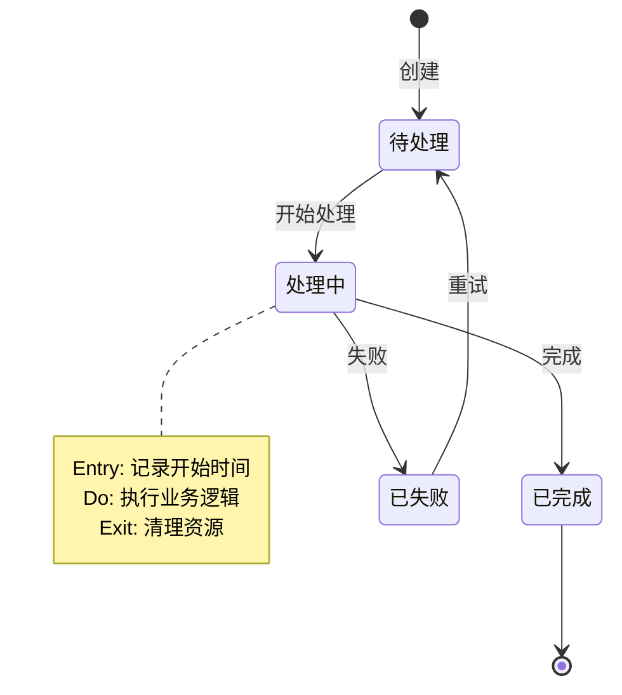
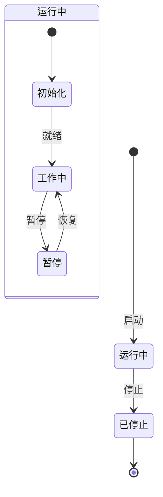
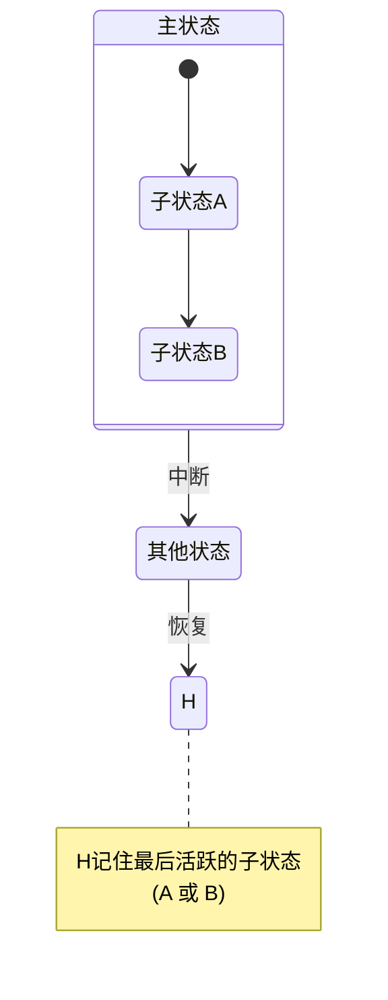
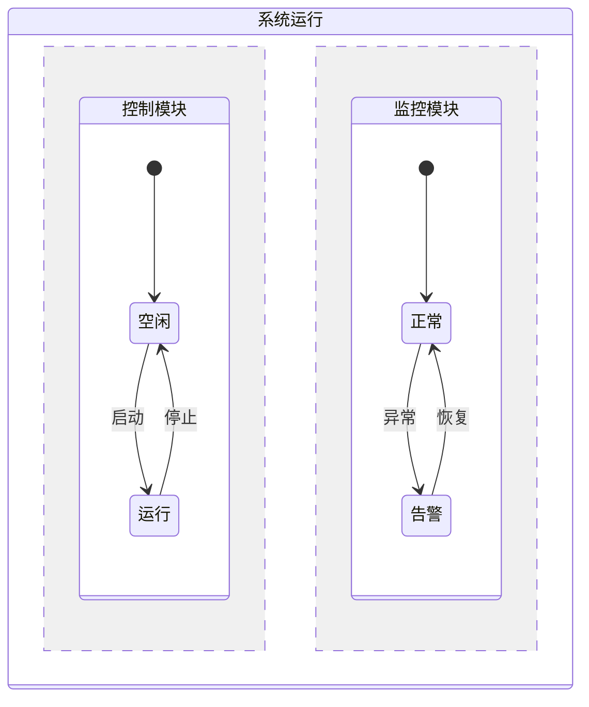
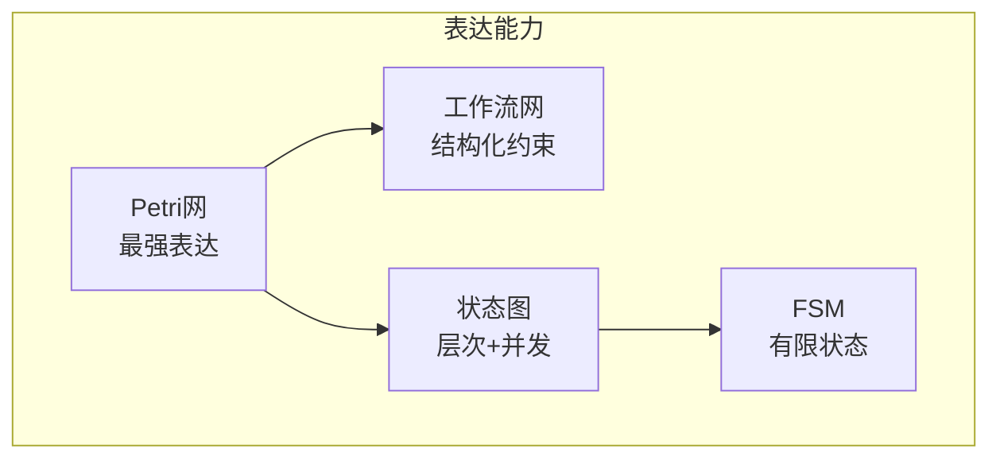
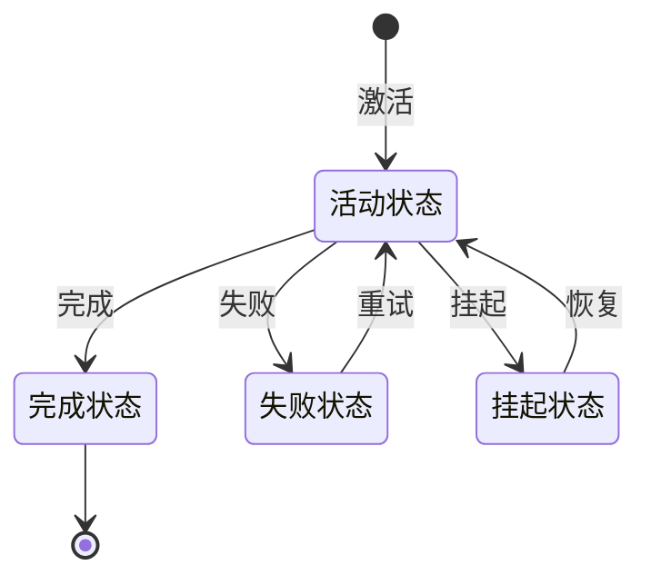
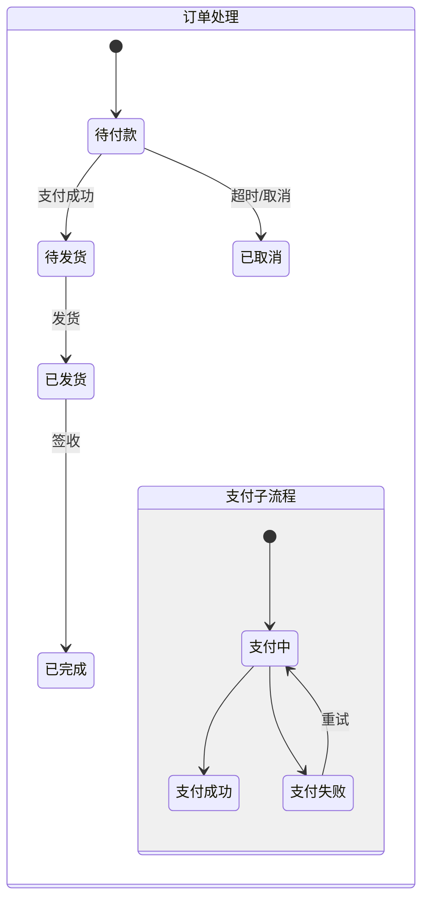
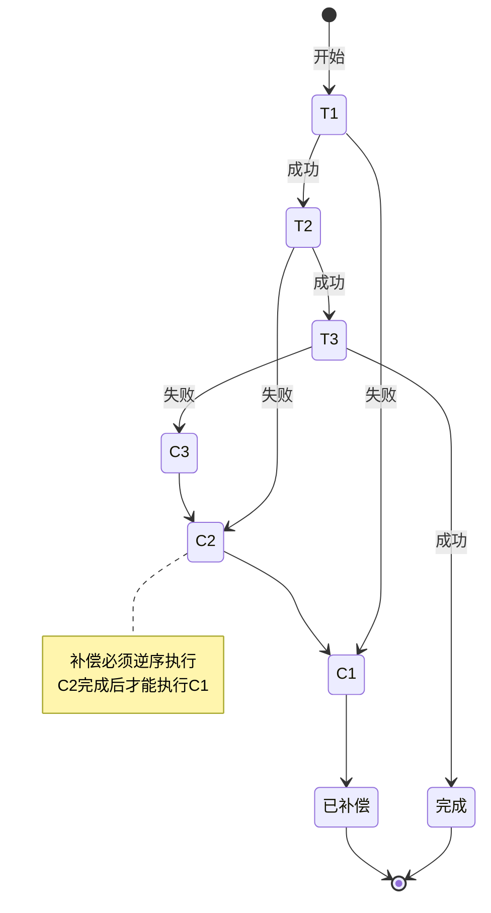

# 状态机模型 (State Machine Model)

## 概述

**状态机模型** 是工作流建模的经典方法，通过定义系统的状态集合、事件集合以及状态间的转移规则来描述工作流的行为。从简单的有限状态机（FSM）到复杂的层次状态机（HSM）和状态图（Statecharts），状态机模型为工作流系统提供了直观的可视化表达和严格的数学基础。

---

## 1. 有限状态机 (Finite State Machine, FSM)

### 1.1 形式化定义

**定义 1.1** (有限状态机): 一个确定型有限状态机（DFSM）是一个五元组：

$$M = (S, \Sigma, \delta, s_0, F)$$

其中：

- $S$: 有限状态集合
- $\Sigma$: 有限事件（输入）集合
- $\delta: S \times \Sigma \rightarrow S$: 状态转移函数
- $s_0 \in S$: 初始状态
- $F \subseteq S$: 终止状态集合

**定义 1.2** (非确定型FSM): 转移函数变为：
$$\delta: S \times \Sigma \rightarrow 2^S$$

### 1.2 工作流FSM扩展

为支持工作流建模，扩展FSM为**工作流状态机**：

$$WFSM = (S, E, T, s_0, F, A, G)$$

其中：

- $S$: 状态集合
- $E$: 事件集合
- $T \subseteq S \times E \times S$: 转移关系
- $s_0$: 初始状态
- $F$: 终止状态
- $A$: 动作（Action）集合，在转移时执行
- $G$: 守卫条件（Guard），决定转移是否可执行

### 1.3 状态-事件-动作模型



**转移的组成部分**:

| 元素 | 符号 | 描述 | 可选 |
|------|------|------|------|
| **触发事件** | $e$ | 触发转移的事件 | 否 |
| **守卫条件** | $[g]$ | 转移的条件 | 是 |
| **动作** | $/a$ | 转移时执行的动作 | 是 |

**完整转移语法**:

```
event [guard] / action
```

---

## 2. 层次状态机 (Hierarchical State Machine)

### 2.1 状态嵌套

**定义 2.1** (层次状态机): 状态可以嵌套，形成树形结构：

$$HSM = (S, E, T, s_0, F, \rho)$$

其中 $\rho: S \rightarrow S \cup \{\bot\}$ 是父状态映射函数。



### 2.2 状态继承

**OR-状态**（互斥状态）:

- 父状态的激活意味着恰好一个子状态激活
- 转移可以发生在任何层级

**状态进入/退出规则**:

```
进入父状态 → 自动进入默认子状态
离开子状态 → 先执行子状态的退出动作 → 执行父状态的退出动作
```

### 2.3 历史状态

**浅历史（Shallow History）**: 记住最近活跃的直系子状态

**深历史（Deep History）**: 记住整个子状态配置



---

## 3. 状态图 (Statecharts)

### 3.1 Statecharts扩展

David Harel 于1987年提出Statecharts，扩展了层次状态机的概念：

**核心扩展**:

1. **层次化状态** (Hierarchy)
2. **正交区域** (Orthogonality / 并发)
3. **广播通信** (Broadcast)
4. **条件连接** (Condition connectors)

### 3.2 正交区域 (AND-States)

**定义 3.1** (正交状态): 一个状态可以包含多个正交区域，各区域同时活跃。



**语义**: 系统运行时，Control和Monitor两个区域同时活跃，各自独立演化。

### 3.3 状态图 vs 工作流网

| 特性 | 状态图 | 工作流网 |
|------|--------|----------|
| **建模焦点** | 状态与响应 | 活动与控制流 |
| **并发** | 正交区域 | 令牌分发 |
| **层次** | 状态嵌套 | 无原生支持 |
| **可视化** | 直观（状态图） | 数学化（Petri网） |
| **分析能力** | 模型检测 | 可达性分析 |
| **行为触发** | 事件驱动 | 令牌驱动 |

---

## 4. 状态机工作流实现

### 4.1 状态机工作流引擎

```
┌─────────────────────────────────────────────┐
│          状态机工作流引擎                    │
├─────────────────────────────────────────────┤
│  ┌──────────────┐    ┌──────────────┐      │
│  │   状态存储    │◄──►│   状态机定义  │      │
│  └──────────────┘    └──────────────┘      │
│         │                   │               │
│         ▼                   ▼               │
│  ┌──────────────────────────────────────┐  │
│  │           状态转换引擎                │  │
│  │  ┌────────┐  ┌────────┐  ┌────────┐ │  │
│  │  │ 事件   │→│ 守卫   │→│ 动作   │ │  │
│  │  │ 处理器 │  │ 评估器 │  │ 执行器 │ │  │
│  │  └────────┘  └────────┘  └────────┘ │  │
│  └──────────────────────────────────────┘  │
└─────────────────────────────────────────────┘
```

### 4.2 状态持久化

**状态快照**:

```json
{
  "instanceId": "wf-123456",
  "workflowType": "OrderWorkflow",
  "currentState": "PaymentProcessing",
  "stateHierarchy": ["Running", "PaymentProcessing"],
  "activeRegions": ["Main", "TimeoutMonitor"],
  "variables": {
    "orderId": "ORD-789",
    "amount": 100.00
  },
  "history": [
    {"from": "Created", "to": "PaymentProcessing", "event": "Submit", "time": "2026-03-18T10:00:00Z"}
  ]
}
```

---

## 5. 与Petri网的对比

### 5.1 表达能力对比



### 5.2 详细对比

| 维度 | 状态机模型 | Petri网模型 |
|------|-----------|-------------|
| **建模单元** | 状态（等待） | 库所（条件） |
| **触发机制** | 事件 | 令牌满足 |
| **并发表达** | 正交区域 | 令牌复制 |
| **层次结构** | 原生支持 | 无/需扩展 |
| **行为焦点** | 响应式/事件驱动 | 流程式/数据驱动 |
| **死锁检测** | 复杂 | 标准算法 |
| **可视化** | 用户友好 | 数学精确 |
| **代码生成** | 直接 | 需要转换 |

### 5.3 相互转换

**状态图 → Petri网**:

```
状态 S → 库所 p_S
转移 t: S1 --e--> S2 → 转换 t，输入 p_S1，输出 p_S2
事件 e → 弧标签或守卫
```

**Petri网 → 状态图**:

```
每个可达标识 → 一个状态
每个可触发转换 → 转移
```

---

## 6. 工作流状态机模式

### 6.1 基本状态模式



### 6.2 复合状态模式



### 6.3 状态机实现Saga



---

## 7. 代码示例

### 7.1 状态机框架实现

```go
// StateMachine 工作流状态机
type StateMachine struct {
    Name       string
    States     map[string]*State
    Transitions []Transition
    Current    string
    Context    map[string]interface{}
}

type State struct {
    Name       string
    OnEntry    func(ctx map[string]interface{})
    OnExit     func(ctx map[string]interface{})
    Activities []Activity
}

type Transition struct {
    From      string
    To        string
    Event     string
    Guard     func(ctx map[string]interface{}) bool
    Actions   []func(ctx map[string]interface{})
}

// Trigger 触发状态转移
func (sm *StateMachine) Trigger(event string) error {
    // 1. 查找匹配的转移
    for _, t := range sm.Transitions {
        if t.From == sm.Current && t.Event == event {
            // 2. 评估守卫条件
            if t.Guard != nil && !t.Guard(sm.Context) {
                continue
            }

            // 3. 执行源状态的退出动作
            if state, ok := sm.States[sm.Current]; ok {
                if state.OnExit != nil {
                    state.OnExit(sm.Context)
                }
            }

            // 4. 执行转移动作
            for _, action := range t.Actions {
                action(sm.Context)
            }

            // 5. 进入目标状态
            sm.Current = t.To
            if state, ok := sm.States[sm.Current]; ok {
                if state.OnEntry != nil {
                    state.OnEntry(sm.Context)
                }
            }

            return nil
        }
    }
    return fmt.Errorf("no transition found for event %s from state %s", event, sm.Current)
}
```

### 7.2 订单工作流示例

```go
// 创建订单状态机
func CreateOrderStateMachine() *StateMachine {
    sm := &StateMachine{
        Name:    "OrderWorkflow",
        States:  make(map[string]*State),
        Current: "Created",
        Context: make(map[string]interface{}),
    }

    // 定义状态
    sm.States["Created"] = &State{
        Name: "Created",
        OnEntry: func(ctx map[string]interface{}) {
            fmt.Println("订单已创建")
        },
    }

    sm.States["Paid"] = &State{
        Name: "Paid",
        OnEntry: func(ctx map[string]interface{}) {
            fmt.Println("订单已支付")
        },
    }

    sm.States["Shipped"] = &State{
        Name: "Shipped",
        OnEntry: func(ctx map[string]interface{}) {
            fmt.Println("订单已发货")
        },
    }

    sm.States["Completed"] = &State{
        Name: "Completed",
        OnEntry: func(ctx map[string]interface{}) {
            fmt.Println("订单已完成")
        },
    }

    sm.States["Cancelled"] = &State{
        Name: "Cancelled",
        OnEntry: func(ctx map[string]interface{}) {
            fmt.Println("订单已取消")
        },
    }

    // 定义转移
    sm.Transitions = []Transition{
        {
            From:  "Created",
            To:    "Paid",
            Event: "Pay",
            Guard: func(ctx map[string]interface{}) bool {
                amount, ok := ctx["amount"].(float64)
                return ok && amount > 0
            },
        },
        {
            From:  "Created",
            To:    "Cancelled",
            Event: "Cancel",
        },
        {
            From:  "Paid",
            To:    "Shipped",
            Event: "Ship",
        },
        {
            From:  "Shipped",
            To:    "Completed",
            Event: "Deliver",
        },
    }

    return sm
}

// 使用
func main() {
    sm := CreateOrderStateMachine()
    sm.Context["amount"] = 100.0

    sm.Trigger("Pay")      // Created -> Paid
    sm.Trigger("Ship")     // Paid -> Shipped
    sm.Trigger("Deliver")  // Shipped -> Completed
}
```

---

## 8. 相关文档链接

- [工作流网](工作流网.md) - Petri网视角的状态机
- [工作流模式](工作流模式.md) - 状态机实现的模式
- [Saga模式](Saga模式.md) - 状态机实现的长事务
- [Durable Execution](Durable-Execution.md) - 状态机的持久化
- [Petri网专题文档](../../02-THEORY/formal-verification/Petri网专题文档.md) - 形式化对比基础

---

## 9. 参考资源

### 经典论文

1. **Harel, D. (1987)**. "Statecharts: A Visual Formalism for Complex Systems". *Science of Computer Programming*, 8(3):231-274.
   - Statecharts的原始论文

2. **Harel, D., & Politi, M. (1998)**. "Modeling Reactive Systems with Statecharts". *McGraw-Hill*.
   - Statecharts的权威参考

3. **Hopcroft, J.E., Motwani, R., & Ullman, J.D. (2006)**. "Introduction to Automata Theory, Languages, and Computation". *Addison-Wesley*.
   - FSM理论经典教材

### 状态机框架

- **Spring Statemachine**: Java状态机框架
- **XState**: JavaScript状态机库
- **Akka FSM**: Actor模型状态机
- **Temporal**: 支持状态机模式的工作流引擎

### 在线资源

- [Statecharts.dev](https://statecharts.dev/) - Statecharts学习资源
- [XState Documentation](https://xstate.js.org/docs/)
- [Wikipedia: Finite-state machine](https://en.wikipedia.org/wiki/Finite-state_machine)

---

**文档版本**: 1.0
**最后更新**: 2026-03-18
**状态**: ✅ 完成
