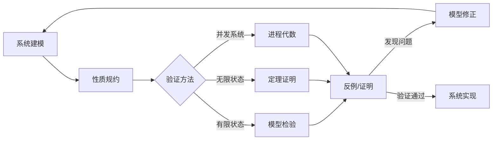

# 形式化验证方法

**定位**：验证层 - 工作流系统的形式化建模与正确性证明

---

## 核心问题

1. 如何用数学方法证明工作流系统的正确性？
2. 如何验证分布式工作流的性质（安全性、活性）？
3. 如何自动化验证过程？

---

## 验证方法分类

### 1. 模型检验 (Model Checking)

| 方法 | 工具 | 适用场景 | 复杂度 |
|------|------|----------|--------|
| **显式状态探索** | SPIN、TLC | 有限状态系统 | 状态空间爆炸 |
| **符号模型检验** | NuSMV | 大状态空间 | 依赖BDD效率 |
| **有界模型检验** | CBMC、Kind 2 | 无限状态系统 | 界限选择 |
| **抽象解释** | Astree | 数值程序 | 精度损失 |

### 2. 定理证明 (Theorem Proving)

| 工具 | 逻辑基础 | 自动化程度 | 适用场景 |
|------|----------|------------|----------|
| **TLAPS** | TLA+ | 中等 | 分布式算法 |
| **Coq** | 构造演算 | 低 | 复杂证明 |
| **Isabelle/HOL** | 高阶逻辑 | 中等 | 系统验证 |
| **Lean** | 依赖类型 | 中等 | 数学证明 |

### 3. 进程代数 (Process Algebra)

| 代数 | 特点 | 工具 |
|------|------|------|
| **CSP** | 通信顺序进程 | FDR |
| **CCS** | 通信系统演算 | CWB |
| **π-calculus** | 移动进程 | Mobility Workbench |

---

## 核心概念

### TLA+ (Temporal Logic of Actions)

**核心思想**：
```
系统 = 初始状态 ∧ □[下一步动作]_变量
```

**规格结构**：
```tla
MODULE Workflow

VARIABLES state, data

Init == state = "start" ∧ data = {}

Next == ∨ ∧ state = "start"
      ∧ state' = "running"
    ∨ ∧ state = "running"
      ∧ state' = "completed"

Spec == Init ∧ □[Next]_<<state, data>>
```

**性质表达**：
- **安全性**：□(state ≠ "error") - 永远不进入错误状态
- **活性**：state = "start" ↝ state = "completed" - 最终完成

### Petri网分析

**形式化定义**：
```
PN = (P, T, F, M₀)
- P: 库所集合
- T: 变迁集合  
- F: 流关系 ⊆ (P×T) ∪ (T×P)
- M₀: 初始标记
```

**性质验证**：
| 性质 | 定义 | 验证方法 |
|------|------|----------|
| **有界性** | ∀p∈P: M(p) ≤ k | 状态空间分析 |
| **活性** | 所有变迁都可无限次触发 | 可覆盖性树 |
| **可达性** | M₀ →* M | 模型检验 |
| **死锁自由** | 无死锁标记 | 不变式证明 |

### 时序逻辑

**LTL (Linear Temporal Logic)**：
```
φ ::= p | ¬φ | φ∧φ | ○φ | φUφ
```
- ○φ：下一状态φ成立
- □φ：所有未来状态φ成立  
- ◇φ：某个未来状态φ成立
- φUψ：φ一直成立直到ψ成立

**CTL (Computation Tree Logic)**：
```
φ ::= p | ¬φ | φ∧φ | AXφ | EXφ | AFφ | EFφ | AGφ | EGφ | A[φUφ] | E[φUφ]
```
- A：所有路径
- E：存在路径
- X：下一状态
- F：某个未来状态
- G：所有未来状态

---

## 验证流程



---

## 工作流验证实例

### Saga模式验证

**TLA+规约**：
```tla
Saga == 
  ∧ Init
  ∧ □[∨ ExecuteStep
      ∨ Compensate
      ∨ Complete]_vars
  ∧ Liveness

Liveness == 
  ∀i ∈ 1..N : (step[i].status = "pending") ↝ 
              ∨ (step[i].status = "completed")
              ∨ (step[i].status = "compensated")
```

### 分布式锁验证

**安全性**：
```
□(∀i,j: i≠j → ¬(holds_lock(i) ∧ holds_lock(j)))
```

**活性**：
```
□◇(∀i: wants_lock(i) → holds_lock(i))
```

---

## 工具使用指南

### TLC (TLA+ Model Checker)

**命令行**：
```bash
tlc Workflow.tla -config Workflow.cfg
```

**配置示例**：
```cfg
CONSTANTS
  N = 3
  MaxSteps = 10

INIT Init
NEXT Next

PROPERTY 
  TypeInvariant
  Safety

CHECK_DEADLOCK
  FALSE
```

### CPN Tools

**分析步骤**：
1. 构建工作流网模型
2. 生成状态空间
3. 验证性质（有界性、活性）
4. 生成分析报告

---

## 相关文档

- [TLA+规范](TLA+规范.md) - TLA+语言详解
- [Petri网分析](Petri网分析.md) - Petri网验证方法
- [时序逻辑](时序逻辑.md) - CTL/LTL理论
- [模型检验](模型检验.md) - 自动化验证技术
- [定理证明](定理证明.md) - 交互式证明方法

---

## 参考资源

- [TLA+ Home Page](https://lamport.azurewebsites.net/tla/tla.html)
- [Petri Nets World](http://www.informatik.uni-hamburg.de/TGI/PetriNets/)
- [Spin Model Checker](http://spinroot.com/)
- [NuSMV](http://nusmv.fbk.eu/)
- [Coq Proof Assistant](https://coq.inria.fr/)

---

**状态**：✅ 已完成  
**最后更新**：2026年3月
