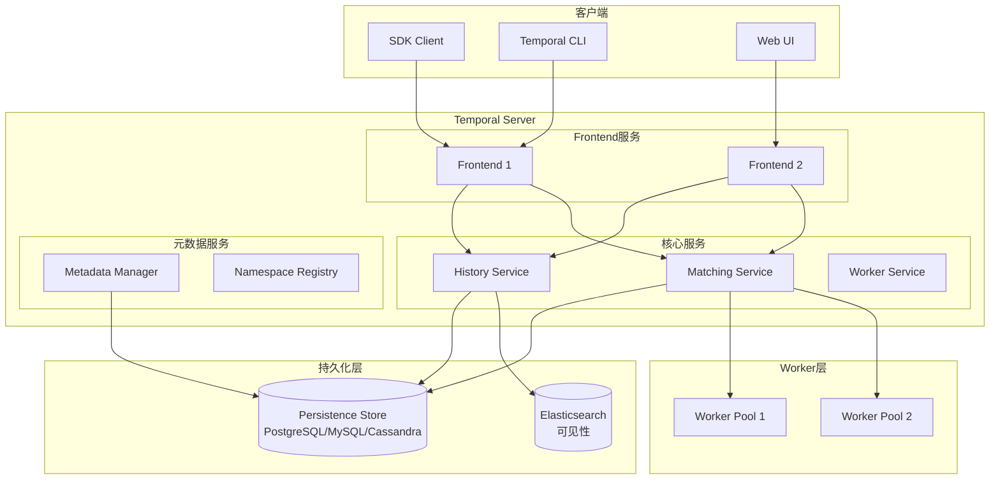
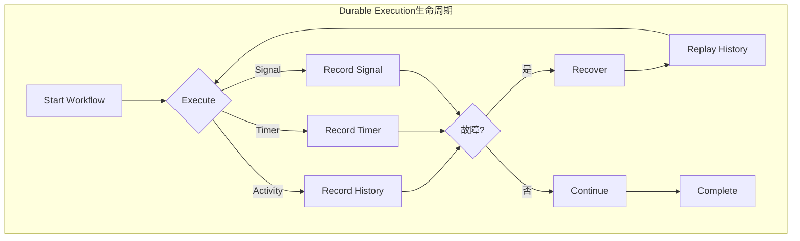
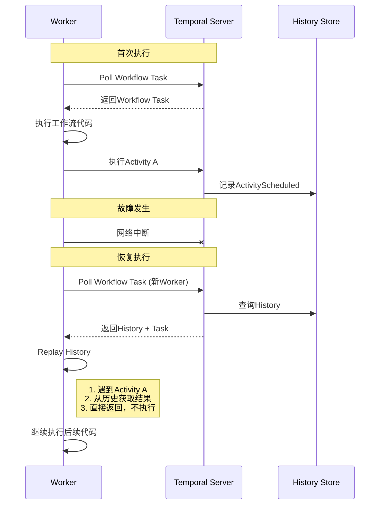
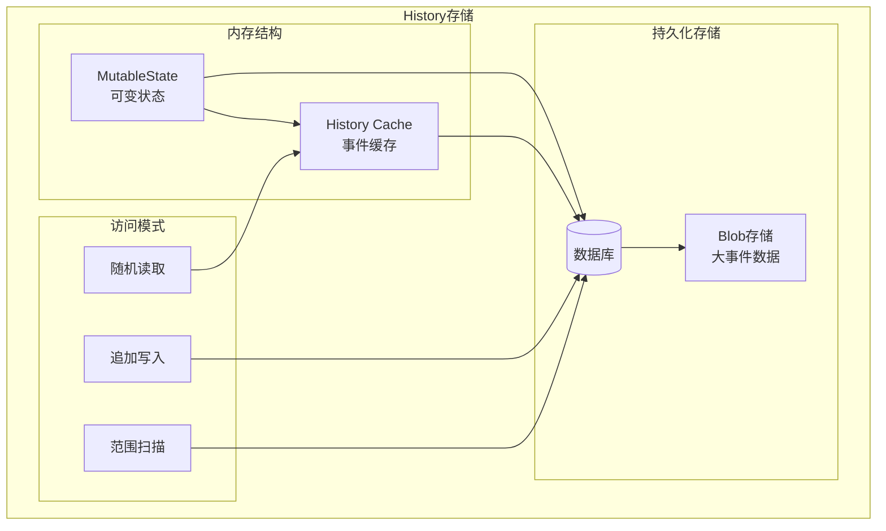
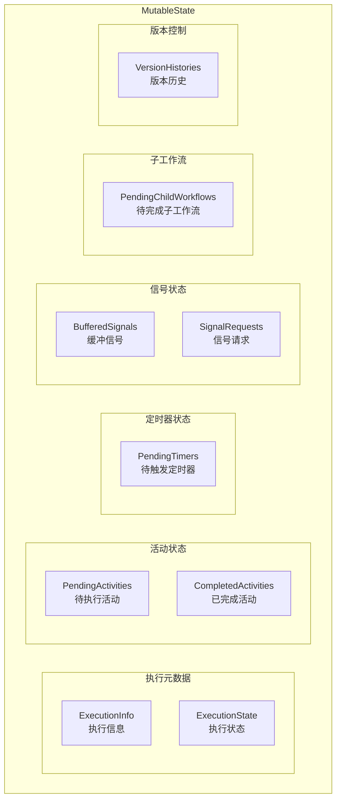
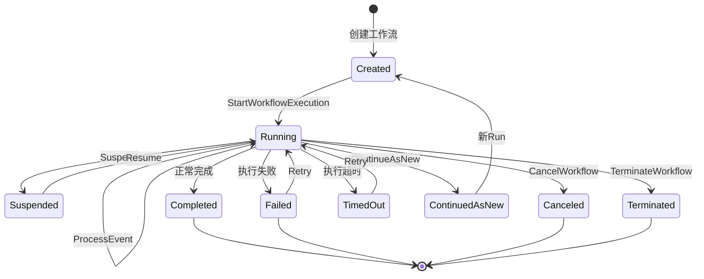
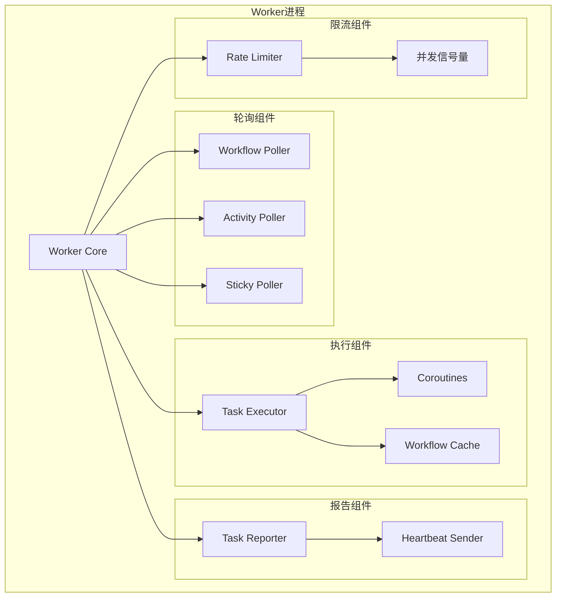
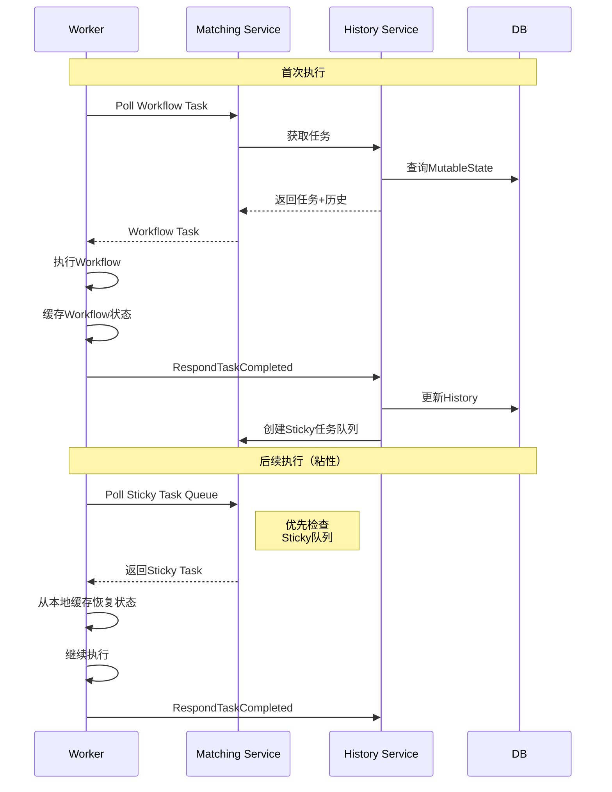
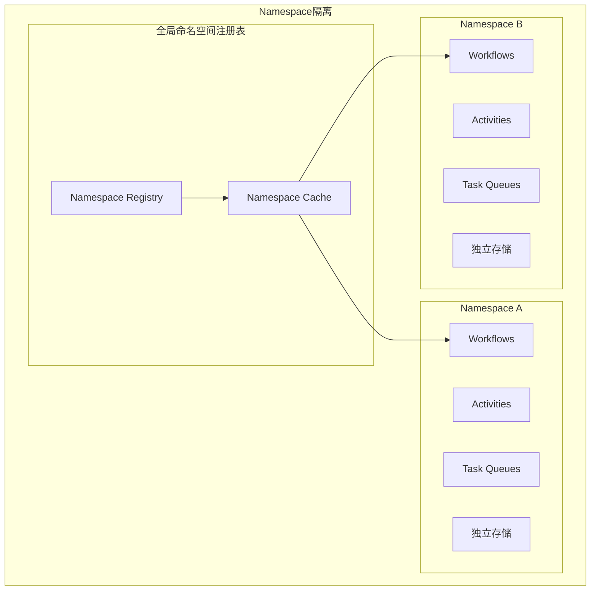
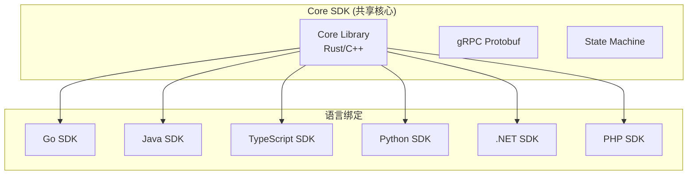

# Temporal深度分析

**文档版本**：v1.0
**创建时间**：2025年1月
**状态**：✅ **已完成**

---

## 📋 执行摘要

Temporal是一个开源的Durable Execution平台，提供可靠的工作流编排能力。本文档深入分析Temporal的架构实现，包括Durable Execution机制、History事件日志、MutableState状态管理、Worker运行机制、Namespace多租户和多语言SDK架构。

---

## 一、整体架构

### 1.1 系统架构图



### 1.2 核心组件职责

| 组件 | 职责 | 关键技术 |
|------|------|----------|
| **Frontend** | 接收gRPC/HTTP请求，认证鉴权 | gRPC Gateway |
| **History Service** | 管理Workflow执行历史 | 事件溯源 |
| **Matching Service** | 任务调度和Worker匹配 | 一致性哈希 |
| **Worker Service** | Worker管理（较少使用） | - |
| **Persistence** | 数据持久化 | SQL/NoSQL |
| **Elasticsearch** | 可见性查询 | 全文检索 |

---

## 二、Durable Execution实现

### 2.1 核心概念

**Durable Execution** 是Temporal的核心抽象，确保工作流代码能够在任何故障后从断点恢复。



**确定性约束**：

| 约束 | 说明 | Temporal API |
|------|------|--------------|
| **时间** | 不使用系统时间 | `workflow.Now()` |
| **随机数** | 不使用随机数 | `workflow.SeededRandom()` |
| **外部I/O** | 不直接网络调用 | `workflow.ExecuteActivity()` |
| **并发** | 不使用原生并发 | `workflow.Go()` |
| **全局状态** | 不依赖可变全局状态 | 通过参数传递 |

### 2.2 重放机制 (Replay)

**重放原理**：



**重放实现**（Go SDK伪代码）：

```go
// WorkflowReplayer 实现
func (r *WorkflowReplayer) ReplayWorkflowHistory(
    workflowType string,
    history *History,
) error {
    // 1. 创建Workflow上下文
    ctx := r.createWorkflowContext(workflowType, history)

    // 2. 重放历史事件
    for _, event := range history.Events {
        switch event.EventType {
        case EVENT_TYPE_ACTIVITY_SCHEDULED:
            // 记录活动已调度，但不实际执行
            ctx.recordActivityScheduled(event)

        case EVENT_TYPE_ACTIVITY_COMPLETED:
            // 从历史获取结果，直接返回
            result := event.GetActivityResult()
            ctx.setActivityResult(event.ActivityId, result)

        case EVENT_TYPE_TIMER_STARTED:
            // 记录定时器
            ctx.recordTimer(event)

        case EVENT_TYPE_TIMER_FIRED:
            // 模拟定时器触发
            ctx.fireTimer(event)

        case EVENT_TYPE_SIGNAL_RECEIVED:
            // 注入信号
            ctx.injectSignal(event)
        }
    }

    // 3. 执行Workflow函数
    return r.executeWorkflow(ctx)
}

// 工作流执行包装器
func (ctx *workflowContext) ExecuteActivity(
    activity interface{},
    args ...interface{},
) Future {
    // 检查是否是重放
    if ctx.isReplaying {
        // 重放模式：从历史获取结果
        if result, ok := ctx.getCachedResult(activity); ok {
            return NewCompletedFuture(result)
        }
    }

    // 正常执行
    return ctx.scheduleActivity(activity, args)
}
```

### 2.3 检查点机制

**隐式检查点**：

Temporal在每个可能产生非确定性结果的点自动插入检查点：

```go
func SampleWorkflow(ctx workflow.Context) error {
    // 检查点1: 开始执行

    // Activity调用 = 隐式检查点
    var result1 ActivityResult
    err := workflow.ExecuteActivity(ctx, ActivityA, args).Get(ctx, &result1)
    // 检查点2: ActivityA完成，结果被记录

    // 定时器 = 隐式检查点
    workflow.Sleep(ctx, time.Hour)
    // 检查点3: 定时器触发

    // 另一个Activity
    var result2 ActivityResult
    err = workflow.ExecuteActivity(ctx, ActivityB, result1).Get(ctx, &result2)
    // 检查点4: ActivityB完成

    return nil
}
```

---

## 三、History事件日志

### 3.1 History数据结构

**History是Temporal的核心数据结构**，记录了工作流执行的完整事件序列。

```protobuf
// History结构定义（简化）
message History {
    repeated HistoryEvent events = 1;
}

message HistoryEvent {
    int64 event_id = 1;
    int64 event_time = 2;
    EventType event_type = 3;
    oneof attributes {
        WorkflowExecutionStartedEventAttributes workflow_execution_started = 4;
        ActivityTaskScheduledEventAttributes activity_task_scheduled = 5;
        ActivityTaskCompletedEventAttributes activity_task_completed = 6;
        TimerStartedEventAttributes timer_started = 7;
        TimerFiredEventAttributes timer_fired = 8;
        // ... 其他事件类型
    }
}
```

**事件类型分类**：

| 类别 | 事件类型 | 说明 |
|------|----------|------|
| **Workflow** | WorkflowExecutionStarted | 工作流开始 |
| | WorkflowExecutionCompleted | 工作流完成 |
| | WorkflowExecutionFailed | 工作流失败 |
| **Activity** | ActivityTaskScheduled | 活动任务已调度 |
| | ActivityTaskStarted | 活动任务开始执行 |
| | ActivityTaskCompleted | 活动任务完成 |
| | ActivityTaskFailed | 活动任务失败 |
| **Timer** | TimerStarted | 定时器启动 |
| | TimerFired | 定时器触发 |
| | TimerCanceled | 定时器取消 |
| **Signal** | WorkflowExecutionSignaled | 工作流收到信号 |
| **Child Workflow** | ChildWorkflowExecutionStarted | 子工作流开始 |
| | ChildWorkflowExecutionCompleted | 子工作流完成 |
| **Marker** | MarkerRecorded | 自定义标记 |

### 3.2 History存储实现

**存储模型**：



**数据库表结构**（PostgreSQL）：

```sql
-- 执行记录表
CREATE TABLE executions (
    shard_id INTEGER NOT NULL,
    namespace_id VARCHAR(255) NOT NULL,
    workflow_id VARCHAR(255) NOT NULL,
    run_id VARCHAR(255) NOT NULL,
    -- 状态字段
    state INTEGER,
    status INTEGER,
    -- 配置
    workflow_type_name VARCHAR(255),
    task_queue VARCHAR(255),
    -- 时间戳
    start_time TIMESTAMP,
    last_write_time TIMESTAMP,
    -- 事件历史（分片存储）
    next_event_id BIGINT,
    -- 主键
    PRIMARY KEY (shard_id, namespace_id, workflow_id, run_id)
);

-- 历史事件表（分片）
CREATE TABLE history_node (
    shard_id INTEGER NOT NULL,
    branch_id VARCHAR(255) NOT NULL,
    node_id BIGINT NOT NULL,
    txn_id BIGINT NOT NULL,
    -- 事件数据
    data BYTEA,
    prev_txn_id BIGINT,
    -- 主键
    PRIMARY KEY (shard_id, branch_id, node_id, txn_id)
);

-- 当前执行表
CREATE TABLE current_executions (
    shard_id INTEGER NOT NULL,
    namespace_id VARCHAR(255) NOT NULL,
    workflow_id VARCHAR(255) NOT NULL,
    run_id VARCHAR(255) NOT NULL,
    state INTEGER,
    create_request_id VARCHAR(255),
    -- 主键
    PRIMARY KEY (shard_id, namespace_id, workflow_id)
);
```

### 3.3 History优化策略

**1. 分片存储**：

```go
// History分片策略
const (
    DefaultHistoryPageSize = 256 * 1024  // 256KB每页
    MaxHistoryEventSize    = 2 * 1024 * 1024  // 2MB单事件限制
)

type HistoryManager struct {
    shardID int32
    // 批量写入缓冲
    batchBuffer []*HistoryEvent
}

func (hm *HistoryManager) AppendHistory(
    ctx context.Context,
    request *AppendHistoryRequest,
) (*AppendHistoryResponse, error) {
    // 1. 序列化事件
    data, err := serialize(request.Events)
    if err != nil {
        return nil, err
    }

    // 2. 检查大小，分片存储
    if len(data) > DefaultHistoryPageSize {
        chunks := chunk(data, DefaultHistoryPageSize)
        for i, chunk := range chunks {
            node := &HistoryNode{
                ShardID:  hm.shardID,
                BranchID: request.BranchID,
                NodeID:   request.NodeID + int64(i),
                Data:     chunk,
            }
            hm.batchBuffer = append(hm.batchBuffer, node)
        }
    } else {
        hm.batchBuffer = append(hm.batchBuffer, request.Events...)
    }

    // 3. 批量写入
    if len(hm.batchBuffer) >= hm.batchSize {
        return hm.flush(ctx)
    }

    return &AppendHistoryResponse{}, nil
}
```

**2. 压缩**：

| 压缩策略 | 压缩率 | CPU开销 | 适用场景 |
|----------|--------|---------|----------|
| **Snappy** | 50-70% | 低 | 实时写入 |
| **Zstd** | 60-80% | 中 | 历史归档 |
| **LZ4** | 40-60% | 极低 | 热数据 |

---

## 四、MutableState状态管理

### 4.1 MutableState架构

**MutableState** 是工作流执行在内存中的可变状态表示，是History的缓存视图。



### 4.2 状态转换流程



### 4.3 源码级分析

**MutableState实现**（简化版）：

```go
// MutableStateImpl 实现
type MutableStateImpl struct {
    shardContext ShardContext

    // 执行信息
    executionInfo *persistencespb.WorkflowExecutionInfo
    executionState *persistencespb.WorkflowExecutionState

    // 待处理活动
    pendingActivityInfos map[int64]*persistencespb.ActivityInfo
    pendingActivityIDToEventID map[string]int64

    // 待处理定时器
    pendingTimerInfos map[int64]*persistencespb.TimerInfo

    // 缓冲信号
    bufferedSignals []*historyspb.HistoryEvent

    // 待处理子工作流
    pendingChildExecutionInfos map[int64]*persistencespb.ChildExecutionInfo

    // 待处理请求取消
    pendingRequestCancelInfos map[int64]*persistencespb.RequestCancelInfo

    // 版本历史（Worker Versioning）
    versionHistories *historyspb.VersionHistories

    // 变更追踪
    updateInfo map[updateInfoKey]updateInfo
}

// ApplyEvent 应用历史事件到MutableState
func (ms *MutableStateImpl) ApplyEvent(
    ctx context.Context,
    event *historyspb.HistoryEvent,
) error {
    switch event.EventType {
    case enumspb.EVENT_TYPE_ACTIVITY_TASK_SCHEDULED:
        return ms.applyActivityTaskScheduled(event)

    case enumspb.EVENT_TYPE_ACTIVITY_TASK_COMPLETED:
        return ms.applyActivityTaskCompleted(event)

    case enumspb.EVENT_TYPE_TIMER_STARTED:
        return ms.applyTimerStarted(event)

    case enumspb.EVENT_TYPE_TIMER_FIRED:
        return ms.applyTimerFired(event)

    case enumspb.EVENT_TYPE_WORKFLOW_EXECUTION_SIGNALED:
        return ms.applyWorkflowExecutionSignaled(event)

    // ... 其他事件类型
    }
    return nil
}

// applyActivityTaskScheduled 处理活动调度事件
func (ms *MutableStateImpl) applyActivityTaskScheduled(
    event *historyspb.HistoryEvent,
) error {
    attrs := event.GetActivityTaskScheduledEventAttributes()

    activityInfo := &persistencespb.ActivityInfo{
        Version:                event.Version,
        ScheduledEventId:       event.EventId,
        ScheduledTime:          event.EventTime,
        ActivityId:             attrs.ActivityId,
        ActivityType:           attrs.ActivityType,
        TaskQueue:              attrs.TaskQueue,
        ScheduleToStartTimeout: attrs.ScheduleToStartTimeout,
        ScheduleToCloseTimeout: attrs.ScheduleToCloseTimeout,
        StartToCloseTimeout:    attrs.StartToCloseTimeout,
        HeartbeatTimeout:       attrs.HeartbeatTimeout,
        // ...
    }

    // 添加到待处理活动
    ms.pendingActivityInfos[event.EventId] = activityInfo
    ms.pendingActivityIDToEventID[attrs.ActivityId] = event.EventId

    // 追踪变更
    ms.updateInfo[updateInfoKey{
        category: updateCategoryActivity,
        id:       event.EventId,
    }] = &activityInfoUpdate{activityInfo}

    return nil
}
```

---

## 五、Worker运行机制

### 5.1 Worker架构



### 5.2 任务轮询机制

**长轮询实现**：

```go
// 任务轮询器实现
type TaskPoller struct {
    client     workflowservice.WorkflowServiceClient
    taskQueue  string
    identity   string
    options    PollerOptions
}

func (p *TaskPoller) PollWorkflowTask(
    ctx context.Context,
) (*workflowservice.PollWorkflowTaskQueueResponse, error) {
    request := &workflowservice.PollWorkflowTaskQueueRequest{
        Namespace: p.namespace,
        TaskQueue: &taskqueuepb.TaskQueue{
            Name: p.taskQueue,
            Kind: enumspb.TASK_QUEUE_KIND_NORMAL,
        },
        Identity:       p.identity,
        BinaryChecksum: p.binaryChecksum,
        // 长轮询配置
        WorkerVersionCapabilities: &commonpb.WorkerVersionCapabilities{
            BuildId:       p.buildID,
            UseVersioning: p.useVersioning,
        },
    }

    // 长轮询：服务端保持连接直到有任务或超时
    ctx, cancel := context.WithTimeout(ctx, 70*time.Second)
    defer cancel()

    return p.client.PollWorkflowTaskQueue(ctx, request)
}
```

### 5.3 粘性执行 (Sticky Execution)

**粘性执行机制**：



**粘性执行配置**：

```go
workerOptions := worker.Options{
    // 启用粘性执行
    StickyScheduleToStartTimeout: 10 * time.Second,

    // 工作流缓存大小
    WorkflowCacheSize: 1000,

    // 每个Worker最大并发工作流
    MaxConcurrentWorkflowTaskExecutionSize: 50,

    // 每个Worker最大并发活动
    MaxConcurrentActivityExecutionSize: 100,
}
```

---

## 六、Namespace多租户

### 6.1 Namespace架构



### 6.2 资源隔离

**隔离级别**：

| 资源类型 | 隔离方式 | 说明 |
|----------|----------|------|
| **工作流** | Namespace前缀 | workflow_id唯一性在Namespace内 |
| **任务队列** | Namespace作用域 | 队列名称在Namespace内唯一 |
| **搜索属性** | Namespace索引 | Elasticsearch索引按Namespace分隔 |
| **Worker** | Namespace绑定 | Worker可以注册到多个Namespace |
| **存储** | 逻辑隔离 | 数据表通过namespace_id字段隔离 |

**Namespace配置**：

```protobuf
message NamespaceConfig {
    // 工作流保留期
    google.protobuf.Duration workflow_execution_retention_ttl = 1;

    // 是否开启归档
    bool history_archival_state = 2;
    string history_archival_uri = 3;

    // 可见性归档
    bool visibility_archival_state = 4;
    string visibility_archival_uri = 5;

    // 自定义搜索属性
    map<string, IndexedValueType> custom_search_attribute_types = 6;

    // 是否开启异步工作流更新
    bool supports_schedules = 7;
}
```

---

## 七、多语言SDK架构

### 7.1 SDK整体架构



### 7.2 Go SDK实现

**Go SDK架构**：

```go
// Go SDK核心组件
package internal

// WorkflowContext 实现
type workflowContext struct {
    workflowInfo *WorkflowInfo

    // 并发控制
    dispatcher *dispatcherImpl

    // 事件处理
    signalChannels map[string]*channelImpl

    // 状态
    isReplaying bool

    // 已完成的Future缓存（用于重放）
    completedFutures map[string]interface{}
}

// 工作流执行入口
func ExecuteWorkflow(
    ctx Context,
    workflow interface{},
    args ...interface{},
) (WorkflowExecution, error) {
    // 1. 验证工作流函数
    if err := validateWorkflowFn(workflow); err != nil {
        return WorkflowExecution{}, err
    }

    // 2. 创建Workflow上下文
    wfCtx := newWorkflowContext(ctx, workflow, args)

    // 3. 执行工作流
    result, err := wfCtx.execute()

    // 4. 返回执行句柄
    return WorkflowExecution{
        ID:  wfCtx.workflowInfo.WorkflowExecution.ID,
        RunID: wfCtx.workflowInfo.WorkflowExecution.RunID,
    }, err
}

// Activity调用
func ExecuteActivity(
    ctx Context,
    activity interface{},
    args ...interface{},
) Future {
    // 1. 获取当前上下文
    wfCtx := mustGetWorkflowContext(ctx)

    // 2. 如果是重放，从历史获取结果
    if wfCtx.isReplaying {
        if cached := wfCtx.getCachedActivityResult(activity); cached != nil {
            return NewCompletedFuture(cached)
        }
    }

    // 3. 创建ActivityFuture
    future := newActivityFuture()

    // 4. 调度Activity任务
    scheduleActivityTask(ctx, activity, args, future)

    return future
}
```

### 7.3 Java SDK实现

**Java SDK特点**：

| 特性 | 实现方式 | 说明 |
|------|----------|------|
| **虚拟线程** | Project Loom | Java 21+支持 |
| **异步API** | CompletableFuture | 异步链式调用 |
| **Spring集成** | Spring Boot Starter | 自动配置 |
| **注解驱动** | @WorkflowMethod | 声明式定义 |

```java
// Java SDK示例
@WorkflowInterface
public interface OrderWorkflow {
    @WorkflowMethod
    OrderResult processOrder(OrderRequest request);

    @SignalMethod
    void updateOrder(OrderUpdate update);

    @QueryMethod
    OrderStatus getStatus();
}

public class OrderWorkflowImpl implements OrderWorkflow {
    private final ActivityStub activities = Workflow.newActivityStub(
        OrderActivities.class,
        ActivityOptions.newBuilder()
            .setScheduleToCloseTimeout(Duration.ofMinutes(5))
            .build()
    );

    @Override
    public OrderResult processOrder(OrderRequest request) {
        // 调用Activity
        PaymentResult payment = activities.processPayment(request);

        // 定时器
        Workflow.sleep(Duration.ofHours(24));

        // 并行执行
        Promise<ShipmentResult> shipment = Async.function(
            activities::shipOrder, request
        );

        return new OrderResult(payment, shipment.get());
    }
}
```

### 7.4 TypeScript SDK实现

**TypeScript SDK特点**：

- **原生Promise支持**：与async/await无缝集成
- **类型安全**：完整的类型推断
- **拦截器**：支持Workflow和Activity拦截器

```typescript
// TypeScript SDK示例
import { Workflow, Activity } from '@temporalio/workflow';

// Workflow定义
export async function orderWorkflow(request: OrderRequest): Promise<OrderResult> {
  // 调用Activity
  const payment = await executeActivity(processPaymentActivity, {
    args: [request],
    scheduleToCloseTimeout: '5 minutes',
  });

  // 定时器
  await sleep('24 hours');

  // 并行执行
  const [shipment, notification] = await Promise.all([
    executeActivity(shipOrderActivity, request),
    executeActivity(notifyCustomerActivity, request),
  ]);

  return { payment, shipment, notification };
}

// Activity定义
export const processPaymentActivity = Activity.create({
  async execute(request: OrderRequest): Promise<PaymentResult> {
    // 实现支付处理
  },
});
```

### 7.5 跨语言一致性保证

**一致性机制**：

| 机制 | 描述 | 实现方式 |
|------|------|----------|
| **Proto定义** | 共享消息格式 | protobuf |
| **核心逻辑共享** | 状态机核心 | Rust/C++库 |
| **行为测试套件** | 跨语言验证 | 共享测试用例 |
| **语义版本** | API版本控制 | SemVer |

---

## 八、性能特性

### 8.1 性能指标

| 指标 | 数值 | 测试条件 |
|------|------|----------|
| **吞吐量** | 847 tasks/s | PostgreSQL后端 |
| **P50延迟** | 45ms | 单机部署 |
| **P99延迟** | 195ms | 单机部署 |
| **最大并发工作流** | 100,000+ | 集群部署 |
| **故障恢复时间** | <5s | 自动恢复 |

### 8.2 Worker Versioning

Temporal 2025新功能，支持安全的工作流升级：

```go
// Worker Versioning配置
workerOptions := worker.Options{
    BuildID: "v1.2.3",
    UseBuildIDForVersioning: true,
}

w := worker.New(c, "task-queue", workerOptions)
```

### 8.3 KEDA集成

自动扩缩容配置：

```yaml
apiVersion: keda.sh/v1alpha1
kind: ScaledObject
metadata:
  name: temporal-worker-scaler
spec:
  scaleTargetRef:
    name: temporal-worker
  minReplicaCount: 2
  maxReplicaCount: 100
  triggers:
  - type: temporal
    metadata:
      hostPort: temporal-server:7233
      taskQueue: "my-task-queue"
      backlogCount: "10"
```

---

## 九、相关文档

- [引擎架构](引擎架构.md) - 通用工作流引擎架构
- [Durable Execution](Durable-Execution.md) - Durable Execution理论基础
- [Airflow实现](Airflow实现.md) - Airflow架构对比
- [事件驱动架构](事件驱动架构.md) - 事件驱动工作流设计
- [多语言SDK](多语言SDK.md) - SDK设计模式
- [Temporal选型论证](../../03-TECHNOLOGY/论证/Temporal选型论证.md) - 选型分析
- [Temporal 2025新功能深度分析](../../03-TECHNOLOGY/Temporal-2025新功能深度分析.md) - 新功能分析

---

**维护者**：项目团队
**最后更新**：2025年1月
**下次审查**：2025年4月
