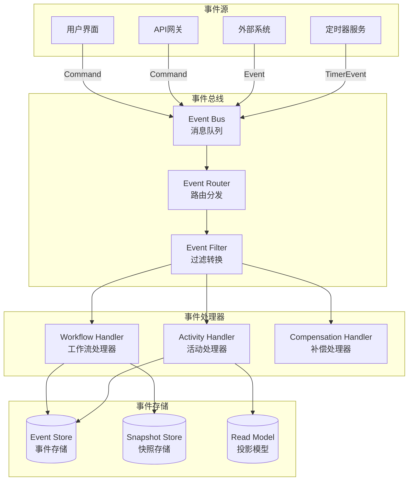
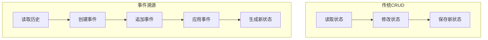
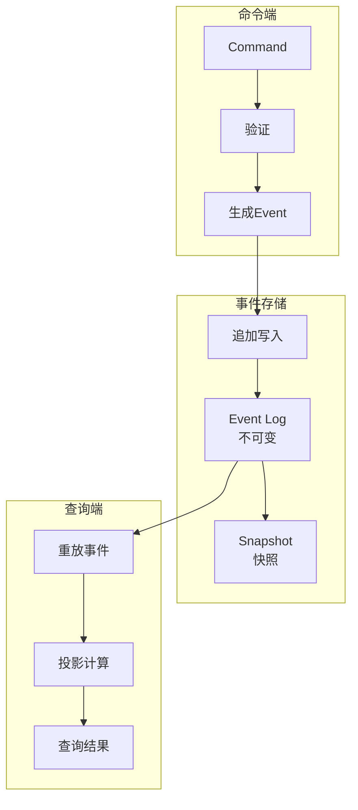
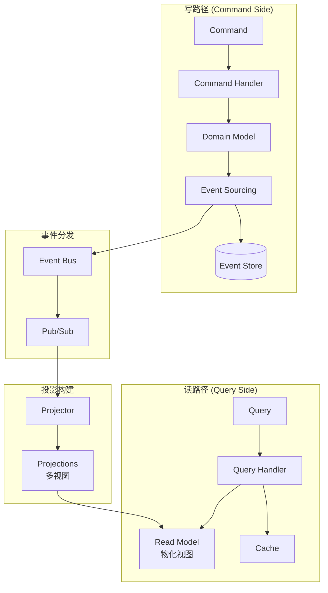
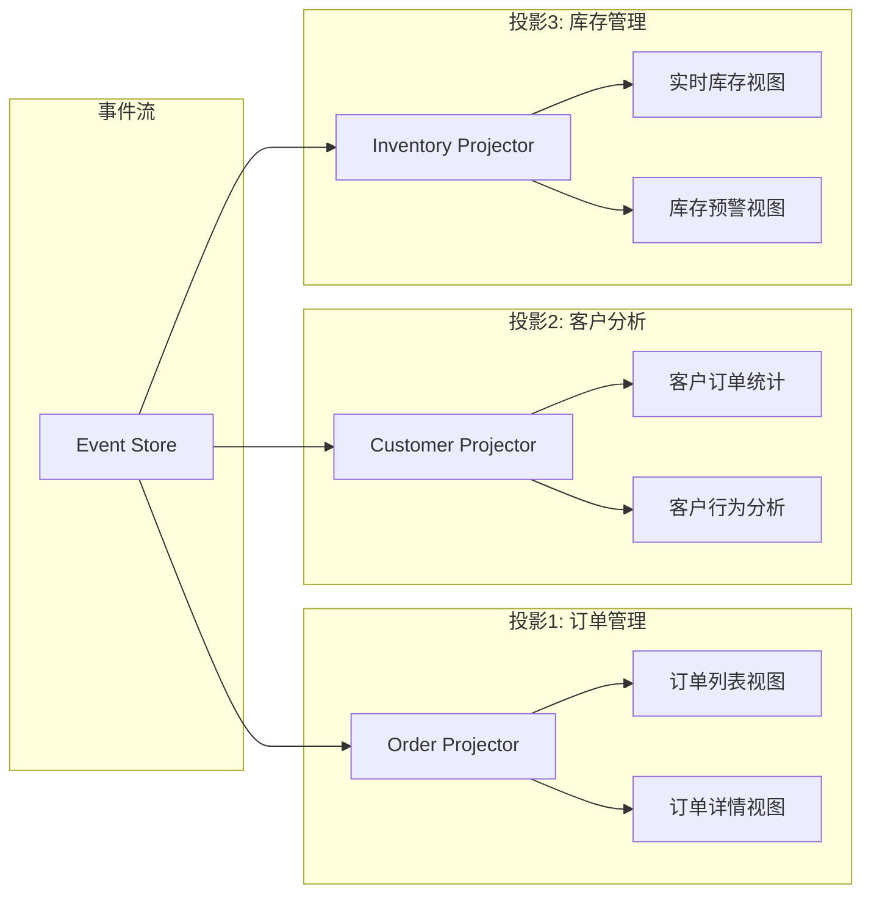
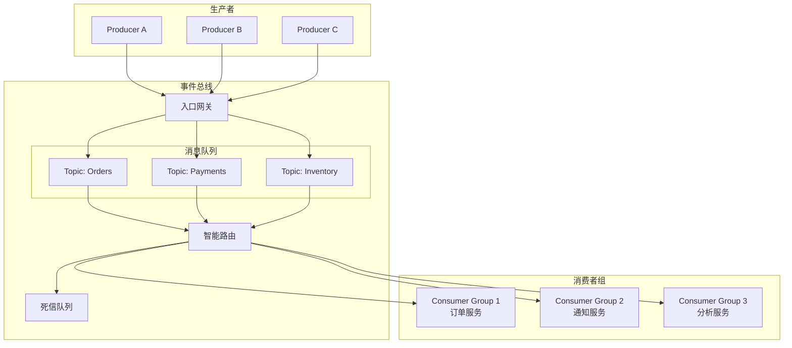
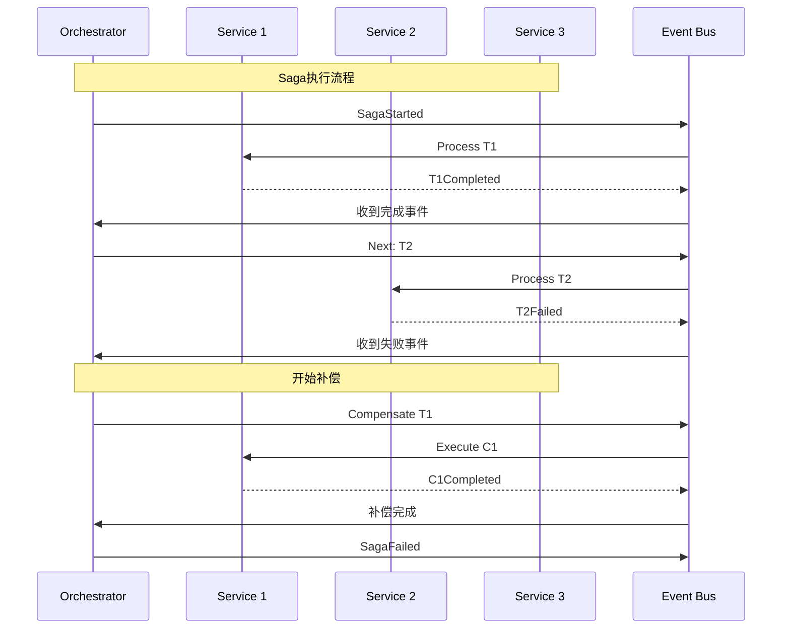
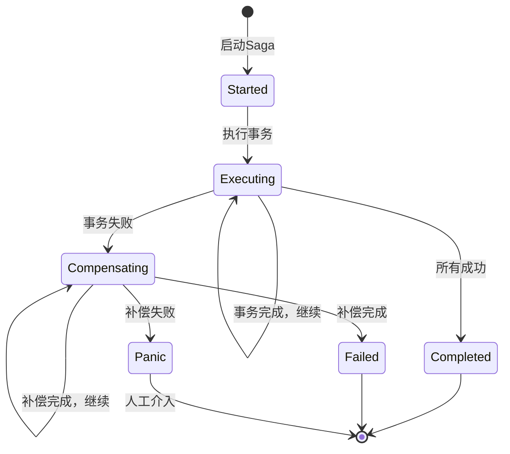
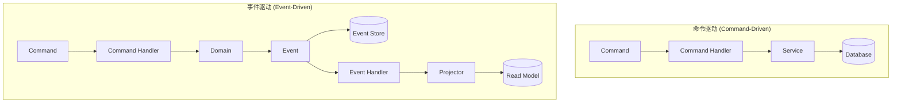
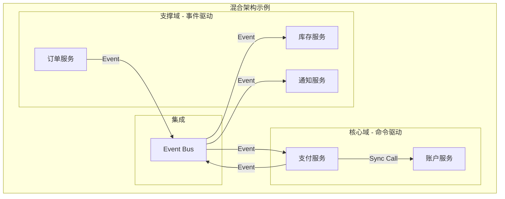

# 事件驱动工作流架构

**文档版本**：v1.0
**创建时间**：2025年1月
**状态**：✅ **已完成**

---

## 📋 执行摘要

事件驱动架构是现代工作流系统的重要设计范式。本文档深入分析事件驱动工作流的核心模式，包括事件溯源(Event Sourcing)、CQRS、事件总线设计、Saga编排实现，以及与命令驱动架构的对比分析。

---

## 一、架构概览

### 1.1 事件驱动工作流架构



### 1.2 核心组件对比

| 组件 | 职责 | 技术实现 |
|------|------|----------|
| **Event Store** | 持久化事件序列 | 时序数据库、WAL日志 |
| **Event Bus** | 事件路由分发 | Kafka、RabbitMQ、NATS |
| **Event Router** | 事件路由策略 | 规则引擎、内容路由 |
| **Event Handler** | 处理事件逻辑 | 无状态服务、函数计算 |
| **Projection** | 构建读模型 | 物化视图、流处理 |

---

## 二、事件溯源 (Event Sourcing)

### 2.1 事件溯源原理

**核心思想**：不存储当前状态，而是存储导致状态变化的所有事件序列。状态可以通过重放事件重建。



**数学定义**：

$$
\text{State}(t) = \text{fold}(\text{events}[0:t]) = \text{apply}(\text{apply}(...\text{apply}(\text{initial}, e_1), e_2)...), e_n)
$$

其中：

- $State(t)$: 时间$t$的状态
- $events[0:t]$: 从0到$t$的事件序列
- $apply$: 事件应用函数
- $initial$: 初始状态

### 2.2 事件溯源架构



### 2.3 事件结构设计

**标准事件格式**：

```protobuf
message Event {
    // 事件标识
    string event_id = 1;           // 全局唯一ID
    string event_type = 2;         // 事件类型
    string aggregate_id = 3;       // 聚合根ID
    int64 version = 4;             // 版本号（乐观锁）

    // 时间戳
    int64 timestamp = 5;           // 事件发生时间
    int64 recorded_at = 6;         // 记录时间

    // 事件内容
    bytes payload = 7;             // 事件数据（JSON/Protobuf）
    map<string, string> metadata = 8;  // 元数据

    // 溯源信息
    string causation_id = 9;       // 导致此事件的事件ID
    string correlation_id = 10;    // 关联ID（跨边界）
    string user_id = 11;           // 操作用户
}
```

**事件类型分类**：

| 事件类别 | 示例 | 说明 |
|----------|------|------|
| **Domain Event** | OrderCreated | 业务领域事件 |
| **Integration Event** | OrderCreated_v1 | 跨服务集成事件 |
| **System Event** | WorkflowStarted | 系统级事件 |
| **Command Event** | CreateOrderCmd | 命令封装为事件 |

### 2.4 源码级分析

**事件存储实现**（Go伪代码）：

```go
// EventStore接口
type EventStore interface {
    // 追加事件
    Append(ctx context.Context, events []Event) error

    // 读取事件流
    GetEvents(ctx context.Context, aggregateID string, fromVersion int64) ([]Event, error)

    // 读取所有事件（用于重建）
    GetAllEvents(ctx context.Context, aggregateID string) ([]Event, error)

    // 保存快照
    SaveSnapshot(ctx context.Context, aggregateID string, snapshot Snapshot) error

    // 读取快照
    GetSnapshot(ctx context.Context, aggregateID string) (*Snapshot, error)
}

// PostgreSQL实现
type PostgresEventStore struct {
    db *sql.DB
}

func (s *PostgresEventStore) Append(ctx context.Context, events []Event) error {
    tx, err := s.db.BeginTx(ctx, nil)
    if err != nil {
        return err
    }
    defer tx.Rollback()

    for _, event := range events {
        // 乐观并发控制
        result, err := tx.ExecContext(ctx, `
            INSERT INTO events (aggregate_id, version, event_type, payload, metadata, created_at)
            VALUES ($1, $2, $3, $4, $5, $6)
            ON CONFLICT (aggregate_id, version) DO NOTHING
        `, event.AggregateID, event.Version, event.EventType,
           event.Payload, event.Metadata, event.Timestamp)

        if err != nil {
            return err
        }

        rowsAffected, _ := result.RowsAffected()
        if rowsAffected == 0 {
            return ErrConcurrencyConflict
        }
    }

    return tx.Commit()
}

// 聚合根重建
func (s *PostgresEventStore) RebuildAggregate(
    ctx context.Context,
    aggregateID string,
    factory func() Aggregate,
) (Aggregate, error) {
    agg := factory()

    // 1. 尝试加载快照
    snapshot, err := s.GetSnapshot(ctx, aggregateID)
    if err != nil && err != ErrSnapshotNotFound {
        return nil, err
    }

    var fromVersion int64 = 0
    if snapshot != nil {
        agg.ApplySnapshot(snapshot)
        fromVersion = snapshot.Version + 1
    }

    // 2. 重放后续事件
    events, err := s.GetEvents(ctx, aggregateID, fromVersion)
    if err != nil {
        return nil, err
    }

    for _, event := range events {
        if err := agg.ApplyEvent(event); err != nil {
            return nil, err
        }
    }

    return agg, nil
}
```

### 2.5 快照策略

**快照触发策略**：

| 策略 | 描述 | 适用场景 |
|------|------|----------|
| **计数触发** | 每N个事件触发 | 事件频率稳定 |
| **时间触发** | 每T时间触发 | 状态变化频繁 |
| **大小触发** | 事件数据量超过阈值 | 大事件场景 |
| **混合触发** | 组合多种策略 | 通用场景 |

```go
// 快照管理器
type SnapshotManager struct {
    store        EventStore
    trigger      SnapshotTrigger
    serializer   SnapshotSerializer
}

type SnapshotTrigger interface {
    ShouldSnapshot(agg Aggregate, newEvents int) bool
}

// 计数触发器
type CountBasedTrigger struct {
    Threshold int
}

func (t *CountBasedTrigger) ShouldSnapshot(agg Aggregate, newEvents int) bool {
    return (agg.Version() % t.Threshold) == 0
}

// 创建快照
func (sm *SnapshotManager) CreateSnapshot(agg Aggregate) error {
    data, err := sm.serializer.Serialize(agg)
    if err != nil {
        return err
    }

    snapshot := Snapshot{
        AggregateID: agg.ID(),
        Version:     agg.Version(),
        Data:        data,
        CreatedAt:   time.Now(),
    }

    return sm.store.SaveSnapshot(context.Background(), agg.ID(), snapshot)
}
```

---

## 三、CQRS模式

### 3.1 CQRS架构

**Command Query Responsibility Segregation** (CQRS) 将读操作和写操作分离，使用不同的模型。



### 3.2 读写模型对比

| 特性 | Command Side | Query Side |
|------|--------------|------------|
| **模型** | 领域模型 | DTO/视图模型 |
| **存储** | Event Store | 读模型数据库 |
| **一致性** | 强一致性 | 最终一致性 |
| **优化目标** | 数据完整性 | 查询性能 |
| **复杂度** | 高 | 低 |

### 3.3 投影实现

**投影构建器**（Go伪代码）：

```go
// Projector接口
type Projector interface {
    HandleEvent(ctx context.Context, event Event) error
    GetView(viewName string) (View, error)
}

// 订单投影
type OrderProjector struct {
    db *sql.DB
}

func (p *OrderProjector) HandleEvent(ctx context.Context, event Event) error {
    switch event.EventType {
    case "OrderCreated":
        return p.handleOrderCreated(ctx, event)
    case "OrderPaid":
        return p.handleOrderPaid(ctx, event)
    case "OrderShipped":
        return p.handleOrderShipped(ctx, event)
    default:
        return nil
    }
}

func (p *OrderProjector) handleOrderCreated(ctx context.Context, event Event) error {
    var payload OrderCreatedPayload
    if err := json.Unmarshal(event.Payload, &payload); err != nil {
        return err
    }

    _, err := p.db.ExecContext(ctx, `
        INSERT INTO order_view (order_id, customer_id, status, total, created_at)
        VALUES ($1, $2, $3, $4, $5)
    `, event.AggregateID, payload.CustomerID, "created", payload.Total, event.Timestamp)

    return err
}

func (p *OrderProjector) handleOrderPaid(ctx context.Context, event Event) error {
    _, err := p.db.ExecContext(ctx, `
        UPDATE order_view
        SET status = 'paid', paid_at = $1
        WHERE order_id = $2
    `, event.Timestamp, event.AggregateID)

    return err
}

// 读取端
func (p *OrderProjector) GetOrderView(orderID string) (*OrderView, error) {
    var view OrderView
    err := p.db.QueryRow(`
        SELECT order_id, customer_id, status, total, created_at
        FROM order_view
        WHERE order_id = $1
    `, orderID).Scan(&view.OrderID, &view.CustomerID, &view.Status, &view.Total, &view.CreatedAt)

    if err != nil {
        return nil, err
    }
    return &view, nil
}
```

### 3.4 多投影策略

**按场景划分投影**：



---

## 四、事件总线设计

### 4.1 事件总线架构



### 4.2 消息队列选型

| 特性 | Kafka | RabbitMQ | NATS | Pulsar |
|------|-------|----------|------|--------|
| **吞吐量** | 百万级/秒 | 万级/秒 | 百万级/秒 | 百万级/秒 |
| **延迟** | 毫秒级 | 微秒级 | 微秒级 | 毫秒级 |
| **持久化** | ✅ 强 | ✅ 可选 | ⚠️ 有限 | ✅ 强 |
| **顺序保证** | ✅ 分区有序 | ✅ 队列有序 | ✅ 有序 | ✅ 有序 |
| **消费者组** | ✅ | ✅ | ✅ | ✅ |
| **扩展性** | 高 | 中 | 高 | 高 |
| **适用场景** | 大数据流 | 企业集成 | 云原生 | 多租户 |

### 4.3 事件路由策略

```go
// 事件路由器
type EventRouter struct {
    rules []RoutingRule
}

type RoutingRule struct {
    Name       string
    Condition  EventCondition
    Targets    []Target
    Priority   int
}

type EventCondition interface {
    Match(event Event) bool
}

// 类型匹配条件
type EventTypeCondition struct {
    Types []string
}

func (c *EventTypeCondition) Match(event Event) bool {
    for _, t := range c.Types {
        if event.EventType == t {
            return true
        }
    }
    return false
}

// 内容匹配条件
type ContentCondition struct {
    Path  string
    Value interface{}
}

func (c *ContentCondition) Match(event Event) bool {
    // JSON Path匹配
    result := jsonpath.Get(c.Path, event.Payload)
    return result == c.Value
}

// 路由执行
func (r *EventRouter) Route(event Event) ([]Target, error) {
    var targets []Target

    // 按优先级排序规则
    sort.Slice(r.rules, func(i, j int) bool {
        return r.rules[i].Priority > r.rules[j].Priority
    })

    for _, rule := range r.rules {
        if rule.Condition.Match(event) {
            targets = append(targets, rule.Targets...)

            // 如果规则设置了StopOnMatch，停止匹配
            if rule.StopOnMatch {
                break
            }
        }
    }

    return targets, nil
}

// 路由规则示例
rules := []RoutingRule{
    {
        Name: "High Priority Orders",
        Condition: &AndCondition{
            Conditions: []EventCondition{
                &EventTypeCondition{Types: []string{"OrderCreated"}},
                &ContentCondition{Path: "$.amount", Value: ">10000"},
            },
        },
        Targets: []Target{
            {Type: "Queue", Name: "priority-orders"},
            {Type: "Webhook", URL: "https://alerts.company.com/high-value"},
        },
        Priority:   100,
        StopOnMatch: true,
    },
}
```

### 4.4 事件序列化

**Schema演进策略**：

| 策略 | 描述 | 兼容性 |
|------|------|--------|
| **Schema Registry** | 集中管理Schema | 强兼容检查 |
| **Forward Compatible** | 新版本读旧数据 | 向后兼容 |
| **Backward Compatible** | 旧版本读新数据 | 向前兼容 |
| **Full Compatible** | 双向兼容 | 完全兼容 |

```protobuf
// 使用Protobuf + Schema Registry
syntax = "proto3";

message OrderCreated {
    string order_id = 1;
    string customer_id = 2;

    // 版本控制
    int32 schema_version = 100;

    // 字段保留（已废弃字段）
    reserved 3;  // 旧字段
    reserved "old_field";

    // 新增字段使用新编号
    string currency = 4;
    repeated string tags = 5;
}
```

---

## 五、Saga编排实现

### 5.1 Saga模式架构

**事件驱动Saga**：



### 5.2 Saga状态机



### 5.3 源码级实现

**事件驱动Saga协调器**（Go伪代码）：

```go
// Saga定义
type Saga struct {
    ID          string
    Steps       []SagaStep
    CurrentStep int
    Status      SagaStatus
    Events      []Event
}

type SagaStep struct {
    Name        string
    Service     string
    Action      Action
    Compensation Compensation
    Status      StepStatus
}

type SagaOrchestrator struct {
    eventStore    EventStore
    eventBus      EventBus
    sagaRegistry  map[string]*SagaDefinition
}

// 启动Saga
func (o *SagaOrchestrator) StartSaga(ctx context.Context, sagaType string, payload []byte) (*Saga, error) {
    definition := o.sagaRegistry[sagaType]

    saga := &Saga{
        ID:          generateID(),
        Steps:       make([]SagaStep, len(definition.Steps)),
        CurrentStep: 0,
        Status:      SagaStatusStarted,
    }

    // 复制步骤定义
    copy(saga.Steps, definition.Steps)

    // 记录Saga开始事件
    event := Event{
        EventType:   "SagaStarted",
        AggregateID: saga.ID,
        Payload:     payload,
        Timestamp:   time.Now(),
    }

    if err := o.eventStore.Append(ctx, []Event{event}); err != nil {
        return nil, err
    }

    // 发布事件
    if err := o.eventBus.Publish(ctx, event); err != nil {
        return nil, err
    }

    // 执行第一个步骤
    return saga, o.executeStep(ctx, saga, 0)
}

// 处理事件（事件处理器）
func (o *SagaOrchestrator) HandleEvent(ctx context.Context, event Event) error {
    switch event.EventType {
    case "StepCompleted":
        return o.handleStepCompleted(ctx, event)
    case "StepFailed":
        return o.handleStepFailed(ctx, event)
    case "CompensationCompleted":
        return o.handleCompensationCompleted(ctx, event)
    default:
        return nil
    }
}

func (o *SagaOrchestrator) handleStepCompleted(ctx context.Context, event Event) error {
    // 加载Saga状态
    saga, err := o.loadSaga(ctx, event.AggregateID)
    if err != nil {
        return err
    }

    // 更新步骤状态
    stepIndex := event.Metadata["step_index"]
    saga.Steps[stepIndex].Status = StepStatusCompleted
    saga.CurrentStep++

    // 检查是否完成
    if saga.CurrentStep >= len(saga.Steps) {
        return o.completeSaga(ctx, saga)
    }

    // 执行下一步
    return o.executeStep(ctx, saga, saga.CurrentStep)
}

func (o *SagaOrchestrator) handleStepFailed(ctx context.Context, event Event) error {
    saga, err := o.loadSaga(ctx, event.AggregateID)
    if err != nil {
        return err
    }

    // 标记失败步骤
    stepIndex := event.Metadata["step_index"]
    saga.Steps[stepIndex].Status = StepStatusFailed
    saga.Status = SagaStatusCompensating

    // 开始补偿（逆序）
    return o.compensate(ctx, saga, stepIndex-1)
}

// 执行补偿
func (o *SagaOrchestrator) compensate(ctx context.Context, saga *Saga, fromIndex int) error {
    for i := fromIndex; i >= 0; i-- {
        step := saga.Steps[i]

        // 只补偿已完成的步骤
        if step.Status != StepStatusCompleted {
            continue
        }

        // 发布补偿事件
        event := Event{
            EventType:   "CompensationRequested",
            AggregateID: saga.ID,
            Metadata: map[string]string{
                "step_index": strconv.Itoa(i),
                "step_name":  step.Name,
            },
        }

        if err := o.eventBus.Publish(ctx, event); err != nil {
            return err
        }
    }

    return nil
}
```

---

## 六、命令驱动 vs 事件驱动对比

### 6.1 架构对比



### 6.2 特性对比

| 特性 | 命令驱动 | 事件驱动 |
|------|----------|----------|
| **耦合度** | 高（直接调用） | 低（松耦合） |
| **扩展性** | 垂直扩展为主 | 水平扩展友好 |
| **可追溯性** | 有限 | 完整历史 |
| **最终一致性** | 强一致性 | 最终一致性 |
| **复杂度** | 简单 | 复杂 |
| **性能** | 低延迟 | 高吞吐 |
| **容错性** | 依赖重试 | 天然重放 |
| **审计** | 需额外实现 | 内置支持 |

### 6.3 适用场景

**命令驱动适用场景**：

- 强一致性要求（金融交易）
- 低延迟要求（实时系统）
- 简单业务逻辑
- 团队熟悉度高

**事件驱动适用场景**：

- 复杂业务流程
- 高扩展性要求
- 审计追溯需求
- 多服务协作
- 长时间运行流程

### 6.4 混合架构

**实践建议**：



---

## 七、性能考虑

### 7.1 性能指标

| 指标 | 目标值 | 优化策略 |
|------|--------|----------|
| **事件写入吞吐** | >10K events/s | 批量写入、异步刷盘 |
| **事件重放延迟** | <100ms | 快照机制、并行重放 |
| **投影延迟** | <1s | 异步投影、增量更新 |
| **端到端延迟** | <100ms | 缓存、预计算 |

### 7.2 优化策略

**1. 批量写入**：

```go
// 批量事件写入
type BatchEventStore struct {
    buffer   []Event
    bufferSize int
    flushInterval time.Duration
}

func (s *BatchEventStore) Append(events []Event) error {
    s.buffer = append(s.buffer, events...)

    if len(s.buffer) >= s.bufferSize {
        return s.flush()
    }

    return nil
}

func (s *BatchEventStore) flush() error {
    // 批量插入
    _, err := s.db.ExecContext(ctx,
        "INSERT INTO events (aggregate_id, version, event_type, payload) VALUES ",
        buildBatchValues(s.buffer)...,
    )

    s.buffer = s.buffer[:0]  // 清空缓冲区
    return err
}
```

**2. 投影缓存**：

```go
// 投影缓存
type CachedProjector struct {
    projector Projector
    cache     *ristretto.Cache
    ttl       time.Duration
}

func (c *CachedProjector) GetView(viewName string, key string) (View, error) {
    cacheKey := fmt.Sprintf("%s:%s", viewName, key)

    // 尝试从缓存获取
    if value, found := c.cache.Get(cacheKey); found {
        return value.(View), nil
    }

    // 从投影器获取
    view, err := c.projector.GetView(viewName, key)
    if err != nil {
        return nil, err
    }

    // 写入缓存
    c.cache.SetWithTTL(cacheKey, view, 1, c.ttl)

    return view, nil
}
```

---

## 八、相关文档

- [引擎架构](引擎架构.md) - 工作流引擎通用架构
- [Temporal实现](Temporal实现.md) - Temporal事件驱动实现
- [Airflow实现](Airflow实现.md) - Airflow架构
- [多语言SDK](多语言SDK.md) - SDK设计
- [Saga模式](../02-THEORY/workflow/Saga模式专题文档.md) - Saga理论基础
- [工作流网](../02-THEORY/workflow/工作流网专题文档.md) - 形式化基础
- [CAP定理](../02-THEORY/distributed-systems/CAP定理专题文档.md) - 一致性理论

---

**维护者**：项目团队
**最后更新**：2025年1月
**下次审查**：2025年4月
