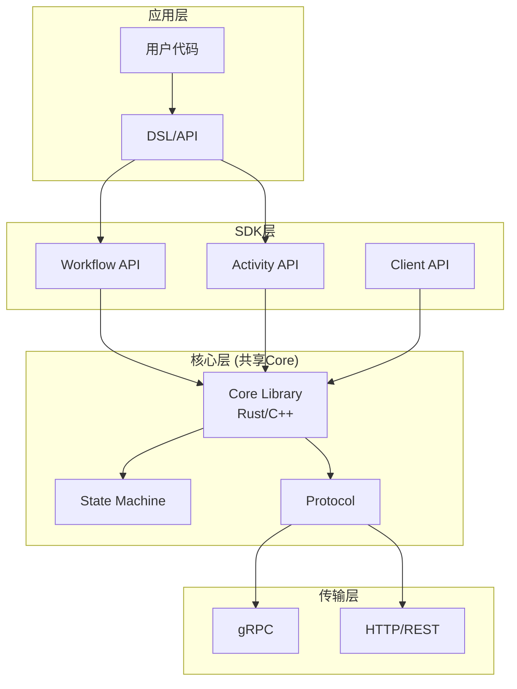
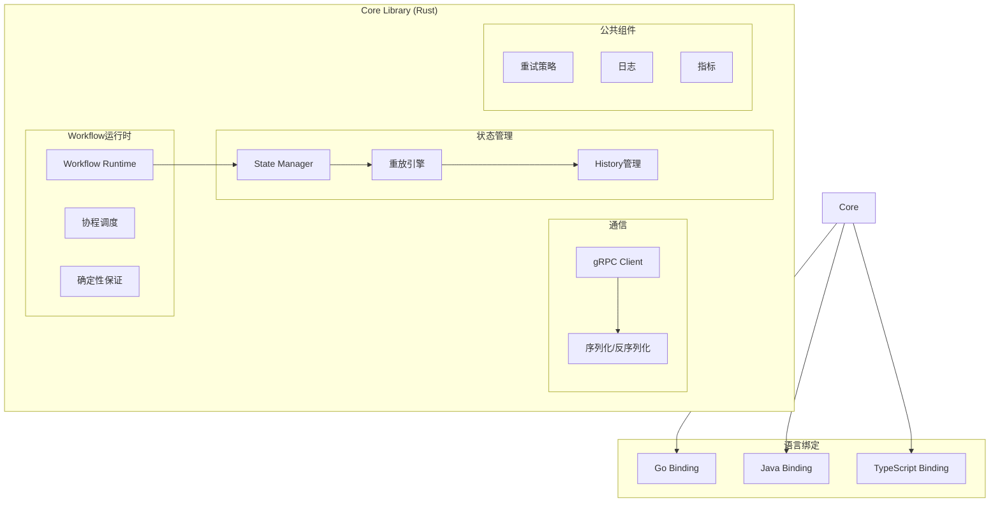
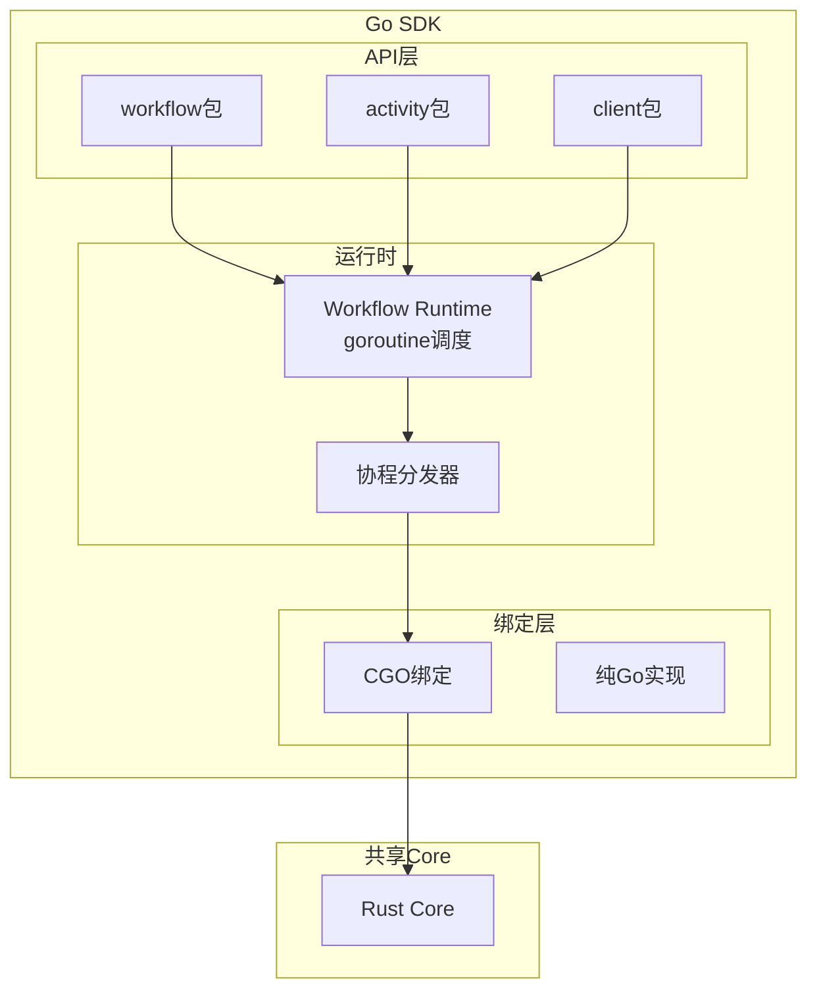
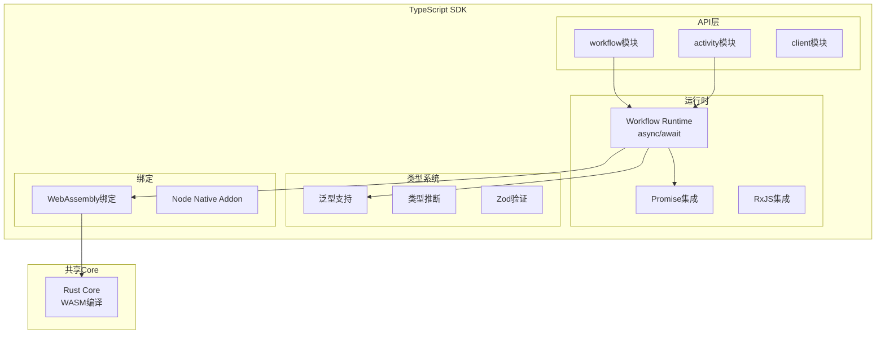
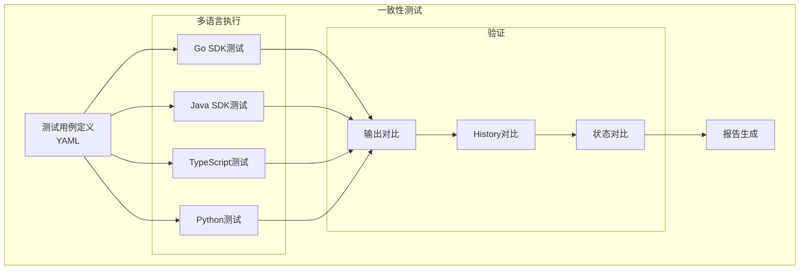

# 多语言SDK设计与实现

**文档版本**：v1.0
**创建时间**：2025年1月
**状态**：✅ **已完成**

---

## 📋 执行摘要

现代工作流引擎需要支持多种编程语言，以满足不同团队的技术栈需求。本文档分析多语言SDK的设计原则和实现模式，包括共享核心架构、Go/Java/TypeScript/Python SDK的具体实现，以及跨语言一致性保证机制。

---

## 一、SDK整体架构

### 1.1 分层架构



### 1.2 共享核心策略

**策略对比**：

| 策略 | 描述 | 优点 | 缺点 |
|------|------|------|------|
| **共享Core库** | 用Rust/C++实现核心，各语言绑定 | 性能高、一致性强 | 构建复杂、FFI开销 |
| **Proto定义共享** | 仅共享Protobuf定义 | 简单、灵活 | 逻辑重复实现 |
| **代码生成** | 从IDL生成多语言代码 | 自动化、一致 | 灵活性受限 |
| **纯语言实现** | 各语言独立实现 | 灵活、原生体验 | 维护成本高 |

**Temporal选择**：共享Core库（Rust实现）+ Proto定义

**Airflow 3.0选择**：Task SDK协议 + gRPC + 各语言独立实现

---

## 二、共享核心设计

### 2.1 Core库架构



### 2.2 核心组件职责

| 组件 | 职责 | 接口定义 |
|------|------|----------|
| **Workflow Runtime** | 工作流执行环境 | `run_workflow(fn, args, history)` |
| **State Manager** | 状态管理 | `get_state(), set_state()` |
| **Replay Engine** | 历史重放 | `replay(history)` |
| **gRPC Client** | 服务通信 | `poll_task(), respond_task()` |
| **Determinism** | 确定性保证 | `seeded_random(), workflow_time()` |

### 2.3 FFI接口设计

**C ABI接口**（简化）：

```c
// core.h - Core库C接口

#ifndef CORE_H
#define CORE_H

#include <stdint.h>
#include <stddef.h>

//  opaque类型定义
typedef struct WorkflowContext WorkflowContext;
typedef struct Runtime Runtime;

// 运行时管理
Runtime* runtime_new(const char* config);
void runtime_free(Runtime* runtime);

// 工作流执行
WorkflowContext* workflow_start(
    Runtime* runtime,
    const char* workflow_type,
    const uint8_t* args,
    size_t args_len,
    const uint8_t* history,
    size_t history_len
);

int workflow_poll_event(
    WorkflowContext* ctx,
    uint8_t** event_out,
    size_t* event_len
);

int workflow_complete(
    WorkflowContext* ctx,
    const uint8_t* result,
    size_t result_len
);

// 活动调用
int schedule_activity(
    WorkflowContext* ctx,
    const char* activity_type,
    const uint8_t* args,
    size_t args_len,
    uint64_t* seq_id
);

int get_activity_result(
    WorkflowContext* ctx,
    uint64_t seq_id,
    uint8_t** result_out,
    size_t* result_len,
    int* is_ready
);

// 定时器
int schedule_timer(
    WorkflowContext* ctx,
    uint64_t delay_ms,
    uint64_t* timer_id
);

#endif // CORE_H
```

---

## 三、Go SDK实现

### 3.1 Go SDK架构



### 3.2 Go SDK核心实现

**工作流上下文**：

```go
// workflow/context.go
package workflow

import (
    "context"
    "time"
)

// Context 工作流上下文
type Context interface {
    context.Context

    // 工作流信息
    WorkflowInfo() *WorkflowInfo

    // 完成信号
    Done() <-chan struct{}
    Err() error
}

// workflowContext 实现
type workflowContext struct {
    context.Context

    // 工作流状态
    workflowInfo *WorkflowInfo

    // 并发控制
    dispatcher *dispatcherImpl

    // 已完成的future（用于重放）
    completedFutures map[futureID]interface{}

    // 是否重放中
    isReplaying bool

    // 信号通道
    signalChannels map[string]*channelImpl
}

// ExecuteActivity 执行Activity
func ExecuteActivity(ctx Context, activity interface{}, args ...interface{}) Future {
    // 获取内部上下文
    wc := mustGetWorkflowContext(ctx)

    // 重放检查
    if wc.isReplaying {
        if cached := wc.getCachedActivityResult(activity); cached != nil {
            return NewCompletedFuture(cached)
        }
    }

    // 创建Future
    future := newActivityFuture()

    // 调度Activity
    wc.dispatcher.schedule(func() {
        // 通过Core库发送ScheduleActivity命令
        seqID := wc.scheduleActivity(activity, args)

        // 注册回调
        wc.registerActivityCallback(seqID, future)
    })

    return future
}

// Sleep 工作流定时器
func Sleep(ctx Context, d time.Duration) error {
    wc := mustGetWorkflowContext(ctx)

    // 重放检查
    if wc.isReplaying {
        if fired := wc.checkTimerFired(d); fired {
            return nil
        }
    }

    future := newTimerFuture()

    wc.dispatcher.schedule(func() {
        timerID := wc.scheduleTimer(d)
        wc.registerTimerCallback(timerID, future)
    })

    return future.Get(ctx, nil)
}

// GetSignalChannel 获取信号通道
func GetSignalChannel(ctx Context, signalName string) ReceiveChannel {
    wc := mustGetWorkflowContext(ctx)

    if ch, ok := wc.signalChannels[signalName]; ok {
        return ch
    }

    ch := newChannelImpl()
    wc.signalChannels[signalName] = ch

    // 注册信号处理器
    wc.registerSignalHandler(signalName, ch)

    return ch
}
```

**Worker实现**：

```go
// worker/worker.go
package worker

type Worker struct {
    client     client.Client
    taskQueue  string
    options    Options

    // 注册表
    workflowRegistry map[string]WorkflowFunc
    activityRegistry map[string]ActivityFunc

    // 任务轮询器
    pollers []*taskPoller

    // 限流器
    rateLimiter *rateLimiter
}

type Options struct {
    // 并发控制
    MaxConcurrentActivityExecutionSize    int
    MaxConcurrentWorkflowTaskExecutionSize int

    // Worker标识
    Identity    string
    BuildID     string  // Airflow 3.0风格版本

    // 轮询配置
    MaxConcurrentActivityTaskPollers    int
    MaxConcurrentWorkflowTaskPollers    int

    // 粘性执行
    StickyScheduleToStartTimeout time.Duration
    WorkflowCacheSize            int
}

// RegisterWorkflow 注册工作流
func (w *Worker) RegisterWorkflow(workflow interface{}) {
    fn := validateWorkflow(workflow)
    name := getWorkflowName(workflow)
    w.workflowRegistry[name] = fn
}

// RegisterActivity 注册活动
func (w *Worker) RegisterActivity(activity interface{}) {
    fn := validateActivity(activity)
    name := getActivityName(activity)
    w.activityRegistry[name] = fn
}

// Run 启动Worker
func (w *Worker) Run(interruptCh <-chan interface{}) error {
    // 启动工作流任务轮询器
    for i := 0; i < w.options.MaxConcurrentWorkflowTaskPollers; i++ {
        poller := newWorkflowTaskPoller(w)
        w.pollers = append(w.pollers, poller)
        go poller.pollLoop()
    }

    // 启动活动任务轮询器
    for i := 0; i < w.options.MaxConcurrentActivityTaskPollers; i++ {
        poller := newActivityTaskPoller(w)
        w.pollers = append(w.pollers, poller)
        go poller.pollLoop()
    }

    // 等待中断信号
    <-interruptCh

    return w.Stop()
}

// 任务轮询循环
func (p *taskPoller) pollLoop() {
    for {
        // 长轮询获取任务
        task, err := p.pollTask()
        if err != nil {
            log.Printf("Poll error: %v", err)
            time.Sleep(time.Second)
            continue
        }

        if task == nil {
            continue
        }

        // 处理任务
        go p.processTask(task)
    }
}

func (p *taskPoller) processTask(task *Task) {
    switch task.TaskType {
    case WorkflowTask:
        p.processWorkflowTask(task)
    case ActivityTask:
        p.processActivityTask(task)
    }
}
```

### 3.3 Go SDK特性

| 特性 | 实现方式 | 说明 |
|------|----------|------|
| **goroutine调度** | 自定义调度器 | 与Core协调 |
| **Channel语义** | 仿Go channel | 支持Select |
| **Context传递** | 标准context | 兼容Go生态 |
| **错误处理** | 多返回值 | 符合Go习惯 |
| **类型安全** | 泛型支持 (Go 1.18+) | 编译时检查 |

---

## 四、Java SDK实现

### 4.1 Java SDK架构

```mermaid
graph TB
    subgraph "Java SDK"
        subgraph "API层"
            WFInterface[@WorkflowInterface]
            ActInterface[@ActivityInterface]
            WorkflowStub[Workflow Stub]
        end

        subgraph "运行时"
            JavaRuntime[Workflow Runtime<br/>虚拟线程]
            CompletableFuture[CompletableFuture集成]
        end

        subgraph "集成"
            Spring[Spring Boot集成]
            Micronaut[Micronaut集成]
        end

        subgraph "绑定"
            JNA[JNA绑定]
            Panama[Project Panama]
        end
    end

    subgraph "共享Core"
        RustCore[Rust Core]
    end

    WFInterface --> JavaRuntime
    ActInterface --> JavaRuntime
    WorkflowStub --> JavaRuntime
    JavaRuntime --> CompletableFuture
    JavaRuntime --> Spring
    JavaRuntime --> JNA
    JNA --> RustCore
```

### 4.2 Java SDK核心实现

**工作流定义接口**：

```java
// Workflow接口定义
package io.temporal.workflow;

public interface Workflow {
    /**
     * 获取当前工作流时间（确定性）
     */
    static long currentTimeMillis() {
        return WorkflowInternal.currentTimeMillis();
    }

    /**
     * 执行Activity
     */
    static <R> R executeActivity(
        String activityName,
        Class<R> returnType,
        Object... args
    ) {
        return WorkflowInternal.executeActivity(activityName, returnType, args);
    }

    /**
     * 异步执行Activity
     */
    static <R> Promise<R> executeActivityAsync(
        String activityName,
        Class<R> returnType,
        ActivityOptions options,
        Object... args
    ) {
        return WorkflowInternal.executeActivityAsync(
            activityName, returnType, options, args
        );
    }

    /**
     * 创建定时器
     */
    static Promise<Void> newTimer(Duration delay) {
        return WorkflowInternal.newTimer(delay);
    }

    /**
     * 获取信号通道
     */
    static <T> SignalChannel<T> newSignalChannel(String name, Class<T> type) {
        return WorkflowInternal.newSignalChannel(name, type);
    }

    /**
     * 并行执行多个Promise
     */
    static <R> Promise<R> promiseAny(Iterable<Promise<R>> promises) {
        return WorkflowInternal.promiseAny(promises);
    }

    static <R> Promise<List<R>> promiseAll(Iterable<Promise<R>> promises) {
        return WorkflowInternal.promiseAll(promises);
    }
}

// 工作流定义示例
package com.example.workflows;

import io.temporal.workflow.*;
import io.temporal.activity.ActivityOptions;
import java.time.Duration;

@WorkflowInterface
public interface OrderWorkflow {
    @WorkflowMethod
    OrderResult processOrder(OrderRequest request);

    @SignalMethod
    void updateOrder(OrderUpdate update);

    @QueryMethod
    OrderStatus getStatus();
}

public class OrderWorkflowImpl implements OrderWorkflow {
    private final OrderActivities activities = Workflow.newActivityStub(
        OrderActivities.class,
        ActivityOptions.newBuilder()
            .setScheduleToCloseTimeout(Duration.ofMinutes(5))
            .setRetryOptions(
                RetryOptions.newBuilder()
                    .setInitialInterval(Duration.ofSeconds(1))
                    .setMaximumAttempts(3)
                    .build()
            )
            .build()
    );

    private OrderStatus status = OrderStatus.CREATED;
    private final List<OrderUpdate> updates = new ArrayList<>();

    @Override
    public OrderResult processOrder(OrderRequest request) {
        // 1. 验证订单
        activities.validateOrder(request);

        // 2. 处理支付
        PaymentResult payment = activities.processPayment(request);

        // 3. 等待发货确认（带超时）
        Promise<ShipmentResult> shipmentPromise =
            Async.function(activities::shipOrder, request);

        Promise<Void> timeoutPromise = Workflow.newTimer(Duration.ofHours(24));

        // 4. 等待任一完成
        Promise<?> result = Promise.any(shipmentPromise, timeoutPromise);

        if (result == timeoutPromise) {
            // 超时处理
            activities.cancelOrder(request);
            return new OrderResult(OrderStatus.CANCELLED);
        }

        status = OrderStatus.SHIPPED;
        return new OrderResult(status, shipmentPromise.get());
    }

    @Override
    public void updateOrder(OrderUpdate update) {
        updates.add(update);
        status = update.getNewStatus();
    }

    @Override
    public OrderStatus getStatus() {
        return status;
    }
}
```

**虚拟线程支持**（Java 21+）：

```java
// 虚拟线程工作流执行器
public class VirtualThreadWorkflowExecutor {
    private final ExecutorService executor = Executors.newVirtualThreadPerTaskExecutor();

    public <R> Promise<R> execute(Supplier<R> task) {
        CompletableFuture<R> future = CompletableFuture.supplyAsync(task, executor);
        return new PromiseImpl<>(future);
    }
}
```

### 4.3 Spring Boot集成

```java
// Spring Boot自动配置
@Configuration
@EnableConfigurationProperties(TemporalProperties.class)
public class TemporalAutoConfiguration {

    @Bean
    public WorkflowClient workflowClient(TemporalProperties props) {
        WorkflowServiceStubs service = WorkflowServiceStubs.newServiceStubs(
            WorkflowServiceStubsOptions.newBuilder()
                .setTarget(props.getServiceTarget())
                .build()
        );

        return WorkflowClient.newInstance(service);
    }

    @Bean
    public WorkerFactory workerFactory(
        WorkflowClient client,
        List<WorkflowImpl<?>> workflows,
        List<ActivityImpl<?>> activities
    ) {
        WorkerFactory factory = WorkerFactory.newInstance(client);

        Worker worker = factory.newWorker("my-task-queue");

        // 自动注册工作流
        for (WorkflowImpl<?> wf : workflows) {
            worker.registerWorkflowImplementationTypes(wf.getClass());
        }

        // 自动注册活动
        for (ActivityImpl<?> act : activities) {
            worker.registerActivitiesImplementations(act);
        }

        return factory;
    }
}

// 使用示例
@Service
public class OrderService {
    @Autowired
    private WorkflowClient workflowClient;

    public String startOrderWorkflow(OrderRequest request) {
        OrderWorkflow workflow = workflowClient.newWorkflowStub(
            OrderWorkflow.class,
            WorkflowOptions.newBuilder()
                .setWorkflowId("order-" + request.getOrderId())
                .setTaskQueue("order-queue")
                .build()
        );

        // 异步启动
        WorkflowExecution execution = WorkflowClient.start(
            workflow::processOrder,
            request
        );

        return execution.getWorkflowId();
    }
}
```

---

## 五、TypeScript SDK实现

### 5.1 TypeScript SDK架构



### 5.2 TypeScript SDK核心实现

**工作流API**：

```typescript
// workflow.ts
import { Context, ActivityOptions } from './types';

export interface WorkflowContext extends Context {
  /**
   * 工作流信息
   */
  readonly info: WorkflowInfo;

  /**
   * 是否为重放
   */
  readonly isReplaying: boolean;
}

/**
 * 执行Activity
 */
export async function executeActivity<T, Args extends any[]>(
  activityName: string,
  options: ActivityOptions,
  ...args: Args
): Promise<T> {
  const ctx = assertInWorkflowContext('executeActivity');

  // 重放检查
  if (ctx.isReplaying) {
    const cached = ctx.getCachedActivityResult(activityName, args);
    if (cached !== undefined) {
      return cached as T;
    }
  }

  // 调度Activity
  const handle = ctx.scheduleActivity(activityName, options, args);

  // 等待完成
  return new Promise((resolve, reject) => {
    handle.onComplete(resolve);
    handle.onError(reject);
  });
}

/**
 * 睡眠（定时器）
 */
export function sleep(duration: string | number): Promise<void> {
  const ctx = assertInWorkflowContext('sleep');
  const ms = typeof duration === 'string' ? parseDuration(duration) : duration;

  // 重放检查
  if (ctx.isReplaying) {
    if (ctx.checkTimerFired(ms)) {
      return Promise.resolve();
    }
  }

  return ctx.scheduleTimer(ms);
}

/**
 * 并行执行多个Promise
 */
export async function PromiseAll<T extends readonly unknown[] | []>(
  values: T
): Promise<{ -readonly [P in keyof T]: Awaited<T[P]> }> {
  const ctx = assertInWorkflowContext('PromiseAll');
  return ctx.promiseAll(values);
}

export async function PromiseRace<T extends readonly unknown[] | []>(
  values: T
): Promise<Awaited<T[number]>> {
  const ctx = assertInWorkflowContext('PromiseRace');
  return ctx.promiseRace(values);
}

/**
 * 条件等待
 */
export async function condition(
  predicate: () => boolean,
  timeout?: string | number
): Promise<boolean> {
  const ctx = assertInWorkflowContext('condition');

  return new Promise((resolve) => {
    const check = () => {
      if (predicate()) {
        resolve(true);
      }
    };

    // 注册条件检查
    ctx.registerCondition(check);

    // 设置超时
    if (timeout !== undefined) {
      sleep(timeout).then(() => resolve(false));
    }
  });
}

/**
 * 信号处理
 */
export function defineSignal<T>(name: string): SignalDefinition<T> {
  return {
    name,
    [Symbol.for('signal-definition')]: true,
  } as SignalDefinition<T>;
}

export function setHandler<T>(
  signal: SignalDefinition<T>,
  handler: (arg: T) => void
): void {
  const ctx = assertInWorkflowContext('setHandler');
  ctx.registerSignalHandler(signal.name, handler);
}
```

**工作流定义示例**：

```typescript
// workflows.ts
import {
  workflow,
  executeActivity,
  sleep,
  defineSignal,
  setHandler,
  condition,
} from '@temporalio/workflow';
import type * as activities from './activities';

const { processPayment, shipOrder, sendNotification } = workflow.proxyActivities<
  typeof activities
>({
  startToCloseTimeout: '5 minutes',
  retry: {
    initialInterval: '1 second',
    maximumAttempts: 3,
  },
});

// 定义信号
const updateOrderSignal = defineSignal<OrderUpdate>('updateOrder');

interface OrderState {
  status: OrderStatus;
  updates: OrderUpdate[];
}

export async function orderWorkflow(
  request: OrderRequest
): Promise<OrderResult> {
  const state: OrderState = {
    status: OrderStatus.CREATED,
    updates: [],
  };

  // 设置信号处理器
  setHandler(updateOrderSignal, (update: OrderUpdate) => {
    state.updates.push(update);
    state.status = update.newStatus;
  });

  // 1. 处理支付
  const paymentResult = await processPayment(request);
  state.status = OrderStatus.PAID;

  // 2. 等待发货（带超时和取消检查）
  const shipped = await Promise.race([
    // 等待发货完成
    shipOrder(request).then(() => true),

    // 24小时超时
    sleep('24 hours').then(() => false),

    // 等待取消信号
    condition(() => state.status === OrderStatus.CANCELLED).then(
      (cancelled) => cancelled
    ),
  ]);

  if (!shipped) {
    // 超时或取消
    await activities.cancelOrder(request);
    return { status: OrderStatus.CANCELLED };
  }

  state.status = OrderStatus.SHIPPED;

  // 3. 发送通知
  await sendNotification({
    orderId: request.orderId,
    status: state.status,
  });

  return { status: state.status };
}

// 查询处理器
export const getOrderStatus = workflow.defineQuery<OrderStatus>(
  'getOrderStatus'
);
```

### 5.3 类型安全设计

```typescript
// 类型定义
export interface ActivityOptions {
  type?: 'local' | 'remote';
  scheduleToCloseTimeout?: string | number;
  scheduleToStartTimeout?: string | number;
  startToCloseTimeout?: string | number;
  retry?: RetryPolicy;
  cancellationType?: ActivityCancellationType;
}

export interface RetryPolicy {
  initialInterval?: string | number;
  backoffCoefficient?: number;
  maximumInterval?: string | number;
  maximumAttempts?: number;
  nonRetryableErrorTypes?: string[];
}

// 泛型Activity调用
type ActivityFunction<Args extends any[], ReturnType> = (
  ...args: Args
) => ReturnType;

export function proxyActivities<T extends Record<string, ActivityFunction<any[], any>>>(
  options: ActivityOptions
): T {
  return new Proxy({} as T, {
    get(target, prop: string) {
      return (...args: any[]) => executeActivity(prop, options, ...args);
    },
  });
}
```

---

## 六、Python SDK实现

### 6.1 Python SDK架构

```mermaid
graph TB
    subgraph "Python SDK"
        subgraph "API层"
            Decorators[@workflow.decorator<br/>@activity.decorator]
            Client[Client API]
        end

        subgraph "运行时"
            AsyncIO[asyncio集成]
            Generator[Generator-based协程]
        end

        subgraph "类型系统"
            TypeHints[Type Hints]
            Dataclasses[Dataclasses支持]
            Pydantic[Pydantic验证]
        end

        subgraph "绑定"
            PyO3[PyO3绑定]
            CTypes[ctypes回退]
        end
    end

    subgraph "共享Core"
        RustCore[Rust Core]
    end

    Decorators --> AsyncIO
    Client --> AsyncIO
    AsyncIO --> Generator
    AsyncIO --> TypeHints
    AsyncIO --> PyO3
    PyO3 --> RustCore
```

### 6.2 Python SDK核心实现

**装饰器API**：

```python
# temporalio/workflow.py
from __future__ import annotations
from dataclasses import dataclass
from typing import Any, Callable, TypeVar, ParamSpec
import asyncio

P = ParamSpec('P')
R = TypeVar('R')

class WorkflowContext:
    """工作流上下文"""

    def __init__(self):
        self._is_replaying = False
        self._info: WorkflowInfo | None = None
        self._completed_activities: dict[int, Any] = {}

    @property
    def is_replaying(self) -> bool:
        return self._is_replaying

    @property
    def info(self) -> WorkflowInfo:
        return self._info

    def get_cached_activity_result(self, activity_id: int) -> Any | None:
        return self._completed_activities.get(activity_id)

# 上下文变量
_current_context: contextvars.ContextVar[WorkflowContext | None] =
    contextvars.ContextVar('workflow_context', default=None)

def workflow(fn: Callable[P, R]) -> Callable[P, R]:
    """工作流装饰器"""
    fn._is_workflow = True
    return fn

def activity(fn: Callable[P, R]) -> Callable[P, R]:
    """活动装饰器"""
    fn._is_activity = True
    return fn

async def execute_activity(
    activity: Callable[..., R],
    *args: Any,
    schedule_to_close_timeout: timedelta | None = None,
    retry_policy: RetryPolicy | None = None,
) -> R:
    """执行Activity"""
    ctx = _current_context.get()
    if ctx is None:
        raise RuntimeError("Not in workflow context")

    activity_name = activity.__name__

    # 重放检查
    if ctx.is_replaying:
        cached = ctx.get_cached_activity_result(id(activity))
        if cached is not None:
            return cached

    # 调度Activity（通过Core）
    future = await _schedule_activity(
        activity_name,
        args,
        schedule_to_close_timeout,
        retry_policy,
    )

    return await future

async def sleep(delta: timedelta | float) -> None:
    """工作流定时器"""
    ctx = _current_context.get()
    if ctx is None:
        raise RuntimeError("Not in workflow context")

    seconds = delta.total_seconds() if isinstance(delta, timedelta) else delta

    # 重放检查
    if ctx.is_replaying and ctx.check_timer_fired(seconds):
        return

    # 调度定时器
    await _schedule_timer(seconds)

def get_signal_channel(name: str) -> SignalChannel:
    """获取信号通道"""
    ctx = _current_context.get()
    if ctx is None:
        raise RuntimeError("Not in workflow context")

    return ctx.get_signal_channel(name)

class SignalChannel:
    """信号通道"""

    def __init__(self):
        self._queue: asyncio.Queue[Any] = asyncio.Queue()
        self._handlers: list[Callable[[Any], None]] = []

    async def receive(self) -> Any:
        """接收信号"""
        return await self._queue.get()

    def register_handler(self, handler: Callable[[Any], None]) -> None:
        """注册处理器"""
        self._handlers.append(handler)

    def send(self, value: Any) -> None:
        """发送信号（由外部调用）"""
        self._queue.put_nowait(value)
        for handler in self._handlers:
            handler(value)

async def wait_for(
    condition: Callable[[], bool],
    timeout: timedelta | float | None = None,
) -> bool:
    """等待条件满足"""
    ctx = _current_context.get()
    if ctx is None:
        raise RuntimeError("Not in workflow context")

    if condition():
        return True

    if timeout is None:
        # 无限等待
        while not condition():
            await asyncio.sleep(0.1)
        return True

    # 带超时等待
    timeout_seconds = timeout.total_seconds() if isinstance(timeout, timedelta) else timeout

    async def check_condition():
        while not condition():
            await asyncio.sleep(0.1)
        return True

    try:
        return await asyncio.wait_for(check_condition(), timeout=timeout_seconds)
    except asyncio.TimeoutError:
        return False
```

**工作流定义示例**：

```python
# workflows.py
from datetime import timedelta
from dataclasses import dataclass
from temporalio import workflow
from temporalio.workflow import execute_activity, sleep, get_signal_channel
from activities import process_payment, ship_order, send_notification

@dataclass
class OrderRequest:
    order_id: str
    customer_id: str
    amount: float

@dataclass
class OrderUpdate:
    status: str
    note: str | None = None

@workflow.defn
def order_workflow(request: OrderRequest) -> OrderResult:
    """订单处理工作流"""

    # 状态
    current_status = "created"
    updates: list[OrderUpdate] = []

    # 设置信号处理器
    update_channel = workflow.get_signal_channel("update_order")

    async def handle_update(update: OrderUpdate):
        updates.append(update)
        nonlocal current_status
        current_status = update.status

    update_channel.register_handler(handle_update)

    # 1. 处理支付
    payment_result = await workflow.execute_activity(
        process_payment,
        request,
        schedule_to_close_timeout=timedelta(minutes=5),
        retry_policy=RetryPolicy(
            maximum_attempts=3,
            initial_interval=timedelta(seconds=1),
        ),
    )

    current_status = "paid"

    # 2. 发货（带超时）
    shipment_task = asyncio.create_task(
        workflow.execute_activity(ship_order, request)
    )
    timeout_task = asyncio.create_task(sleep(timedelta(hours=24)))

    done, pending = await asyncio.wait(
        [shipment_task, timeout_task],
        return_when=asyncio.FIRST_COMPLETED,
    )

    # 取消未完成的任务
    for task in pending:
        task.cancel()

    if timeout_task in done:
        # 超时处理
        await workflow.execute_activity(cancel_order, request)
        return OrderResult(status="cancelled")

    current_status = "shipped"

    # 3. 发送通知
    await workflow.execute_activity(
        send_notification,
        {"order_id": request.order_id, "status": current_status},
    )

    return OrderResult(status=current_status)

# 查询处理器
@workflow.query
def get_order_status() -> str:
    """获取订单状态"""
    # 访问工作流状态
    return workflow.info().status
```

---

## 七、跨语言一致性保证

### 7.1 一致性维度

| 维度 | 保证方式 | 验证方法 |
|------|----------|----------|
| **API语义** | 共享Proto定义 | 一致性测试套件 |
| **执行语义** | 共享Core库 | 跨语言测试 |
| **序列化** | 共享Codec | 字节级对比 |
| **重放行为** | Core库统一 | 重放测试 |
| **错误处理** | 标准化错误码 | 错误注入测试 |

### 7.2 一致性测试框架



### 7.3 兼容性矩阵

| 特性 | Go | Java | TypeScript | Python |
|------|-----|------|------------|--------|
| **Workflow** | ✅ | ✅ | ✅ | ✅ |
| **Activity** | ✅ | ✅ | ✅ | ✅ |
| **Timer** | ✅ | ✅ | ✅ | ✅ |
| **Signal** | ✅ | ✅ | ✅ | ✅ |
| **Query** | ✅ | ✅ | ✅ | ✅ |
| **Child Workflow** | ✅ | ✅ | ✅ | ✅ |
| **Saga** | ✅ | ✅ | ✅ | ✅ |
| **Interceptor** | ✅ | ✅ | ✅ | ⚠️ |
| **Metrics** | ✅ | ✅ | ✅ | ⚠️ |
| **OpenTelemetry** | ✅ | ✅ | ✅ | ⚠️ |

---

## 八、相关文档

- [引擎架构](引擎架构.md) - 工作流引擎架构
- [Temporal实现](Temporal实现.md) - Temporal多语言实现
- [Airflow实现](Airflow实现.md) - Airflow Task SDK
- [事件驱动架构](事件驱动架构.md) - 事件驱动设计
- [Durable Execution](Durable-Execution.md) - Durable Execution语义

---

**维护者**：项目团队
**最后更新**：2025年1月
**下次审查**：2025年4月
