# 工作流引擎通用架构

**文档版本**：v1.0
**创建时间**：2025年1月
**状态**：✅ **已完成**

---

## 📋 执行摘要

工作流引擎是协调和管理业务流程执行的核心系统。本文档详细分析工作流引擎的通用架构，包括核心组件、分层设计、Worker模型和任务队列设计，为理解和实现工作流系统提供架构蓝图。

---

## 一、架构概览

### 1.1 整体架构图

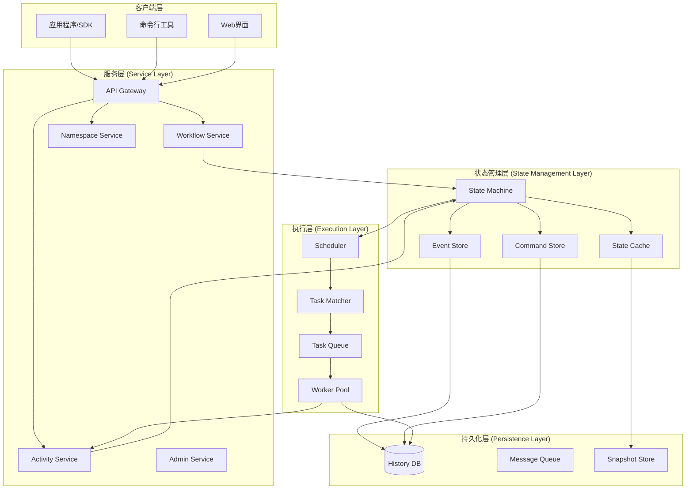

### 1.2 架构分层说明

| 层级 | 职责 | 核心组件 | 关键技术 |
|------|------|----------|----------|
| **客户端层** | 提供用户交互接口 | SDK、CLI、Web UI | gRPC/HTTP/REST |
| **服务层** | 处理业务请求 | Workflow/Activity/Namespace Service | 微服务架构 |
| **状态管理层** | 维护工作流状态 | State Machine、Event Store | 事件溯源 |
| **执行层** | 调度执行任务 | Scheduler、Worker Pool | 任务队列 |
| **持久化层** | 数据持久化 | History DB、Snapshot Store | 分布式存储 |

---

## 二、核心组件详解

### 2.1 调度器 (Scheduler)

**职责**：决定何时、何地执行工作流任务

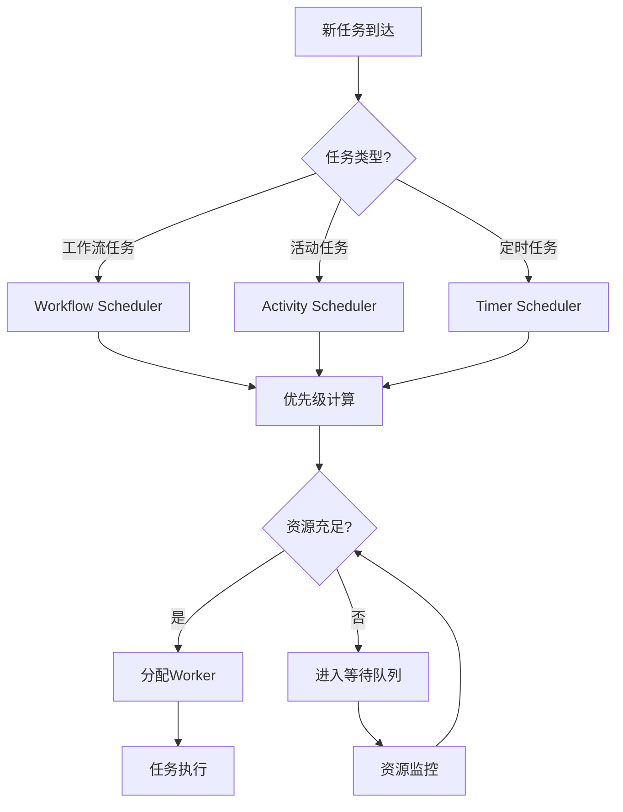

**调度算法**：

| 算法 | 适用场景 | 时间复杂度 | 特点 |
|------|----------|------------|------|
| **FIFO** | 简单场景 | O(1) | 公平，可能延迟 |
| **优先级调度** | 多优先级任务 | O(log n) | 高优任务优先 |
| **工作窃取** | 高吞吐场景 | O(1) | 负载均衡 |
| **延迟调度** | 批处理场景 | O(n) | 数据本地性 |
| **公平调度** | 多租户场景 | O(log n) | 资源公平分配 |

**源码级分析**（伪代码）：

```go
// 优先级调度器实现
type PriorityScheduler struct {
    taskQueue *PriorityQueue
    workers   *WorkerPool
    mu        sync.Mutex
}

func (s *PriorityScheduler) Schedule(task Task) error {
    s.mu.Lock()
    defer s.mu.Unlock()

    // 计算任务优先级
    priority := s.calculatePriority(task)
    task.SetPriority(priority)

    // 插入优先队列
    s.taskQueue.Push(task)

    // 尝试立即分配
    return s.tryDispatch()
}

func (s *PriorityScheduler) tryDispatch() error {
    for s.workers.Available() > 0 && !s.taskQueue.Empty() {
        task := s.taskQueue.Pop()
        worker := s.workers.Acquire()

        go func(t Task, w Worker) {
            defer s.workers.Release(w)
            w.Execute(t)
        }(task, worker)
    }
    return nil
}

// 优先级计算
func (s *PriorityScheduler) calculatePriority(task Task) int {
    basePriority := task.BasePriority()  // 1-5

    // 考虑等待时间（老化）
    waitTime := time.Since(task.SubmitTime())
    ageBonus := int(waitTime.Minutes()) / 10

    // 考虑资源需求
    resourceFactor := s.resourceScore(task.ResourceRequirements())

    return basePriority*10 + ageBonus + resourceFactor
}
```

### 2.2 执行器 (Executor)

**职责**：实际执行工作流和活动代码

**执行器架构**：

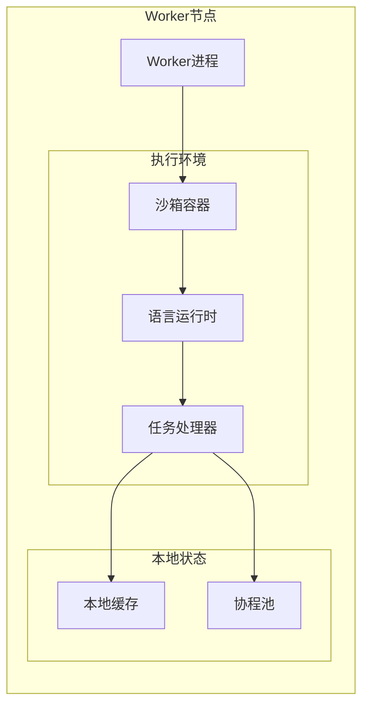

**执行器类型对比**：

| 执行器类型 | 隔离级别 | 启动延迟 | 资源开销 | 适用场景 |
|------------|----------|----------|----------|----------|
| **进程内** | 低 | <1ms | 低 | 高性能、信任环境 |
| **独立进程** | 中 | 10-50ms | 中 | 一般业务场景 |
| **容器** | 高 | 1-3s | 中 | 隔离要求高 |
| **虚拟机** | 最高 | 10-30s | 高 | 强隔离、安全 |

### 2.3 状态机 (State Machine)

**职责**：管理工作流状态转换

**状态机模型**：

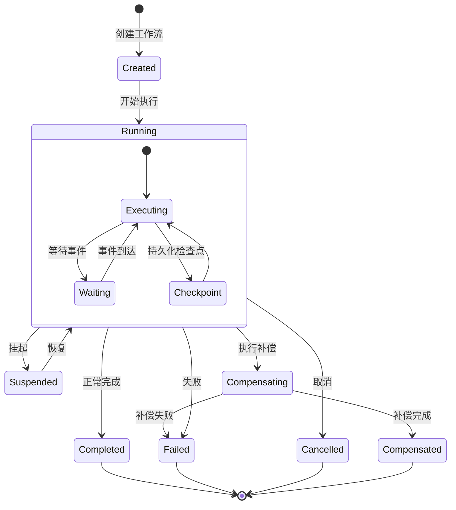

**状态转换表**：

| 当前状态 | 事件 | 下一状态 | 操作 |
|----------|------|----------|------|
| Created | Start | Running | 初始化执行环境 |
| Running | ActivityScheduled | Running | 记录历史事件 |
| Running | ActivityCompleted | Running | 更新状态，继续执行 |
| Running | TimerFired | Running | 处理定时器 |
| Running | SignalReceived | Running | 处理信号 |
| Running | Suspend | Suspended | 暂停执行 |
| Running | Fail | Failed | 记录失败原因 |
| Running | Cancel | Cancelled | 清理资源 |
| Failed | Retry | Running | 重试执行 |

---

## 三、分层架构详解

### 3.1 服务层 (Service Layer)

**职责**：对外提供API，处理业务逻辑

**服务拆分**：

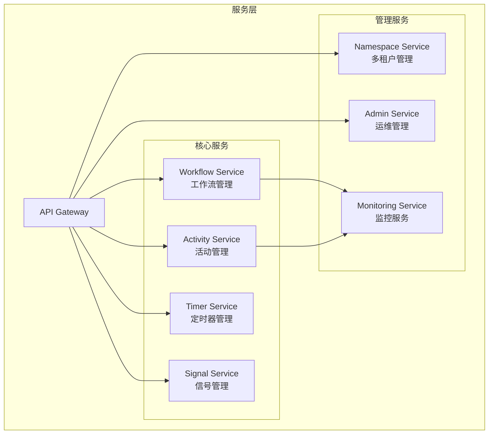

**各服务职责**：

| 服务 | 职责 | 关键API |
|------|------|---------|
| **Workflow Service** | 启动、查询、信号工作流 | StartWorkflow, QueryWorkflow, SignalWorkflow |
| **Activity Service** | 活动注册、执行、重试 | RegisterActivity, ExecuteActivity, RecordActivityResult |
| **Timer Service** | 定时器管理 | SetTimer, CancelTimer |
| **Signal Service** | 外部信号处理 | SendSignal, ProcessSignal |
| **Namespace Service** | 多租户隔离 | CreateNamespace, UpdateNamespace |

### 3.2 状态管理层 (State Management Layer)

**职责**：工作流状态的持久化和恢复

**事件溯源架构**：

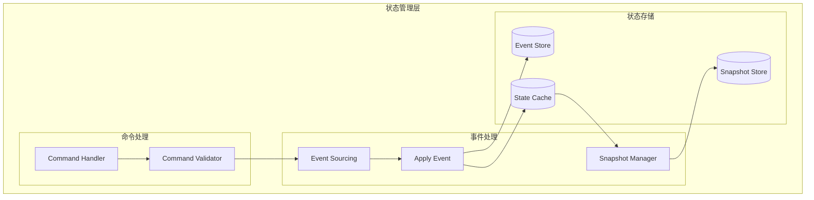

**状态重建流程**：

```
1. 加载最新快照（可选）
   State_snapshot(t_snapshot)

2. 重放后续事件
   for event in events[t_snapshot+1:current]:
       State = Apply(State, event)

3. 返回当前状态
   return State
```

**性能优化**：

| 优化策略 | 描述 | 效果 |
|----------|------|------|
| **快照机制** | 定期保存完整状态 | 减少重放事件数量 |
| **增量快照** | 只保存变化部分 | 减少存储和传输 |
| **状态缓存** | 缓存常用状态 | 减少重建时间 |
| **事件压缩** | 合并重复事件 | 减少存储空间 |

### 3.3 执行层 (Execution Layer)

**职责**：实际执行任务，管理Worker

**执行层架构**：

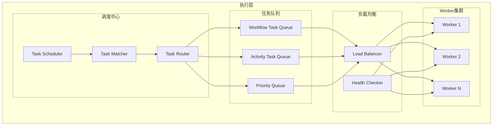

---

## 四、Worker模型

### 4.1 Worker架构

**Worker组件**：

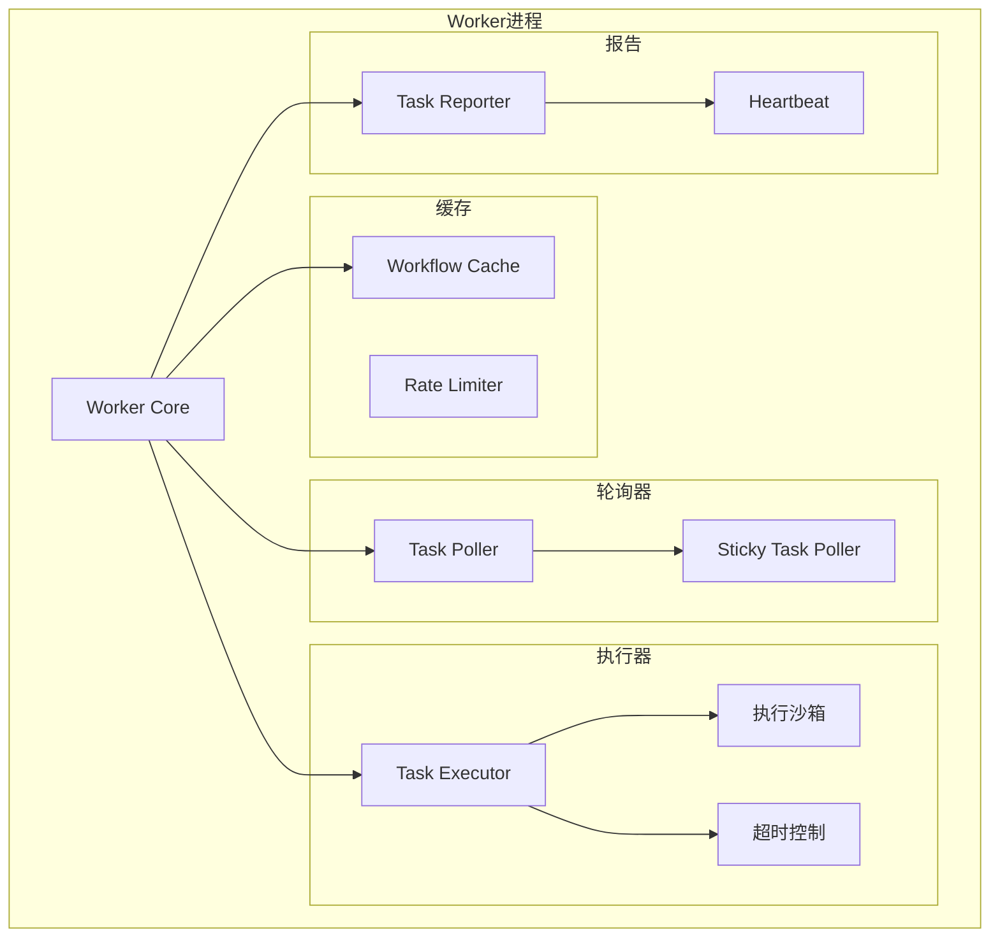

**Worker配置参数**：

| 参数 | 说明 | 默认值 | 建议值 |
|------|------|--------|--------|
| **MaxConcurrentActivity** | 最大并发活动数 | 100 | 根据CPU/内存调整 |
| **MaxConcurrentWorkflow** | 最大并发工作流数 | 50 | 根据内存调整 |
| **PollerCount** | 轮询器数量 | 2 | 4-8 |
| **HeartbeatInterval** | 心跳间隔 | 10s | 5-15s |
| **CacheSize** | 工作流缓存大小 | 1000 | 根据内存调整 |
| **StickyCacheTTL** | 粘性缓存TTL | 10s | 5-30s |

### 4.2 Worker运行机制

**长轮询机制**：

```go
// Worker长轮询实现（伪代码）
func (w *Worker) PollTask(ctx context.Context) (*Task, error) {
    // 1. 构建轮询请求
    req := &PollRequest{
        TaskQueue:       w.taskQueue,
        Identity:        w.identity,
        WorkerVersion:   w.version,
        MaxWaitTime:     60 * time.Second, // 长轮询超时
    }

    // 2. 发送长轮询请求
    // 服务端在有任务可用或超时时返回
    resp, err := w.client.Poll(ctx, req)
    if err != nil {
        return nil, err
    }

    // 3. 处理返回的任务
    if resp.Task != nil {
        return resp.Task, nil
    }

    // 4. 超时，继续轮询
    return w.PollTask(ctx)
}
```

**粘性执行 (Sticky Execution)**：

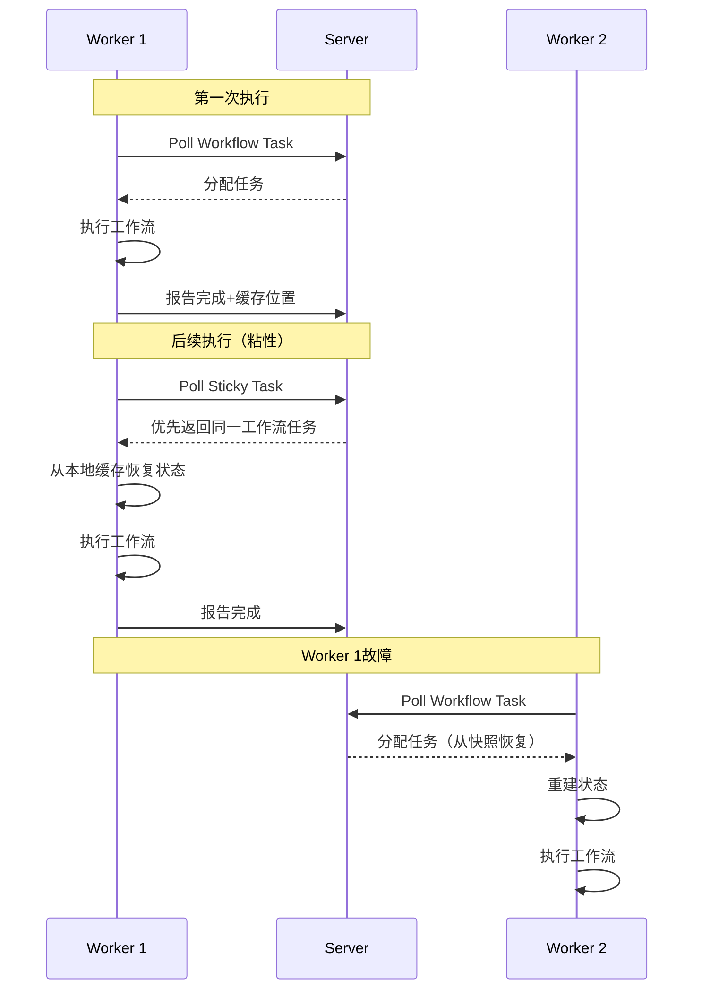

**粘性执行的优势**：

| 优势 | 描述 | 量化效果 |
|------|------|----------|
| **减少状态传输** | 状态缓存在Worker本地 | 减少90%+网络传输 |
| **降低延迟** | 避免从存储加载状态 | 减少50-100ms延迟 |
| **提高吞吐** | 减少重复状态重建 | 提升30-50%吞吐 |

---

## 五、任务队列设计

### 5.1 队列架构

**多层队列设计**：

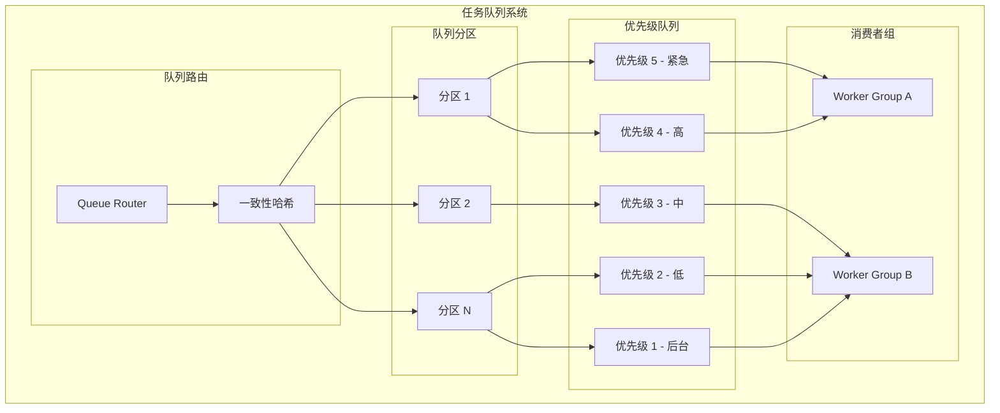

### 5.2 队列实现

**基于优先级的任务调度**：

```go
// 优先级队列实现（伪代码）
type PriorityTaskQueue struct {
    // 多级队列：每个优先级一个队列
    queues    [5]*list.List  // 优先级1-5
    mu        sync.RWMutex

    // 权重调度
    weights   [5]int         // 各优先级权重
    counter   [5]int         // 调度计数
}

func (pq *PriorityTaskQueue) Push(task Task) {
    priority := task.Priority() - 1 // 0-4

    pq.mu.Lock()
    defer pq.mu.Unlock()

    pq.queues[priority].PushBack(task)
}

func (pq *PriorityTaskQueue) Pop() Task {
    pq.mu.Lock()
    defer pq.mu.Unlock()

    // 加权轮询选择队列
    for i := 0; i < 5; i++ {
        idx := pq.selectQueue()
        if pq.queues[idx].Len() > 0 {
            elem := pq.queues[idx].Front()
            pq.queues[idx].Remove(elem)
            return elem.Value.(Task)
        }
    }

    return nil
}

// 加权选择算法
func (pq *PriorityTaskQueue) selectQueue() int {
    totalWeight := 0
    for _, w := range pq.weights {
        totalWeight += w
    }

    for i := 0; i < 5; i++ {
        pq.counter[i] += pq.weights[i]
        if pq.counter[i] >= totalWeight {
            pq.counter[i] -= totalWeight
            return i
        }
    }

    return 0
}
```

### 5.3 背压与流量控制

**背压机制**：

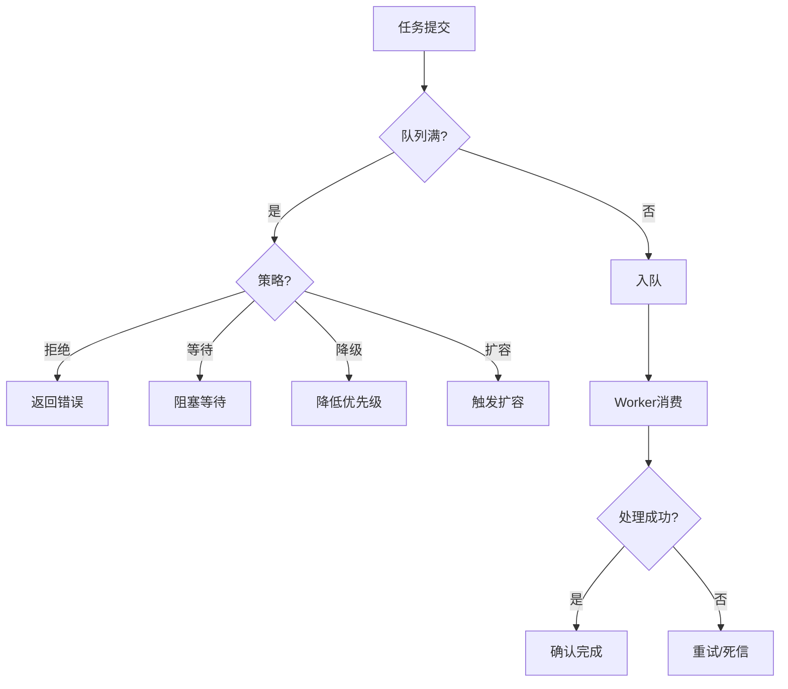

**流量控制策略**：

| 策略 | 描述 | 适用场景 |
|------|------|----------|
| **拒绝** | 队列满时直接拒绝 | 强实时性要求 |
| **等待** | 阻塞等待直到有空间 | 可靠性优先 |
| **降级** | 降低任务优先级入队 | 可延迟任务 |
| **扩容** | 自动增加Worker | 弹性伸缩场景 |

---

## 六、性能考虑

### 6.1 性能指标

**关键性能指标**：

| 指标 | 定义 | 目标值 | 优化方向 |
|------|------|--------|----------|
| **吞吐量** | 每秒处理任务数 | >1000 tasks/s | 并行度、批处理 |
| **延迟** | 任务调度延迟 | P99 < 100ms | 长轮询、缓存 |
| **恢复时间** | 故障恢复时间 | < 5s | 快照、并行恢复 |
| **资源利用** | CPU/内存利用率 | 70-80% | 负载均衡 |

### 6.2 性能优化策略

**1. 批处理优化**：

```go
// 批量事件处理
func (s *StateManager) ProcessEventsBatch(events []Event) error {
    // 1. 批量验证
    if err := s.validator.ValidateBatch(events); err != nil {
        return err
    }

    // 2. 批量写入
    if err := s.eventStore.AppendBatch(events); err != nil {
        return err
    }

    // 3. 批量应用
    for _, event := range events {
        s.state = s.apply(s.state, event)
    }

    // 4. 批量通知
    s.notifier.NotifyBatch(events)

    return nil
}
```

**2. 缓存策略**：

| 缓存类型 | 缓存内容 | 淘汰策略 | 命中率 |
|----------|----------|----------|--------|
| **工作流缓存** | 工作流状态 | LRU | 85%+ |
| **历史缓存** | 事件历史 | LFU | 70%+ |
| **Worker缓存** | 活动实现 | TTL | 90%+ |

**3. 数据库优化**：

- 使用连接池
- 批量写入
- 适当的索引策略
- 读写分离

### 6.3 扩展性设计

**水平扩展架构**：

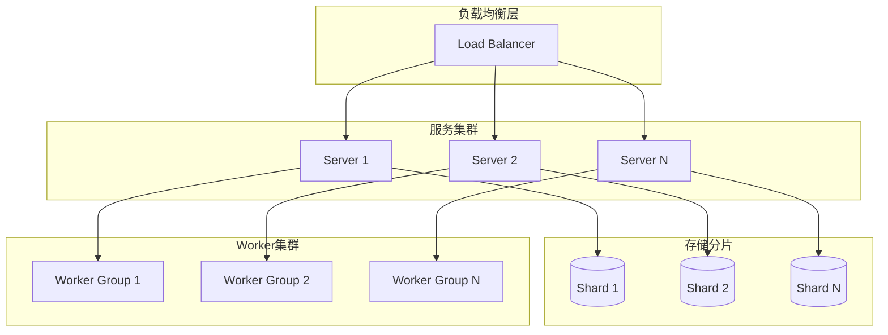

---

## 七、与其他文档的关联

### 7.1 相关文档

- [Durable Execution](Durable-Execution.md) - 持久化执行语义
- [状态机模型](状态机模型.md) - 状态机理论基础
- [Temporal实现](Temporal实现.md) - Temporal引擎具体实现
- [Airflow实现](Airflow实现.md) - Airflow引擎具体实现
- [事件驱动架构](事件驱动架构.md) - 事件驱动工作流设计
- [多语言SDK](多语言SDK.md) - SDK架构设计

### 7.2 理论模型关联

- [工作流网](../02-THEORY/workflow/工作流网专题文档.md) - Petri网建模
- [工作流模式](../02-THEORY/workflow/工作流模式专题文档.md) - 工作流模式实现
- [CAP定理](../02-THEORY/distributed-systems/CAP定理专题文档.md) - 一致性权衡
- [一致性模型](../02-THEORY/distributed-systems/一致性模型专题文档.md) - 状态一致性

---

## 八、最佳实践

### 8.1 架构设计原则

1. **关注点分离**：清晰的分层，每层只关注特定职责
2. **事件驱动**：使用事件溯源实现状态管理
3. **无状态服务**：服务层无状态，便于水平扩展
4. **背压机制**：防止过载，保护系统稳定性

### 8.2 运维建议

1. **监控指标**：吞吐量、延迟、错误率、资源利用率
2. **告警阈值**：P99延迟>200ms、错误率>1%、CPU>80%
3. **容量规划**：根据历史数据预测增长，提前扩容
4. **故障演练**：定期进行故障注入测试

---

**维护者**：项目团队
**最后更新**：2025年1月
**下次审查**：2025年4月
