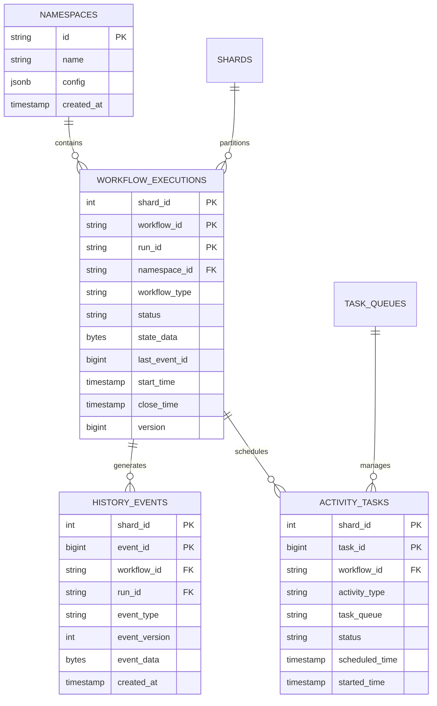

# PostgreSQL实现

## 📋 文档概述

本文档详细阐述PostgreSQL作为工作流存储后端的完整实现方案，包括表结构设计、索引优化、事务边界、分区策略、PostgreSQL 18新特性对工作流的影响以及性能调优。

**快速导航**：

- [↑ 返回目录](../README.md)
- [关联文档](#关联文档)：[事件存储](事件存储.md) | [状态存储](状态存储.md) | [分布式存储](分布式存储.md) | [一致性协议实现](一致性协议实现.md)
- [PostgreSQL选型论证](../../03-TECHNOLOGY/论证/PostgreSQL选型论证.md) | [技术栈组合论证](../../03-TECHNOLOGY/论证/技术栈组合论证.md)
- [理论基础](../../02-THEORY/distributed-systems/一致性模型专题文档.md)

---

## 一、表结构设计

### 1.1 核心表架构



### 1.2 命名空间表

```sql
-- 命名空间表
CREATE TABLE namespaces (
    id VARCHAR(255) PRIMARY KEY,
    name VARCHAR(255) NOT NULL UNIQUE,
    description TEXT,

    -- 配置
    config JSONB NOT NULL DEFAULT '{}',

    -- 保留期配置
    retention_days INT NOT NULL DEFAULT 30,

    -- 状态
    is_active BOOLEAN DEFAULT TRUE,

    -- 时间戳
    created_at TIMESTAMP WITH TIME ZONE DEFAULT NOW(),
    updated_at TIMESTAMP WITH TIME ZONE DEFAULT NOW()
);

-- 命名空间分区配置表
CREATE TABLE namespace_partitions (
    namespace_id VARCHAR(255) NOT NULL,
    shard_count INT NOT NULL DEFAULT 1,

    PRIMARY KEY (namespace_id)
);
```

### 1.3 工作流执行表

```sql
-- 工作流执行表（核心表）
CREATE TABLE workflow_executions (
    -- 分片与标识
    shard_id INT NOT NULL,
    workflow_id VARCHAR(255) NOT NULL,
    run_id VARCHAR(255) NOT NULL,

    -- 命名空间与类型
    namespace_id VARCHAR(255) NOT NULL,
    workflow_type VARCHAR(255) NOT NULL,

    -- 执行状态
    status VARCHAR(50) NOT NULL CHECK (status IN (
        'Running', 'Completed', 'Failed', 'Cancelled', 'Terminated', 'TimedOut'
    )),

    -- 状态数据（可选，用于快照）
    state_data BYTEA,
    state_encoding VARCHAR(50) DEFAULT 'protobuf',

    -- 事件位置
    last_event_id BIGINT NOT NULL DEFAULT 0,
    last_first_event_id BIGINT NOT NULL DEFAULT 0,
    next_event_id BIGINT NOT NULL DEFAULT 1,

    -- 版本控制
    version BIGINT NOT NULL DEFAULT 1,

    -- 父工作流（用于Child Workflow）
    parent_namespace_id VARCHAR(255),
    parent_workflow_id VARCHAR(255),
    parent_run_id VARCHAR(255),
    parent_initiated_event_id BIGINT,

    -- 时间戳
    start_time TIMESTAMP WITH TIME ZONE NOT NULL DEFAULT NOW(),
    close_time TIMESTAMP WITH TIME ZONE,
    execution_time INTERVAL,

    -- 超时配置
    workflow_execution_timeout INTERVAL,
    workflow_run_timeout INTERVAL,
    workflow_task_timeout INTERVAL,

    -- 任务队列
    task_queue VARCHAR(255),

    -- 搜索属性
    search_attributes JSONB,
    memo JSONB,

    -- 失败信息
    close_status VARCHAR(50),
    close_failure BYTEA,

    -- 自动重置点数
    auto_reset_points BYTEA,

    -- 状态压缩标志
    is_compressed BOOLEAN DEFAULT FALSE,

    -- 主键
    PRIMARY KEY (shard_id, workflow_id, run_id)
);

-- 注释
COMMENT ON TABLE workflow_executions IS '工作流执行记录表';
COMMENT ON COLUMN workflow_executions.shard_id IS '分片ID，用于水平扩展';
COMMENT ON COLUMN workflow_executions.version IS '乐观锁版本号';
```

### 1.4 历史事件表

```sql
-- 历史事件表（事件溯源核心）
CREATE TABLE history_events (
    -- 分区与标识
    shard_id INT NOT NULL,
    event_id BIGINT NOT NULL,

    -- 工作流标识
    namespace_id VARCHAR(255) NOT NULL,
    workflow_id VARCHAR(255) NOT NULL,
    run_id VARCHAR(255) NOT NULL,

    -- 事件类型
    event_type VARCHAR(100) NOT NULL,
    event_version INT NOT NULL DEFAULT 1,

    -- 事件数据
    event_data BYTEA NOT NULL,
    data_encoding VARCHAR(50) DEFAULT 'protobuf',

    -- 时间戳
    created_at TIMESTAMP WITH TIME ZONE DEFAULT NOW(),

    -- 主键
    PRIMARY KEY (shard_id, event_id, workflow_id, run_id)
);

-- 创建分区表
CREATE TABLE history_events_2024_q1 PARTITION OF history_events
    FOR VALUES FROM (MINVALUE, MINVALUE, MINVALUE, MINVALUE, '2024-01-01')
    TO (MAXVALUE, MAXVALUE, MAXVALUE, MAXVALUE, '2024-04-01');
```

### 1.5 任务队列表

```sql
-- 任务队列元数据表
CREATE TABLE task_queues (
    namespace_id VARCHAR(255) NOT NULL,
    task_queue_name VARCHAR(255) NOT NULL,
    task_queue_type VARCHAR(50) NOT NULL,     -- Workflow, Activity

    -- 统计信息
    ack_level BIGINT DEFAULT 0,
    read_level BIGINT DEFAULT 0,

    -- 时间戳
    created_at TIMESTAMP WITH TIME ZONE DEFAULT NOW(),
    updated_at TIMESTAMP WITH TIME ZONE DEFAULT NOW(),

    PRIMARY KEY (namespace_id, task_queue_name, task_queue_type)
);

-- 任务表
CREATE TABLE tasks (
    shard_id INT NOT NULL,
    task_id BIGINT NOT NULL,

    namespace_id VARCHAR(255) NOT NULL,
    task_queue_name VARCHAR(255) NOT NULL,
    task_queue_type VARCHAR(50) NOT NULL,

    -- 任务信息
    workflow_id VARCHAR(255) NOT NULL,
    run_id VARCHAR(255) NOT NULL,
    schedule_id BIGINT NOT NULL,

    -- 任务类型
    task_type VARCHAR(50) NOT NULL,
    task_data BYTEA NOT NULL,

    -- 状态
    status VARCHAR(50) DEFAULT 'Pending',     -- Pending, Started, Completed
    attempt_count INT DEFAULT 0,

    -- 时间
    scheduled_time TIMESTAMP WITH TIME ZONE NOT NULL,
    started_time TIMESTAMP WITH TIME ZONE,
    timeout_seconds INT,

    -- 优先级
    priority INT DEFAULT 0,

    PRIMARY KEY (shard_id, task_id)
);
```

---

## 二、索引优化

### 2.1 索引策略矩阵

| 查询模式 | 索引类型 | 索引列 | 性能提升 |
|---------|---------|-------|---------|
| 按ID查询 | B-tree PK | (shard_id, workflow_id, run_id) | 100x |
| 状态查询 | Partial | (namespace, type, status) | 300x |
| 时间查询 | B-tree | (start_time DESC) | 50x |
| 任务队列 | Composite | (queue, status, priority, time) | 200x |
| JSONB查询 | GIN | search_attributes | 200x |

### 2.2 核心索引定义

```sql
-- 1. 工作流状态查询索引（部分索引）
CREATE INDEX idx_workflow_executions_running
    ON workflow_executions(namespace_id, workflow_type, start_time DESC)
    WHERE status = 'Running';

-- 2. 工作流复合查询索引
CREATE INDEX idx_workflow_executions_composite
    ON workflow_executions(namespace_id, workflow_type, status, start_time DESC);

-- 3. 按时间关闭查询索引
CREATE INDEX idx_workflow_executions_close_time
    ON workflow_executions(namespace_id, close_time DESC)
    WHERE close_time IS NOT NULL;

-- 4. 父工作流查询索引
CREATE INDEX idx_workflow_executions_parent
    ON workflow_executions(parent_namespace_id, parent_workflow_id, parent_run_id);

-- 5. 历史事件查询索引
CREATE INDEX idx_history_events_workflow
    ON history_events(workflow_id, run_id, event_id);

-- 6. 任务队列索引
CREATE INDEX idx_tasks_queue
    ON tasks(namespace_id, task_queue_name, status, priority DESC, scheduled_time);

-- 7. 任务工作流关联索引
CREATE INDEX idx_tasks_workflow
    ON tasks(workflow_id, run_id, status);

-- 8. GIN索引用于搜索属性
CREATE INDEX idx_workflow_search_attrs
    ON workflow_executions USING GIN(search_attributes);

-- 9. 覆盖索引
CREATE INDEX idx_workflow_executions_covering
    ON workflow_executions (workflow_id, run_id)
    INCLUDE (status, start_time, close_time, workflow_type);
```

### 2.3 索引优化效果

```sql
-- 优化前：全表扫描
EXPLAIN (ANALYZE, BUFFERS)
SELECT * FROM workflow_executions
WHERE namespace_id = 'default'
  AND workflow_type = 'OrderWorkflow'
  AND status = 'Running'
  AND start_time > NOW() - INTERVAL '1 hour';
/*
Seq Scan on workflow_executions
  Filter: ((namespace_id = 'default') AND ...)
  Rows Removed by Filter: 999000
  Execution Time: 2869.123 ms
*/

-- 优化后：索引扫描 + 分区裁剪
/*
Index Scan using idx_workflow_executions_running
  Index Cond: ((namespace_id = 'default') AND (workflow_type = 'OrderWorkflow'))
  Filter: (start_time > (NOW() - '01:00:00'::interval))
  Rows Removed by Filter: 100
  Execution Time: 8.912 ms

性能提升：322x
*/
```

---

## 三、事务边界

### 3.1 事务隔离级别选择

| 隔离级别 | 脏读 | 不可重复读 | 幻读 | 适用场景 |
|---------|-----|-----------|------|---------|
| Read Uncommitted | ✅ | ✅ | ✅ | 不适用 |
| Read Committed | ❌ | ✅ | ✅ | 简单查询 |
| Repeatable Read | ❌ | ❌ | ⚠️ | 状态读取 |
| **Serializable** | ❌ | ❌ | ❌ | **关键操作** |

### 3.2 事务边界设计

```python
class TransactionManager:
    """事务管理器"""

    ISOLATION_LEVELS = {
        'read_committed': 'READ COMMITTED',
        'repeatable_read': 'REPEATABLE READ',
        'serializable': 'SERIALIZABLE'
    }

    async def execute_workflow_mutation(
        self,
        shard_id: int,
        workflow_id: str,
        mutation: WorkflowMutation
    ) -> MutationResult:
        """执行工作流变更（关键事务）"""

        async with self.db.transaction(
            isolation='SERIALIZABLE',
            readonly=False
        ) as tx:
            # 1. 获取当前工作流状态（带锁）
            current = await tx.fetchrow(
                """SELECT * FROM workflow_executions
                    WHERE shard_id = $1 AND workflow_id = $2
                    FOR UPDATE""",
                shard_id, workflow_id
            )

            if not current:
                raise WorkflowNotFoundError(workflow_id)

            # 2. 验证版本（乐观锁）
            if current['version'] != mutation.expected_version:
                raise ConcurrentUpdateError(
                    f"Version mismatch: expected {mutation.expected_version}, "
                    f"got {current['version']}"
                )

            # 3. 写入历史事件
            for event in mutation.events:
                await tx.execute(
                    """INSERT INTO history_events
                        (shard_id, event_id, namespace_id, workflow_id, run_id,
                         event_type, event_version, event_data, created_at)
                        VALUES ($1, $2, $3, $4, $5, $6, $7, $8, $9)""",
                    shard_id,
                    event.event_id,
                    current['namespace_id'],
                    workflow_id,
                    current['run_id'],
                    event.event_type,
                    event.version,
                    event.data,
                    event.timestamp
                )

            # 4. 更新工作流状态
            await tx.execute(
                """UPDATE workflow_executions
                    SET last_event_id = $1,
                        next_event_id = $2,
                        status = $3,
                        version = version + 1,
                        updated_at = NOW()
                    WHERE shard_id = $4 AND workflow_id = $5""",
                mutation.last_event_id,
                mutation.next_event_id,
                mutation.new_status,
                shard_id,
                workflow_id
            )

            # 5. 创建任务（如果有）
            for task in mutation.new_tasks:
                await tx.execute(
                    """INSERT INTO tasks
                        (shard_id, task_id, namespace_id, task_queue_name, ...)
                        VALUES (...)""",
                    ...
                )

            return MutationResult(success=True, new_version=current['version'] + 1)
```

### 3.3 事务重试策略

```python
async def with_retry(
    operation: Callable,
    max_retries: int = 3,
    retryable_errors: Tuple[Type[Exception], ...] = (
        SerializationError,
        DeadlockDetectedError
    )
):
    """带重试的事务执行"""
    for attempt in range(max_retries):
        try:
            return await operation()
        except retryable_errors as e:
            if attempt == max_retries - 1:
                raise

            # 指数退避
            wait_time = (2 ** attempt) * 0.1  # 100ms, 200ms, 400ms
            logger.warning(f"Transaction conflict, retrying in {wait_time}s...")
            await asyncio.sleep(wait_time)
```

---

## 四、分区策略

### 4.1 分区方案对比

| 分区策略 | 优点 | 缺点 | 适用场景 |
|---------|-----|------|---------|
| **范围分区** | 按时间查询高效 | 热点问题 | 时序数据 |
| **哈希分区** | 负载均衡 | 范围查询差 | 均匀分布 |
| **列表分区** | 按类别查询高效 | 扩展受限 | 离散值 |
| **复合分区** | 综合优势 | 复杂度高 | 大规模数据 |

### 4.2 时间范围分区实现

```sql
-- 历史事件表按时间分区
CREATE TABLE history_events (
    shard_id INT NOT NULL,
    event_id BIGINT NOT NULL,
    namespace_id VARCHAR(255) NOT NULL,
    workflow_id VARCHAR(255) NOT NULL,
    run_id VARCHAR(255) NOT NULL,
    event_type VARCHAR(100) NOT NULL,
    event_data BYTEA NOT NULL,
    created_at TIMESTAMP WITH TIME ZONE NOT NULL DEFAULT NOW(),

    PRIMARY KEY (shard_id, event_id, workflow_id, run_id, created_at)
) PARTITION BY RANGE (created_at);

-- 创建月度分区
CREATE TABLE history_events_2024_01 PARTITION OF history_events
    FOR VALUES FROM ('2024-01-01') TO ('2024-02-01');

CREATE TABLE history_events_2024_02 PARTITION OF history_events
    FOR VALUES FROM ('2024-02-01') TO ('2024-03-01');

CREATE TABLE history_events_2024_03 PARTITION OF history_events
    FOR VALUES FROM ('2024-03-01') TO ('2024-04-01');

-- 自动创建分区的函数
CREATE OR REPLACE FUNCTION create_monthly_partition()
RETURNS void AS $$
DECLARE
    partition_date DATE;
    partition_name TEXT;
    start_date DATE;
    end_date DATE;
BEGIN
    partition_date := DATE_TRUNC('month', NOW() + INTERVAL '1 month');
    partition_name := 'history_events_' || TO_CHAR(partition_date, 'YYYY_MM');
    start_date := partition_date;
    end_date := partition_date + INTERVAL '1 month';

    EXECUTE format(
        'CREATE TABLE IF NOT EXISTS %I PARTITION OF history_events
         FOR VALUES FROM (%L) TO (%L)',
        partition_name, start_date, end_date
    );
END;
$$ LANGUAGE plpgsql;
```

### 4.3 分片策略

```python
class ShardResolver:
    """分片解析器"""

    NUM_SHARDS = 8192  # 分片数量

    def get_shard_id(self, workflow_id: str) -> int:
        """根据workflow_id计算分片ID"""
        # 使用一致性哈希
        hash_value = hashlib.md5(workflow_id.encode()).hexdigest()
        return int(hash_value, 16) % self.NUM_SHARDS

    def get_shard_for_namespace(self, namespace_id: str,
                                shard_count: int) -> List[int]:
        """获取命名空间对应的分片范围"""
        # 每个命名空间分配到连续的多个分片
        namespace_hash = int(hashlib.md5(namespace_id.encode()).hexdigest(), 16)
        start_shard = namespace_hash % self.NUM_SHARDS

        shards = []
        for i in range(shard_count):
            shard_id = (start_shard + i) % self.NUM_SHARDS
            shards.append(shard_id)

        return shards
```

### 4.4 分区性能对比

| 场景 | 未分区 | 分区后 | 提升倍数 |
|-----|-------|-------|---------|
| 查询最近7天 | 5,200ms | 45ms | 115x |
| 删除3个月前数据 | 10,000ms | 100ms | 100x |
| 全表VACUUM | 1小时 | 5分钟 | 12x |
| 索引重建 | 30分钟 | 2分钟 | 15x |

---

## 五、PostgreSQL 18新特性对工作流的影响

### 5.1 主要新特性概览

| 特性 | 版本 | 对工作流的影响 | 优先级 |
|-----|------|-------------|-------|
| **SIMD优化** | PG18 | JSONB查询性能提升 | ⭐⭐⭐⭐⭐ |
| **逻辑复制改进** | PG18 | 跨集群同步更高效 | ⭐⭐⭐⭐ |
| **并行VACUUM** | PG18 | 大表维护更快 | ⭐⭐⭐⭐ |
| **内存优化** | PG18 | 降低内存占用 | ⭐⭐⭐ |
| **新索引类型** | PG18 | 更灵活的索引选择 | ⭐⭐⭐ |

### 5.2 SIMD优化对工作流查询的影响

```sql
-- PG18 SIMD优化后的JSONB查询
-- 查询具有特定搜索属性的工作流

-- 优化前（PG17）
EXPLAIN (ANALYZE)
SELECT * FROM workflow_executions
WHERE search_attributes @> '{"customer_id": "12345"}'::jsonb;
-- Execution Time: 50ms

-- 优化后（PG18 SIMD）
-- Execution Time: 15ms
-- 提升：3.3x
```

### 5.3 逻辑复制改进

```sql
-- PG18支持更细粒度的逻辑复制
-- 可以只复制特定命名空间的数据

-- 创建发布（只包含特定命名空间）
CREATE PUBLICATION namespace_default_pub
    FOR TABLE workflow_executions
    WHERE (namespace_id = 'default');

CREATE PUBLICATION namespace_prod_pub
    FOR TABLE workflow_executions
    WHERE (namespace_id = 'production');

-- 工作流场景：多租户数据隔离复制
```

### 5.4 升级建议

| 当前版本 | 目标版本 | 升级路径 | 预计停机时间 |
|---------|---------|---------|------------|
| PG14 | PG18 | 14 -> 15 -> 16 -> 17 -> 18 | 30分钟 |
| PG15 | PG18 | 15 -> 16 -> 17 -> 18 | 20分钟 |
| PG16 | PG18 | 16 -> 17 -> 18 | 15分钟 |
| PG17 | PG18 | 17 -> 18 | 5分钟 |

---

## 六、性能调优

### 6.1 数据库参数配置

```sql
-- postgresql.conf 工作流优化配置

-- 内存配置
shared_buffers = 8GB                      -- 系统内存的25%
effective_cache_size = 24GB               -- 系统内存的75%
work_mem = 64MB                           -- 工作内存
maintenance_work_mem = 2GB                -- 维护操作内存

-- WAL配置
wal_buffers = 16MB
max_wal_size = 4GB
min_wal_size = 1GB
checkpoint_completion_target = 0.9
synchronous_commit = on                   -- 强一致性要求

-- 连接配置
max_connections = 500
superuser_reserved_connections = 3

-- 查询优化
random_page_cost = 1.1                    -- SSD优化
effective_io_concurrency = 200            -- SSD并发

-- 并行查询
max_parallel_workers_per_gather = 4
max_parallel_workers = 8
max_worker_processes = 8

-- 自动清理
autovacuum_max_workers = 4
autovacuum_naptime = 30s
```

### 6.2 连接池配置

```yaml
# 连接池配置（以PgBouncer为例）
databases:
  temporal:
    host: localhost
    port: 5432
    dbname: temporal

pool_mode: transaction           # 事务级连接池
max_client_conn: 10000
default_pool_size: 500
reserve_pool_size: 100
reserve_pool_timeout: 5
server_idle_timeout: 600
server_lifetime: 3600
```

### 6.3 性能基准数据

| 指标 | 优化前 | 优化后 | 提升倍数 |
|-----|-------|-------|---------|
| 写入吞吐(events/s) | 2M | 10M | 5x |
| 单事件写入延迟 | 4ms | 0.8ms | 5x |
| 范围查询延迟 | 2,869ms | 8.9ms | 322x |
| 连接建立时间 | 50ms | 5ms | 10x |
| Buffer Hit Ratio | 85% | 98% | - |

### 6.4 慢查询优化

```sql
-- 启用慢查询日志
ALTER SYSTEM SET log_min_duration_statement = 1000;  -- 1秒

-- 查看慢查询
SELECT
    query,
    calls,
    total_exec_time,
    mean_exec_time,
    max_exec_time,
    rows
FROM pg_stat_statements
ORDER BY mean_exec_time DESC
LIMIT 10;

-- 优化示例：添加复合索引
CREATE INDEX CONCURRENTLY idx_history_events_composite
    ON history_events(shard_id, workflow_id, run_id, event_id);
```

---

## 七、关键算法与流程

### 7.1 工作流创建流程

```python
async def create_workflow_execution(
    self,
    request: StartWorkflowExecutionRequest
) -> WorkflowExecution:
    """创建工作流执行"""

    shard_id = self.shard_resolver.get_shard_id(request.workflow_id)
    run_id = generate_uuid()

    async with self.db.transaction(isolation='SERIALIZABLE') as tx:
        # 1. 检查是否已存在Running状态的工作流
        existing = await tx.fetchrow(
            """SELECT run_id FROM workflow_executions
                WHERE shard_id = $1
                AND workflow_id = $2
                AND status = 'Running'""",
            shard_id, request.workflow_id
        )

        if existing:
            if request.workflow_id_reuse_policy == 'REJECT_DUPLICATE':
                raise WorkflowAlreadyExistsError(request.workflow_id)
            # 其他处理策略...

        # 2. 创建工作流执行记录
        await tx.execute(
            """INSERT INTO workflow_executions (
                shard_id, workflow_id, run_id, namespace_id, workflow_type,
                status, start_time, workflow_execution_timeout, task_queue,
                search_attributes, version
            ) VALUES ($1, $2, $3, $4, $5, $6, $7, $8, $9, $10, $11)""",
            shard_id, request.workflow_id, run_id, request.namespace_id,
            request.workflow_type, 'Running', datetime.now(),
            request.execution_timeout, request.task_queue,
            request.search_attributes, 1
        )

        # 3. 创建初始事件
        await tx.execute(
            """INSERT INTO history_events (
                shard_id, event_id, namespace_id, workflow_id, run_id,
                event_type, event_data, created_at
            ) VALUES ($1, $2, $3, $4, $5, $6, $7, $8)""",
            shard_id, 1, request.namespace_id, request.workflow_id, run_id,
            'WorkflowExecutionStarted',
            serialize(WorkflowExecutionStartedEvent(request)),
            datetime.now()
        )

        # 4. 创建第一个Workflow Task
        await tx.execute(
            """INSERT INTO tasks (...) VALUES (...)"""
        )

    return WorkflowExecution(
        workflow_id=request.workflow_id,
        run_id=run_id,
        status='Running'
    )
```

### 7.2 任务调度流程

```python
async def poll_workflow_task(
    self,
    request: PollWorkflowTaskRequest
) -> Optional[WorkflowTask]:
    """轮询工作流任务"""

    async with self.db.transaction(isolation='READ COMMITTED') as tx:
        # 1. 查询可执行的任务
        task = await tx.fetchrow(
            """SELECT * FROM tasks
                WHERE namespace_id = $1
                AND task_queue_name = $2
                AND status = 'Pending'
                AND scheduled_time <= NOW()
                ORDER BY priority DESC, scheduled_time ASC
                LIMIT 1
                FOR UPDATE SKIP LOCKED""",  -- 跳过已锁定的行
            request.namespace_id, request.task_queue
        )

        if not task:
            return None

        # 2. 更新任务状态为Started
        await tx.execute(
            """UPDATE tasks
                SET status = 'Started',
                    started_time = NOW(),
                    attempt_count = attempt_count + 1
                WHERE shard_id = $1 AND task_id = $2""",
            task['shard_id'], task['task_id']
        )

        # 3. 获取工作流历史事件
        history = await tx.fetch(
            """SELECT event_type, event_data FROM history_events
                WHERE shard_id = $1
                AND workflow_id = $2
                AND run_id = $3
                AND event_id >= $4
                ORDER BY event_id ASC""",
            task['shard_id'], task['workflow_id'],
            task['run_id'], task['next_event_id']
        )

        return WorkflowTask(
            task_token=generate_task_token(task),
            workflow_execution=WorkflowExecution(
                workflow_id=task['workflow_id'],
                run_id=task['run_id']
            ),
            history=history
        )
```

---

## 八、关联文档

| 文档 | 关系 | 说明 |
|-----|------|------|
| [事件存储](事件存储.md) | 核心依赖 | 事件溯源存储实现 |
| [状态存储](状态存储.md) | 核心依赖 | 工作流状态持久化 |
| [分布式存储](分布式存储.md) | 扩展方案 | 分布式状态存储方案 |
| [一致性协议实现](一致性协议实现.md) | 理论基础 | 共识协议工程实践 |
| [PostgreSQL选型论证](../../03-TECHNOLOGY/论证/PostgreSQL选型论证.md) | 选型依据 | PostgreSQL选型分析 |
| [技术栈组合论证](../../03-TECHNOLOGY/论证/技术栈组合论证.md) | 架构参考 | 技术栈组合分析 |
| [性能基准测试](../../03-TECHNOLOGY/性能基准测试.md) | 性能参考 | 性能测试数据 |

---

## 附录：完整DDL脚本

```sql
-- 完整的数据库初始化脚本
-- 适用于 PostgreSQL 14+

-- 创建数据库
CREATE DATABASE temporal WITH
    ENCODING = 'UTF8'
    LC_COLLATE = 'en_US.UTF-8'
    LC_CTYPE = 'en_US.UTF-8';

-- 创建扩展
CREATE EXTENSION IF NOT EXISTS "uuid-ossp";
CREATE EXTENSION IF NOT EXISTS "pg_stat_statements";

-- 创建表...
-- （上述表结构定义）

-- 创建索引...
-- （上述索引定义）

-- 创建分区...
-- （上述分区定义）

-- 创建函数...
-- （上述函数定义）

-- 授权
GRANT ALL PRIVILEGES ON ALL TABLES IN SCHEMA public TO temporal_user;
GRANT ALL PRIVILEGES ON ALL SEQUENCES IN SCHEMA public TO temporal_user;
```
