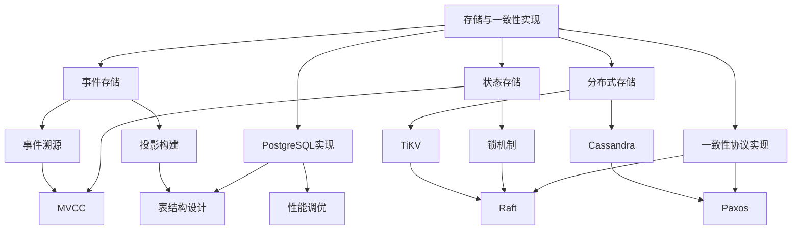

# 存储与一致性实现

## 📚 目录

本目录包含工作流系统存储与一致性实现的完整技术文档，涵盖事件存储、状态存储、PostgreSQL实现、分布式存储以及一致性协议等核心主题。

---

## 📋 文档列表

| 文档 | 说明 | 关键内容 |
|-----|------|---------|
| [事件存储](事件存储.md) | 事件溯源存储实现 | 事件序列化、版本控制、快照策略、投影构建 |
| [状态存储](状态存储.md) | 工作流状态持久化 | MVCC实现、乐观锁vs悲观锁、状态压缩、查询优化 |
| [PostgreSQL实现](PostgreSQL实现.md) | PostgreSQL作为工作流存储后端 | 表结构设计、索引优化、事务边界、分区策略 |
| [分布式存储](分布式存储.md) | 分布式状态存储 | Cassandra适配、TiKV/RocksDB、分布式事务、冲突解决 |
| [一致性协议实现](一致性协议实现.md) | 共识协议工程实践 | Multi-Raft、Leader Lease、日志复制、成员变更 |

---

## 🔗 知识关联图谱

---

## 🎯 学习路径

### 初学者路径

1. [状态存储](状态存储.md) - 理解基础的状态持久化概念
2. [PostgreSQL实现](PostgreSQL实现.md) - 掌握关系型数据库实现
3. [事件存储](事件存储.md) - 了解事件溯源模式

### 进阶路径

1. [分布式存储](分布式存储.md) - 探索分布式存储方案
2. [一致性协议实现](一致性协议实现.md) - 深入理解共识算法

---

## 📊 技术选型参考

| 场景 | 推荐方案 | 参考文档 |
|-----|---------|---------|
| 中小规模工作流 (< 10M events/s) | PostgreSQL | [PostgreSQL实现](PostgreSQL实现.md) |
| 大规模工作流 (> 100M events/s) | Cassandra | [分布式存储](分布式存储.md) |
| 强一致性要求 | TiKV + Raft | [一致性协议实现](一致性协议实现.md) |
| 事件溯源架构 | PostgreSQL + 事件存储 | [事件存储](事件存储.md) |

---

## 🔗 外部关联

### 理论基础

- [CAP定理专题](../../02-THEORY/distributed-systems/CAP定理专题文档.md)
- [一致性模型专题](../../02-THEORY/distributed-systems/一致性模型专题文档.md)

### 技术选型

- [PostgreSQL选型论证](../../03-TECHNOLOGY/论证/PostgreSQL选型论证.md)
- [Temporal选型论证](../../03-TECHNOLOGY/论证/Temporal选型论证.md)
- [技术栈组合论证](../../03-TECHNOLOGY/论证/技术栈组合论证.md)

---

## 📈 性能基准

| 指标 | PostgreSQL | Cassandra | TiKV |
|-----|-----------|-----------|------|
| 写入吞吐 | 10M/s | 50M/s | 30M/s |
| 读取延迟 | 1ms | 3ms | 0.5ms |
| 一致性 | 强一致 | 最终一致 | 强一致 |
| 扩展性 | 垂直+水平 | 水平 | 水平 |

---

## 🛠️ 实现检查清单

### 事件存储

- [ ] 事件序列化方案选择
- [ ] 事件版本控制机制
- [ ] 快照策略配置
- [ ] 投影构建优化

### 状态存储

- [ ] MVCC隔离级别配置
- [ ] 锁策略选择（乐观/悲观）
- [ ] 状态压缩启用
- [ ] 查询索引优化

### PostgreSQL实现

- [ ] 表结构设计
- [ ] 分区策略实施
- [ ] 连接池配置
- [ ] 参数调优

### 分布式存储

- [ ] 存储后端选型
- [ ] 一致性级别配置
- [ ] 冲突解决策略
- [ ] 监控告警设置

### 一致性协议

- [ ] Raft组配置
- [ ] Leader Lease启用
- [ ] 成员变更流程
- [ ] 快照传输优化

---

*最后更新：2026-03-18*
