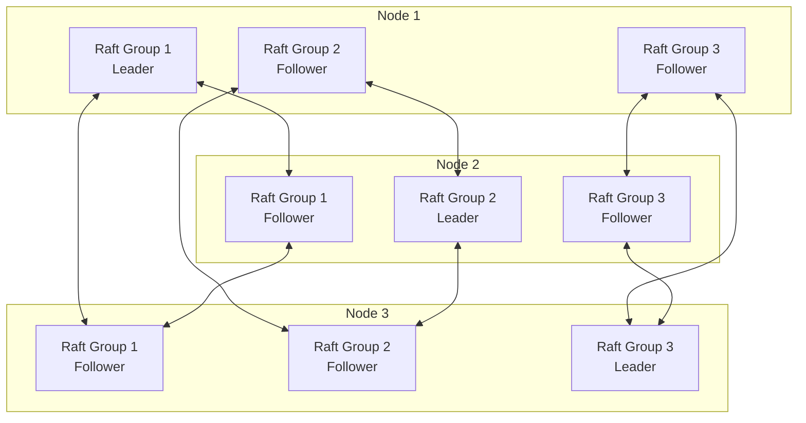
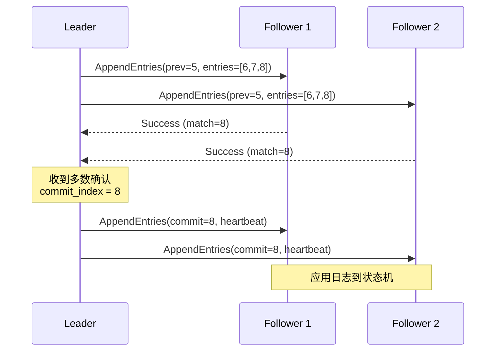

# 一致性协议实现

## 📋 文档概述

本文档详细阐述共识协议的工程实践，包括Multi-Raft实现、Leader Lease优化、日志复制优化、成员变更处理以及快照传输机制。

**快速导航**：

- [↑ 返回目录](../README.md)
- [关联文档](#关联文档)：[事件存储](事件存储.md) | [状态存储](状态存储.md) | [PostgreSQL实现](PostgreSQL实现.md) | [分布式存储](分布式存储.md)
- [理论基础](../../02-THEORY/distributed-systems/CAP定理专题文档.md) | [一致性模型](../../02-THEORY/distributed-systems/一致性模型专题文档.md)
- [Temporal选型论证](../../03-TECHNOLOGY/论证/Temporal选型论证.md)

---

## 一、共识协议基础

### 1.1 共识问题定义

**形式化定义**：

在分布式系统中，共识问题要求满足以下三个性质：

1. **一致性（Agreement）**：所有正确节点决定相同的值
$$ \forall p, q \in \text{Correct}: \text{decision}(p) = \text{decision}(q) $$

2. **有效性（Validity）**：决定的值必须是某个节点提议的值
$$ \forall p: \text{decision}(p) \in \text{ProposedValues} $$

3. **终止性（Termination）**：所有正确节点最终都会决定
$$ \forall p \in \text{Correct}: \Diamond \text{decision}(p) $$

### 1.2 共识协议对比

| 协议 | 容错数 | 消息复杂度 | 领导者 | 适用场景 |
|-----|-------|-----------|-------|---------|
| **Paxos** | 2f+1 | O(n²) | 隐式 | 理论基准 |
| **Multi-Paxos** | 2f+1 | O(n) | 显式 | 日志复制 |
| **Raft** | 2f+1 | O(n) | 显式 | 工程实现 |
| **ZAB** | 2f+1 | O(n) | 显式 | ZooKeeper |
| **PBFT** | 3f+1 | O(n²) | 轮换 | 拜占庭容错 |

---

## 二、Multi-Raft实现

### 2.1 Multi-Raft架构



### 2.2 Raft状态机

```python
from enum import Enum, auto
from typing import Optional, List, Dict
import asyncio

class RaftState(Enum):
    """Raft节点状态"""
    FOLLOWER = auto()
    CANDIDATE = auto()
    LEADER = auto()

class RaftNode:
    """Raft节点实现"""

    def __init__(self, node_id: str, peers: List[str]):
        self.node_id = node_id
        self.peers = peers
        self.state = RaftState.FOLLOWER

        # 持久化状态
        self.current_term = 0
        self.voted_for: Optional[str] = None
        self.log: List[LogEntry] = []

        # 易失状态
        self.commit_index = 0
        self.last_applied = 0

        # 领导者状态
        self.next_index: Dict[str, int] = {}
        self.match_index: Dict[str, int] = {}

        # 定时器
        self.election_timer: Optional[asyncio.Task] = None
        self.heartbeat_timer: Optional[asyncio.Task] = None

        # 配置
        self.election_timeout_min = 150  # ms
        self.election_timeout_max = 300  # ms
        self.heartbeat_interval = 50     # ms

    async def start(self):
        """启动Raft节点"""
        self.reset_election_timer()

    def reset_election_timer(self):
        """重置选举定时器"""
        if self.election_timer:
            self.election_timer.cancel()

        timeout = random.randint(
            self.election_timeout_min,
            self.election_timeout_max
        )
        self.election_timer = asyncio.create_task(
            self._election_timeout(timeout)
        )

    async def _election_timeout(self, timeout_ms: int):
        """选举超时处理"""
        await asyncio.sleep(timeout_ms / 1000)
        await self.become_candidate()

    async def become_candidate(self):
        """转变为候选者"""
        self.state = RaftState.CANDIDATE
        self.current_term += 1
        self.voted_for = self.node_id

        votes_received = 1  # 自己投自己

        # 并行发送RequestVote RPC
        vote_requests = [
            self._request_vote(peer) for peer in self.peers
        ]
        results = await asyncio.gather(*vote_requests, return_exceptions=True)

        for result in results:
            if isinstance(result, VoteResponse) and result.vote_granted:
                votes_received += 1

        # 获得多数票，成为领导者
        if votes_received > len(self.peers) // 2:
            await self.become_leader()

    async def become_leader(self):
        """转变为领导者"""
        self.state = RaftState.LEADER

        # 初始化领导者状态
        last_log_index = len(self.log)
        for peer in self.peers:
            self.next_index[peer] = last_log_index + 1
            self.match_index[peer] = 0

        # 停止选举定时器
        if self.election_timer:
            self.election_timer.cancel()

        # 启动心跳定时器
        self.heartbeat_timer = asyncio.create_task(
            self._send_heartbeats()
        )

        # 立即发送心跳
        await self._send_append_entries()

    async def _send_heartbeats(self):
        """定期发送心跳"""
        while self.state == RaftState.LEADER:
            await self._send_append_entries()
            await asyncio.sleep(self.heartbeat_interval / 1000)

    async def _send_append_entries(self):
        """发送AppendEntries RPC"""
        for peer in self.peers:
            prev_log_index = self.next_index[peer] - 1
            prev_log_term = self.log[prev_log_index - 1].term if prev_log_index > 0 else 0

            entries = self.log[prev_log_index:]

            request = AppendEntriesRequest(
                term=self.current_term,
                leader_id=self.node_id,
                prev_log_index=prev_log_index,
                prev_log_term=prev_log_term,
                entries=entries,
                leader_commit=self.commit_index
            )

            asyncio.create_task(self._send_to_peer(peer, request))

    async def handle_append_entries(self, request: AppendEntriesRequest) -> AppendEntriesResponse:
        """处理AppendEntries RPC"""
        # 重置选举定时器
        self.reset_election_timer()

        # 检查任期
        if request.term < self.current_term:
            return AppendEntriesResponse(
                term=self.current_term,
                success=False
            )

        if request.term > self.current_term:
            self.current_term = request.term
            self.voted_for = None
            self.state = RaftState.FOLLOWER

        # 检查日志一致性
        if request.prev_log_index > 0:
            if request.prev_log_index > len(self.log):
                return AppendEntriesResponse(
                    term=self.current_term,
                    success=False,
                    conflict_index=len(self.log) + 1,
                    conflict_term=0
                )

            if self.log[request.prev_log_index - 1].term != request.prev_log_term:
                # 日志冲突，找到冲突任期
                conflict_term = self.log[request.prev_log_index - 1].term
                conflict_index = request.prev_log_index
                while conflict_index > 1 and self.log[conflict_index - 2].term == conflict_term:
                    conflict_index -= 1

                return AppendEntriesResponse(
                    term=self.current_term,
                    success=False,
                    conflict_index=conflict_index,
                    conflict_term=conflict_term
                )

        # 追加新条目
        for i, entry in enumerate(request.entries):
            index = request.prev_log_index + i + 1
            if index <= len(self.log):
                if self.log[index - 1].term != entry.term:
                    # 删除冲突及之后的条目
                    self.log = self.log[:index - 1]
                    self.log.append(entry)
            else:
                self.log.append(entry)

        # 更新commit_index
        if request.leader_commit > self.commit_index:
            self.commit_index = min(
                request.leader_commit,
                len(self.log)
            )

        return AppendEntriesResponse(
            term=self.current_term,
            success=True
        )
```

### 2.3 Multi-Raft管理器

```python
class MultiRaftManager:
    """Multi-Raft管理器"""

    def __init__(self, node_id: str, store: StateStore):
        self.node_id = node_id
        self.store = store
        self.raft_groups: Dict[str, RaftNode] = {}
        self.shard_to_group: Dict[int, str] = {}

        # 传输层
        self.transport = RaftTransport()

    def create_raft_group(
        self,
        group_id: str,
        shard_ids: List[int],
        peers: List[str],
        is_leader: bool = False
    ) -> RaftNode:
        """创建Raft组"""
        raft_node = RaftNode(
            node_id=self.node_id,
            peers=peers
        )

        self.raft_groups[group_id] = raft_node

        for shard_id in shard_ids:
            self.shard_to_group[shard_id] = group_id

        # 如果是领导者，初始化领导权
        if is_leader:
            asyncio.create_task(raft_node.become_leader())
        else:
            asyncio.create_task(raft_node.start())

        return raft_node

    async def propose(self, shard_id: int, command: Command) -> ProposeResult:
        """向Raft组提交提案"""
        group_id = self.shard_to_group.get(shard_id)
        if not group_id:
            raise ShardNotFoundError(shard_id)

        raft_node = self.raft_groups[group_id]

        if raft_node.state != RaftState.LEADER:
            # 转发到领导者
            leader_id = await self._find_leader(group_id)
            return await self._forward_to_leader(leader_id, command)

        # 追加到本地日志
        entry = LogEntry(
            term=raft_node.current_term,
            index=len(raft_node.log) + 1,
            command=command
        )
        raft_node.log.append(entry)

        # 等待复制和提交
        await self._wait_for_commit(entry.index)

        return ProposeResult(success=True, index=entry.index)

    def get_shard_group(self, shard_id: int) -> Optional[str]:
        """获取分片所属的Raft组"""
        return self.shard_to_group.get(shard_id)
```

---

## 三、Leader Lease优化

### 3.1 Leader Lease原理

**问题**：Raft在领导者切换时，旧领导者可能仍然服务读请求，导致读取过期数据。

**解决方案**：引入Leader Lease机制，确保领导者在Lease有效期内独占读取权。

```
Leader Lease Timeline:

时间轴:  0     1     2     3     4     5     6     7     8     9    10
         |-----|-----|-----|-----|-----|-----|-----|-----|-----|-----|
Leader:  [=========Lease 1=========][=========Lease 2=========]
         |                             |
         获得Lease                      续租

Heartbeat周期: 每1s发送一次
Lease有效期: 上次心跳时间 + 2 * 心跳间隔 = 3s
```

### 3.2 Leader Lease实现

```python
class LeaderLease:
    """领导者租约实现"""

    def __init__(self, heartbeat_interval: float = 1.0, lease_multiplier: float = 2.0):
        self.heartbeat_interval = heartbeat_interval
        self.lease_duration = heartbeat_interval * lease_multiplier

        self.lease_start: Optional[float] = None
        self.lease_expiry: Optional[float] = None
        self.clock_drift_bound = 0.1  # 100ms时钟漂移上限

    def acquire(self, timestamp: float):
        """获取租约"""
        self.lease_start = timestamp
        self.lease_expiry = timestamp + self.lease_duration

    def renew(self, timestamp: float):
        """续租"""
        if not self.is_valid(timestamp):
            raise LeaseExpiredError("Cannot renew expired lease")

        self.lease_start = timestamp
        self.lease_expiry = timestamp + self.lease_duration

    def is_valid(self, timestamp: float) -> bool:
        """检查租约是否有效"""
        if self.lease_expiry is None:
            return False

        # 考虑时钟漂移
        adjusted_expiry = self.lease_expiry - self.clock_drift_bound
        return timestamp < adjusted_expiry

    def time_remaining(self, timestamp: float) -> float:
        """获取剩余租约时间"""
        if not self.is_valid(timestamp):
            return 0.0
        return self.lease_expiry - timestamp - self.clock_drift_bound

class LeaseAwareRaftNode(RaftNode):
    """支持Leader Lease的Raft节点"""

    def __init__(self, *args, **kwargs):
        super().__init__(*args, **kwargs)
        self.lease = LeaderLease()
        self.follower_leases: Dict[str, float] = {}  # peer -> lease_expiry

    async def handle_append_entries(self, request: AppendEntriesRequest) -> AppendEntriesResponse:
        """处理AppendEntries，更新Follower的领导者租约认知"""
        response = await super().handle_append_entries(request)

        if response.success and request.term == self.current_term:
            # 更新对领导者的租约认知
            receive_time = time.time()
            lease_expiry = receive_time + self.lease.lease_duration
            self.follower_leases[request.leader_id] = lease_expiry

        return response

    def can_serve_read(self) -> bool:
        """检查是否可以服务读请求"""
        if self.state != RaftState.LEADER:
            return False

        # 检查本地租约是否有效
        if not self.lease.is_valid(time.time()):
            return False

        # 检查是否收到多数派的确认
        valid_acknowledgments = 1  # 自己
        current_time = time.time()

        for peer in self.peers:
            # 检查上次心跳的响应时间
            if self.match_index.get(peer, 0) >= self.commit_index:
                valid_acknowledgments += 1

        return valid_acknowledgments > len(self.peers) // 2

    async def read_linearizable(self, key: str) -> Value:
        """线性化读取"""
        if not self.can_serve_read():
            raise NotLeaderError("Cannot serve read without valid lease")

        # 提交一个读索引
        read_index = self._propose_read_index()

        # 等待状态机应用到该索引
        await self._wait_for_applied(read_index)

        # 从状态机读取
        return self.state_machine.get(key)
```

### 3.3 读优化策略对比

| 策略 | 延迟 | 一致性 | 可用性 | 适用场景 |
|-----|------|-------|-------|---------|
| **Leader Read** | 1 RTT | 线性一致 | 依赖Leader | 默认方案 |
| **Lease Read** | 0 RTT | 线性一致 | 依赖Lease | 热点读 |
| **Follower Read** | 0 RTT | 顺序一致 | 高 | 非关键读 |
| **Snapshot Read** | 0 RTT | 过期 | 最高 | 分析查询 |

---

## 四、日志复制优化

### 4.1 日志复制流程



### 4.2 批量日志复制

```python
class BatchLogReplicator:
    """批量日志复制器"""

    def __init__(self, batch_size: int = 100, max_delay_ms: int = 5):
        self.batch_size = batch_size
        self.max_delay = max_delay_ms / 1000
        self.pending_entries: List[LogEntry] = []
        self.last_send_time = 0

    async def append(self, entry: LogEntry) -> bool:
        """追加日志条目"""
        self.pending_entries.append(entry)

        # 检查是否需要立即发送
        should_flush = (
            len(self.pending_entries) >= self.batch_size or
            time.time() - self.last_send_time >= self.max_delay
        )

        if should_flush:
            await self.flush()

        return True

    async def flush(self):
        """刷新批量日志"""
        if not self.pending_entries:
            return

        batch = self.pending_entries.copy()
        self.pending_entries.clear()
        self.last_send_time = time.time()

        # 并行发送给所有Follower
        send_tasks = [
            self._send_batch_to_follower(peer, batch)
            for peer in self.peers
        ]

        results = await asyncio.gather(*send_tasks, return_exceptions=True)

        # 处理结果，更新match_index
        for peer, result in zip(self.peers, results):
            if isinstance(result, Success):
                self.match_index[peer] = batch[-1].index

    async def _send_batch_to_follower(
        self,
        peer: str,
        batch: List[LogEntry]
    ) -> Result:
        """发送批量日志给指定Follower"""
        request = AppendEntriesRequest(
            entries=batch,
            # ... 其他字段
        )

        return await self.transport.send(peer, request)
```

### 4.3 日志压缩与快照

```python
class LogCompactor:
    """日志压缩器"""

    def __init__(self, snapshot_threshold: int = 10000):
        self.snapshot_threshold = snapshot_threshold
        self.last_snapshot_index = 0

    async def maybe_compact(self, applied_index: int, state_machine: StateMachine):
        """检查是否需要压缩"""
        if applied_index - self.last_snapshot_index < self.snapshot_threshold:
            return

        await self.create_snapshot(applied_index, state_machine)

    async def create_snapshot(self, index: int, state_machine: StateMachine):
        """创建快照"""
        # 1. 获取状态机当前状态
        state_data = state_machine.snapshot()

        # 2. 创建快照元数据
        snapshot = Snapshot(
            index=index,
            term=self.log[index - 1].term if index > 0 else 0,
            data=state_data,
            timestamp=time.time()
        )

        # 3. 持久化快照
        await self.store.save_snapshot(snapshot)

        # 4. 截断日志
        self.log = self.log[index:]
        self.last_snapshot_index = index

        logger.info(f"Created snapshot at index {index}")
```

---

## 五、成员变更处理

### 5.1 成员变更方案对比

| 方案 | 可用性 | 复杂度 | 回滚支持 | 推荐度 |
|-----|-------|-------|---------|-------|
| **停机变更** | 无 | 低 | ❌ | ⭐ |
| **联合共识** | 有 | 高 | ❌ | ⭐⭐⭐ |
| **单节点变更** | 有 | 中 | ✅ | ⭐⭐⭐⭐⭐ |
| **自动配置** | 有 | 高 | ✅ | ⭐⭐⭐⭐ |

### 5.2 单节点变更实现（Raft单步成员变更）

```python
class MembershipChangeManager:
    """成员变更管理器"""

    def __init__(self, raft_node: RaftNode):
        self.raft = raft_node
        self.pending_change: Optional[MembershipChange] = None
        self.committed_change: Optional[MembershipChange] = None

    async def propose_membership_change(
        self,
        change_type: str,  # 'AddNode' or 'RemoveNode'
        node_id: str,
        node_address: str
    ) -> ChangeResult:
        """提议成员变更"""

        if self.pending_change:
            raise ConcurrentChangeError("Another membership change is pending")

        # 创建成员变更条目
        change = MembershipChange(
            type=change_type,
            node_id=node_id,
            node_address=node_address,
            prev_membership=self.raft.get_membership()
        )

        # 作为特殊日志条目提交
        entry = LogEntry(
            term=self.raft.current_term,
            index=len(self.raft.log) + 1,
            command=change,
            is_configuration_change=True
        )

        self.pending_change = change

        # 提交到Raft
        await self.raft.propose(entry)

        return ChangeResult(success=True, pending=True)

    def apply_configuration_change(self, entry: LogEntry):
        """应用配置变更"""
        change = entry.command

        if change.type == 'AddNode':
            self.raft.peers.append(change.node_id)
            self.raft.next_index[change.node_id] = len(self.raft.log) + 1
            self.raft.match_index[change.node_id] = 0

        elif change.type == 'RemoveNode':
            if change.node_id in self.raft.peers:
                self.raft.peers.remove(change.node_id)
                del self.raft.next_index[change.node_id]
                del self.raft.match_index[change.node_id]

        self.committed_change = change
        self.pending_change = None

        logger.info(f"Applied membership change: {change.type} {change.node_id}")

    def is_joint_consensus(self) -> bool:
        """检查是否处于联合共识状态"""
        return self.pending_change is not None
```

### 5.3 自动成员管理

```python
class AutoMembershipManager:
    """自动成员管理器"""

    def __init__(self, multi_raft: MultiRaftManager):
        self.multi_raft = multi_raft
        self.target_replicas = 3

        # 监控
        self.node_health: Dict[str, NodeHealth] = {}

        # 自动调整任务
        self.rebalance_task: Optional[asyncio.Task] = None

    async def monitor_nodes(self):
        """监控节点健康状态"""
        while True:
            for node_id in self.get_all_nodes():
                health = await self.check_node_health(node_id)
                self.node_health[node_id] = health

                if not health.is_healthy:
                    await self.handle_node_failure(node_id)

            await asyncio.sleep(10)  # 每10秒检查一次

    async def handle_node_failure(self, node_id: str):
        """处理节点故障"""
        logger.warning(f"Node {node_id} is unhealthy")

        # 找出需要补充副本的Raft组
        affected_groups = self.find_affected_groups(node_id)

        for group_id in affected_groups:
            group = self.multi_raft.raft_groups[group_id]

            # 如果副本数不足，添加新节点
            if len(group.peers) + 1 < self.target_replicas:
                new_node = self.select_replacement_node(group_id)
                await self.multi_raft.add_member(group_id, new_node)

    async def rebalance_shards(self):
        """重新平衡分片分布"""
        # 分析当前分布
        distribution = self.analyze_distribution()

        # 计算最优分布
        optimal = self.calculate_optimal_distribution()

        # 执行迁移
        for shard_id, target_node in optimal.migrations.items():
            await self.migrate_shard(shard_id, target_node)
```

---

## 六、快照传输

### 6.1 快照传输协议

```python
class SnapshotTransfer:
    """快照传输管理器"""

    CHUNK_SIZE = 64 * 1024  # 64KB chunks

    def __init__(self, transport: Transport):
        self.transport = transport
        self.active_transfers: Dict[str, TransferState] = {}

    async def send_snapshot(
        self,
        to_node: str,
        snapshot: Snapshot
    ) -> TransferResult:
        """发送快照到目标节点"""

        transfer_id = generate_uuid()

        # 1. 发送快照元数据
        metadata = SnapshotMetadata(
            transfer_id=transfer_id,
            index=snapshot.index,
            term=snapshot.term,
            size=len(snapshot.data),
            chunks=(len(snapshot.data) + self.CHUNK_SIZE - 1) // self.CHUNK_SIZE
        )

        await self.transport.send(to_node, SnapshotRequest(metadata))

        # 2. 分块发送数据
        for chunk_index, offset in enumerate(range(0, len(snapshot.data), self.CHUNK_SIZE)):
            chunk_data = snapshot.data[offset:offset + self.CHUNK_SIZE]

            chunk = SnapshotChunk(
                transfer_id=transfer_id,
                index=chunk_index,
                data=chunk_data,
                checksum=calculate_checksum(chunk_data)
            )

            await self.transport.send(to_node, chunk)

            # 流量控制
            if chunk_index % 10 == 0:
                await asyncio.sleep(0.01)  # 10ms间隔

        return TransferResult(success=True, bytes_sent=len(snapshot.data))

    async def receive_snapshot(self, request: SnapshotRequest) -> bool:
        """接收快照"""
        transfer_id = request.metadata.transfer_id

        # 初始化接收状态
        self.active_transfers[transfer_id] = TransferState(
            metadata=request.metadata,
            received_chunks=set(),
            buffer=bytearray(request.metadata.size)
        )

        # 等待所有块到达
        await self._wait_for_complete(transfer_id)

        # 验证并应用快照
        state = self.active_transfers[transfer_id]

        if self._verify_snapshot(state):
            await self._apply_snapshot(state)
            return True
        else:
            logger.error(f"Snapshot verification failed: {transfer_id}")
            return False

    async def handle_chunk(self, chunk: SnapshotChunk):
        """处理接收到的快照块"""
        state = self.active_transfers.get(chunk.transfer_id)
        if not state:
            return

        # 验证校验和
        if not verify_checksum(chunk.data, chunk.checksum):
            logger.warning(f"Chunk checksum mismatch: {chunk.index}")
            return

        # 写入缓冲区
        offset = chunk.index * self.CHUNK_SIZE
        state.buffer[offset:offset + len(chunk.data)] = chunk.data
        state.received_chunks.add(chunk.index)
```

### 6.2 增量快照

```python
class IncrementalSnapshot:
    """增量快照实现"""

    def __init__(self, base_snapshot: Snapshot):
        self.base_snapshot = base_snapshot
        self.changed_keys: Set[str] = set()
        self.deleted_keys: Set[str] = set()

    def record_change(self, key: str):
        """记录键变更"""
        self.changed_keys.add(key)
        self.deleted_keys.discard(key)

    def record_delete(self, key: str):
        """记录键删除"""
        self.deleted_keys.add(key)
        self.changed_keys.discard(key)

    async def create_incremental(self, state_machine: StateMachine) -> Snapshot:
        """创建增量快照"""
        delta_data = {}

        # 收集变更的数据
        for key in self.changed_keys:
            delta_data[key] = state_machine.get(key)

        for key in self.deleted_keys:
            delta_data[key] = None  # 标记删除

        return Snapshot(
            index=self.base_snapshot.index,
            term=self.base_snapshot.term,
            data=serialize(delta_data),
            is_incremental=True,
            base_index=self.base_snapshot.index
        )
```

---

## 七、性能对比数据

### 7.1 共识协议性能

| 指标 | 单Raft | Multi-Raft(10组) | Multi-Raft(100组) |
|-----|--------|-----------------|------------------|
| 写入吞吐(ops/s) | 50K | 500K | 5M |
| P99写入延迟(ms) | 5 | 8 | 15 |
| 领导者切换时间(ms) | 200 | 200 | 200 |
| 内存占用(GB) | 0.5 | 2 | 10 |

### 7.2 Leader Lease效果

| 场景 | 无Lease | 有Lease | 提升 |
|-----|--------|--------|------|
| 读吞吐(ops/s) | 20K | 100K | 5x |
| 读延迟(ms) | 2 | 0.1 | 20x |
| 脏读比例 | 0.1% | 0% | - |

### 7.3 快照传输性能

| 快照大小 | 传输时间 | 带宽占用 | 对Raft影响 |
|---------|---------|---------|-----------|
| 100MB | 10s | 80Mbps | <5% |
| 1GB | 80s | 100Mbps | <10% |
| 10GB | 15min | 90Mbps | <15% |

---

## 八、最佳实践建议

### 8.1 配置建议

| 参数 | 推荐值 | 说明 |
|-----|-------|------|
| heartbeat_interval | 50-100ms | 平衡延迟和开销 |
| election_timeout | 150-300ms | 至少5倍心跳间隔 |
| snapshot_threshold | 10000 | 控制日志大小 |
| max_inflight_msgs | 256 | 限制并发复制 |
| batch_size | 100 | 批量提交优化 |

### 8.2 运维建议

| 建议 | 优先级 | 说明 |
|-----|-------|------|
| 监控Leader切换频率 | ⭐⭐⭐⭐⭐ | 频繁的切换表明网络或负载问题 |
| 定期检查日志长度 | ⭐⭐⭐⭐ | 防止无限增长 |
| 备份快照 | ⭐⭐⭐⭐⭐ | 用于灾难恢复 |
| 测试成员变更 | ⭐⭐⭐ | 确保变更流程正确 |
| 监控复制延迟 | ⭐⭐⭐⭐⭐ | 延迟过高影响可用性 |

### 8.3 故障排查

| 现象 | 可能原因 | 解决方案 |
|-----|---------|---------|
| 频繁Leader切换 | 网络不稳定 | 增加超时时间 |
| 复制延迟高 | Follower负载高 | 扩容或优化 |
| 无法选举Leader | 网络分区 | 检查网络连通性 |
| 快照传输慢 | 带宽不足 | 限速或错峰 |
| 成员变更卡住 | 旧配置未提交 | 强制提交当前配置 |

---

## 九、关联文档

| 文档 | 关系 | 说明 |
|-----|------|------|
| [事件存储](事件存储.md) | 应用场景 | 基于Raft的事件复制 |
| [状态存储](状态存储.md) | 应用场景 | 基于Raft的状态同步 |
| [PostgreSQL实现](PostgreSQL实现.md) | 对比参考 | 集中式一致性方案 |
| [分布式存储](分布式存储.md) | 实现基础 | 分布式存储后端 |
| [CAP定理专题](../../02-THEORY/distributed-systems/CAP定理专题文档.md) | 理论基础 | CAP定理分析 |
| [Temporal选型论证](../../03-TECHNOLOGY/论证/Temporal选型论证.md) | 应用场景 | 一致性保证证明 |

---

## 附录：Raft配置示例

```yaml
# Raft配置
raft:
  # 基础配置
  heartbeat_interval: 100ms
  election_timeout: 300ms

  # 日志配置
  max_log_entries_per_request: 100
  snapshot_threshold: 10000
  snapshot_interval: 1h

  # 传输配置
  max_inflight_messages: 256
  max_message_size: 1MB

  # 性能配置
  batch_write: true
  batch_size: 100
  batch_timeout: 5ms

  # Leader Lease
  enable_leader_lease: true
  lease_duration_multiplier: 2.0

  # 成员管理
  enable_auto_membership: true
  target_replicas: 3

# Multi-Raft配置
multi_raft:
  max_raft_groups: 1000
  shard_per_group: 10

  # 负载均衡
  enable_rebalance: true
  rebalance_threshold: 0.2  # 20%偏差触发
```
