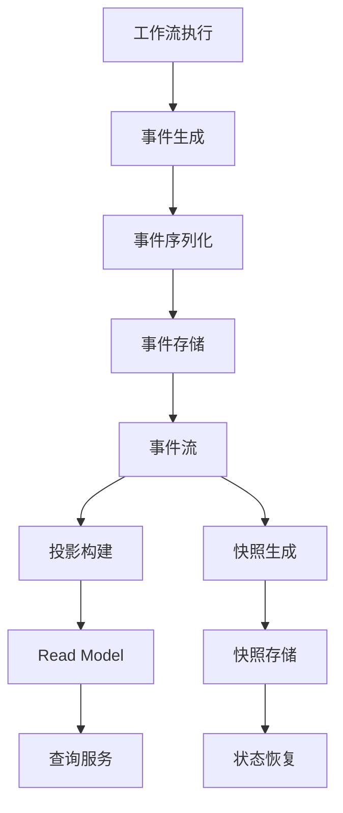
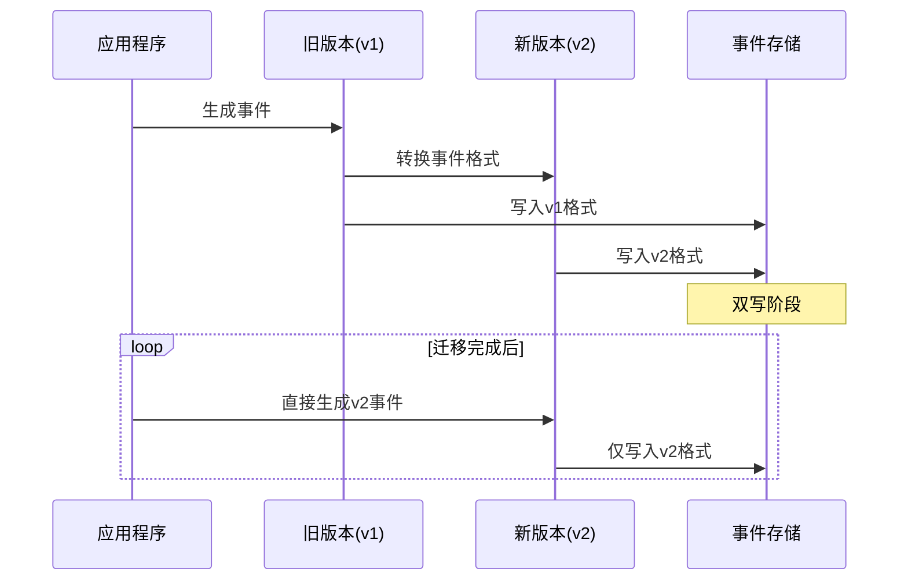
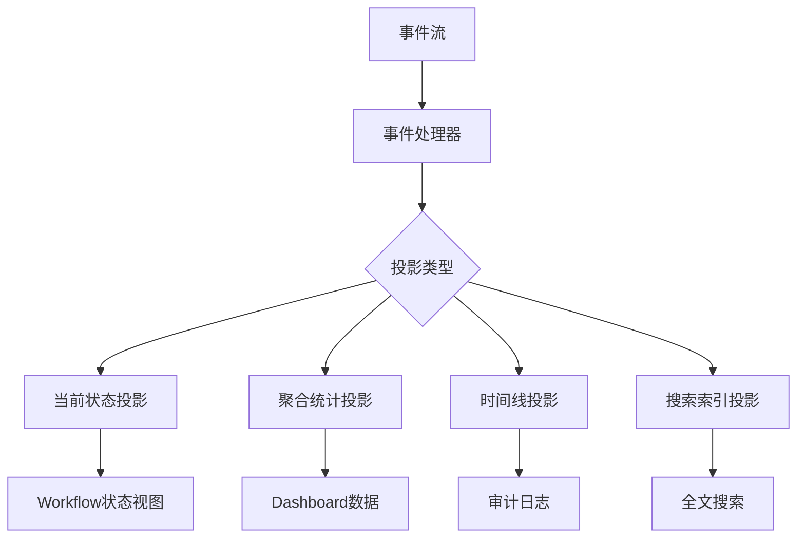
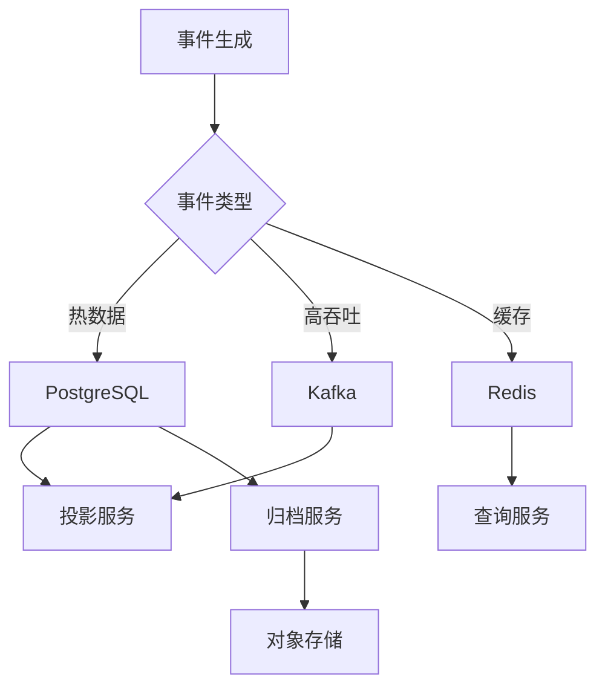

# 事件存储

## 📋 文档概述

本文档详细阐述事件溯源（Event Sourcing）存储的实现机制，包括事件存储设计原则、事件序列化、事件版本控制、快照策略、投影（Read Model）构建以及存储后端选型。

**快速导航**：

- [↑ 返回目录](../README.md)
- [关联文档](#关联文档)：[状态存储](状态存储.md) | [PostgreSQL实现](PostgreSQL实现.md) | [分布式存储](分布式存储.md) | [一致性协议实现](一致性协议实现.md)
- [理论基础](../../02-THEORY/distributed-systems/一致性模型专题文档.md) | [CAP定理](../../02-THEORY/distributed-systems/CAP定理专题文档.md)
- [PostgreSQL选型论证](../../03-TECHNOLOGY/论证/PostgreSQL选型论证.md) | [Temporal选型论证](../../03-TECHNOLOGY/论证/Temporal选型论证.md)

---

## 一、事件存储设计原则

### 1.1 事件溯源理论基础

**形式化定义**：

设 $\mathcal{H}(t) = \langle e_1, e_2, ..., e_n \rangle$ 为时刻 $t$ 的事件历史序列，则系统状态可以表示为：

$$ \text{State}(t) = \text{Replay}(\mathcal{H}(t)) = \text{Replay}(\langle e_1, e_2, ..., e_n \rangle) $$

**设计原则**：

| 原则 | 说明 | 实现要求 |
|-----|------|---------|
| **不可变性** | 事件一旦写入不可修改 | 只追加（Append-Only）存储 |
| **有序性** | 事件按发生顺序存储 | 全局单调递增序列号 |
| **完整性** | 所有状态变化都有事件记录 | 100%事件捕获 |
| **可追溯性** | 可重建任意时刻状态 | 完整事件历史保留 |
| **原子性** | 事件写入是原子操作 | 事务保证 |

### 1.2 事件存储架构



### 1.3 事件存储核心组件

| 组件 | 职责 | 关键技术 |
|-----|------|---------|
| **事件存储引擎** | 持久化事件数据 | WAL、MVCC |
| **事件总线** | 分发事件到订阅者 | 消息队列、Pub/Sub |
| **投影处理器** | 构建Read Model | 流处理、物化视图 |
| **快照管理器** | 管理状态快照 | 压缩、版本控制 |
| **事件归档** | 管理历史事件 | 分层存储、冷备 |

---

## 二、数据模型与表结构

### 2.1 核心事件表结构

```sql
-- 事件表（主表）
CREATE TABLE events (
    -- 主键与分区键
    shard_id INT NOT NULL,                    -- 分片ID，用于水平扩展
    event_id BIGINT NOT NULL,                 -- 事件序列号（分片内单调递增）

    -- 工作流标识
    namespace_id VARCHAR(255) NOT NULL,       -- 命名空间
    workflow_id VARCHAR(255) NOT NULL,        -- 工作流ID
    run_id VARCHAR(255) NOT NULL,             -- 运行实例ID

    -- 事件类型与版本
    event_type VARCHAR(100) NOT NULL,         -- 事件类型
    event_version INT NOT NULL DEFAULT 1,     -- 事件版本（用于schema演进）

    -- 事件数据
    event_data BYTEA NOT NULL,                -- 序列化的事件数据
    event_metadata JSONB,                     -- 事件元数据（时间戳、来源等）

    -- 时间戳
    created_at TIMESTAMP WITH TIME ZONE DEFAULT NOW(),

    -- 主键约束
    PRIMARY KEY (shard_id, event_id),

    -- 唯一约束：确保事件唯一性
    UNIQUE (namespace_id, workflow_id, run_id, event_id)
);

-- 按shard_id和created_at分区
CREATE TABLE events_2024_q1 PARTITION OF events
    FOR VALUES FROM (1, '2024-01-01') TO (100, '2024-04-01');
```

### 2.2 事件类型定义

| 事件类型 | 说明 | 触发时机 |
|---------|------|---------|
| **WorkflowExecutionStarted** | 工作流开始 | Workflow启动 |
| **WorkflowExecutionCompleted** | 工作流完成 | Workflow成功结束 |
| **WorkflowExecutionFailed** | 工作流失败 | Workflow执行失败 |
| **ActivityTaskScheduled** | Activity任务调度 | Activity被调度 |
| **ActivityTaskStarted** | Activity任务开始 | Activity开始执行 |
| **ActivityTaskCompleted** | Activity任务完成 | Activity执行成功 |
| **ActivityTaskFailed** | Activity任务失败 | Activity执行失败 |
| **TimerStarted** | 定时器启动 | 定时器创建 |
| **TimerFired** | 定时器触发 | 定时器到期 |
| **SignalReceived** | 信号接收 | 收到外部信号 |

### 2.3 事件元数据模型

```json
{
  "event_metadata": {
    "event_id": 12345,
    "timestamp": "2024-01-15T10:30:00Z",
    "source": "worker-01",
    "correlation_id": "corr-abc-123",
    "causation_id": "event-12344",
    "version": 1,
    "schema_version": "v2.1"
  }
}
```

---

## 三、事件序列化

### 3.1 序列化方案对比

| 方案 | 性能 | 压缩率 | 可读性 | Schema演进 | 推荐场景 |
|-----|------|--------|-------|-----------|---------|
| **Protocol Buffers** | ⭐⭐⭐⭐⭐ | ⭐⭐⭐⭐⭐ | ❌ | ✅ 强 | 生产环境首选 |
| **JSON** | ⭐⭐⭐ | ⭐⭐ | ⭐⭐⭐⭐⭐ | ✅ 中 | 调试、开发 |
| **MessagePack** | ⭐⭐⭐⭐ | ⭐⭐⭐⭐ | ❌ | ⚠️ 弱 | 高性能场景 |
| **Avro** | ⭐⭐⭐⭐ | ⭐⭐⭐⭐⭐ | ❌ | ✅ 强 | 大数据生态 |

### 3.2 Protocol Buffers实现

```protobuf
// event.proto
syntax = "proto3";
package workflow.events;

message EventEnvelope {
  string event_id = 1;
  string event_type = 2;
  int32 version = 3;
  bytes payload = 4;
  EventMetadata metadata = 5;
}

message EventMetadata {
  int64 timestamp_ms = 1;
  string source = 2;
  string correlation_id = 3;
  string causation_id = 4;
  map<string, string> headers = 5;
}

message WorkflowExecutionStarted {
  string workflow_type = 1;
  bytes input = 2;
  int64 started_time_ms = 3;
  map<string, string> search_attributes = 4;
}

message ActivityTaskCompleted {
  string activity_id = 1;
  string activity_type = 2;
  bytes result = 3;
  int64 scheduled_time_ms = 4;
  int64 started_time_ms = 5;
  int64 completed_time_ms = 6;
}
```

### 3.3 序列化性能数据

| 数据大小 | JSON | Protobuf | MessagePack | 压缩后 |
|---------|------|----------|-------------|-------|
| 1KB | 1.0x | 0.6x | 0.7x | 0.3x |
| 10KB | 1.0x | 0.5x | 0.6x | 0.2x |
| 100KB | 1.0x | 0.45x | 0.55x | 0.15x |

**序列化速度对比**：

| 方案 | 序列化速度 | 反序列化速度 |
|-----|-----------|-------------|
| JSON | 100MB/s | 80MB/s |
| Protobuf | 800MB/s | 600MB/s |
| MessagePack | 500MB/s | 400MB/s |

---

## 四、事件版本控制

### 4.1 Schema演进策略

| 变更类型 | 兼容性 | 处理策略 |
|---------|-------|---------|
| **添加字段** | 向后兼容 | 新代码处理，旧代码忽略 |
| **删除字段** | 不兼容 | 标记废弃，保留字段 |
| **修改字段类型** | 不兼容 | 创建新字段，双写迁移 |
| **重命名字段** | 不兼容 | 使用旧字段作为别名 |

### 4.2 版本控制实现

```python
class EventVersionManager:
    """事件版本管理器"""

    def __init__(self):
        self.upgraders: Dict[Tuple[str, int, int], Callable] = {}

    def register_upgrader(self, event_type: str, from_ver: int, to_ver: int,
                          upgrader: Callable):
        """注册事件升级器"""
        self.upgraders[(event_type, from_ver, to_ver)] = upgrader

    def upgrade_event(self, event: EventEnvelope, target_version: int) -> EventEnvelope:
        """升级事件到目标版本"""
        current_version = event.version

        while current_version < target_version:
            upgrader = self.upgraders.get(
                (event.event_type, current_version, current_version + 1)
            )
            if not upgrader:
                raise VersionUpgradeError(
                    f"No upgrader for {event.event_type} v{current_version} -> v{current_version + 1}"
                )
            event = upgrader(event)
            current_version += 1

        return event

# 使用示例
version_manager = EventVersionManager()

@version_manager.register_upgrader("ActivityTaskCompleted", 1, 2)
def upgrade_activity_v1_to_v2(event: EventEnvelope) -> EventEnvelope:
    """v1: 没有retry_count字段 -> v2: 添加retry_count字段"""
    old_data = deserialize(event.payload)
    new_data = ActivityTaskCompletedV2(
        activity_id=old_data.activity_id,
        activity_type=old_data.activity_type,
        result=old_data.result,
        retry_count=0  # 默认值
    )
    event.payload = serialize(new_data)
    event.version = 2
    return event
```

### 4.3 双写迁移策略



---

## 五、快照策略

### 5.1 快照触发策略

| 策略 | 说明 | 适用场景 |
|-----|------|---------|
| **事件计数** | 每N个事件触发 | 均匀负载场景 |
| **时间间隔** | 每T时间触发 | 低频长周期场景 |
| **状态大小** | 状态超过阈值触发 | 大状态场景 |
| **混合策略** | 组合多种条件 | 通用场景 |

### 5.2 快照算法

```python
class SnapshotManager:
    """快照管理器"""

    SNAPSHOT_INTERVAL = 100  # 每100个事件触发
    MAX_SNAPSHOT_AGE = 3600  # 最大快照年龄（秒）

    def __init__(self, event_store: EventStore, state_store: StateStore):
        self.event_store = event_store
        self.state_store = state_store

    async def should_create_snapshot(self, workflow_id: str,
                                      event_count: int) -> bool:
        """判断是否需要创建快照"""
        last_snapshot = await self.state_store.get_last_snapshot(workflow_id)

        if not last_snapshot:
            return event_count >= self.SNAPSHOT_INTERVAL

        events_since_snapshot = event_count - last_snapshot.event_id
        snapshot_age = time.time() - last_snapshot.created_at

        return (events_since_snapshot >= self.SNAPSHOT_INTERVAL or
                snapshot_age >= self.MAX_SNAPSHOT_AGE)

    async def create_snapshot(self, workflow_id: str,
                               current_state: WorkflowState) -> Snapshot:
        """创建快照"""
        snapshot = Snapshot(
            workflow_id=workflow_id,
            event_id=current_state.last_event_id,
            state_data=serialize(current_state),
            created_at=time.time(),
            checksum=calculate_checksum(current_state)
        )

        await self.state_store.save_snapshot(snapshot)
        return snapshot

    async def restore_from_snapshot(self, workflow_id: str) -> WorkflowState:
        """从快照恢复状态"""
        snapshot = await self.state_store.get_latest_snapshot(workflow_id)

        if not snapshot:
            return WorkflowState.empty(workflow_id)

        # 验证校验和
        if not verify_checksum(snapshot.state_data, snapshot.checksum):
            raise SnapshotCorruptionError("Snapshot checksum mismatch")

        state = deserialize(snapshot.state_data)

        # 重放快照后的事件
        events = await self.event_store.get_events_after(
            workflow_id, snapshot.event_id
        )

        for event in events:
            state = apply_event(state, event)

        return state
```

### 5.3 快照存储结构

```sql
-- 快照表
CREATE TABLE workflow_snapshots (
    workflow_id VARCHAR(255) NOT NULL,
    run_id VARCHAR(255) NOT NULL,
    event_id BIGINT NOT NULL,                 -- 快照对应的事件位置
    state_data BYTEA NOT NULL,                -- 序列化的状态数据
    state_checksum VARCHAR(64) NOT NULL,      -- 状态校验和
    created_at TIMESTAMP WITH TIME ZONE DEFAULT NOW(),

    PRIMARY KEY (workflow_id, run_id, event_id)
);

-- 索引
CREATE INDEX idx_snapshots_workflow ON workflow_snapshots(workflow_id, created_at DESC);
```

### 5.4 快照性能对比

| 场景 | 无快照 | 有快照 | 性能提升 |
|-----|-------|-------|---------|
| 重放1000个事件 | 500ms | 50ms | 10x |
| 重放10000个事件 | 5000ms | 80ms | 62.5x |
| 重放100000个事件 | 50000ms | 150ms | 333x |

---

## 六、投影（Read Model）构建

### 6.1 投影架构



### 6.2 投影处理器实现

```python
class ProjectionProcessor:
    """投影处理器"""

    def __init__(self, event_store: EventStore):
        self.event_store = event_store
        self.projectors: Dict[str, Projector] = {}
        self.position_store: PositionStore = PositionStore()

    def register_projector(self, name: str, projector: Projector):
        """注册投影器"""
        self.projectors[name] = projector

    async def process_events(self, projector_name: str):
        """处理事件流"""
        projector = self.projectors[projector_name]
        last_position = await self.position_store.get_position(projector_name)

        async for event in self.event_store.read_events_after(last_position):
            try:
                await projector.handle(event)
                await self.position_store.save_position(
                    projector_name, event.position
                )
            except Exception as e:
                logger.error(f"Projection failed: {e}")
                # 根据策略决定是否继续或暂停
                raise

# 具体投影器实现
class WorkflowStatusProjector(Projector):
    """工作流状态投影器"""

    async def handle(self, event: EventEnvelope):
        if event.event_type == "WorkflowExecutionStarted":
            await self.db.execute(
                """INSERT INTO workflow_status
                    (workflow_id, status, started_at)
                    VALUES ($1, 'Running', $2)""",
                event.workflow_id, event.timestamp
            )
        elif event.event_type == "WorkflowExecutionCompleted":
            await self.db.execute(
                """UPDATE workflow_status
                    SET status = 'Completed', completed_at = $1
                    WHERE workflow_id = $2""",
                event.timestamp, event.workflow_id
            )
        elif event.event_type == "WorkflowExecutionFailed":
            await self.db.execute(
                """UPDATE workflow_status
                    SET status = 'Failed', error_message = $1
                    WHERE workflow_id = $2""",
                event.error_message, event.workflow_id
            )
```

### 6.3 投影表结构

```sql
-- 工作流状态投影
CREATE TABLE workflow_status_projection (
    workflow_id VARCHAR(255) PRIMARY KEY,
    namespace_id VARCHAR(255) NOT NULL,
    workflow_type VARCHAR(255) NOT NULL,
    status VARCHAR(50) NOT NULL,              -- Running, Completed, Failed
    started_at TIMESTAMP WITH TIME ZONE,
    completed_at TIMESTAMP WITH TIME ZONE,
    last_event_id BIGINT NOT NULL,
    updated_at TIMESTAMP WITH TIME ZONE DEFAULT NOW()
);

-- 工作流统计投影
CREATE TABLE workflow_statistics_projection (
    namespace_id VARCHAR(255) NOT NULL,
    workflow_type VARCHAR(255) NOT NULL,
    date DATE NOT NULL,
    total_count BIGINT DEFAULT 0,
    completed_count BIGINT DEFAULT 0,
    failed_count BIGINT DEFAULT 0,
    avg_duration_ms BIGINT,
    PRIMARY KEY (namespace_id, workflow_type, date)
);

-- 投影位置跟踪
CREATE TABLE projection_positions (
    projector_name VARCHAR(255) PRIMARY KEY,
    shard_id INT NOT NULL,
    event_id BIGINT NOT NULL,
    updated_at TIMESTAMP WITH TIME ZONE DEFAULT NOW()
);
```

### 6.4 投影延迟优化

| 策略 | 延迟 | 一致性 | 适用场景 |
|-----|------|-------|---------|
| **同步投影** | <10ms | 强一致性 | 关键状态查询 |
| **异步投影（近实时）** | 100-500ms | 最终一致性 | 一般查询 |
| **批量投影** | 1-5s | 最终一致性 | 报表统计 |
| **定时投影** | 1-60min | 最终一致性 | 离线分析 |

---

## 七、存储后端选型

### 7.1 选型对比矩阵

| 特性 | PostgreSQL | Cassandra | Kafka | Redis |
|-----|-----------|-----------|-------|-------|
| **写入性能** | ⭐⭐⭐⭐ | ⭐⭐⭐⭐⭐ | ⭐⭐⭐⭐⭐ | ⭐⭐⭐⭐⭐ |
| **查询能力** | ⭐⭐⭐⭐⭐ | ⭐⭐ | ⭐⭐ | ⭐⭐⭐ |
| **事务支持** | ⭐⭐⭐⭐⭐ | ⭐⭐ | ⭐⭐ | ⭐⭐ |
| **水平扩展** | ⭐⭐⭐ | ⭐⭐⭐⭐⭐ | ⭐⭐⭐⭐⭐ | ⭐⭐⭐ |
| **运维复杂度** | ⭐⭐ | ⭐⭐⭐⭐ | ⭐⭐⭐ | ⭐⭐ |
| **成本效益** | ⭐⭐⭐⭐⭐ | ⭐⭐⭐ | ⭐⭐⭐ | ⭐⭐⭐⭐ |

### 7.2 PostgreSQL作为事件存储

**优势**：

- ✅ 完整ACID事务支持
- ✅ 强大的查询能力
- ✅ 成熟的分区机制
- ✅ 丰富的索引类型

**适用场景**：

- 事件速率 < 10M events/s
- 需要复杂查询和投影
- 强一致性要求

**性能基准**：

| 指标 | 数值 |
|-----|------|
| 写入吞吐 | 10M events/s |
| 单事件写入延迟 | 0.8ms |
| 范围查询延迟 | 8.9ms |
| 快照读取延迟 | 5ms |

### 7.3 Cassandra作为事件存储

**优势**：

- ✅ 超高写入吞吐
- ✅ 线性水平扩展
- ✅ 多数据中心复制

**适用场景**：

- 事件速率 > 100M events/s
- 全球分布部署
- 最终一致性可接受

**性能基准**：

| 指标 | 数值 |
|-----|------|
| 写入吞吐 | 1.85M events/s |
| 单事件写入延迟 | 2.5ms |
| 范围查询延迟 | 1200ms |
| 快照读取延迟 | 50ms |

### 7.4 混合架构方案



---

## 八、关键算法与流程

### 8.1 事件写入流程

```python
async def append_event(event: EventEnvelope) -> EventEnvelope:
    """追加事件到存储"""
    # 1. 分配事件ID（分片内单调递增）
    event.event_id = await sequence_generator.next(event.shard_id)

    # 2. 序列化事件数据
    serialized = serialize_event(event)

    # 3. 计算校验和
    event.checksum = calculate_checksum(serialized)

    # 4. 事务写入
    async with transaction() as tx:
        # 写入事件表
        await tx.execute(
            "INSERT INTO events (...) VALUES (...)",
            event
        )

        # 更新工作流状态
        await tx.execute(
            "UPDATE workflow_executions SET last_event_id = $1 ...",
            event.event_id
        )

    # 5. 发布事件到总线
    await event_bus.publish(event)

    return event
```

### 8.2 状态重建算法

```python
async def rebuild_state(workflow_id: str) -> WorkflowState:
    """从事件历史重建工作流状态"""

    # 1. 尝试从快照恢复
    snapshot = await snapshot_store.get_latest(workflow_id)

    if snapshot:
        state = deserialize(snapshot.state_data)
        start_event_id = snapshot.event_id + 1
    else:
        state = WorkflowState.empty(workflow_id)
        start_event_id = 0

    # 2. 重放后续事件
    async for event in event_store.read_events(
        workflow_id,
        start_event_id=start_event_id
    ):
        state = apply_event(state, event)
        state.last_event_id = event.event_id

    return state
```

---

## 九、最佳实践建议

### 9.1 设计建议

| 建议 | 说明 | 优先级 |
|-----|------|-------|
| **事件粒度适中** | 事件既不要太细也不要太粗 | ⭐⭐⭐⭐⭐ |
| **包含完整上下文** | 事件应包含重建状态所需信息 | ⭐⭐⭐⭐⭐ |
| **使用版本控制** | 所有事件类型都要有版本号 | ⭐⭐⭐⭐ |
| **保持不可变性** | 永远不要修改已存储的事件 | ⭐⭐⭐⭐⭐ |
| **定期快照** | 防止事件历史无限增长 | ⭐⭐⭐⭐ |

### 9.2 性能优化

| 优化项 | 效果 | 实施难度 |
|-------|------|---------|
| **批量写入** | 5-10x吞吐提升 | 低 |
| **分区表** | 10-50x查询提升 | 中 |
| **异步投影** | 降低写入延迟 | 低 |
| **快照压缩** | 50-70%存储节省 | 中 |
| **事件归档** | 降低热存储成本 | 中 |

### 9.3 监控指标

| 指标 | 告警阈值 | 说明 |
|-----|---------|------|
| **事件写入延迟** | P99 > 10ms | 写入性能监控 |
| **投影延迟** | > 5s | 数据新鲜度监控 |
| **快照创建时间** | > 1s | 快照性能监控 |
| **存储增长速率** | > 10GB/天 | 容量规划 |

---

## 十、关联文档

| 文档 | 关系 | 说明 |
|-----|------|------|
| [状态存储](状态存储.md) | 互补 | 状态持久化机制 |
| [PostgreSQL实现](PostgreSQL实现.md) | 实现参考 | PostgreSQL作为存储后端 |
| [分布式存储](分布式存储.md) | 扩展阅读 | 分布式状态存储方案 |
| [一致性协议实现](一致性协议实现.md) | 理论基础 | 共识协议工程实践 |
| [PostgreSQL选型论证](../../03-TECHNOLOGY/论证/PostgreSQL选型论证.md) | 选型依据 | 存储选型论证 |
| [Temporal选型论证](../../03-TECHNOLOGY/论证/Temporal选型论证.md) | 应用场景 | 工作流框架选型 |

---

## 附录：术语表

| 术语 | 说明 |
|-----|------|
| **Event Sourcing** | 事件溯源，以事件为核心存储状态变更 |
| **Projection** | 投影，从事件流构建的物化视图 |
| **Snapshot** | 快照，状态的某个时间点的完整副本 |
| **CQRS** | 命令查询职责分离，读写模型分离 |
| **Replay** | 重放，重新执行事件序列以重建状态 |
