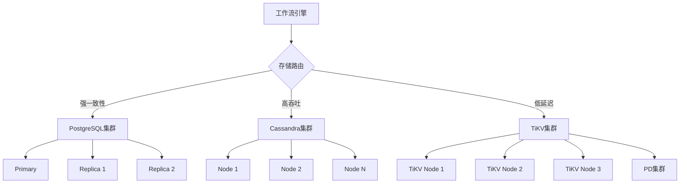
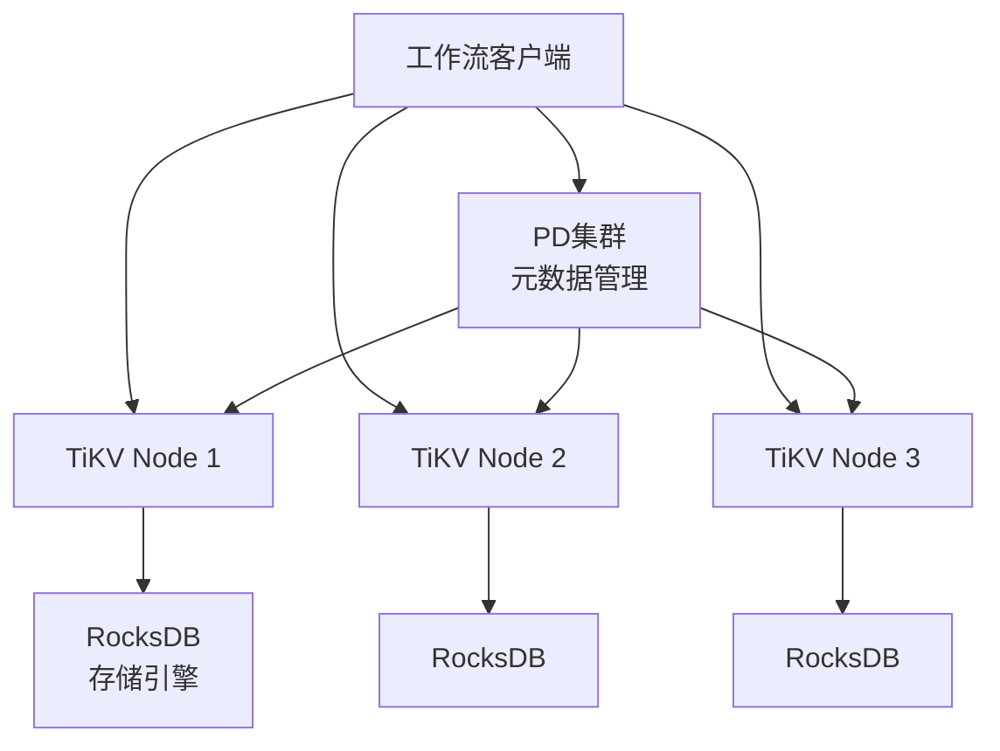

# 分布式存储

## 📋 文档概述

本文档详细阐述分布式状态存储的实现方案，包括Cassandra适配、TiKV/RocksDB使用、分布式事务挑战、最终一致性实现以及冲突解决策略。

**快速导航**：

- [↑ 返回目录](../README.md)
- [关联文档](#关联文档)：[事件存储](事件存储.md) | [状态存储](状态存储.md) | [PostgreSQL实现](PostgreSQL实现.md) | [一致性协议实现](一致性协议实现.md)
- [理论基础](../../02-THEORY/distributed-systems/CAP定理专题文档.md) | [一致性模型](../../02-THEORY/distributed-systems/一致性模型专题文档.md)
- [技术栈组合论证](../../03-TECHNOLOGY/论证/技术栈组合论证.md)

---

## 一、分布式存储架构

### 1.1 架构概览



### 1.2 分布式存储选型矩阵

| 特性 | PostgreSQL | Cassandra | TiKV | FoundationDB |
|-----|-----------|-----------|------|-------------|
| **一致性模型** | 强一致(CP) | 最终一致(AP) | 强一致(CP) | 强一致(CP) |
| **写入吞吐** | 10M/s | 100M/s | 50M/s | 5M/s |
| **读取延迟** | 1ms | 2-5ms | 0.5ms | 3ms |
| **水平扩展** | 中等 | 优秀 | 优秀 | 优秀 |
| **跨数据中心** | 异步复制 | 多主复制 | Raft多副本 | 事务性复制 |
| **SQL支持** | 完整 | CQL | 部分 | 无 |
| **运维复杂度** | 低 | 高 | 中 | 高 |

---

## 二、Cassandra适配

### 2.1 Cassandra数据模型

```cql
-- 键空间创建
CREATE KEYSPACE IF NOT EXISTS temporal
WITH replication = {
    'class': 'NetworkTopologyStrategy',
    'datacenter1': 3,
    'datacenter2': 3
};

-- 工作流执行表
CREATE TABLE IF NOT EXISTS temporal.workflow_executions (
    shard_id int,
    workflow_id text,
    run_id text,
    namespace_id text,
    workflow_type text,
    status text,
    state_data blob,
    last_event_id bigint,
    start_time timestamp,
    close_time timestamp,
    version bigint,
    search_attributes map<text, text>,

    PRIMARY KEY ((shard_id, workflow_id), run_id)
) WITH CLUSTERING ORDER BY (run_id DESC)
    AND compaction = {'class': 'LeveledCompactionStrategy'}
    AND compression = {'class': 'LZ4Compressor'};

-- 历史事件表（时序数据优化）
CREATE TABLE IF NOT EXISTS temporal.history_events (
    shard_id int,
    workflow_id text,
    run_id text,
    event_id bigint,
    event_type text,
    event_version int,
    event_data blob,
    created_at timestamp,

    PRIMARY KEY ((shard_id, workflow_id, run_id), event_id)
) WITH CLUSTERING ORDER BY (event_id ASC)
    AND compaction = {'class': 'TimeWindowCompactionStrategy',
                      'compaction_window_unit': 'DAYS',
                      'compaction_window_size': 7};

-- 任务队列表
CREATE TABLE IF NOT EXISTS temporal.tasks (
    namespace_id text,
    task_queue text,
    task_type text,
    scheduled_time timestamp,
    shard_id int,
    task_id bigint,
    workflow_id text,
    run_id text,
    schedule_id bigint,
    status text,
    priority int,
    task_data blob,

    PRIMARY KEY ((namespace_id, task_queue, task_type), scheduled_time, shard_id, task_id)
) WITH CLUSTERING ORDER BY (scheduled_time ASC, shard_id ASC, task_id ASC);

-- 物化视图：按状态查询
CREATE MATERIALIZED VIEW IF NOT EXISTS temporal.workflow_by_status AS
    SELECT shard_id, workflow_id, run_id, namespace_id, workflow_type, status, start_time
    FROM temporal.workflow_executions
    WHERE shard_id IS NOT NULL
      AND workflow_id IS NOT NULL
      AND run_id IS NOT NULL
      AND status IS NOT NULL
    PRIMARY KEY ((namespace_id, status), start_time, workflow_id, run_id)
    WITH CLUSTERING ORDER BY (start_time DESC);
```

### 2.2 Cassandra一致性级别配置

| 操作类型 | 读一致性 | 写一致性 | 说明 |
|---------|---------|---------|------|
| **工作流创建** | ONE | QUORUM | 快速写入，后续读取保证 |
| **状态更新** | QUORUM | QUORUM | 强一致性读写 |
| **历史事件写入** | ONE | ONE | 高吞吐，最终一致 |
| **任务查询** | LOCAL_QUORUM | QUORUM | 本地数据中心优先 |
| **跨DC查询** | EACH_QUORUM | EACH_QUORUM | 强一致性跨数据中心 |

```python
from cassandra import ConsistencyLevel
from cassandra.query import SimpleStatement

class CassandraConfig:
    """Cassandra一致性配置"""

    CONSISTENCY_LEVELS = {
        'workflow_create': {
            'read': ConsistencyLevel.ONE,
            'write': ConsistencyLevel.QUORUM
        },
        'state_update': {
            'read': ConsistencyLevel.QUORUM,
            'write': ConsistencyLevel.QUORUM
        },
        'history_append': {
            'read': ConsistencyLevel.ONE,
            'write': ConsistencyLevel.ONE
        },
        'task_poll': {
            'read': ConsistencyLevel.LOCAL_QUORUM,
            'write': ConsistencyLevel.QUORUM
        }
    }
```

### 2.3 Cassandra性能调优

```python
from cassandra.cluster import Cluster
from cassandra.policies import DCAwareRoundRobinPolicy, TokenAwarePolicy

class CassandraConnectionPool:
    """Cassandra连接池管理"""

    def __init__(self, contact_points: List[str], keyspace: str):
        self.cluster = Cluster(
            contact_points=contact_points,
            load_balancing_policy=TokenAwarePolicy(DCAwareRoundRobinPolicy()),
            protocol_version=5,

            # 连接池配置
            pooling_options={
                'core_connections_per_host': {
                    'LOCAL': 8,
                    'REMOTE': 2
                },
                'max_connections_per_host': {
                    'LOCAL': 20,
                    'REMOTE': 5
                },
                'max_requests_per_connection': 10000
            },

            # 重试策略
            reconnection_policy=ExponentialReconnectionPolicy(
                base_delay=1.0,
                max_delay=60.0
            ),

            # 查询超时
            default_timeout=5.0
        )

        self.session = self.cluster.connect(keyspace)

        # 准备语句缓存
        self.prepared_statements = {}

    def prepare(self, query: str):
        """准备并缓存查询语句"""
        if query not in self.prepared_statements:
            self.prepared_statements[query] = self.session.prepare(query)
        return self.prepared_statements[query]
```

### 2.4 Cassandra与PostgreSQL性能对比

| 指标 | PostgreSQL | Cassandra | 差异 |
|-----|-----------|-----------|------|
| 单节点写入 | 100K/s | 80K/s | PG略胜 |
| 3节点集群写入 | 200K/s | 500K/s | Cass 2.5x |
| 30节点集群写入 | 1M/s | 50M/s | Cass 50x |
| 单节点读取延迟 | 1ms | 2ms | PG 2x |
| 跨数据中心复制 | 异步 | 同步/异步 | Cass灵活 |
| 运维节点数 | 3 | 30 | Cass 10x |

---

## 三、TiKV/RocksDB使用

### 3.1 TiKV架构



### 3.2 TiKV数据模型设计

```rust
// TiKV键设计（使用Rust伪代码）
// 键格式: {prefix}{shard_id}{separator}{workflow_id}{separator}{field}

// 工作流执行键
const WORKFLOW_EXECUTION_PREFIX: &[u8] = b"wfexec:";

fn make_workflow_key(shard_id: u32, workflow_id: &str, field: &str) -> Vec<u8> {
    format!("{}#{:04}#{}#{}",
        String::from_utf8_lossy(WORKFLOW_EXECUTION_PREFIX),
        shard_id,
        workflow_id,
        field
    ).into_bytes()
}

// 历史事件键
const HISTORY_EVENT_PREFIX: &[u8] = b"histeve:";

fn make_event_key(shard_id: u32, workflow_id: &str, run_id: &str, event_id: u64) -> Vec<u8> {
    format!("{}#{:04}#{}#{}#{:016}",
        String::from_utf8_lossy(HISTORY_EVENT_PREFIX),
        shard_id,
        workflow_id,
        run_id,
        event_id
    ).into_bytes()
}

// 任务键
const TASK_PREFIX: &[u8] = b"task:";

fn make_task_key(namespace: &str, queue: &str, scheduled_time: u64, task_id: u64) -> Vec<u8> {
    format!("{}#{}#{}#{:016}#{:016}",
        String::from_utf8_lossy(TASK_PREFIX),
        namespace,
        queue,
        scheduled_time,
        task_id
    ).into_bytes()
}
```

### 3.3 TiKV事务使用

```python
from tikv_client import TransactionClient

class TiKVStateStore:
    """TiKV状态存储实现"""

    def __init__(self, pd_endpoints: List[str]):
        self.client = TransactionClient.connect(pd_endpoints)

    async def write_workflow_state(
        self,
        shard_id: int,
        workflow_id: str,
        state: WorkflowState
    ) -> bool:
        """写入工作流状态（使用乐观事务）"""

        txn = await self.client.begin(optimistic=True)

        try:
            # 构建键值对
            base_key = f"wfexec:{shard_id:04}:{workflow_id}"

            # 写入状态字段
            txn.put(
                f"{base_key}:status".encode(),
                state.status.encode()
            )
            txn.put(
                f"{base_key}:state_data".encode(),
                serialize(state)
            )
            txn.put(
                f"{base_key}:version".encode(),
                str(state.version).encode()
            )
            txn.put(
                f"{base_key}:last_event_id".encode(),
                str(state.last_event_id).encode()
            )

            # 提交事务
            await txn.commit()
            return True

        except Exception as e:
            await txn.rollback()
            raise StateWriteError(f"Failed to write state: {e}")

    async def read_workflow_state(
        self,
        shard_id: int,
        workflow_id: str
    ) -> Optional[WorkflowState]:
        """读取工作流状态"""

        txn = await self.client.begin(optimistic=True)

        try:
            base_key = f"wfexec:{shard_id:04}:{workflow_id}"

            # 批量读取
            keys = [
                f"{base_key}:status".encode(),
                f"{base_key}:state_data".encode(),
                f"{base_key}:version".encode(),
                f"{base_key}:last_event_id".encode()
            ]

            values = await txn.batch_get(keys)

            if not values.get(keys[0]):  # status为空表示不存在
                return None

            return WorkflowState(
                workflow_id=workflow_id,
                status=values[keys[0]].decode(),
                state_data=deserialize(values[keys[1]]),
                version=int(values[keys[2]]),
                last_event_id=int(values[keys[3]])
            )

        finally:
            await txn.rollback()
```

### 3.4 RocksDB调优配置

```ini
# RocksDB配置文件 rocksdb.ini

[DBOptions]
# 内存配置
write_buffer_size=67108864          # 64MB
max_write_buffer_number=6
max_bytes_for_level_base=536870912  # 512MB

# 压缩配置
compression_per_level=kLZ4Compression
bottommost_compression=kZSTD

# 并发配置
max_background_jobs=8
max_subcompactions=4

# 缓存配置
[CFOptions "default"]
write_buffer_size=67108864
compression=kLZ4Compression
prefix_extractor=capped:16          # 前缀提取器优化范围查询

[TableOptions/BlockBasedTable]
block_size=16384                    # 16KB
block_cache_size=5368709120         # 5GB
index_type=kHashSearch              # 哈希索引加速点查
```

---

## 四、分布式事务挑战

### 4.1 CAP定理在分布式存储中的应用

```
┌─────────────────────────────────────────────────────────┐
│                       CAP选择                            │
├─────────────────┬─────────────────┬─────────────────────┤
│   PostgreSQL    │   Cassandra     │      TiKV           │
│     (CP)        │     (AP)        │      (CP)           │
├─────────────────┼─────────────────┼─────────────────────┤
│ ✅ 强一致性      │ ⚠️ 最终一致性    │ ✅ 强一致性          │
│ ✅ 分区容错      │ ✅ 分区容错      │ ✅ 分区容错          │
│ ⚠️ 可用性受限    │ ✅ 高可用性      │ ⚠️ 可用性受限        │
├─────────────────┼─────────────────┼─────────────────────┤
│ 金融支付场景     │ 日志收集场景     │ 高性能OLTP场景       │
│ 订单处理场景     │ 实时监控场景     │ 高并发工作流场景     │
└─────────────────┴─────────────────┴─────────────────────┘
```

### 4.2 分布式事务方案对比

| 方案 | 一致性 | 性能 | 复杂度 | 适用场景 |
|-----|-------|------|-------|---------|
| **2PC** | 强一致 | 低 | 高 | 传统分布式事务 |
| **Saga** | 最终一致 | 高 | 中 | 长事务补偿 |
| **TCC** | 最终一致 | 高 | 高 | 资源预留场景 |
| **本地消息表** | 最终一致 | 中 | 中 | 异步通知 |
| **Seata AT** | 强一致 | 中 | 中 | 微服务事务 |

### 4.3 Saga模式实现

```python
class SagaOrchestrator:
    """Saga编排器"""

    def __init__(self, state_store: StateStore):
        self.state_store = state_store
        self.compensation_log = []

    async def execute_saga(
        self,
        saga_id: str,
        steps: List[SagaStep]
    ) -> SagaResult:
        """执行Saga事务"""

        completed_steps = []

        try:
            for step in steps:
                # 执行步骤
                result = await step.execute()

                if not result.success:
                    raise SagaExecutionError(f"Step {step.name} failed")

                completed_steps.append(step)

                # 记录补偿操作
                self.compensation_log.append({
                    'step': step.name,
                    'compensation': step.compensation,
                    'context': result.context
                })

            return SagaResult(success=True, saga_id=saga_id)

        except SagaExecutionError as e:
            # 执行补偿
            await self._compensate(completed_steps)
            return SagaResult(success=False, error=str(e))

    async def _compensate(self, completed_steps: List[SagaStep]):
        """执行补偿操作"""
        for step in reversed(completed_steps):
            try:
                await step.compensate()
            except Exception as e:
                # 补偿失败，需要人工介入
                logger.error(f"Compensation failed for {step.name}: {e}")
                await self._alert_manual_intervention(step, e)

# 使用示例
saga = SagaOrchestrator(state_store)

steps = [
    SagaStep(
        name="deduct_inventory",
        execute=lambda: inventory_service.deduct(order.items),
        compensate=lambda: inventory_service.restore(order.items)
    ),
    SagaStep(
        name="process_payment",
        execute=lambda: payment_service.charge(order.amount),
        compensate=lambda: payment_service.refund(order.amount)
    ),
    SagaStep(
        name="create_shipment",
        execute=lambda: shipping_service.create(order),
        compensate=lambda: shipping_service.cancel(order)
    )
]

result = await saga.execute_saga(saga_id="order-123", steps=steps)
```

---

## 五、最终一致性实现

### 5.1 一致性模型


### 5.2 最终一致性实现策略

| 策略 | 机制 | 延迟 | 适用场景 |
|-----|------|------|---------|
| **读修复** | 读取时检测并修复不一致 | 读延迟增加 | 低频读取 |
| **反熵修复** | 后台进程比对修复 | 分钟级 | 通用场景 |
| **提示移交** | 临时存储转发 | 秒级 | 节点故障 |
| **仲裁读取** | 读取多个副本 | 读延迟增加 | 强一致需求 |

### 5.3 读修复实现

```python
class ReadRepairManager:
    """读修复管理器"""

    def __init__(self, cassandra_cluster: Cluster):
        self.cluster = cassandra_cluster
        self.repair_threshold = 3  # 检测到3次不一致后触发修复

    async def read_with_repair(
        self,
        table: str,
        key: dict,
        consistency: ConsistencyLevel
    ) -> Row:
        """带读修复的查询"""

        # 使用QUORUM读取
        session = self.cluster.connect()
        query = f"SELECT * FROM {table} WHERE ..."

        # 执行读取
        result = await session.execute_async(
            query,
            key,
            consistency_level=consistency
        )

        row = result.one()

        # 后台检查其他副本（异步）
        asyncio.create_task(self._check_replicas(table, key, row))

        return row

    async def _check_replicas(self, table: str, key: dict, expected: Row):
        """检查副本一致性"""
        # 使用ONE读取所有副本
        all_versions = []

        for replica in self.get_replicas(table, key):
            version = await self.read_from_replica(replica, table, key)
            all_versions.append(version)

        # 检测不一致
        inconsistent = [
            v for v in all_versions
            if not self._compare_versions(v, expected)
        ]

        if inconsistent:
            # 触发修复
            await self._repair_replicas(table, key, expected, inconsistent)
```

### 5.4 向量时钟

```python
from collections import defaultdict

class VectorClock:
    """向量时钟实现"""

    def __init__(self):
        self.clock = defaultdict(int)

    def increment(self, node_id: str):
        """递增本地时钟"""
        self.clock[node_id] += 1

    def update(self, other: 'VectorClock'):
        """合并另一个向量时钟"""
        for node, timestamp in other.clock.items():
            self.clock[node] = max(self.clock[node], timestamp)

    def compare(self, other: 'VectorClock') -> int:
        """
        比较两个向量时钟
        返回: -1 (self < other), 0 (并发), 1 (self > other)
        """
        dominates = False
        dominated = False

        all_nodes = set(self.clock.keys()) | set(other.clock.keys())

        for node in all_nodes:
            self_ts = self.clock.get(node, 0)
            other_ts = other.clock.get(node, 0)

            if self_ts > other_ts:
                dominates = True
            elif self_ts < other_ts:
                dominated = True

        if dominates and not dominated:
            return 1
        elif dominated and not dominates:
            return -1
        elif not dominates and not dominated:
            return 0  # 相等
        else:
            return 0  # 并发冲突

    def is_concurrent(self, other: 'VectorClock') -> bool:
        """检查是否并发"""
        return self.compare(other) == 0 and self.clock != other.clock

# 使用示例
vc1 = VectorClock()
vc1.increment("node1")

vc2 = VectorClock()
vc2.increment("node2")

# 检测并发
if vc1.is_concurrent(vc2):
    print("并发冲突 detected!")
```

---

## 六、冲突解决策略

### 6.1 冲突类型

| 冲突类型 | 描述 | 示例 |
|---------|------|------|
| **写写冲突** | 同时修改同一数据 | 两个节点同时更新工作流状态 |
| **读写冲突** | 读取过时数据 | 读取到未同步的副本 |
| **语义冲突** | 业务逻辑冲突 | 重复扣减库存 |
| **删除冲突** | 读取已删除数据 | 幽灵记录 |

### 6.2 冲突解决策略

```python
class ConflictResolver:
    """冲突解决器"""

    STRATEGIES = {
        'last_write_wins': self._lww_resolve,
        'timestamp_order': self._timestamp_resolve,
        'vector_clock': self._vc_resolve,
        'custom_merge': self._custom_merge
    }

    def __init__(self, strategy: str = 'last_write_wins'):
        self.strategy = self.STRATEGIES.get(strategy)

    def resolve(self, versions: List[Version]) -> Version:
        """解决冲突"""
        return self.strategy(versions)

    def _lww_resolve(self, versions: List[Version]) -> Version:
        """最后写入胜出"""
        return max(versions, key=lambda v: v.timestamp)

    def _timestamp_resolve(self, versions: List[Version]) -> Version:
        """基于逻辑时间戳排序"""
        return max(versions, key=lambda v: v.logical_timestamp)

    def _vc_resolve(self, versions: List[Version]) -> Version:
        """基于向量时钟解决"""
        # 找出所有并发的版本
        concurrent = []
        for v1 in versions:
            is_concurrent = True
            for v2 in versions:
                if v1 != v2 and v1.vector_clock.compare(v2.vector_clock) != 0:
                    is_concurrent = False
                    break
            if is_concurrent:
                concurrent.append(v1)

        if len(concurrent) == 1:
            return concurrent[0]

        # 多个并发版本，使用应用层合并
        return self._merge_concurrent(concurrent)

    def _custom_merge(self, versions: List[Version]) -> Version:
        """自定义合并逻辑"""
        # 根据数据类型选择合并策略
        merged = versions[0].copy()

        for v in versions[1:]:
            merged.data = self._merge_fields(merged.data, v.data)

        return merged
```

### 6.3 CRDT实现

```python
class GCounter:
    """G-Counter CRDT（单调递增计数器）"""

    def __init__(self, node_id: str):
        self.node_id = node_id
        self.counters = defaultdict(int)

    def increment(self, delta: int = 1):
        """递增计数器"""
        self.counters[self.node_id] += delta

    def merge(self, other: 'GCounter'):
        """合并另一个G-Counter"""
        for node, value in other.counters.items():
            self.counters[node] = max(self.counters[node], value)

    def value(self) -> int:
        """获取当前值"""
        return sum(self.counters.values())

class PNCounter:
    """PN-Counter CRDT（可增减计数器）"""

    def __init__(self, node_id: str):
        self.node_id = node_id
        self.positive = GCounter(node_id)
        self.negative = GCounter(node_id)

    def increment(self, delta: int = 1):
        self.positive.increment(delta)

    def decrement(self, delta: int = 1):
        self.negative.increment(delta)

    def merge(self, other: 'PNCounter'):
        self.positive.merge(other.positive)
        self.negative.merge(other.negative)

    def value(self) -> int:
        return self.positive.value() - self.negative.value()

class LWWRegister:
    """LWW-Register CRDT（最后写入寄存器）"""

    def __init__(self, node_id: str):
        self.node_id = node_id
        self.timestamp = 0
        self.value = None

    def set(self, value: Any):
        """设置值"""
        self.timestamp += 1
        self.value = value

    def merge(self, other: 'LWWRegister'):
        """合并另一个寄存器"""
        if other.timestamp > self.timestamp:
            self.timestamp = other.timestamp
            self.value = other.value
```

---

## 七、性能对比数据

### 7.1 存储方案性能对比

| 指标 | PostgreSQL | Cassandra | TiKV | Redis Cluster |
|-----|-----------|-----------|------|--------------|
| 单节点写入(K/s) | 100 | 80 | 150 | 200 |
| 集群写入(M/s) | 1 | 50 | 30 | 10 |
| P99写入延迟(ms) | 2 | 5 | 1 | 0.1 |
| P99读取延迟(ms) | 1 | 3 | 0.5 | 0.1 |
| 跨数据中心延迟(ms) | 100-200 | 50-100 | 50-100 | - |
| 数据容量(TB) | 10 | 1000 | 1000 | 1 |
| 节点扩展性 | 10 | 1000 | 1000 | 100 |

### 7.2 一致性级别对性能的影响

| 一致性级别 | 读延迟 | 写延迟 | 可用性 |
|-----------|-------|-------|-------|
| ONE | 2ms | 2ms | 99.99% |
| LOCAL_QUORUM | 4ms | 4ms | 99.9% |
| QUORUM | 6ms | 6ms | 99.5% |
| ALL | 10ms | 10ms | 95% |

### 7.3 故障恢复时间

| 故障类型 | PostgreSQL | Cassandra | TiKV |
|---------|-----------|-----------|------|
| 单节点故障 | 30s | 0s (无感知) | 0s (无感知) |
| 主节点故障 | 60s | N/A | N/A |
| 数据中心故障 | 5min | 0s (多主) | 30s (Leader选举) |
| 网络分区 | 手动处理 | 自动处理 | 自动处理 |

---

## 八、最佳实践建议

### 8.1 选型建议

| 场景 | 推荐方案 | 理由 |
|-----|---------|------|
| < 10M events/s | PostgreSQL | 成本最优，运维简单 |
| > 100M events/s | Cassandra | 线性扩展，高吞吐 |
| 强一致性要求 | TiKV | 分布式事务支持 |
| 全球部署 | Cassandra | 多数据中心原生支持 |
| 混合负载 | PostgreSQL + Cassandra | 冷热数据分离 |

### 8.2 数据迁移策略

```python
class DataMigrationTool:
    """数据迁移工具"""

    def __init__(self, source: StateStore, target: StateStore):
        self.source = source
        self.target = target
        self.checkpoint_store = CheckpointStore()

    async def migrate(
        self,
        batch_size: int = 1000,
        parallelism: int = 10
    ):
        """执行双写迁移"""

        # 1. 全量迁移
        await self._full_migration(batch_size, parallelism)

        # 2. 增量同步
        await self._incremental_sync()

        # 3. 校验
        await self._verify_consistency()

        # 4. 切换
        await self._switchover()

    async def _full_migration(self, batch_size: int, parallelism: int):
        """全量数据迁移"""
        checkpoint = await self.checkpoint_store.get()

        async for batch in self.source.iterate_batches(
            start_from=checkpoint,
            batch_size=batch_size
        ):
            # 并行写入目标
            await asyncio.gather(*[
                self.target.write(item) for item in batch
            ])

            # 更新检查点
            await self.checkpoint_store.update(batch[-1].key)
    ```

### 8.3 监控指标

| 指标 | 告警阈值 | 说明 |
|-----|---------|------|
| 复制延迟 | > 1s | 副本同步延迟 |
| 分区不均衡 | > 20% | 数据分布倾斜 |
| 节点不可用 | > 0 | 节点故障 |
| 读修复率 | > 5% | 不一致比例过高 |
| 冲突率 | > 1% | 并发冲突频繁 |

---

## 九、关联文档

| 文档 | 关系 | 说明 |
|-----|------|------|
| [事件存储](事件存储.md) | 核心依赖 | 事件溯源存储实现 |
| [状态存储](状态存储.md) | 核心依赖 | 工作流状态持久化 |
| [PostgreSQL实现](PostgreSQL实现.md) | 对比参考 | PostgreSQL作为存储后端 |
| [一致性协议实现](一致性协议实现.md) | 理论基础 | 共识协议工程实践 |
| [CAP定理专题](../../02-THEORY/distributed-systems/CAP定理专题文档.md) | 理论基础 | CAP定理分析 |
| [技术栈组合论证](../../03-TECHNOLOGY/论证/技术栈组合论证.md) | 选型参考 | 技术栈对比分析 |

---

## 附录：部署配置示例

```yaml
# Cassandra 生产配置
cassandra:
  cluster_name: "TemporalCluster"
  num_tokens: 256

  seed_provider:
    - class_name: org.apache.cassandra.locator.SimpleSeedProvider
      parameters:
        - seeds: "10.0.1.1,10.0.1.2,10.0.1.3"

  listen_address: localhost
  rpc_address: localhost

  data_file_directories:
    - /var/lib/cassandra/data
  commitlog_directory: /var/lib/cassandra/commitlog

  # 性能调优
  concurrent_reads: 32
  concurrent_writes: 32
  concurrent_counter_writes: 32

  # 内存配置
  file_cache_size_in_mb: 512
  memtable_heap_space_in_mb: 2048
  memtable_offheap_space_in_mb: 2048

# TiKV 生产配置
tikv:
  server:
    addr: "0.0.0.0:20160"

  storage:
    data-dir: "/var/lib/tikv"

  raftstore:
    sync-log: true
    raft-base-tick-interval: "1s"
    raft-heartbeat-ticks: 2
    raft-election-timeout-ticks: 10

  rocksdb:
    max-background-jobs: 8
    max-sub-compactions: 3

    defaultcf:
      block-cache-size: "5GB"
      write-buffer-size: "128MB"
      max-write-buffer-number: 5

    writecf:
      block-cache-size: "2GB"
```
