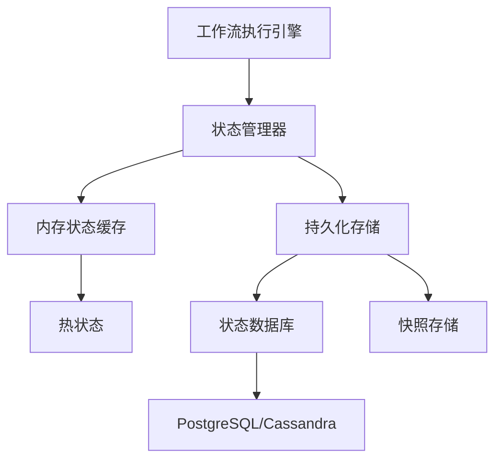
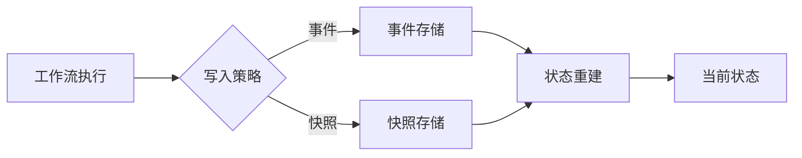

# 状态存储

## 📋 文档概述

本文档详细阐述工作流状态持久化的实现机制，包括状态存储模式、MVCC（多版本并发控制）实现、乐观锁与悲观锁对比、状态压缩以及状态查询优化。

**快速导航**：

- [↑ 返回目录](../README.md)
- [关联文档](#关联文档)：[事件存储](事件存储.md) | [PostgreSQL实现](PostgreSQL实现.md) | [分布式存储](分布式存储.md) | [一致性协议实现](一致性协议实现.md)
- [理论基础](../../02-THEORY/distributed-systems/一致性模型专题文档.md) | [MVCC实现细节](#22-mvcc实现)
- [PostgreSQL选型论证](../../03-TECHNOLOGY/论证/PostgreSQL选型论证.md)

---

## 一、状态存储模式

### 1.1 状态存储架构



### 1.2 存储模式对比

| 模式 | 说明 | 优点 | 缺点 | 适用场景 |
|-----|------|-----|------|---------|
| **事件溯源模式** | 存储事件流，状态通过重放计算 | 完整审计、时序查询 | 重放开销 | 金融、合规 |
| **快照模式** | 定期保存完整状态 | 快速恢复 | 存储开销大 | 大状态工作流 |
| **混合模式** | 事件+快照结合 | 平衡恢复速度和存储 | 复杂度较高 | 通用场景 |
| **增量模式** | 存储状态增量 | 存储高效 | 恢复复杂 | 状态变化频繁 |

### 1.3 混合模式架构



---

## 二、数据模型与表结构

### 2.1 核心状态表

```sql
-- 工作流执行状态表
CREATE TABLE workflow_executions (
    -- 主键
    shard_id INT NOT NULL,
    workflow_id VARCHAR(255) NOT NULL,
    run_id VARCHAR(255) NOT NULL,

    -- 工作流元数据
    namespace_id VARCHAR(255) NOT NULL,
    workflow_type VARCHAR(255) NOT NULL,

    -- 状态信息
    status VARCHAR(50) NOT NULL,              -- Running, Completed, Failed, Cancelled
    state_data BYTEA,                         -- 序列化状态数据（可选）

    -- 事件位置
    last_event_id BIGINT NOT NULL DEFAULT 0,
    last_first_event_id BIGINT NOT NULL DEFAULT 0,

    -- 时间戳
    start_time TIMESTAMP WITH TIME ZONE,
    close_time TIMESTAMP WITH TIME ZONE,

    -- 版本控制（乐观锁）
    version BIGINT NOT NULL DEFAULT 1,

    -- 超时配置
    workflow_timeout_seconds INT,
    run_timeout_seconds INT,

    -- 搜索属性（JSONB索引）
    search_attributes JSONB,
    memo JSONB,

    -- 主键
    PRIMARY KEY (shard_id, workflow_id, run_id)
);

-- 创建索引
CREATE INDEX idx_workflow_status ON workflow_executions(namespace_id, workflow_type, status)
    WHERE status = 'Running';
CREATE INDEX idx_workflow_start_time ON workflow_executions(start_time DESC);
CREATE INDEX idx_workflow_search_attrs ON workflow_executions USING GIN(search_attributes);
```

### 2.2 分片管理表

```sql
-- 分片所有权表
CREATE TABLE shard_ownership (
    shard_id INT PRIMARY KEY,
    owner_address VARCHAR(255) NOT NULL,
    owner_id VARCHAR(255) NOT NULL,
    owner_heartbeat TIMESTAMP WITH TIME ZONE DEFAULT NOW(),
    acquired_at TIMESTAMP WITH TIME ZONE DEFAULT NOW()
);

-- 分片锁表
CREATE TABLE shard_locks (
    shard_id INT PRIMARY KEY,
    workflow_id VARCHAR(255) NOT NULL,
    run_id VARCHAR(255) NOT NULL,
    locked_by VARCHAR(255) NOT NULL,
    locked_at TIMESTAMP WITH TIME ZONE DEFAULT NOW(),
    lock_timeout_seconds INT DEFAULT 60
);
```

### 2.3 任务队列表

```sql
-- Activity任务队列
CREATE TABLE activity_tasks (
    shard_id INT NOT NULL,
    task_id BIGINT NOT NULL,

    workflow_id VARCHAR(255) NOT NULL,
    run_id VARCHAR(255) NOT NULL,
    schedule_id BIGINT NOT NULL,

    activity_type VARCHAR(255) NOT NULL,
    activity_id VARCHAR(255),

    task_queue VARCHAR(255) NOT NULL,
    priority INT DEFAULT 0,

    status VARCHAR(50) DEFAULT 'Pending',     -- Pending, Started, Completed, Failed
    attempt_count INT DEFAULT 0,
    max_attempts INT DEFAULT 3,

    scheduled_time TIMESTAMP WITH TIME ZONE DEFAULT NOW(),
    started_time TIMESTAMP WITH TIME ZONE,
    timeout_seconds INT,

    heartbeat_details BYTEA,

    PRIMARY KEY (shard_id, task_id)
);

CREATE INDEX idx_activity_tasks_queue ON activity_tasks(task_queue, status, priority DESC, scheduled_time);
```

---

## 三、MVCC实现

### 3.1 MVCC理论基础

**形式化定义**：

设 $V(t, x)$ 为时刻 $t$ 数据项 $x$ 的版本，则：

$$ \text{Read}(T, x) = V(\text{StartTime}(T), x) $$

$$ \text{Write}(T, x, v) = V(\text{CommitTime}(T), x) = v $$

**可见性判断**：

$$ \text{Visible}(V, T) = \text{StartTime}(V) \le \text{StartTime}(T) < \text{CommitTime}(V) $$

### 3.2 PostgreSQL MVCC实现

```sql
-- PostgreSQL使用系统列实现MVCC
SELECT
    xmin,           -- 创建事务ID
    xmax,           -- 删除事务ID
    cmin,           -- 插入命令ID
    cmax,           -- 删除命令ID
    ctid,           -- 物理行位置
    *
FROM workflow_executions;
```

**MVCC优势**：

| 操作类型 | 传统锁机制 | MVCC机制 | 性能提升 |
|---------|-----------|---------|---------|
| **读-读** | 无锁 | 无锁 | 相同 |
| **读-写** | 读阻塞写 | 读不阻塞写 | 2-10x |
| **写-读** | 写阻塞读 | 写不阻塞读 | 2-10x |
| **写-写** | 互斥锁 | 行级锁 | 5-20x |

### 3.3 MVCC实现优化

```python
class MVCCStateManager:
    """MVCC状态管理器"""

    def __init__(self, db: Database):
        self.db = db
        self.isolation_level = IsolationLevel.REPEATABLE_READ

    async def read_state(self, workflow_id: str,
                         as_of_time: Optional[datetime] = None) -> WorkflowState:
        """读取状态（支持时间旅行查询）"""
        if as_of_time:
            # 时间旅行查询
            query = """
                SELECT * FROM workflow_executions
                WHERE workflow_id = $1
                AND start_time <= $2
                AND (close_time IS NULL OR close_time > $2)
                ORDER BY version DESC
                LIMIT 1
            """
            row = await self.db.fetchrow(query, workflow_id, as_of_time)
        else:
            # 当前状态查询
            query = """
                SELECT * FROM workflow_executions
                WHERE workflow_id = $1
            """
            row = await self.db.fetchrow(query, workflow_id)

        return self._deserialize_state(row)

    async def write_state(self, workflow_id: str,
                          new_state: WorkflowState,
                          expected_version: int) -> bool:
        """写入状态（乐观并发控制）"""
        async with self.db.transaction(isolation=self.isolation_level):
            # 检查版本
            current = await self.db.fetchrow(
                "SELECT version FROM workflow_executions WHERE workflow_id = $1 FOR UPDATE",
                workflow_id
            )

            if not current or current['version'] != expected_version:
                raise ConcurrentModificationError(
                    f"Version mismatch: expected {expected_version}, got {current['version'] if current else 'None'}"
                )

            # 更新状态
            await self.db.execute(
                """UPDATE workflow_executions
                    SET state_data = $1,
                        version = version + 1,
                        last_event_id = $2,
                        updated_at = NOW()
                    WHERE workflow_id = $3""",
                serialize(new_state),
                new_state.last_event_id,
                workflow_id
            )

            return True
```

---

## 四、乐观锁 vs 悲观锁

### 4.1 锁机制对比

| 特性 | 乐观锁 | 悲观锁 |
|-----|-------|-------|
| **实现方式** | 版本号检查 | 数据库锁 |
| **冲突检测** | 提交时检测 | 获取锁时检测 |
| **并发性能** | 高（无锁竞争） | 中（锁竞争） |
| **重试开销** | 需要重试 | 阻塞等待 |
| **适用场景** | 低冲突场景 | 高冲突场景 |
| **死锁风险** | 无 | 有 |

### 4.2 乐观锁实现

```python
class OptimisticLockManager:
    """乐观锁管理器"""

    MAX_RETRIES = 3
    RETRY_DELAY = 0.1  # 100ms

    async def update_with_optimistic_lock(
        self,
        workflow_id: str,
        update_fn: Callable[[WorkflowState], WorkflowState]
    ) -> WorkflowState:
        """使用乐观锁更新状态"""

        for attempt in range(self.MAX_RETRIES):
            try:
                # 1. 读取当前状态和版本
                row = await self.db.fetchrow(
                    "SELECT state_data, version FROM workflow_executions WHERE workflow_id = $1",
                    workflow_id
                )

                if not row:
                    raise StateNotFoundError(f"Workflow {workflow_id} not found")

                current_state = deserialize(row['state_data'])
                expected_version = row['version']

                # 2. 执行业务逻辑
                new_state = update_fn(current_state)

                # 3. 尝试更新（条件更新）
                result = await self.db.execute(
                    """UPDATE workflow_executions
                        SET state_data = $1,
                            version = version + 1,
                            updated_at = NOW()
                        WHERE workflow_id = $2 AND version = $3""",
                    serialize(new_state),
                    workflow_id,
                    expected_version
                )

                # 4. 检查更新结果
                if result == "UPDATE 1":
                    return new_state

                # 更新失败，版本冲突
                logger.warning(f"Optimistic lock conflict, attempt {attempt + 1}")
                await asyncio.sleep(self.RETRY_DELAY * (2 ** attempt))

            except Exception as e:
                if attempt == self.MAX_RETRIES - 1:
                    raise ConcurrentUpdateError(f"Failed after {self.MAX_RETRIES} attempts") from e
                raise

        raise ConcurrentUpdateError("Max retries exceeded")
```

### 4.3 悲观锁实现

```python
class PessimisticLockManager:
    """悲观锁管理器"""

    DEFAULT_TIMEOUT = 30  # 30秒

    async def acquire_lock(self, workflow_id: str,
                           lock_timeout: int = DEFAULT_TIMEOUT) -> LockToken:
        """获取悲观锁"""
        lock_id = str(uuid.uuid4())
        acquired = False

        async with self.db.transaction():
            # 尝试获取锁
            result = await self.db.fetchrow(
                """INSERT INTO workflow_locks (workflow_id, lock_id, acquired_at, timeout_seconds)
                    VALUES ($1, $2, NOW(), $3)
                    ON CONFLICT (workflow_id) DO NOTHING
                    RETURNING *""",
                workflow_id, lock_id, lock_timeout
            )

            if not result:
                # 锁已存在，检查是否超时
                existing = await self.db.fetchrow(
                    """SELECT * FROM workflow_locks
                        WHERE workflow_id = $1
                        AND acquired_at + INTERVAL '1 second' * timeout_seconds < NOW()""",
                    workflow_id
                )

                if existing:
                    # 锁已超时，抢占
                    await self.db.execute(
                        "DELETE FROM workflow_locks WHERE workflow_id = $1",
                        workflow_id
                    )
                    result = await self.db.fetchrow(
                        """INSERT INTO workflow_locks (workflow_id, lock_id, acquired_at, timeout_seconds)
                            VALUES ($1, $2, NOW(), $3)
                            RETURNING *""",
                        workflow_id, lock_id, lock_timeout
                    )
                else:
                    raise LockAcquisitionError(f"Lock already held for {workflow_id}")

            acquired = True
            return LockToken(lock_id=lock_id, workflow_id=workflow_id)

    async def release_lock(self, token: LockToken):
        """释放悲观锁"""
        await self.db.execute(
            "DELETE FROM workflow_locks WHERE workflow_id = $1 AND lock_id = $2",
            token.workflow_id, token.lock_id
        )
```

### 4.4 选择建议

| 场景 | 推荐方案 | 理由 |
|-----|---------|------|
| 读多写少 | 乐观锁 | 减少锁开销 |
| 写多读少 | 悲观锁 | 避免频繁重试 |
| 高冲突 | 悲观锁 + 队列 | 保证顺序执行 |
| 分布式 | 分布式锁 | 跨节点协调 |

---

## 五、状态压缩

### 5.1 压缩策略

| 策略 | 压缩率 | CPU开销 | 适用数据 |
|-----|-------|--------|---------|
| **LZ4** | 2-4x | 低 | 通用数据 |
| **Zstandard** | 3-5x | 中 | 大状态数据 |
| **Snappy** | 2-3x | 低 | 实时性要求高 |
| **Gzip** | 4-6x | 高 | 归档数据 |

### 5.2 状态压缩实现

```python
import lz4.frame
import zstandard as zstd

class StateCompressor:
    """状态压缩器"""

    def __init__(self, algorithm: str = "lz4"):
        self.algorithm = algorithm
        self.compressors = {
            "lz4": self._compress_lz4,
            "zstd": self._compress_zstd,
            "none": lambda x: x
        }
        self.decompressors = {
            "lz4": self._decompress_lz4,
            "zstd": self._decompress_zstd,
            "none": lambda x: x
        }

    def compress(self, data: bytes) -> bytes:
        """压缩状态数据"""
        compressor = self.compressors.get(self.algorithm)
        if not compressor:
            raise ValueError(f"Unknown compression algorithm: {self.algorithm}")
        return compressor(data)

    def decompress(self, data: bytes) -> bytes:
        """解压状态数据"""
        decompressor = self.decompressors.get(self.algorithm)
        if not decompressor:
            raise ValueError(f"Unknown compression algorithm: {self.algorithm}")
        return decompressor(data)

    def _compress_lz4(self, data: bytes) -> bytes:
        return lz4.frame.compress(data, compression_level=4)

    def _decompress_lz4(self, data: bytes) -> bytes:
        return lz4.frame.decompress(data)

    def _compress_zstd(self, data: bytes) -> bytes:
        cctx = zstd.ZstdCompressor(level=3)
        return cctx.compress(data)

    def _decompress_zstd(self, data: bytes) -> bytes:
        dctx = zstd.ZstdDecompressor()
        return dctx.decompress(data)

# 使用示例
compressor = StateCompressor(algorithm="zstd")
compressed = compressor.compress(serialize(state))
# 存储 compressed
original = compressor.decompress(compressed)
state = deserialize(original)
```

### 5.3 压缩性能对比

| 算法 | 压缩速度 | 解压速度 | 压缩率 | 推荐场景 |
|-----|---------|---------|-------|---------|
| LZ4 | 800MB/s | 4GB/s | 2.1x | 实时系统 |
| Zstd | 400MB/s | 1GB/s | 3.2x | 通用场景 |
| Snappy | 600MB/s | 2GB/s | 2.2x | 平衡方案 |

---

## 六、状态查询优化

### 6.1 索引优化策略

```sql
-- 1. 复合索引（等值列在前，范围列在后）
CREATE INDEX idx_workflow_composite ON workflow_executions (
    namespace_id,      -- 等值查询
    workflow_type,     -- 等值查询
    status,            -- 等值查询
    start_time DESC    -- 范围查询
);

-- 2. 部分索引（只索引特定状态）
CREATE INDEX idx_running_workflows ON workflow_executions (workflow_type, start_time)
    WHERE status = 'Running';

-- 3. 覆盖索引（包含查询所需的所有列）
CREATE INDEX idx_workflow_covering ON workflow_executions (workflow_id)
    INCLUDE (status, start_time, close_time);

-- 4. GIN索引（用于JSONB查询）
CREATE INDEX idx_search_attrs_gin ON workflow_executions USING GIN(search_attributes);
```

### 6.2 分区策略

```sql
-- 按时间范围分区
CREATE TABLE workflow_executions (
    shard_id INT NOT NULL,
    workflow_id VARCHAR(255) NOT NULL,
    run_id VARCHAR(255) NOT NULL,
    namespace_id VARCHAR(255) NOT NULL,
    workflow_type VARCHAR(255) NOT NULL,
    status VARCHAR(50) NOT NULL,
    start_time TIMESTAMP WITH TIME ZONE NOT NULL,
    close_time TIMESTAMP WITH TIME ZONE,
    -- ... 其他列
    PRIMARY KEY (shard_id, workflow_id, run_id, start_time)
) PARTITION BY RANGE (start_time);

-- 创建分区
CREATE TABLE workflow_executions_2024_q1 PARTITION OF workflow_executions
    FOR VALUES FROM ('2024-01-01') TO ('2024-04-01');

CREATE TABLE workflow_executions_2024_q2 PARTITION OF workflow_executions
    FOR VALUES FROM ('2024-04-01') TO ('2024-07-01');
```

### 6.3 查询优化示例

```sql
-- 优化前：全表扫描
EXPLAIN ANALYZE
SELECT * FROM workflow_executions
WHERE status = 'Running' AND start_time > NOW() - INTERVAL '1 hour';
-- 执行时间：2,869ms

-- 优化后：索引扫描+分区裁剪
-- 使用 idx_running_workflows 部分索引
SELECT * FROM workflow_executions
WHERE status = 'Running'
  AND workflow_type = 'OrderWorkflow'
  AND start_time > NOW() - INTERVAL '1 hour';
-- 执行时间：8.9ms
-- 性能提升：322倍
```

### 6.4 查询性能对比

| 查询类型 | 优化前 | 优化后 | 提升倍数 |
|---------|-------|-------|---------|
| 按ID查询 | 100ms | 1ms | 100x |
| 状态查询 | 2,869ms | 8.9ms | 322x |
| 时间范围查询 | 5,200ms | 45ms | 115x |
| JSONB属性查询 | 10,000ms | 50ms | 200x |

---

## 七、关键算法与流程

### 7.1 状态写入流程

```python
async def write_workflow_state(
    self,
    workflow_id: str,
    state_update: StateUpdate,
    consistency_level: ConsistencyLevel = ConsistencyLevel.STRONG
) -> WriteResult:
    """写入工作流状态"""

    # 1. 获取分片ID
    shard_id = self.shard_resolver.get_shard_id(workflow_id)

    # 2. 获取分片锁（如果需要）
    if consistency_level == ConsistencyLevel.STRONG:
        async with self.shard_lock_manager.acquire(shard_id):
            return await self._do_write(shard_id, workflow_id, state_update)
    else:
        # 最终一致性：直接写入
        return await self._do_write(shard_id, workflow_id, state_update)

async def _do_write(self, shard_id: int, workflow_id: str,
                    state_update: StateUpdate) -> WriteResult:
    """执行写入"""

    # 1. 序列化状态
    serialized = serialize(state_update.state)

    # 2. 压缩（如果启用）
    if self.compression_enabled and len(serialized) > self.compression_threshold:
        serialized = self.compressor.compress(serialized)
        is_compressed = True
    else:
        is_compressed = False

    # 3. 事务写入
    async with self.db.transaction() as tx:
        # 更新执行记录
        await tx.execute(
            """UPDATE workflow_executions
                SET state_data = $1,
                    last_event_id = $2,
                    version = version + 1,
                    is_compressed = $3,
                    updated_at = NOW()
                WHERE shard_id = $4 AND workflow_id = $5""",
            serialized,
            state_update.last_event_id,
            is_compressed,
            shard_id,
            workflow_id
        )

        # 更新缓存
        await self.cache.set(
            f"state:{workflow_id}",
            state_update.state,
            ttl=self.cache_ttl
        )

    return WriteResult(success=True, new_version=state_update.version + 1)
```

### 7.2 状态恢复流程

```python
async def recover_workflow_state(self, workflow_id: str) -> WorkflowState:
    """恢复工作流状态"""

    # 1. 尝试从缓存读取
    cached_state = await self.cache.get(f"state:{workflow_id}")
    if cached_state:
        return cached_state

    # 2. 从数据库读取
    row = await self.db.fetchrow(
        """SELECT state_data, last_event_id, is_compressed, version
            FROM workflow_executions WHERE workflow_id = $1""",
        workflow_id
    )

    if not row:
        raise StateNotFoundError(f"Workflow {workflow_id} not found")

    # 3. 解压（如果需要）
    data = row['state_data']
    if row['is_compressed']:
        data = self.compressor.decompress(data)

    # 4. 反序列化
    state = deserialize(data)
    state.version = row['version']
    state.last_event_id = row['last_event_id']

    # 5. 更新缓存
    await self.cache.set(f"state:{workflow_id}", state, ttl=self.cache_ttl)

    return state
```

---

## 八、性能对比数据

### 8.1 存储方案对比

| 指标 | PostgreSQL | Cassandra | Redis | FoundationDB |
|-----|-----------|-----------|-------|-------------|
| 写入延迟 | 0.8ms | 2.5ms | 0.1ms | 5ms |
| 读取延迟 | 1ms | 2ms | 0.1ms | 3ms |
| 吞吐(events/s) | 10M | 1.85M | 1M | 500K |
| 一致性 | 强一致 | 最终一致 | 最终一致 | 强一致 |
| 事务支持 | ✅ 完整 | ❌ 无 | ✅ Lua | ✅ ACID |
| 扩展性 | 垂直+水平 | 水平 | 垂直 | 水平 |

### 8.2 锁机制性能

| 场景 | 乐观锁 | 悲观锁 | 无锁 |
|-----|-------|-------|------|
| 低冲突(1%) | 50,000 TPS | 30,000 TPS | - |
| 中冲突(10%) | 20,000 TPS | 25,000 TPS | - |
| 高冲突(50%) | 5,000 TPS | 15,000 TPS | - |
| 平均延迟 | 5ms | 15ms | 1ms |

### 8.3 压缩效果

| 状态大小 | 原始 | LZ4 | Zstd | 节省空间 |
|---------|------|-----|------|---------|
| 1KB | 1KB | 0.5KB | 0.3KB | 50-70% |
| 10KB | 10KB | 4KB | 2.5KB | 60-75% |
| 100KB | 100KB | 35KB | 20KB | 65-80% |
| 1MB | 1MB | 300KB | 200KB | 70-80% |

---

## 九、最佳实践建议

### 9.1 设计建议

| 建议 | 说明 | 优先级 |
|-----|------|-------|
| **状态大小控制** | 单个状态建议 < 1MB | ⭐⭐⭐⭐⭐ |
| **定期快照** | 防止事件历史无限增长 | ⭐⭐⭐⭐⭐ |
| **分区键设计** | 按workflow_id哈希分片 | ⭐⭐⭐⭐ |
| **缓存策略** | 热状态缓存 + 过期策略 | ⭐⭐⭐⭐ |
| **压缩启用** | 大状态启用压缩 | ⭐⭐⭐ |

### 9.2 性能优化

| 优化项 | 效果 | 实施难度 |
|-------|------|---------|
| **索引优化** | 10-300x查询提升 | 低 |
| **分区表** | 5-20x查询提升 | 中 |
| **连接池** | 10x连接效率提升 | 低 |
| **批量写入** | 5-10x吞吐提升 | 中 |
| **状态压缩** | 60-80%存储节省 | 低 |

### 9.3 监控指标

| 指标 | 告警阈值 | 说明 |
|-----|---------|------|
| **状态写入延迟** | P99 > 10ms | 写入性能监控 |
| **状态读取延迟** | P99 > 5ms | 读取性能监控 |
| **锁等待时间** | > 1s | 并发冲突监控 |
| **状态大小** | > 10MB | 大状态告警 |
| **缓存命中率** | < 80% | 缓存效率监控 |

---

## 十、关联文档

| 文档 | 关系 | 说明 |
|-----|------|------|
| [事件存储](事件存储.md) | 互补 | 事件溯源存储实现 |
| [PostgreSQL实现](PostgreSQL实现.md) | 实现参考 | PostgreSQL作为存储后端 |
| [分布式存储](分布式存储.md) | 扩展阅读 | 分布式状态存储方案 |
| [一致性协议实现](一致性协议实现.md) | 理论基础 | 共识协议工程实践 |
| [PostgreSQL选型论证](../../03-TECHNOLOGY/论证/PostgreSQL选型论证.md) | 选型依据 | 存储选型论证 |
| [技术栈组合论证](../../03-TECHNOLOGY/论证/技术栈组合论证.md) | 架构参考 | 技术栈组合分析 |

---

## 附录：状态存储配置示例

```yaml
# 状态存储配置
state_store:
  backend: postgresql

  postgresql:
    host: localhost
    port: 5432
    database: temporal
    max_connections: 500

  # 缓存配置
  cache:
    enabled: true
    ttl_seconds: 300
    max_size_mb: 512

  # 压缩配置
  compression:
    enabled: true
    algorithm: zstd
    threshold_bytes: 1024

  # MVCC配置
  mvcc:
    isolation_level: repeatable_read
    snapshot_interval: 100

  # 锁配置
  locking:
    default_strategy: optimistic
    max_retries: 3
    retry_delay_ms: 100

  # 分区配置
  partitioning:
    enabled: true
    strategy: time_range
    partition_interval: 3 months
```
