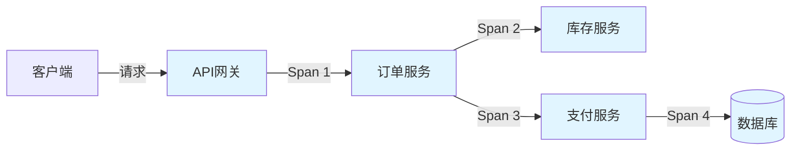
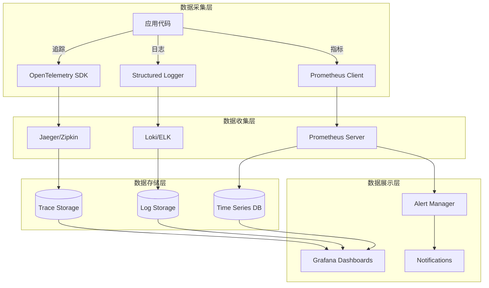

# 可观测性

## 概述

**可观测性（Observability）** 是指通过系统的外部输出（日志、指标、追踪）来理解和推断系统内部状态的能力。在分布式工作流系统中，可观测性是排查问题、优化性能、保障可靠性的关键手段。

可观测性的三大支柱：

1. **日志（Logging）**：记录离散事件
2. **指标（Metrics）**：聚合时间序列数据
3. **追踪（Tracing）**：记录请求在分布式系统中的完整路径

---

## 1. 分布式追踪（OpenTelemetry）

### 1.1 概念定义

**分布式追踪** 记录一个请求在分布式系统中经过的所有服务和组件的完整路径，帮助理解请求流、识别瓶颈和排查故障。



**核心概念**：

- **Trace（追踪）**：一个完整请求的端到端路径
- **Span（跨度）**：追踪中的单个操作单元
- **Span Context（跨度上下文）**：用于跨服务传递追踪信息

### 1.2 OpenTelemetry 实现

```go
// OpenTelemetry 初始化
import (
    "go.opentelemetry.io/otel"
    "go.opentelemetry.io/otel/exporters/jaeger"
    "go.opentelemetry.io/otel/sdk/resource"
    sdktrace "go.opentelemetry.io/otel/sdk/trace"
    semconv "go.opentelemetry.io/otel/semconv/v1.4.0"
)

func InitTracer(serviceName string) (*sdktrace.TracerProvider, error) {
    // 创建 Jaeger 导出器
    exp, err := jaeger.New(jaeger.WithCollectorEndpoint(
        jaeger.WithEndpoint("http://jaeger-collector:14268/api/traces"),
    ))
    if err != nil {
        return nil, err
    }

    // 创建资源
    res, err := resource.New(
        context.Background(),
        resource.WithAttributes(
            semconv.ServiceNameKey.String(serviceName),
            semconv.ServiceVersionKey.String("1.0.0"),
        ),
    )
    if err != nil {
        return nil, err
    }

    // 创建 Tracer Provider
    tp := sdktrace.NewTracerProvider(
        sdktrace.WithBatcher(exp),
        sdktrace.WithResource(res),
        sdktrace.WithSampler(sdktrace.TraceIDRatioBased(0.1)), // 10% 采样
    )

    otel.SetTracerProvider(tp)
    return tp, nil
}

// 工作流追踪
func OrderWorkflow(ctx workflow.Context, order Order) error {
    // 获取 tracer
    tracer := otel.Tracer("order-workflow")

    // 开始根 span
    ctx, span := tracer.Start(ctx, "order-workflow", trace.WithAttributes(
        attribute.String("order.id", order.ID),
        attribute.String("customer.id", order.CustomerID),
        attribute.Float64("order.amount", order.TotalAmount),
    ))
    defer span.End()

    // 验证订单
    ctx, validationSpan := tracer.Start(ctx, "validate-order")
    err := validateOrder(order)
    validationSpan.SetAttributes(attribute.Bool("validation.passed", err == nil))
    validationSpan.End()

    if err != nil {
        span.RecordError(err)
        return err
    }

    // 处理支付
    ctx, paymentSpan := tracer.Start(ctx, "process-payment")
    paymentResult, err := processPayment(ctx, order)
    paymentSpan.SetAttributes(
        attribute.String("payment.method", order.PaymentMethod),
        attribute.Bool("payment.success", err == nil),
    )
    if err != nil {
        paymentSpan.RecordError(err)
        paymentSpan.SetStatus(codes.Error, "payment failed")
    }
    paymentSpan.End()

    if err != nil {
        span.SetStatus(codes.Error, "order workflow failed")
        return err
    }

    span.SetAttributes(attribute.String("payment.transaction_id", paymentResult.TransactionID))
    return nil
}

// Activity 追踪
func ProcessPaymentActivity(ctx context.Context, order Order) (*PaymentResult, error) {
    tracer := otel.Tracer("payment-activity")

    // 从 context 中提取 span context
    ctx, span := tracer.Start(ctx, "process-payment-activity",
        trace.WithAttributes(
            attribute.String("order.id", order.ID),
            attribute.Float64("amount", order.TotalAmount),
        ),
    )
    defer span.End()

    // 调用支付网关
    ctx, gatewaySpan := tracer.Start(ctx, "call-payment-gateway")
    result, err := paymentGateway.Charge(ctx, order.PaymentInfo)
    gatewaySpan.SetAttributes(
        attribute.String("gateway.response_code", result.Code),
        attribute.Int64("gateway.latency_ms", result.Latency.Milliseconds()),
    )
    gatewaySpan.End()

    if err != nil {
        span.RecordError(err)
        span.SetStatus(codes.Error, err.Error())
        return nil, err
    }

    span.SetAttributes(attribute.String("transaction.id", result.TransactionID))
    return result, nil
}
```

### 1.3 Temporal 内置追踪

```go
// Temporal 与 OpenTelemetry 集成
import (
    "go.temporal.io/sdk/contrib/opentelemetry"
    "go.temporal.io/sdk/interceptor"
)

func CreateTemporalClient() (client.Client, error) {
    // 创建 OpenTelemetry 拦截器
    tracingInterceptor, err := opentelemetry.NewTracingInterceptor(
        opentelemetry.TracerOptions{
            Tracer: otel.Tracer("temporal-client"),
        },
    )
    if err != nil {
        return nil, err
    }

    return client.Dial(client.Options{
        HostPort: "localhost:7233",
        Interceptors: []interceptor.ClientInterceptor{
            tracingInterceptor,
        },
    })
}

// Worker 配置
func CreateWorker(c client.Client) worker.Worker {
    w := worker.New(c, "order-task-queue", worker.Options{
        Interceptors: []interceptor.WorkerInterceptor{
            opentelemetry.NewTracingInterceptor(),
        },
    })

    w.RegisterWorkflow(OrderWorkflow)
    w.RegisterActivity(ProcessPaymentActivity)

    return w
}
```

### 1.4 适用场景

- 分布式系统故障排查
- 性能瓶颈识别
- 依赖关系可视化
- 延迟分析

### 1.5 优缺点分析

**优点**：

- ✅ 完整请求链路可视化
- ✅ 精确定位性能瓶颈
- ✅ 跨服务问题关联
- ✅ 支持采样降低成本

**缺点**：

- ❌ 增加系统开销
- ❌ 数据量大，存储成本高
- ❌ 需要全链路接入
- ❌ 采样可能丢失关键信息

---

## 2. 指标收集（Prometheus）

### 2.1 核心指标类型

| 指标类型 | 描述 | 示例 |
|---------|------|------|
| **Counter** | 单调递增的计数器 | 请求总数、错误总数 |
| **Gauge** | 可增可减的瞬时值 | 当前连接数、队列长度 |
| **Histogram** | 采样值分布 | 请求延迟分布 |
| **Summary** | 类似Histogram，计算分位数 | P99延迟 |

### 2.2 Prometheus 实现

```go
// Prometheus 指标定义
import (
    "github.com/prometheus/client_golang/prometheus"
    "github.com/prometheus/client_golang/prometheus/promauto"
    "github.com/prometheus/client_golang/prometheus/promhttp"
)

var (
    // 工作流执行计数器
    workflowExecutions = promauto.NewCounterVec(
        prometheus.CounterOpts{
            Name: "workflow_executions_total",
            Help: "Total number of workflow executions",
        },
        []string{"workflow_type", "status"},
    )

    // 工作流执行耗时直方图
    workflowExecutionDuration = promauto.NewHistogramVec(
        prometheus.HistogramOpts{
            Name:    "workflow_execution_duration_seconds",
            Help:    "Workflow execution duration in seconds",
            Buckets: prometheus.DefBuckets,
        },
        []string{"workflow_type"},
    )

    // Activity 执行计数器
    activityExecutions = promauto.NewCounterVec(
        prometheus.CounterOpts{
            Name: "activity_executions_total",
            Help: "Total number of activity executions",
        },
        []string{"activity_type", "status"},
    )

    // Activity 执行耗时
    activityExecutionDuration = promauto.NewHistogramVec(
        prometheus.HistogramOpts{
            Name:    "activity_execution_duration_seconds",
            Help:    "Activity execution duration in seconds",
            Buckets: []float64{.001, .005, .01, .025, .05, .1, .25, .5, 1, 2.5, 5, 10},
        },
        []string{"activity_type"},
    )

    // 正在执行的工作流数量（Gauge）
    activeWorkflows = promauto.NewGaugeVec(
        prometheus.GaugeOpts{
            Name: "active_workflows",
            Help: "Number of currently active workflows",
        },
        []string{"workflow_type"},
    )

    // 队列深度
    taskQueueDepth = promauto.NewGaugeVec(
        prometheus.GaugeOpts{
            Name: "task_queue_depth",
            Help: "Current depth of task queues",
        },
        []string{"task_queue"},
    )

    // 重试次数
    retryAttempts = promauto.NewHistogramVec(
        prometheus.HistogramOpts{
            Name:    "retry_attempts",
            Help:    "Number of retry attempts",
            Buckets: []float64{0, 1, 2, 3, 5, 10},
        },
        []string{"activity_type"},
    )
)

// 指标收集中间件
type MetricsInterceptor struct {
    next interceptor.WorkerInterceptor
}

func (m *MetricsInterceptor) InterceptActivity(
    ctx context.Context,
    next interceptor.ActivityInboundInterceptor,
) interceptor.ActivityInboundInterceptor {
    return &metricsActivityInboundInterceptor{
        next: next,
    }
}

type metricsActivityInboundInterceptor struct {
    next interceptor.ActivityInboundInterceptor
}

func (m *metricsActivityInboundInterceptor) ExecuteActivity(
    ctx context.Context,
    in *interceptor.ExecuteActivityInput,
) (interface{}, error) {
    activityType := in.ActivityType
    start := time.Now()

    // 增加活跃计数
    activeWorkflows.WithLabelValues(activityType).Inc()
    defer activeWorkflows.WithLabelValues(activityType).Dec()

    result, err := m.next.ExecuteActivity(ctx, in)

    duration := time.Since(start).Seconds()
    status := "success"
    if err != nil {
        status = "failure"
    }

    // 记录指标
    activityExecutions.WithLabelValues(activityType, status).Inc()
    activityExecutionDuration.WithLabelValues(activityType).Observe(duration)

    return result, err
}

// HTTP 服务暴露指标
func StartMetricsServer(port int) {
    http.Handle("/metrics", promhttp.Handler())
    log.Printf("Starting metrics server on port %d", port)
    log.Fatal(http.ListenAndServe(fmt.Sprintf(":%d", port), nil))
}
```

### 2.3 关键工作流指标

```go
// 业务指标定义
var (
    // 订单处理指标
    ordersProcessed = promauto.NewCounterVec(
        prometheus.CounterOpts{
            Name: "orders_processed_total",
            Help: "Total number of orders processed",
        },
        []string{"status", "payment_method"},
    )

    // 订单处理耗时
    orderProcessingDuration = promauto.NewHistogramVec(
        prometheus.HistogramOpts{
            Name:    "order_processing_duration_seconds",
            Help:    "Order processing duration",
            Buckets: []float64{1, 5, 10, 30, 60, 120, 300, 600},
        },
        []string{"status"},
    )

    // 支付成功率
    paymentSuccessRate = promauto.NewGaugeVec(
        prometheus.GaugeOpts{
            Name: "payment_success_rate",
            Help: "Payment success rate (0-1)",
        },
        []string{"payment_method"},
    )

    // 库存预留成功率
    inventoryReservationRate = promauto.NewGaugeVec(
        prometheus.GaugeOpts{
            Name: "inventory_reservation_success_rate",
            Help: "Inventory reservation success rate",
        },
        []string{},
    )

    // 补偿操作计数
    compensationsExecuted = promauto.NewCounterVec(
        prometheus.CounterOpts{
            Name: "compensations_executed_total",
            Help: "Total number of compensation operations executed",
        },
        []string{"operation_type"},
    )
)

// 在工作流中记录业务指标
func OrderWorkflowWithMetrics(ctx workflow.Context, order Order) error {
    start := workflow.Now(ctx)
    status := "success"

    defer func() {
        duration := workflow.Now(ctx).Sub(start).Seconds()
        ordersProcessed.WithLabelValues(status, order.PaymentMethod).Inc()
        orderProcessingDuration.WithLabelValues(status).Observe(duration)
    }()

    // 验证订单
    if err := workflow.ExecuteActivity(ctx, ValidateOrder, order).Get(ctx, nil); err != nil {
        status = "validation_failed"
        return err
    }

    // 预留库存
    if err := workflow.ExecuteActivity(ctx, ReserveInventory, order).Get(ctx, nil); err != nil {
        status = "inventory_failed"
        compensationsExecuted.WithLabelValues("release_inventory").Inc()
        return err
    }

    // 处理支付
    if err := workflow.ExecuteActivity(ctx, ProcessPayment, order).Get(ctx, nil); err != nil {
        status = "payment_failed"
        // 执行补偿
        _ = workflow.ExecuteActivity(ctx, ReleaseInventory, order).Get(ctx, nil)
        compensationsExecuted.WithLabelValues("release_inventory").Inc()
        return err
    }

    return nil
}
```

### 2.4 优缺点分析

**优点**：

- ✅ 时间序列数据，支持趋势分析
- ✅ 低开销，适合高频采集
- ✅ 强大的查询和告警能力
- ✅ 生态丰富，集成方便

**缺点**：

- ❌ 只能聚合数据，丢失细节
- ❌ 不适合高基数维度
- ❌ 需要预先定义指标
- ❌ 短期数据，长期存储成本高

---

## 3. 结构化日志

### 3.1 结构化日志设计

**结构化日志** 使用统一的格式（如JSON）记录日志，便于机器解析、查询和分析。

```go
// 结构化日志配置
import (
    "go.uber.org/zap"
    "go.uber.org/zap/zapcore"
)

func NewLogger() (*zap.Logger, error) {
    config := zap.Config{
        Level:       zap.NewAtomicLevelAt(zap.InfoLevel),
        Development: false,
        Encoding:    "json",
        EncoderConfig: zapcore.EncoderConfig{
            TimeKey:        "timestamp",
            LevelKey:       "level",
            NameKey:        "logger",
            CallerKey:      "caller",
            FunctionKey:    zapcore.OmitKey,
            MessageKey:     "message",
            StacktraceKey:  "stacktrace",
            LineEnding:     zapcore.DefaultLineEnding,
            EncodeLevel:    zapcore.LowercaseLevelEncoder,
            EncodeTime:     zapcore.ISO8601TimeEncoder,
            EncodeDuration: zapcore.SecondsDurationEncoder,
            EncodeCaller:   zapcore.ShortCallerEncoder,
        },
        OutputPaths:      []string{"stdout", "/var/log/workflow.log"},
        ErrorOutputPaths: []string{"stderr"},
    }

    return config.Build()
}

// 工作流日志
func OrderWorkflowWithLogging(ctx workflow.Context, order Order) error {
    logger := workflow.GetLogger(ctx)

    logger.Info("开始处理订单",
        zap.String("order_id", order.ID),
        zap.String("customer_id", order.CustomerID),
        zap.Float64("amount", order.TotalAmount),
        zap.Int("item_count", len(order.Items)),
    )

    // 验证订单
    logger.Debug("验证订单",
        zap.String("order_id", order.ID),
    )

    if err := workflow.ExecuteActivity(ctx, ValidateOrder, order).Get(ctx, nil); err != nil {
        logger.Error("订单验证失败",
            zap.String("order_id", order.ID),
            zap.Error(err),
            zap.Strings("validation_errors", extractValidationErrors(err)),
        )
        return err
    }

    logger.Info("订单验证通过",
        zap.String("order_id", order.ID),
        zap.Duration("validation_duration", time.Since(start)),
    )

    // 处理支付
    var paymentResult PaymentResult
    if err := workflow.ExecuteActivity(ctx, ProcessPayment, order).Get(ctx, &paymentResult); err != nil {
        logger.Error("支付处理失败",
            zap.String("order_id", order.ID),
            zap.String("payment_method", order.PaymentMethod),
            zap.Error(err),
            zap.String("error_code", extractErrorCode(err)),
        )

        // 记录补偿操作
        logger.Warn("执行补偿操作",
            zap.String("order_id", order.ID),
            zap.String("compensation_type", "release_inventory"),
        )

        return err
    }

    logger.Info("订单处理完成",
        zap.String("order_id", order.ID),
        zap.String("transaction_id", paymentResult.TransactionID),
        zap.Duration("total_duration", time.Since(start)),
    )

    return nil
}

// Activity 日志
func ProcessPaymentActivity(ctx context.Context, order Order) (*PaymentResult, error) {
    logger := activity.GetLogger(ctx)

    logger.Info("开始处理支付",
        zap.String("order_id", order.ID),
        zap.String("payment_method", order.PaymentMethod),
        zap.Float64("amount", order.TotalAmount),
    )

    start := time.Now()

    result, err := paymentGateway.Charge(ctx, order.PaymentInfo)

    duration := time.Since(start)

    if err != nil {
        logger.Error("支付网关调用失败",
            zap.String("order_id", order.ID),
            zap.Error(err),
            zap.Duration("gateway_latency", duration),
            zap.String("gateway_response", extractGatewayResponse(err)),
        )
        return nil, err
    }

    logger.Info("支付处理成功",
        zap.String("order_id", order.ID),
        zap.String("transaction_id", result.TransactionID),
        zap.Duration("gateway_latency", duration),
        zap.String("gateway_response_code", result.Code),
    )

    return result, nil
}
```

### 3.2 日志规范

```go
// 日志字段规范
const (
    // 通用字段
    FieldTimestamp     = "timestamp"
    FieldLevel         = "level"
    FieldService       = "service"
    FieldTraceID       = "trace_id"
    FieldSpanID        = "span_id"

    // 工作流字段
    FieldWorkflowID    = "workflow_id"
    FieldWorkflowType  = "workflow_type"
    FieldRunID         = "run_id"
    FieldActivityType  = "activity_type"
    FieldAttempt       = "attempt"

    // 业务字段
    FieldOrderID       = "order_id"
    FieldCustomerID    = "customer_id"
    FieldTransactionID = "transaction_id"
    FieldAmount        = "amount"
    FieldStatus        = "status"

    // 性能字段
    FieldDuration      = "duration_ms"
    FieldLatency       = "latency_ms"
    FieldRetryCount    = "retry_count"
)

// 日志级别使用规范
/*
DEBUG: 详细的调试信息，仅在开发环境启用
  - 函数入口/出口
  - 变量值
  - 中间计算结果

INFO: 正常业务事件
  - 工作流开始/完成
  - 重要业务状态变更
  - 外部系统调用

WARN: 警告事件，需要关注但不需要立即处理
  - 重试操作
  - 降级处理
  - 配置问题
  - 性能接近阈值

ERROR: 错误事件，需要处理但不影响系统可用性
  - 业务处理失败
  - 外部系统调用失败（可重试）
  - 数据验证失败

FATAL: 致命错误，系统无法继续运行
  - 关键依赖不可用
  - 数据损坏
  - 系统资源耗尽
*/
```

### 3.3 优缺点分析

**优点**：

- ✅ 机器可解析
- ✅ 支持复杂查询
- ✅ 便于关联分析
- ✅ 支持日志聚合

**缺点**：

- ❌ 存储成本高
- ❌ 需要规范约束
- ❌ 性能开销
- ❌ 日志量爆炸风险

---

## 4. 健康检查

### 4.1 健康检查类型

| 检查类型 | 描述 | 频率 |
|---------|------|------|
| **存活检查（Liveness）** | 检查进程是否存活 | 10秒 |
| **就绪检查（Readiness）** | 检查服务是否可接受流量 | 5秒 |
| **启动检查（Startup）** | 检查服务是否启动完成 | 初始阶段 |
| **深度检查（Deep）** | 检查依赖服务状态 | 60秒 |

### 4.2 实现示例

```go
// 健康检查实现
import (
    "net/http"
    "github.com/gin-gonic/gin"
)

type HealthChecker struct {
    checks map[string]HealthCheck
}

type HealthCheck func(ctx context.Context) error

type HealthStatus struct {
    Status    string                 `json:"status"`
    Timestamp time.Time              `json:"timestamp"`
    Checks    map[string]CheckResult `json:"checks"`
}

type CheckResult struct {
    Status    string        `json:"status"`
    Error     string        `json:"error,omitempty"`
    Latency   time.Duration `json:"latency_ms"`
}

func (hc *HealthChecker) Register(name string, check HealthCheck) {
    hc.checks[name] = check
}

func (hc *HealthChecker) Check(ctx context.Context) HealthStatus {
    status := HealthStatus{
        Status:    "healthy",
        Timestamp: time.Now(),
        Checks:    make(map[string]CheckResult),
    }

    for name, check := range hc.checks {
        start := time.Now()
        err := check(ctx)
        latency := time.Since(start)

        result := CheckResult{
            Status:  "pass",
            Latency: latency,
        }

        if err != nil {
            result.Status = "fail"
            result.Error = err.Error()
            status.Status = "unhealthy"
        }

        status.Checks[name] = result
    }

    return status
}

// 存活检查
func LivenessCheck(c *gin.Context) {
    c.JSON(http.StatusOK, gin.H{"status": "alive"})
}

// 就绪检查
func ReadinessCheck(checker *HealthChecker) gin.HandlerFunc {
    return func(c *gin.Context) {
        status := checker.Check(c.Request.Context())

        if status.Status == "healthy" {
            c.JSON(http.StatusOK, status)
        } else {
            c.JSON(http.StatusServiceUnavailable, status)
        }
    }
}

// 深度健康检查
func DeepHealthCheck(temporalClient client.Client, db *sql.DB) *HealthChecker {
    checker := &HealthChecker{
        checks: make(map[string]HealthCheck),
    }

    // Temporal 连接检查
    checker.Register("temporal", func(ctx context.Context) error {
        _, err := temporalClient.CheckHealth(ctx, &service.CheckHealthRequest{})
        return err
    })

    // 数据库连接检查
    checker.Register("database", func(ctx context.Context) error {
        return db.PingContext(ctx)
    })

    // 工作流执行检查（轻量级）
    checker.Register("workflow_execution", func(ctx context.Context) error {
        // 执行一个简单的健康检查工作流
        options := client.StartWorkflowOptions{
            ID:        "health-check-" + time.Now().Format("20060102-150405"),
            TaskQueue: "health-check-queue",
        }

        we, err := temporalClient.ExecuteWorkflow(ctx, options, HealthCheckWorkflow)
        if err != nil {
            return err
        }

        return we.Get(ctx, nil)
    })

    return checker
}

// 健康检查工作流
func HealthCheckWorkflow(ctx workflow.Context) error {
    ao := workflow.ActivityOptions{
        StartToCloseTimeout: 5 * time.Second,
    }
    ctx = workflow.WithActivityOptions(ctx, ao)

    return workflow.ExecuteActivity(ctx, NoOpActivity).Get(ctx, nil)
}

func NoOpActivity(ctx context.Context) error {
    return nil
}
```

### 4.3 优缺点分析

**优点**：

- ✅ 自动故障检测
- ✅ 支持负载均衡决策
- ✅ 便于自动化运维
- ✅ 提前发现问题

**缺点**：

- ❌ 增加系统负载
- ❌ 可能误报
- ❌ 需要精心设计检查逻辑

---

## 5. 告警设计

### 5.1 告警级别

| 级别 | 描述 | 响应时间 | 通知方式 |
|------|------|---------|---------|
| **P0（紧急）** | 系统不可用，业务中断 | 立即 | 电话+短信+页面 |
| **P1（严重）** | 核心功能受损 | 5分钟 | 短信+页面 |
| **P2（警告）** | 性能下降，非核心功能受损 | 30分钟 | 页面+邮件 |
| **P3（提示）** | 需要关注但不紧急 | 24小时 | 邮件 |

### 5.2 告警规则

```yaml
# Prometheus 告警规则示例
groups:
  - name: workflow_alerts
    rules:
      # 工作流失败率过高
      - alert: HighWorkflowFailureRate
        expr: |
          (
            sum(rate(workflow_executions_total{status="failure"}[5m]))
            /
            sum(rate(workflow_executions_total[5m]))
          ) > 0.05
        for: 2m
        labels:
          severity: p1
        annotations:
          summary: "High workflow failure rate detected"
          description: "Workflow failure rate is {{ $value | humanizePercentage }}"

      # 工作流延迟过高
      - alert: HighWorkflowLatency
        expr: |
          histogram_quantile(0.99,
            sum(rate(workflow_execution_duration_seconds_bucket[5m])) by (le)
          ) > 60
        for: 5m
        labels:
          severity: p2
        annotations:
          summary: "High workflow latency detected"
          description: "P99 workflow latency is {{ $value }}s"

      # Activity 失败率过高
      - alert: HighActivityFailureRate
        expr: |
          (
            sum(rate(activity_executions_total{status="failure"}[5m])) by (activity_type)
            /
            sum(rate(activity_executions_total[5m])) by (activity_type)
          ) > 0.1
        for: 2m
        labels:
          severity: p1
        annotations:
          summary: "High activity failure rate for {{ $labels.activity_type }}"

      # 任务队列积压
      - alert: TaskQueueBacklog
        expr: task_queue_depth > 1000
        for: 5m
        labels:
          severity: p2
        annotations:
          summary: "Task queue backlog detected"
          description: "Queue {{ $labels.task_queue }} has {{ $value }} pending tasks"

      # 系统不可用
      - alert: ServiceDown
        expr: up == 0
        for: 1m
        labels:
          severity: p0
        annotations:
          summary: "Service {{ $labels.instance }} is down"
```

### 5.3 告警抑制和聚合

```go
// 告警管理器
type AlertManager struct {
    alertHistory map[string]time.Time
    mutex        sync.RWMutex
}

func (am *AlertManager) ShouldAlert(alert Alert) bool {
    am.mutex.Lock()
    defer am.mutex.Unlock()

    key := alert.Hash()
    lastAlert, exists := am.alertHistory[key]

    // 抑制期（如15分钟内不重复发送相同告警）
    if exists && time.Since(lastAlert) < 15*time.Minute {
        return false
    }

    am.alertHistory[key] = time.Now()
    return true
}

// 告警聚合
type AlertAggregator struct {
    buffer    []Alert
    window    time.Duration
    threshold int
}

func (aa *AlertAggregator) Add(alert Alert) []Alert {
    aa.buffer = append(aa.buffer, alert)

    // 检查是否需要聚合发送
    if len(aa.buffer) >= aa.threshold {
        return aa.flush()
    }

    return nil
}

func (aa *AlertAggregator) flush() []Alert {
    alerts := aa.buffer
    aa.buffer = nil
    return alerts
}
```

### 5.4 优缺点分析

**优点**：

- ✅ 及时发现问题
- ✅ 自动化通知
- ✅ 分级处理

**缺点**：

- ❌ 告警疲劳
- ❌ 需要精细调优
- ❌ 可能误报漏报

---

## 6. 可视化仪表盘

### 6.1 Grafana 仪表盘设计

```json
{
  "dashboard": {
    "title": "Workflow System Dashboard",
    "panels": [
      {
        "title": "Workflow Execution Rate",
        "type": "graph",
        "targets": [
          {
            "expr": "sum(rate(workflow_executions_total[5m])) by (workflow_type, status)"
          }
        ]
      },
      {
        "title": "Workflow Latency (P99)",
        "type": "graph",
        "targets": [
          {
            "expr": "histogram_quantile(0.99, sum(rate(workflow_execution_duration_seconds_bucket[5m])) by (le, workflow_type))"
          }
        ]
      },
      {
        "title": "Activity Success Rate",
        "type": "stat",
        "targets": [
          {
            "expr": "sum(rate(activity_executions_total{status=\"success\"}[5m])) / sum(rate(activity_executions_total[5m]))"
          }
        ]
      },
      {
        "title": "Task Queue Depth",
        "type": "gauge",
        "targets": [
          {
            "expr": "task_queue_depth"
          }
        ]
      }
    ]
  }
}
```

### 6.2 关键指标仪表盘

| 仪表盘 | 指标 | 用途 |
|--------|------|------|
| **系统概览** | 吞吐量、延迟、错误率 | 整体健康状况 |
| **工作流详情** | 各工作流执行统计 | 业务监控 |
| **Activity 性能** | 各Activity执行时间 | 性能优化 |
| **资源监控** | CPU、内存、连接数 | 容量规划 |
| **追踪分析** | 调用链、依赖关系 | 故障排查 |

---

## 7. 综合可观测性架构



---

## 8. 企业实践案例

### 8.1 Netflix - 可观测性平台

**方案**：

- **追踪**：内部追踪系统（基于OpenTracing）
- **指标**：Atlas（自研时序数据库）
- **日志**：自定义日志聚合
- **仪表盘**：定制化仪表盘

**关键指标**：

- 追踪采样率：10%
- 指标保留：2周
- 日志保留：7天

### 8.2 Uber - 可观测性实践

**方案**：

- **追踪**：Jaeger
- **指标**：M3（自研时序数据库）
- **日志**：自研日志平台
- **告警**：自定义告警平台

**关键指标**：

- 日处理追踪数：数十亿
- 指标写入：百万/秒
- 告警准确率：95%

---

## 9. 相关文档链接

### 9.1 项目内部文档

- [最佳实践指南](../../05-GUIDES/最佳实践指南.md) - 监控和告警最佳实践
- [企业实践案例](../../04-PRACTICE/企业实践案例.md) - 企业可观测性案例
- [性能深度分析报告](../../06-ANALYSIS/性能深度分析报告.md) - 性能分析

### 9.2 外部资源

- [OpenTelemetry Documentation](https://opentelemetry.io/docs/)
- [Prometheus Best Practices](https://prometheus.io/docs/practices/)
- [Grafana Documentation](https://grafana.com/docs/)
- [Distributed Tracing](https://microservices.io/patterns/observability/distributed-tracing.html)

---

**文档版本**: 1.0
**创建时间**: 2025年1月
**最后更新**: 2025年1月
**状态**: ✅ **已完成**
