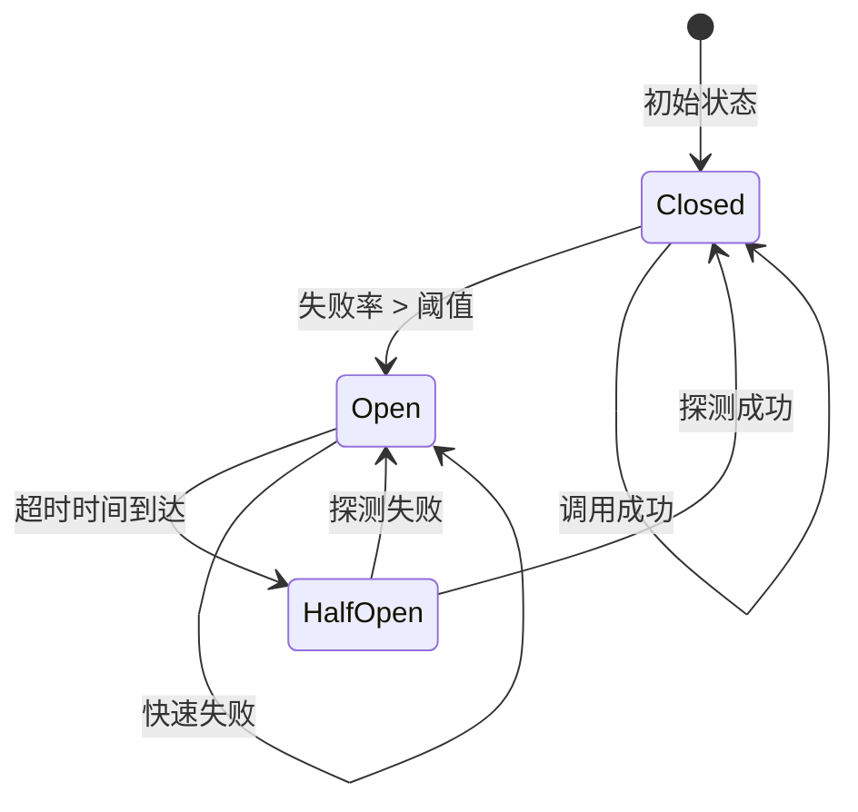
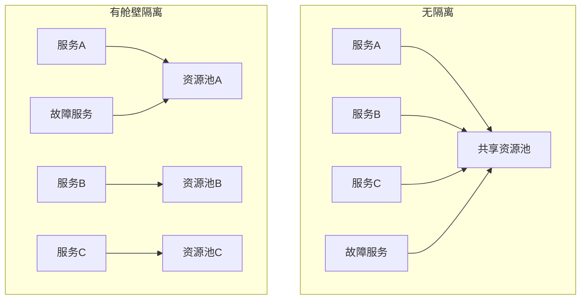
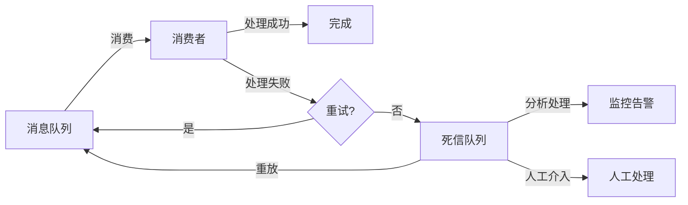
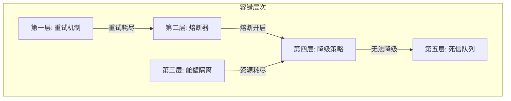

# 容错设计

## 概述

**容错设计（Fault Tolerance Design）** 是指在系统设计和实现过程中，考虑各种故障场景并设计相应的应对策略，使系统在部分组件故障时仍能保持可用性或优雅降级。容错设计是构建高可靠性分布式系统的核心要素。

---

## 1. 重试策略

### 1.1 固定间隔重试

**定义**：每次重试之间使用固定的延迟时间。

```go
// 固定间隔重试实现
func RetryWithFixedDelay(
    ctx context.Context,
    operation func() error,
    maxRetries int,
    delay time.Duration,
) error {
    var err error

    for i := 0; i <= maxRetries; i++ {
        err = operation()
        if err == nil {
            return nil
        }

        // 检查是否应该重试
        if !IsRetryableError(err) {
            return err
        }

        // 最后一次不重试
        if i < maxRetries {
            select {
            case <-ctx.Done():
                return ctx.Err()
            case <-time.After(delay):
                // 继续重试
            }
        }
    }

    return fmt.Errorf("重试%d次后失败: %w", maxRetries, err)
}

// 使用示例
func CallExternalAPI(ctx context.Context, req APIRequest) (*APIResponse, error) {
    var resp *APIResponse

    err := RetryWithFixedDelay(ctx, func() error {
        var err error
        resp, err = httpClient.Call(req)
        return err
    }, 3, 2*time.Second)

    return resp, err
}
```

**适用场景**：

- 故障恢复时间可预测
- 简单的重试逻辑
- 对延迟不敏感的场景

**优缺点**：

- ✅ 实现简单
- ✅ 延迟可预测
- ❌ 可能对故障服务造成压力
- ❌ 不适用于故障持续时间不确定的场景

### 1.2 指数退避重试

**定义**：每次重试的延迟时间呈指数增长，减少对故障服务的压力。

$$T_{retry} = T_{initial} \times 2^{n-1}$$

其中：

- $T_{initial}$ = 初始延迟时间
- $n$ = 重试次数

```go
// 指数退避重试实现
type ExponentialBackoff struct {
    InitialInterval time.Duration
    MaxInterval     time.Duration
    Multiplier      float64
    MaxRetries      int
}

func (eb *ExponentialBackoff) NextDelay(attempt int) time.Duration {
    if attempt <= 0 {
        return 0
    }

    delay := float64(eb.InitialInterval) * math.Pow(eb.Multiplier, float64(attempt-1))

    if delay > float64(eb.MaxInterval) {
        return eb.MaxInterval
    }

    return time.Duration(delay)
}

func (eb *ExponentialBackoff) Retry(
    ctx context.Context,
    operation func() error,
) error {
    var err error

    for i := 0; i <= eb.MaxRetries; i++ {
        err = operation()
        if err == nil {
            return nil
        }

        if !IsRetryableError(err) {
            return err
        }

        if i < eb.MaxRetries {
            delay := eb.NextDelay(i + 1)

            select {
            case <-ctx.Done():
                return ctx.Err()
            case <-time.After(delay):
                // 继续重试
            }
        }
    }

    return fmt.Errorf("重试%d次后失败: %w", eb.MaxRetries, err)
}

// 使用示例
func ProcessPaymentWithRetry(ctx context.Context, payment Payment) error {
    backoff := &ExponentialBackoff{
        InitialInterval: 1 * time.Second,
        MaxInterval:     60 * time.Second,
        Multiplier:      2.0,
        MaxRetries:      5,
    }

    return backoff.Retry(ctx, func() error {
        return paymentService.Process(payment)
    })
}
```

**适用场景**：

- 网络不稳定
- 服务暂时不可用
- 需要减轻对故障服务的压力

**优缺点**：

- ✅ 减少故障服务压力
- ✅ 自适应故障持续时间
- ❌ 总延迟时间较长
- ❌ 实现相对复杂

### 1.3 带抖动的指数退避

**定义**：在指数退避基础上添加随机抖动，避免多个客户端同时重试造成的"惊群效应"。

$$T_{retry} = T_{initial} \times 2^{n-1} \times (1 + \text{random}(0, jitter))$$

```go
// 带抖动的指数退避
type JitteredExponentialBackoff struct {
    InitialInterval time.Duration
    MaxInterval     time.Duration
    Multiplier      float64
    MaxRetries      int
    JitterFactor    float64 // 抖动因子，如0.5表示±50%的随机变化
}

func (jeb *JitteredExponentialBackoff) NextDelay(attempt int) time.Duration {
    if attempt <= 0 {
        return 0
    }

    // 计算基础延迟
    baseDelay := float64(jeb.InitialInterval) * math.Pow(jeb.Multiplier, float64(attempt-1))

    // 添加抖动
    jitter := (rand.Float64() - 0.5) * 2 * jeb.JitterFactor
    delay := baseDelay * (1 + jitter)

    if delay > float64(jeb.MaxInterval) {
        return jeb.MaxInterval
    }

    return time.Duration(delay)
}

// Temporal中的重试策略配置
func ConfigureTemporalRetryPolicy() *temporal.RetryPolicy {
    return &temporal.RetryPolicy{
        InitialInterval:        1 * time.Second,
        BackoffCoefficient:     2.0,
        MaximumInterval:        60 * time.Second,
        MaximumAttempts:        5,
        NonRetryableErrorTypes: []string{"BusinessError", "ValidationError"},
    }
}

// 工作流中使用
func OrderProcessingWorkflow(ctx workflow.Context, order Order) error {
    ao := workflow.ActivityOptions{
        StartToCloseTimeout: 30 * time.Second,
        RetryPolicy:         ConfigureTemporalRetryPolicy(),
    }
    ctx = workflow.WithActivityOptions(ctx, ao)

    return workflow.ExecuteActivity(ctx, ProcessPayment, order).Get(ctx, nil)
}
```

**适用场景**：

- 高并发场景
- 多个客户端同时访问故障服务
- 避免请求风暴

**优缺点**：

- ✅ 避免惊群效应
- ✅ 分散重试时间
- ❌ 延迟不确定性增加
- ❌ 需要随机数生成

---

## 2. 熔断器模式

### 2.1 模式定义

**熔断器模式（Circuit Breaker Pattern）** 监控服务调用的失败率，当失败率超过阈值时"熔断"，快速失败而不是继续调用故障服务，避免级联故障。



**状态说明**：

- **Closed（关闭）**：正常调用服务
- **Open（打开）**：熔断状态，快速失败
- **Half-Open（半开）**：试探性调用，验证服务是否恢复

### 2.2 适用场景

- 防止级联故障
- 保护系统免受慢服务影响
- 快速失败，提高响应速度
- 故障隔离

### 2.3 实现示例

```go
// 熔断器实现

type CircuitBreakerState int

const (
    StateClosed CircuitBreakerState = iota
    StateOpen
    StateHalfOpen
)

type CircuitBreakerConfig struct {
    FailureThreshold int           // 失败阈值
    SuccessThreshold int           // 成功阈值（半开状态）
    Timeout          time.Duration // 熔断持续时间
}

type CircuitBreaker struct {
    config        CircuitBreakerConfig
    state         CircuitBreakerState
    failureCount  int
    successCount  int
    lastFailure   time.Time
    mutex         sync.RWMutex
}

func NewCircuitBreaker(config CircuitBreakerConfig) *CircuitBreaker {
    return &CircuitBreaker{
        config: config,
        state:  StateClosed,
    }
}

func (cb *CircuitBreaker) Execute(operation func() error) error {
    if !cb.allowRequest() {
        return ErrCircuitOpen
    }

    err := operation()
    cb.recordResult(err)

    return err
}

func (cb *CircuitBreaker) allowRequest() bool {
    cb.mutex.RLock()
    defer cb.mutex.RUnlock()

    switch cb.state {
    case StateClosed:
        return true
    case StateOpen:
        if time.Since(cb.lastFailure) > cb.config.Timeout {
            cb.mutex.RUnlock()
            cb.mutex.Lock()
            cb.state = StateHalfOpen
            cb.successCount = 0
            cb.mutex.Unlock()
            cb.mutex.RLock()
            return true
        }
        return false
    case StateHalfOpen:
        return true
    default:
        return false
    }
}

func (cb *CircuitBreaker) recordResult(err error) {
    cb.mutex.Lock()
    defer cb.mutex.Unlock()

    if err == nil {
        // 成功
        switch cb.state {
        case StateClosed:
            cb.failureCount = 0
        case StateHalfOpen:
            cb.successCount++
            if cb.successCount >= cb.config.SuccessThreshold {
                cb.state = StateClosed
                cb.failureCount = 0
                cb.successCount = 0
            }
        }
    } else {
        // 失败
        cb.lastFailure = time.Now()

        switch cb.state {
        case StateClosed:
            cb.failureCount++
            if cb.failureCount >= cb.config.FailureThreshold {
                cb.state = StateOpen
            }
        case StateHalfOpen:
            cb.state = StateOpen
            cb.failureCount++
        }
    }
}

func (cb *CircuitBreaker) State() CircuitBreakerState {
    cb.mutex.RLock()
    defer cb.mutex.RUnlock()
    return cb.state
}

var ErrCircuitOpen = errors.New("circuit breaker is open")

// 使用示例
type PaymentService struct {
    breaker *CircuitBreaker
}

func NewPaymentService() *PaymentService {
    return &PaymentService{
        breaker: NewCircuitBreaker(CircuitBreakerConfig{
            FailureThreshold: 5,
            SuccessThreshold: 3,
            Timeout:          30 * time.Second,
        }),
    }
}

func (s *PaymentService) ProcessPayment(ctx context.Context, payment Payment) error {
    return s.breaker.Execute(func() error {
        return s.callPaymentGateway(ctx, payment)
    })
}

// 工作流集成
func OrderWorkflow(ctx workflow.Context, order Order) error {
    // 配置带熔断的Activity选项
    ao := workflow.ActivityOptions{
        StartToCloseTimeout: 10 * time.Second,
        RetryPolicy: &temporal.RetryPolicy{
            InitialInterval:    time.Second,
            BackoffCoefficient: 2.0,
            MaximumAttempts:    3,
        },
    }
    ctx = workflow.WithActivityOptions(ctx, ao)

    // 调用支付服务（Activity内部实现熔断逻辑）
    err := workflow.ExecuteActivity(ctx, ProcessPaymentWithCircuitBreaker, order).Get(ctx, nil)

    if err == ErrCircuitOpen {
        // 熔断状态，执行降级逻辑
        return workflow.ExecuteActivity(ctx, ProcessPaymentFallback, order).Get(ctx, nil)
    }

    return err
}
```

### 2.4 优缺点分析

**优点**：

- ✅ 防止级联故障
- ✅ 快速失败，提高响应速度
- ✅ 自动恢复检测
- ✅ 保护系统资源

**缺点**：

- ❌ 可能误判正常服务
- ❌ 阈值配置需要经验
- ❌ 增加系统复杂度

---

## 3. 降级策略

### 3.1 模式定义

**降级策略（Degradation Strategy）** 当系统负载过高或依赖服务故障时，主动降低服务质量以保证核心功能可用。

### 3.2 降级类型

| 降级类型 | 描述 | 示例 |
|---------|------|------|
| **功能降级** | 关闭非核心功能 | 关闭推荐系统，保留搜索 |
| **数据降级** | 返回简化或缓存数据 | 返回静态页面替代动态生成 |
| **质量降级** | 降低服务质量 | 降低图片分辨率 |
| **延迟降级** | 延长响应时间以换取可用性 | 异步处理非关键请求 |

### 3.3 实现示例

```go
// 降级策略实现

type DegradationLevel int

const (
    LevelNormal DegradationLevel = iota
    LevelLight
    LevelMedium
    LevelSevere
)

type DegradationManager struct {
    currentLevel DegradationLevel
    strategies   map[DegradationLevel][]DegradationStrategy
    mutex        sync.RWMutex
}

type DegradationStrategy interface {
    Apply(ctx context.Context, request interface{}) (interface{}, error)
    Priority() int
}

// 缓存降级策略
type CacheFallbackStrategy struct {
    cache Cache
}

func (s *CacheFallbackStrategy) Apply(ctx context.Context, request interface{}) (interface{}, error) {
    key := generateCacheKey(request)

    // 尝试从缓存获取
    if data, err := s.cache.Get(ctx, key); err == nil {
        return data, nil
    }

    // 返回默认值
    return getDefaultResponse(request), nil
}

// 静态响应降级策略
type StaticResponseStrategy struct {
    staticData map[string]interface{}
}

func (s *StaticResponseStrategy) Apply(ctx context.Context, request interface{}) (interface{}, error) {
    reqType := getRequestType(request)
    if data, ok := s.staticData[reqType]; ok {
        return data, nil
    }
    return nil, fmt.Errorf("no static response for type: %s", reqType)
}

// 简化处理降级策略
type SimplifiedProcessingStrategy struct {
    simplifiedHandler func(interface{}) (interface{}, error)
}

func (s *SimplifiedProcessingStrategy) Apply(ctx context.Context, request interface{}) (interface{}, error) {
    return s.simplifiedHandler(request)
}

// 订单处理服务（带降级）
type OrderServiceWithDegradation struct {
    normalHandler     func(context.Context, OrderRequest) (*OrderResponse, error)
    fallbackHandler   func(context.Context, OrderRequest) (*OrderResponse, error)
    degradationLevel  DegradationLevel
}

func (s *OrderServiceWithDegradation) ProcessOrder(ctx context.Context, req OrderRequest) (*OrderResponse, error) {
    if s.degradationLevel >= LevelMedium {
        // 降级处理
        return s.fallbackHandler(ctx, req)
    }

    // 正常处理
    resp, err := s.normalHandler(ctx, req)
    if err != nil {
        if s.degradationLevel >= LevelLight {
            // 错误时降级
            return s.fallbackHandler(ctx, req)
        }
        return nil, err
    }

    return resp, nil
}

// 工作流中的降级处理
func OrderWorkflowWithDegradation(ctx workflow.Context, order Order) error {
    // 获取当前降级级别
    var level DegradationLevel
    err := workflow.ExecuteActivity(ctx, GetDegradationLevel).Get(ctx, &level)
    if err != nil {
        level = LevelNormal
    }

    switch level {
    case LevelNormal:
        // 正常流程
        return normalOrderFlow(ctx, order)
    case LevelLight:
        // 轻度降级：跳过非关键步骤
        return lightDegradedFlow(ctx, order)
    case LevelMedium:
        // 中度降级：使用缓存数据
        return mediumDegradedFlow(ctx, order)
    case LevelSevere:
        // 重度降级：只接受订单，异步处理
        return severeDegradedFlow(ctx, order)
    default:
        return fmt.Errorf("unknown degradation level: %v", level)
    }
}

func normalOrderFlow(ctx workflow.Context, order Order) error {
    ao := workflow.ActivityOptions{
        StartToCloseTimeout: 30 * time.Second,
    }
    ctx = workflow.WithActivityOptions(ctx, ao)

    // 验证订单
    if err := workflow.ExecuteActivity(ctx, ValidateOrder, order).Get(ctx, nil); err != nil {
        return err
    }

    // 检查库存
    if err := workflow.ExecuteActivity(ctx, CheckInventory, order).Get(ctx, nil); err != nil {
        return err
    }

    // 处理支付
    if err := workflow.ExecuteActivity(ctx, ProcessPayment, order).Get(ctx, nil); err != nil {
        return err
    }

    // 创建配送
    if err := workflow.ExecuteActivity(ctx, CreateShipment, order).Get(ctx, nil); err != nil {
        return err
    }

    return nil
}

func lightDegradedFlow(ctx workflow.Context, order Order) error {
    ao := workflow.ActivityOptions{
        StartToCloseTimeout: 15 * time.Second,
    }
    ctx = workflow.WithActivityOptions(ctx, ao)

    // 简化验证
    if err := workflow.ExecuteActivity(ctx, SimplifiedValidation, order).Get(ctx, nil); err != nil {
        return err
    }

    // 跳过库存检查，使用预留库存模式

    // 处理支付
    if err := workflow.ExecuteActivity(ctx, ProcessPayment, order).Get(ctx, nil); err != nil {
        return err
    }

    // 异步创建配送
    workflow.ExecuteChildWorkflow(ctx, AsyncCreateShipment, order)

    return nil
}

func mediumDegradedFlow(ctx workflow.Context, order Order) error {
    ao := workflow.ActivityOptions{
        StartToCloseTimeout: 10 * time.Second,
    }
    ctx = workflow.WithActivityOptions(ctx, ao)

    // 使用缓存的验证规则
    if err := workflow.ExecuteActivity(ctx, CachedValidation, order).Get(ctx, nil); err != nil {
        return err
    }

    // 使用简化支付流程
    if err := workflow.ExecuteActivity(ctx, SimplifiedPayment, order).Get(ctx, nil); err != nil {
        return err
    }

    return nil
}

func severeDegradedFlow(ctx workflow.Context, order Order) error {
    ao := workflow.ActivityOptions{
        StartToCloseTimeout: 5 * time.Second,
    }
    ctx = workflow.WithActivityOptions(ctx, ao)

    // 只记录订单，其他流程异步处理
    if err := workflow.ExecuteActivity(ctx, RecordOrderOnly, order).Get(ctx, nil); err != nil {
        return err
    }

    // 启动异步处理工作流
    workflow.ExecuteChildWorkflow(ctx, AsyncOrderProcessing, order)

    return nil
}
```

### 3.4 优缺点分析

**优点**：

- ✅ 保证核心功能可用
- ✅ 用户体验优于完全不可用
- ✅ 防止系统雪崩
- ✅ 可分级实施

**缺点**：

- ❌ 服务质量降低
- ❌ 业务逻辑复杂化
- ❌ 需要预先设计降级方案
- ❌ 可能产生数据不一致

---

## 4. 舱壁隔离

### 4.1 模式定义

**舱壁隔离（Bulkhead Pattern）** 将系统资源（线程池、连接池等）划分为独立的隔离区域，防止一个区域的故障影响其他区域。



### 4.2 适用场景

- 多服务共享资源
- 防止故障扩散
- 优先级隔离
- 资源配额管理

### 4.3 实现示例

```go
// 舱壁隔离实现

type BulkheadConfig struct {
    Name              string
    MaxConcurrent     int
    MaxWaitDuration   time.Duration
}

type Bulkhead struct {
    config      BulkheadConfig
    semaphore   chan struct{}
}

func NewBulkhead(config BulkheadConfig) *Bulkhead {
    return &Bulkhead{
        config:    config,
        semaphore: make(chan struct{}, config.MaxConcurrent),
    }
}

func (b *Bulkhead) Execute(ctx context.Context, operation func() error) error {
    select {
    case b.semaphore <- struct{}{}:
        // 获取许可
        defer func() { <-b.semaphore }()
        return operation()

    case <-time.After(b.config.MaxWaitDuration):
        return ErrBulkheadFull

    case <-ctx.Done():
        return ctx.Err()
    }
}

func (b *Bulkhead) AvailablePermits() int {
    return cap(b.semaphore) - len(b.semaphore)
}

var ErrBulkheadFull = errors.New("bulkhead is full")

// 舱壁管理器
type BulkheadManager struct {
    bulkheads map[string]*Bulkhead
    mutex     sync.RWMutex
}

func NewBulkheadManager() *BulkheadManager {
    return &BulkheadManager{
        bulkheads: make(map[string]*Bulkhead),
    }
}

func (bm *BulkheadManager) Register(name string, config BulkheadConfig) {
    bm.mutex.Lock()
    defer bm.mutex.Unlock()
    bm.bulkheads[name] = NewBulkhead(config)
}

func (bm *BulkheadManager) Execute(
    ctx context.Context,
    bulkheadName string,
    operation func() error,
) error {
    bm.mutex.RLock()
    bulkhead, ok := bm.bulkheads[bulkheadName]
    bm.mutex.RUnlock()

    if !ok {
        return fmt.Errorf("bulkhead not found: %s", bulkheadName)
    }

    return bulkhead.Execute(ctx, operation)
}

// 工作流舱壁配置
func ConfigureWorkflowBulkheads() *BulkheadManager {
    manager := NewBulkheadManager()

    // 核心服务舱壁
    manager.Register("payment", BulkheadConfig{
        Name:            "payment",
        MaxConcurrent:   100,
        MaxWaitDuration: 5 * time.Second,
    })

    // 库存服务舱壁
    manager.Register("inventory", BulkheadConfig{
        Name:            "inventory",
        MaxConcurrent:   200,
        MaxWaitDuration: 3 * time.Second,
    })

    // 物流服务舱壁
    manager.Register("shipment", BulkheadConfig{
        Name:            "shipment",
        MaxConcurrent:   50,
        MaxWaitDuration: 10 * time.Second,
    })

    // 第三方API舱壁（限制更严格）
    manager.Register("third-party", BulkheadConfig{
        Name:            "third-party",
        MaxConcurrent:   20,
        MaxWaitDuration: 30 * time.Second,
    })

    return manager
}

// 工作流中使用舱壁
func OrderWorkflowWithBulkhead(ctx workflow.Context, order Order) error {
    manager := ConfigureWorkflowBulkheads()

    // 支付处理（使用支付舱壁）
    paymentErr := manager.Execute(ctx, "payment", func() error {
        return workflow.ExecuteActivity(ctx, ProcessPayment, order).Get(ctx, nil)
    })

    if paymentErr == ErrBulkheadFull {
        // 舱壁已满，使用降级处理
        return workflow.ExecuteActivity(ctx, QueuePaymentForLater, order).Get(ctx, nil)
    }

    if paymentErr != nil {
        return paymentErr
    }

    // 库存处理（使用库存舱壁）
    inventoryErr := manager.Execute(ctx, "inventory", func() error {
        return workflow.ExecuteActivity(ctx, DeductInventory, order).Get(ctx, nil)
    })

    if inventoryErr != nil {
        // 补偿支付
        _ = workflow.ExecuteActivity(ctx, RefundPayment, order).Get(ctx, nil)
        return inventoryErr
    }

    return nil
}

// Temporal Worker池隔离
func ConfigureTemporalWorkers() {
    // 核心业务流程Worker
    coreWorker := worker.New(temporalClient, "core-task-queue", worker.Options{
        MaxConcurrentActivityExecutionSize:     1000,
        MaxConcurrentWorkflowTaskExecutionSize: 500,
    })

    // 第三方集成Worker（隔离）
    thirdPartyWorker := worker.New(temporalClient, "third-party-task-queue", worker.Options{
        MaxConcurrentActivityExecutionSize:     50,
        MaxConcurrentWorkflowTaskExecutionSize: 25,
    })

    // 批处理Worker（隔离）
    batchWorker := worker.New(temporalClient, "batch-task-queue", worker.Options{
        MaxConcurrentActivityExecutionSize:     20,
        MaxConcurrentWorkflowTaskExecutionSize: 10,
    })
}
```

### 4.4 优缺点分析

**优点**：

- ✅ 故障隔离
- ✅ 资源保护
- ✅ 防止级联故障
- ✅ 支持优先级管理

**缺点**：

- ❌ 资源利用率可能降低
- ❌ 配置复杂
- ❌ 需要仔细规划资源分配

---

## 5. 超时设计

### 5.1 超时类型

| 超时类型 | 描述 | 适用场景 |
|---------|------|---------|
| **连接超时** | 建立连接的最大等待时间 | 网络连接 |
| **请求超时** | 单次请求的最大等待时间 | API调用 |
| **执行超时** | 操作执行的最大时间 | Activity执行 |
| **会话超时** | 会话保持的最大时间 | 用户会话 |

### 5.2 超时策略

```go
// 超时配置策略
type TimeoutConfig struct {
    ConnectTimeout   time.Duration
    RequestTimeout   time.Duration
    ExecutionTimeout time.Duration
}

// 分层超时设计
func ConfigureTimeouts() map[string]TimeoutConfig {
    return map[string]TimeoutConfig{
        "fast": {
            ConnectTimeout:   1 * time.Second,
            RequestTimeout:   3 * time.Second,
            ExecutionTimeout: 5 * time.Second,
        },
        "normal": {
            ConnectTimeout:   3 * time.Second,
            RequestTimeout:   10 * time.Second,
            ExecutionTimeout: 30 * time.Second,
        },
        "slow": {
            ConnectTimeout:   5 * time.Second,
            RequestTimeout:   30 * time.Second,
            ExecutionTimeout: 120 * time.Second,
        },
        "long-running": {
            ConnectTimeout:   10 * time.Second,
            RequestTimeout:   0, // 不限制
            ExecutionTimeout: 24 * time.Hour,
        },
    }
}

// Temporal超时配置
func ConfigureTemporalTimeouts(activityType string) workflow.ActivityOptions {
    configs := map[string]workflow.ActivityOptions{
        "payment": {
            StartToCloseTimeout:    10 * time.Second,
            ScheduleToCloseTimeout: 30 * time.Second,
            RetryPolicy: &temporal.RetryPolicy{
                InitialInterval:    time.Second,
                BackoffCoefficient: 2.0,
                MaximumAttempts:    3,
            },
        },
        "inventory": {
            StartToCloseTimeout:    5 * time.Second,
            ScheduleToCloseTimeout: 15 * time.Second,
            RetryPolicy: &temporal.RetryPolicy{
                InitialInterval:    500 * time.Millisecond,
                BackoffCoefficient: 2.0,
                MaximumAttempts:    5,
            },
        },
        "shipment": {
            StartToCloseTimeout:    30 * time.Second,
            ScheduleToCloseTimeout: 2 * time.Minute,
            HeartbeatTimeout:       10 * time.Second,
            RetryPolicy: &temporal.RetryPolicy{
                InitialInterval:    5 * time.Second,
                BackoffCoefficient: 2.0,
                MaximumAttempts:    3,
            },
        },
        "third-party": {
            StartToCloseTimeout:    60 * time.Second,
            ScheduleToCloseTimeout: 5 * time.Minute,
            HeartbeatTimeout:       30 * time.Second,
            RetryPolicy: &temporal.RetryPolicy{
                InitialInterval:    10 * time.Second,
                BackoffCoefficient: 2.0,
                MaximumAttempts:    5,
            },
        },
    }

    if config, ok := configs[activityType]; ok {
        return config
    }

    return configs["normal"]
}

// 超时处理工作流
func OrderWorkflowWithTimeout(ctx workflow.Context, order Order) error {
    // 使用选择器处理超时
    selector := workflow.NewSelector(ctx)

    // 支付处理
    paymentFuture := workflow.ExecuteActivity(ctx, ProcessPayment, order)

    // 支付超时定时器
    paymentTimeout := workflow.NewTimer(ctx, 30*time.Second)

    var paymentSuccess bool

    selector.AddFuture(paymentFuture, func(f workflow.Future) {
        var result PaymentResult
        if err := f.Get(ctx, &result); err == nil {
            paymentSuccess = true
        }
    })

    selector.AddFuture(paymentTimeout, func(f workflow.Future) {
        // 超时处理
        paymentSuccess = false
    })

    selector.Select(ctx)

    if !paymentSuccess {
        // 超时或失败，执行降级
        return workflow.ExecuteActivity(ctx, PaymentTimeoutFallback, order).Get(ctx, nil)
    }

    return nil
}
```

### 5.3 优缺点分析

**优点**：

- ✅ 防止资源长期占用
- ✅ 提高系统响应性
- ✅ 防止级联延迟
- ✅ 可预测性能

**缺点**：

- ❌ 可能误判正常慢操作
- ❌ 需要精细配置
- ❌ 超时后状态不一致风险

---

## 6. 死信队列

### 6.1 模式定义

**死信队列（Dead Letter Queue, DLQ）** 用于存放处理失败且重试耗尽的消息，便于后续分析和人工处理。



### 6.2 适用场景

- 消息处理失败需要保留
- 需要分析失败原因
- 支持消息重放
- 业务容错兜底

### 6.3 实现示例

```go
// 死信队列实现

type DeadLetterMessage struct {
    ID            string
    OriginalTopic string
    Payload       []byte
    Headers       map[string]string
    ErrorInfo     string
    RetryCount    int
    FailedAt      time.Time
    DeadLetterAt  time.Time
}

type DeadLetterQueue struct {
    storage    DLQStorage
    maxRetries int
}

func (dlq *DeadLetterQueue) SendToDLQ(ctx context.Context, msg DeadLetterMessage) error {
    msg.DeadLetterAt = time.Now()
    return dlq.storage.Store(ctx, msg)
}

func (dlq *DeadLetterQueue) ProcessDLQ(ctx context.Context) error {
    messages, err := dlq.storage.GetPending(ctx, 100)
    if err != nil {
        return err
    }

    for _, msg := range messages {
        // 分析失败原因
        analysis := analyzeFailure(msg)

        switch analysis.Action {
        case ActionRetry:
            // 重放回原始队列
            if err := dlq.replayMessage(ctx, msg); err != nil {
                log.Printf("重放消息失败: %v", err)
            }

        case ActionManual:
            // 发送告警，等待人工处理
            dlq.alertManualIntervention(ctx, msg, analysis)

        case ActionDiscard:
            // 丢弃消息
            dlq.storage.MarkProcessed(ctx, msg.ID, "DISCARDED")

        case ActionCompensate:
            // 执行补偿
            dlq.executeCompensation(ctx, msg, analysis)
        }
    }

    return nil
}

func (dlq *DeadLetterQueue) replayMessage(ctx context.Context, msg DeadLetterMessage) error {
    // 增加重试计数
    msg.RetryCount++

    // 发送到原始队列
    return messageProducer.Send(ctx, Message{
        Topic:   msg.OriginalTopic,
        Key:     msg.ID,
        Payload: msg.Payload,
        Headers: msg.Headers,
    })
}

// 工作流死信处理
func WorkflowWithDLQ(ctx workflow.Context, request Request) error {
    ao := workflow.ActivityOptions{
        StartToCloseTimeout: 30 * time.Second,
        RetryPolicy: &temporal.RetryPolicy{
            InitialInterval:    time.Second,
            BackoffCoefficient: 2.0,
            MaximumAttempts:    3,
            // 重试耗尽后发送到死信队列
            OnRetry: func(ai temporal.ActivityInfo, err error) {
                if ai.Attempt >= 3 {
                    workflow.ExecuteActivity(ctx, SendToDLQ, DLQMessage{
                        WorkflowID: workflow.GetInfo(ctx).WorkflowExecution.ID,
                        Request:    request,
                        ErrorInfo:  err.Error(),
                    })
                }
            },
        },
    }
    ctx = workflow.WithActivityOptions(ctx, ao)

    return workflow.ExecuteActivity(ctx, ProcessRequest, request).Get(ctx, nil)
}

// DLQ处理工作流
func DLQProcessingWorkflow(ctx workflow.Context) error {
    // 定期处理死信队列
    for {
        selector := workflow.NewSelector(ctx)

        // 定时处理
        timerFuture := workflow.NewTimer(ctx, 5*time.Minute)

        selector.AddFuture(timerFuture, func(f workflow.Future) {
            // 处理DLQ
            var messages []DeadLetterMessage
            workflow.ExecuteActivity(ctx, FetchDLQMessages, 100).Get(ctx, &messages)

            for _, msg := range messages {
                workflow.ExecuteActivity(ctx, ProcessDLQMessage, msg).Get(ctx, nil)
            }
        })

        selector.Select(ctx)
    }
}
```

### 6.4 优缺点分析

**优点**：

- ✅ 保留失败消息
- ✅ 支持消息重放
- ✅ 便于问题分析
- ✅ 兜底处理机制

**缺点**：

- ❌ 增加存储成本
- ❌ 需要额外处理逻辑
- ❌ 可能积压大量消息

---

## 7. 综合容错策略

### 7.1 容错层次架构



### 7.2 容错矩阵

| 故障类型 | 首选策略 | 备选策略 | 兜底策略 |
|---------|---------|---------|---------|
| 临时故障 | 指数退避重试 | 降级处理 | 死信队列 |
| 服务不可用 | 熔断器 | 降级处理 | 死信队列 |
| 资源耗尽 | 舱壁隔离 | 限流降级 | 队列缓冲 |
| 超时 | 重试+超时控制 | 降级处理 | 异步处理 |
| 系统错误 | 熔断+告警 | 降级处理 | 人工介入 |

### 7.3 完整示例

```go
// 综合容错处理
func ResilientWorkflow(ctx workflow.Context, request Request) error {
    // 1. 配置Activity选项（包含重试和超时）
    ao := workflow.ActivityOptions{
        StartToCloseTimeout:    30 * time.Second,
        ScheduleToCloseTimeout: 2 * time.Minute,
        HeartbeatTimeout:       10 * time.Second,
        RetryPolicy: &temporal.RetryPolicy{
            InitialInterval:        time.Second,
            BackoffCoefficient:     2.0,
            MaximumInterval:        30 * time.Second,
            MaximumAttempts:        5,
            NonRetryableErrorTypes: []string{"BusinessError", "ValidationError"},
        },
    }
    ctx = workflow.WithActivityOptions(ctx, ao)

    // 2. 使用选择器处理超时
    selector := workflow.NewSelector(ctx)

    var result Result
    var err error

    activityFuture := workflow.ExecuteActivity(ctx, ProcessWithCircuitBreaker, request)
    timeoutFuture := workflow.NewTimer(ctx, 25*time.Second)

    selector.AddFuture(activityFuture, func(f workflow.Future) {
        err = f.Get(ctx, &result)
    })

    selector.AddFuture(timeoutFuture, func(f workflow.Future) {
        err = ErrTimeout
    })

    selector.Select(ctx)

    // 3. 错误处理
    if err != nil {
        // 判断错误类型
        switch {
        case errors.Is(err, ErrCircuitOpen):
            // 熔断状态，执行降级
            return executeFallback(ctx, request, "circuit_open")

        case errors.Is(err, ErrTimeout):
            // 超时，执行降级
            return executeFallback(ctx, request, "timeout")

        case errors.Is(err, ErrResourceExhausted):
            // 资源耗尽，执行降级
            return executeFallback(ctx, request, "resource_exhausted")

        default:
            // 其他错误，重试耗尽后发送到死信队列
            return sendToDLQ(ctx, request, err)
        }
    }

    return nil
}

func executeFallback(ctx workflow.Context, request Request, reason string) error {
    // 根据降级级别选择处理策略
    var level DegradationLevel
    workflow.ExecuteActivity(ctx, GetDegradationLevel).Get(ctx, &level)

    switch level {
    case LevelNormal:
        // 轻度降级
        return workflow.ExecuteActivity(ctx, LightFallback, request, reason).Get(ctx, nil)
    case LevelMedium:
        // 中度降级
        return workflow.ExecuteActivity(ctx, MediumFallback, request, reason).Get(ctx, nil)
    default:
        // 重度降级
        return workflow.ExecuteActivity(ctx, SevereFallback, request, reason).Get(ctx, nil)
    }
}

func sendToDLQ(ctx workflow.Context, request Request, err error) error {
    dlqMessage := DLQMessage{
        Request:   request,
        Error:     err.Error(),
        Timestamp: workflow.Now(ctx),
    }

    return workflow.ExecuteActivity(ctx, SendToDLQ, dlqMessage).Get(ctx, nil)
}
```

---

## 8. 企业实践案例

### 8.1 Netflix - 容错设计实践

**策略组合**：

- **熔断器**：Hystrix（现已迁移到Resilience4j）
- **舱壁隔离**：线程池隔离
- **降级**：静态响应和缓存数据
- **重试**：指数退避

**关键指标**：

- 故障恢复时间：<5秒
- 降级触发时间：<1秒
- 服务可用性：99.99%

### 8.2 Amazon - 弹性设计

**策略组合**：

- **舱壁隔离**：不同服务独立的资源池
- **限流**：Token Bucket算法
- **降级**：简化商品详情页
- **死信队列**：SQS DLQ

**关键指标**：

- 峰值处理能力：100万TPS
- 降级响应时间：<100ms

### 8.3 Uber - 微服务容错

**策略组合**：

- **熔断器**：自定义熔断器实现
- **超时**：分层超时设计
- **重试**：智能重试（避免对故障服务施压）
- **降级**：基于地理位置的服务降级

**关键指标**：

- 服务间调用成功率：99.95%
- 熔断恢复时间：平均30秒

---

## 9. 相关文档链接

### 9.1 项目内部文档

#### 工作流设计模型

- [Saga模式](../01-工作流设计模型/Saga模式.md) - 补偿机制
- [Durable Execution](../01-工作流设计模型/Durable-Execution.md) - 持久化执行

#### 理论模型专题文档

- [CAP定理专题文档](../../02-THEORY/distributed-systems/CAP定理专题文档.md) - 分布式系统权衡
- [一致性模型专题文档](../../02-THEORY/distributed-systems/一致性模型专题文档.md) - 一致性模型

#### 实践指南

- [最佳实践指南](../../05-GUIDES/最佳实践指南.md) - 容错最佳实践
- [企业实践案例](../../04-PRACTICE/企业实践案例.md) - 企业容错案例

### 9.2 外部资源

- [Netflix Tech Blog - Fault Tolerance](https://netflixtechblog.com/fault-tolerance-in-a-high-volume-distributed-system-91ab4faae74a)
- [AWS Well-Architected - Reliability](https://docs.aws.amazon.com/wellarchitected/latest/reliability-pillar/welcome.html)
- [Microsoft Patterns - Circuit Breaker](https://docs.microsoft.com/en-us/azure/architecture/patterns/circuit-breaker)

---

**文档版本**: 1.0
**创建时间**: 2025年1月
**最后更新**: 2025年1月
**状态**: ✅ **已完成**
