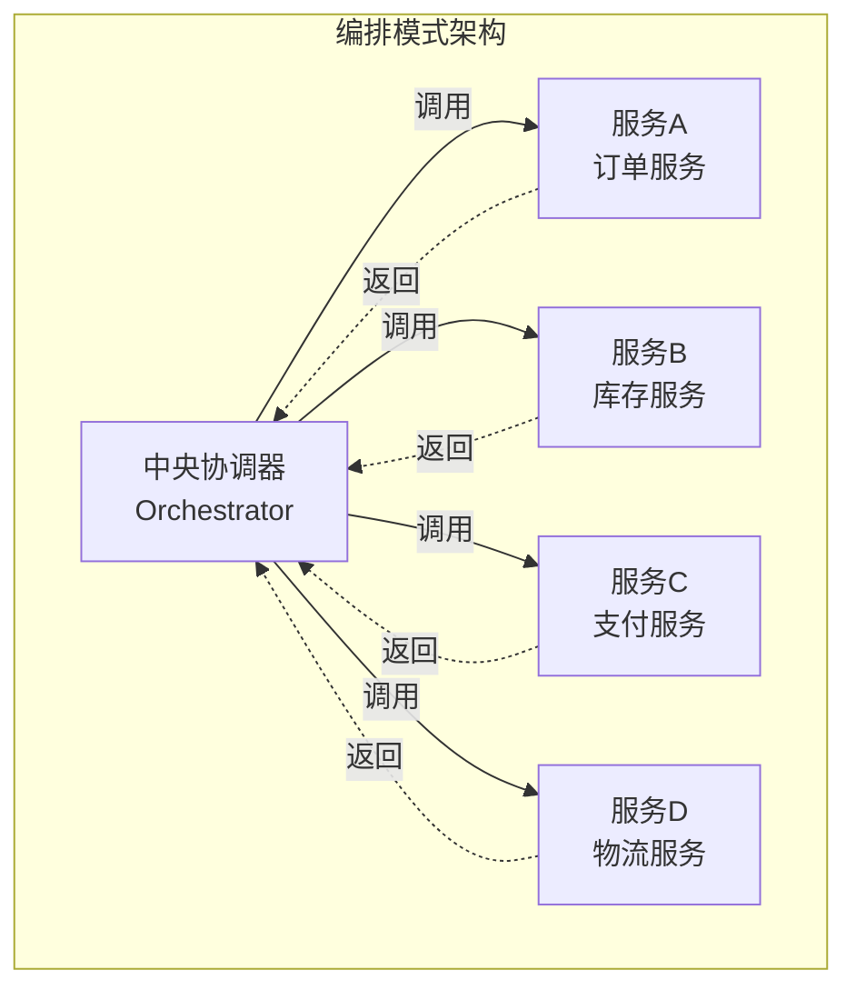
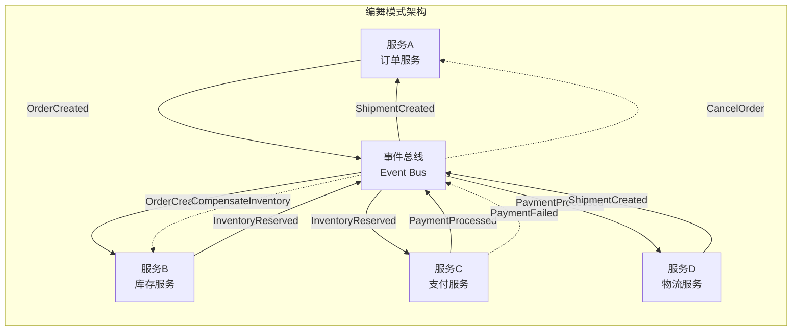
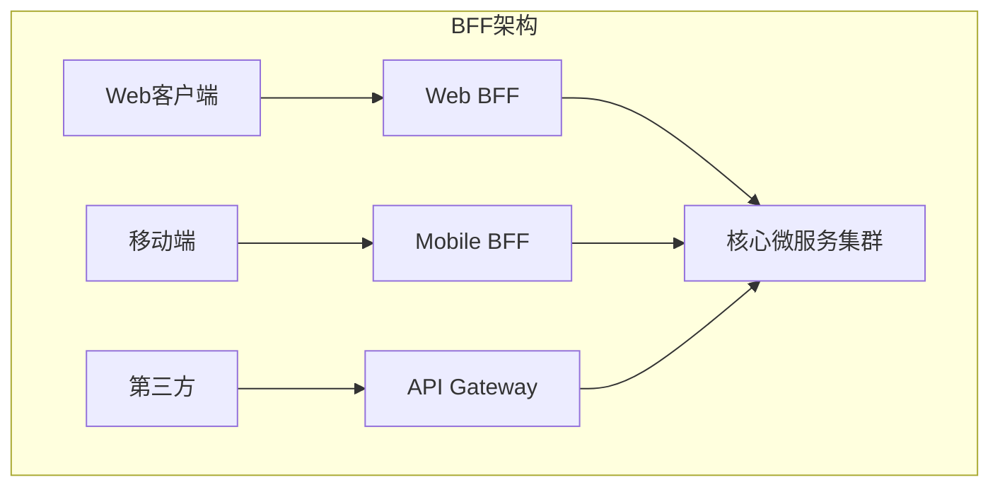
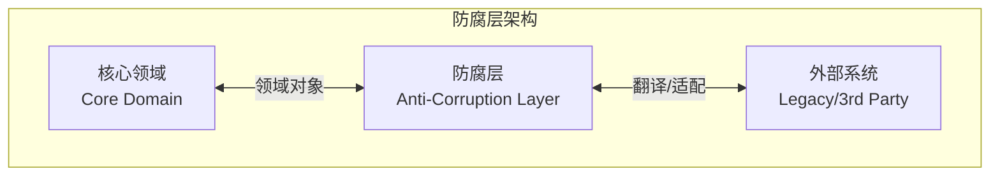

# 微服务编排

## 概述

**微服务编排（Microservices Orchestration）** 是指在分布式微服务架构中，协调和管理多个服务协同工作以完成复杂业务流程的设计模式。它是分布式工作流系统的核心能力，涵盖了服务间通信、事务管理、状态同步等多个方面。

---

## 1. 编排 vs 编舞

### 1.1 编排模式（Orchestration）

**定义**：使用中央协调器（Orchestrator）控制整个业务流程的执行顺序和决策。



**适用场景**：

- 业务流程复杂、步骤多
- 需要严格的执行顺序控制
- 事务回滚和补偿逻辑复杂
- 需要统一监控和追踪

**实现示例（Temporal风格）**：

```go
// OrderOrchestrationWorkflow - 订单编排工作流
func OrderOrchestrationWorkflow(ctx workflow.Context, order OrderRequest) (*OrderResult, error) {
    // 配置Activity选项
    ao := workflow.ActivityOptions{
        StartToCloseTimeout: 30 * time.Second,
        RetryPolicy: &temporal.RetryPolicy{
            InitialInterval:    time.Second,
            BackoffCoefficient: 2.0,
            MaximumAttempts:    3,
        },
    }
    ctx = workflow.WithActivityOptions(ctx, ao)

    // 步骤1: 验证订单
    var validatedOrder ValidatedOrder
    err := workflow.ExecuteActivity(ctx, ValidateOrder, order).Get(ctx, &validatedOrder)
    if err != nil {
        return nil, fmt.Errorf("订单验证失败: %w", err)
    }

    // 步骤2: 检查库存（并行执行）
    inventoryFutures := make([]workflow.Future, 0, len(validatedOrder.Items))
    for _, item := range validatedOrder.Items {
        future := workflow.ExecuteActivity(ctx, CheckInventory, item)
        inventoryFutures = append(inventoryFutures, future)
    }

    // 等待所有库存检查完成
    for i, future := range inventoryFutures {
        var available bool
        if err := future.Get(ctx, &available); err != nil {
            return nil, fmt.Errorf("库存检查失败 [item %d]: %w", i, err)
        }
        if !available {
            return nil, fmt.Errorf("商品缺货: %s", validatedOrder.Items[i].ProductID)
        }
    }

    // 步骤3: 预留库存
    var reservationID string
    err = workflow.ExecuteActivity(ctx, ReserveInventory, validatedOrder).Get(ctx, &reservationID)
    if err != nil {
        return nil, fmt.Errorf("库存预留失败: %w", err)
    }

    // 步骤4: 处理支付
    var paymentResult PaymentResult
    err = workflow.ExecuteActivity(ctx, ProcessPayment, validatedOrder).Get(ctx, &paymentResult)
    if err != nil {
        // 补偿：释放预留库存
        _ = workflow.ExecuteActivity(ctx, ReleaseInventory, reservationID).Get(ctx, nil)
        return nil, fmt.Errorf("支付失败: %w", err)
    }

    // 步骤5: 创建配送订单
    var shipmentID string
    err = workflow.ExecuteActivity(ctx, CreateShipment, validatedOrder, paymentResult).Get(ctx, &shipmentID)
    if err != nil {
        // 补偿：退款并释放库存
        _ = workflow.ExecuteActivity(ctx, RefundPayment, paymentResult.TransactionID).Get(ctx, nil)
        _ = workflow.ExecuteActivity(ctx, ReleaseInventory, reservationID).Get(ctx, nil)
        return nil, fmt.Errorf("创建配送失败: %w", err)
    }

    return &OrderResult{
        OrderID:      validatedOrder.ID,
        Status:       "COMPLETED",
        PaymentID:    paymentResult.TransactionID,
        ShipmentID:   shipmentID,
        CompletedAt:  workflow.Now(ctx),
    }, nil
}
```

**优点**：

- ✅ 流程清晰直观，易于理解和维护
- ✅ 集中式错误处理和补偿逻辑
- ✅ 便于监控、追踪和调试
- ✅ 支持复杂的分支和条件逻辑

**缺点**：

- ❌ 中央协调器成为潜在的单点故障
- ❌ 服务间耦合度增加（对协调器的依赖）
- ❌ 扩展性受限于协调器的处理能力

### 1.2 编舞模式（Choreography）

**定义**：服务之间通过事件驱动的方式自主协调，没有中央协调器。



**适用场景**：

- 服务自治性要求高
- 业务流程相对简单，事件驱动
- 高扩展性需求
- 松耦合的架构设计

**实现示例（事件驱动）**：

```go
// OrderService - 订单服务处理事件
func OrderServiceHandler(event Event) error {
    switch event.Type {
    case "CreateOrderCommand":
        // 创建订单
        order, err := createOrder(event.Data)
        if err != nil {
            return err
        }

        // 发布订单创建事件
        return eventBus.Publish(Event{
            Type: "OrderCreated",
            Data: OrderCreatedEvent{
                OrderID:    order.ID,
                CustomerID: order.CustomerID,
                Items:      order.Items,
                Amount:     order.TotalAmount,
            },
        })

    case "ShipmentCreated":
        // 更新订单状态为已发货
        return updateOrderStatus(event.Data.OrderID, "SHIPPED")

    case "CompensateOrder":
        // 补偿：取消订单
        return cancelOrder(event.Data.OrderID)
    }
    return nil
}

// InventoryService - 库存服务处理事件
func InventoryServiceHandler(event Event) error {
    switch event.Type {
    case "OrderCreated":
        // 检查并预留库存
        reservation, err := reserveInventory(event.Data)
        if err != nil {
            // 发布库存预留失败事件
            return eventBus.Publish(Event{
                Type: "InventoryReservationFailed",
                Data: InventoryErrorEvent{
                    OrderID: event.Data.OrderID,
                    Error:   err.Error(),
                },
            })
        }

        // 发布库存预留成功事件
        return eventBus.Publish(Event{
            Type: "InventoryReserved",
            Data: InventoryReservedEvent{
                OrderID:       event.Data.OrderID,
                ReservationID: reservation.ID,
            },
        })

    case "CompensateInventory":
        // 补偿：释放库存
        return releaseInventory(event.Data.ReservationID)
    }
    return nil
}

// PaymentService - 支付服务处理事件
func PaymentServiceHandler(event Event) error {
    switch event.Type {
    case "InventoryReserved":
        // 处理支付
        result, err := processPayment(event.Data)
        if err != nil {
            // 发布支付失败事件（触发补偿）
            return eventBus.Publish(Event{
                Type: "PaymentFailed",
                Data: PaymentFailedEvent{
                    OrderID:       event.Data.OrderID,
                    ReservationID: event.Data.ReservationID,
                    Error:         err.Error(),
                },
            })
        }

        // 发布支付成功事件
        return eventBus.Publish(Event{
            Type: "PaymentProcessed",
            Data: PaymentProcessedEvent{
                OrderID:       event.Data.OrderID,
                TransactionID: result.TransactionID,
            },
        })
    }
    return nil
}
```

**优点**：

- ✅ 服务间松耦合
- ✅ 无单点故障
- ✅ 易于独立扩展和部署
- ✅ 符合微服务自治理念

**缺点**：

- ❌ 流程分散在多个服务中，难以全局追踪
- ❌ 补偿顺序难以保证
- ❌ 可能出现循环依赖
- ❌ 调试和故障排查困难

### 1.3 编排 vs 编舞对比

| 特性 | Orchestration（编排） | Choreography（编舞） |
|------|----------------------|---------------------|
| **耦合度** | 服务与协调器耦合 | 服务间松耦合 |
| **可理解性** | ⭐⭐⭐⭐⭐ | ⭐⭐⭐ |
| **可测试性** | ⭐⭐⭐⭐ | ⭐⭐ |
| **可扩展性** | ⭐⭐⭐ | ⭐⭐⭐⭐⭐ |
| **故障隔离** | 协调器是热点 | 分布式故障 |
| **监控难度** | 低 | 高 |
| **复杂度** | 集中式复杂 | 分布式复杂 |
| **适用规模** | 中小型（<20个服务） | 大型（>20个服务） |

**选择决策树**：

```
是否需要严格流程控制?
├── 是 → 选择编排模式
└── 否 → 服务数量多?
    ├── 是 (>20) → 选择编舞模式
    └── 否 → 是否需要强事务保证?
        ├── 是 → 选择编排模式
        └── 否 → 选择编舞模式
```

---

## 2. Saga实现模式

### 2.1 Saga模式概述

**Saga模式** 是一种处理分布式长事务的设计模式，通过将事务分解为一系列本地事务，并在失败时执行补偿操作来保证最终一致性。

详见 [Saga模式](../01-工作流设计模型/Saga模式.md) 和 [Saga模式专题文档](../../02-THEORY/workflow/Saga模式专题文档.md)。

### 2.2 编排式Saga

```go
// Saga协调器实现
type SagaOrchestrator struct {
    ctx              workflow.Context
    compensations    []CompensationFunc
}

func NewSagaOrchestrator(ctx workflow.Context) *SagaOrchestrator {
    return &SagaOrchestrator{
        ctx:           ctx,
        compensations: make([]CompensationFunc, 0),
    }
}

func (s *SagaOrchestrator) AddStep(
    action ActivityFunc,
    compensation CompensationFunc,
    args ...interface{},
) error {
    // 执行正向操作
    err := action(s.ctx, args...)
    if err != nil {
        // 执行补偿
        s.compensate()
        return err
    }

    // 记录补偿操作
    if compensation != nil {
        s.compensations = append(s.compensations, compensation)
    }
    return nil
}

func (s *SagaOrchestrator) compensate() {
    // 逆序执行补偿操作
    for i := len(s.compensations) - 1; i >= 0; i-- {
        _ = s.compensations[i](s.ctx)
    }
}

// 使用示例
func OrderSagaWorkflow(ctx workflow.Context, order Order) error {
    saga := NewSagaOrchestrator(ctx)

    // 步骤1: 创建订单
    err := saga.AddStep(
        func(ctx workflow.Context, args ...interface{}) error {
            return workflow.ExecuteActivity(ctx, CreateOrder, args[0]).Get(ctx, nil)
        },
        func(ctx workflow.Context) error {
            return workflow.ExecuteActivity(ctx, CancelOrder, order.ID).Get(ctx, nil)
        },
        order,
    )
    if err != nil {
        return err
    }

    // 步骤2: 预留库存
    err = saga.AddStep(
        func(ctx workflow.Context, args ...interface{}) error {
            return workflow.ExecuteActivity(ctx, ReserveInventory, args[0]).Get(ctx, nil)
        },
        func(ctx workflow.Context) error {
            return workflow.ExecuteActivity(ctx, ReleaseInventory, order.ID).Get(ctx, nil)
        },
        order,
    )
    if err != nil {
        return err
    }

    // 步骤3: 处理支付
    err = saga.AddStep(
        func(ctx workflow.Context, args ...interface{}) error {
            return workflow.ExecuteActivity(ctx, ProcessPayment, args[0]).Get(ctx, nil)
        },
        func(ctx workflow.Context) error {
            return workflow.ExecuteActivity(ctx, RefundPayment, order.ID).Get(ctx, nil)
        },
        order,
    )

    return err
}
```

### 2.3 编舞式Saga

```go
// 事件驱动的Saga实现

// 订单服务
type OrderSagaHandler struct {
    eventBus EventBus
}

func (h *OrderSagaHandler) HandleOrderCreated(ctx context.Context, event OrderCreatedEvent) error {
    // 1. 创建本地订单
    order, err := h.createOrder(ctx, event)
    if err != nil {
        return err
    }

    // 2. 发布订单已创建事件
    return h.eventBus.Publish(ctx, InventoryCheckEvent{
        OrderID: order.ID,
        Items:   order.Items,
    })
}

func (h *OrderSagaHandler) HandlePaymentFailed(ctx context.Context, event PaymentFailedEvent) error {
    // 补偿：取消订单
    return h.cancelOrder(ctx, event.OrderID)
}

// 库存服务
type InventorySagaHandler struct {
    eventBus EventBus
}

func (h *InventorySagaHandler) HandleInventoryCheck(ctx context.Context, event InventoryCheckEvent) error {
    // 1. 预留库存
    reservation, err := h.reserveInventory(ctx, event)
    if err != nil {
        // 发布库存预留失败事件
        return h.eventBus.Publish(ctx, InventoryReservationFailedEvent{
            OrderID: event.OrderID,
            Error:   err.Error(),
        })
    }

    // 2. 发布库存已预留事件
    return h.eventBus.Publish(ctx, InventoryReservedEvent{
        OrderID:       event.OrderID,
        ReservationID: reservation.ID,
    })
}

func (h *InventorySagaHandler) HandleCompensateInventory(ctx context.Context, event CompensationEvent) error {
    // 补偿：释放库存
    return h.releaseInventory(ctx, event.ReservationID)
}
```

---

## 3. API组合模式

### 3.1 模式定义

**API组合模式（API Composition Pattern）** 通过聚合多个微服务的API来提供统一的客户端接口，解决微服务架构中客户端需要多次调用不同服务的问题。

```mermaid
graph TB
    subgraph "API组合模式"
        Client[客户端]
        APIGateway[API网关/组合器]

        S1[订单服务<br/>/orders/{id}]
        S2[用户服务<br/>/users/{id}]
        S3[库存服务<br/>/inventory/{id}]
        S4[支付服务<br/>/payments/{id}]

        Client -->|GET /order-details/{id}| APIGateway
        APIGateway -->|1. 获取订单| S1
        APIGateway -->|2. 获取用户| S2
        APIGateway -->|3. 获取库存| S3
        APIGateway -->|4. 获取支付| S4
        APIGateway -.->|组合响应| Client
    end
```

### 3.2 适用场景

- 客户端需要聚合多个服务的数据
- 减少客户端与服务端的往返次数
- 为前端提供定制化的数据视图
- 实现服务端数据裁剪和转换

### 3.3 实现示例

```go
// API组合器实现

// OrderDetails - 组合后的订单详情
type OrderDetails struct {
    OrderID       string           `json:"order_id"`
    Status        string           `json:"status"`
    Customer      CustomerInfo     `json:"customer"`
    Items         []OrderItemDetail `json:"items"`
    Payment       PaymentInfo      `json:"payment"`
    Shipment      *ShipmentInfo    `json:"shipment,omitempty"`
    CreatedAt     time.Time        `json:"created_at"`
    TotalAmount   float64          `json:"total_amount"`
}

// OrderAggregator - 订单聚合器
type OrderAggregator struct {
    orderClient    OrderServiceClient
    userClient     UserServiceClient
    inventoryClient InventoryServiceClient
    paymentClient  PaymentServiceClient
    shipmentClient ShipmentServiceClient
}

func (a *OrderAggregator) GetOrderDetails(ctx context.Context, orderID string) (*OrderDetails, error) {
    // 并行获取所有相关信息
    var orderResp OrderResponse
    var userResp UserResponse
    var paymentResp PaymentResponse

    errChan := make(chan error, 4)

    // 1. 获取订单信息
    go func() {
        err := a.orderClient.GetOrder(ctx, orderID, &orderResp)
        errChan <- err
    }()

    // 2. 获取用户信息（需要等待订单信息）
    go func() {
        // 先等待订单信息
        for orderResp.CustomerID == "" {
            time.Sleep(10 * time.Millisecond)
        }
        err := a.userClient.GetUser(ctx, orderResp.CustomerID, &userResp)
        errChan <- err
    }()

    // 3. 获取支付信息
    go func() {
        err := a.paymentClient.GetPaymentByOrder(ctx, orderID, &paymentResp)
        errChan <- err
    }()

    // 4. 获取订单项详情（包含库存信息）
    itemDetailsChan := make(chan []OrderItemDetail, 1)
    go func() {
        details, err := a.getItemDetails(ctx, orderResp.Items)
        if err != nil {
            errChan <- err
            return
        }
        itemDetailsChan <- details
        errChan <- nil
    }()

    // 等待所有请求完成
    for i := 0; i < 4; i++ {
        if err := <-errChan; err != nil {
            return nil, err
        }
    }

    // 组合响应
    details := &OrderDetails{
        OrderID:     orderResp.ID,
        Status:      orderResp.Status,
        Customer:    CustomerInfo{ID: userResp.ID, Name: userResp.Name, Email: userResp.Email},
        Items:       <-itemDetailsChan,
        Payment:     PaymentInfo{ID: paymentResp.ID, Status: paymentResp.Status, Amount: paymentResp.Amount},
        CreatedAt:   orderResp.CreatedAt,
        TotalAmount: orderResp.TotalAmount,
    }

    return details, nil
}

// 工作流风格的API组合
func OrderDetailsWorkflow(ctx workflow.Context, orderID string) (*OrderDetails, error) {
    // 配置Activity选项
    ao := workflow.ActivityOptions{
        StartToCloseTimeout: 5 * time.Second,
    }
    ctx = workflow.WithActivityOptions(ctx, ao)

    // 并行获取基础信息
    orderFuture := workflow.ExecuteActivity(ctx, GetOrder, orderID)
    paymentFuture := workflow.ExecuteActivity(ctx, GetPaymentByOrder, orderID)

    var order Order
    var payment Payment

    if err := orderFuture.Get(ctx, &order); err != nil {
        return nil, err
    }
    if err := paymentFuture.Get(ctx, &payment); err != nil {
        return nil, err
    }

    // 获取用户信息
    var user User
    if err := workflow.ExecuteActivity(ctx, GetUser, order.CustomerID).Get(ctx, &user); err != nil {
        return nil, err
    }

    // 并行获取每个商品的库存信息
    inventoryFutures := make([]workflow.Future, len(order.Items))
    for i, item := range order.Items {
        inventoryFutures[i] = workflow.ExecuteActivity(ctx, GetInventory, item.ProductID)
    }

    itemDetails := make([]OrderItemDetail, len(order.Items))
    for i, future := range inventoryFutures {
        var inventory Inventory
        if err := future.Get(ctx, &inventory); err != nil {
            return nil, err
        }
        itemDetails[i] = OrderItemDetail{
            ProductID:   order.Items[i].ProductID,
            ProductName: inventory.Name,
            Quantity:    order.Items[i].Quantity,
            UnitPrice:   order.Items[i].UnitPrice,
            Available:   inventory.Quantity >= order.Items[i].Quantity,
        }
    }

    return &OrderDetails{
        OrderID:     order.ID,
        Status:      order.Status,
        Customer:    CustomerInfo{ID: user.ID, Name: user.Name, Email: user.Email},
        Items:       itemDetails,
        Payment:     PaymentInfo{ID: payment.ID, Status: payment.Status, Amount: payment.Amount},
        CreatedAt:   order.CreatedAt,
        TotalAmount: order.TotalAmount,
    }, nil
}
```

### 3.4 优缺点分析

**优点**：

- ✅ 减少客户端请求次数，提升性能
- ✅ 客户端代码简化，无需了解服务内部结构
- ✅ 支持数据裁剪和转换
- ✅ 便于实现缓存策略

**缺点**：

- ❌ 增加响应延迟（取最慢服务的延迟）
- ❌ 服务间耦合增加
- ❌ 故障传播风险
- ❌ 缓存一致性复杂

---

## 4. BFF工作流

### 4.1 模式定义

**BFF（Backend for Frontend）模式** 为不同的客户端（Web、移动端、第三方）提供定制化的后端API，每个客户端有专门的BFF层处理其特定需求。



### 4.2 适用场景

- 多客户端支持（Web、iOS、Android、小程序等）
- 不同客户端的数据需求差异大
- 需要客户端特定的优化和缓存
- 安全策略因客户端而异

### 4.3 实现示例

```go
// Web BFF - 面向Web客户端的BFF

type WebBFFHandler struct {
    workflowClient client.Client
}

func (h *WebBFFHandler) GetOrderPage(ctx context.Context, userID string, page int) (*OrderPageResponse, error) {
    // 启动工作流获取订单页面数据
    options := client.StartWorkflowOptions{
        ID:        fmt.Sprintf("order-page-%s-%d", userID, page),
        TaskQueue: "web-bff-queue",
    }

    we, err := h.workflowClient.ExecuteWorkflow(ctx, options, OrderPageWorkflow, userID, page)
    if err != nil {
        return nil, err
    }

    var result OrderPageResponse
    if err := we.Get(ctx, &result); err != nil {
        return nil, err
    }

    return &result, nil
}

// OrderPageWorkflow - Web端订单页面工作流
func OrderPageWorkflow(ctx workflow.Context, userID string, page int) (*OrderPageResponse, error) {
    ao := workflow.ActivityOptions{
        StartToCloseTimeout: 3 * time.Second,
    }
    ctx = workflow.WithActivityOptions(ctx, ao)

    // 并行获取用户信息和订单列表
    userFuture := workflow.ExecuteActivity(ctx, GetUserProfile, userID)
    ordersFuture := workflow.ExecuteActivity(ctx, GetUserOrdersPaginated, userID, page, 20)

    var user UserProfile
    var orders []OrderSummary

    if err := userFuture.Get(ctx, &user); err != nil {
        return nil, err
    }
    if err := ordersFuture.Get(ctx, &orders); err != nil {
        return nil, err
    }

    // 为Web端增强订单数据
    enhancedOrders := make([]OrderSummaryWeb, len(orders))
    for i, order := range orders {
        enhancedOrders[i] = OrderSummaryWeb{
            OrderSummary: order,
            CanCancel:    order.Status == "PENDING" && time.Since(order.CreatedAt) < time.Hour,
            CanReturn:    order.Status == "DELIVERED" && time.Since(order.DeliveredAt) < 30*24*time.Hour,
        }
    }

    return &OrderPageResponse{
        User: UserInfoWeb{
            ID:          user.ID,
            Name:        user.Name,
            Avatar:      user.AvatarURL,
            MemberLevel: user.MemberLevel,
        },
        Orders:      enhancedOrders,
        CurrentPage: page,
        HasMore:     len(orders) == 20,
    }, nil
}

// Mobile BFF - 面向移动端的BFF（更轻量）

type MobileBFFHandler struct {
    workflowClient client.Client
}

func (h *MobileBFFHandler) GetOrderList(ctx context.Context, userID string, lastID string) (*MobileOrderList, error) {
    options := client.StartWorkflowOptions{
        ID:        fmt.Sprintf("mobile-order-list-%s-%s", userID, lastID),
        TaskQueue: "mobile-bff-queue",
    }

    we, err := h.workflowClient.ExecuteWorkflow(ctx, options, MobileOrderListWorkflow, userID, lastID)
    if err != nil {
        return nil, err
    }

    var result MobileOrderList
    if err := we.Get(ctx, &result); err != nil {
        return nil, err
    }

    return &result, nil
}

// MobileOrderListWorkflow - 移动端订单列表工作流（数据更精简）
func MobileOrderListWorkflow(ctx workflow.Context, userID string, lastID string) (*MobileOrderList, error) {
    ao := workflow.ActivityOptions{
        StartToCloseTimeout: 2 * time.Second,
    }
    ctx = workflow.WithActivityOptions(ctx, ao)

    // 移动端只需要订单列表，不需要用户详情
    var orders []MobileOrder
    if err := workflow.ExecuteActivity(ctx, GetMobileOrders, userID, lastID, 10).Get(ctx, &orders); err != nil {
        return nil, err
    }

    // 移动端数据精简
    simplifiedOrders := make([]MobileOrderSimplified, len(orders))
    for i, order := range orders {
        simplifiedOrders[i] = MobileOrderSimplified{
            ID:          order.ID,
            Status:      order.Status,
            TotalAmount: order.TotalAmount,
            ItemCount:   len(order.Items),
            FirstItemImage: "", // 只返回第一张商品图
            CreatedAt:   order.CreatedAt.Unix(), // 移动端使用时间戳
        }
        if len(order.Items) > 0 {
            simplifiedOrders[i].FirstItemImage = order.Items[0].ImageURL
        }
    }

    return &MobileOrderList{
        Orders:    simplifiedOrders,
        LastID:    getLastOrderID(orders),
        HasMore:   len(orders) == 10,
    }, nil
}
```

### 4.4 优缺点分析

**优点**：

- ✅ 针对不同客户端优化API
- ✅ 客户端与服务端解耦
- ✅ 支持客户端特定的安全策略
- ✅ 便于独立演进和部署

**缺点**：

- ❌ 代码重复（各BFF间）
- ❌ 增加系统复杂度
- ❌ 需要额外的运维成本
- ❌ 可能导致数据不一致

---

## 5. Anti-Corruption Layer（防腐层）

### 5.1 模式定义

**防腐层（Anti-Corruption Layer, ACL）** 在系统与外部系统（遗留系统、第三方服务）之间建立隔离层，防止外部系统的概念和技术侵入本系统，保持领域模型的纯净。



### 5.2 适用场景

- 集成遗留系统
- 对接第三方服务
- 领域模型需要保护
- 系统迁移和演进

### 5.3 实现示例

```go
// 外部遗留系统的API（老旧的数据结构）
// LegacyOrderAPI 返回的数据结构复杂且不统一

type LegacyOrderAPI struct {
    OrderNum      string                 `json:"order_num"`
    CustCode      string                 `json:"cust_code"`
    OrderDtl      []LegacyOrderDetail    `json:"order_dtl"`
    AmtTotal      string                 `json:"amt_total"`  // 字符串金额
    OrderStatus   int                    `json:"order_status"` // 数字状态码
    CreateDt      string                 `json:"create_dt"`    // 非标准日期格式
    MiscFields    map[string]interface{} `json:"misc_fields"`
}

// 本系统的领域模型（清晰、类型安全）

type Order struct {
    ID          string
    CustomerID  string
    Items       []OrderItem
    TotalAmount decimal.Decimal
    Status      OrderStatus
    CreatedAt   time.Time
}

type OrderStatus string

const (
    OrderStatusPending   OrderStatus = "PENDING"
    OrderStatusConfirmed OrderStatus = "CONFIRMED"
    OrderStatusShipped   OrderStatus = "SHIPPED"
    OrderStatusDelivered OrderStatus = "DELIVERED"
    OrderStatusCancelled OrderStatus = "CANCELLED"
)

// 防腐层实现

type OrderACL struct {
    legacyClient *LegacyAPIClient
    translator   *OrderTranslator
}

// OrderTranslator - 订单翻译器
type OrderTranslator struct {
    statusMap map[int]OrderStatus
}

func NewOrderTranslator() *OrderTranslator {
    return &OrderTranslator{
        statusMap: map[int]OrderStatus{
            0: OrderStatusPending,
            1: OrderStatusConfirmed,
            2: OrderStatusShipped,
            3: OrderStatusDelivered,
            9: OrderStatusCancelled,
        },
    }
}

func (t *OrderTranslator) ToDomain(legacy LegacyOrderAPI) (*Order, error) {
    // 翻译订单项
    items := make([]OrderItem, len(legacy.OrderDtl))
    for i, dtl := range legacy.OrderDtl {
        qty, err := strconv.Atoi(dtl.Qty)
        if err != nil {
            return nil, fmt.Errorf("无效的数量: %s", dtl.Qty)
        }

        price, err := decimal.NewFromString(dtl.UnitPrice)
        if err != nil {
            return nil, fmt.Errorf("无效的单价: %s", dtl.UnitPrice)
        }

        items[i] = OrderItem{
            ProductID: dtl.ProdCode,
            Quantity:  qty,
            UnitPrice: price,
        }
    }

    // 翻译金额（字符串转Decimal）
    totalAmount, err := decimal.NewFromString(legacy.AmtTotal)
    if err != nil {
        return nil, fmt.Errorf("无效的金额: %s", legacy.AmtTotal)
    }

    // 翻译状态
    status, ok := t.statusMap[legacy.OrderStatus]
    if !ok {
        return nil, fmt.Errorf("未知的状态码: %d", legacy.OrderStatus)
    }

    // 翻译日期（非标准格式转标准时间）
    createdAt, err := time.Parse("20060102-150405", legacy.CreateDt)
    if err != nil {
        return nil, fmt.Errorf("无效的日期格式: %s", legacy.CreateDt)
    }

    return &Order{
        ID:          legacy.OrderNum,
        CustomerID:  legacy.CustCode,
        Items:       items,
        TotalAmount: totalAmount,
        Status:      status,
        CreatedAt:   createdAt,
    }, nil
}

func (t *OrderTranslator) ToLegacy(order Order) (*LegacyOrderCreateRequest, error) {
    // 反向翻译：领域模型转遗留系统格式
    legacyItems := make([]LegacyOrderDetailCreate, len(order.Items))
    for i, item := range order.Items {
        legacyItems[i] = LegacyOrderDetailCreate{
            ProdCode:  item.ProductID,
            Qty:       strconv.Itoa(item.Quantity),
            UnitPrice: item.UnitPrice.String(),
        }
    }

    return &LegacyOrderCreateRequest{
        OrderNum:    order.ID,
        CustCode:    order.CustomerID,
        OrderDtl:    legacyItems,
        AmtTotal:    order.TotalAmount.String(),
        OrderStatus: t.reverseStatusMap(order.Status),
        CreateDt:    order.CreatedAt.Format("20060102-150405"),
    }, nil
}

// ACL工作流集成
func LegacyOrderSyncWorkflow(ctx workflow.Context, orderID string) error {
    ao := workflow.ActivityOptions{
        StartToCloseTimeout: 30 * time.Second,
    }
    ctx = workflow.WithActivityOptions(ctx, ao)

    // 1. 从本系统获取订单
    var order Order
    if err := workflow.ExecuteActivity(ctx, GetOrderFromDomain, orderID).Get(ctx, &order); err != nil {
        return err
    }

    // 2. 通过防腐层翻译
    var legacyRequest LegacyOrderCreateRequest
    if err := workflow.ExecuteActivity(ctx, TranslateToLegacy, order).Get(ctx, &legacyRequest); err != nil {
        return err
    }

    // 3. 同步到遗留系统
    var legacyResponse LegacyOrderAPI
    if err := workflow.ExecuteActivity(ctx, SyncToLegacySystem, legacyRequest).Get(ctx, &legacyResponse); err != nil {
        return err
    }

    // 4. 验证同步结果
    var syncedOrder Order
    if err := workflow.ExecuteActivity(ctx, TranslateFromLegacy, legacyResponse).Get(ctx, &syncedOrder); err != nil {
        return err
    }

    // 5. 记录同步日志
    return workflow.ExecuteActivity(ctx, RecordSyncLog, orderID, syncedOrder.Status).Get(ctx, nil)
}
```

### 5.4 优缺点分析

**优点**：

- ✅ 保护领域模型不受外部系统污染
- ✅ 便于系统演进和替换外部系统
- ✅ 统一处理外部系统的异常情况
- ✅ 支持测试替身（Mock/Stub）

**缺点**：

- ❌ 增加开发成本（翻译逻辑）
- ❌ 可能引入性能开销
- ❌ 需要维护双向翻译逻辑
- ❌ 增加了系统复杂度

---

## 6. 企业实践案例

### 6.1 Netflix - 内容编排工作流

**场景**：视频内容从上传、转码、质量检查到分发的完整流程

**架构**：

- **编排模式**：使用Temporal编排复杂的媒体处理流程
- **API组合**：内容详情API聚合多个微服务数据
- **防腐层**：对接不同云服务商的转码API

**关键指标**：

- 日处理1,000+视频
- 99.9%任务成功率
- 平均处理时间减少50%

### 6.2 Uber - 数据中心部署编排

**场景**：自动化数据中心部署流程

**架构**：

- **编排模式**：使用Temporal编排多步骤部署
- **Saga模式**：失败时自动回滚
- **BFF模式**：为运维团队和管理团队提供不同的API视图

**关键指标**：

- 72小时零失败部署
- 部署速度提升10倍
- 节省70%运维成本

### 6.3 Stripe - 支付处理编排

**场景**：支持多种支付方式的统一处理

**架构**：

- **编排模式**：中央协调器管理支付流程
- **编舞模式**：部分场景使用事件驱动
- **防腐层**：对接不同支付网关

**关键指标**：

- 支持100+种支付方式
- 99.99%可用性
- 日处理百万级交易

### 6.4 Airbnb - 房源管理

**场景**：全球房源数据的同步和一致性

**架构**：

- **编舞模式**：服务间通过事件协调
- **API组合**：房源详情API聚合多维度数据
- **BFF模式**：Web端和移动端不同的API

**关键指标**：

- 支持数百万房源
- 全球数据同步延迟<1秒
- 99.99%数据一致性

---

## 7. 相关文档链接

### 7.1 项目内部文档

#### 工作流设计模型

- [Saga模式](../01-工作流设计模型/Saga模式.md) - Saga模式的详细说明
- [工作流模式](../01-工作流设计模型/工作流模式.md) - 工作流设计模式
- [Durable Execution](../01-工作流设计模型/Durable-Execution.md) - 持久化执行语义
- [状态机模型](../01-工作流设计模型/状态机模型.md) - 状态机视图

#### 理论模型专题文档

- [Saga模式专题文档](../../02-THEORY/workflow/Saga模式专题文档.md) - Saga模式的形式化理论
- [工作流模式专题文档](../../02-THEORY/workflow/工作流模式专题文档.md) - 工作流模式理论
- [CAP定理专题文档](../../02-THEORY/distributed-systems/CAP定理专题文档.md) - 分布式系统权衡
- [一致性模型专题文档](../../02-THEORY/distributed-systems/一致性模型专题文档.md) - 一致性模型

#### 实践指南

- [最佳实践指南](../../05-GUIDES/最佳实践指南.md) - 工作流最佳实践
- [企业实践案例](../../04-PRACTICE/企业实践案例.md) - 企业应用案例

#### 技术选型

- [Temporal选型论证](../../03-TECHNOLOGY/论证/Temporal选型论证.md) - Temporal技术选型

### 7.2 外部资源

- [Microservices.io - API Gateway Pattern](https://microservices.io/patterns/apigateway.html)
- [Microsoft Docs - Choreography vs Orchestration](https://docs.microsoft.com/en-us/azure/architecture/reference-architectures/saga/saga)
- [AWS Blog - Saga Pattern](https://aws.amazon.com/blogs/compute/building-a-serverless-distributed-application-using-a-saga-orchestration-pattern/)
- [DDD Reference - Anti-Corruption Layer](https://dddcommunity.org/wp-content/uploads/files/pdf_articles/Vernon_2011_1.pdf)

---

**文档版本**: 1.0
**创建时间**: 2025年1月
**最后更新**: 2025年1月
**状态**: ✅ **已完成**
