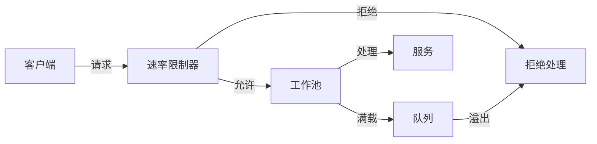

# 性能优化

## 概述

**性能优化（Performance Optimization）** 是指通过调整系统配置、改进算法、优化资源使用等手段，提升系统的吞吐量、降低延迟、提高资源利用率的过程。在分布式工作流系统中，性能优化是确保系统能够处理大规模并发请求的关键。

---

## 1. 批处理优化

### 1.1 批处理原理

**批处理（Batch Processing）** 将多个小操作合并为一个大操作执行，减少网络往返和系统调用开销。

$$\text{Speedup} = \frac{N \times (T_{setup} + T_{process})}{T_{setup} + N \times T_{process}}$$

其中：
- $N$ = 批处理大小
- $T_{setup}$ = 单次操作固定开销
- $T_{process}$ = 单条记录处理时间

### 1.2 适用场景

- 数据库批量插入/更新
- 消息批量发送
- 外部API批量调用
- 日志批量写入

### 1.3 实现示例

```go
// 批处理 Activity
func BatchProcessItemsActivity(ctx context.Context, items []Item) ([]Result, error) {
    logger := activity.GetLogger(ctx)
    batchSize := 100
    results := make([]Result, 0, len(items))
    
    for i := 0; i < len(items); i += batchSize {
        end := i + batchSize
        if end > len(items) {
            end = len(items)
        }
        
        batch := items[i:end]
        
        // 批量处理
        batchResults, err := processBatch(ctx, batch)
        if err != nil {
            logger.Error("批处理失败",
                zap.Int("batch_start", i),
                zap.Int("batch_end", end),
                zap.Error(err),
            )
            return nil, err
        }
        
        results = append(results, batchResults...)
        
        // 发送心跳报告进度
        progress := float64(end) / float64(len(items)) * 100
        activity.RecordHeartbeat(ctx, fmt.Sprintf("Progress: %.1f%%", progress))
    }
    
    return results, nil
}

func processBatch(ctx context.Context, items []Item) ([]Result, error) {
    // 数据库批量插入
    valueStrings := make([]string, 0, len(items))
    valueArgs := make([]interface{}, 0, len(items)*3)
    
    for i, item := range items {
        valueStrings = append(valueStrings, fmt.Sprintf("($%d, $%d, $%d)", i*3+1, i*3+2, i*3+3))
        valueArgs = append(valueArgs, item.ID, item.Name, item.Value)
    }
    
    stmt := fmt.Sprintf(
        "INSERT INTO items (id, name, value) VALUES %s",
        strings.Join(valueStrings, ","),
    )
    
    _, err := db.ExecContext(ctx, stmt, valueArgs...)
    if err != nil {
        return nil, err
    }
    
    return buildResults(items), nil
}

// 工作流中的批处理
func BatchProcessingWorkflow(ctx workflow.Context, requests []Request) ([]Response, error) {
    ao := workflow.ActivityOptions{
        StartToCloseTimeout: 5 * time.Minute,
        HeartbeatTimeout:    30 * time.Second,
    }
    ctx = workflow.WithActivityOptions(ctx, ao)
    
    batchSize := 500
    responses := make([]Response, 0, len(requests))
    
    for i := 0; i < len(requests); i += batchSize {
        end := i + batchSize
        if end > len(requests) {
            end = len(requests)
        }
        
        batch := requests[i:end]
        
        var batchResponses []Response
        err := workflow.ExecuteActivity(ctx, BatchProcessItemsActivity, batch).Get(ctx, &batchResponses)
        if err != nil {
            return nil, fmt.Errorf("批处理失败 [batch %d-%d]: %w", i, end, err)
        }
        
        responses = append(responses, batchResponses...)
    }
    
    return responses, nil
}
```

### 1.4 最优批处理大小

$$B_{optimal} = \sqrt{\frac{2 \times C_{setup}}{C_{processing} \times (1 - p)}}$$

其中：
- $C_{setup}$ = 批次设置成本
- $C_{processing}$ = 单条处理成本
- $p$ = 并行度

```go
// 自适应批处理大小
func CalculateOptimalBatchSize(
    setupCost time.Duration,
    processCost time.Duration,
    targetLatency time.Duration,
) int {
    // 基础计算
    baseSize := int(math.Sqrt(
        float64(2*setupCost) / float64(processCost),
    ))
    
    // 根据目标延迟调整
    estimatedLatency := setupCost + time.Duration(baseSize)*processCost
    if estimatedLatency > targetLatency {
        // 降低批次大小以满足延迟要求
        baseSize = int(float64(baseSize) * float64(targetLatency) / float64(estimatedLatency))
    }
    
    // 限制范围
    if baseSize < 10 {
        baseSize = 10
    }
    if baseSize > 1000 {
        baseSize = 1000
    }
    
    return baseSize
}
```

### 1.5 优缺点分析

**优点**：
- ✅ 显著减少网络开销
- ✅ 提高吞吐量
- ✅ 减少系统调用次数

**缺点**：
- ❌ 增加延迟（等待批次填满）
- ❌ 内存占用增加
- ❌ 错误影响范围大

---

## 2. 缓存策略

### 2.1 缓存模式

| 模式 | 描述 | 适用场景 |
|------|------|---------|
| **Cache-Aside** | 应用负责读写缓存 | 读多写少 |
| **Read-Through** | 缓存未命中时自动加载 | 配置数据 |
| **Write-Through** | 写操作时同步更新缓存 | 一致性要求高 |
| **Write-Behind** | 异步更新缓存 | 写性能优先 |

### 2.2 实现示例

```go
// Cache-Aside 模式实现
type CacheAsideService struct {
    cache       Cache
    db          *sql.DB
    ttl         time.Duration
    lockTimeout time.Duration
}

func (s *CacheAsideService) Get(ctx context.Context, key string) (*Data, error) {
    // 1. 尝试从缓存获取
    if data, err := s.cache.Get(ctx, key); err == nil {
        cacheHits.Inc()
        return data, nil
    }
    
    cacheMisses.Inc()
    
    // 2. 缓存未命中，获取锁防止缓存击穿
    lockKey := "lock:" + key
    if !s.cache.TryLock(ctx, lockKey, s.lockTimeout) {
        // 获取锁失败，直接查询数据库
        return s.fetchFromDB(ctx, key)
    }
    defer s.cache.Unlock(ctx, lockKey)
    
    // 3. 双重检查
    if data, err := s.cache.Get(ctx, key); err == nil {
        return data, nil
    }
    
    // 4. 从数据库加载
    data, err := s.fetchFromDB(ctx, key)
    if err != nil {
        return nil, err
    }
    
    // 5. 写入缓存
    s.cache.Set(ctx, key, data, s.ttl)
    
    return data, nil
}

func (s *CacheAsideService) Set(ctx context.Context, key string, data *Data) error {
    // 1. 更新数据库
    if err := s.updateDB(ctx, key, data); err != nil {
        return err
    }
    
    // 2. 删除缓存（而非更新，避免并发问题）
    s.cache.Delete(ctx, key)
    
    return nil
}

// 工作流缓存装饰器
func CachedActivity(
    activity interface{},
    cache Cache,
    keyFunc func(interface{}) string,
    ttl time.Duration,
) interface{} {
    return func(ctx context.Context, args interface{}) (interface{}, error) {
        // 生成缓存键
        cacheKey := keyFunc(args)
        
        // 尝试从缓存获取
        if cached, err := cache.Get(ctx, cacheKey); err == nil {
            return cached, nil
        }
        
        // 执行 Activity
        result, err := executeActivity(activity, ctx, args)
        if err != nil {
            return nil, err
        }
        
        // 缓存结果
        cache.Set(ctx, cacheKey, result, ttl)
        
        return result, nil
    }
}

// 使用示例
func OrderWorkflowWithCache(ctx workflow.Context, orderID string) (*Order, error) {
    // 获取用户信息（带缓存）
    var user User
    err := workflow.ExecuteActivity(ctx, CachedGetUser, CachedGetUserRequest{
        UserID:   order.CustomerID,
        UseCache: true,
    }).Get(ctx, &user)
    if err != nil {
        return nil, err
    }
    
    // 获取商品信息（带缓存）
    var products []Product
    err = workflow.ExecuteActivity(ctx, CachedGetProducts, CachedGetProductsRequest{
        ProductIDs: extractProductIDs(order.Items),
        UseCache:   true,
    }).Get(ctx, &products)
    if err != nil {
        return nil, err
    }
    
    return &Order{}, nil
}
```

### 2.3 缓存失效策略

```go
// 缓存失效策略
type CacheInvalidationStrategy int

const (
    // 过期失效
    ExpirationInvalidation CacheInvalidationStrategy = iota
    // 主动失效
    ActiveInvalidation
    // 事件驱动失效
    EventDrivenInvalidation
)

// 事件驱动缓存失效
func CacheInvalidationWorkflow(ctx workflow.Context) error {
    // 监听缓存失效事件
    cacheInvalidationCh := workflow.GetSignalChannel(ctx, "cache-invalidation")
    
    for {
        selector := workflow.NewSelector(ctx)
        
        selector.AddReceive(cacheInvalidationCh, func(c workflow.ReceiveChannel, more bool) {
            var event CacheInvalidationEvent
            c.Receive(ctx, &event)
            
            // 执行缓存失效
            workflow.ExecuteActivity(ctx, InvalidateCache, event.Keys).Get(ctx, nil)
        })
        
        selector.Select(ctx)
    }
}
```

### 2.4 优缺点分析

**优点**：
- ✅ 显著降低延迟
- ✅ 减少数据库压力
- ✅ 提高吞吐量

**缺点**：
- ❌ 数据一致性问题
- ❌ 缓存穿透、击穿、雪崩风险
- ❌ 增加系统复杂度

---

## 3. 并行执行

### 3.1 并行模式

| 模式 | 描述 | 适用场景 |
|------|------|---------|
| **Fan-Out/Fan-In** | 并行执行多个任务后聚合结果 | 独立子任务 |
| **Pipeline** | 流水线处理 | 数据处理链 |
| **MapReduce** | 分片处理再聚合 | 大数据处理 |

### 3.2 实现示例

```go
// Fan-Out/Fan-In 并行执行
func ParallelOrderProcessingWorkflow(ctx workflow.Context, orders []Order) ([]Result, error) {
    ao := workflow.ActivityOptions{
        StartToCloseTimeout: 30 * time.Second,
    }
    ctx = workflow.WithActivityOptions(ctx, ao)
    
    // 限制并行度
    semaphore := make(chan struct{}, 10) // 最多10个并发
    
    futures := make([]workflow.Future, len(orders))
    for i, order := range orders {
        semaphore <- struct{}{} // 获取信号量
        
        future := workflow.ExecuteActivity(ctx, ProcessOrder, order)
        futures[i] = future
        
        // 释放信号量（在回调中）
        future.Get(ctx, nil)
        <-semaphore
    }
    
    // 收集结果
    results := make([]Result, len(orders))
    for i, future := range futures {
        if err := future.Get(ctx, &results[i]); err != nil {
            results[i] = Result{Error: err}
        }
    }
    
    return results, nil
}

// 使用 Future 的并行执行（推荐）
func OptimizedParallelWorkflow(ctx workflow.Context, orders []Order) ([]Result, error) {
    ao := workflow.ActivityOptions{
        StartToCloseTimeout: 30 * time.Second,
    }
    ctx = workflow.WithActivityOptions(ctx, ao)
    
    // 限制并行度
    const maxParallel = 10
    
    results := make([]Result, len(orders))
    
    // 分批并行执行
    for i := 0; i < len(orders); i += maxParallel {
        end := i + maxParallel
        if end > len(orders) {
            end = len(orders)
        }
        
        batch := orders[i:end]
        futures := make([]workflow.Future, len(batch))
        
        // Fan-Out: 并行启动
        for j, order := range batch {
            futures[j] = workflow.ExecuteActivity(ctx, ProcessOrder, order)
        }
        
        // Fan-In: 等待完成
        for j, future := range futures {
            if err := future.Get(ctx, &results[i+j]); err != nil {
                results[i+j] = Result{Error: err}
            }
        }
    }
    
    return results, nil
}

// Pipeline 流水线处理
func PipelineWorkflow(ctx workflow.Context, input Input) (Output, error) {
    // 阶段1: 提取
    var extractedData ExtractedData
    if err := workflow.ExecuteActivity(ctx, ExtractActivity, input).Get(ctx, &extractedData); err != nil {
        return Output{}, err
    }
    
    // 阶段2: 转换（并行）
    transformFutures := make([]workflow.Future, len(extractedData.Items))
    for i, item := range extractedData.Items {
        transformFutures[i] = workflow.ExecuteActivity(ctx, TransformActivity, item)
    }
    
    transformedItems := make([]TransformedItem, len(extractedData.Items))
    for i, future := range transformFutures {
        if err := future.Get(ctx, &transformedItems[i]); err != nil {
            return Output{}, err
        }
    }
    
    // 阶段3: 加载
    var output Output
    if err := workflow.ExecuteActivity(ctx, LoadActivity, transformedItems).Get(ctx, &output); err != nil {
        return Output{}, err
    }
    
    return output, nil
}
```

### 3.3 并行度计算

$$P_{optimal} = \min(N_{independent}, N_{workers}, N_{resources}, \frac{T_{sequential}}{T_{parallel}})$$

```go
// 自适应并行度
func CalculateOptimalParallelism(
    totalTasks int,
    avgTaskDuration time.Duration,
    targetLatency time.Duration,
    maxWorkers int,
) int {
    if totalTasks == 0 {
        return 1
    }
    
    // 基于目标延迟计算
    tasksPerWorker := int(targetLatency / avgTaskDuration)
    if tasksPerWorker < 1 {
        tasksPerWorker = 1
    }
    
    neededWorkers := (totalTasks + tasksPerWorker - 1) / tasksPerWorker
    
    // 限制范围
    if neededWorkers > maxWorkers {
        neededWorkers = maxWorkers
    }
    if neededWorkers < 1 {
        neededWorkers = 1
    }
    
    return neededWorkers
}
```

### 3.4 优缺点分析

**优点**：
- ✅ 充分利用资源
- ✅ 缩短总执行时间
- ✅ 提高吞吐量

**缺点**：
- ❌ 增加系统复杂度
- ❌ 可能加剧资源竞争
- ❌ 错误处理复杂

---

## 4. 异步IO

### 4.1 异步模式

| 模式 | 描述 | 适用场景 |
|------|------|---------|
| **回调（Callback）** | 操作完成后调用回调函数 | 简单异步操作 |
| **Future/Promise** | 返回未来结果句柄 | 需要结果的场景 |
| **Async/Await** | 语法糖简化异步编程 | 现代编程语言 |

### 4.2 实现示例

```go
// 异步 Activity 执行
func AsyncWorkflow(ctx workflow.Context, request Request) error {
    ao := workflow.ActivityOptions{
        StartToCloseTimeout: 10 * time.Minute,
    }
    ctx = workflow.WithActivityOptions(ctx, ao)
    
    // 启动异步 Activity，不等待完成
    future := workflow.ExecuteActivity(ctx, LongRunningActivity, request)
    
    // 继续执行其他操作
    if err := workflow.ExecuteActivity(ctx, OtherActivity, request).Get(ctx, nil); err != nil {
        return err
    }
    
    // 在需要时等待异步结果
    var result Result
    if err := future.Get(ctx, &result); err != nil {
        return err
    }
    
    // 使用结果
    return workflow.ExecuteActivity(ctx, ProcessResult, result).Get(ctx, nil)
}

// 选择器模式（非阻塞等待）
func SelectorAsyncWorkflow(ctx workflow.Context, request Request) error {
    ao := workflow.ActivityOptions{
        StartToCloseTimeout: 5 * time.Minute,
    }
    ctx = workflow.WithActivityOptions(ctx, ao)
    
    selector := workflow.NewSelector(ctx)
    
    // 多个异步操作
    future1 := workflow.ExecuteActivity(ctx, AsyncOperation1, request)
    future2 := workflow.ExecuteActivity(ctx, AsyncOperation2, request)
    timeoutFuture := workflow.NewTimer(ctx, 2*time.Minute)
    
    var result1, result2 Result
    completed := 0
    
    selector.AddFuture(future1, func(f workflow.Future) {
        f.Get(ctx, &result1)
        completed++
    })
    
    selector.AddFuture(future2, func(f workflow.Future) {
        f.Get(ctx, &result2)
        completed++
    })
    
    selector.AddFuture(timeoutFuture, func(f workflow.Future) {
        // 超时处理
    })
    
    // 等待任一完成
    for completed < 2 {
        selector.Select(ctx)
    }
    
    return nil
}
```

### 4.3 优缺点分析

**优点**：
- ✅ 提高资源利用率
- ✅ 减少等待时间
- ✅ 提高吞吐量

**缺点**：
- ❌ 增加代码复杂度
- ❌ 状态管理复杂
- ❌ 调试困难

---

## 5. 连接池管理

### 5.1 连接池原理

连接池维护一组可重用的连接，避免频繁创建和销毁连接的开销。

```
连接池参数：
- MinConnections: 最小连接数
- MaxConnections: 最大连接数
- IdleTimeout: 空闲超时时间
- MaxLifetime: 连接最大生命周期
```

### 5.2 实现示例

```go
// 数据库连接池配置
func ConfigureDBPool() (*sql.DB, error) {
    db, err := sql.Open("postgres", connString)
    if err != nil {
        return nil, err
    }
    
    // 连接池配置
    db.SetMaxOpenConns(100)           // 最大打开连接数
    db.SetMaxIdleConns(25)            // 最大空闲连接数
    db.SetConnMaxLifetime(time.Hour)  // 连接最大生命周期
    db.SetConnMaxIdleTime(10 * time.Minute) // 空闲连接超时
    
    // 验证连接
    if err := db.Ping(); err != nil {
        return nil, err
    }
    
    return db, nil
}

// HTTP 连接池配置
func ConfigureHTTPClient() *http.Client {
    return &http.Client{
        Timeout: 30 * time.Second,
        Transport: &http.Transport{
            MaxIdleConns:        100,
            MaxIdleConnsPerHost: 10,
            MaxConnsPerHost:     100,
            IdleConnTimeout:     90 * time.Second,
            TLSHandshakeTimeout: 10 * time.Second,
            // 连接池配置
            DialContext: (&net.Dialer{
                Timeout:   30 * time.Second,
                KeepAlive: 30 * time.Second,
            }).DialContext,
        },
    }
}

// Temporal Worker 连接池
func ConfigureTemporalWorker(client client.Client) worker.Worker {
    return worker.New(client, "task-queue", worker.Options{
        MaxConcurrentActivityExecutionSize:     1000,
        MaxConcurrentWorkflowTaskExecutionSize: 500,
        MaxConcurrentLocalActivityExecutionSize: 200,
        WorkerActivitiesPerSecond:               1000,
        TaskQueueActivitiesPerSecond:            10000,
    })
}

// 连接池监控
type ConnectionPoolMetrics struct {
    OpenConnections   prometheus.Gauge
    InUseConnections  prometheus.Gauge
    IdleConnections   prometheus.Gauge
    WaitDuration      prometheus.Histogram
    WaitCount         prometheus.Counter
}

func (m *ConnectionPoolMetrics) Record(stats sql.DBStats) {
    m.OpenConnections.Set(float64(stats.OpenConnections))
    m.InUseConnections.Set(float64(stats.InUse))
    m.IdleConnections.Set(float64(stats.Idle))
    m.WaitCount.Add(float64(stats.WaitCount))
}
```

### 5.3 连接池优化策略

| 场景 | 最小连接 | 最大连接 | 空闲超时 |
|------|---------|---------|---------|
| 低并发 | 5 | 20 | 10分钟 |
| 中等并发 | 10 | 50 | 10分钟 |
| 高并发 | 25 | 100 | 5分钟 |
| 极高并发 | 50 | 200 | 5分钟 |

### 5.4 优缺点分析

**优点**：
- ✅ 减少连接创建开销
- ✅ 限制并发连接数
- ✅ 提高响应速度

**缺点**：
- ❌ 配置不当可能导致资源浪费或不足
- ❌ 连接泄漏风险
- ❌ 需要监控和维护

---

## 6. 资源限制和背压

### 6.1 背压原理

**背压（Backpressure）** 当系统负载过高时，通过拒绝或延迟处理请求来保护系统，防止过载崩溃。



### 6.2 实现示例

```go
// 令牌桶速率限制器
type TokenBucketRateLimiter struct {
    rate       float64    // 每秒令牌生成速率
    capacity   int        // 桶容量
    tokens     float64    // 当前令牌数
    lastUpdate time.Time  // 上次更新时间
    mutex      sync.Mutex
}

func (rl *TokenBucketRateLimiter) Allow() bool {
    rl.mutex.Lock()
    defer rl.mutex.Unlock()
    
    now := time.Now()
    elapsed := now.Sub(rl.lastUpdate).Seconds()
    rl.lastUpdate = now
    
    // 添加新令牌
    rl.tokens += elapsed * rl.rate
    if rl.tokens > float64(rl.capacity) {
        rl.tokens = float64(rl.capacity)
    }
    
    // 消费令牌
    if rl.tokens >= 1 {
        rl.tokens--
        return true
    }
    
    return false
}

// 工作流速率限制
func RateLimitedWorkflow(ctx workflow.Context, requests []Request) error {
    const rateLimit = 100 // 每秒100个请求
    
    for i, request := range requests {
        // 检查速率限制
        if i > 0 && i%rateLimit == 0 {
            // 等待下一秒
            workflow.Sleep(ctx, time.Second)
        }
        
        if err := workflow.ExecuteActivity(ctx, ProcessRequest, request).Get(ctx, nil); err != nil {
            return err
        }
    }
    
    return nil
}

// 队列长度限制
func QueueBoundedWorkflow(ctx workflow.Context, request Request) error {
    // 检查队列深度
    var queueDepth int
    if err := workflow.ExecuteActivity(ctx, GetQueueDepth, "task-queue").Get(ctx, &queueDepth); err != nil {
        return err
    }
    
    const maxQueueDepth = 10000
    
    if queueDepth > maxQueueDepth {
        // 队列满载，延迟处理或拒绝
        return workflow.ExecuteActivity(ctx, QueueRequestForLater, request).Get(ctx, nil)
    }
    
    // 正常处理
    return workflow.ExecuteActivity(ctx, ProcessRequest, request).Get(ctx, nil)
}

// 动态背压调整
func AdaptiveBackpressure(ctx context.Context) {
    for {
        select {
        case <-ctx.Done():
            return
        case <-time.After(10 * time.Second):
            // 收集系统指标
            metrics := collectMetrics()
            
            // 根据指标调整限流
            if metrics.CPUUsage > 80 || metrics.MemoryUsage > 85 {
                // 降低限流阈值
                decreaseRateLimit()
            } else if metrics.CPUUsage < 50 && metrics.MemoryUsage < 60 {
                // 提高限流阈值
                increaseRateLimit()
            }
        }
    }
}
```

### 6.3 优缺点分析

**优点**：
- ✅ 保护系统免受过载
- ✅ 保证服务质量
- ✅ 防止级联故障

**缺点**：
- ❌ 可能拒绝合法请求
- ❌ 配置复杂
- ❌ 用户体验受影响

---

## 7. 性能优化矩阵

| 优化策略 | 适用场景 | 预期提升 | 实施难度 | 风险 |
|---------|---------|---------|---------|------|
| **批处理** | 大量小操作 | 5-50x | 低 | 延迟增加 |
| **缓存** | 读多写少 | 10-1000x | 中 | 一致性风险 |
| **并行** | 独立任务 | 2-Nx | 中 | 资源竞争 |
| **异步IO** | IO密集型 | 2-5x | 高 | 复杂度增加 |
| **连接池** | 频繁连接创建 | 2-10x | 低 | 连接泄漏 |
| **背压** | 高负载保护 | 稳定性 | 中 | 请求拒绝 |

---

## 8. 性能测试与调优

### 8.1 性能测试方法

```go
// 负载测试
func LoadTest(ctx context.Context, concurrency int, duration time.Duration) {
    var wg sync.WaitGroup
    
    for i := 0; i < concurrency; i++ {
        wg.Add(1)
        go func() {
            defer wg.Done()
            
            deadline := time.Now().Add(duration)
            for time.Now().Before(deadline) {
                start := time.Now()
                err := executeRequest(ctx)
                latency := time.Since(start)
                
                recordMetrics(latency, err)
            }
        }()
    }
    
    wg.Wait()
}

// 压力测试
func StressTest(ctx context.Context) {
    concurrency := 10
    
    for {
        LoadTest(ctx, concurrency, 1*time.Minute)
        
        // 分析结果
        metrics := getMetrics()
        
        if metrics.ErrorRate > 0.01 || metrics.P99Latency > 1*time.Second {
            // 找到极限
            log.Printf("极限并发度: %d", concurrency)
            break
        }
        
        // 增加负载
        concurrency += 10
    }
}
```

### 8.2 性能调优检查清单

- [ ] 识别性能瓶颈（CPU/内存/IO/网络）
- [ ] 优化数据库查询和索引
- [ ] 实施适当的缓存策略
- [ ] 配置合理的连接池大小
- [ ] 启用批处理减少网络往返
- [ ] 并行化独立任务
- [ ] 实施背压防止过载
- [ ] 监控关键指标并设置告警
- [ ] 进行压力测试验证优化效果

---

## 9. 企业实践案例

### 9.1 Netflix - 内容编码优化

**优化策略**：
- **批处理**：批量处理视频分片
- **并行**：并行编码多个分辨率
- **缓存**：编码结果缓存

**效果**：
- 编码速度提升：5x
- 成本降低：40%

### 9.2 Uber - 订单处理优化

**优化策略**：
- **连接池**：数据库连接池优化
- **异步**：异步事件处理
- **背压**：动态限流

**效果**：
- P99延迟降低：60%
- 系统稳定性：99.99%

---

## 10. 相关文档链接

### 10.1 项目内部文档

- [最佳实践指南](../../05-GUIDES/最佳实践指南.md) - 性能优化最佳实践
- [性能深度分析报告](../../06-ANALYSIS/性能深度分析报告.md) - 性能分析
- [企业实践案例](../../04-PRACTICE/企业实践案例.md) - 企业优化案例
- [Temporal选型论证](../../03-TECHNOLOGY/论证/Temporal选型论证.md) - 性能基准测试

### 10.2 外部资源

- [High Performance Browser Networking](https://hpbn.co/)
- [Systems Performance](http://www.brendangregg.com/sysperfbook.html)
- [Designing Data-Intensive Applications](https://dataintensive.net/)

---

**文档版本**: 1.0  
**创建时间**: 2025年1月  
**最后更新**: 2025年1月  
**状态**: ✅ **已完成**
