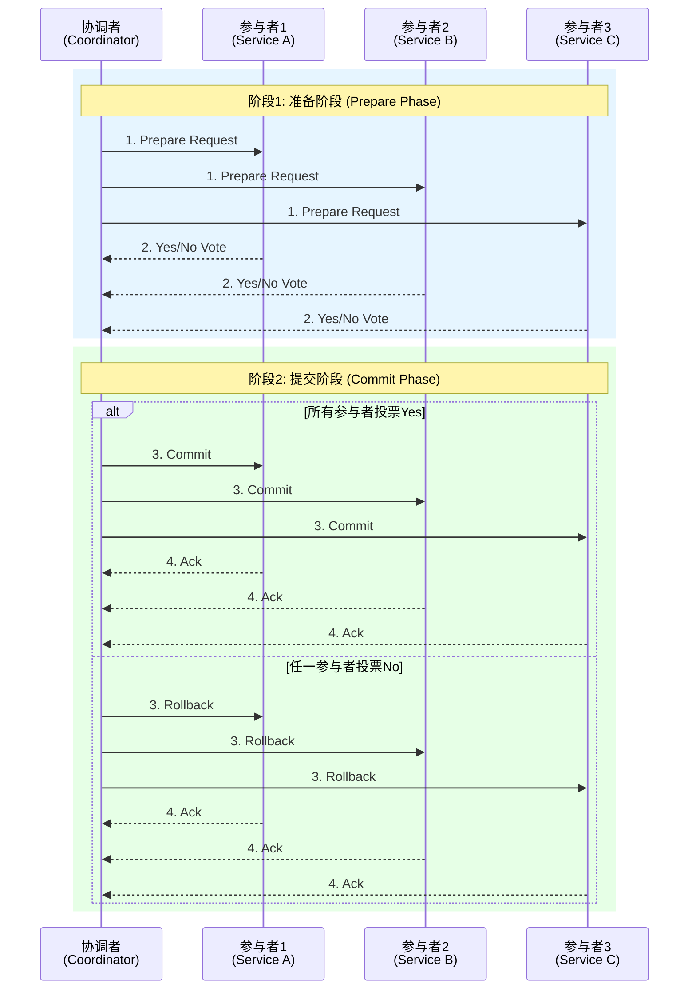
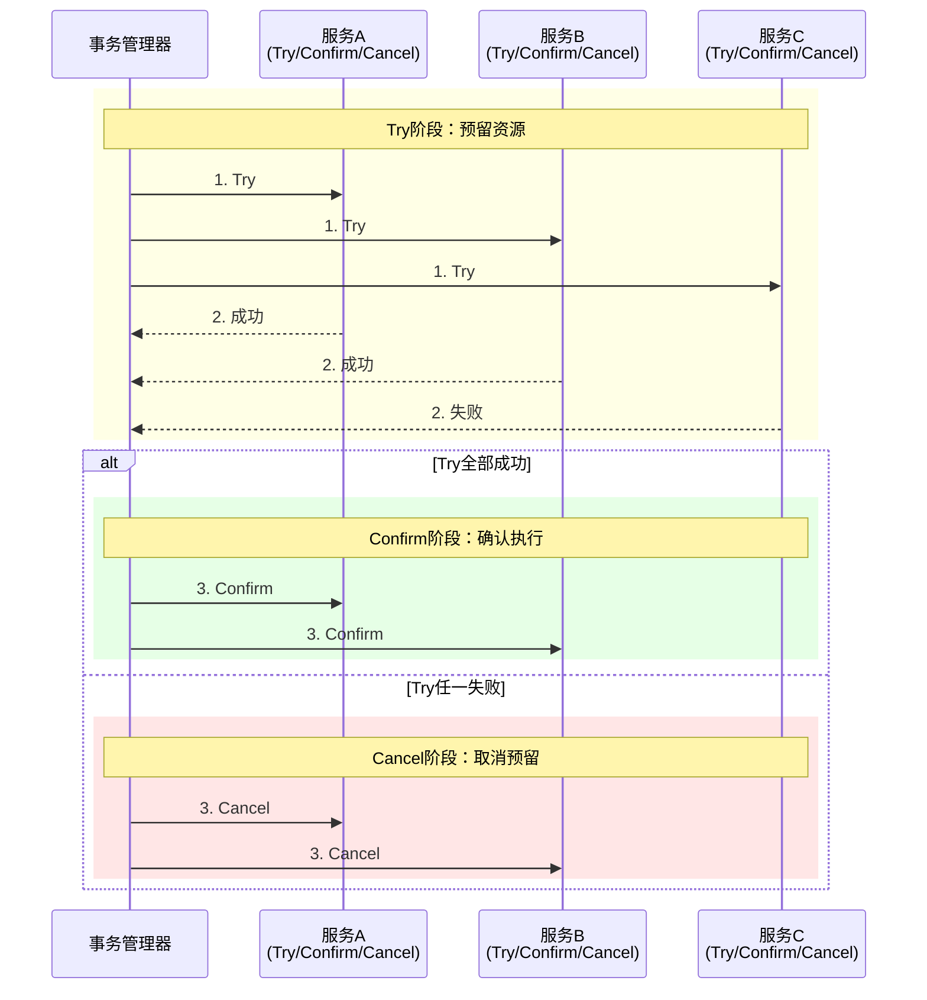
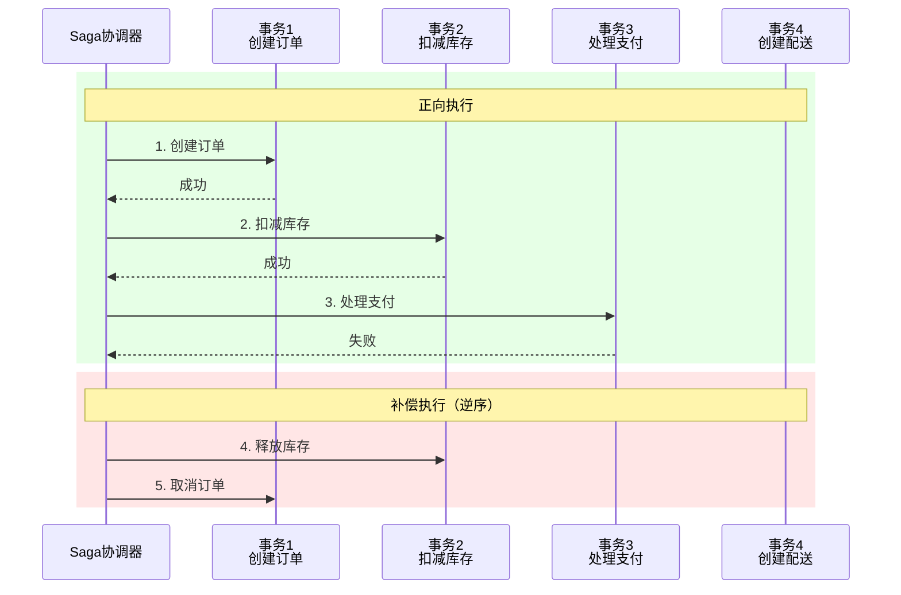
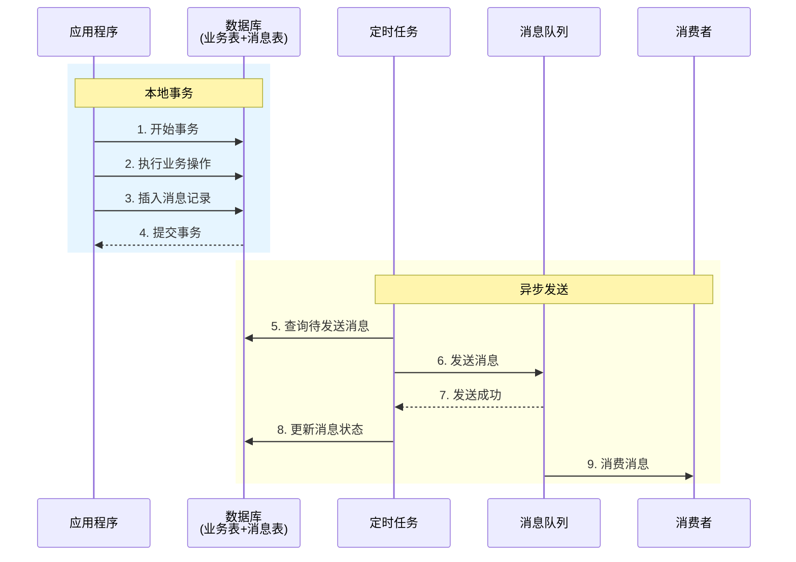
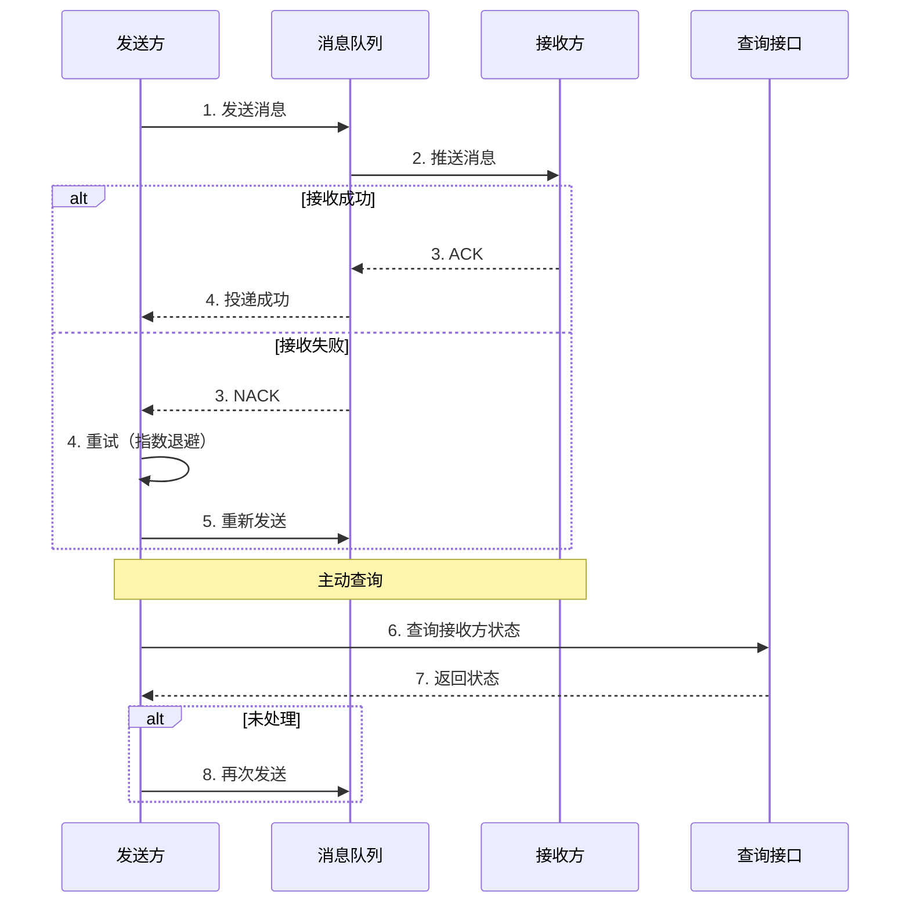
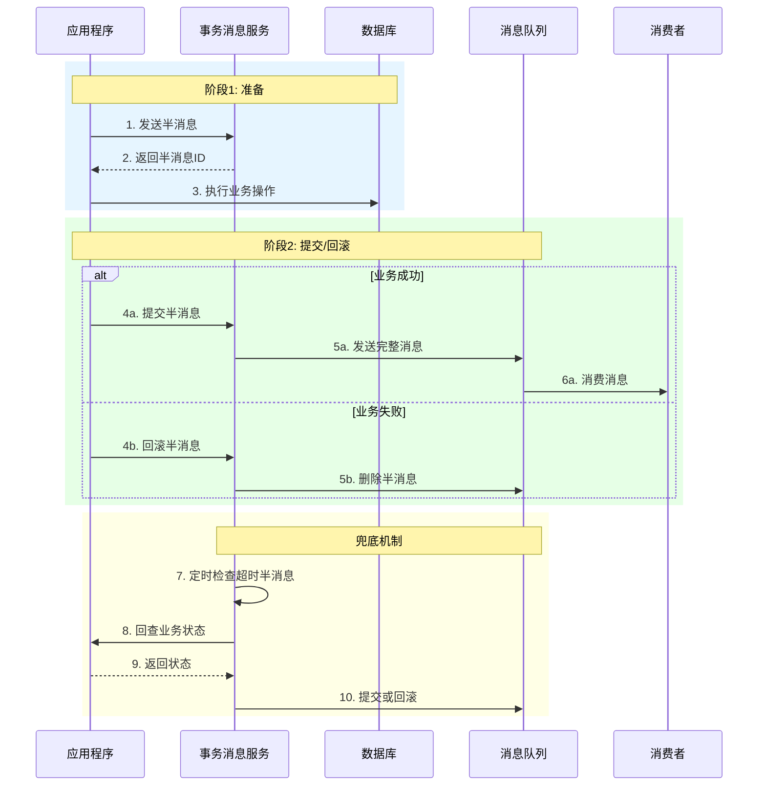

# 长事务模式

## 概述

**长事务（Long-Running Transaction）** 是指在分布式系统中执行时间较长、涉及多个服务或资源的事务。
由于网络延迟、服务调用等因素，这类事务可能持续数秒、数分钟甚至数小时。
传统的ACID事务模型难以应对长事务的挑战，因此需要专门的设计模式来处理。

本文档介绍六种主要的分布式事务处理模式：2PC两阶段提交、TCC Try-Confirm-Cancel、Saga补偿事务、本地消息表、最大努力通知和事务消息。

---

## 1. 2PC两阶段提交

### 1.1 模式定义

**两阶段提交（Two-Phase Commit, 2PC）** 是一种经典的分布式事务协议，通过准备阶段和提交阶段来保证分布式事务的原子性。



### 1.2 适用场景

- 需要强一致性的场景
- 短事务（执行时间<10秒）
- 参与节点数量有限（<10个）
- 网络环境相对稳定

### 1.3 实现示例

```go
// 2PC协调者实现
type TwoPhaseCoordinator struct {
    participants []Participant
    timeout      time.Duration
}

type Participant interface {
    Prepare(ctx context.Context, txID string) error
    Commit(ctx context.Context, txID string) error
    Rollback(ctx context.Context, txID string) error
}

func (c *TwoPhaseCoordinator) Execute(ctx context.Context, txID string) error {
    // 阶段1: 准备阶段
    votes := make(chan error, len(c.participants))

    for _, p := range c.participants {
        go func(participant Participant) {
            // 设置准备超时
            prepareCtx, cancel := context.WithTimeout(ctx, c.timeout)
            defer cancel()

            err := participant.Prepare(prepareCtx, txID)
            votes <- err
        }(p)
    }

    // 收集投票结果
    allPrepared := true
    for i := 0; i < len(c.participants); i++ {
        if err := <-votes; err != nil {
            allPrepared = false
            break
        }
    }

    // 阶段2: 提交或回滚
    if allPrepared {
        // 提交事务
        for _, p := range c.participants {
            if err := p.Commit(ctx, txID); err != nil {
                // 记录需要恢复的提交
                c.recordPendingCommit(txID, p)
            }
        }
        return nil
    } else {
        // 回滚事务
        for _, p := range c.participants {
            if err := p.Rollback(ctx, txID); err != nil {
                // 记录需要恢复的回滚
                c.recordPendingRollback(txID, p)
            }
        }
        return fmt.Errorf("事务准备阶段失败，已回滚")
    }
}

// 2PC参与者实现（以订单服务为例）
type OrderServiceParticipant struct {
    db *sql.DB
}

func (p *OrderServiceParticipant) Prepare(ctx context.Context, txID string) error {
    tx, err := p.db.BeginTx(ctx, nil)
    if err != nil {
        return err
    }
    defer tx.Rollback()

    // 1. 执行业务操作（但不提交）
    _, err = tx.ExecContext(ctx,
        "INSERT INTO orders (id, status, created_at) VALUES ($1, 'PREPARED', NOW())",
        txID,
    )
    if err != nil {
        return fmt.Errorf("准备订单失败: %w", err)
    }

    // 2. 记录事务日志
    _, err = tx.ExecContext(ctx,
        "INSERT INTO transaction_log (tx_id, status, prepared_at) VALUES ($1, 'PREPARED', NOW())",
        txID,
    )
    if err != nil {
        return fmt.Errorf("记录事务日志失败: %w", err)
    }

    // 3. 预留资源（如锁定库存）
    _, err = tx.ExecContext(ctx,
        "UPDATE inventory SET reserved = reserved + 1 WHERE product_id = $1",
        txID,
    )
    if err != nil {
        return fmt.Errorf("预留库存失败: %w", err)
    }

    // 不提交，保持准备状态
    return tx.Commit()
}

func (p *OrderServiceParticipant) Commit(ctx context.Context, txID string) error {
    tx, err := p.db.BeginTx(ctx, nil)
    if err != nil {
        return err
    }
    defer tx.Rollback()

    // 1. 确认事务状态
    var status string
    err = tx.QueryRowContext(ctx,
        "SELECT status FROM transaction_log WHERE tx_id = $1",
        txID,
    ).Scan(&status)
    if err != nil {
        return fmt.Errorf("查询事务状态失败: %w", err)
    }

    if status != "PREPARED" {
        return fmt.Errorf("事务状态异常: %s", status)
    }

    // 2. 更新订单状态
    _, err = tx.ExecContext(ctx,
        "UPDATE orders SET status = 'COMMITTED' WHERE id = $1",
        txID,
    )
    if err != nil {
        return fmt.Errorf("更新订单状态失败: %w", err)
    }

    // 3. 确认库存扣减
    _, err = tx.ExecContext(ctx,
        "UPDATE inventory SET reserved = reserved - 1, sold = sold + 1 WHERE product_id = $1",
        txID,
    )
    if err != nil {
        return fmt.Errorf("确认库存失败: %w", err)
    }

    // 4. 更新事务日志
    _, err = tx.ExecContext(ctx,
        "UPDATE transaction_log SET status = 'COMMITTED', committed_at = NOW() WHERE tx_id = $1",
        txID,
    )
    if err != nil {
        return fmt.Errorf("更新事务日志失败: %w", err)
    }

    return tx.Commit()
}

func (p *OrderServiceParticipant) Rollback(ctx context.Context, txID string) error {
    tx, err := p.db.BeginTx(ctx, nil)
    if err != nil {
        return err
    }
    defer tx.Rollback()

    // 1. 释放预留资源
    _, err = tx.ExecContext(ctx,
        "UPDATE inventory SET reserved = reserved - 1 WHERE product_id = $1",
        txID,
    )
    if err != nil {
        // 记录回滚失败，需要人工介入
        return fmt.Errorf("释放库存失败: %w", err)
    }

    // 2. 删除或标记订单为已取消
    _, err = tx.ExecContext(ctx,
        "UPDATE orders SET status = 'CANCELLED' WHERE id = $1",
        txID,
    )
    if err != nil {
        return fmt.Errorf("取消订单失败: %w", err)
    }

    // 3. 更新事务日志
    _, err = tx.ExecContext(ctx,
        "UPDATE transaction_log SET status = 'ROLLED_BACK', rolled_back_at = NOW() WHERE tx_id = $1",
        txID,
    )
    if err != nil {
        return fmt.Errorf("更新事务日志失败: %w", err)
    }

    return tx.Commit()
}
```

### 1.4 优缺点分析

**优点**：

- ✅ 强一致性保证
- ✅ 协议成熟，理论完备
- ✅ 支持任意数量的参与者

**缺点**：

- ❌ 同步阻塞，性能较差
- ❌ 协调者是单点故障
- ❌ 准备阶段锁定资源时间长
- ❌ 不适合长事务场景

---

## 2. TCC（Try-Confirm-Cancel）

### 2.1 模式定义

**TCC（Try-Confirm-Cancel）** 是一种业务层面的分布式事务模式，将每个操作拆分为三个阶段：尝试（Try）、确认（Confirm）和取消（Cancel）。



### 2.2 适用场景

- 金融支付场景
- 库存扣减场景
- 需要最终一致性
- 业务可拆分为预留和确认两个阶段

### 2.3 实现示例

```go
// TCC事务管理器
type TCCTransactionManager struct {
    ctx         context.Context
    participants []TCCParticipant
    confirmOrder []int  // 确认顺序
    cancelOrder  []int  // 取消顺序
}

type TCCParticipant interface {
    Try(ctx context.Context, request interface{}) (TryResult, error)
    Confirm(ctx context.Context, tryResult TryResult) error
    Cancel(ctx context.Context, tryResult TryResult) error
}

type TryResult struct {
    ParticipantID string
    ReservedData  interface{}
}

func (tm *TCCTransactionManager) Execute(requests []interface{}) error {
    tryResults := make([]TryResult, len(tm.participants))

    // Phase 1: Try
    for i, p := range tm.participants {
        result, err := p.Try(tm.ctx, requests[i])
        if err != nil {
            // Try失败，执行Cancel
            tm.cancelAll(tryResults[:i])
            return fmt.Errorf("Try阶段失败 [participant %d]: %w", i, err)
        }
        tryResults[i] = result
    }

    // Phase 2: Confirm
    for _, idx := range tm.confirmOrder {
        if err := tm.participants[idx].Confirm(tm.ctx, tryResults[idx]); err != nil {
            // Confirm失败，记录并告警（需要人工处理）
            tm.recordConfirmFailure(tryResults[idx])
        }
    }

    return nil
}

func (tm *TCCTransactionManager) cancelAll(results []TryResult) {
    for i := len(results) - 1; i >= 0; i-- {
        idx := tm.cancelOrder[i]
        if err := tm.participants[idx].Cancel(tm.ctx, results[idx]); err != nil {
            // Cancel失败，记录并告警
            tm.recordCancelFailure(results[idx])
        }
    }
}

// 库存服务TCC实现
type InventoryTCCService struct {
    db *sql.DB
}

func (s *InventoryTCCService) Try(ctx context.Context, request interface{}) (TryResult, error) {
    req := request.(InventoryRequest)

    tx, err := s.db.BeginTx(ctx, nil)
    if err != nil {
        return TryResult{}, err
    }
    defer tx.Rollback()

    // 1. 检查库存
    var available int
    err = tx.QueryRowContext(ctx,
        "SELECT quantity - reserved FROM inventory WHERE product_id = $1 FOR UPDATE",
        req.ProductID,
    ).Scan(&available)
    if err != nil {
        return TryResult{}, fmt.Errorf("查询库存失败: %w", err)
    }

    if available < req.Quantity {
        return TryResult{}, fmt.Errorf("库存不足，可用: %d, 需要: %d", available, req.Quantity)
    }

    // 2. 预留库存
    reservationID := generateReservationID()
    _, err = tx.ExecContext(ctx,
        `INSERT INTO inventory_reservation
         (id, product_id, quantity, status, created_at, expires_at)
         VALUES ($1, $2, $3, 'PENDING', NOW(), NOW() + INTERVAL '5 minutes')`,
        reservationID, req.ProductID, req.Quantity,
    )
    if err != nil {
        return TryResult{}, fmt.Errorf("预留库存失败: %w", err)
    }

    _, err = tx.ExecContext(ctx,
        "UPDATE inventory SET reserved = reserved + $1 WHERE product_id = $2",
        req.Quantity, req.ProductID,
    )
    if err != nil {
        return TryResult{}, fmt.Errorf("更新预留库存失败: %w", err)
    }

    if err := tx.Commit(); err != nil {
        return TryResult{}, err
    }

    return TryResult{
        ParticipantID: "inventory",
        ReservedData: InventoryReservation{
            ReservationID: reservationID,
            ProductID:     req.ProductID,
            Quantity:      req.Quantity,
        },
    }, nil
}

func (s *InventoryTCCService) Confirm(ctx context.Context, tryResult TryResult) error {
    reservation := tryResult.ReservedData.(InventoryReservation)

    tx, err := s.db.BeginTx(ctx, nil)
    if err != nil {
        return err
    }
    defer tx.Rollback()

    // 1. 确认预留
    _, err = tx.ExecContext(ctx,
        "UPDATE inventory_reservation SET status = 'CONFIRMED' WHERE id = $1",
        reservation.ReservationID,
    )
    if err != nil {
        return fmt.Errorf("确认预留失败: %w", err)
    }

    // 2. 扣减库存
    _, err = tx.ExecContext(ctx,
        `UPDATE inventory
         SET reserved = reserved - $1, sold = sold + $1
         WHERE product_id = $2`,
        reservation.Quantity, reservation.ProductID,
    )
    if err != nil {
        return fmt.Errorf("扣减库存失败: %w", err)
    }

    return tx.Commit()
}

func (s *InventoryTCCService) Cancel(ctx context.Context, tryResult TryResult) error {
    reservation := tryResult.ReservedData.(InventoryReservation)

    tx, err := s.db.BeginTx(ctx, nil)
    if err != nil {
        return err
    }
    defer tx.Rollback()

    // 1. 检查预留状态
    var status string
    err = tx.QueryRowContext(ctx,
        "SELECT status FROM inventory_reservation WHERE id = $1",
        reservation.ReservationID,
    ).Scan(&status)
    if err != nil {
        return fmt.Errorf("查询预留状态失败: %w", err)
    }

    if status == "CANCELLED" {
        return nil // 已取消，幂等返回
    }

    if status == "CONFIRMED" {
        return fmt.Errorf("预留已确认，无法取消")
    }

    // 2. 释放预留
    _, err = tx.ExecContext(ctx,
        "UPDATE inventory_reservation SET status = 'CANCELLED' WHERE id = $1",
        reservation.ReservationID,
    )
    if err != nil {
        return fmt.Errorf("标记预留取消失败: %w", err)
    }

    // 3. 恢复库存
    _, err = tx.ExecContext(ctx,
        "UPDATE inventory SET reserved = reserved - $1 WHERE product_id = $2",
        reservation.Quantity, reservation.ProductID,
    )
    if err != nil {
        return fmt.Errorf("恢复库存失败: %w", err)
    }

    return tx.Commit()
}

// TCC工作流集成
func OrderTCCWorkflow(ctx workflow.Context, order OrderRequest) error {
    // 配置Activity选项
    ao := workflow.ActivityOptions{
        StartToCloseTimeout: 30 * time.Second,
        RetryPolicy: &temporal.RetryPolicy{
            InitialInterval:    time.Second,
            BackoffCoefficient: 2.0,
            MaximumAttempts:    3,
        },
    }
    ctx = workflow.WithActivityOptions(ctx, ao)

    // Try结果存储
    var inventoryTryResult TryResult
    var paymentTryResult TryResult

    // Phase 1: Try - 预留库存
    err := workflow.ExecuteActivity(ctx, InventoryTry, InventoryRequest{
        ProductID: order.ProductID,
        Quantity:  order.Quantity,
    }).Get(ctx, &inventoryTryResult)
    if err != nil {
        return fmt.Errorf("库存预留失败: %w", err)
    }

    // Phase 1: Try - 预留支付
    err = workflow.ExecuteActivity(ctx, PaymentTry, PaymentRequest{
        OrderID: order.ID,
        Amount:  order.Amount,
    }).Get(ctx, &paymentTryResult)
    if err != nil {
        // 补偿：取消库存预留
        _ = workflow.ExecuteActivity(ctx, InventoryCancel, inventoryTryResult).Get(ctx, nil)
        return fmt.Errorf("支付预留失败: %w", err)
    }

    // Phase 2: Confirm - 确认支付（先确认支付）
    err = workflow.ExecuteActivity(ctx, PaymentConfirm, paymentTryResult).Get(ctx, nil)
    if err != nil {
        // 支付确认失败，需要人工介入
        workflow.ExecuteActivity(ctx, AlertManualIntervention, "支付确认失败", order.ID).Get(ctx, nil)
        return fmt.Errorf("支付确认失败: %w", err)
    }

    // Phase 2: Confirm - 确认库存
    err = workflow.ExecuteActivity(ctx, InventoryConfirm, inventoryTryResult).Get(ctx, nil)
    if err != nil {
        // 库存确认失败，需要人工介入
        workflow.ExecuteActivity(ctx, AlertManualIntervention, "库存确认失败", order.ID).Get(ctx, nil)
        return fmt.Errorf("库存确认失败: %w", err)
    }

    return nil
}
```

### 2.4 优缺点分析

**优点**：

- ✅ 无全局锁，并发性能好
- ✅ 业务层面控制，灵活性强
- ✅ 支持幂等设计
- ✅ 适合互联网高并发场景

**缺点**：

- ❌ 业务侵入性强，需要拆分为三个阶段
- ❌ Confirm失败处理复杂
- ❌ 开发成本高
- ❌ 预留资源可能超时

---

## 3. Saga补偿事务

### 3.1 模式定义

**Saga模式** 将长事务拆分为一系列本地事务，每个本地事务执行后立即提交。如果某个本地事务失败，则执行一系列补偿操作来回滚已完成的事务。

详见 [Saga模式](../01-工作流设计模型/Saga模式.md)。



### 3.2 适用场景

- 长事务场景（执行时间>10秒）
- 跨多个服务的业务流程
- 可接受最终一致性
- 补偿逻辑可实现

### 3.3 实现示例

```go
// Saga工作流实现
func OrderSagaWorkflow(ctx workflow.Context, order OrderRequest) (*OrderResult, error) {
    ao := workflow.ActivityOptions{
        StartToCloseTimeout: 30 * time.Second,
        RetryPolicy: &temporal.RetryPolicy{
            InitialInterval:    time.Second,
            BackoffCoefficient: 2.0,
            MaximumAttempts:    3,
        },
    }
    ctx = workflow.WithActivityOptions(ctx, ao)

    // 补偿操作栈
    var compensations []func() error

    // 辅助函数：注册补偿
    registerCompensation := func(comp func() error) {
        compensations = append(compensations, comp)
    }

    // 辅助函数：执行补偿
    executeCompensations := func() {
        for i := len(compensations) - 1; i >= 0; i-- {
            _ = compensations[i]()
        }
    }

    // Step 1: 创建订单
    var orderID string
    err := workflow.ExecuteActivity(ctx, CreateOrder, order).Get(ctx, &orderID)
    if err != nil {
        return nil, fmt.Errorf("创建订单失败: %w", err)
    }

    registerCompensation(func() error {
        return workflow.ExecuteActivity(ctx, CancelOrder, orderID).Get(ctx, nil)
    })

    // Step 2: 扣减库存
    err = workflow.ExecuteActivity(ctx, DeductInventory, order.Items).Get(ctx, nil)
    if err != nil {
        executeCompensations()
        return nil, fmt.Errorf("扣减库存失败: %w", err)
    }

    registerCompensation(func() error {
        return workflow.ExecuteActivity(ctx, RestoreInventory, order.Items).Get(ctx, nil)
    })

    // Step 3: 处理支付
    var paymentID string
    err = workflow.ExecuteActivity(ctx, ProcessPayment, order).Get(ctx, &paymentID)
    if err != nil {
        executeCompensations()
        return nil, fmt.Errorf("支付失败: %w", err)
    }

    registerCompensation(func() error {
        return workflow.ExecuteActivity(ctx, RefundPayment, paymentID).Get(ctx, nil)
    })

    // Step 4: 创建配送
    var shipmentID string
    err = workflow.ExecuteActivity(ctx, CreateShipment, order, orderID).Get(ctx, &shipmentID)
    if err != nil {
        executeCompensations()
        return nil, fmt.Errorf("创建配送失败: %w", err)
    }

    return &OrderResult{
        OrderID:    orderID,
        PaymentID:  paymentID,
        ShipmentID: shipmentID,
        Status:     "COMPLETED",
    }, nil
}

// 幂等的补偿操作实现
func CancelOrderActivity(ctx context.Context, orderID string) error {
    // 检查订单状态，避免重复取消
    var status string
    err := db.QueryRowContext(ctx, "SELECT status FROM orders WHERE id = $1", orderID).Scan(&status)
    if err == sql.ErrNoRows {
        return nil // 订单不存在，视为已取消
    }
    if err != nil {
        return err
    }

    if status == "CANCELLED" {
        return nil // 已取消，幂等返回
    }

    // 检查补偿日志，避免重复执行
    var compensated bool
    err = db.QueryRowContext(ctx,
        "SELECT EXISTS(SELECT 1 FROM compensation_log WHERE action = 'cancel_order' AND order_id = $1)",
        orderID,
    ).Scan(&compensated)
    if err != nil {
        return err
    }

    if compensated {
        return nil // 已记录补偿，跳过
    }

    tx, err := db.BeginTx(ctx, nil)
    if err != nil {
        return err
    }
    defer tx.Rollback()

    // 记录补偿日志
    _, err = tx.ExecContext(ctx,
        "INSERT INTO compensation_log (action, order_id, executed_at) VALUES ('cancel_order', $1, NOW())",
        orderID,
    )
    if err != nil {
        return fmt.Errorf("记录补偿日志失败: %w", err)
    }

    // 取消订单
    _, err = tx.ExecContext(ctx,
        "UPDATE orders SET status = 'CANCELLED', cancelled_at = NOW() WHERE id = $1",
        orderID,
    )
    if err != nil {
        return fmt.Errorf("取消订单失败: %w", err)
    }

    return tx.Commit()
}
```

### 3.4 优缺点分析

**优点**：

- ✅ 无全局锁，性能优秀
- ✅ 适合长事务场景
- ✅ 本地事务立即提交，资源锁定时间短
- ✅ 支持复杂的业务流程

**缺点**：

- ❌ 最终一致性，存在中间状态
- ❌ 补偿逻辑需要业务实现
- ❌ 补偿顺序难以保证（编舞式）
- ❌ 部分操作无法补偿

---

## 4. 本地消息表

### 4.1 模式定义

**本地消息表** 将分布式事务拆分为本地事务和消息发送两个阶段。业务操作和消息记录在同一个本地事务中提交，然后通过定时任务或消息服务异步发送消息。



### 4.2 适用场景

- 对最终一致性要求较高的场景
- 消息可靠性要求高
- 不想依赖外部事务协调器
- 系统已有消息队列基础设施

### 4.3 实现示例

```go
// 本地消息表实现

type OutboxMessage struct {
    ID          string    `db:"id"`
    Topic       string    `db:"topic"`
    Key         string    `db:"key"`
    Payload     []byte    `db:"payload"`
    Headers     string    `db:"headers"`
    Status      string    `db:"status"` // PENDING, SENT, FAILED
    RetryCount  int       `db:"retry_count"`
    CreatedAt   time.Time `db:"created_at"`
    SentAt      *time.Time `db:"sent_at"`
}

// 订单服务（使用本地消息表）
type OrderService struct {
    db         *sql.DB
    outboxRepo *OutboxRepository
}

func (s *OrderService) CreateOrder(ctx context.Context, req CreateOrderRequest) (*Order, error) {
    tx, err := s.db.BeginTx(ctx, nil)
    if err != nil {
        return nil, err
    }
    defer tx.Rollback()

    // 1. 创建订单
    order := &Order{
        ID:         generateOrderID(),
        CustomerID: req.CustomerID,
        Items:      req.Items,
        TotalAmount: calculateTotal(req.Items),
        Status:     "CREATED",
        CreatedAt:  time.Now(),
    }

    _, err = tx.ExecContext(ctx,
        `INSERT INTO orders (id, customer_id, total_amount, status, created_at)
         VALUES ($1, $2, $3, $4, $5)`,
        order.ID, order.CustomerID, order.TotalAmount, order.Status, order.CreatedAt,
    )
    if err != nil {
        return nil, fmt.Errorf("创建订单失败: %w", err)
    }

    // 2. 插入订单项
    for _, item := range order.Items {
        _, err = tx.ExecContext(ctx,
            `INSERT INTO order_items (order_id, product_id, quantity, unit_price)
             VALUES ($1, $2, $3, $4)`,
            order.ID, item.ProductID, item.Quantity, item.UnitPrice,
        )
        if err != nil {
            return nil, fmt.Errorf("插入订单项失败: %w", err)
        }
    }

    // 3. 扣减库存（本地操作）
    for _, item := range order.Items {
        _, err = tx.ExecContext(ctx,
            "UPDATE inventory SET quantity = quantity - $1 WHERE product_id = $2",
            item.Quantity, item.ProductID,
        )
        if err != nil {
            return nil, fmt.Errorf("扣减库存失败: %w", err)
        }
    }

    // 4. 记录消息到Outbox（与业务操作在同一事务）
    event := OrderCreatedEvent{
        OrderID:     order.ID,
        CustomerID:  order.CustomerID,
        TotalAmount: order.TotalAmount,
        Items:       order.Items,
        CreatedAt:   order.CreatedAt,
    }

    payload, err := json.Marshal(event)
    if err != nil {
        return nil, fmt.Errorf("序列化事件失败: %w", err)
    }

    messageID := generateMessageID()
    _, err = tx.ExecContext(ctx,
        `INSERT INTO outbox_messages
         (id, topic, key, payload, status, created_at)
         VALUES ($1, $2, $3, $4, 'PENDING', NOW())`,
        messageID, "order-events", order.ID, payload,
    )
    if err != nil {
        return nil, fmt.Errorf("记录消息失败: %w", err)
    }

    // 5. 提交事务
    if err := tx.Commit(); err != nil {
        return nil, fmt.Errorf("提交事务失败: %w", err)
    }

    return order, nil
}

// 消息投递服务（定时任务或独立进程）
type OutboxPoller struct {
    db          *sql.DB
    producer    MessageProducer
    batchSize   int
    pollInterval time.Duration
}

func (p *OutboxPoller) Start(ctx context.Context) {
    ticker := time.NewTicker(p.pollInterval)
    defer ticker.Stop()

    for {
        select {
        case <-ctx.Done():
            return
        case <-ticker.C:
            p.processOutbox(ctx)
        }
    }
}

func (p *OutboxPoller) processOutbox(ctx context.Context) error {
    // 查询待发送消息
    rows, err := p.db.QueryContext(ctx,
        `SELECT id, topic, key, payload, retry_count
         FROM outbox_messages
         WHERE status = 'PENDING'
         AND retry_count < 5
         ORDER BY created_at
         LIMIT $1`,
        p.batchSize,
    )
    if err != nil {
        return err
    }
    defer rows.Close()

    var messages []OutboxMessage
    for rows.Next() {
        var msg OutboxMessage
        if err := rows.Scan(&msg.ID, &msg.Topic, &msg.Key, &msg.Payload, &msg.RetryCount); err != nil {
            continue
        }
        messages = append(messages, msg)
    }

    // 发送消息
    for _, msg := range messages {
        if err := p.sendMessage(ctx, msg); err != nil {
            // 记录失败，增加重试次数
            p.markFailed(ctx, msg.ID)
        }
    }

    return nil
}

func (p *OutboxPoller) sendMessage(ctx context.Context, msg OutboxMessage) error {
    // 发送消息到消息队列
    err := p.producer.Send(ctx, Message{
        Topic:   msg.Topic,
        Key:     msg.Key,
        Payload: msg.Payload,
    })
    if err != nil {
        return err
    }

    // 更新消息状态
    _, err = p.db.ExecContext(ctx,
        `UPDATE outbox_messages
         SET status = 'SENT', sent_at = NOW(), retry_count = retry_count + 1
         WHERE id = $1`,
        msg.ID,
    )
    return err
}

// 工作流集成
func OrderWithOutboxWorkflow(ctx workflow.Context, req CreateOrderRequest) (*Order, error) {
    ao := workflow.ActivityOptions{
        StartToCloseTimeout: 30 * time.Second,
    }
    ctx = workflow.WithActivityOptions(ctx, ao)

    // 执行本地事务（包含业务操作和消息记录）
    var order Order
    err := workflow.ExecuteActivity(ctx, CreateOrderWithOutbox, req).Get(ctx, &order)
    if err != nil {
        return nil, fmt.Errorf("创建订单失败: %w", err)
    }

    // 等待消息投递确认（可选，根据业务需求）
    // 这里依赖OutboxPoller异步投递，无需等待

    // 可以启动子工作流处理后续流程
    childCtx := workflow.WithChildOptions(ctx, workflow.ChildWorkflowOptions{
        WorkflowID: fmt.Sprintf("order-fulfillment-%s", order.ID),
    })
    future := workflow.ExecuteChildWorkflow(childCtx, OrderFulfillmentWorkflow, order.ID)

    // 不等待子工作流完成，继续返回
    _ = future

    return &order, nil
}
```

### 4.4 优缺点分析

**优点**：

- ✅ 保证消息至少被发送一次
- ✅ 不依赖分布式事务协调器
- ✅ 实现相对简单
- ✅ 消息可追溯

**缺点**：

- ❌ 消息可能重复投递（需要消费者幂等）
- ❌ 增加数据库压力
- ❌ 消息投递有延迟
- ❌ 需要定时任务清理已发送消息

---

## 5. 最大努力通知

### 5.1 模式定义

**最大努力通知（Best Effort Delivery）** 是一种尽力而为的消息投递策略。发送方在发送消息后，通过一定的重试机制尽力确保消息被接收，但不保证100%送达。



### 5.2 适用场景

- 对实时性要求不高的场景
- 允许消息丢失或延迟的场景
- 对成本敏感的场景
- 有查询接口可供主动核对

### 5.3 实现示例

```go
// 最大努力通知实现

type BestEffortNotifier struct {
    maxRetries     int
    retryIntervals []time.Duration
    producer       MessageProducer
    queryClient    QueryClient
}

func NewBestEffortNotifier() *BestEffortNotifier {
    return &BestEffortNotifier{
        maxRetries: 5,
        retryIntervals: []time.Duration{
            1 * time.Second,
            5 * time.Second,
            30 * time.Second,
            5 * time.Minute,
            30 * time.Minute,
        },
    }
}

func (n *BestEffortNotifier) Notify(ctx context.Context, notification Notification) error {
    // 记录通知
    if err := n.recordNotification(ctx, notification); err != nil {
        return err
    }

    // 首次发送
    err := n.sendWithRetry(ctx, notification)
    if err != nil {
        // 记录为待重试
        n.scheduleRetry(ctx, notification)
    }

    return nil
}

func (n *BestEffortNotifier) sendWithRetry(ctx context.Context, notification Notification) error {
    var lastErr error

    for i := 0; i < n.maxRetries; i++ {
        err := n.producer.Send(ctx, Message{
            Topic:   notification.Topic,
            Key:     notification.ID,
            Payload: notification.Payload,
        })

        if err == nil {
            // 发送成功
            n.updateNotificationStatus(ctx, notification.ID, "SENT", i+1)
            return nil
        }

        lastErr = err

        // 指数退避
        if i < len(n.retryIntervals) {
            time.Sleep(n.retryIntervals[i])
        } else {
            time.Sleep(n.retryIntervals[len(n.retryIntervals)-1])
        }
    }

    // 重试耗尽，记录失败
    n.updateNotificationStatus(ctx, notification.ID, "FAILED", n.maxRetries)
    return fmt.Errorf("通知发送失败，已重试%d次: %w", n.maxRetries, lastErr)
}

// 定时核对任务
func (n *BestEffortNotifier) Reconcile(ctx context.Context) error {
    // 1. 查询待核对的通知
    notifications, err := n.getPendingNotifications(ctx)
    if err != nil {
        return err
    }

    for _, notif := range notifications {
        // 2. 查询接收方状态
        status, err := n.queryClient.QueryStatus(ctx, notif.ID)
        if err != nil {
            continue
        }

        if status == "NOT_RECEIVED" {
            // 3. 未收到，重新发送
            n.sendWithRetry(ctx, notif)
        } else if status == "PROCESSED" {
            // 4. 已处理，更新状态
            n.updateNotificationStatus(ctx, notif.ID, "ACKED", notif.RetryCount)
        }
    }

    return nil
}

// 工作流集成
func PaymentNotificationWorkflow(ctx workflow.Context, payment Payment) error {
    ao := workflow.ActivityOptions{
        StartToCloseTimeout: 10 * time.Second,
    }
    ctx = workflow.WithActivityOptions(ctx, ao)

    // 发送支付通知（最大努力）
    notification := Notification{
        ID:      fmt.Sprintf("payment-%s", payment.ID),
        Topic:   "payment-notifications",
        Payload: mustJSON(payment),
    }

    // 使用异步Activity发送（不阻塞工作流）
    future := workflow.ExecuteActivity(ctx, SendNotificationBestEffort, notification)

    // 不等待发送结果，继续执行
    // 实际投递由后台任务处理

    // 设置定时核对
    workflow.NewTimer(ctx, 1*time.Hour)

    // 执行核对
    _ = workflow.ExecuteActivity(ctx, ReconcileNotification, payment.ID).Get(ctx, nil)

    return future.Get(ctx, nil)
}
```

### 5.4 优缺点分析

**优点**：

- ✅ 实现简单
- ✅ 成本低
- ✅ 适合非关键业务
- ✅ 有核对机制兜底

**缺点**：

- ❌ 不保证消息送达
- ❌ 需要核对接口
- ❌ 延迟不确定
- ❌ 可能重复通知

---

## 6. 事务消息

### 6.1 模式定义

**事务消息（Transactional Message）** 是一种由消息队列提供的事务支持，允许将消息发送与本地事务绑定，确保本地事务提交后消息才被发送。



### 6.2 适用场景

- 使用支持事务消息的消息队列（如RocketMQ、RabbitMQ）
- 需要强一致性保证的消息投递
- 不想维护本地消息表
- 有高可靠性的消息投递需求

### 6.3 实现示例

```go
// 事务消息实现（以RocketMQ为例）

type TransactionalMessageProducer struct {
    producer rocketmq.TransactionProducer
}

func (p *TransactionalMessageProducer) SendTransactionMessage(
    ctx context.Context,
    msg *rocketmq.Message,
    listener TransactionListener,
) (*rocketmq.TransactionSendResult, error) {
    return p.producer.SendMessageInTransaction(ctx, msg, listener)
}

// 事务监听器
type OrderTransactionListener struct {
    orderService *OrderService
}

func (l *OrderTransactionListener) ExecuteLocalTransaction(msg *rocketmq.Message) rocketmq.LocalTransactionState {
    ctx := context.Background()

    // 解析消息中的订单信息
    var orderReq CreateOrderRequest
    if err := json.Unmarshal(msg.Body, &orderReq); err != nil {
        return rocketmq.RollbackTransactionState
    }

    // 执行本地事务
    _, err := l.orderService.CreateOrder(ctx, orderReq)
    if err != nil {
        return rocketmq.RollbackTransactionState
    }

    return rocketmq.CommitTransactionState
}

func (l *OrderTransactionListener) CheckLocalTransaction(msg *rocketmq.Message) rocketmq.LocalTransactionState {
    ctx := context.Background()

    // 解析订单ID
    orderID := extractOrderID(msg)

    // 查询订单状态
    order, err := l.orderService.GetOrder(ctx, orderID)
    if err != nil {
        // 查询失败，返回未知，等待下次检查
        return rocketmq.UnknownTransactionState
    }

    if order == nil {
        // 订单不存在，回滚
        return rocketmq.RollbackTransactionState
    }

    // 订单存在，提交
    return rocketmq.CommitTransactionState
}

// 使用事务消息创建订单
func (s *OrderService) CreateOrderWithTransactionMessage(
    ctx context.Context,
    req CreateOrderRequest,
) (*Order, error) {
    // 构建事务消息
    msg := &rocketmq.Message{
        Topic: "order-created",
        Tags:  "create",
        Keys:  []string{req.CustomerID},
        Body:  mustJSON(req),
    }

    // 发送事务消息
    result, err := s.txProducer.SendTransactionMessage(ctx, msg, s.txListener)
    if err != nil {
        return nil, fmt.Errorf("发送事务消息失败: %w", err)
    }

    if result.State != rocketmq.SendOK {
        return nil, fmt.Errorf("事务消息发送状态异常: %v", result.State)
    }

    // 本地事务在监听器中执行
    // 这里可以返回一个占位符或查询实际结果

    // 等待并查询实际创建的订单
    return s.waitForOrderCreation(ctx, req)
}

// 工作流集成
func OrderWithTxMessageWorkflow(ctx workflow.Context, req CreateOrderRequest) (*Order, error) {
    ao := workflow.ActivityOptions{
        StartToCloseTimeout: 30 * time.Second,
    }
    ctx = workflow.WithActivityOptions(ctx, ao)

    // 发送事务消息
    var order Order
    err := workflow.ExecuteActivity(ctx, CreateOrderWithTxMessage, req).Get(ctx, &order)
    if err != nil {
        return nil, fmt.Errorf("创建订单失败: %w", err)
    }

    // 等待订单创建确认
    err = workflow.ExecuteActivity(ctx, WaitForOrderCreation, order.ID, 30*time.Second).Get(ctx, nil)
    if err != nil {
        return nil, fmt.Errorf("等待订单创建超时: %w", err)
    }

    return &order, nil
}
```

### 6.4 优缺点分析

**优点**：

- ✅ 强一致性保证
- ✅ 不依赖本地消息表
- ✅ 消息投递可靠
- ✅ 支持回查机制

**缺点**：

- ❌ 依赖特定消息队列（RocketMQ、RabbitMQ等）
- ❌ 实现复杂度较高
- ❌ 回查逻辑需要业务实现
- ❌ 延迟较大

---

## 7. 模式对比与选择

### 7.1 综合对比矩阵

| 模式 | 一致性 | 性能 | 复杂度 | 适用场景 | 典型应用 |
|------|--------|------|--------|---------|---------|
| **2PC** | 强一致性 | ⭐⭐ | ⭐⭐⭐⭐ | 短事务、强一致性 | 金融核心系统 |
| **TCC** | 最终一致性 | ⭐⭐⭐⭐⭐ | ⭐⭐⭐⭐ | 高并发、可拆分为三阶段 | 电商库存、支付 |
| **Saga** | 最终一致性 | ⭐⭐⭐⭐ | ⭐⭐⭐ | 长事务、跨服务 | 订单处理、物流 |
| **本地消息表** | 最终一致性 | ⭐⭐⭐ | ⭐⭐ | 有消息队列、不依赖外部协调器 | 通用异步处理 |
| **最大努力通知** | 最终一致性 | ⭐⭐⭐⭐ | ⭐ | 非关键业务、可接受延迟 | 通知推送 |
| **事务消息** | 最终一致性 | ⭐⭐⭐ | ⭐⭐⭐ | 需要可靠消息投递 | 订单创建、支付 |

### 7.2 选择决策树

```
是否需要强一致性?
├── 是 → 事务执行时间短?
│   ├── 是 (<10秒) → 使用2PC
│   └── 否 → 业务可拆分为Try/Confirm/Cancel?
│       ├── 是 → 使用TCC
│       └── 否 → 使用Saga
└── 否 → 有事务消息队列?
    ├── 是 (RocketMQ/RabbitMQ) → 使用事务消息
    └── 否 → 有消息队列?
        ├── 是 → 使用本地消息表
        └── 否 → 对可靠性要求高?
            ├── 是 → 部署消息队列+本地消息表
            └── 否 → 使用最大努力通知
```

---

## 8. 企业实践案例

### 8.1 Alibaba - 双11交易系统

**场景**：双11大促期间的订单处理

**方案**：

- **TCC模式**：库存扣减和支付处理
- **本地消息表**：订单创建后的异步通知
- **最大努力通知**：物流通知

**关键指标**：

- 峰值处理能力：100万TPS
- 事务成功率：99.99%
- 平均延迟：<100ms

### 8.2 Uber - 支付系统

**场景**：全球范围内的支付处理

**方案**：

- **Saga模式**：多步骤支付流程编排
- **2PC**：关键资金的强一致性操作
- **事务消息**：支付状态变更通知

**关键指标**：

- 日处理交易量：千万级
- 支付成功率：99.99%
- 资金一致性：100%

### 8.3 Netflix - 订阅管理

**场景**：全球用户订阅生命周期管理

**方案**：

- **Saga模式**：订阅状态转换
- **本地消息表**：计费事件记录
- **最大努力通知**：续费提醒

**关键指标**：

- 活跃订阅数：2亿+
- 计费准确率：99.999%
- 系统可用性：99.99%

---

## 9. 相关文档链接

### 9.1 项目内部文档

#### 工作流设计模型

- [Saga模式](../01-工作流设计模型/Saga模式.md) - Saga模式详细说明
- [Durable Execution](../01-工作流设计模型/Durable-Execution.md) - 持久化执行语义

#### 理论模型专题文档

- [Saga模式专题文档](../../02-THEORY/workflow/Saga模式专题文档.md) - Saga模式形式化理论
- [CAP定理专题文档](../../02-THEORY/distributed-systems/CAP定理专题文档.md) - 分布式系统权衡
- [一致性模型专题文档](../../02-THEORY/distributed-systems/一致性模型专题文档.md) - 一致性模型

#### 实践指南

- [最佳实践指南](../../05-GUIDES/最佳实践指南.md) - 工作流最佳实践
- [企业实践案例](../../04-PRACTICE/企业实践案例.md) - 企业应用案例

### 9.2 外部资源

- [Microsoft Docs - Saga Pattern](https://docs.microsoft.com/en-us/azure/architecture/reference-architectures/saga/saga)
- [AWS Blog - Distributed Transactions](https://aws.amazon.com/blogs/compute/building-a-serverless-distributed-application-using-a-saga-orchestration-pattern/)
- [Microservices.io - Transactional Outbox](https://microservices.io/patterns/data/transactional-outbox.html)

---

**文档版本**: 1.0
**创建时间**: 2025年1月
**最后更新**: 2025年1月
**状态**: ✅ **已完成**
