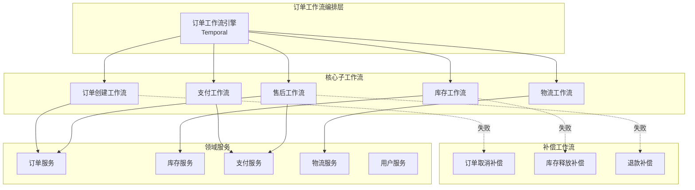
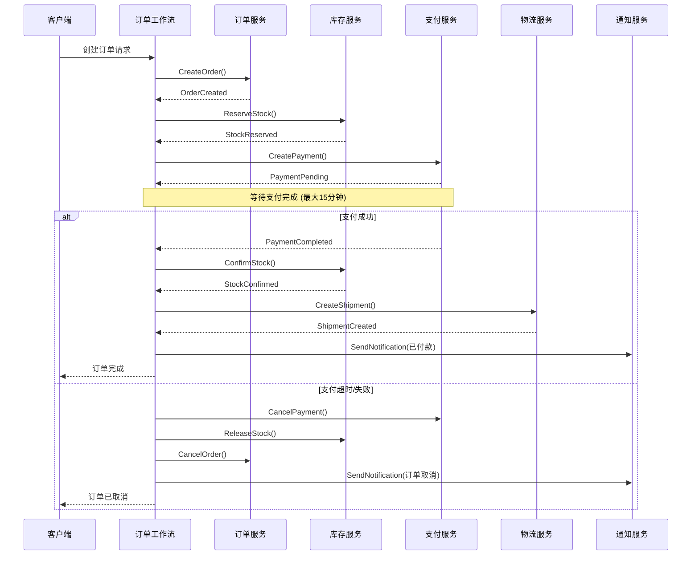
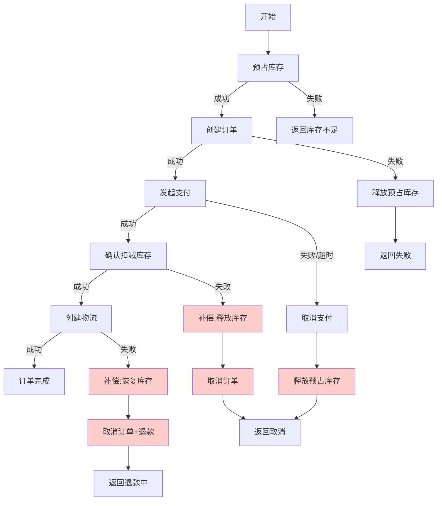
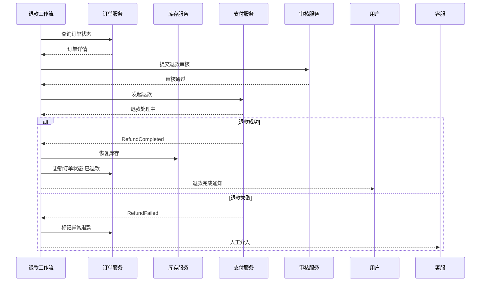

# 电商订单工作流案例

## 业务场景描述

### 场景概述

某大型电商平台日均订单量超过500万，峰值时可达2000万订单/天。订单系统需要处理复杂的业务流程，包括：

- 订单创建与验证
- 库存扣减与预占
- 支付处理
- 物流发货
- 售后退款

### 业务挑战

1. **高并发**：大促期间订单创建QPS峰值达10万+
2. **数据一致性**：订单、库存、支付、物流多系统数据一致性
3. **长时间运行**：从下单到收货可能持续数天
4. **容错处理**：需要优雅处理网络故障、服务宕机等异常

### 核心业务流程

```
用户下单 → 库存预占 → 支付(15分钟超时) → 扣减库存 → 创建物流单 → 发货 → 签收
    ↓          ↓           ↓              ↓           ↓        ↓       ↓
  订单取消   释放库存    支付超时      支付失败     物流异常  拒收   退货退款
```

---

## 工作流设计图

### 整体架构图



### 主订单Saga工作流



### 库存扣减Saga（ compensating transactions ）



### 退款Saga工作流



---

## 关键技术选型

| 组件 | 技术选型 | 选型理由 |
|------|----------|----------|
| **工作流引擎** | Temporal | 支持长时间运行工作流、内置Saga模式、高可用、水平扩展 |
| **状态存储** | PostgreSQL + Redis | PG持久化工作流状态，Redis缓存热点数据 |
| **消息队列** | Apache Kafka | 高吞吐事件流，解耦服务间通信 |
| **服务框架** | Go + gRPC | 高性能、低延迟、强类型接口 |
| **分布式事务** | Saga + TCC | 最终一致性，适合长事务业务 |
| **监控** | Prometheus + Grafana | 工作流执行指标可视化 |

---

## 核心代码示例

### 1. 订单工作流定义 (Go + Temporal)

```go
package workflows

import (
    "time"
    "go.temporal.io/sdk/workflow"
)

// OrderWorkflowInput 订单工作流输入
type OrderWorkflowInput struct {
    UserID      string
    ProductID   string
    Quantity    int
    TotalAmount float64
    Address     ShippingAddress
}

// OrderWorkflow 主订单工作流 - Saga模式实现
func OrderWorkflow(ctx workflow.Context, input OrderWorkflowInput) (*OrderResult, error) {
    // 工作流选项：设置执行超时和重试策略
    ao := workflow.ActivityOptions{
        StartToCloseTimeout: 30 * time.Second,
        RetryPolicy: &temporal.RetryPolicy{
            InitialInterval:    time.Second,
            BackoffCoefficient: 2.0,
            MaximumInterval:    time.Minute,
            MaximumAttempts:    3,
        },
    }
    ctx = workflow.WithActivityOptions(ctx, ao)

    result := &OrderResult{}
    saga := NewSaga()

    // ========== Step 1: 创建订单 ==========
    var orderResp CreateOrderResponse
    err := workflow.ExecuteActivity(ctx, CreateOrderActivity, CreateOrderInput{
        UserID:    input.UserID,
        ProductID: input.ProductID,
        Quantity:  input.Quantity,
        Amount:    input.TotalAmount,
    }).Get(ctx, &orderResp)

    if err != nil {
        return nil, fmt.Errorf("create order failed: %w", err)
    }
    result.OrderID = orderResp.OrderID

    // 注册补偿：取消订单
    saga.AddCompensation(func() error {
        return workflow.ExecuteActivity(ctx, CancelOrderActivity, CancelOrderInput{
            OrderID: result.OrderID,
            Reason:  "workflow_compensation",
        }).Get(ctx, nil)
    })

    // ========== Step 2: 预占库存 ==========
    var stockResp ReserveStockResponse
    err = workflow.ExecuteActivity(ctx, ReserveStockActivity, ReserveStockInput{
        OrderID:   result.OrderID,
        ProductID: input.ProductID,
        Quantity:  input.Quantity,
    }).Get(ctx, &stockResp)

    if err != nil {
        saga.Compensate(ctx) // 执行补偿
        return nil, fmt.Errorf("reserve stock failed: %w", err)
    }
    result.ReservationID = stockResp.ReservationID

    // 注册补偿：释放库存
    saga.AddCompensation(func() error {
        return workflow.ExecuteActivity(ctx, ReleaseStockActivity, ReleaseStockInput{
            ReservationID: result.ReservationID,
        }).Get(ctx, nil)
    })

    // ========== Step 3: 创建支付单 ==========
    var paymentResp CreatePaymentResponse
    err = workflow.ExecuteActivity(ctx, CreatePaymentActivity, CreatePaymentInput{
        OrderID: result.OrderID,
        UserID:  input.UserID,
        Amount:  input.TotalAmount,
    }).Get(ctx, &paymentResp)

    if err != nil {
        saga.Compensate(ctx)
        return nil, fmt.Errorf("create payment failed: %w", err)
    }
    result.PaymentID = paymentResp.PaymentID

    // ========== Step 4: 等待支付结果（带超时）==========
    paymentTimeout := 15 * time.Minute
    paymentTimer := workflow.NewTimer(ctx, paymentTimeout)

    paymentSignalChan := workflow.GetSignalChannel(ctx, PaymentCompletedSignal)

    selector := workflow.NewSelector(ctx)
    var paymentEvent PaymentCompletedEvent

    selector.AddReceive(paymentSignalChan, func(c workflow.ReceiveChannel, more bool) {
        c.Receive(ctx, &paymentEvent)
    })
    selector.AddFuture(paymentTimer, func(f workflow.Future) {
        paymentEvent.Status = PaymentStatusTimeout
    })
    selector.Select(ctx)

    // 处理支付结果
    switch paymentEvent.Status {
    case PaymentStatusSuccess:
        result.PaymentStatus = "paid"

        // 确认库存扣减
        err = workflow.ExecuteActivity(ctx, ConfirmStockActivity, ConfirmStockInput{
            ReservationID: result.ReservationID,
        }).Get(ctx, nil)

        if err != nil {
            saga.Compensate(ctx)
            return nil, fmt.Errorf("confirm stock failed: %w", err)
        }

        // 创建物流单
        var shipmentResp CreateShipmentResponse
        err = workflow.ExecuteActivity(ctx, CreateShipmentActivity, CreateShipmentInput{
            OrderID: result.OrderID,
            Address: input.Address,
        }).Get(ctx, &shipmentResp)

        if err != nil {
            // 库存已扣，需要人工处理或异步补偿
            _ = workflow.ExecuteActivity(ctx, MarkOrderExceptionActivity, MarkExceptionInput{
                OrderID:   result.OrderID,
                Exception: "shipment_creation_failed",
            }).Get(ctx, nil)
            return result, nil
        }
        result.ShipmentID = shipmentResp.ShipmentID
        result.Status = "shipped"

    case PaymentStatusFailed, PaymentStatusTimeout:
        // 执行完整补偿
        saga.Compensate(ctx)
        result.Status = "cancelled"
        result.CancelReason = paymentEvent.Status

        _ = workflow.ExecuteActivity(ctx, SendNotificationActivity, NotificationInput{
            UserID:  input.UserID,
            Type:    "order_cancelled",
            Content: fmt.Sprintf("订单 %s 因未支付已自动取消", result.OrderID),
        }).Get(ctx, nil)
    }

    return result, nil
}
```

### 2. Saga模式实现

```go
package workflows

import (
    "go.temporal.io/sdk/workflow"
)

// Compensation 补偿函数类型
type Compensation func() error

// Saga Saga协调器
type Saga struct {
    compensations []Compensation
}

// NewSaga 创建Saga实例
func NewSaga() *Saga {
    return &Saga{
        compensations: make([]Compensation, 0),
    }
}

// AddCompensation 添加补偿操作（LIFO顺序）
func (s *Saga) AddCompensation(c Compensation) {
    s.compensations = append(s.compensations, c)
}

// Compensate 执行补偿 - 按逆序执行
func (s *Saga) Compensate(ctx workflow.Context) {
    logger := workflow.GetLogger(ctx)

    // 倒序执行补偿
    for i := len(s.compensations) - 1; i >= 0; i-- {
        comp := s.compensations[i]

        // 补偿操作使用独立的重试策略
        ctxComp := workflow.WithActivityOptions(ctx, workflow.ActivityOptions{
            StartToCloseTimeout: 30 * time.Second,
            RetryPolicy: &temporal.RetryPolicy{
                InitialInterval:    time.Second,
                BackoffCoefficient: 2.0,
                MaximumAttempts:    5, // 补偿重试更多次
                NonRetryableErrorTypes: []string{"InvalidArgument", "EntityNotFound"},
            },
        })

        err := comp()
        if err != nil {
            logger.Error("compensation failed",
                "index", i,
                "error", err)
            // 记录补偿失败，需要人工介入
            _ = workflow.ExecuteActivity(ctxComp, LogCompensationFailureActivity,
                CompensationFailureInput{
                    Index: i,
                    Error: err.Error(),
                }).Get(ctxComp, nil)
        } else {
            logger.Info("compensation executed", "index", i)
        }
    }
}
```

### 3. 活动实现

```go
package activities

import (
    "context"
    "fmt"
    "time"
)

// OrderActivities 订单相关活动
type OrderActivities struct {
    orderService    OrderServiceClient
    stockService    StockServiceClient
    paymentService  PaymentServiceClient
    shipmentService ShipmentServiceClient
}

// CreateOrderActivity 创建订单活动
func (a *OrderActivities) CreateOrderActivity(ctx context.Context, input CreateOrderInput) (*CreateOrderResponse, error) {
    // 幂等性检查 - 使用工作流ID作为幂等键
    if existing, err := a.orderService.GetOrderByIdempotencyKey(ctx, input.IdempotencyKey); err == nil && existing != nil {
        return &CreateOrderResponse{OrderID: existing.ID}, nil
    }

    order := &Order{
        ID:              generateOrderID(),
        UserID:          input.UserID,
        ProductID:       input.ProductID,
        Quantity:        input.Quantity,
        TotalAmount:     input.Amount,
        Status:          OrderStatusPending,
        CreatedAt:       time.Now(),
        IdempotencyKey:  input.IdempotencyKey,
    }

    if err := a.orderService.Create(ctx, order); err != nil {
        return nil, fmt.Errorf("failed to create order: %w", err)
    }

    return &CreateOrderResponse{OrderID: order.ID}, nil
}

// ReserveStockActivity 预占库存活动
func (a *OrderActivities) ReserveStockActivity(ctx context.Context, input ReserveStockInput) (*ReserveStockResponse, error) {
    // 使用TCC模式：Try阶段
    reservation := &StockReservation{
        ID:        generateReservationID(),
        OrderID:   input.OrderID,
        ProductID: input.ProductID,
        Quantity:  input.Quantity,
        Status:    ReservationStatusPending,
        ExpireAt:  time.Now().Add(15 * time.Minute),
    }

    if err := a.stockService.Reserve(ctx, reservation); err != nil {
        return nil, fmt.Errorf("failed to reserve stock: %w", err)
    }

    return &ReserveStockResponse{
        ReservationID: reservation.ID,
    }, nil
}

// ConfirmStockActivity 确认库存活动（TCC Confirm）
func (a *OrderActivities) ConfirmStockActivity(ctx context.Context, input ConfirmStockInput) error {
    return a.stockService.Confirm(ctx, input.ReservationID)
}

// ReleaseStockActivity 释放库存活动（TCC Cancel）
func (a *OrderActivities) ReleaseStockActivity(ctx context.Context, input ReleaseStockInput) error {
    return a.stockService.Release(ctx, input.ReservationID)
}

// CreatePaymentActivity 创建支付单
func (a *OrderActivities) CreatePaymentActivity(ctx context.Context, input CreatePaymentInput) (*CreatePaymentResponse, error) {
    payment := &Payment{
        ID:      generatePaymentID(),
        OrderID: input.OrderID,
        UserID:  input.UserID,
        Amount:  input.Amount,
        Status:  PaymentStatusPending,
        ExpireAt: time.Now().Add(15 * time.Minute),
    }

    if err := a.paymentService.Create(ctx, payment); err != nil {
        return nil, fmt.Errorf("failed to create payment: %w", err)
    }

    // 发送支付通知（异步）
    go a.sendPaymentNotification(input.UserID, payment.ID, input.Amount)

    return &CreatePaymentResponse{PaymentID: payment.ID}, nil
}

// CreateShipmentActivity 创建物流单
func (a *OrderActivities) CreateShipmentActivity(ctx context.Context, input CreateShipmentInput) (*CreateShipmentResponse, error) {
    shipment := &Shipment{
        ID:        generateShipmentID(),
        OrderID:   input.OrderID,
        Address:   input.Address,
        Status:    ShipmentStatusPending,
        CreatedAt: time.Now(),
    }

    if err := a.shipmentService.Create(ctx, shipment); err != nil {
        return nil, fmt.Errorf("failed to create shipment: %w", err)
    }

    return &CreateShipmentResponse{ShipmentID: shipment.ID}, nil
}
```

### 4. TypeScript Worker实现

```typescript
// workers/order-worker.ts
import { Worker, NativeConnection } from '@temporalio/worker';
import * as activities from '../activities/order-activities';

async function run() {
  const connection = await NativeConnection.connect({
    address: 'temporal-server:7233',
  });

  const worker = await Worker.create({
    connection,
    namespace: 'default',
    taskQueue: 'order-queue',
    workflowsPath: require.resolve('../workflows/order-workflow'),
    activities,
    maxConcurrentActivityTaskExecutions: 100,
    maxConcurrentWorkflowTaskExecutions: 50,
  });

  console.log('Order Worker started...');
  await worker.run();
}

run().catch(console.error);
```

### 5. 退款工作流

```go
// RefundWorkflow 退款Saga工作流
func RefundWorkflow(ctx workflow.Context, input RefundInput) (*RefundResult, error) {
    ao := workflow.ActivityOptions{
        StartToCloseTimeout: 30 * time.Second,
        RetryPolicy: &temporal.RetryPolicy{
            MaximumAttempts: 3,
        },
    }
    ctx = workflow.WithActivityOptions(ctx, ao)

    // 查询原订单
    var order Order
    err := workflow.ExecuteActivity(ctx, GetOrderActivity, input.OrderID).Get(ctx, &order)
    if err != nil {
        return nil, err
    }

    // 验证退款条件
    if !isRefundable(order) {
        return nil, fmt.Errorf("order not refundable: %s", order.Status)
    }

    // 风控审核
    var auditResp AuditResponse
    err = workflow.ExecuteActivity(ctx, AuditRefundActivity, AuditInput{
        OrderID: input.OrderID,
        Amount:  input.Amount,
        Reason:  input.Reason,
    }).Get(ctx, &auditResp)

    if err != nil || !auditResp.Approved {
        return nil, fmt.Errorf("refund audit failed")
    }

    // 执行退款
    var refundResp ProcessRefundResponse
    err = workflow.ExecuteActivity(ctx, ProcessRefundActivity, ProcessRefundInput{
        OrderID:   input.OrderID,
        PaymentID: order.PaymentID,
        Amount:    input.Amount,
    }).Get(ctx, &refundResp)

    if err != nil {
        // 退款失败，需要人工介入
        _ = workflow.ExecuteActivity(ctx, EscalateRefundActivity, EscalateInput{
            OrderID: input.OrderID,
            Error:   err.Error(),
        }).Get(ctx, nil)
        return nil, err
    }

    // 恢复库存（如果已发货需要退货入库）
    if order.Status == OrderStatusShipped || order.Status == OrderStatusDelivered {
        _ = workflow.ExecuteActivity(ctx, ReturnStockActivity, ReturnStockInput{
            ProductID: order.ProductID,
            Quantity:  order.Quantity,
        }).Get(ctx, nil)
    }

    // 更新订单状态
    _ = workflow.ExecuteActivity(ctx, UpdateOrderStatusActivity, UpdateStatusInput{
        OrderID: input.OrderID,
        Status:  OrderStatusRefunded,
    }).Get(ctx, nil)

    // 发送通知
    _ = workflow.ExecuteActivity(ctx, SendNotificationActivity, NotificationInput{
        UserID:  order.UserID,
        Type:    "refund_completed",
        Content: fmt.Sprintf("订单 %s 退款已完成，金额: %.2f", input.OrderID, input.Amount),
    }).Get(ctx, nil)

    return &RefundResult{
        RefundID: refundResp.RefundID,
        Status:   "completed",
    }, nil
}
```

---

## 遇到的问题和解决方案

### 问题1：支付超时处理复杂

**现象**：支付回调可能延迟、丢失或重复到达
**解决方案**：

- 使用Temporal的Signal机制处理异步支付结果
- 实现幂等性检查（支付ID + 状态机）
- 设置15分钟超时定时器

```go
// 幂等性检查示例
func (a *Activities) HandlePaymentCallback(ctx context.Context, paymentID string, status PaymentStatus) error {
    // 数据库层面唯一约束防止重复处理
    return a.db.Transaction(func(tx *gorm.DB) error {
        var payment Payment
        if err := tx.Clauses(clause.Locking{Strength: "UPDATE"}).
            First(&payment, "id = ?", paymentID).Error; err != nil {
            return err
        }

        // 状态机校验
        if !canTransition(payment.Status, status) {
            return fmt.Errorf("invalid status transition: %s -> %s", payment.Status, status)
        }

        payment.Status = status
        return tx.Save(&payment).Error
    })
}
```

### 问题2：补偿操作失败

**现象**：库存释放时库存服务不可用
**解决方案**：

- 补偿操作配置更激进的重试策略
- 失败记录进入死信队列人工处理
- 定时任务扫描未完成的补偿

### 问题3：大促期间工作流堆积

**现象**：Temporal任务队列积压
**解决方案**：

- 水平扩展Worker节点
- 分离关键路径和非关键路径活动
- 使用本地活动（Local Activity）减少网络开销

```go
// 本地活动用于轻量级操作
localOptions := workflow.LocalActivityOptions{
    ScheduleToCloseTimeout: 5 * time.Second,
}
ctx = workflow.WithLocalActivityOptions(ctx, localOptions)

// 验证优惠券等轻量操作使用本地活动
err := workflow.ExecuteLocalActivity(ctx, ValidateCouponActivity, couponCode).Get(ctx, nil)
```

### 问题4：长时间运行工作流的可见性

**现象**：数天运行的工作流难以追踪状态
**解决方案**：

- 使用Query接口暴露工作流状态
- 关键状态变更发送事件到Kafka
- 定制Workflow UI展示业务状态

```go
// Query处理器
func OrderWorkflow(ctx workflow.Context, input OrderWorkflowInput) (*OrderResult, error) {
    // ... 工作流逻辑

    // 注册Query处理器
    err := workflow.SetQueryHandler(ctx, "getOrderStatus", func() (OrderStatus, error) {
        return currentStatus, nil
    })
    if err != nil {
        return nil, err
    }

    // ...
}
```

---

## 性能数据

### 测试环境

- **Temporal集群**：3 Server节点 + 3个Worker Pod
- **数据库**：PostgreSQL 16 (主从)
- **业务服务**：8核16GB × 4实例

### 性能指标

| 指标 | 目标值 | 实测值 | 备注 |
|------|--------|--------|------|
| **订单创建QPS** | 5000 | 6800 | 峰值可达10K+ |
| **工作流启动延迟** | < 100ms | 45ms | P99 |
| **库存预占延迟** | < 50ms | 28ms | 平均 |
| **支付流程完成** | < 200ms | 120ms | 不含用户支付时间 |
| **补偿执行时间** | < 500ms | 350ms | 含所有补偿操作 |
| **工作流状态查询** | < 10ms | 5ms | Query接口 |

### 资源使用（日均500万订单）

- **Temporal Persistence**：~500GB/月增长
- **工作流历史记录**：平均每条工作流200个事件
- **Worker CPU使用率**：平均45%，峰值75%
- **PostgreSQL连接数**：平均80，峰值150

### 扩展性测试

| Worker节点数 | 处理能力(QPS) | CPU使用率 |
|--------------|---------------|-----------|
| 2 | 3,000 | 85% |
| 4 | 6,800 | 72% |
| 8 | 12,000 | 65% |
| 16 | 22,000 | 58% |

---

## 与理论模型的映射

### 1. Saga模式

- **实现方式**：使用Temporal的补偿机制
- **协调方式**：编排式Saga（Orchestration）
- **补偿策略**：向后恢复（Backward Recovery）

### 2. TCC（Try-Confirm-Cancel）

- **Try**：预占库存、创建支付单
- **Confirm**：确认扣减库存
- **Cancel**：释放库存、取消支付

### 3. 事件驱动架构

- **外部事件**：支付完成回调
- **内部事件**：状态变更事件
- **事件存储**：Temporal内置 + Kafka补充

### 4. 状态机模式

```
Pending → StockReserved → PaymentPending → [Paid → Confirmed → Shipped → Completed]
                                              ↓
                                        Cancelled
```

### 5. 幂等性设计

- **工作流启动**：幂等键确保不重复创建
- **活动执行**：Temporal内置去重
- **补偿操作**：幂等设计支持多次执行

### 6. 超时与重试

- **业务超时**：支付15分钟限制
- **技术超时**：活动执行30秒限制
- **重试策略**：指数退避 + 最大重试次数

---

## 最佳实践总结

1. **工作流粒度**：业务操作与工作流步骤一一对应，避免过大或过小
2. **补偿设计**：所有修改操作必须有对应的补偿，补偿必须是幂等的
3. **状态查询**：使用Query接口而非信号查询工作流状态
4. **异步处理**：外部系统交互使用Signal，避免长时间阻塞
5. **监控告警**：工作流失败率、补偿执行次数、任务队列深度
6. **测试策略**：单元测试 + 集成测试 + 混沌测试（模拟故障）

---

## 相关文档

- [Saga模式详解](../01-基础概念/02-Saga模式.md)
- [Temporal工作流引擎](../03-技术架构/02-工作流引擎.md)
- [分布式事务设计](../02-架构设计/01-分布式事务.md)
