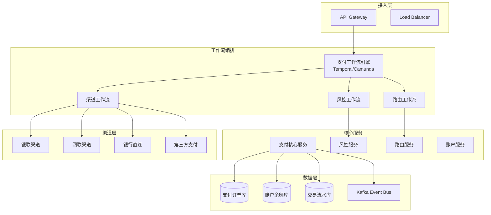
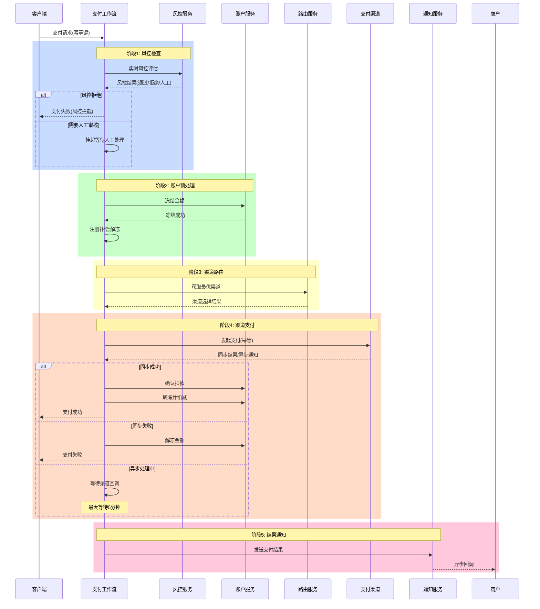
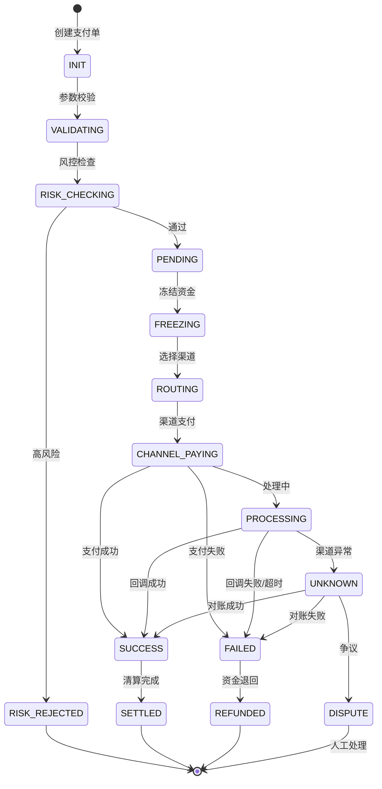
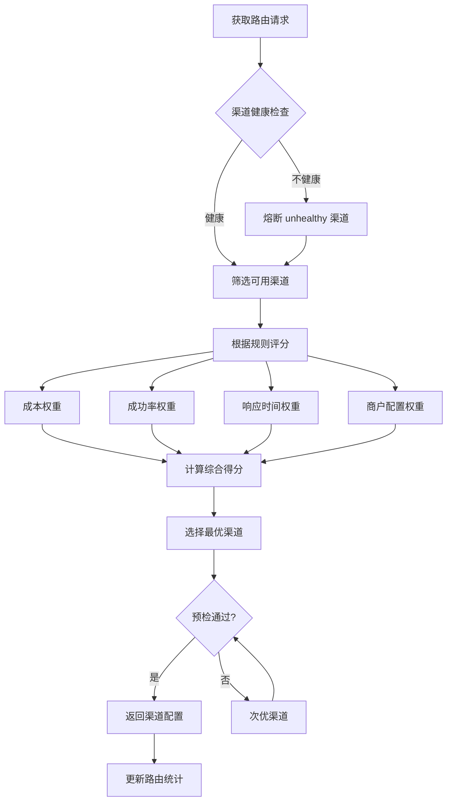
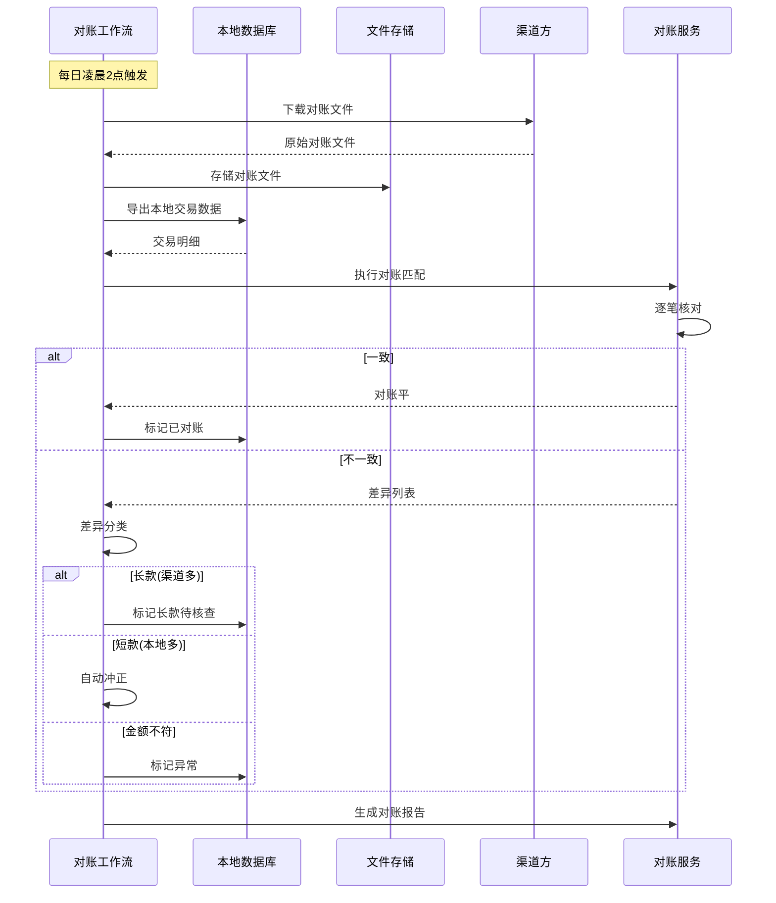

# 金融支付工作流案例

## 业务场景描述

### 场景概述

某持牌支付机构日均处理支付交易3000万笔，峰值TPS达5万。系统需要满足金融级要求：

- **资金安全**：零资损，精确到分的金额计算
- **高可用性**：99.99%可用性，RTO < 30秒
- **强一致性**：交易与清算数据严格一致
- **合规审计**：完整交易链路可追溯
- **风险控制**：实时风控拦截可疑交易

### 业务流程

```
用户支付请求 → 风控检查 → 支付路由 → 渠道支付 → 结果通知 → 对账清算
      ↓              ↓           ↓           ↓           ↓         ↓
   参数校验      风险评分    渠道选择    幂等控制    异步通知   日终对账
```

### 核心挑战

1. **幂等性保障**：网络抖动导致重复提交
2. **渠道管理**：多银行渠道智能路由与熔断
3. **状态一致性**：支付单、账户余额、渠道状态三方一致
4. **对账处理**：海量交易数据与银行对账

---

## 工作流设计图

### 整体支付架构



### 主支付工作流（Saga + 状态机）



### 支付状态机



### 渠道路由工作流



### 对账工作流



---

## 关键技术选型

| 组件 | 技术选型 | 选型理由 |
|------|----------|----------|
| **工作流引擎** | Temporal | 金融级持久化、Exactly-Once语义、长时间运行支持 |
| **状态存储** | PostgreSQL (同步复制) | ACID保证、金融合规、时间点恢复 |
| **缓存** | Redis Cluster | 热点数据、幂等键、限流计数器 |
| **消息队列** | Apache Kafka | 交易流水、审计日志、事件溯源 |
| **渠道通信** | gRPC + TLS | 高性能、双向流、加密传输 |
| **风控引擎** | 自研规则引擎 + Flink | 实时风控、复杂规则计算 |

---

## 核心代码示例

### 1. 主支付工作流 (Go + Temporal)

```go
package workflows

import (
    "fmt"
    "time"
    "go.temporal.io/sdk/workflow"
)

// PaymentWorkflowInput 支付工作流输入
type PaymentWorkflowInput struct {
    PaymentID     string          `json:"payment_id"`
    MerchantID    string          `json:"merchant_id"`
    UserID        string          `json:"user_id"`
    Amount        decimal.Decimal `json:"amount"`
    Currency      string          `json:"currency"`
    IdempotencyKey string         `json:"idempotency_key"`
    PaymentMethod PaymentMethod   `json:"payment_method"`
    NotifyURL     string          `json:"notify_url"`
}

// PaymentWorkflow 核心支付工作流 - 金融级Saga实现
func PaymentWorkflow(ctx workflow.Context, input PaymentWorkflowInput) (*PaymentResult, error) {
    logger := workflow.GetLogger(ctx)
    logger.Info("PaymentWorkflow started", "paymentID", input.PaymentID)

    // 严格的活动选项 - 金融级超时配置
    ao := workflow.ActivityOptions{
        StartToCloseTimeout: 10 * time.Second,
        HeartbeatTimeout:    3 * time.Second,
        RetryPolicy: &temporal.RetryPolicy{
            InitialInterval:    100 * time.Millisecond,
            BackoffCoefficient: 1.5,
            MaximumInterval:    5 * time.Second,
            MaximumAttempts:    3,
            NonRetryableErrorTypes: []string{
                "InvalidRequestError",
                "RiskRejectError",
                "InsufficientBalanceError",
            },
        },
    }
    ctx = workflow.WithActivityOptions(ctx, ao)

    result := &PaymentResult{
        PaymentID: input.PaymentID,
        Status:    PaymentStatusInit,
    }

    // Saga协调器
    saga := NewPaymentSaga()

    // ========== Step 1: 幂等性检查与初始化 ==========
    var initResp InitPaymentResponse
    err := workflow.ExecuteActivity(ctx, InitPaymentActivity, InitPaymentInput{
        PaymentID:      input.PaymentID,
        MerchantID:     input.MerchantID,
        UserID:         input.UserID,
        Amount:         input.Amount,
        Currency:       input.Currency,
        IdempotencyKey: input.IdempotencyKey,
    }).Get(ctx, &initResp)

    if err != nil {
        return nil, fmt.Errorf("init payment failed: %w", err)
    }

    // 幂等性：已存在的支付直接返回结果
    if initResp.Exists {
        logger.Info("payment already exists", "status", initResp.Status)
        result.Status = initResp.Status
        return result, nil
    }
    result.Status = PaymentStatusPending

    // ========== Step 2: 风控检查 ==========
    var riskResp RiskCheckResponse
    err = workflow.ExecuteActivity(ctx, RiskCheckActivity, RiskCheckInput{
        PaymentID: input.PaymentID,
        UserID:    input.UserID,
        Amount:    input.Amount,
        Method:    input.PaymentMethod,
        DeviceID:  input.DeviceID,
        IP:        input.IP,
    }).Get(ctx, &riskResp)

    if err != nil {
        _ = workflow.ExecuteActivity(ctx, UpdatePaymentStatusActivity, UpdateStatusInput{
            PaymentID: input.PaymentID,
            Status:    PaymentStatusFailed,
            ErrorCode: "RISK_CHECK_ERROR",
        }).Get(ctx, nil)
        return nil, err
    }

    if riskResp.Decision == RiskDecisionReject {
        _ = workflow.ExecuteActivity(ctx, UpdatePaymentStatusActivity, UpdateStatusInput{
            PaymentID:     input.PaymentID,
            Status:        PaymentStatusRiskRejected,
            RiskReason:    riskResp.Reason,
            RiskScore:     riskResp.Score,
        }).Get(ctx, nil)
        result.Status = PaymentStatusRiskRejected
        return result, nil
    }

    if riskResp.Decision == RiskDecisionManualReview {
        // 进入人工审核流程
        return handleManualReview(ctx, input, result)
    }

    // ========== Step 3: 账户资金冻结 ==========
    freezeID := generateFreezeID()
    var freezeResp FreezeResponse
    err = workflow.ExecuteActivity(ctx, FreezeAmountActivity, FreezeInput{
        FreezeID:  freezeID,
        UserID:    input.UserID,
        Amount:    input.Amount,
        PaymentID: input.PaymentID,
    }).Get(ctx, &freezeResp)

    if err != nil {
        _ = workflow.ExecuteActivity(ctx, UpdatePaymentStatusActivity, UpdateStatusInput{
            PaymentID: input.PaymentID,
            Status:    PaymentStatusFailed,
            ErrorCode: "FREEZE_FAILED",
        }).Get(ctx, nil)
        return nil, fmt.Errorf("freeze amount failed: %w", err)
    }
    result.FreezeID = freezeID
    result.Status = PaymentStatusFrozen

    // 注册补偿：解冻资金
    saga.AddCompensation(func() error {
        return workflow.ExecuteActivity(ctx, UnfreezeAmountActivity, UnfreezeInput{
            FreezeID: freezeID,
            Reason:   "payment_compensation",
        }).Get(ctx, nil)
    })

    // ========== Step 4: 智能路由选择 ==========
    var routeResp RouteResponse
    err = workflow.ExecuteActivity(ctx, RouteChannelActivity, RouteInput{
        PaymentID: input.PaymentID,
        Amount:    input.Amount,
        Method:    input.PaymentMethod,
        Merchant:  input.MerchantID,
    }).Get(ctx, &routeResp)

    if err != nil {
        saga.Compensate(ctx)
        return nil, fmt.Errorf("route failed: %w", err)
    }
    result.ChannelID = routeResp.ChannelID
    result.ChannelOrderNo = routeResp.ChannelOrderNo

    // ========== Step 5: 渠道支付 ==========
    channelResult, err := executeChannelPayment(ctx, input, result, routeResp)
    if err != nil {
        saga.Compensate(ctx)
        return nil, err
    }

    // ========== Step 6: 确认扣款或解冻 ==========
    if channelResult.Success {
        // 支付成功：确认扣减
        err = workflow.ExecuteActivity(ctx, ConfirmDeductionActivity, ConfirmInput{
            FreezeID:  freezeID,
            PaymentID: input.PaymentID,
        }).Get(ctx, nil)

        if err != nil {
            // 严重错误：已扣款但账户未扣 - 进入异常处理
            _ = workflow.ExecuteActivity(ctx, MarkExceptionActivity, ExceptionInput{
                PaymentID: input.PaymentID,
                Type:      "CONFIRM_DEDUCTION_FAILED",
                Severity:  SeverityCritical,
            }).Get(ctx, nil)
            return nil, err
        }

        result.Status = PaymentStatusSuccess

        // 发送成功通知
        _ = workflow.ExecuteActivity(ctx, SendNotificationActivity, NotificationInput{
            PaymentID:     input.PaymentID,
            Status:        "success",
            NotifyURL:     input.NotifyURL,
            MerchantID:    input.MerchantID,
            ChannelResult: channelResult,
        }).Get(ctx, nil)

    } else {
        // 支付失败：解冻资金
        saga.Compensate(ctx)
        result.Status = PaymentStatusFailed
        result.ErrorCode = channelResult.ErrorCode

        _ = workflow.ExecuteActivity(ctx, SendNotificationActivity, NotificationInput{
            PaymentID:  input.PaymentID,
            Status:     "failed",
            NotifyURL:  input.NotifyURL,
            MerchantID: input.MerchantID,
            ErrorCode:  channelResult.ErrorCode,
        }).Get(ctx, nil)
    }

    // ========== Step 7: 记录审计日志 ==========
    _ = workflow.ExecuteActivity(ctx, RecordAuditLogActivity, AuditInput{
        PaymentID: input.PaymentID,
        Action:    "payment_completed",
        Result:    result.Status,
        Details:   result,
    }).Get(ctx, nil)

    return result, nil
}

// executeChannelPayment 执行渠道支付（处理同步/异步结果）
func executeChannelPayment(ctx workflow.Context, input PaymentWorkflowInput,
    result *PaymentResult, route RouteResponse) (*ChannelResult, error) {

    // 发起渠道支付
    var payResp ChannelPayResponse
    err := workflow.ExecuteActivity(ctx, ChannelPayActivity, ChannelPayInput{
        PaymentID:      input.PaymentID,
        ChannelID:      route.ChannelID,
        ChannelOrderNo: route.ChannelOrderNo,
        Amount:         input.Amount,
        IdempotencyKey: input.IdempotencyKey, // 渠道幂等键
    }).Get(ctx, &payResp)

    if err != nil {
        return nil, err
    }

    switch payResp.ResultType {
    case ChannelResultSync:
        // 同步结果直接返回
        return &ChannelResult{
            Success:   payResp.Success,
            ErrorCode: payResp.ErrorCode,
        }, nil

    case ChannelResultAsync:
        // 异步结果：等待回调或超时
        return waitForChannelCallback(ctx, input, route, payResp)
    }

    return nil, fmt.Errorf("unknown result type: %s", payResp.ResultType)
}

// waitForChannelCallback 等待渠道回调
func waitForChannelCallback(ctx workflow.Context, input PaymentWorkflowInput,
    route RouteResponse, payResp ChannelPayResponse) (*ChannelResult, error) {

    // 设置回调等待超时（5分钟）
    callbackTimeout := 5 * time.Minute
    timer := workflow.NewTimer(ctx, callbackTimeout)

    // 渠道回调信号
    callbackChan := workflow.GetSignalChannel(ctx, ChannelCallbackSignal)

    selector := workflow.NewSelector(ctx)
    var callbackEvent ChannelCallbackEvent

    selector.AddReceive(callbackChan, func(c workflow.ReceiveChannel, more bool) {
        c.Receive(ctx, &callbackEvent)
    })

    selector.AddFuture(timer, func(f workflow.Future) {
        callbackEvent.Status = "TIMEOUT"
    })

    selector.Select(ctx)

    switch callbackEvent.Status {
    case "SUCCESS":
        return &ChannelResult{Success: true}, nil
    case "FAILED":
        return &ChannelResult{
            Success:   false,
            ErrorCode: callbackEvent.ErrorCode,
        }, nil
    case "TIMEOUT":
        // 查询渠道确认状态
        return queryChannelStatus(ctx, input, route)
    default:
        return nil, fmt.Errorf("unknown callback status: %s", callbackEvent.Status)
    }
}
```

### 2. 幂等性控制实现

```go
package activities

import (
    "context"
    "fmt"
    "time"
    "github.com/redis/go-redis/v9"
)

// IdempotencyController 幂等控制器
type IdempotencyController struct {
    redis *redis.Client
    db    *gorm.DB
}

// CheckAndLock 检查幂等键并加锁
func (c *IdempotencyController) CheckAndLock(ctx context.Context, key string,
    ttl time.Duration) (*IdempotencyStatus, error) {

    lockKey := fmt.Sprintf("idempotency:%s", key)

    // Redis SET NX EX 原子操作
    locked, err := c.redis.SetNX(ctx, lockKey, "processing", ttl).Result()
    if err != nil {
        return nil, fmt.Errorf("redis error: %w", err)
    }

    if !locked {
        // 键已存在，查询处理状态
        status, err := c.getProcessingStatus(ctx, key)
        if err != nil {
            return nil, err
        }
        return status, nil
    }

    return &IdempotencyStatus{CanProceed: true}, nil
}

// Complete 完成幂等处理并存储结果
func (c *IdempotencyController) Complete(ctx context.Context, key string,
    result interface{}, ttl time.Duration) error {

    // 存储结果到Redis
    resultKey := fmt.Sprintf("idempotency:result:%s", key)
    resultData, _ := json.Marshal(result)

    pipe := c.redis.Pipeline()
    pipe.Set(ctx, resultKey, resultData, ttl)
    pipe.Del(ctx, fmt.Sprintf("idempotency:%s", key))
    _, err := pipe.Exec(ctx)

    return err
}

// PaymentActivity 支付活动实现
func (a *PaymentActivities) InitPaymentActivity(ctx context.Context,
    input InitPaymentInput) (*InitPaymentResponse, error) {

    // 幂等性检查
    idemStatus, err := a.idempotency.CheckAndLock(ctx, input.IdempotencyKey, 5*time.Minute)
    if err != nil {
        return nil, err
    }

    if !idemStatus.CanProceed {
        // 已存在处理中的请求
        if idemStatus.Processing {
            return nil, temporal.NewApplicationError(
                "payment is processing",
                "DuplicateRequestError",
                false,
            )
        }
        // 返回已缓存的结果
        return &InitPaymentResponse{
            Exists: true,
            Status: idemStatus.PaymentStatus,
        }, nil
    }

    // 数据库唯一约束作为最后一道防线
    payment := &Payment{
        ID:             input.PaymentID,
        MerchantID:     input.MerchantID,
        Amount:         input.Amount,
        Status:         PaymentStatusInit,
        IdempotencyKey: input.IdempotencyKey,
        CreatedAt:      time.Now(),
    }

    if err := a.db.WithContext(ctx).Create(payment).Error; err != nil {
        // 检查是否是唯一约束冲突
        if isDuplicateKeyError(err) {
            return a.handleDuplicatePayment(ctx, input.IdempotencyKey)
        }
        return nil, err
    }

    return &InitPaymentResponse{
        Exists: false,
        Status: PaymentStatusInit,
    }, nil
}
```

### 3. 渠道路由实现

```go
// RouteService 智能路由服务
type RouteService struct {
    channels      map[string]*Channel
    healthChecker *HealthChecker
    metrics       *MetricsCollector
}

// RouteInput 路由输入
type RouteInput struct {
    PaymentID string
    Amount    decimal.Decimal
    Method    PaymentMethod
    Merchant  string
}

// RouteChannelActivity 渠道路由活动
func (a *PaymentActivities) RouteChannelActivity(ctx context.Context,
    input RouteInput) (*RouteResponse, error) {

    route := a.routeService.SelectChannel(ctx, input)

    return &RouteResponse{
        ChannelID:      route.Channel.ID,
        ChannelOrderNo: generateChannelOrderNo(),
        RouteReason:    route.Reason,
    }, nil
}

// SelectChannel 选择最优渠道
func (s *RouteService) SelectChannel(ctx context.Context,
    input RouteInput) *RouteResult {

    availableChannels := s.getHealthyChannels(input.Method)

    var bestChannel *Channel
    bestScore := -1.0

    for _, ch := range availableChannels {
        // 计算渠道得分
        score := s.calculateChannelScore(ctx, ch, input)

        if score > bestScore {
            bestScore = score
            bestChannel = ch
        }
    }

    return &RouteResult{
        Channel: bestChannel,
        Score:   bestScore,
        Reason:  fmt.Sprintf("cost=%.2f,success_rate=%.2f", bestChannel.CostRate, bestChannel.SuccessRate),
    }
}

// calculateChannelScore 计算渠道综合得分
func (s *RouteService) calculateChannelScore(ctx context.Context,
    ch *Channel, input RouteInput) float64 {

    // 获取实时指标
    metrics := s.metrics.GetChannelMetrics(ctx, ch.ID, time.Hour)

    // 各维度权重（可配置化）
    weights := struct {
        Cost        float64 `json:"cost" default:"0.3"`
        SuccessRate float64 `json:"success_rate" default:"0.4"`
        Latency     float64 `json:"latency" default:"0.2"`
        Preference  float64 `json:"preference" default:"0.1"`
    }{}

    // 成本得分 (越低越好)
    costScore := 1.0 - (ch.CostRate / 0.01) // 假设最高费率1%

    // 成功率得分
    successScore := metrics.SuccessRate

    // 延迟得分 (越低越好)
    latencyScore := 1.0 - (float64(metrics.AvgLatency) / 1000.0) // 假设1s为基准

    // 商户偏好得分
    prefScore := s.getMerchantPreference(input.Merchant, ch.ID)

    // 综合得分
    totalScore := weights.Cost*costScore +
                  weights.SuccessRate*successScore +
                  weights.Latency*latencyScore +
                  weights.Preference*prefScore

    return totalScore
}
```

### 4. 对账工作流

```go
// ReconciliationWorkflow 对账工作流
func ReconciliationWorkflow(ctx workflow.Context, input ReconcileInput) (*ReconcileResult, error) {
    ao := workflow.ActivityOptions{
        StartToCloseTimeout: 30 * time.Minute,
        RetryPolicy: &temporal.RetryPolicy{
            MaximumAttempts: 3,
        },
    }
    ctx = workflow.WithActivityOptions(ctx, ao)

    result := &ReconcileResult{
        ReconcileDate: input.Date,
        StartTime:     workflow.Now(ctx),
    }

    // 步骤1: 下载渠道对账文件
    var downloadResp DownloadResponse
    err := workflow.ExecuteActivity(ctx, DownloadChannelFileActivity, DownloadInput{
        Date:      input.Date,
        ChannelID: input.ChannelID,
    }).Get(ctx, &downloadResp)
    if err != nil {
        return nil, err
    }

    // 步骤2: 解析对账文件
    var parseResp ParseResponse
    err = workflow.ExecuteActivity(ctx, ParseChannelFileActivity, ParseInput{
        FilePath: downloadResp.FilePath,
        Format:   downloadResp.Format,
    }).Get(ctx, &parseResp)
    if err != nil {
        return nil, err
    }
    result.ChannelRecords = parseResp.RecordCount

    // 步骤3: 获取本地交易数据
    var localResp LocalDataResponse
    err = workflow.ExecuteActivity(ctx, GetLocalTransactionsActivity, LocalDataInput{
        Date:      input.Date,
        ChannelID: input.ChannelID,
    }).Get(ctx, &localResp)
    if err != nil {
        return nil, err
    }
    result.LocalRecords = localResp.RecordCount

    // 步骤4: 执行对账匹配
    var matchResp MatchResponse
    err = workflow.ExecuteActivity(ctx, MatchTransactionsActivity, MatchInput{
        ChannelRecords: parseResp.Records,
        LocalRecords:   localResp.Records,
    }).Get(ctx, &matchResp)
    if err != nil {
        return nil, err
    }

    result.Matched = matchResp.Matched
    result.Unmatched = matchResp.Unmatched

    // 步骤5: 处理差异
    for _, diff := range matchResp.Differences {
        switch diff.Type {
        case DiffTypeLong: // 长款
            err = workflow.ExecuteActivity(ctx, HandleLongDifferenceActivity, diff).Get(ctx, nil)
            result.LongCount++

        case DiffTypeShort: // 短款
            err = workflow.ExecuteActivity(ctx, HandleShortDifferenceActivity, diff).Get(ctx, nil)
            result.ShortCount++

        case DiffTypeAmount: // 金额不符
            err = workflow.ExecuteActivity(ctx, HandleAmountDifferenceActivity, diff).Get(ctx, nil)
            result.AmountMismatchCount++
        }
    }

    // 步骤6: 生成对账报告
    _ = workflow.ExecuteActivity(ctx, GenerateReconcileReportActivity, ReportInput{
        Result: result,
    }).Get(ctx, nil)

    result.EndTime = workflow.Now(ctx)
    return result, nil
}
```

### 5. TypeScript风控规则引擎

```typescript
// risk-engine/rules/payment-risk-rules.ts
import { RuleEngine, RuleContext, RuleResult } from '../core';

export const paymentRiskRules = [
  // 规则1: 单笔金额限制
  {
    id: 'R001',
    name: '单笔金额超限',
    priority: 100,
    condition: (ctx: RuleContext) => {
      const limit = ctx.merchantConfig.singleLimit;
      return ctx.payment.amount > limit;
    },
    action: (ctx: RuleContext): RuleResult => ({
      decision: 'REJECT',
      score: 100,
      reason: `单笔金额 ${ctx.payment.amount} 超过限制`,
    }),
  },

  // 规则2: 频次控制
  {
    id: 'R002',
    name: '短时高频支付',
    priority: 90,
    condition: async (ctx: RuleContext) => {
      const count = await ctx.redis.zcount(
        `payment:frequency:${ctx.user.id}`,
        Date.now() - 60000, // 1分钟窗口
        Date.now()
      );
      return count > 10;
    },
    action: (ctx: RuleContext): RuleResult => ({
      decision: 'REJECT',
      score: 80,
      reason: '1分钟内支付次数超过10次',
    }),
  },

  // 规则3: 设备指纹
  {
    id: 'R003',
    name: '异常设备',
    priority: 80,
    condition: async (ctx: RuleContext) => {
      const deviceRisk = await ctx.riskService.checkDevice(ctx.device.fingerprint);
      return deviceRisk.score > 70;
    },
    action: (ctx: RuleContext, deviceRisk: any): RuleResult => ({
      decision: 'MANUAL_REVIEW',
      score: deviceRisk.score,
      reason: `设备风险评分: ${deviceRisk.score}`,
    }),
  },

  // 规则4: 地理位置
  {
    id: 'R004',
    name: '异地支付',
    priority: 70,
    condition: async (ctx: RuleContext) => {
      const lastLocation = await ctx.userService.getLastLocation(ctx.user.id);
      const distance = calculateDistance(lastLocation, ctx.location);
      return distance > 500; // 500km
    },
    action: (ctx: RuleContext): RuleResult => ({
      decision: 'CHALLENGE',
      score: 50,
      reason: '异地支付，距离上次登录地点超过500km',
    }),
  },
];

// 规则引擎执行
export async function evaluateRisk(ctx: RuleContext): Promise<RuleResult> {
  const engine = new RuleEngine(paymentRiskRules);
  return engine.evaluate(ctx);
}
```

---

## 遇到的问题和解决方案

### 问题1：渠道状态不一致

**现象**：渠道返回成功但异步通知失败，导致状态不一致
**解决方案**：

1. 实现主动查询机制，超时未收到回调主动查询
2. 对账任务每日修复不一致数据
3. 状态机设计预留`UNKNOWN`状态

```go
// 主动查询补偿
func queryChannelStatus(ctx workflow.Context, input PaymentInput,
    route RouteResponse) (*ChannelResult, error) {

    // 最多查询3次，间隔指数退避
    for i := 0; i < 3; i++ {
        var queryResp ChannelQueryResponse
        err := workflow.ExecuteActivity(ctx, QueryChannelActivity, QueryInput{
            ChannelOrderNo: route.ChannelOrderNo,
        }).Get(ctx, &queryResp)

        if err == nil && queryResp.Status != "PROCESSING" {
            return &ChannelResult{
                Success: queryResp.Status == "SUCCESS",
            }, nil
        }

        // 等待后重试
        _ = workflow.Sleep(ctx, time.Duration(math.Pow(2, float64(i)))*time.Second)
    }

    return nil, fmt.Errorf("channel status unknown after retries")
}
```

### 问题2：热点账户性能瓶颈

**现象**：大商户账户更新成为热点，TPS受限
**解决方案**：

1. 账户分片（按商户ID哈希）
2. 异步余额更新 + 预扣机制
3. 本地缓存 + 异步持久化

### 问题3：日终对账时间过长

**现象**：3000万笔交易对账需要4小时
**解决方案**：

1. 对账数据预处理（MapReduce）
2. 分片并行对账（按商户或时间）
3. 增量对账为主，全量对账为辅

```go
// 并行对账 - 按商户分片
func ParallelReconcileWorkflow(ctx workflow.Context, input ReconcileInput) error {
    // 获取所有商户列表
    var merchants []string
    err := workflow.ExecuteActivity(ctx, GetMerchantListActivity, input.Date).Get(ctx, &merchants)
    if err != nil {
        return err
    }

    // 为每个商户启动子工作流并行对账
    futures := make([]workflow.ChildWorkflowFuture, 0, len(merchants))
    for _, merchant := range merchants {
        future := workflow.ExecuteChildWorkflow(ctx, MerchantReconcileWorkflow, MerchantReconcileInput{
            Date:     input.Date,
            Merchant: merchant,
        })
        futures = append(futures, future)
    }

    // 等待所有子工作流完成
    for _, future := range futures {
        var result MerchantReconcileResult
        err := future.Get(ctx, &result)
        if err != nil {
            // 记录失败，继续处理其他
            logger.Error("merchant reconcile failed", "error", err)
        }
    }

    return nil
}
```

### 问题4：资金安全问题

**现象**：极端情况下可能出现重复扣款
**解决方案**：

1. 渠道幂等键唯一性保证
2. 数据库唯一约束（渠道订单号）
3. 日终对账兜底修复
4. 人工审核异常订单

---

## 性能数据

### 生产环境指标（2024年双11峰值）

| 指标 | 目标值 | 实测值 |
|------|--------|--------|
| **峰值TPS** | 50,000 | 58,000 |
| **平均延迟** | < 100ms | 65ms |
| **P99延迟** | < 300ms | 210ms |
| **成功率** | 99.99% | 99.995% |
| **风控拦截** | < 5% | 3.2% |
| **渠道路由耗时** | < 10ms | 5ms |

### 资源使用

| 资源 | 配置 | 峰值使用率 |
|------|------|------------|
| **Worker节点** | 32核64G × 20 | 72% |
| **PostgreSQL** | 64核256G 主从 | 主60%，从45% |
| **Redis** | 16分片集群 | 58% |
| **Kafka** | 6 broker × 3副本 | 65% |

### 高可用数据

- **RTO**（恢复时间目标）: 15秒
- **RPO**（恢复点目标）: 0（同步复制）
- **全年可用性**: 99.997%

---

## 与理论模型的映射

### 1. Saga分布式事务

- **实现方式**：Temporal补偿工作流
- **协调模式**：编排式Saga
- **补偿粒度**：每个资金操作都有对应补偿

### 2. 状态机模式

- **状态定义**：INIT → PENDING → PROCESSING → SUCCESS/FAILED
- **状态转换**：严格校验，非法转换拒绝
- **持久化**：数据库 + 工作流事件双写

### 3. 幂等性设计

- **幂等键**：全局唯一，贯穿全链路
- **锁机制**：Redis分布式锁 + 数据库唯一约束
- **结果缓存**：幂等结果缓存24小时

### 4. 熔断与降级

- **渠道熔断**：错误率>50%自动熔断
- **降级策略**：切换备用渠道
- **恢复机制**：半开状态探测

### 5. 事件溯源

- **事件存储**：Kafka持久化所有状态变更
- **回放能力**：支持任意时间点状态重建
- **审计追踪**：完整操作日志

### 6. CQRS模式

- **命令端**：处理支付请求
- **查询端**：交易查询、对账数据
- **数据同步**：事件驱动最终一致

---

## 合规与安全

### 数据安全

- 敏感数据加密存储（AES-256）
- 传输层TLS 1.3
- 支付密码国密SM4加密

### 审计要求

- 所有资金操作可审计
- 操作日志保留5年
- 支持监管报表导出

### 风控合规

- 实时反洗钱检查
- 可疑交易上报
- 风险名单实时同步

---

## 相关文档

- [金融级分布式事务](../02-架构设计/02-金融级事务.md)
- [幂等性设计模式](../01-基础概念/03-幂等性设计.md)
- [Temporal高级特性](../03-技术架构/03-Temporal高级特性.md)
