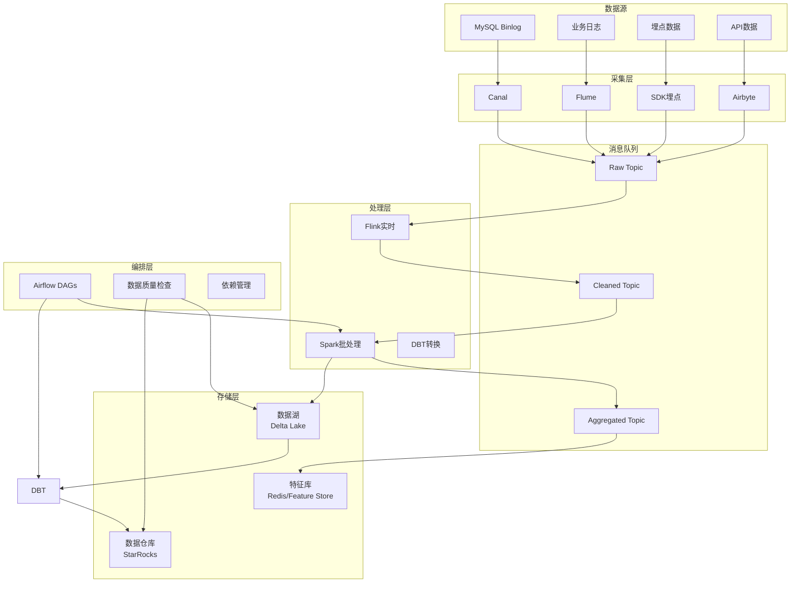
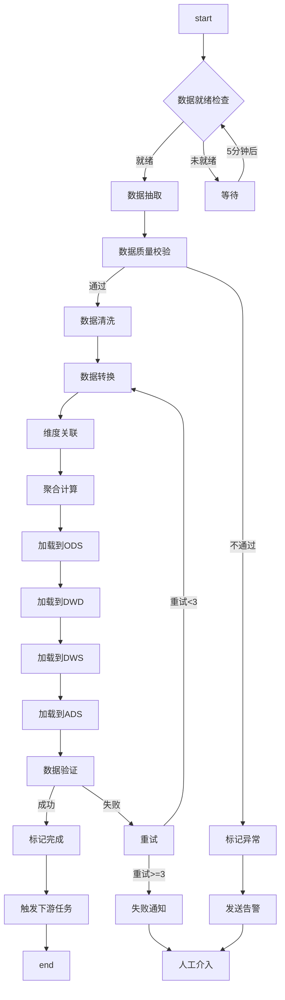
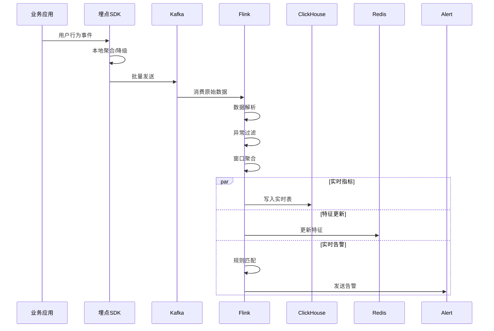
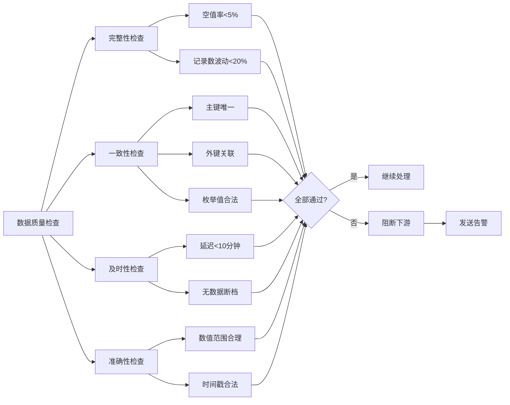

# 数据处理管道案例

## 业务场景描述

### 场景概述

某互联网数据平台每日处理PB级数据，涵盖数据采集、清洗、转换、加载、分析的完整数据管道。业务需求包括：

- **实时性要求**：核心指标延迟 < 5分钟
- **数据质量**：99.9%数据完整性，自动异常检测
- **可扩展性**：支持10倍流量突发
- **成本优化**：动态资源调度降低30%成本

### 数据流架构

```
业务系统 → 数据采集 → 消息队列 → 实时处理 → 数据仓库 → 分析查询
    ↓           ↓          ↓          ↓          ↓          ↓
  DB/日志   Flume/SDK   Kafka    Flink/Spark   Hive/      BI工具
                                     ↓         Iceberg
                                数据湖(Delta Lake)
```

### 核心数据管道

1. **用户行为管道**：埋点 → 清洗 → 实时分析 → 用户画像
2. **业务报表管道**：多源聚合 → 维度建模 → 日/周/月报
3. **推荐特征管道**：特征工程 → 模型训练 → 在线服务
4. **安全审计管道**：日志采集 → 风控规则 → 告警通知

---

## 工作流设计图

### 整体数据架构



### 主数据处理DAG



### 实时处理流程



### 数据质量检查工作流



---

## 关键技术选型

| 组件 | 技术选型 | 选型理由 |
|------|----------|----------|
| **工作流编排** | Apache Airflow | 业界标准、丰富生态、Python原生 |
| **实时计算** | Apache Flink | 真正的流处理、精确一次语义、低延迟 |
| **批处理** | Apache Spark | 大规模数据处理、生态丰富 |
| **数据转换** | DBT | 数据转换最佳实践、版本控制、测试 |
| **数据湖** | Delta Lake | ACID事务、时间旅行、Schema演进 |
| **数据仓库** | StarRocks | 高性能分析、实时更新、湖仓一体 |
| **质量监控** | Great Expectations | 数据测试框架、文档化期望 |

---

## 核心代码示例

### 1. Airflow DAG定义

```python
# dags/data_pipeline_dag.py
from airflow import DAG
from airflow.operators.python import PythonOperator
from airflow.providers.apache.spark.operators.spark_submit import SparkSubmitOperator
from airflow.providers.http.operators.http import SimpleHttpOperator
from airflow.sensors.external_task import ExternalTaskSensor
from airflow.utils.task_group import TaskGroup
from datetime import datetime, timedelta
import great_expectations as gx

# DAG默认参数
default_args = {
    'owner': 'data-platform',
    'depends_on_past': True,
    'email_on_failure': True,
    'email_on_retry': False,
    'email': ['data-team@company.com'],
    'retries': 2,
    'retry_delay': timedelta(minutes=5),
    'execution_timeout': timedelta(hours=2),
}

# 主数据处理DAG
with DAG(
    'main_data_pipeline',
    default_args=default_args,
    description='核心数据管道 - ODS -> DWD -> DWS -> ADS',
    schedule_interval='0 2 * * *',  # 每天凌晨2点
    start_date=datetime(2024, 1, 1),
    catchup=False,
    tags=['data-pipeline', 'core'],
    max_active_runs=1,
) as dag:

    # ========== 阶段1: 数据就绪检查 ==========
    check_source_ready = PythonOperator(
        task_id='check_source_data_ready',
        python_callable=check_data_ready,
        op_kwargs={
            'tables': ['source_orders', 'source_users', 'source_products'],
            'expected_delay_hours': 2,
        },
    )

    # ========== 阶段2: 数据抽取 (Spark) ==========
    with TaskGroup('extract_layer') as extract_layer:
        extract_orders = SparkSubmitOperator(
            task_id='extract_orders',
            application='/opt/spark-jobs/extract_orders.py',
            conn_id='spark_default',
            conf={
                'spark.executor.memory': '4g',
                'spark.executor.cores': '2',
                'spark.sql.adaptive.enabled': 'true',
            },
        )

        extract_users = SparkSubmitOperator(
            task_id='extract_users',
            application='/opt/spark-jobs/extract_users.py',
            conn_id='spark_default',
        )

        extract_products = SparkSubmitOperator(
            task_id='extract_products',
            application='/opt/spark-jobs/extract_products.py',
            conn_id='spark_default',
        )

    # ========== 阶段3: 数据质量检查 ==========
    with TaskGroup('data_quality') as data_quality:

        def check_completeness(**context):
            """完整性检查"""
            ds = context['ds']
            suite = gx.ExpectationSuite(name=f"completeness_{ds}")

            # 空值检查
            suite.add_expectation(
                gx.expectations.ExpectColumnValuesToNotBeNull(
                    column="order_id"
                )
            )

            # 记录数波动检查
            suite.add_expectation(
                gx.expectations.ExpectTableRowCountToBeBetween(
                    min_value=100000,
                    max_value=10000000
                )
            )

            # 执行验证
            checkpoint = gx.checkpoint.SimpleCheckpoint(
                name=f"completeness_check_{ds}",
                data_context=gx.get_context(),
                expectation_suite=suite,
            )
            result = checkpoint.run()

            if not result.success:
                raise ValueError("Data completeness check failed!")

            return "Completeness check passed"

        completeness_check = PythonOperator(
            task_id='completeness_check',
            python_callable=check_completeness,
        )

        def check_consistency(**context):
            """一致性检查"""
            ds = context['ds']

            # 主键唯一性
            suite = gx.ExpectationSuite(name=f"consistency_{ds}")
            suite.add_expectation(
                gx.expectations.ExpectColumnValuesToBeUnique(
                    column="order_id"
                )
            )

            # 外键关联检查
            suite.add_expectation(
                gx.expectations.ExpectColumnValuesToBeBetween(
                    column="user_id",
                    min_value=1,
                    max_value=999999999
                )
            )

            checkpoint = gx.checkpoint.SimpleCheckpoint(
                name=f"consistency_check_{ds}",
                data_context=gx.get_context(),
                expectation_suite=suite,
            )
            result = checkpoint.run()

            if not result.success:
                raise ValueError("Data consistency check failed!")

            return "Consistency check passed"

        consistency_check = PythonOperator(
            task_id='consistency_check',
            python_callable=check_consistency,
        )

        def check_freshness(**context):
            """及时性检查"""
            ds = context['ds']
            from airflow.providers.postgres.hooks.postgres import PostgresHook

            pg_hook = PostgresHook(postgres_conn_id='warehouse_db')
            sql = f"""
                SELECT MAX(created_at) as latest_time
                FROM ods.orders
                WHERE dt = '{ds}'
            """
            result = pg_hook.get_first(sql)
            latest_time = result[0]

            # 检查数据延迟
            delay_hours = (datetime.now() - latest_time).total_seconds() / 3600
            if delay_hours > 2:
                raise ValueError(f"Data delay too high: {delay_hours} hours")

            return f"Freshness check passed, delay: {delay_hours}h"

        freshness_check = PythonOperator(
            task_id='freshness_check',
            python_callable=check_freshness,
        )

        completeness_check >> consistency_check >> freshness_check

    # ========== 阶段4: 数据清洗与转换 ==========
    clean_and_transform = SparkSubmitOperator(
        task_id='clean_transform',
        application='/opt/spark-jobs/clean_transform.py',
        conn_id='spark_default',
        conf={
            'spark.executor.memory': '8g',
            'spark.executor.cores': '4',
            'spark.sql.adaptive.coalescePartitions.enabled': 'true',
        },
    )

    # ========== 阶段5: DBT模型转换 ==========
    with TaskGroup('dbt_models') as dbt_models:

        # DBT运行DWD层
        dbt_run_dwd = PythonOperator(
            task_id='dbt_run_dwd',
            python_callable=run_dbt,
            op_kwargs={
                'models': 'dwd',
                'target': 'prod',
            },
        )

        # DBT运行DWS层
        dbt_run_dws = PythonOperator(
            task_id='dbt_run_dws',
            python_callable=run_dbt,
            op_kwargs={
                'models': 'dws',
                'target': 'prod',
            },
        )

        # DBT运行ADS层
        dbt_run_ads = PythonOperator(
            task_id='dbt_run_ads',
            python_callable=run_dbt,
            op_kwargs={
                'models': 'ads',
                'target': 'prod',
            },
        )

        # DBT测试
        dbt_test = PythonOperator(
            task_id='dbt_test',
            python_callable=run_dbt,
            op_kwargs={
                'command': 'test',
                'target': 'prod',
            },
        )

        dbt_run_dwd >> dbt_run_dws >> dbt_run_ads >> dbt_test

    # ========== 阶段6: 数据验证与发布 ==========
    def validate_and_publish(**context):
        """验证数据并发布"""
        ds = context['ds']

        # 对比校验
        from airflow.providers.postgres.hooks.postgres import PostgresHook
        pg_hook = PostgresHook(postgres_conn_id='warehouse_db')

        # 检查汇总指标
        sql = f"""
            SELECT
                COUNT(*) as total_orders,
                SUM(order_amount) as total_amount
            FROM dws.order_daily_summary
            WHERE dt = '{ds}'
        """
        result = pg_hook.get_first(sql)

        if result[0] == 0:
            raise ValueError("No data in summary table!")

        # 发布数据（更新元数据、刷新缓存等）
        publish_to_api(ds)
        refresh_cache(ds)

        return f"Published data for {ds}"

    validate_publish = PythonOperator(
        task_id='validate_and_publish',
        python_callable=validate_and_publish,
    )

    # ========== 阶段7: 依赖任务触发 ==========
    trigger_downstream = SimpleHttpOperator(
        task_id='trigger_downstream',
        http_conn_id='airflow_api',
        endpoint='/api/v1/dags/ml_feature_pipeline/dagRuns',
        method='POST',
        headers={"Content-Type": "application/json"},
        data=json.dumps({"conf": {}, "note": "Triggered by main pipeline"}),
    )

    # ========== 失败处理 ==========
    def on_failure_callback(context):
        """失败回调通知"""
        task_instance = context['task_instance']
        send_alert(
            title=f"Data Pipeline Failed: {task_instance.task_id}",
            message=f"DAG: {task_instance.dag_id}, Run Date: {context['ds']}",
            severity='high'
        )

    # 设置失败回调
    dag.on_failure_callback = on_failure_callback

    # ========== 依赖关系 ==========
    check_source_ready >> extract_layer >> data_quality >> clean_and_transform >> dbt_models >> validate_publish >> trigger_downstream
```

### 2. Flink实时处理Job

```java
// src/main/java/com/company/flink/UserBehaviorJob.java
package com.company.flink;

import org.apache.flink.streaming.api.environment.StreamExecutionEnvironment;
import org.apache.flink.streaming.api.windowing.assigners.TumblingProcessingTimeWindows;
import org.apache.flink.streaming.api.windowing.time.Time;
import org.apache.flink.connector.kafka.source.KafkaSource;
import org.apache.flink.connector.kafka.sink.KafkaSink;
import org.apache.flink.api.common.eventtime.WatermarkStrategy;
import org.apache.flink.api.common.serialization.SimpleStringSchema;

public class UserBehaviorJob {

    public static void main(String[] args) throws Exception {
        StreamExecutionEnvironment env = StreamExecutionEnvironment.getExecutionEnvironment();

        // 配置检查点
        env.enableCheckpointing(60000); // 1分钟检查点
        env.getCheckpointConfig().setCheckpointingMode(CheckpointingMode.EXACTLY_ONCE);
        env.getCheckpointConfig().setMinPauseBetweenCheckpoints(30000);

        // 配置状态后端
        EmbeddedRocksDBStateBackend rocksDbBackend = new EmbeddedRocksDBStateBackend(true);
        env.setStateBackend(rocksDbBackend);
        env.getCheckpointConfig().setCheckpointStorage("hdfs://namenode:8020/flink/checkpoints");

        // Kafka Source - 埋点数据
        KafkaSource<String> source = KafkaSource.<String>builder()
            .setBootstrapServers("kafka:9092")
            .setTopics("user-behavior-raw")
            .setGroupId("flink-user-behavior")
            .setStartingOffsets(OffsetsInitializer.latest())
            .setValueOnlyDeserializer(new SimpleStringSchema())
            .build();

        DataStream<String> stream = env.fromSource(
            source,
            WatermarkStrategy.forBoundedOutOfOrderness(Duration.ofSeconds(5)),
            "Kafka Source"
        );

        // 数据解析
        DataStream<UserEvent> events = stream
            .map(new EventParser())
            .filter(event -> event != null && event.isValid())
            .assignTimestampsAndWatermarks(
                WatermarkStrategy.<UserEvent>forBoundedOutOfOrderness(Duration.ofSeconds(10))
                    .withTimestampAssigner((event, timestamp) -> event.getTimestamp())
            );

        // 数据清洗
        SingleOutputStreamOperator<UserEvent> cleaned = events
            .map(new DataCleaner())
            .filter(event -> event.getEventType() != null);

        // 分流：异常数据进入侧输出
        OutputTag<UserEvent> dirtyDataTag = new OutputTag<UserEvent>("dirty-data"){};
        SingleOutputStreamOperator<UserEvent> validData = cleaned
            .process(new DataValidationProcessFunction(dirtyDataTag));

        // 侧输出流处理
        DataStream<UserEvent> dirtyData = validData.getSideOutput(dirtyDataTag);
        dirtyData.addSink(new DirtyDataSink());

        // 窗口聚合 - 每分钟PV/UV
        DataStream<PageViewStats> pageViewStats = validData
            .keyBy(UserEvent::getPageId)
            .window(TumblingProcessingTimeWindows.of(Time.minutes(1)))
            .aggregate(new PageViewAggregateFunction());

        // 写入ClickHouse
        pageViewStats.addSink(new ClickHouseSink<>(
            "jdbc:clickhouse://clickhouse:8123/analytics",
            "INSERT INTO page_view_stats (page_id, pv, uv, window_start, window_end) VALUES (?, ?, ?, ?, ?)"
        ));

        // 会话窗口 - 用户会话分析
        DataStream<SessionStats> sessionStats = validData
            .keyBy(UserEvent::getUserId)
            .window(EventTimeSessionWindows.withGap(Time.minutes(30)))
            .aggregate(new SessionAggregateFunction());

        // 写入Redis用于实时查询
        sessionStats.addSink(new RedisSink<>(
            new RedisMapper<SessionStats>() {
                @Override
                public RedisCommandDescription getCommandDescription() {
                    return new RedisCommandDescription(RedisCommand.SETEX);
                }

                @Override
                public String getKeyFromData(SessionStats data) {
                    return "session:" + data.getUserId();
                }

                @Override
                public String getValueFromData(SessionStats data) {
                    return data.toJson();
                }

                @Override
                public Integer getSecondsFromData(SessionStats data) {
                    return 3600; // 1小时过期
                }
            }
        ));

        // 启动Job
        env.execute("User Behavior Analytics Job");
    }
}

// 数据清洗函数
class DataCleaner implements MapFunction<UserEvent, UserEvent> {
    @Override
    public UserEvent map(UserEvent event) throws Exception {
        // 敏感字段脱敏
        if (event.getPhone() != null) {
            event.setPhone(desensitizePhone(event.getPhone()));
        }

        // 字段标准化
        event.setEventType(normalizeEventType(event.getEventType()));

        // 过滤测试数据
        if (isTestUser(event.getUserId())) {
            event.setIsTest(true);
        }

        return event;
    }
}

// 数据验证处理函数
class DataValidationProcessFunction extends ProcessFunction<UserEvent, UserEvent> {
    private final OutputTag<UserEvent> dirtyDataTag;

    public DataValidationProcessFunction(OutputTag<UserEvent> dirtyDataTag) {
        this.dirtyDataTag = dirtyDataTag;
    }

    @Override
    public void processElement(UserEvent event, Context ctx, Collector<UserEvent> out) {
        // 验证规则
        List<String> errors = new ArrayList<>();

        if (event.getUserId() == null || event.getUserId().isEmpty()) {
            errors.add("missing_user_id");
        }

        if (event.getTimestamp() > System.currentTimeMillis() + 60000) {
            errors.add("future_timestamp");
        }

        if (event.getTimestamp() < System.currentTimeMillis() - 86400000) {
            errors.add("stale_timestamp");
        }

        if (!errors.isEmpty()) {
            event.setValidationErrors(errors);
            ctx.output(dirtyDataTag, event);
        } else {
            out.collect(event);
        }
    }
}
```

### 3. DBT数据模型

```sql
-- models/dwd/dwd_orders.sql
-- 订单明细事实表

{{ config(
    materialized='incremental',
    unique_key='order_id',
    incremental_strategy='merge',
    partition_by={
        "field": "dt",
        "data_type": "date",
        "granularity": "day"
    }
) }}

WITH source_orders AS (
    SELECT *
    FROM {{ source('ods', 'orders') }}
    
    WHERE dt = '{{ var("execution_date") }}'
    
),

source_order_items AS (
    SELECT *
    FROM {{ source('ods', 'order_items') }}
    
    WHERE dt = '{{ var("execution_date") }}'
    
),

dim_users AS (
    SELECT *
    FROM {{ ref('dim_users') }}
),

dim_products AS (
    SELECT *
    FROM {{ ref('dim_products') }}
),

enriched_orders AS (
    SELECT
        o.order_id,
        o.user_id,
        o.order_status,
        o.order_amount,
        o.payment_amount,
        o.discount_amount,
        o.shipping_fee,
        o.created_at,
        o.paid_at,
        o.shipped_at,
        o.completed_at,
        o.dt,

        -- 用户信息
        u.user_name,
        u.user_level,
        u.register_date,
        u.user_age_segment,
        u.user_city_level,

        -- 订单统计
        COUNT(DISTINCT oi.product_id) AS product_count,
        SUM(oi.quantity) AS total_quantity,

        -- 计算字段
        CASE
            WHEN o.payment_amount >= 1000 THEN 'high_value'
            WHEN o.payment_amount >= 500 THEN 'medium_value'
            ELSE 'low_value'
        END AS order_value_segment,

        TIMESTAMP_DIFF(o.paid_at, o.created_at, MINUTE) AS pay_latency_minutes,

        -- 数据质量标记
        CASE
            WHEN o.order_amount < 0 THEN 'invalid_amount'
            WHEN o.payment_amount > o.order_amount * 1.5 THEN 'suspicious_discount'
            ELSE 'normal'
        END AS data_quality_flag

    FROM source_orders o
    LEFT JOIN source_order_items oi ON o.order_id = oi.order_id
    LEFT JOIN dim_users u ON o.user_id = u.user_id
    WHERE o.order_id IS NOT NULL
    GROUP BY 1,2,3,4,5,6,7,8,9,10,11,12,13,14,15,16,17
)

SELECT *
FROM enriched_orders
WHERE data_quality_flag != 'invalid_amount'
```

```sql
-- models/dws/dws_order_daily_summary.sql
-- 订单日汇总表

{{ config(
    materialized='incremental',
    unique_key=['dt', 'user_level'],
    partition_by={
        "field": "dt",
        "data_type": "date"
    }
) }}

WITH daily_stats AS (
    SELECT
        dt,
        user_level,

        -- 订单指标
        COUNT(DISTINCT order_id) AS total_orders,
        COUNT(DISTINCT CASE WHEN order_status = 'completed' THEN order_id END) AS completed_orders,
        COUNT(DISTINCT CASE WHEN order_status = 'cancelled' THEN order_id END) AS cancelled_orders,

        -- 金额指标
        SUM(order_amount) AS gmv,
        SUM(payment_amount) AS actual_payment,
        SUM(discount_amount) AS total_discount,
        AVG(payment_amount) AS avg_order_value,

        -- 用户指标
        COUNT(DISTINCT user_id) AS unique_buyers,
        COUNT(DISTINCT CASE WHEN pay_latency_minutes <= 10 THEN user_id END) AS quick_payers,

        -- 分布指标
        APPROX_QUANTILES(order_amount, 100)[OFFSET(50)] AS median_order_value,
        APPROX_QUANTILES(order_amount, 100)[OFFSET(90)] AS p90_order_value,

        -- 时间维度
        CURRENT_TIMESTAMP() AS etl_time

    FROM {{ ref('dwd_orders') }}
    
    WHERE dt = '{{ var("execution_date") }}'
    
    GROUP BY dt, user_level
)

SELECT *
FROM daily_stats
```

```yaml
# models/schema.yml
version: 2

models:
  - name: dwd_orders
    description: "订单明细事实表"
    columns:
      - name: order_id
        description: "订单ID"
        tests:
          - unique
          - not_null
      - name: user_id
        description: "用户ID"
        tests:
          - not_null
          - relationships:
              to: ref('dim_users')
              field: user_id
      - name: order_amount
        description: "订单金额"
        tests:
          - not_null
          - dbt_utils.accepted_range:
              min_value: 0
              max_value: 1000000
      - name: data_quality_flag
        description: "数据质量标记"
        tests:
          - accepted_values:
              values: ['normal', 'suspicious_discount']

  - name: dws_order_daily_summary
    description: "订单日汇总表"
    columns:
      - name: dt
        description: "日期"
        tests:
          - not_null
      - name: gmv
        description: "成交总额"
        tests:
          - not_null
          - dbt_utils.accepted_range:
              min_value: 0
```

### 4. 数据质量检查

```python
# quality/checks/custom_checks.py
from great_expectations.expectations import Expectation
from great_expectations.core import ExpectationValidationResult
from typing import Dict, Any

class ExpectTableRowCountToMatchSource(Expectation):
    """检查目标表行数与源表匹配"""

    def _validate(
        self,
        configuration,
        metrics,
        runtime_configuration=None,
        execution_engine=None,
    ):
        actual_count = metrics.get("table.row_count")
        expected_count = configuration["kwargs"].get("expected_count")
        tolerance = configuration["kwargs"].get("tolerance", 0.05)

        diff_ratio = abs(actual_count - expected_count) / expected_count
        success = diff_ratio <= tolerance

        return ExpectationValidationResult(
            success=success,
            result={
                "observed_value": actual_count,
                "expected_value": expected_count,
                "difference_ratio": diff_ratio,
            },
        )

# 数据血缘追踪
def track_lineage(table_name: str, source_tables: list, transformation: str):
    """记录数据血缘关系"""
    lineage = {
        "target": table_name,
        "sources": source_tables,
        "transformation": transformation,
        "timestamp": datetime.now().isoformat(),
    }

    # 发送到元数据服务
    requests.post(
        "http://metadata-service:8080/lineage",
        json=lineage
    )

# 自定义数据质量指标
def calculate_quality_score(table_name: str, checks: list) -> float:
    """计算数据质量综合得分"""
    scores = []

    for check in checks:
        if check["type"] == "completeness":
            score = check["null_rate"] * 100
        elif check["type"] == "consistency":
            score = check["match_rate"] * 100
        elif check["type"] == "freshness":
            score = max(0, 100 - check["delay_minutes"])
        elif check["type"] == "accuracy":
            score = check["accuracy_rate"] * 100

        scores.append(score * check["weight"])

    return sum(scores) / sum(c["weight"] for c in checks)
```

---

## 遇到的问题和解决方案

### 问题1：数据倾斜导致处理慢

**现象**：某些key数据量过大，Spark任务卡死
**解决方案**：

1. 加盐技术打散热点key
2. 两阶段聚合
3. 动态资源分配

```python
# 加盐处理
def salt_key(key, num_salts=10):
    """为key添加随机盐值"""
    import random
    salt = random.randint(0, num_salts - 1)
    return f"{salt}_{key}"

# 两阶段聚合
def two_stage_aggregate(df, group_key, agg_col):
    """两阶段聚合避免倾斜"""
    # 第一阶段：局部聚合（加盐）
    df_with_salt = df.withColumn("salted_key", salt_key(col(group_key)))
    partial_agg = df_with_salt.groupBy("salted_key").agg(sum(agg_col).alias("partial_sum"))

    # 第二阶段：全局聚合
    final_agg = partial_agg.withColumn("original_key", split(col("salted_key"), "_")[1]) \
                           .groupBy("original_key") \
                           .agg(sum("partial_sum").alias("total"))
    return final_agg
```

### 问题2：Airflow任务依赖复杂

**现象**：DAG之间依赖难以管理，循环依赖检测困难
**解决方案**：

1. 使用ExternalTaskSensor跨DAG依赖
2. 引入数据触发器（Dataset）
3. 统一数据依赖管理平台

```python
# Airflow 2.4+ 使用Dataset
from airflow.datasets import Dataset

raw_data = Dataset("s3://data-lake/raw/orders/")
processed_data = Dataset("s3://data-lake/processed/orders/")

# 生产数据的任务
extract_task = BashOperator(
    task_id="extract",
    bash_command="extract_orders.sh",
    outlets=[raw_data],  # 声明产出
)

# 消费数据的任务
transform_task = BashOperator(
    task_id="transform",
    bash_command="transform_orders.sh",
    inlets=[raw_data],   # 声明依赖
    outlets=[processed_data],
)
```

### 问题3：实时与离线数据不一致

**现象**：实时统计与离线报表数据差异
**解决方案**：

1. Lambda架构 → Kappa架构
2. 统一数据源（Kafka）
3. 实时离线使用相同计算逻辑

### 问题4：数据质量问题发现滞后

**现象**：质量问题下游才发现，影响范围大
**解决方案**：

1. 每个环节嵌入质量检查
2. 自动阻断机制
3. 数据质量仪表盘

---

## 性能数据

### 批处理性能（Spark）

| 场景 | 数据量 | 执行时间 | 资源消耗 |
|------|--------|----------|----------|
| 日增量ETL | 50亿行 | 45分钟 | 200 vCPU, 800GB |
| 全量历史回溯 | 1000亿行 | 4小时 | 400 vCPU, 1.6TB |
| 复杂关联分析 | 100亿 × 10亿 | 2小时 | 300 vCPU, 1.2TB |

### 实时处理性能（Flink）

| 指标 | 峰值 | 平均值 |
|------|------|--------|
| **输入TPS** | 200万/秒 | 80万/秒 |
| **处理延迟** | 2秒 | 500ms |
| **Checkpoint时长** | 30秒 | 15秒 |
| **状态大小** | 2TB | 800GB |

### 存储性能

| 存储 | 查询类型 | 响应时间 |
|------|----------|----------|
| **StarRocks** | 聚合查询 | < 100ms |
| **ClickHouse** | 时序分析 | < 500ms |
| **Delta Lake** | 全表扫描 | 分钟级 |

---

## 与理论模型的映射

### 1. Lambda架构

- **批处理层**：Airflow + Spark处理历史数据
- **速度层**：Flink处理实时数据
- **服务层**：StarRocks统一查询接口

### 2. ETL vs ELT

- **传统ETL**：数据清洗在加载前
- **现代ELT**：先加载到数据湖，再转换（DBT）
- **选择依据**：数据量、复杂度、灵活性需求

### 3. 数据血缘

- **自动追踪**：Airflow + DBT内置血缘
- **影响分析**：变更影响范围自动识别
- **合规审计**：完整数据处理链路

### 4. 数据质量框架

- **Great Expectations**：声明式数据测试
- **Soda Core**：数据质量监控
- **Monte Carlo**：数据可观测性

### 5. 流批一体

- **统一计算引擎**：Flink支持流批一体
- **统一存储**：Delta Lake支持增量处理
- **统一元数据**：Hive Metastore统一Catalog

---

## 成本优化实践

### 1. 动态资源调度

```python
# 根据数据量动态调整资源
def get_dynamic_resources(execution_date):
    """基于历史数据预测资源需求"""
    from airflow.providers.postgres.hooks.postgres import PostgresHook

    pg_hook = PostgresHook(postgres_conn_id='metadata_db')
    sql = f"""
        SELECT AVG(record_count) as avg_count
        FROM data_volume_stats
        WHERE dt >= '{execution_date}' - INTERVAL '30 days'
        AND dt < '{execution_date}'
    """
    result = pg_hook.get_first(sql)
    avg_count = result[0]

    # 根据数据量计算资源
    if avg_count < 1000000:
        return {'executor_memory': '2g', 'executor_cores': '2'}
    elif avg_count < 10000000:
        return {'executor_memory': '4g', 'executor_cores': '4'}
    else:
        return {'executor_memory': '8g', 'executor_cores': '8'}
```

### 2. 分层存储

- **热数据**：SSD存储，最近7天
- **温数据**：HDD存储，7-90天
- **冷数据**：对象存储，90天以上

---

## 相关文档

- [数据管道架构](../02-架构设计/03-数据管道架构.md)
- [Airflow最佳实践](../03-技术架构/04-Airflow配置.md)
- [Flink流处理](../03-技术架构/05-实时计算.md)
