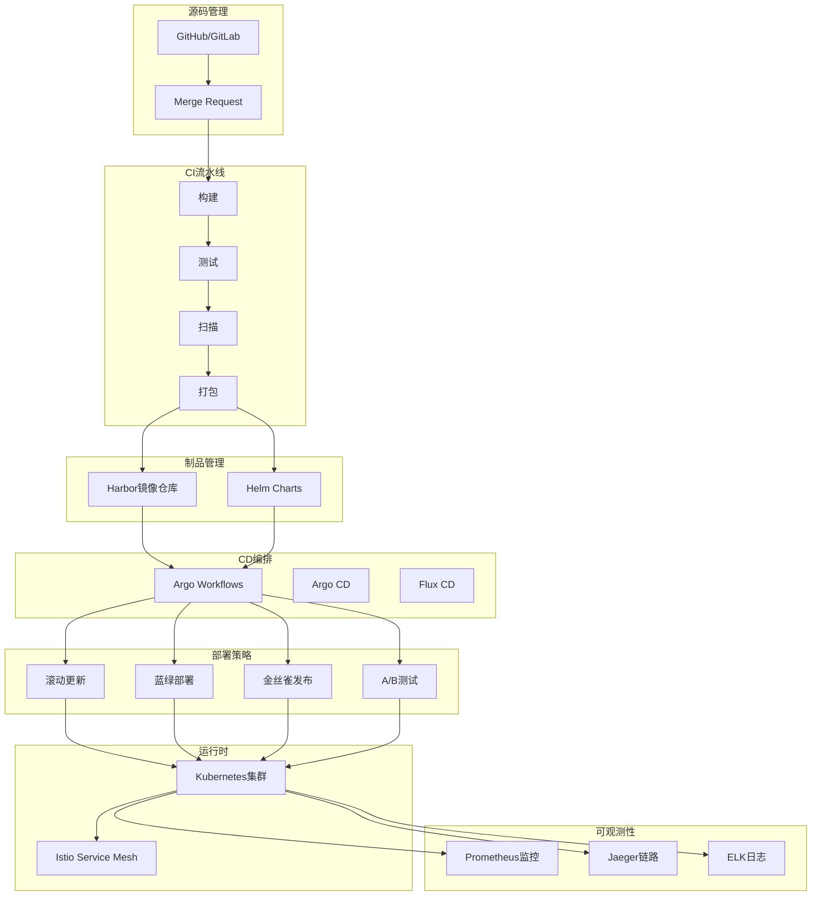
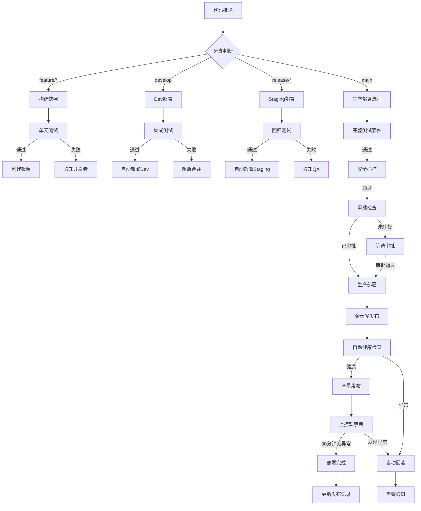
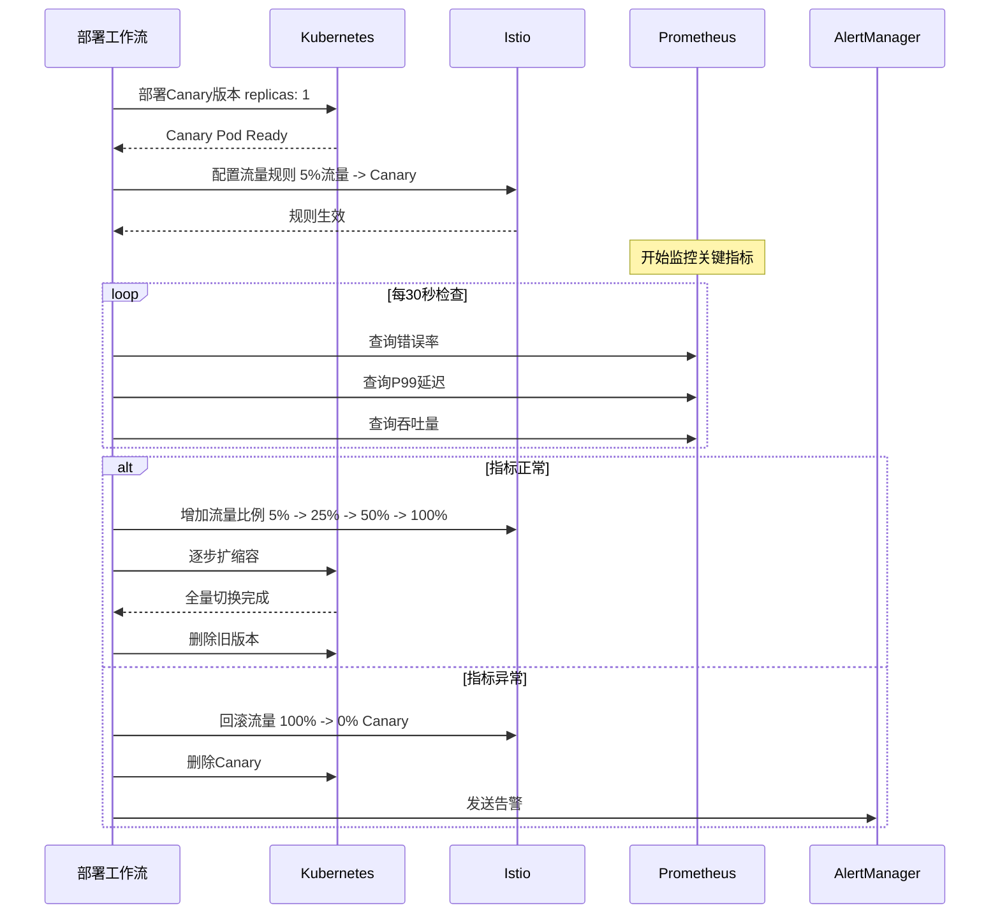

# DevOps部署工作流案例

## 业务场景描述

### 场景概述

某中型互联网公司拥有50+微服务，日均部署次数200+。部署工作流需要满足：

- **快速迭代**：从代码提交到生产部署 < 30分钟
- **零停机**：蓝绿部署/金丝雀发布
- **自动回滚**：异常自动检测并回滚
- **多环境管理**：开发、测试、预发、生产一致性
- **合规审计**：完整部署记录和审批流程

### 部署流程

```
代码提交 → 构建 → 单元测试 → 安全扫描 → 镜像构建 → 部署测试环境
    ↓                                                         ↓
  代码评审 ← 集成测试 ← 性能测试 ← 集成测试 ← 部署预发 ← 人工审批
    ↓
  生产部署 → 健康检查 → 流量切换 → 监控观察 → 完成/回滚
```

### 核心挑战

1. **依赖管理**：服务间依赖复杂，启动顺序关键
2. **配置管理**：多环境配置一致性
3. **版本控制**：镜像版本与代码版本对应
4. **故障恢复**：快速回滚能力

---

## 工作流设计图

### 整体CI/CD架构



### 主部署工作流



### 金丝雀发布流程



---

## 关键技术选型

| 组件 | 技术选型 | 选型理由 |
|------|----------|----------|
| **CI引擎** | GitHub Actions / GitLab CI | 与代码托管集成、丰富生态 |
| **CD工作流** | Argo Workflows | Kubernetes原生、复杂工作流编排 |
| **GitOps** | Argo CD | 声明式部署、自动同步、回滚 |
| **服务网格** | Istio | 流量管理、金丝雀发布、可观测 |
| **镜像仓库** | Harbor | 企业级、漏洞扫描、多复制 |
| **监控** | Prometheus + Grafana | 云原生标准、灵活告警 |

---

## 核心代码示例

### 1. Argo Workflow部署工作流

```yaml
# workflows/deploy-pipeline.yaml
apiVersion: argoproj.io/v1alpha1
kind: Workflow
metadata:
  generateName: deploy-pipeline-
spec:
  entrypoint: deploy-main
  serviceAccountName: argo-deployer

  arguments:
    parameters:
      - name: service-name
        value: "user-service"
      - name: image-tag
        value: "latest"
      - name: environment
        value: "staging"
      - name: git-sha
        value: ""

  templates:
    - name: deploy-main
      dag:
        tasks:
          - name: validate-input
            template: validate-input

          - name: security-scan
            template: security-scan
            dependencies: [validate-input]

          - name: unit-tests
            template: run-tests
            arguments:
              parameters:
                - name: test-type
                  value: "unit"
            dependencies: [validate-input]

          - name: integration-tests
            template: run-tests
            arguments:
              parameters:
                - name: test-type
                  value: "integration"
            dependencies: [validate-input]

          - name: build-image
            template: build-push-image
            dependencies: [security-scan, unit-tests]

          - name: deploy
            template: k8s-deploy
            dependencies: [build-image, integration-tests]

          - name: health-check
            template: health-check
            dependencies: [deploy]

          - name: canary-deploy
            template: canary-deployment
            dependencies: [health-check]
            when: "{{workflow.parameters.environment}} == 'production'"

          - name: notify-success
            template: send-notification
            arguments:
              parameters:
                - name: status
                  value: "success"
            dependencies: [canary-deploy]

    - name: validate-input
      script:
        image: alpine:latest
        command: [sh]
        source: |
          echo "Validating deployment parameters..."
          SERVICE="{{workflow.parameters.service-name}}"
          ENV="{{workflow.parameters.environment}}"

          if [ -z "$SERVICE" ]; then
            echo "Error: service-name is required"
            exit 1
          fi

          if [[ ! "$ENV" =~ ^(dev|staging|production)$ ]]; then
            echo "Error: invalid environment"
            exit 1
          fi

          echo "Validation passed!"

    - name: security-scan
      container:
        image: aquasec/trivy:latest
        command: [sh, -c]
        args:
          - trivy fs --exit-code 1 --severity HIGH,CRITICAL /src
        volumeMounts:
          - name: source
            mountPath: /src
      volumes:
        - name: source
          git:
            repo: "https://github.com/company/repo.git"
            revision: "{{workflow.parameters.git-sha}}"

    - name: run-tests
      inputs:
        parameters:
          - name: test-type
      container:
        image: "golang:1.21"
        command: [sh, -c]
        args:
          - go test -v ./...

    - name: build-push-image
      container:
        image: gcr.io/kaniko-project/executor:latest
        command: ["/kaniko/executor"]
        args:
          - --dockerfile=/src/Dockerfile
          - --context=/src
          - --destination=harbor.company.com/{{workflow.parameters.service-name}}:{{workflow.parameters.image-tag}}
          - --cache=true

    - name: k8s-deploy
      resource:
        action: apply
        manifest: |
          apiVersion: apps/v1
          kind: Deployment
          metadata:
            name: {{workflow.parameters.service-name}}
            namespace: {{workflow.parameters.environment}}
          spec:
            replicas: 3
            selector:
              matchLabels:
                app: {{workflow.parameters.service-name}}
            template:
              metadata:
                labels:
                  app: {{workflow.parameters.service-name}}
                  version: {{workflow.parameters.image-tag}}
              spec:
                containers:
                - name: app
                  image: harbor.company.com/{{workflow.parameters.service-name}}:{{workflow.parameters.image-tag}}
                  ports:
                  - containerPort: 8080
                  readinessProbe:
                    httpGet:
                      path: /health/ready
                      port: 8080
                    initialDelaySeconds: 10
                    periodSeconds: 5

    - name: health-check
      script:
        image: bitnami/kubectl:latest
        command: [bash]
        source: |
          SERVICE="{{workflow.parameters.service-name}}"
          kubectl rollout status deployment/$SERVICE --timeout=300s

    - name: canary-deployment
      resource:
        action: apply
        manifest: |
          apiVersion: flagger.app/v1beta1
          kind: Canary
          metadata:
            name: {{workflow.parameters.service-name}}
          spec:
            targetRef:
              apiVersion: apps/v1
              kind: Deployment
              name: {{workflow.parameters.service-name}}
            service:
              port: 8080
            analysis:
              interval: 30s
              threshold: 5
              maxWeight: 50
              stepWeight: 10

    - name: send-notification
      inputs:
        parameters:
          - name: status
      container:
        image: curlimages/curl:latest
        command: [sh, -c]
        args:
          - curl -X POST https://hooks.slack.com/services/xxx
```

### 2. GitLab CI配置

```yaml
# .gitlab-ci.yml
stages:
  - build
  - test
  - security
  - package
  - deploy

variables:
  DOCKER_REGISTRY: "harbor.company.com"
  SERVICE_NAME: "user-service"

build:
  stage: build
  image: golang:1.21-alpine
  script:
    - go mod download
    - go build -o bin/$SERVICE_NAME ./cmd/server
  artifacts:
    paths:
      - bin/
    expire_in: 1 hour

unit-test:
  stage: test
  image: golang:1.21-alpine
  script:
    - go test -v -race -coverprofile=coverage.out ./...
    - go tool cover -func=coverage.out
  coverage: '/total:\s+\(statements\)\s+\d+.\d+%/'

integration-test:
  stage: test
  image: docker:24-dind
  services:
    - docker:24-dind
  script:
    - docker-compose -f docker-compose.test.yml up --abort-on-container-exit
  only:
    - merge_requests
    - develop
    - main

security-scan:
  stage: security
  image: aquasec/trivy:latest
  script:
    - trivy fs --format template --template "@contrib/gitlab.tpl" -o gl-dependency-scanning.json .
  artifacts:
    reports:
      dependency_scanning: gl-dependency-scanning.json
  allow_failure: true

docker-build:
  stage: package
  image: docker:24-dind
  services:
    - docker:24-dind
  before_script:
    - echo $HARBOR_PASSWORD | docker login -u $HARBOR_USER --password-stdin $DOCKER_REGISTRY
  script:
    - docker build -t $DOCKER_REGISTRY/$SERVICE_NAME:$CI_COMMIT_SHA .
    - docker push $DOCKER_REGISTRY/$SERVICE_NAME:$CI_COMMIT_SHA
  only:
    - develop
    - main
    - tags

deploy-dev:
  stage: deploy
  image: bitnami/kubectl:latest
  environment:
    name: development
    url: https://dev-api.company.com
  script:
    - kubectl config use-context dev
    - helm upgrade --install $SERVICE_NAME ./helm-chart
        --namespace dev
        --set image.tag=$CI_COMMIT_SHA
  only:
    - develop

deploy-staging:
  stage: deploy
  image: bitnami/kubectl:latest
  environment:
    name: staging
    url: https://staging-api.company.com
  script:
    - kubectl config use-context staging
    - helm upgrade --install $SERVICE_NAME ./helm-chart
        --namespace staging
        --set image.tag=$CI_COMMIT_SHA
  only:
    - main

deploy-production:
  stage: deploy
  image: bitnami/kubectl:latest
  environment:
    name: production
    url: https://api.company.com
  when: manual
  script:
    - kubectl config use-context production
    - helm upgrade --install $SERVICE_NAME ./helm-chart
        --namespace production
        --set image.tag=$CI_COMMIT_SHA
        --set canary.enabled=true
  only:
    - tags
```

### 3. 金丝雀发布控制器

```python
# scripts/canary_controller.py
#!/usr/bin/env python3
"""金丝雀发布控制器"""

import time
import requests
import argparse
from dataclasses import dataclass

@dataclass
class CanaryConfig:
    service_name: str
    namespace: str
    initial_weight: int = 5
    step_weight: int = 10
    max_weight: int = 50
    analysis_interval: int = 30
    success_rate_threshold: float = 95.0
    latency_threshold_ms: int = 500

class CanaryController:
    def __init__(self, config: CanaryConfig):
        self.config = config
        self.prometheus_url = "http://prometheus.monitoring:9090"

    def start_canary(self, image_tag: str) -> bool:
        """启动金丝雀发布"""
        print(f"Starting canary deployment for {self.config.service_name}:{image_tag}")

        # 部署canary版本
        if not self._deploy_canary(image_tag):
            return False

        # 开始渐进式发布
        return self._progressive_rollout()

    def _progressive_rollout(self) -> bool:
        """渐进式流量切换"""
        current_weight = self.config.initial_weight

        while current_weight <= self.config.max_weight:
            print(f"\n--- Traffic weight: {current_weight}% ---")

            # 配置流量分割
            self._set_traffic_weight(current_weight)

            # 等待并收集指标
            time.sleep(self.config.analysis_interval)

            metrics = self._collect_metrics()
            print(f"Success rate: {metrics['success_rate']:.2f}%")
            print(f"P99 latency: {metrics['p99_latency']}ms")

            # 检查指标
            if not self._check_metrics(metrics):
                print("Metrics check failed! Rolling back...")
                self.rollback()
                return False

            # 增加流量
            current_weight += self.config.step_weight

        # 完成发布
        print("Canary analysis passed! Promoting to full release...")
        self._promote_to_production()
        return True

    def _collect_metrics(self) -> dict:
        """收集Prometheus指标"""

        # 查询成功率
        success_query = f'''
        sum(rate(http_requests_total{{service="{self.config.service_name}",status=~"2.."}}[1m]))
        / sum(rate(http_requests_total{{service="{self.config.service_name}"}}[1m])) * 100
        '''

        # 查询P99延迟
        latency_query = f'''
        histogram_quantile(0.99,
            sum(rate(http_request_duration_seconds_bucket{{service="{self.config.service_name}"}}[1m])) by (le)
        ) * 1000
        '''

        success_rate = self._query_prometheus(success_query) or 100.0
        p99_latency = self._query_prometheus(latency_query) or 0.0

        return {
            'success_rate': success_rate,
            'p99_latency': p99_latency
        }

    def _check_metrics(self, metrics: dict) -> bool:
        """检查指标是否满足条件"""
        if metrics['success_rate'] < self.config.success_rate_threshold:
            print(f"Success rate {metrics['success_rate']:.2f}% below threshold")
            return False

        if metrics['p99_latency'] > self.config.latency_threshold_ms:
            print(f"P99 latency {metrics['p99_latency']}ms exceeds threshold")
            return False

        return True

    def _query_prometheus(self, query: str) -> float:
        """查询Prometheus"""
        try:
            resp = requests.get(f"{self.prometheus_url}/api/v1/query", params={'query': query})
            data = resp.json()
            if data['status'] == 'success' and data['data']['result']:
                return float(data['data']['result'][0]['value'][1])
        except Exception as e:
            print(f"Prometheus query failed: {e}")
        return None

    def rollback(self):
        """回滚金丝雀"""
        print("Rolling back canary deployment...")
        self._set_traffic_weight(0)
        # 删除canary deployment
        requests.delete(
            f"k8s-api/apis/apps/v1/namespaces/{self.config.namespace}/deployments/{self.config.service_name}-canary"
        )

    def _set_traffic_weight(self, weight: int):
        """设置Istio流量权重"""
        print(f"Setting traffic weight to {weight}%")
        # 调用K8s API更新VirtualService

    def _deploy_canary(self, image_tag: str) -> bool:
        """部署canary版本"""
        print(f"Deploying canary version: {image_tag}")
        return True

    def _promote_to_production(self):
        """提升为生产版本"""
        print("Promoting to production...")

if __name__ == "__main__":
    parser = argparse.ArgumentParser()
    parser.add_argument("--service", required=True)
    parser.add_argument("--tag", required=True)
    args = parser.parse_args()

    config = CanaryConfig(service_name=args.service, namespace="production")
    controller = CanaryController(config)
    controller.start_canary(args.tag)
```

---

## 遇到的问题和解决方案

### 问题1：多环境配置管理混乱

**现象**：开发、测试、生产配置不一致导致问题
**解决方案**：

1. 使用Helm Chart统一配置模板
2. 环境特定值通过values文件注入
3. 敏感配置使用External Secrets

```yaml
# helm-chart/values.yaml (默认配置)
replicaCount: 2
image:
  repository: harbor.company.com/user-service
  tag: latest
  pullPolicy: IfNotPresent

resources:
  requests:
    memory: "256Mi"
    cpu: "250m"

# helm-chart/values-production.yaml (生产覆盖)
replicaCount: 5
resources:
  requests:
    memory: "512Mi"
    cpu: "500m"
  limits:
    memory: "1Gi"
    cpu: "1000m"

autoscaling:
  enabled: true
  minReplicas: 5
  maxReplicas: 20
```

### 问题2：服务启动依赖顺序

**现象**：服务启动顺序错误导致启动失败
**解决方案**：

1. Kubernetes init containers等待依赖就绪
2. 使用Knative或Dapr的sidecar模式
3. 服务网格自动处理依赖发现

```yaml
initContainers:
  - name: wait-for-database
    image: busybox:1.28
    command: ['sh', '-c', 'until nc -z postgres 5432; do echo waiting; sleep 2; done;']
  - name: wait-for-redis
    image: busybox:1.28
    command: ['sh', '-c', 'until nc -z redis 6379; do echo waiting; sleep 2; done;']
```

### 问题3：部署失败快速回滚

**现象**：问题版本上线后回滚时间长
**解决方案**：

1. Kubernetes原生rollback
2. 保留最近N个版本
3. 自动健康检查失败触发回滚

```bash
# 快速回滚命令
kubectl rollout undo deployment/user-service

# 查看历史版本
kubectl rollout history deployment/user-service

# 回滚到指定版本
kubectl rollout undo deployment/user-service --to-revision=3
```

---

## 性能数据

### 部署效率

| 指标 | 优化前 | 优化后 |
|------|--------|--------|
| **构建时间** | 15分钟 | 5分钟 |
| **测试时间** | 20分钟 | 8分钟 |
| **部署时间** | 10分钟 | 3分钟 |
| **全流程** | 45分钟 | 16分钟 |

### 发布频率

- **日均部署次数**：200+
- **生产发布**：平均5次/天
- **回滚率**：< 1%
- **故障MTTR**：< 5分钟

### 资源效率

- **镜像构建缓存命中率**：85%
- **测试并行度**：10个job
- **金丝雀发布成功率**：98%

---

## 与理论模型的映射

### 1. GitOps模式

- **声明式配置**：Git作为单一事实来源
- **自动同步**：配置变更自动应用到集群
- **回滚能力**：Git历史支持任意版本回滚

### 2. 持续交付

- **自动化流水线**：从代码到部署全自动
- **质量门禁**：每个阶段有明确通过标准
- **快速反馈**：问题尽早发现

### 3. 蓝绿部署/金丝雀发布

- **风险隔离**：新版本小范围验证
- **快速回滚**：发现问题立即切换
- **数据驱动**：基于指标决定是否继续

### 4. 不可变基础设施

- **镜像化交付**：容器镜像作为部署单元
- **配置分离**：应用与配置分离
- **版本一致性**：确保环境一致性

---

## 相关文档

- [CI/CD最佳实践](../02-架构设计/04-CICD设计.md)
- [GitOps指南](../03-技术架构/06-GitOps实践.md)
- [金丝雀发布策略](../01-基础概念/04-发布策略.md)
