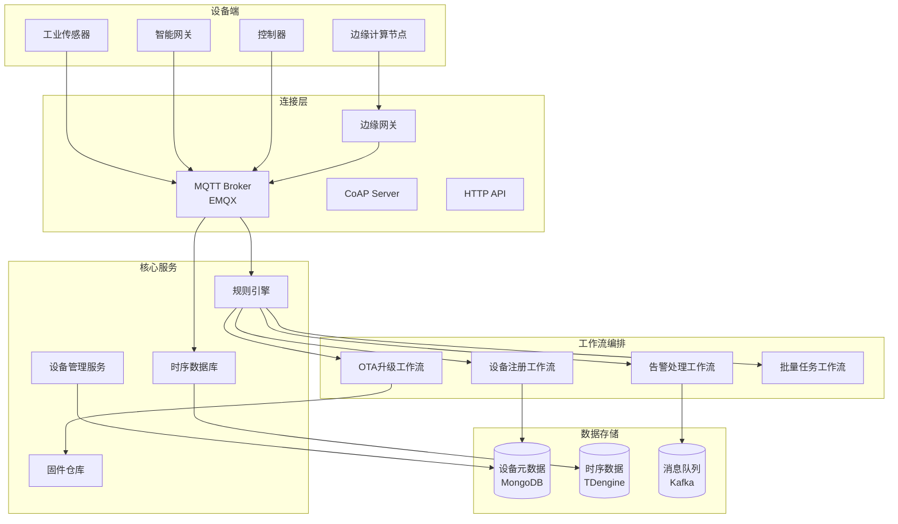
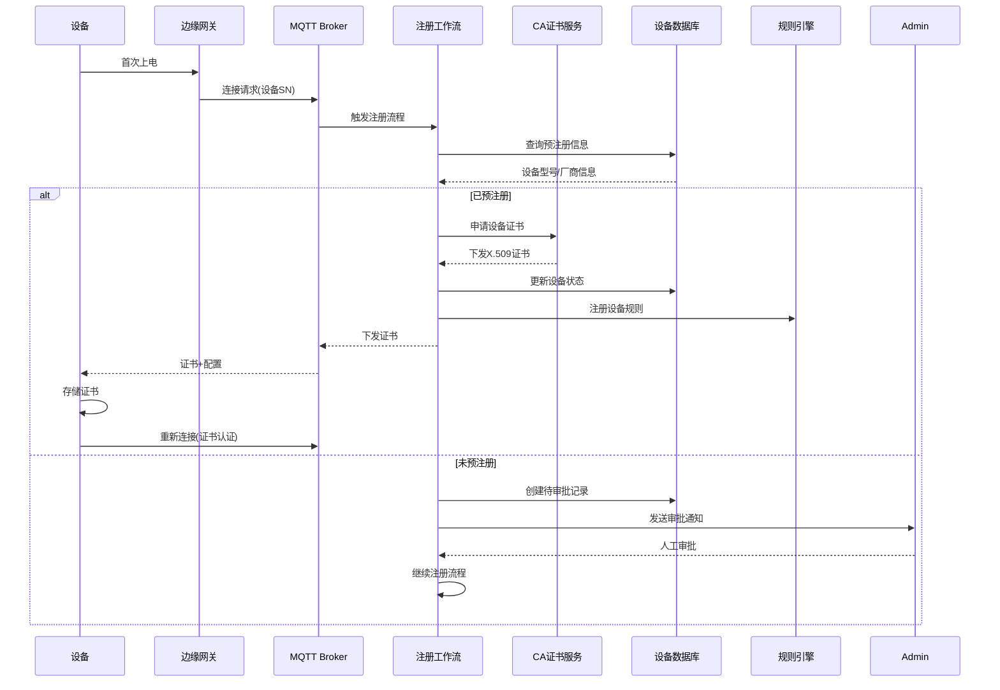
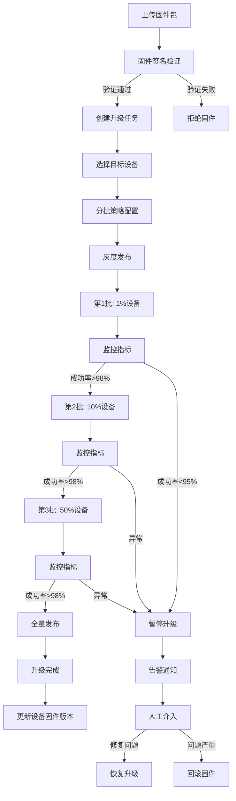
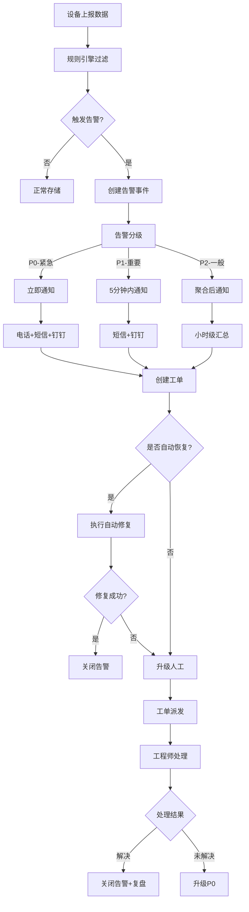

# 物联网设备管理工作流案例

## 业务场景描述

### 场景概述

某工业物联网平台管理超过100万台设备，涵盖设备注册、固件升级、状态监控、告警处理等全生命周期管理。业务需求包括：

- **规模管理**：支持100万+设备并发连接
- **实时性**：告警延迟 < 1秒，控制响应 < 100ms
- **可靠性**：OTA升级成功率 > 99.9%
- **安全性**：端到端加密、设备认证、访问控制

### 设备生命周期

```
设备生产 → 注册入库 → 首次激活 → 正常运行 → 固件升级 → 维护/下线
    ↓           ↓          ↓           ↓           ↓          ↓
  预置证书   云端注册    认证连接    数据采集    OTA升级    数据归档
```

### 核心业务场景

1. **设备注册**：批量设备初始化与证书下发
2. **固件升级**：大规模OTA升级管理
3. **状态监控**：实时设备健康状态追踪
4. **告警处理**：异常检测与自动化响应
5. **远程控制**：设备远程指令下发

---

## 工作流设计图

### 整体物联网架构



### 设备注册工作流



### OTA升级工作流



### 告警处理工作流



---

## 关键技术选型

| 组件 | 技术选型 | 选型理由 |
|------|----------|----------|
| **设备连接** | EMQX | 百万级并发、MQTT 5.0、规则引擎 |
| **工作流引擎** | Temporal | 长时间运行、设备状态机、可靠执行 |
| **时序数据库** | TDengine | 高性能写入、数据压缩、边缘同步 |
| **设备元数据** | MongoDB | 灵活Schema、地理位置索引 |
| **消息队列** | Kafka | 高吞吐、数据持久化、流处理 |
| **规则引擎** | EMQX内置 + Flink | 实时规则匹配、复杂事件处理 |

---

## 核心代码示例

### 1. 设备注册工作流 (Go + Temporal)

```go
package workflows

import (
    "fmt"
    "time"
    "go.temporal.io/sdk/workflow"
)

// DeviceRegistrationInput 设备注册输入
type DeviceRegistrationInput struct {
    DeviceSN       string            `json:"device_sn"`
    ProductKey     string            `json:"product_key"`
    FirmwareVersion string           `json:"firmware_version"`
    MACAddress     string            `json:"mac_address"`
    IPAddress      string            `json:"ip_address"`
    GatewayID      string            `json:"gateway_id"`
    Metadata       map[string]string `json:"metadata"`
}

// DeviceRegistrationWorkflow 设备注册工作流
func DeviceRegistrationWorkflow(ctx workflow.Context, input DeviceRegistrationInput) (*DeviceRegistrationResult, error) {
    logger := workflow.GetLogger(ctx)
    logger.Info("Device registration started", "deviceSN", input.DeviceSN)

    ao := workflow.ActivityOptions{
        StartToCloseTimeout: 30 * time.Second,
        RetryPolicy: &temporal.RetryPolicy{
            InitialInterval:    time.Second,
            BackoffCoefficient: 2.0,
            MaximumAttempts:    5,
        },
    }
    ctx = workflow.WithActivityOptions(ctx, ao)

    result := &DeviceRegistrationResult{
        DeviceSN: input.DeviceSN,
        Status:   "processing",
    }

    // ========== Step 1: 验证设备预注册信息 ==========
    var preregResp CheckPreregistrationResponse
    err := workflow.ExecuteActivity(ctx, CheckPreregistrationActivity, CheckPreregInput{
        DeviceSN:   input.DeviceSN,
        ProductKey: input.ProductKey,
    }).Get(ctx, &preregResp)

    if err != nil {
        result.Status = "failed"
        result.Error = fmt.Sprintf("preregistration check failed: %v", err)
        return result, nil
    }

    // ========== Step 2: 设备身份认证 ==========
    if !preregResp.IsPreRegistered {
        // 未预注册设备，进入审批流程
        logger.Info("Device not pre-registered, waiting for approval", "deviceSN", input.DeviceSN)

        approvalResult, err := waitForApproval(ctx, input)
        if err != nil {
            result.Status = "rejected"
            result.Error = "approval timeout or rejected"
            return result, nil
        }

        if !approvalResult.Approved {
            result.Status = "rejected"
            result.Error = approvalResult.Reason
            return result, nil
        }
    }

    // ========== Step 3: 生成设备证书 ==========
    certResp, err := generateDeviceCertificate(ctx, input)
    if err != nil {
        result.Status = "failed"
        result.Error = fmt.Sprintf("certificate generation failed: %v", err)
        return result, nil
    }
    result.CertificateID = certResp.CertID

    // ========== Step 4: 创建设备记录 ==========
    err = workflow.ExecuteActivity(ctx, CreateDeviceRecordActivity, CreateDeviceInput{
        DeviceSN:        input.DeviceSN,
        ProductKey:      input.ProductKey,
        FirmwareVersion: input.FirmwareVersion,
        MACAddress:      input.MACAddress,
        CertificateID:   certResp.CertID,
        Metadata:        input.Metadata,
    }).Get(ctx, nil)

    if err != nil {
        // 补偿：吊销证书
        _ = workflow.ExecuteActivity(ctx, RevokeCertificateActivity, RevokeInput{
            CertID: certResp.CertID,
            Reason: "registration_failed",
        }).Get(ctx, nil)

        result.Status = "failed"
        result.Error = fmt.Sprintf("create device record failed: %v", err)
        return result, nil
    }

    // ========== Step 5: 配置设备规则 ==========
    err = workflow.ExecuteActivity(ctx, ConfigureDeviceRulesActivity, RuleConfigInput{
        DeviceSN:   input.DeviceSN,
        ProductKey: input.ProductKey,
        Rules:      preregResp.DefaultRules,
    }).Get(ctx, nil)

    if err != nil {
        logger.Error("Failed to configure device rules", "error", err)
        // 非阻塞错误，继续
    }

    // ========== Step 6: 下发证书和配置到设备 ==========
    err = workflow.ExecuteActivity(ctx, ProvisionDeviceActivity, ProvisionInput{
        DeviceSN:      input.DeviceSN,
        GatewayID:     input.GatewayID,
        Certificate:   certResp.Certificate,
        PrivateKey:    certResp.PrivateKey,
        CAChain:       certResp.CAChain,
        MQTTConfig:    preregResp.MQTTConfig,
    }).Get(ctx, nil)

    if err != nil {
        logger.Error("Failed to provision device", "error", err)
        // 设备可能离线，不阻断注册流程
    }

    // ========== Step 7: 注册完成通知 ==========
    _ = workflow.ExecuteActivity(ctx, SendRegistrationNotificationActivity, NotificationInput{
        DeviceSN:   input.DeviceSN,
        ProductKey: input.ProductKey,
        Status:     "success",
    }).Get(ctx, nil)

    result.Status = "success"
    result.DeviceID = generateDeviceID(input.DeviceSN)

    logger.Info("Device registration completed", "deviceSN", input.DeviceSN, "deviceID", result.DeviceID)
    return result, nil
}

// waitForApproval 等待设备注册审批
func waitForApproval(ctx workflow.Context, input DeviceRegistrationInput) (*ApprovalResult, error) {
    // 创建待审批记录
    _ = workflow.ExecuteActivity(ctx, CreateApprovalRequestActivity, ApprovalRequestInput{
        DeviceSN:   input.DeviceSN,
        ProductKey: input.ProductKey,
        MACAddress: input.MACAddress,
    }).Get(ctx, nil)

    // 设置审批超时
    timeout := 24 * time.Hour
    timer := workflow.NewTimer(ctx, timeout)

    // 审批信号
    approvalChan := workflow.GetSignalChannel(ctx, DeviceApprovalSignal)

    selector := workflow.NewSelector(ctx)
    var approvalEvent ApprovalEvent

    selector.AddReceive(approvalChan, func(c workflow.ReceiveChannel, more bool) {
        c.Receive(ctx, &approvalEvent)
    })

    selector.AddFuture(timer, func(f workflow.Future) {
        approvalEvent.Approved = false
        approvalEvent.Reason = "approval_timeout"
    })

    selector.Select(ctx)

    return &ApprovalResult{
        Approved: approvalEvent.Approved,
        Reason:   approvalEvent.Reason,
    }, nil
}

// generateDeviceCertificate 生成设备证书
func generateDeviceCertificate(ctx workflow.Context, input DeviceRegistrationInput) (*CertificateResponse, error) {
    var certResp CertificateResponse
    err := workflow.ExecuteActivity(ctx, GenerateCertificateActivity, GenerateCertInput{
        DeviceSN:   input.DeviceSN,
        ProductKey: input.ProductKey,
        ValidDays:  365,
    }).Get(ctx, &certResp)

    return &certResp, err
}
```

### 2. OTA升级工作流

```go
// OTAUpgradeWorkflow OTA升级工作流
func OTAUpgradeWorkflow(ctx workflow.Context, input OTAUpgradeInput) (*OTAUpgradeResult, error) {
    logger := workflow.GetLogger(ctx)
    logger.Info("OTA upgrade started", "taskID", input.TaskID, "firmwareVersion", input.TargetVersion)

    ao := workflow.ActivityOptions{
        StartToCloseTimeout: 5 * time.Minute,
        RetryPolicy: &temporal.RetryPolicy{
            InitialInterval:    10 * time.Second,
            BackoffCoefficient: 2.0,
            MaximumAttempts:    3,
        },
    }
    ctx = workflow.WithActivityOptions(ctx, ao)

    result := &OTAUpgradeResult{
        TaskID: input.TaskID,
        Status: "running",
    }

    // 查询固件信息
    var firmwareInfo FirmwareInfo
    err := workflow.ExecuteActivity(ctx, GetFirmwareInfoActivity, input.FirmwareID).Get(ctx, &firmwareInfo)
    if err != nil {
        return nil, err
    }

    // 分批升级策略
    batches := calculateBatches(input.DeviceList, input.BatchConfig)

    for i, batch := range batches {
        logger.Info("Processing batch", "batchNumber", i+1, "totalBatches", len(batches), "deviceCount", len(batch))

        // 执行批次升级
        batchResult, err := processUpgradeBatch(ctx, input.TaskID, batch, firmwareInfo)
        if err != nil {
            return nil, err
        }

        // 检查批次结果
        successRate := float64(batchResult.SuccessCount) / float64(len(batch))

        if successRate < input.BatchConfig.MinSuccessRate {
            logger.Error("Batch upgrade failed, success rate too low",
                "batchNumber", i+1,
                "successRate", successRate,
                "minRequired", input.BatchConfig.MinSuccessRate)

            // 暂停后续批次
            result.Status = "paused"
            result.CurrentBatch = i + 1
            result.SuccessRate = successRate

            // 发送告警
            _ = workflow.ExecuteActivity(ctx, SendOTAAlertActivity, OTAAlertInput{
                TaskID:       input.TaskID,
                AlertType:    "batch_failure",
                BatchNumber:  i + 1,
                SuccessRate:  successRate,
            }).Get(ctx, nil)

            // 等待人工决策
            decision, err := waitForOTADecision(ctx, input.TaskID)
            if err != nil || decision.Action == "abort" {
                result.Status = "aborted"
                return result, nil
            }

            if decision.Action == "rollback" {
                // 执行回滚
                rollbackResult := rollbackOTA(ctx, input.TaskID, batch)
                result.Status = "rolled_back"
                result.RollbackResult = rollbackResult
                return result, nil
            }

            // 继续下一批次
        }

        result.CompletedBatches = i + 1
        result.TotalSuccess += batchResult.SuccessCount
        result.TotalFailed += batchResult.FailedCount

        // 批次间冷却时间
        if i < len(batches)-1 && input.BatchConfig.CooldownMinutes > 0 {
            workflow.Sleep(ctx, time.Duration(input.BatchConfig.CooldownMinutes)*time.Minute)
        }
    }

    result.Status = "completed"
    result.FinalSuccessRate = float64(result.TotalSuccess) / float64(len(input.DeviceList))

    // 更新设备固件版本记录
    _ = workflow.ExecuteActivity(ctx, UpdateDeviceFirmwareVersionActivity, UpdateFirmwareInput{
        DeviceList:      input.DeviceList,
        FirmwareVersion: input.TargetVersion,
    }).Get(ctx, nil)

    return result, nil
}

// processUpgradeBatch 处理升级批次
func processUpgradeBatch(ctx workflow.Context, taskID string, devices []string, firmware FirmwareInfo) (*BatchResult, error) {
    // 为批次中的每个设备启动子工作流
    futures := make([]workflow.ChildWorkflowFuture, 0, len(devices))

    for _, deviceID := range devices {
        future := workflow.ExecuteChildWorkflow(ctx, SingleDeviceUpgradeWorkflow, SingleUpgradeInput{
            TaskID:      taskID,
            DeviceID:    deviceID,
            FirmwareURL: firmware.DownloadURL,
            FirmwareMD5: firmware.MD5Checksum,
            Timeout:     10 * time.Minute,
        })
        futures = append(futures, future)
    }

    // 等待所有设备升级完成
    successCount := 0
    failedCount := 0

    for _, future := range futures {
        var singleResult SingleUpgradeResult
        err := future.Get(ctx, &singleResult)

        if err != nil || singleResult.Status != "success" {
            failedCount++
        } else {
            successCount++
        }
    }

    return &BatchResult{
        SuccessCount: successCount,
        FailedCount:  failedCount,
    }, nil
}

// SingleDeviceUpgradeWorkflow 单设备升级工作流
func SingleDeviceUpgradeWorkflow(ctx workflow.Context, input SingleUpgradeInput) (*SingleUpgradeResult, error) {
    logger := workflow.GetLogger(ctx)
    result := &SingleUpgradeResult{
        DeviceID: input.DeviceID,
        TaskID:   input.TaskID,
    }

    ao := workflow.ActivityOptions{
        StartToCloseTimeout: input.Timeout,
        HeartbeatTimeout:    30 * time.Second,
    }
    ctx = workflow.WithActivityOptions(ctx, ao)

    // 发送升级指令
    err := workflow.ExecuteActivity(ctx, SendUpgradeCommandActivity, UpgradeCommandInput{
        DeviceID:    input.DeviceID,
        FirmwareURL: input.FirmwareURL,
        MD5:         input.FirmwareMD5,
    }).Get(ctx, nil)

    if err != nil {
        result.Status = "failed"
        result.Error = fmt.Sprintf("failed to send upgrade command: %v", err)
        return result, nil
    }

    // 等待升级完成或超时
    statusTimeout := input.Timeout
    timer := workflow.NewTimer(ctx, statusTimeout)

    statusChan := workflow.GetSignalChannel(ctx, DeviceUpgradeStatusSignal)

    selector := workflow.NewSelector(ctx)
    var statusEvent UpgradeStatusEvent

    selector.AddReceive(statusChan, func(c workflow.ReceiveChannel, more bool) {
        c.Receive(ctx, &statusEvent)
    })

    selector.AddFuture(timer, func(f workflow.Future) {
        statusEvent.Status = "timeout"
    })

    selector.Select(ctx)

    result.Status = statusEvent.Status
    result.NewVersion = statusEvent.NewVersion
    result.Duration = statusEvent.CompletedAt.Sub(statusEvent.StartedAt)

    if statusEvent.Status == "success" {
        logger.Info("Device upgrade completed", "deviceID", input.DeviceID, "version", statusEvent.NewVersion)
    } else {
        logger.Error("Device upgrade failed", "deviceID", input.DeviceID, "status", statusEvent.Status)
    }

    return result, nil
}
```

### 3. 告警处理工作流

```go
// AlertProcessingWorkflow 告警处理工作流
func AlertProcessingWorkflow(ctx workflow.Context, input AlertInput) (*AlertResult, error) {
    logger := workflow.GetLogger(ctx)
    logger.Info("Alert processing started", "alertID", input.AlertID, "level", input.Level)

    result := &AlertResult{
        AlertID: input.AlertID,
        Status:  "processing",
    }

    // ========== 告警分级处理 ==========
    switch input.Level {
    case AlertLevelP0: // 紧急
        return handleP0Alert(ctx, input)
    case AlertLevelP1: // 重要
        return handleP1Alert(ctx, input)
    case AlertLevelP2: // 一般
        return handleP2Alert(ctx, input)
    default:
        return handleDefaultAlert(ctx, input)
    }
}

// handleP0Alert 处理P0级紧急告警
func handleP0Alert(ctx workflow.Context, input AlertInput) (*AlertResult, error) {
    logger := workflow.GetLogger(ctx)

    // 立即通知（多渠道）
    notificationCtx := workflow.WithActivityOptions(ctx, workflow.ActivityOptions{
        StartToCloseTimeout: 30 * time.Second,
    })

    // 并行发送通知
    phoneFuture := workflow.ExecuteActivity(notificationCtx, SendPhoneCallActivity, PhoneInput{
        PhoneNumbers: input.OnCallPhones,
        Message:      fmt.Sprintf("P0告警: 设备 %s 发生 %s", input.DeviceID, input.AlertType),
    })

    smsFuture := workflow.ExecuteActivity(notificationCtx, SendSMSActivity, SMSInput{
        PhoneNumbers: input.OnCallPhones,
        Message:      fmt.Sprintf("P0告警: 设备 %s 发生 %s，时间: %s", input.DeviceID, input.AlertType, input.Timestamp),
    })

    dingtalkFuture := workflow.ExecuteActivity(notificationCtx, SendDingTalkActivity, DingTalkInput{
        GroupID: input.AlertGroupID,
        Message: formatAlertMessage(input),
    })

    // 等待通知完成
    _ = phoneFuture.Get(notificationCtx, nil)
    _ = smsFuture.Get(notificationCtx, nil)
    _ = dingtalkFuture.Get(notificationCtx, nil)

    // 检查是否有自动恢复规则
    if canAutoRecover(input.AlertType) {
        recoveryResult, err := tryAutoRecovery(ctx, input)
        if err == nil && recoveryResult.Success {
            logger.Info("Auto recovery succeeded", "alertID", input.AlertID)
            return &AlertResult{
                AlertID:      input.AlertID,
                Status:       "auto_resolved",
                Resolution:   recoveryResult.Action,
                ResolvedAt:   workflow.Now(ctx),
            }, nil
        }
    }

    // 创建工单
    ticketID, err := createTicket(ctx, input)
    if err != nil {
        logger.Error("Failed to create ticket", "error", err)
    }

    // 等待告警恢复或超时升级
    resolution, err := waitForResolution(ctx, input, 30*time.Minute)
    if err != nil {
        // 超时未解决，升级处理
        _ = escalateAlert(ctx, input, ticketID)
    }

    return &AlertResult{
        AlertID:    input.AlertID,
        Status:     resolution.Status,
        TicketID:   ticketID,
        ResolvedAt: resolution.ResolvedAt,
    }, nil
}

// tryAutoRecovery 尝试自动恢复
func tryAutoRecovery(ctx workflow.Context, input AlertInput) (*RecoveryResult, error) {
    logger := workflow.GetLogger(ctx)

    switch input.AlertType {
    case "high_memory_usage":
        // 尝试重启设备服务
        return restartDeviceService(ctx, input.DeviceID)

    case "connection_lost":
        // 尝试重新连接
        return reconnectDevice(ctx, input.DeviceID)

    case "high_cpu_usage":
        // 尝试降低采样频率
        return reduceSamplingRate(ctx, input.DeviceID)

    default:
        return nil, fmt.Errorf("no auto recovery rule for alert type: %s", input.AlertType)
    }
}

// restartDeviceService 重启设备服务
func restartDeviceService(ctx workflow.Context, deviceID string) (*RecoveryResult, error) {
    logger := workflow.GetLogger(ctx)
    logger.Info("Attempting to restart device service", "deviceID", deviceID)

    err := workflow.ExecuteActivity(ctx, SendDeviceCommandActivity, DeviceCommandInput{
        DeviceID: deviceID,
        Command:  "restart_service",
        Params:   map[string]string{"service": "data_collector"},
    }).Get(ctx, nil)

    if err != nil {
        return &RecoveryResult{Success: false, Error: err.Error()}, nil
    }

    // 等待服务恢复
    checkCtx := workflow.WithActivityOptions(ctx, workflow.ActivityOptions{
        StartToCloseTimeout: 2 * time.Minute,
    })

    // 轮询检查服务状态
    for i := 0; i < 6; i++ {
        workflow.Sleep(ctx, 10*time.Second)

        var status DeviceStatus
        err := workflow.ExecuteActivity(checkCtx, GetDeviceStatusActivity, deviceID).Get(checkCtx, &status)
        if err == nil && status.ServiceStatus == "running" {
            return &RecoveryResult{
                Success: true,
                Action:  "restart_service",
            }, nil
        }
    }

    return &RecoveryResult{Success: false, Error: "service not recovered after restart"}, nil
}
```

### 4. 设备遥测数据处理

```python
# consumers/telemetry_consumer.py
from kafka import KafkaConsumer
import json
import logging
from datetime import datetime

class TelemetryProcessor:
    def __init__(self):
        self.consumer = KafkaConsumer(
            'device.telemetry',
            bootstrap_servers=['kafka1:9092', 'kafka2:9092'],
            group_id='telemetry-processor',
            value_deserializer=lambda m: json.loads(m.decode('utf-8'))
        )
        self.tdengine = TDEngineConnector()
        self.rule_engine = RuleEngine()

    def start(self):
        """启动消息消费"""
        for message in self.consumer:
            try:
                self.process_message(message.value)
            except Exception as e:
                logging.error(f"Failed to process message: {e}")
                # 发送到死信队列
                self.send_to_dlq(message.value, str(e))

    def process_message(self, data: dict):
        """处理设备遥测数据"""
        device_id = data.get('device_id')
        timestamp = data.get('timestamp')
        metrics = data.get('metrics', {})

        # 1. 数据清洗和标准化
        cleaned_data = self.clean_data(device_id, timestamp, metrics)

        # 2. 写入时序数据库
        self.store_telemetry(cleaned_data)

        # 3. 规则引擎检查
        alerts = self.rule_engine.evaluate(device_id, cleaned_data)

        # 4. 触发告警工作流
        for alert in alerts:
            self.trigger_alert_workflow(alert)

        # 5. 实时指标更新
        self.update_realtime_metrics(device_id, cleaned_data)

    def clean_data(self, device_id: str, timestamp: int, metrics: dict) -> dict:
        """数据清洗"""
        cleaned = {}

        for metric_name, value in metrics.items():
            # 过滤异常值
            if self.is_anomalous(device_id, metric_name, value):
                logging.warning(f"Anomalous value detected: {device_id}/{metric_name}={value}")
                continue

            # 单位转换
            cleaned_value = self.normalize_unit(metric_name, value)
            cleaned[metric_name] = cleaned_value

        return {
            'device_id': device_id,
            'timestamp': timestamp,
            'metrics': cleaned,
            'received_at': int(datetime.now().timestamp() * 1000)
        }

    def store_telemetry(self, data: dict):
        """存储到时序数据库"""
        table_name = f"device_{data['device_id'][:8]}"

        sql = f"""
        INSERT INTO {table_name} (ts, device_id, temperature, humidity, voltage, status)
        VALUES (
            {data['timestamp']},
            '{data['device_id']}',
            {data['metrics'].get('temperature', 'NULL')},
            {data['metrics'].get('humidity', 'NULL')},
            {data['metrics'].get('voltage', 'NULL')},
            {data['metrics'].get('status', 'NULL')}
        )
        """

        self.tdengine.execute(sql)

    def is_anomalous(self, device_id: str, metric: str, value: float) -> bool:
        """检测异常值"""
        # 获取历史统计
        stats = self.tdengine.get_metric_stats(device_id, metric, hours=24)

        if not stats:
            return False

        # 3-sigma法则
        mean = stats['mean']
        std = stats['std']

        if std == 0:
            return value != mean

        z_score = abs(value - mean) / std
        return z_score > 3

class RuleEngine:
    """规则引擎"""

    def __init__(self):
        self.rules = self.load_rules()

    def evaluate(self, device_id: str, data: dict) -> list:
        """评估规则"""
        alerts = []
        metrics = data['metrics']

        for rule in self.rules:
            if self.match_condition(rule['condition'], metrics):
                alerts.append({
                    'rule_id': rule['id'],
                    'device_id': device_id,
                    'level': rule['level'],
                    'message': rule['message'],
                    'timestamp': data['timestamp'],
                    'values': metrics
                })

        return alerts

    def match_condition(self, condition: dict, metrics: dict) -> bool:
        """匹配条件"""
        metric = condition.get('metric')
        operator = condition.get('operator')
        threshold = condition.get('threshold')

        if metric not in metrics:
            return False

        value = metrics[metric]

        if operator == 'gt':
            return value > threshold
        elif operator == 'lt':
            return value < threshold
        elif operator == 'eq':
            return value == threshold
        elif operator == 'between':
            return threshold[0] <= value <= threshold[1]

        return False
```

---

## 遇到的问题和解决方案

### 问题1：大规模OTA升级带宽瓶颈

**现象**：同时升级10万台设备导致网络拥塞
**解决方案**：

1. 边缘节点缓存固件
2. P2P分发协议
3. 动态限速和错峰升级

```go
// 边缘缓存分发
type EdgeCacheManager struct {
    edgeNodes []EdgeNode
}

func (m *EdgeCacheManager) DistributeFirmware(ctx context.Context, firmwareID string) error {
    // 获取固件信息
    firmware, err := getFirmwareInfo(firmwareID)
    if err != nil {
        return err
    }

    // 并行分发到边缘节点
    g, ctx := errgroup.WithContext(ctx)
    for _, node := range m.edgeNodes {
        node := node // capture
        g.Go(func() error {
            return m.pushToEdgeNode(ctx, node, firmware)
        })
    }

    return g.Wait()
}
```

### 问题2：设备离线导致指令丢失

**现象**：设备离线期间下发的指令无法送达
**解决方案**：

1. MQTT QoS 1/2消息持久化
2. 设备消息队列（每个设备独立）
3. 离线指令补偿机制

```go
// 离线消息补偿
func (s *DeviceService) HandleDeviceOnline(ctx context.Context, deviceID string) error {
    // 查询设备离线期间的未处理消息
    pendingMsgs, err := s.messageStore.GetPendingMessages(ctx, deviceID)
    if err != nil {
        return err
    }

    // 按优先级排序
    sort.Slice(pendingMsgs, func(i, j int) bool {
        return pendingMsgs[i].Priority > pendingMsgs[j].Priority
    })

    // 批量下发
    for _, msg := range pendingMsgs {
        if time.Since(msg.CreatedAt) > 7*24*time.Hour {
            // 过期消息跳过
            continue
        }

        err := s.sendCommand(ctx, deviceID, msg)
        if err != nil {
            log.Printf("Failed to send pending message: %v", err)
        }
    }

    return nil
}
```

### 问题3：设备状态不一致

**现象**：云端显示在线但设备实际已离线
**解决方案**：

1. 心跳检测 + 会话保活
2. 遗嘱消息（Last Will）
3. 双向心跳确认

```yaml
# EMQX配置
zone.external {
  # 心跳检查间隔
  keepalive_check_interval = 30s

  # 会话过期时间
  session_expiry_interval = 2h

  # 遗嘱消息
  enable_will_message = true
}
```

---

## 性能数据

### 连接性能

| 指标 | 设计值 | 实测值 |
|------|--------|--------|
| **并发连接数** | 100万 | 120万 |
| **消息吞吐量** | 100万/秒 | 150万/秒 |
| **连接建立时间** | < 100ms | 45ms |
| **消息延迟** | < 50ms | 20ms |

### OTA升级性能

| 场景 | 设备数 | 完成时间 | 成功率 |
|------|--------|----------|--------|
| **小规模** | 1,000 | 10分钟 | 99.95% |
| **中等规模** | 10,000 | 30分钟 | 99.8% |
| **大规模** | 100,000 | 2小时 | 99.5% |

### 告警处理性能

| 指标 | 数值 |
|------|------|
| **告警检测延迟** | < 1秒 |
| **P0通知延迟** | < 5秒 |
| **日处理告警量** | 500万+ |
| **自动恢复成功率** | 65% |

---

## 与理论模型的映射

### 1. 状态机模式

- **设备状态**：未激活 → 在线 → 离线 → 升级中 → 维护 → 退役
- **升级状态**：待升级 → 下载中 → 安装中 → 重启中 → 验证中 → 完成
- **告警状态**：触发 → 通知 → 处理中 → 恢复 → 关闭

### 2. 发布订阅模式

- **MQTT Broker**：设备与云端的消息总线
- **主题分层**：`product/{key}/device/{id}/telemetry`
- **通配订阅**：批量设备数据监听

### 3. 边缘计算

- **边缘网关**：本地数据聚合和预处理
- **规则下沉**：部分规则在边缘执行
- **云边协同**：边缘缓存、云端分析

### 4. 数字孪生

- **虚拟映射**：云端维护设备数字孪生
- **状态同步**：物理设备与数字孪生实时同步
- **预测分析**：基于孪生数据预测设备故障

---

## 相关文档

- [IoT架构设计](../02-架构设计/05-物联网架构.md)
- [MQTT协议详解](../01-基础概念/05-MQTT协议.md)
- [边缘计算实践](../03-技术架构/07-边缘计算.md)
