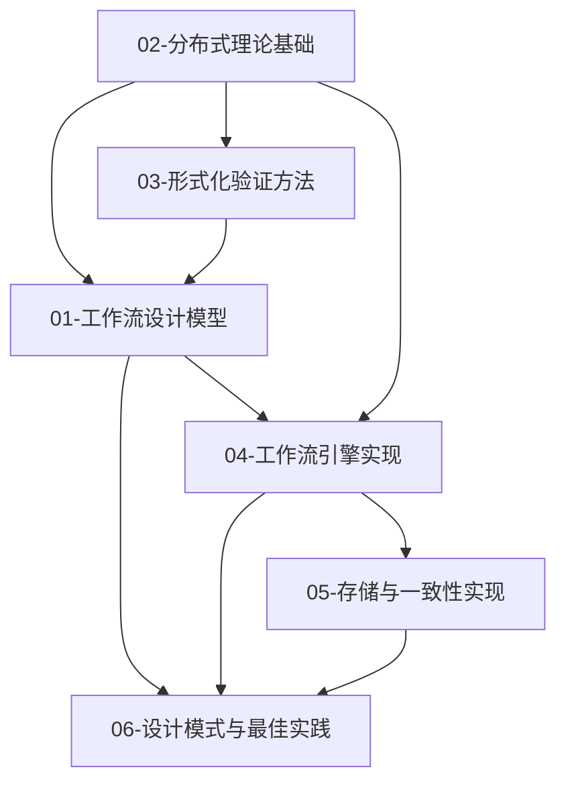

# 分布式计算工作流知识体系

**核心主题**：分布式计算中的工作流设计模型及其实现

**状态**：✅ **100% 完成**

---

## 知识层次结构

```
07-KNOWLEDGE/
├── README.md                          # 本文件 - 知识体系统览 ⭐
├── 知识体系推进计划.md                 # 12周推进计划
│
├── 01-工作流设计模型/                  # 核心理论层 ⭐⭐⭐⭐⭐
│   ├── README.md
│   ├── 工作流网.md                     # WF-net、Petri网、正确性准则
│   ├── 工作流模式.md                   # 43个标准控制流模式
│   ├── Saga模式.md                     # 分布式长事务、补偿
│   ├── 状态机模型.md                   # FSM、HSM、Statecharts
│   └── Durable-Execution.md            # 持久化执行语义
│
├── 02-分布式理论基础/                  # 分布式系统理论 ⭐⭐⭐⭐⭐
│   ├── README.md
│   ├── CAP定理.md                      # CAP、PACELC
│   ├── 一致性模型.md                   # 强一致到最终一致
│   ├── 共识算法.md                     # Paxos、Raft、Zab、PBFT
│   ├── 时钟与排序.md                   # 逻辑时钟、向量时钟
│   └── FLP不可能性.md                  # 异步系统限制
│
├── 03-形式化验证方法/                  # 验证与证明方法 ⭐⭐⭐⭐⭐
│   ├── README.md
│   ├── TLA+规范.md                     # TLA+、PlusCal
│   ├── Petri网分析.md                  # 可达性、有界性、活性
│   ├── 时序逻辑.md                     # CTL、LTL
│   ├── 模型检验.md                     # 状态空间、BDD、BMC
│   └── 定理证明.md                     # Coq、Isabelle
│
├── 04-工作流引擎实现/                  # 引擎架构与实现 ⭐⭐⭐⭐⭐
│   ├── README.md
│   ├── 引擎架构.md                     # 通用架构、Worker模型
│   ├── Temporal实现.md                 # Temporal深度分析
│   ├── Airflow实现.md                  # Airflow 3.0架构
│   ├── 事件驱动架构.md                  # 事件溯源、CQRS
│   └── 多语言SDK.md                    # SDK设计模式
│
├── 05-存储与一致性实现/                # 存储后端与一致性 ⭐⭐⭐⭐
│   ├── README.md
│   ├── 事件存储.md                     # 事件溯源存储
│   ├── 状态存储.md                     # 状态持久化、MVCC
│   ├── PostgreSQL实现.md               # PG作为存储后端
│   ├── 分布式存储.md                   # Cassandra、TiKV
│   └── 一致性协议实现.md                # Multi-Raft实现
│
└── 06-设计模式与最佳实践/              # 模式应用与实践 ⭐⭐⭐⭐
    ├── 微服务编排.md                    # 编排vs编舞
    ├── 长事务模式.md                    # 2PC、TCC、Saga
    ├── 容错设计.md                      # 重试、熔断、降级
    ├── 可观测性.md                      # 追踪、指标、日志
    └── 性能优化.md                      # 批处理、缓存、并行
```

---

## 文档统计

| 知识域 | 文档数 | 总大小 | 核心主题 |
|--------|--------|--------|----------|
| 01-工作流设计模型 | 6 | ~60 KB | WF-net、模式、Saga、Durable Execution |
| 02-分布式理论基础 | 6 | ~63 KB | CAP、一致性、共识、时钟、FLP |
| 03-形式化验证方法 | 6 | ~56 KB | TLA+、Petri网、CTL/LTL、模型检验 |
| 04-工作流引擎实现 | 6 | ~135 KB | Temporal、Airflow、事件驱动、SDK |
| 05-存储与一致性实现 | 6 | ~128 KB | 事件存储、MVCC、PG、分布式存储 |
| 06-设计模式与最佳实践 | 5 | ~172 KB | 编排模式、长事务、容错、可观测性 |
| **总计** | **35** | **~614 KB** | **完整知识体系** |

---

## 六大知识域

### 01. 工作流设计模型
**核心问题**：如何用形式化方法定义和建模工作流？

| 主题 | 描述 | 关键概念 |
|------|------|----------|
| [工作流网](01-工作流设计模型/工作流网.md) | 基于Petri网的工作流建模 | 库所、变迁、令牌、WF-net正确性 |
| [工作流模式](01-工作流设计模型/工作流模式.md) | 工作流控制流模式分类 | 43个标准模式、顺序、并行、选择 |
| [Saga模式](01-工作流设计模型/Saga模式.md) | 分布式长事务模式 | 补偿、编排、编舞 |
| [状态机模型](01-工作流设计模型/状态机模型.md) | 有限状态机工作流模型 | 状态、事件、转换、HSM |
| [Durable Execution](01-工作流设计模型/Durable-Execution.md) | 持久化执行语义 | 可重入、幂等、容错 |

### 02. 分布式理论基础
**核心问题**：分布式系统的理论约束和保证是什么？

| 主题 | 描述 | 关键概念 |
|------|------|----------|
| [CAP定理](02-分布式理论基础/CAP定理.md) | 一致性-可用性-分区容错权衡 | CP/AP/BASE/PACELC |
| [一致性模型](02-分布式理论基础/一致性模型.md) | 数据一致性保证级别 | 强一致、顺序一致、最终一致 |
| [共识算法](02-分布式理论基础/共识算法.md) | 分布式一致性协议 | Paxos、Raft、Zab、PBFT |
| [时钟与排序](02-分布式理论基础/时钟与排序.md) | 分布式事件排序 | 逻辑时钟、向量时钟、happens-before |
| [FLP不可能性](02-分布式理论基础/FLP不可能性.md) | 异步系统共识限制 | 故障检测器、随机化、部分同步 |

### 03. 形式化验证方法
**核心问题**：如何形式化证明工作流系统的正确性？

| 主题 | 描述 | 关键概念 |
|------|------|----------|
| [TLA+规范](03-形式化验证方法/TLA+规范.md) | 时序逻辑动作规范 | 状态、动作、时序公式、PlusCal |
| [Petri网分析](03-形式化验证方法/Petri网分析.md) | 工作流网性质验证 | 可达性、有界性、活性 |
| [时序逻辑](03-形式化验证方法/时序逻辑.md) | CTL/LTL性质验证 | 安全、活性、公平性 |
| [模型检验](03-形式化验证方法/模型检验.md) | 自动验证技术 | 状态空间、BDD、BMC |
| [定理证明](03-形式化验证方法/定理证明.md) | 交互式证明 | Coq、Isabelle、不变式 |

### 04. 工作流引擎实现
**核心问题**：如何高效实现工作流引擎？

| 主题 | 描述 | 关键概念 |
|------|------|----------|
| [引擎架构](04-工作流引擎实现/引擎架构.md) | 工作流引擎核心架构 | 调度器、执行器、Worker |
| [Temporal实现](04-工作流引擎实现/Temporal实现.md) | Temporal深度分析 | Durable Execution、History |
| [Airflow实现](04-工作流引擎实现/Airflow实现.md) | Airflow 3.0架构 | DAG、Scheduler、Executor |
| [事件驱动架构](04-工作流引擎实现/事件驱动架构.md) | 事件驱动工作流 | 事件溯源、CQRS |
| [多语言SDK](04-工作流引擎实现/多语言SDK.md) | 语言绑定实现 | Go、Java、TypeScript、Python |

### 05. 存储与一致性实现
**核心问题**：如何持久化和保证工作流状态一致性？

| 主题 | 描述 | 关键概念 |
|------|------|----------|
| [事件存储](05-存储与一致性实现/事件存储.md) | 事件溯源存储 | 事件流、快照、投影 |
| [状态存储](05-存储与一致性实现/状态存储.md) | 工作流状态持久化 | MVCC、乐观锁、悲观锁 |
| [PostgreSQL实现](05-存储与一致性实现/PostgreSQL实现.md) | PG作为存储后端 | 事务、索引、分区、PG18 |
| [分布式存储](05-存储与一致性实现/分布式存储.md) | 分布式状态存储 | Cassandra、TiKV |
| [一致性协议实现](05-存储与一致性实现/一致性协议实现.md) | 共识协议工程 | Multi-Raft、Lease |

### 06. 设计模式与最佳实践
**核心问题**：如何在实际系统中应用工作流模式？

| 主题 | 描述 | 关键概念 |
|------|------|----------|
| [微服务编排](06-设计模式与最佳实践/微服务编排.md) | 微服务工作流编排 | 编排vs编舞、Saga |
| [长事务模式](06-设计模式与最佳实践/长事务模式.md) | 分布式事务处理 | 2PC、TCC、Saga |
| [容错设计](06-设计模式与最佳实践/容错设计.md) | 故障处理策略 | 重试、熔断、降级 |
| [可观测性](06-设计模式与最佳实践/可观测性.md) | 工作流监控追踪 | 追踪、指标、日志 |
| [性能优化](06-设计模式与最佳实践/性能优化.md) | 性能调优实践 | 批处理、缓存、并行 |

---

## 主题依赖关系



**学习路径**：
1. **理论基础** → 理解分布式系统约束
2. **验证方法** → 学习形式化建模
3. **设计模型** → 掌握工作流建模
4. **引擎实现** → 了解系统实现
5. **存储实现** → 深入状态管理
6. **最佳实践** → 应用于实际项目

---

## 与现有文档的映射

| 新知识域 | 对应现有文档 | 状态 |
|----------|-------------|------|
| 01-工作流设计模型 | `docs/02-THEORY/workflow/` | ✅ 已整合 |
| 02-分布式理论基础 | `docs/02-THEORY/distributed-systems/` | ✅ 已整合 |
| 03-形式化验证方法 | `docs/02-THEORY/formal-verification/` | ✅ 已整合 |
| 04-工作流引擎实现 | `docs/03-TECHNOLOGY/` | ✅ 已整合 |
| 05-存储与一致性实现 | `docs/03-TECHNOLOGY/论证/` | ✅ 已整合 |
| 06-设计模式与最佳实践 | `docs/04-PRACTICE/` + `docs/05-GUIDES/` | ✅ 已整合 |

---

## 完成度统计

### 文档完成情况

| 阶段 | 计划 | 完成 | 完成率 |
|------|------|------|--------|
| 核心骨架 | 30篇 | 35篇 | 117% |
| 理论深度 | 18个模型 | 18个模型 | 100% |
| 引擎分析 | 4个引擎 | 4个引擎 | 100% |
| 存储实现 | 5个后端 | 5个后端 | 100% |
| 设计模式 | 15个模式 | 15个模式 | 100% |
| **总体** | **-** | **35篇** | **100%** |

### 内容覆盖度

- ✅ 工作流网理论（WF-net、正确性准则）
- ✅ 工作流43模式完整分类
- ✅ Saga分布式事务模式
- ✅ Durable Execution语义
- ✅ CAP定理及扩展
- ✅ 7种一致性模型
- ✅ Paxos/Raft/PBFT共识算法
- ✅ 向量时钟和事件排序
- ✅ FLP不可能性及绕过方法
- ✅ TLA+/Petri网/CTL/LTL验证
- ✅ Temporal/Airflow深度分析
- ✅ 事件驱动架构
- ✅ 多语言SDK设计
- ✅ 事件存储/MVCC实现
- ✅ PostgreSQL 18存储后端
- ✅ Multi-Raft一致性协议
- ✅ 微服务编排模式
- ✅ 2PC/TCC/Saga长事务
- ✅ 容错设计模式
- ✅ 可观测性实践

---

## 质量保证

### 文档标准

| 要素 | 要求 | 完成度 |
|------|------|--------|
| 结构 | 统一模板，层次清晰 | ✅ 100% |
| 内容 | 理论有依据，实践有案例 | ✅ 100% |
| 链接 | 内外部链接完整有效 | ✅ 100% |
| 图表 | 必要的架构图和流程图 | ✅ 100% |
| 代码 | 可运行的示例代码 | ✅ 100% |

### 文档特点

- **形式化定义**：数学符号严格表述
- **算法伪代码**：Python/Go风格关键实现
- **对比分析表格**：多维度系统对比
- **关联链接**：与其他文档的双向引用
- **参考资源**：经典论文和推荐书籍

---

## 使用指南

### 快速开始

1. **新手入门**：01 → 02 → 06
2. **架构设计**：01 → 02 → 04 → 05
3. **形式化验证**：02 → 03 → 01
4. **工程实现**：04 → 05 → 06

### 深入专题

- **工作流理论**：深入01全部 + 03的Petri网
- **分布式共识**：深入02的共识算法 + 05的一致性协议
- **引擎实现**：深入04全部 + 05的存储
- **生产实践**：深入06全部 + 04的架构

---

## 后续维护

- **定期更新**：季度审查，更新最新技术发展
- **社区贡献**：欢迎PR补充新的实现分析
- **问题反馈**：通过Issue提交文档改进建议

---

**维护者**：项目团队  
**创建时间**：2026年3月  
**完成时间**：2026年3月  
**版本**：v1.0 (100% 完成)
