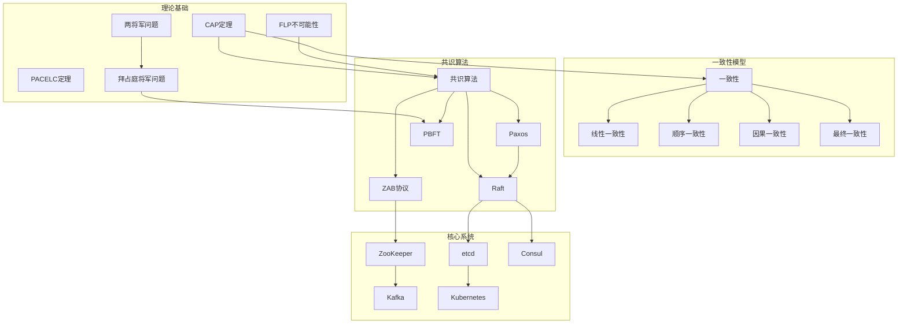
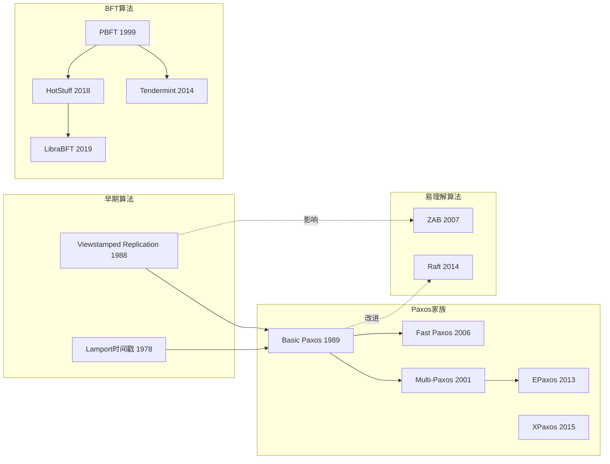
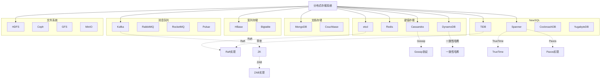
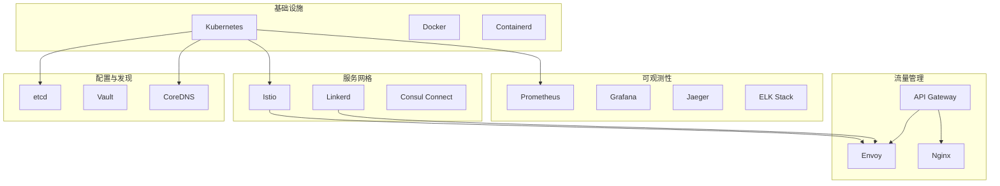
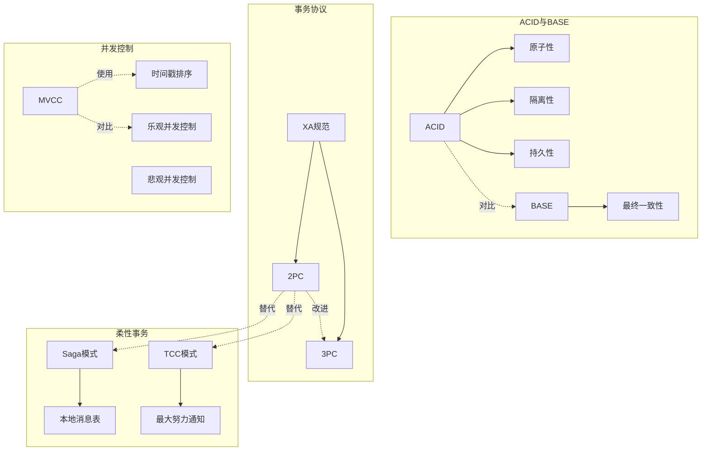
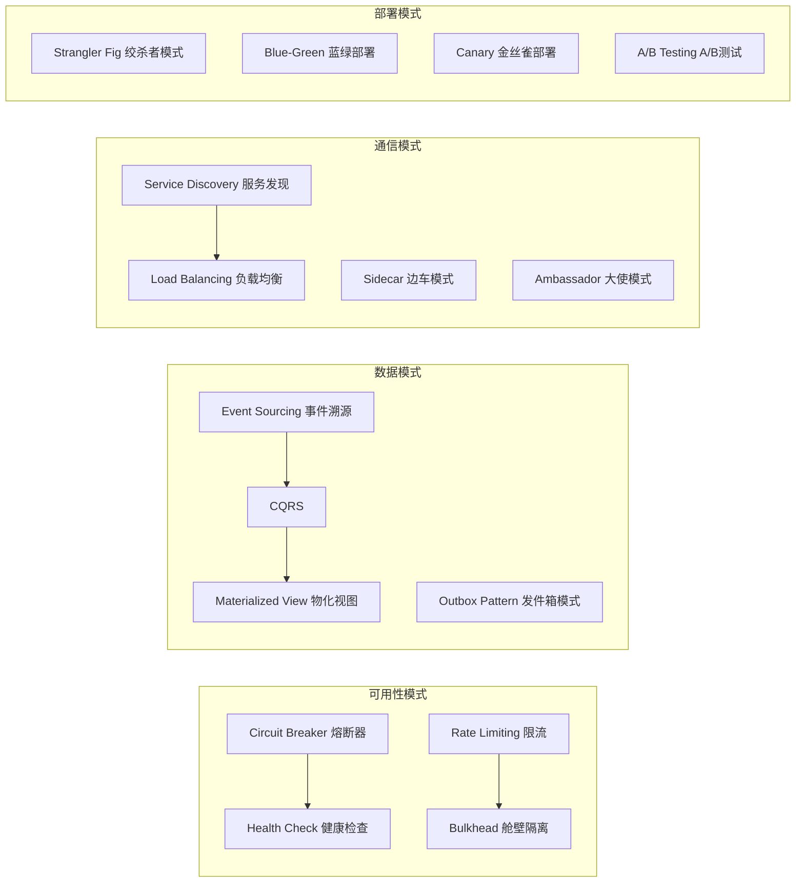
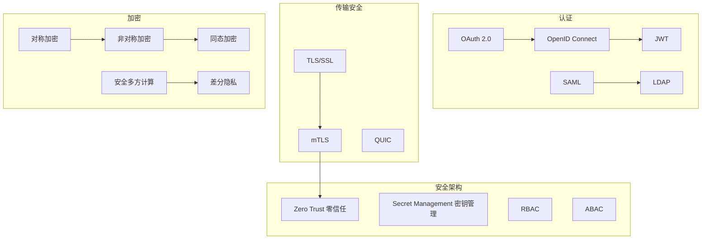
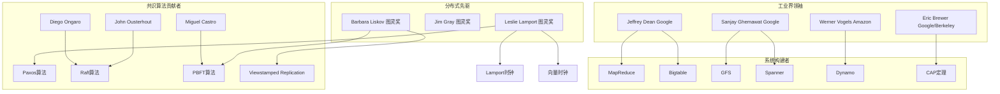
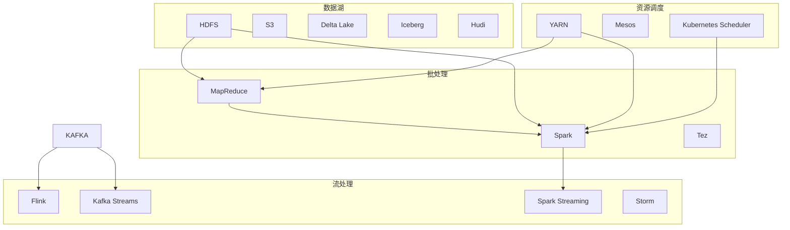
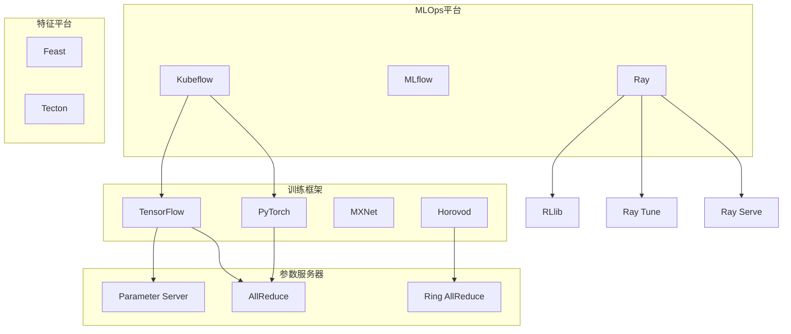

# 分布式计算知识图谱 - 交互式可视化

本文档使用 Mermaid 语法创建可交互的知识图谱，支持点击节点跳转到详细文档。

## 核心概念全景图

## 共识算法演进图

## 存储系统分类图

## 云原生技术栈图

## 事务与一致性图谱

## 分布式系统设计模式

## 安全与身份认证图

## 人物与贡献关系图

## 数据流与计算框架图

## 机器学习分布式系统

## 使用说明

### 在支持Mermaid的平台查看

1. **GitHub/GitLab**: 直接渲染显示
2. **VS Code**: 安装 Mermaid 插件
3. **在线工具**: 
   - Mermaid Live Editor: https://mermaid.live
   - 复制本文档中的代码块内容粘贴即可

### 交互功能

- **点击节点**: 在支持的查看器中可跳转到对应文档
- **缩放**: 支持画布缩放和平移
- **导出**: 可导出为 PNG/SVG 格式

### 图例说明

| 形状 | 含义 |
|------|------|
| 矩形 | 系统/工具 |
| 圆角矩形 | 概念/理论 |
| 菱形 | 算法 |
| 六边形 | 定理 |
| 圆柱 | 数据库 |
| 文档 | 论文/规范 |

| 连线 | 含义 |
|------|------|
| 实线箭头 | 直接依赖/实现 |
| 虚线箭头 | 扩展/改进关系 |
| 点线箭头 | 间接关系 |
