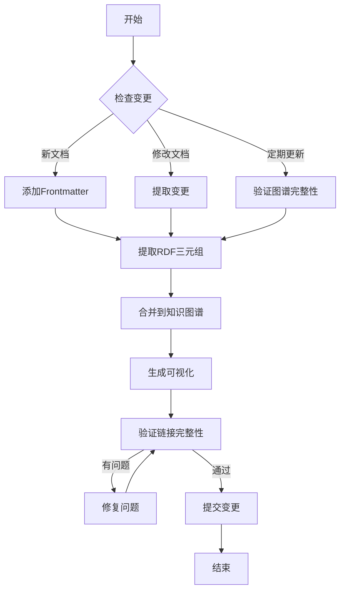

# 知识图谱更新工作流

本文档描述分布式计算知识图谱的更新和维护流程。

## 更新触发条件

知识图谱在以下情况下需要更新：

1. **新文档创建**: 添加新的 Markdown 文档时
2. **文档修改**: 现有文档内容或元数据变更时
3. **关系变更**: 概念之间的关系需要调整时
4. **定期维护**: 每月/每季度的例行更新

## 工作流概览



## 详细步骤

### 1. 新文档创建时

#### 1.1 添加 YAML Frontmatter

每个新文档必须包含 Frontmatter 头信息：

```yaml
---
# 基本元数据
type: Concept  # 可选值: Concept, Algorithm, System, Pattern, Protocol, Theorem, Paper
difficulty: 中级  # 可选值: 初级, 中级, 高级

# 标识信息
id: UniqueConceptID  # 唯一标识符，驼峰命名
name: 概念中文名称
nameEn: English Name

# 分类信息
category: Theory  # 主类别
tags: [distributed-systems, consistency, database]

# 时间信息
created: 2026-04-04
updated: 2026-04-04

# 关系信息
related:  # 相关概念列表
  - CAPTheorem
  - Consistency
  - DistributedTransaction

implements:  # 实现的算法（对System类型）
  - Raft
  
uses:  # 使用的技术/系统
  - etcd
  - gRPC

# 来源信息
author: 文档作者
source: 参考来源
---
```

#### 1.2 内容规范

文档内容应遵循以下规范：

- **第一段**：定义描述（50-200字），将被提取为 `:definition` 属性
- **标题层次**：使用 H2/H3 组织内容，将被提取为 `:hasPart` 关系
- **代码块**：伪代码使用 ` ```algorithm ` 标记
- **内部链接**：使用相对路径链接相关文档 `[相关概念](./other-concept.md)`

### 2. 运行提取脚本

```bash
# 进入知识图谱目录
cd docs/00-index/knowledge-graph/

# 提取所有文档的RDF数据
python extract_rdf.py \
  --input ../../ \
  --output extracted.ttl \
  --format turtle \
  --verbose

# 或者使用make命令
make extract
```

### 3. 合并到知识图谱

#### 3.1 自动合并（推荐）

```bash
# 合并提取的数据到主图谱
python merge_rdf.py \
  --source extracted.ttl \
  --target core-concepts.ttl \
  --strategy merge

# make命令
make merge
```

#### 3.2 手动合并

1. 打开 `core-concepts.ttl`
2. 在适当位置添加新实体的 RDF 定义
3. 确保遵循 Turtle 语法规范
4. 添加注释说明来源

### 4. 重新生成可视化

```bash
# 生成Mermaid图表
python generate_mermaid.py \
  --input core-concepts.ttl \
  --output interactive-graph.md

# 生成D3.js配置
python generate_d3_config.py \
  --input core-concepts.ttl \
  --output visualization-config.json

# make命令
make visualize
```

### 5. 验证链接完整性

```bash
# 运行验证脚本
python validate_graph.py \
  --input core-concepts.ttl \
  --report validation-report.json

# 检查报告
cat validation-report.json | jq '.issues[] | select(.severity=="error")'

# make命令
make validate
```

#### 5.1 验证项目

- [ ] 所有URI格式正确
- [ ] 没有重复的实体ID
- [ ] 所有关系指向存在的实体
- [ ] 必要的属性（name, category）已填充
- [ ] 日期格式正确（xsd:date 或 xsd:integer）
- [ ] 语言标签正确（@zh, @en）

### 6. 提交变更

```bash
# Git提交
git add docs/00-index/knowledge-graph/
git commit -m "知识图谱更新: 添加X个新实体, Y个新关系

- 新增实体: 概念A, 算法B, 系统C
- 更新关系: 概念D isA 概念E
- 修复链接: 修正3个失效引用

验证结果: 通过"

git push
```

## 自动化脚本

### Makefile 配置

```makefile
.PHONY: all extract merge visualize validate clean

all: extract merge visualize validate

extract:
	@echo "提取 RDF 数据..."
	python extract_rdf.py -i ../../ -o extracted.ttl -v

merge:
	@echo "合并到知识图谱..."
	python merge_rdf.py -s extracted.ttl -t core-concepts.ttl

visualize:
	@echo "生成可视化..."
	python generate_mermaid.py -i core-concepts.ttl -o interactive-graph.md
	python generate_d3_config.py -i core-concepts.ttl -o visualization-config.json

validate:
	@echo "验证图谱..."
	python validate_graph.py -i core-concepts.ttl -r validation-report.json

clean:
	rm -f extracted.ttl validation-report.json

stats:
	@echo "统计信息..."
	python stats.py -i core-concepts.ttl
```

### Git Hooks

配置 pre-commit hook 自动验证：

```bash
#!/bin/sh
# .git/hooks/pre-commit

# 检查知识图谱文件是否修改
if git diff --cached --name-only | grep -q "knowledge-graph"; then
    echo "检测到知识图谱变更，运行验证..."
    
    cd docs/00-index/knowledge-graph/
    
    # 验证Turtle语法
    if ! rapper -i turtle core-concepts.ttl > /dev/null 2>&1; then
        echo "错误: Turtle 语法验证失败"
        exit 1
    fi
    
    # 运行自定义验证
    if ! python validate_graph.py -i core-concepts.ttl; then
        echo "错误: 图谱验证失败"
        exit 1
    fi
fi

exit 0
```

### CI/CD 集成

`.github/workflows/knowledge-graph.yml`:

```yaml
name: Knowledge Graph CI

on:
  push:
    paths:
      - 'docs/00-index/knowledge-graph/**'
      - 'docs/**/*.md'
  pull_request:
    paths:
      - 'docs/00-index/knowledge-graph/**'

jobs:
  validate:
    runs-on: ubuntu-latest
    steps:
      - uses: actions/checkout@v3
      
      - name: Set up Python
        uses: actions/setup-python@v4
        with:
          python-version: '3.10'
      
      - name: Install dependencies
        run: |
          pip install rdflib pyyaml
          sudo apt-get install -y raptor2-utils
      
      - name: Extract RDF
        run: |
          cd docs/00-index/knowledge-graph/
          python extract_rdf.py -i ../../ -o extracted.ttl
      
      - name: Validate Turtle syntax
        run: |
          cd docs/00-index/knowledge-graph/
          rapper -i turtle core-concepts.ttl > /dev/null
      
      - name: Run validation
        run: |
          cd docs/00-index/knowledge-graph/
          python validate_graph.py -i core-concepts.ttl -r report.json
      
      - name: Generate stats
        run: |
          cd docs/00-index/knowledge-graph/
          python stats.py -i core-concepts.ttl
      
      - name: Upload validation report
        if: failure()
        uses: actions/upload-artifact@v3
        with:
          name: validation-report
          path: docs/00-index/knowledge-graph/report.json
```

## 版本管理

### 语义化版本

知识图谱版本格式：`主版本.次版本.修订号`

- **主版本**: 本体结构重大变更，不兼容修改
- **次版本**: 新增功能（新实体类型、新关系类型），向后兼容
- **修订号**: 数据更新、错误修复，向后兼容

### 变更日志

`CHANGELOG.md` 格式：

```markdown
# 知识图谱变更日志

## [1.2.0] - 2026-04-04

### 新增
- 添加 15 个新的共识算法实体
- 添加 BFT 算法分类
- 新增 `conflictsWith` 关系类型

### 修改
- 更新 etcd 相关信息到 3.5 版本
- 修正 Raft 算法复杂度描述

### 修复
- 修复 3 个失效的论文链接
- 修正 Nancy Lynch 的所属机构

## [1.1.0] - 2026-03-01
...
```

## 质量控制

### 数据质量标准

| 指标 | 目标值 | 检查频率 |
|------|--------|----------|
| 实体覆盖率 | > 90% | 每次更新 |
| 关系完整性 | > 95% | 每月 |
| 属性完整度 | > 85% | 每月 |
| 链接有效性 | > 98% | 每周 |
| 文档同步率 | 100% | 每次更新 |

### 审查清单

- [ ] 新实体的URI符合命名规范
- [ ] 所有必需的属性已填充
- [ ] 关系类型使用正确的谓词
- [ ] 日期格式统一为 xsd:integer 或 xsd:date
- [ ] 多语言属性使用正确的语言标签
- [ ] 没有孤立的实体（至少有一个关系）
- [ ] 没有循环依赖（除非是故意的）

## 工具推荐

### RDF处理
- **Apache Jena**: Java RDF工具包
- **rdflib**: Python RDF库
- **Raptor**: RDF语法解析工具

### 可视化
- **WebVOWL**: Web本体可视化
- **OntoGraf**: Protege插件
- **D3.js**: 自定义可视化

### 验证
- **SHACL**: RDF形状约束语言
- **OWL Reasoner**: 本体推理
- **custom scripts**: 项目特定验证

## 故障排除

### 常见问题

**Q: 提取脚本找不到YAML frontmatter**
A: 确保文件以 `---` 开头，且使用正确的YAML格式

**Q: Turtle文件解析错误**
A: 使用 `rapper -i turtle -o ntriples file.ttl` 检查具体错误位置

**Q: 关系指向不存在的实体**
A: 运行验证脚本，使用 `--fix-suggestions` 获取修复建议

**Q: 可视化图表太大**
A: 使用过滤器生成子图，或调整聚类参数

### 联系维护者

知识图谱维护团队:
- 主要维护者: [姓名](mailto:email@example.com)
- 技术问题: 提交 GitHub Issue
- 内容建议: 提交 Pull Request
