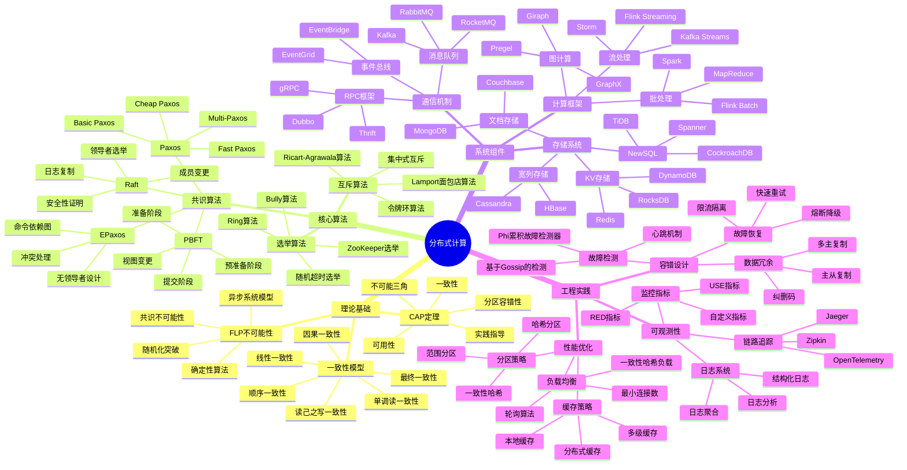

# 分布式系统全景思维导图

> 📊 本文档提供分布式计算领域的完整知识图谱，使用 Mermaid Mindmap 语法绘制

---

## 🗺️ 思维导图

---

## 📋 核心概念速查

| 概念 | 定义 | 典型实现 |
|------|------|----------|
| CAP定理 | 分布式系统最多同时满足一致性、可用性、分区容错性中的两项 | 根据场景取舍 |
| FLP不可能性 | 在异步网络中，即使只有一个故障进程，也不存在确定性的共识算法 | 引入随机化或超时 |
| 共识算法 | 使分布式系统中的多个节点就某个值达成一致的算法 | Paxos/Raft/PBFT |

---

## 🔗 导航链接

### 思维导图系列

- [📊 分布式系统全景思维导图](./01-分布式系统全景思维导图.md) ← 当前
- [🗳️ 共识算法选择思维导图](./02-共识算法选择思维导图.md)
- [💾 存储系统选型思维导图](./03-存储系统选型思维导图.md)

### 决策树系列

- [🌲 分布式事务模式决策树](./04-分布式事务模式决策树.md)
- [⚖️ 一致性级别决策树](./05-一致性级别决策树.md)
- [🔍 故障排查决策树](./06-故障排查决策树.md)

### 对比矩阵系列

- [📊 共识算法五维对比矩阵](./07-共识算法五维对比矩阵.md)
- [📊 存储系统六维选型矩阵](./08-存储系统六维选型矩阵.md)
- [📊 事务模式四维对比矩阵](./09-事务模式四维对比矩阵.md)

### 知识树系列

- [🌳 学习路径知识树](./10-学习路径知识树.md)
- [🔗 先决条件依赖树](./11-先决条件依赖树.md)

### 定理推理树系列

- [🧮 CAP定理推理树](./12-CAP定理推理树.md)
- [🧮 Raft安全性推理树](./13-Raft安全性推理树.md)

### 时序与状态图系列

- [⏱️ 共识算法时序对比图](./14-共识算法时序对比图.md)
- [🔄 一致性状态机图](./15-一致性状态机图.md)

---

## 📚 延伸阅读

- [CAP定理详解](../01-foundation/CAP定理.md)
- [FLP不可能性证明](../01-foundation/FLP不可能性.md)
- [Raft论文中文翻译](../02-algorithms/raft/README.md)
