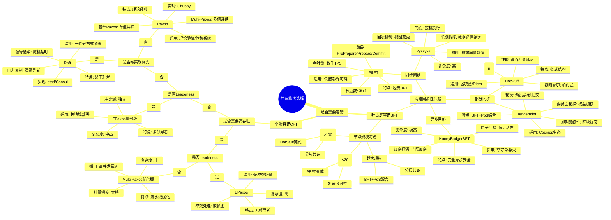
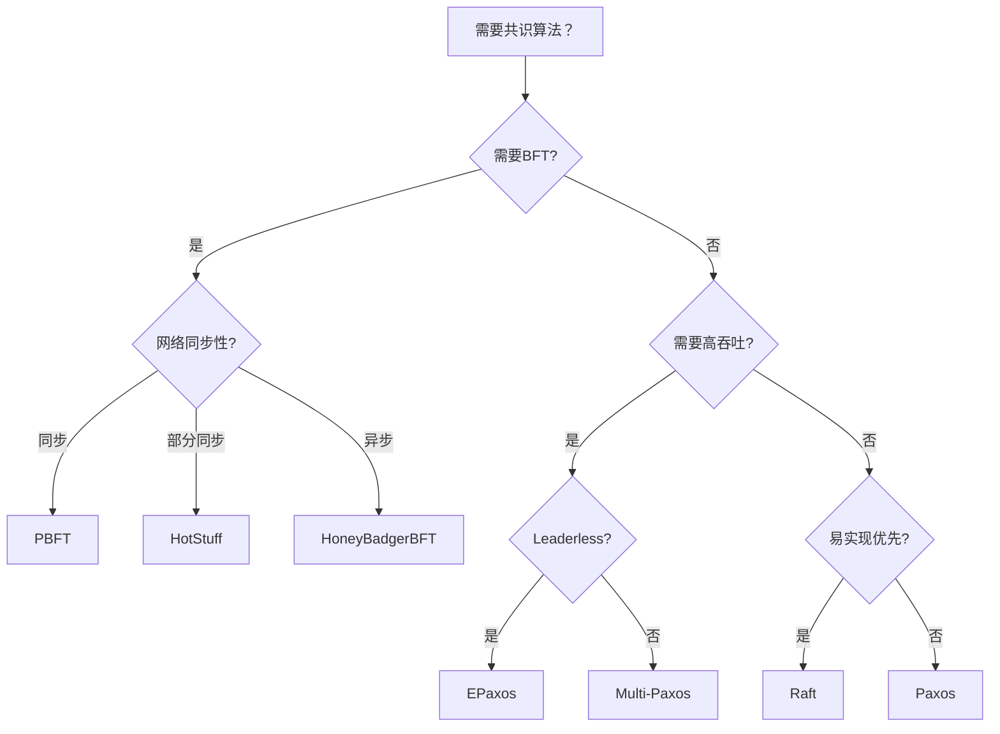

# 共识算法选择思维导图

> 🗳️ 指导如何根据系统需求选择最合适的共识算法

---

## 🗺️ 思维导图

---

## 🎯 快速决策指南

---

## 📊 算法选择对照表

| 场景 | 推荐算法 | 关键理由 |
|------|----------|----------|
| 常规分布式KV | Raft | 易于理解，实现成熟 |
| 跨地域低延迟 | EPaxos | 无领导者，减少RTT |
| 联盟链 | PBFT | 经典BFT，安全性高 |
| 公链共识 | HotStuff/Tendermint | 可扩展，链式结构 |
| 高安全金融 | HoneyBadgerBFT | 异步安全，活性保证 |

---

## 🔗 导航链接

### 思维导图系列

- [📊 分布式系统全景思维导图](./01-分布式系统全景思维导图.md)
- [🗳️ 共识算法选择思维导图](./02-共识算法选择思维导图.md) ← 当前
- [💾 存储系统选型思维导图](./03-存储系统选型思维导图.md)

### 决策树系列

- [🌲 分布式事务模式决策树](./04-分布式事务模式决策树.md)
- [⚖️ 一致性级别决策树](./05-一致性级别决策树.md)
- [🔍 故障排查决策树](./06-故障排查决策树.md)

### 对比矩阵系列

- [📊 共识算法五维对比矩阵](./07-共识算法五维对比矩阵.md)
- [📊 存储系统六维选型矩阵](./08-存储系统六维选型矩阵.md)
- [📊 事务模式四维对比矩阵](./09-事务模式四维对比矩阵.md)

### 知识树系列

- [🌳 学习路径知识树](./10-学习路径知识树.md)
- [🔗 先决条件依赖树](./11-先决条件依赖树.md)

### 定理推理树系列

- [🧮 CAP定理推理树](./12-CAP定理推理树.md)
- [🧮 Raft安全性推理树](./13-Raft安全性推理树.md)

### 时序与状态图系列

- [⏱️ 共识算法时序对比图](./14-共识算法时序对比图.md)
- [🔄 一致性状态机图](./15-一致性状态机图.md)

---

## 📚 延伸阅读

- [Raft算法详解](../02-algorithms/raft/)
- [PBFT算法详解](../02-algorithms/pbft/)
- [共识算法对比分析](../02-algorithms/comparison.md)
