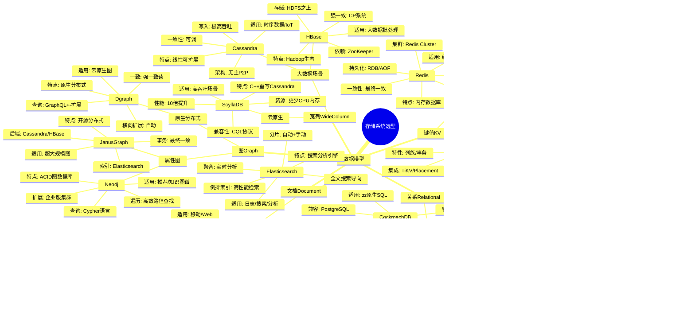
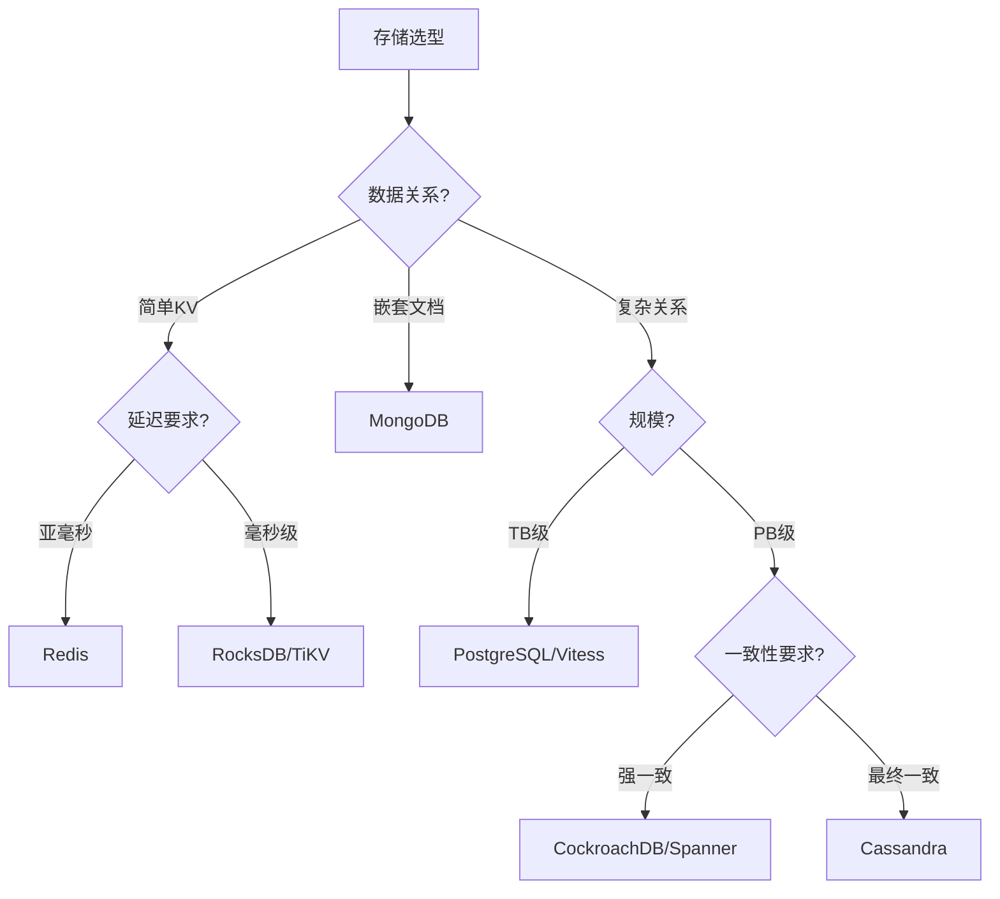

# 存储系统选型思维导图

> 💾 根据数据特征和访问模式选择最合适的分布式存储系统

---

## 🗺️ 思维导图

---

## 🎯 场景-选型速查表

| 应用场景 | 推荐系统 | 关键理由 |
|----------|----------|----------|
| 用户会话缓存 | Redis | 亚毫秒延迟，丰富数据结构 |
| 电商购物车 | Redis + 持久化 | 高并发，TTL支持 |
| 内容管理系统 | MongoDB | 灵活Schema，富查询 |
| 日志时序数据 | Cassandra | 高写入吞吐，TTL过期 |
| 社交网络图谱 | Neo4j | 高效关系遍历 |
| 金融交易系统 | Spanner/CockroachDB | 强一致，ACID事务 |
| 大规模搜索 | Elasticsearch | 倒排索引，聚合分析 |
| IoT传感器数据 | TimescaleDB/Cassandra | 时序优化，高吞吐 |

---

## 📊 选型决策矩阵

---

## 🔗 导航链接

### 思维导图系列

- [📊 分布式系统全景思维导图](./01-分布式系统全景思维导图.md)
- [🗳️ 共识算法选择思维导图](./02-共识算法选择思维导图.md)
- [💾 存储系统选型思维导图](./03-存储系统选型思维导图.md) ← 当前

### 决策树系列

- [🌲 分布式事务模式决策树](./04-分布式事务模式决策树.md)
- [⚖️ 一致性级别决策树](./05-一致性级别决策树.md)
- [🔍 故障排查决策树](./06-故障排查决策树.md)

### 对比矩阵系列

- [📊 共识算法五维对比矩阵](./07-共识算法五维对比矩阵.md)
- [📊 存储系统六维选型矩阵](./08-存储系统六维选型矩阵.md)
- [📊 事务模式四维对比矩阵](./09-事务模式四维对比矩阵.md)

### 知识树系列

- [🌳 学习路径知识树](./10-学习路径知识树.md)
- [🔗 先决条件依赖树](./11-先决条件依赖树.md)

### 定理推理树系列

- [🧮 CAP定理推理树](./12-CAP定理推理树.md)
- [🧮 Raft安全性推理树](./13-Raft安全性推理树.md)

### 时序与状态图系列

- [⏱️ 共识算法时序对比图](./14-共识算法时序对比图.md)
- [🔄 一致性状态机图](./15-一致性状态机图.md)

---

## 📚 延伸阅读

- [存储系统对比分析](../03-storage/comparison.md)
- [Redis架构详解](../03-storage/redis/)
- [NewSQL技术综述](../03-storage/newsql/)
