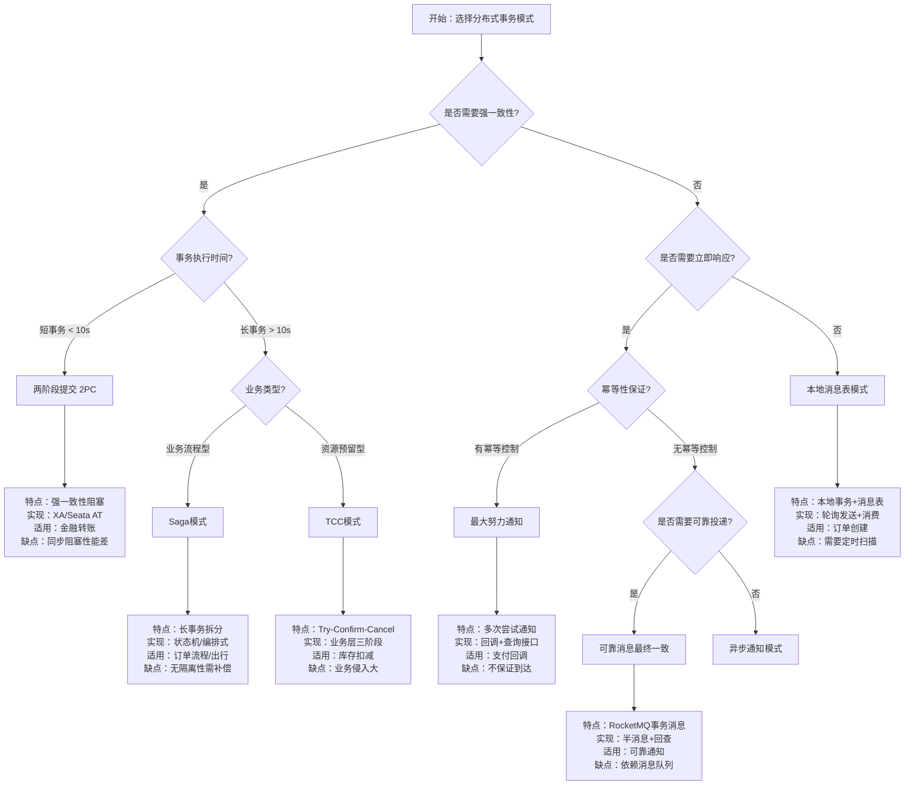
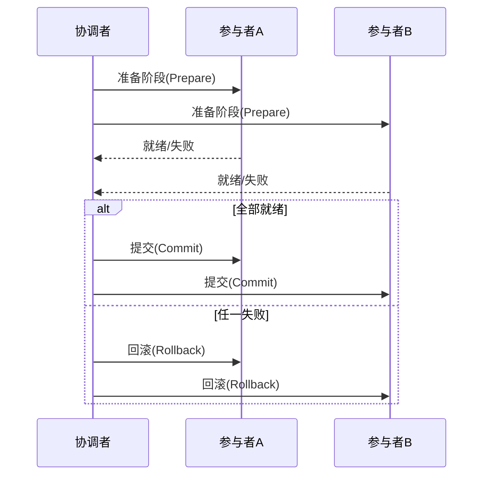
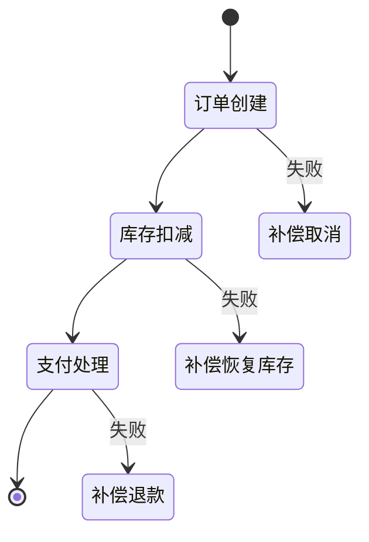
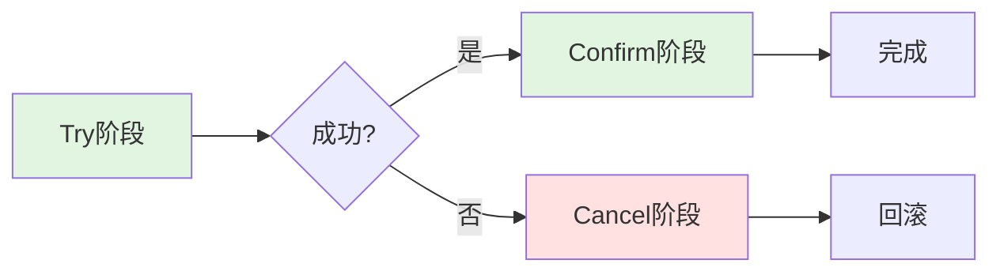
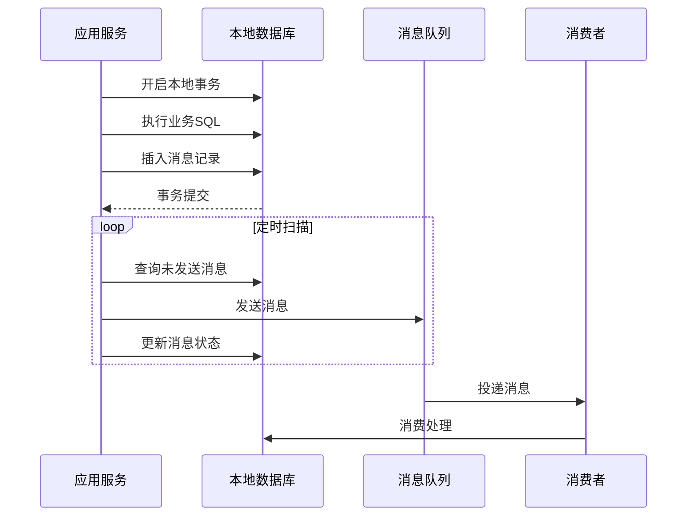

# 分布式事务模式决策树

> 🌲 指导如何选择最适合业务场景的分布式事务解决方案

---

## 🎯 决策树



---

## 📊 详细对比决策表

### 决策因子权重

| 决策因子 | 权重 | 说明 |
|----------|------|------|
| 一致性要求 | 高 | 金融场景必须强一致 |
| 事务时长 | 高 | 长事务必须避免阻塞 |
| 业务侵入度 | 中 | 影响开发效率和维护成本 |
| 系统复杂度 | 中 | 影响运维难度 |
| 性能要求 | 高 | 高并发场景关键因素 |

### 模式选择矩阵

| 场景特征 | 推荐模式 | 备选方案 | 不推荐 |
|----------|----------|----------|--------|
| 短事务+强一致 | 2PC/XA | Seata AT | Saga, TCC |
| 长事务+业务流程 | Saga | 本地消息表 | 2PC |
| 资源预留+短事务 | TCC | Saga | 2PC |
| 高并发+最终一致 | 本地消息表 | Saga | 2PC |
| 外部系统集成 | 最大努力通知 | 可靠消息 | 2PC, TCC |
| 消息驱动架构 | 可靠消息最终一致 | 本地消息表 | 2PC |

---

## 🔍 详细模式分析

### 1. 两阶段提交 (2PC)



**适用场景**：银行转账、账户余额更新
**关键限制**：协调者单点、同步阻塞

### 2. Saga模式



**适用场景**：电商订单、出行预订、保险理赔
**两种实现**：编排式(Choreography) vs 协调式(Orchestration)

### 3. TCC模式



**三阶段说明**：

- **Try**：资源预留/业务检查
- **Confirm**：确认执行业务
- **Cancel**：释放预留资源

### 4. 本地消息表



---

## 🎯 快速决策流程

```
1. 是否涉及资金/关键账务？
   ├─ 是 → 需要强一致 → 评估事务时长
   │        ├─ < 10秒 → 2PC/Seata AT
   │        └─ > 10秒 → 业务拆分后用Saga
   └─ 否 → 评估性能要求
            ├─ 极高并发 → 本地消息表/可靠消息
            └─ 一般并发 → Saga/TCC
```

---

## 🔗 导航链接

### 思维导图系列

- [📊 分布式系统全景思维导图](./01-分布式系统全景思维导图.md)
- [🗳️ 共识算法选择思维导图](./02-共识算法选择思维导图.md)
- [💾 存储系统选型思维导图](./03-存储系统选型思维导图.md)

### 决策树系列

- [🌲 分布式事务模式决策树](./04-分布式事务模式决策树.md) ← 当前
- [⚖️ 一致性级别决策树](./05-一致性级别决策树.md)
- [🔍 故障排查决策树](./06-故障排查决策树.md)

### 对比矩阵系列

- [📊 共识算法五维对比矩阵](./07-共识算法五维对比矩阵.md)
- [📊 存储系统六维选型矩阵](./08-存储系统六维选型矩阵.md)
- [📊 事务模式四维对比矩阵](./09-事务模式四维对比矩阵.md)

### 知识树系列

- [🌳 学习路径知识树](./10-学习路径知识树.md)
- [🔗 先决条件依赖树](./11-先决条件依赖树.md)

### 定理推理树系列

- [🧮 CAP定理推理树](./12-CAP定理推理树.md)
- [🧮 Raft安全性推理树](./13-Raft安全性推理树.md)

### 时序与状态图系列

- [⏱️ 共识算法时序对比图](./14-共识算法时序对比图.md)
- [🔄 一致性状态机图](./15-一致性状态机图.md)

---

## 📚 延伸阅读

- [分布式事务详解](../04-transactions/)
- [Seata框架实践](../04-transactions/seata/)
- [Saga模式实现](../04-transactions/saga/)
