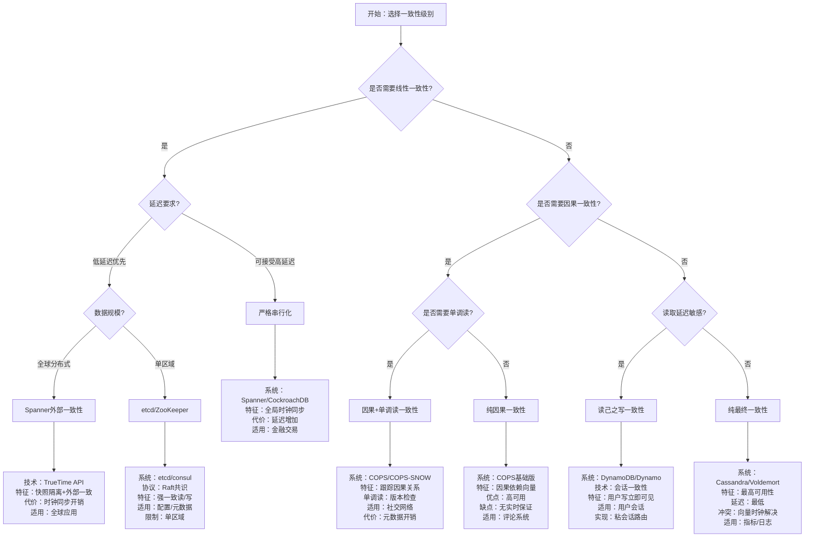
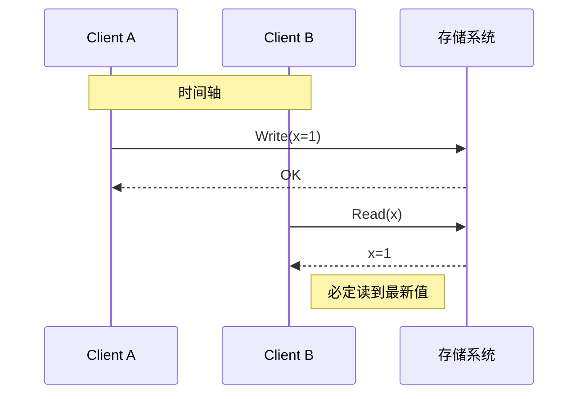
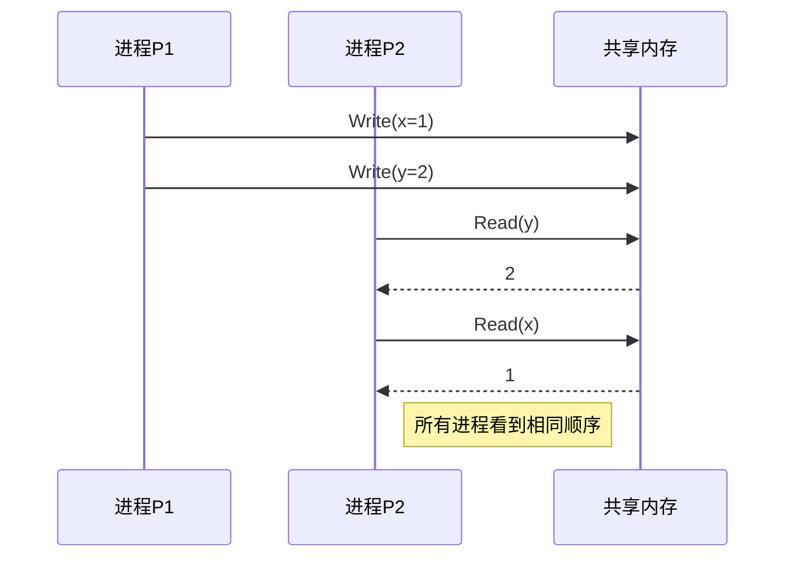
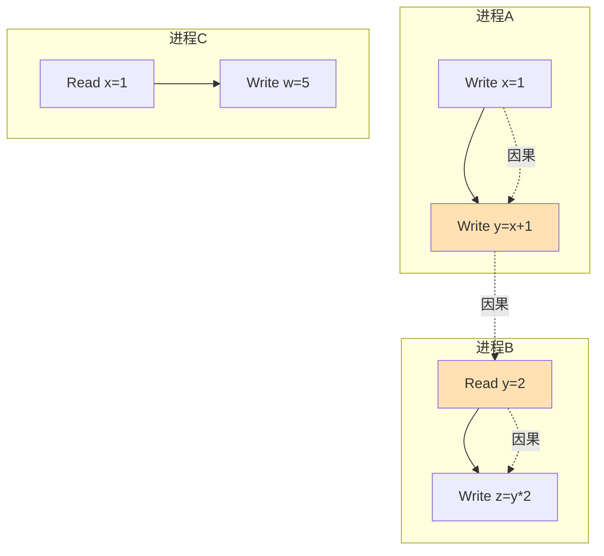
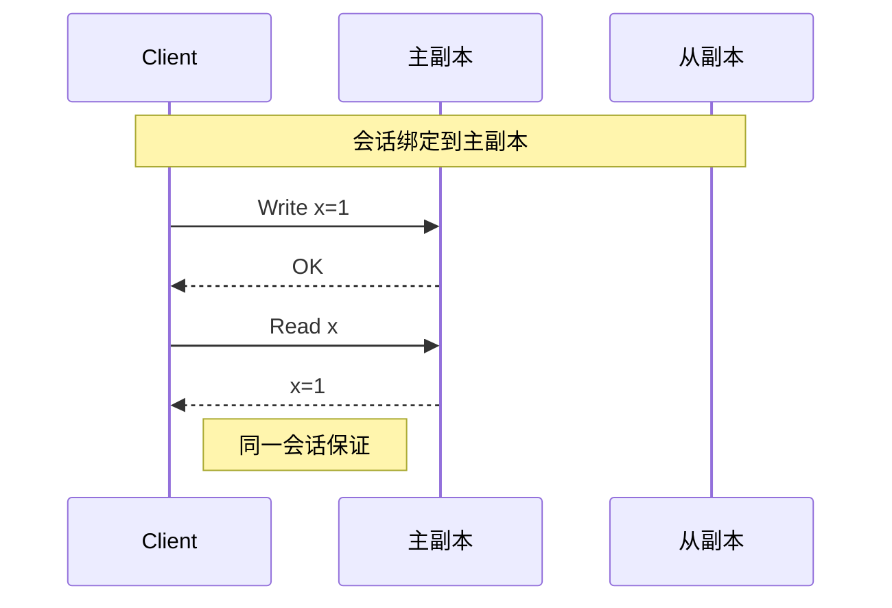
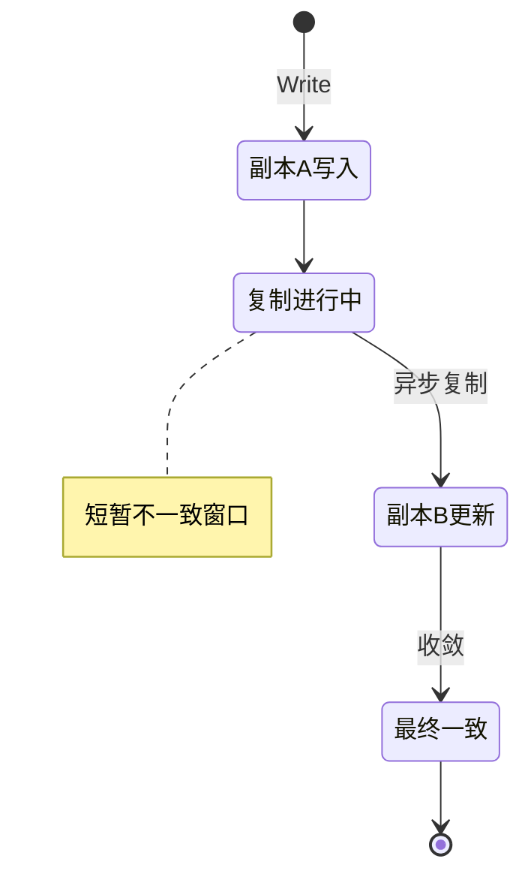
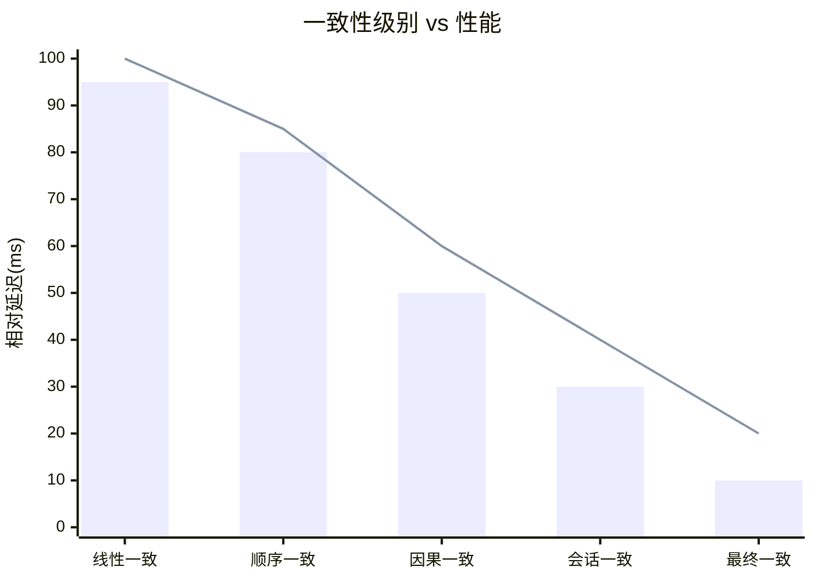

# 一致性级别决策树

> ⚖️ 根据业务需求选择合适的一致性保证级别

---

## 🎯 决策树

---

## 📊 一致性级别光谱

---

## 🔍 详细级别定义

### 1. 线性一致性 (Linearizability)

**特征**：

- 所有操作看起来都是原子的
- 任何读取都能看到最新的写入
- 等价于单副本系统

**实现系统**：etcd, ZooKeeper, Spanner, CockroachDB

### 2. 顺序一致性 (Sequential Consistency)

**与线性一致性区别**：不要求实时性，只要求全局顺序一致

### 3. 因果一致性 (Causal Consistency)

**依赖追踪**：

- 读取-写入依赖
- 写入-写入依赖
- 传递性因果

### 4. 会话一致性 (Session Consistency)

### 5. 最终一致性 (Eventual Consistency)

---

## 🎯 业务场景匹配

| 业务场景 | 推荐一致性 | 代表系统 | 理由 |
|----------|------------|----------|------|
| 银行转账 | 线性一致性 | Spanner | 资金准确性至上 |
| 库存扣减 | 线性一致性/顺序一致 | etcd | 避免超卖 |
| 社交点赞 | 因果一致性 | COPS | 因果关系重要 |
| 用户评论 | 会话一致性 | DynamoDB | 用户自己可见 |
| 商品列表 | 最终一致性 | Cassandra | 高可用优先 |
| 日志记录 | 最终一致性 | Kafka | 吞吐优先 |
| 配置管理 | 线性一致性 | etcd | 配置必须准确 |
| 推荐结果 | 最终一致性 | Redis | 非关键数据 |

---

## ⚡ 性能-一致性权衡

---

## 🔗 导航链接

### 思维导图系列

- [📊 分布式系统全景思维导图](./01-分布式系统全景思维导图.md)
- [🗳️ 共识算法选择思维导图](./02-共识算法选择思维导图.md)
- [💾 存储系统选型思维导图](./03-存储系统选型思维导图.md)

### 决策树系列

- [🌲 分布式事务模式决策树](./04-分布式事务模式决策树.md)
- [⚖️ 一致性级别决策树](./05-一致性级别决策树.md) ← 当前
- [🔍 故障排查决策树](./06-故障排查决策树.md)

### 对比矩阵系列

- [📊 共识算法五维对比矩阵](./07-共识算法五维对比矩阵.md)
- [📊 存储系统六维选型矩阵](./08-存储系统六维选型矩阵.md)
- [📊 事务模式四维对比矩阵](./09-事务模式四维对比矩阵.md)

### 知识树系列

- [🌳 学习路径知识树](./10-学习路径知识树.md)
- [🔗 先决条件依赖树](./11-先决条件依赖树.md)

### 定理推理树系列

- [🧮 CAP定理推理树](./12-CAP定理推理树.md)
- [🧮 Raft安全性推理树](./13-Raft安全性推理树.md)

### 时序与状态图系列

- [⏱️ 共识算法时序对比图](./14-共识算法时序对比图.md)
- [🔄 一致性状态机图](./15-一致性状态机图.md)

---

## 📚 延伸阅读

- [一致性模型详解](../01-foundation/consistency-models.md)
- [PACELC定理](../01-foundation/PACELC.md)
- [COPS论文解读](../03-storage/cops/)
