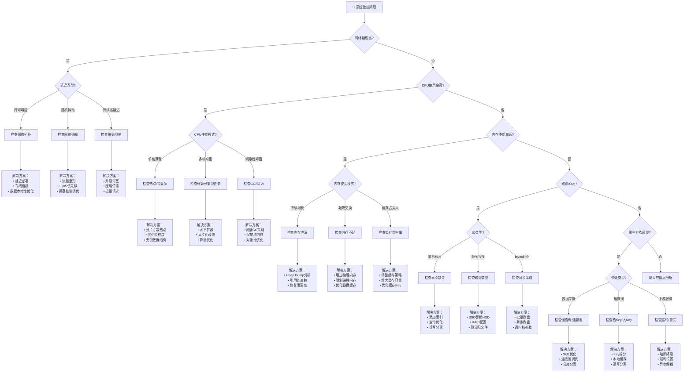
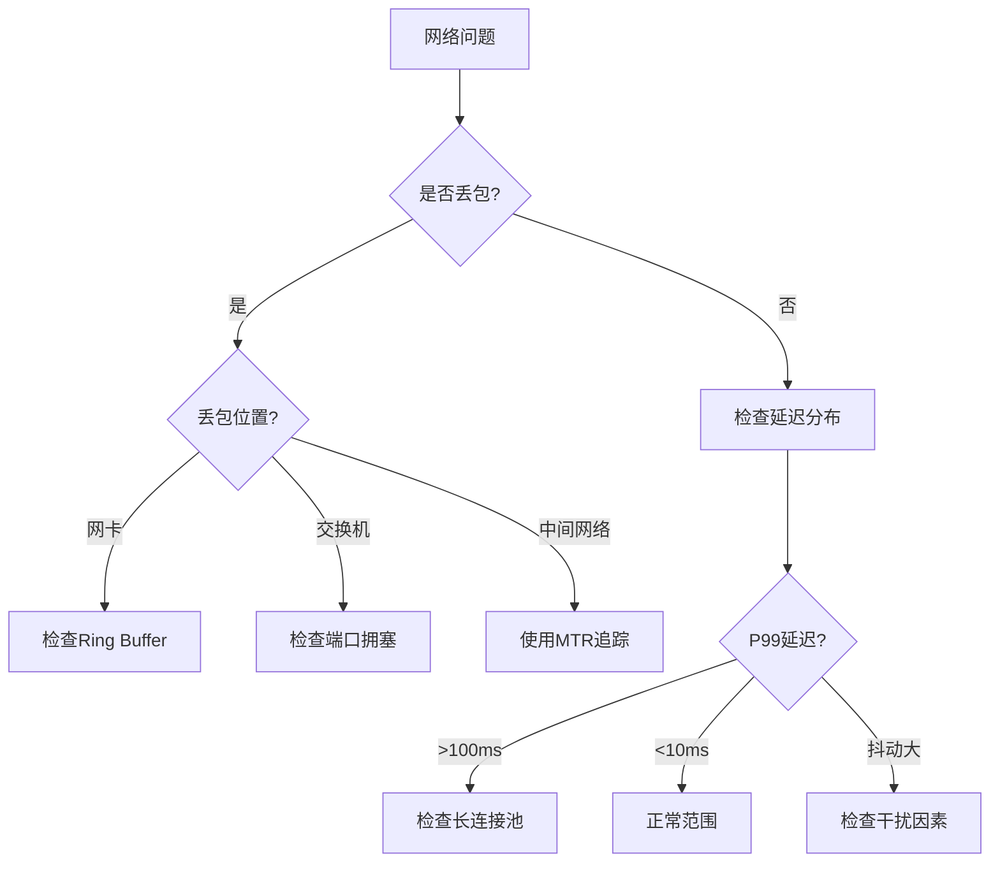
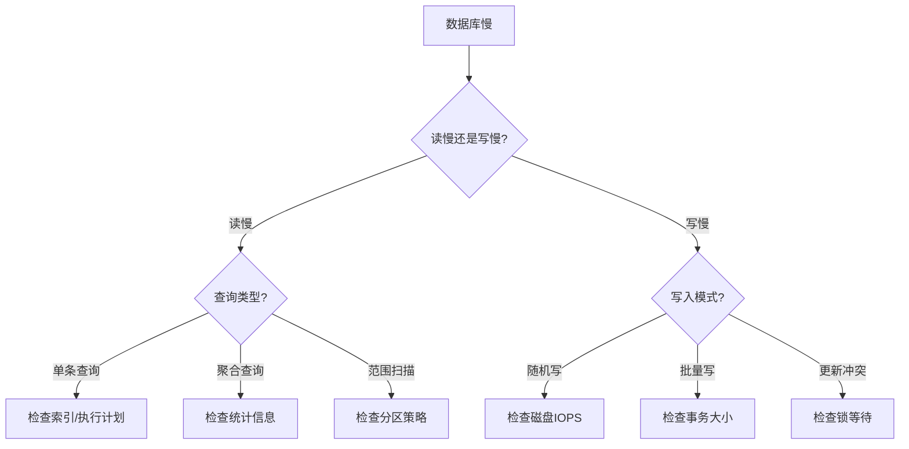

# 故障排查决策树

> 🔍 系统化诊断分布式系统性能问题的决策流程

---

## 🎯 主决策树：系统为什么慢？



---

## 🌲 子决策树：详细诊断路径

### 网络问题诊断



### 数据库慢查询诊断



---

## 📊 关键指标检查清单

### RED 指标检查

| 指标 | 健康阈值 | 检查工具 | 常见原因 |
|------|----------|----------|----------|
| Request Rate | 符合预期 | Prometheus | 突发流量/爬虫 |
| Error Rate | < 0.1% | Grafana | 依赖故障/代码Bug |
| Duration P99 | < SLA | APM | 上面决策树分析 |

### USE 指标检查

| 资源 | 利用率 | 饱和度 | 错误 |
|------|--------|--------|------|
| CPU | < 70% | Load < CPU*2 | 无 |
| 内存 | < 80% | Swap使用 = 0 | OOM次数 = 0 |
| 磁盘 | < 70% | IO Wait < 20% | 磁盘错误 = 0 |
| 网络 | < 70% | 重传率 < 1% | 丢包 = 0 |

---

## 🔧 常用诊断命令

```bash
# 网络诊断
ping -c 100 $HOST          # 基础连通性
mtr --report $HOST          # 路径分析
ss -tan | grep ESTAB | wc -l  # 连接数统计
nicstat 1 10               # 网卡统计

# CPU诊断
top -H -p $PID             # 线程级CPU
perf top -p $PID           # 热点函数
mpstat -P ALL 1            # 核级统计

# 内存诊断
vmstat 1 10                # 内存/交换
pmap -x $PID | tail -1     # 进程内存
jmap -histo $PID           # Java对象统计

# IO诊断
iostat -xz 1 10            # 磁盘IO
iotop -p $PID              # 进程IO
strace -e trace=file $CMD  # 系统调用追踪
```

---

## 🎯 故障排查SOP


---

## 🔗 导航链接

### 思维导图系列

- [📊 分布式系统全景思维导图](./01-分布式系统全景思维导图.md)
- [🗳️ 共识算法选择思维导图](./02-共识算法选择思维导图.md)
- [💾 存储系统选型思维导图](./03-存储系统选型思维导图.md)

### 决策树系列

- [🌲 分布式事务模式决策树](./04-分布式事务模式决策树.md)
- [⚖️ 一致性级别决策树](./05-一致性级别决策树.md)
- [🔍 故障排查决策树](./06-故障排查决策树.md) ← 当前

### 对比矩阵系列

- [📊 共识算法五维对比矩阵](./07-共识算法五维对比矩阵.md)
- [📊 存储系统六维选型矩阵](./08-存储系统六维选型矩阵.md)
- [📊 事务模式四维对比矩阵](./09-事务模式四维对比矩阵.md)

### 知识树系列

- [🌳 学习路径知识树](./10-学习路径知识树.md)
- [🔗 先决条件依赖树](./11-先决条件依赖树.md)

### 定理推理树系列

- [🧮 CAP定理推理树](./12-CAP定理推理树.md)
- [🧮 Raft安全性推理树](./13-Raft安全性推理树.md)

### 时序与状态图系列

- [⏱️ 共识算法时序对比图](./14-共识算法时序对比图.md)
- [🔄 一致性状态机图](./15-一致性状态机图.md)

---

## 📚 延伸阅读

- [可观测性实践](../05-practice/observability.md)
- [性能调优指南](../05-practice/performance-tuning.md)
- [故障案例集](../05-practice/case-studies/)
