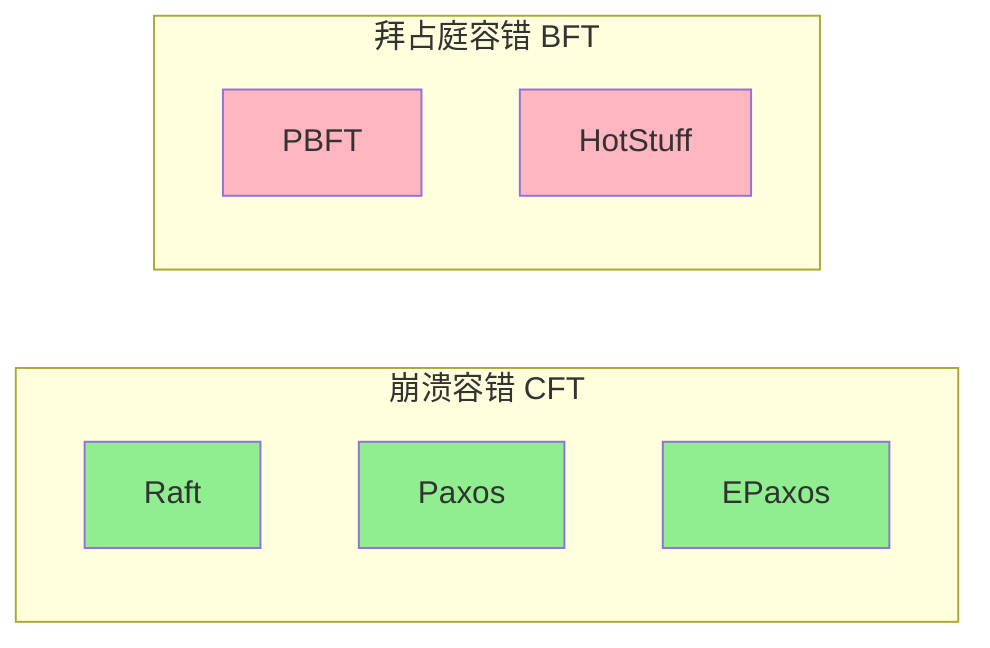
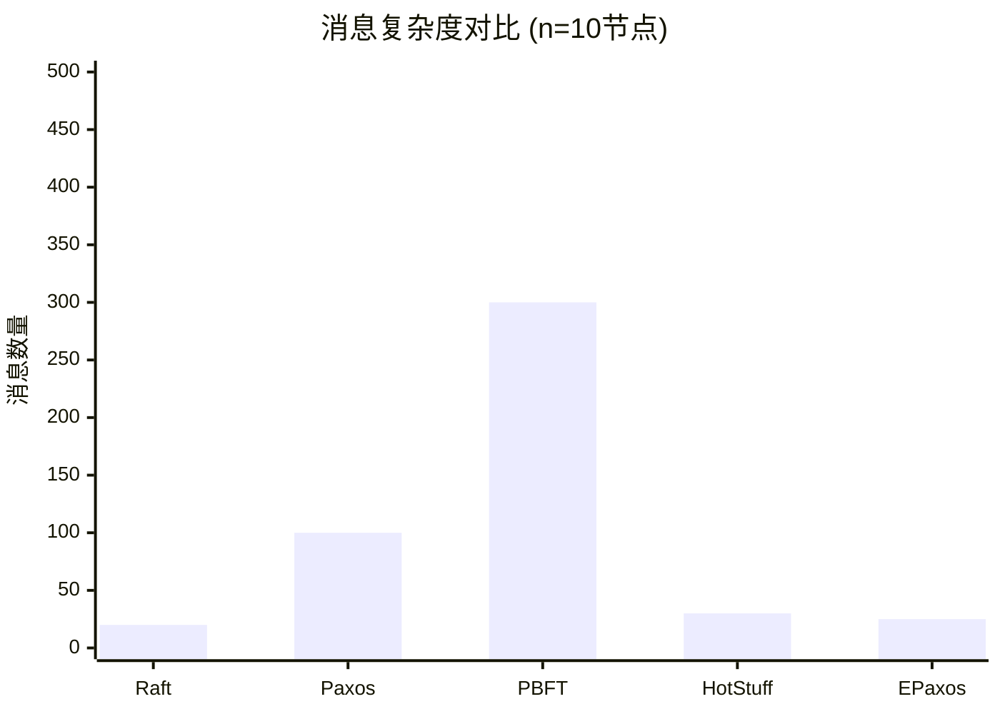
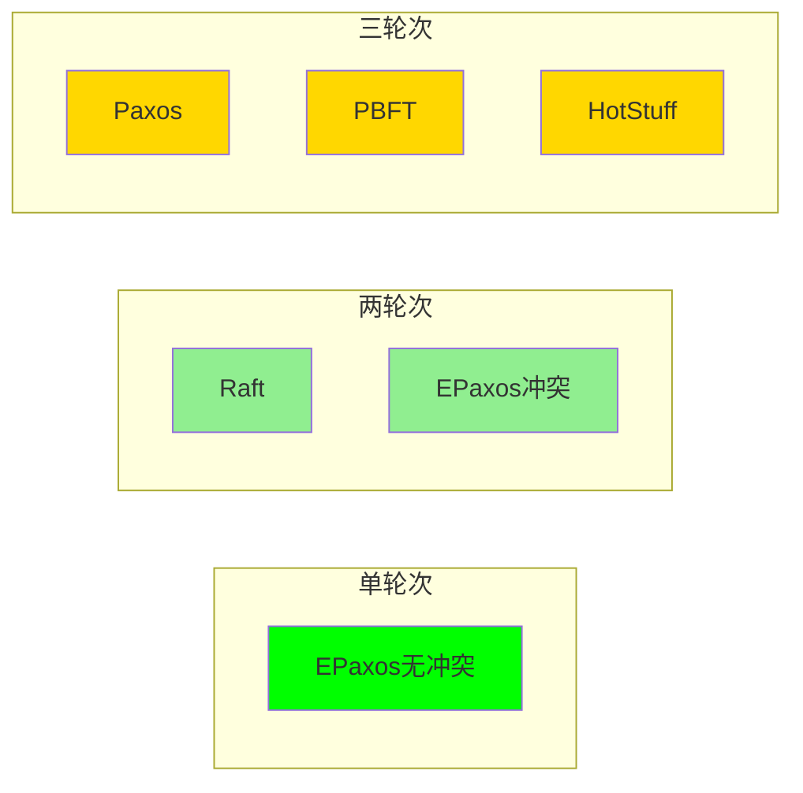
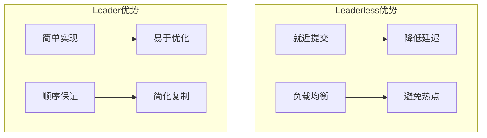
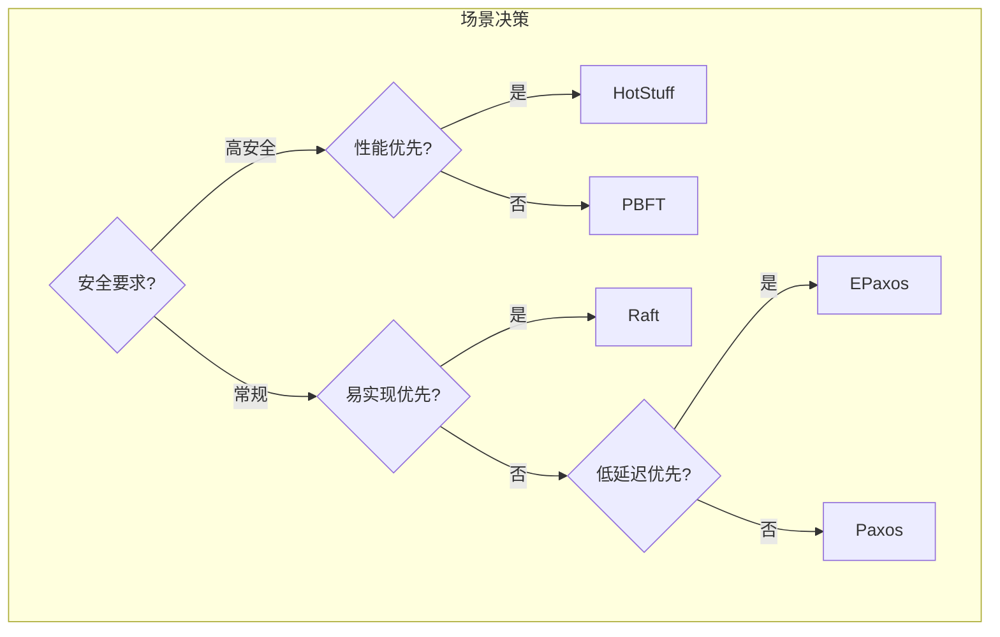

# 共识算法五维对比矩阵

> 📊 全面对比主流共识算法的核心特性

---

## 📈 五维对比总览

| 维度\算法 | Raft | Paxos | PBFT | HotStuff | EPaxos |
|:--------:|:----:|:-----:|:----:|:--------:|:------:|
| 故障模型 | CFT | CFT | BFT | BFT | CFT |
| 消息复杂度 | O(n) | O(n²) | O(n²) | O(n) | O(n)冲突时O(n²) |
| 延迟(轮次) | 2 | 2-3 | 3 | 3 | 1-2 |
| Leader依赖 | 强 | 可选 | 强 | 强 | 无 |
| 实现复杂度 | ⭐⭐ | ⭐⭐⭐⭐ | ⭐⭐⭐⭐⭐ | ⭐⭐⭐ | ⭐⭐⭐⭐ |

---

## 维度1：故障模型 (Fault Model)



| 算法 | 故障模型 | 最小节点数 | 容错数 f | 故障类型 |
|------|----------|-----------|----------|----------|
| **Raft** | CFT | 2f+1=3 | 1 | 崩溃、网络分区 |
| **Paxos** | CFT | 2f+1=3 | 1 | 崩溃、网络分区 |
| **PBFT** | BFT | 3f+1=4 | 1 | 任意恶意行为 |
| **HotStuff** | BFT | 3f+1=4 | 1 | 任意恶意行为 |
| **EPaxos** | CFT | 2f+1=3 | 1 | 崩溃、网络分区 |

> **选择建议**：信任环境选CFT（性能更好），对抗环境选BFT（安全性更高）

---

## 维度2：消息复杂度 (Message Complexity)

| 算法 | 正常流程 | 视图变更 | 复杂度级别 |
|------|----------|----------|----------|
| **Raft** | 2n (心跳+日志) | O(n) | ⭐⭐ 线性 |
| **Paxos** | n² (多轮广播) | 高 | ⭐⭐⭐⭐ 平方级 |
| **PBFT** | O(n²) | O(n³) | ⭐⭐⭐⭐⭐ 高平方级 |
| **HotStuff** | O(n) | O(n) | ⭐⭐⭐ 线性优化 |
| **EPaxos** | O(n)无冲突 | O(n²)冲突时 | ⭐⭐⭐ 自适应 |



> **性能影响**：消息复杂度直接影响网络带宽消耗和系统可扩展性

---

## 维度3：延迟（消息轮次）



| 算法 | 消息轮次 | RTT倍数 | 延迟特征 |
|------|----------|---------|----------|
| **Raft** | 2轮 | 2×RTT | Leader→Followers→Ack |
| **Paxos** | 2-3轮 | 2-3×RTT | Prepare→Accept→Learn |
| **PBFT** | 3轮 | 3×RTT | PrePrepare→Prepare→Commit |
| **HotStuff** | 3轮 | 3×RTT | NewView→Prepare→PreCommit→Commit |
| **EPaxos** | 1-2轮 | 1-2×RTT | 无冲突1轮，冲突2轮 |

### 详细流程对比

**Raft (2轮)**

```
Client → Leader → Followers → Leader → Client
  T1      T2        T3         T4       T5
  └────────2 RTT────────┘
```

**PBFT (3轮)**

```
Client → Primary → Replicas → Replicas → Replicas → Client
  T1       T2        T3         T4         T5         T6
  └────────────3 RTT────────────┘
```

> **延迟敏感场景**：跨地域部署首选EPaxos，单区域Raft足够

---

## 维度4：Leader依赖

| 算法 | Leader角色 | Leaderless特性 | 优势 | 劣势 |
|------|-----------|----------------|------|------|
| **Raft** | 强Leader | ❌ 无 | 简单高效 | Leader热点 |
| **Paxos** | 可选 | ⚠️ Multi-Paxos | 灵活 | 复杂 |
| **PBFT** | Primary | ❌ 无 | 确定性 | Primary瓶颈 |
| **HotStuff** | 领导者轮换 | ❌ 无 | 公平性 | 复杂度 |
| **EPaxos** | 无 | ✅ Leaderless | 就近提交 | 冲突处理 |



> **选型指导**：写入集中选Leader模式，写入分散选Leaderless

---

## 维度5：实现复杂度

| 算法 | 代码行数(参考) | 理解难度 | 调试难度 | 成熟实现 |
|------|---------------|----------|----------|----------|
| **Raft** | ~2,000 | ⭐⭐ 容易 | 低 | etcd, Consul |
| **Paxos** | ~5,000 | ⭐⭐⭐⭐ 困难 | 高 | Chubby, ZK |
| **PBFT** | ~10,000 | ⭐⭐⭐⭐⭐ 极难 | 极高 | 研究原型 |
| **HotStuff** | ~8,000 | ⭐⭐⭐ 中等 | 高 | Diem/Nova |
| **EPaxos** | ~6,000 | ⭐⭐⭐⭐ 困难 | 高 | 研究原型 |

### 复杂度来源分析

| 算法 | 主要复杂度来源 |
|------|---------------|
| **Raft** | 领导者选举边界条件 |
| **Paxos** | 多轮协商、活锁处理 |
| **PBFT** | 三阶段广播、视图变更 |
| **HotStuff** | 链式结构、视图同步 |
| **EPaxos** | 依赖图管理、冲突检测 |

---

## 🎯 综合选型建议



| 使用场景 | 推荐算法 | 理由 |
|----------|----------|------|
| 通用分布式KV | Raft | 易理解，实现成熟 |
| 区块链/公链 | HotStuff | 链式结构，性能优异 |
| 跨地域部署 | EPaxos | Leaderless降低延迟 |
| 金融联盟链 | PBFT | BFT安全保证 |
| 学术研究 | Paxos | 理论基础经典 |

---

## 🔗 导航链接

### 思维导图系列

- [📊 分布式系统全景思维导图](./01-分布式系统全景思维导图.md)
- [🗳️ 共识算法选择思维导图](./02-共识算法选择思维导图.md)
- [💾 存储系统选型思维导图](./03-存储系统选型思维导图.md)

### 决策树系列

- [🌲 分布式事务模式决策树](./04-分布式事务模式决策树.md)
- [⚖️ 一致性级别决策树](./05-一致性级别决策树.md)
- [🔍 故障排查决策树](./06-故障排查决策树.md)

### 对比矩阵系列

- [📊 共识算法五维对比矩阵](./07-共识算法五维对比矩阵.md) ← 当前
- [📊 存储系统六维选型矩阵](./08-存储系统六维选型矩阵.md)
- [📊 事务模式四维对比矩阵](./09-事务模式四维对比矩阵.md)

### 知识树系列

- [🌳 学习路径知识树](./10-学习路径知识树.md)
- [🔗 先决条件依赖树](./11-先决条件依赖树.md)

### 定理推理树系列

- [🧮 CAP定理推理树](./12-CAP定理推理树.md)
- [🧮 Raft安全性推理树](./13-Raft安全性推理树.md)

### 时序与状态图系列

- [⏱️ 共识算法时序对比图](./14-共识算法时序对比图.md)
- [🔄 一致性状态机图](./15-一致性状态机图.md)

---

## 📚 延伸阅读

- [Raft论文](../02-algorithms/raft/raft-paper.pdf)
- [PBFT论文](../02-algorithms/pbft/pbft-paper.pdf)
- [HotStuff论文](../02-algorithms/hotstuff/)
