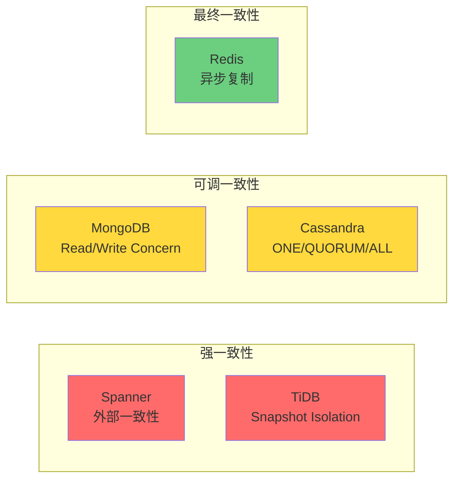
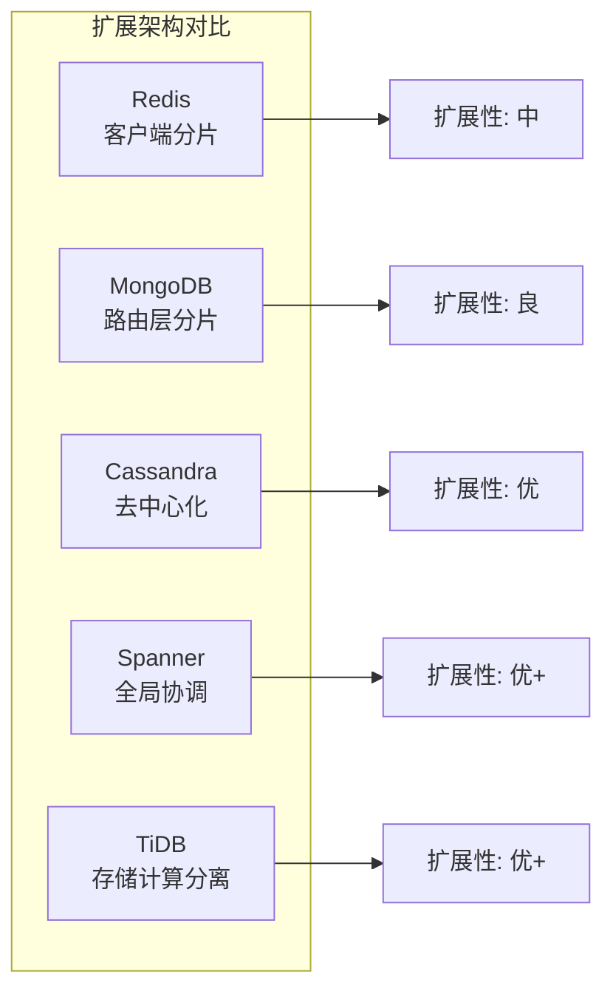
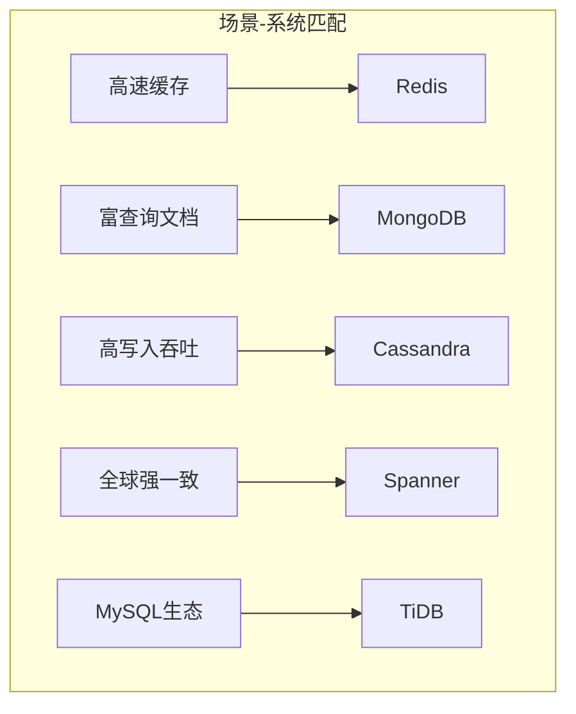
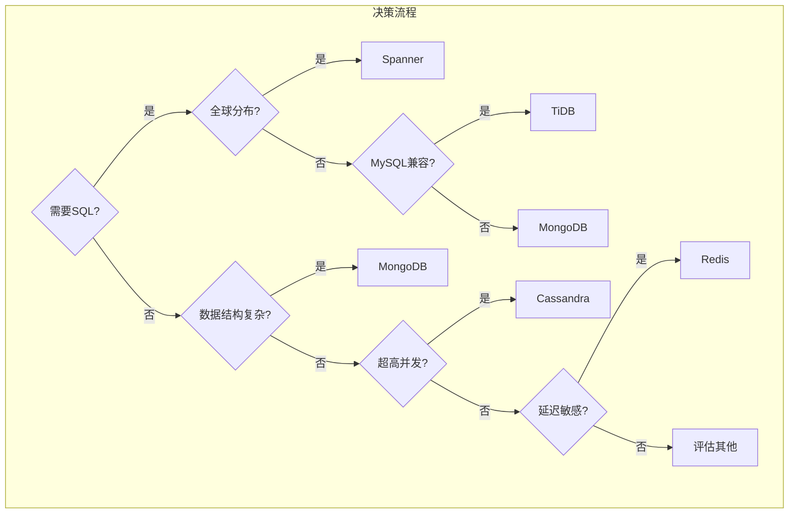

# 存储系统六维选型矩阵

> 📊 全面对比主流分布式存储系统的核心特性

---

## 📈 六维对比总览

| 维度\系统 | Redis | MongoDB | Cassandra | Spanner | TiDB |
|:--------:|:-----:|:-------:|:---------:|:-------:|:----:|
| 一致性模型 | 最终一致 | 可调 | 可调 | 强一致 | 强一致 |
| 分区容错性 | AP | CP/AP可调 | AP | CP | CP |
| 扩展方式 | 水平分片 | 自动分片 | 线性扩展 | 全局分布 | 存算分离 |
| 查询能力 | KV+数据结构 | 富查询 | CQL有限 | 全局SQL | 兼容MySQL |
| 适用场景 | 缓存/会话 | 内容/文档 | 时序/IoT | 金融/Globa | HTAP |
| 运维复杂度 | ⭐⭐ | ⭐⭐⭐ | ⭐⭐⭐ | ⭐⭐⭐⭐⭐ | ⭐⭐⭐⭐ |

---

## 维度1：一致性模型 (Consistency Model)



| 系统 | 默认一致性 | 可调级别 | 实现机制 |
|------|-----------|----------|----------|
| **Redis** | 最终一致 | ❌ 不可调 | 异步主从复制 |
| **MongoDB** | 最终一致 | ✅ 可调 | Read/Write Concern |
| **Cassandra** | ONE(弱) | ✅ 可调 | 副本因子+一致性级别 |
| **Spanner** | 外部一致 | ⚠️ 有限调 | TrueTime + 2PC |
| **TiDB** | Snapshot | ⚠️ 有限调 | TiKV + Raft |

### 一致性级别对比表

| 系统 | 强一致性 | 因果一致性 | 会话一致性 | 最终一致性 |
|------|:--------:|:--------:|:--------:|:--------:|
| Redis | ❌ | ❌ | ✅ (单实例) | ✅ |
| MongoDB | ✅ (majority) | ❌ | ✅ | ✅ (默认) |
| Cassandra | ✅ (QUORUM/ALL) | ❌ | ❌ | ✅ (ONE) |
| Spanner | ✅ (默认) | ✅ | ✅ | ❌ |
| TiDB | ✅ (默认) | ✅ | ✅ | ❌ |

---

## 维度2：分区容错性 (Partition Tolerance)

```mermaid
quadrantChart
    title CAP权衡象限
    x-axis 可用性(A)低 --> 高
    y-axis 一致性(C)低 --> 高
    quadrant-1 理想系统
    quadrant-2 CP系统
    quadrant-3 AP系统
    quadrant-4 不可用
    Spanner: [0.6, 0.95]
    TiDB: [0.7, 0.9]
    Redis: [0.9, 0.3]
    Cassandra: [0.95, 0.5]
    MongoDB: [0.8, 0.7]
```

| 系统 | CAP倾向 | 分区行为 | 恢复策略 |
|------|---------|----------|----------|
| **Redis** | AP | 主从切换可能丢数据 | 哨兵/Cluster自动failover |
| **MongoDB** | CP/AP可调 |  configurable | 副本集选举 |
| **Cassandra** | AP | Hinted Handoff | 反熵修复 |
| **Spanner** | CP | 拒绝写入保证一致 | 自动重试/超时 |
| **TiDB** | CP | TiKV Leader迁移 | PD自动调度 |

---

## 维度3：扩展方式 (Scaling Method)

| 系统 | 扩展维度 | 扩展粒度 | 再平衡 | 扩展限制 |
|------|----------|----------|--------|----------|
| **Redis** | 水平分片 | 16384 slots | 手动/有限自动 | 单个slot热点 |
| **MongoDB** | 水平分片 | chunk(64MB) | 自动分裂迁移 | 分片键选择 |
| **Cassandra** | 线性扩展 | 节点级 | 自动令牌分配 | 无理论限制 |
| **Spanner** | 全球分布 | Split/Tablet | 自动负载均衡 | 延迟边界 |
| **TiDB** | 存算分离 | Region(96MB) | PD自动调度 | 存储计算独立扩 |



---

## 维度4：查询能力 (Query Capability)

| 系统 | 查询语言 | 索引类型 | 聚合能力 | 复杂查询 |
|------|----------|----------|----------|----------|
| **Redis** | 命令式 | 无/有限 | 有限 | ❌ 不支持 |
| **MongoDB** | MQL | 单字段/复合/文本/地理 | 聚合管道 | ✅ 强大 |
| **Cassandra** | CQL | 主键/二级索引 | 有限聚合 | ⚠️ 受限 |
| **Spanner** | SQL(ANSI) | 二级/交错/搜索 | 完整SQL | ✅ 全局查询 |
| **TiDB** | MySQL兼容 | 完整MySQL索引 | 完整SQL | ✅ HTAP支持 |

### 查询能力雷达图（文字版）

```
查询能力评估 (满分5分)

                 复杂查询
                    5
                    |
     聚合能力 4 ----+---- 4 二级索引
                    |
    全文搜索 3 -----+----- 5 SQL支持
                    |
                  基础KV

Redis:     KV=5, SQL=0, 索引=1, 聚合=2, 复杂=0
MongoDB:   KV=5, SQL=0, 索引=4, 聚合=4, 复杂=4
Cassandra: KV=4, SQL=3, 索引=3, 聚合=2, 复杂=2
Spanner:   KV=4, SQL=5, 索引=4, 聚合=5, 复杂=5
TiDB:      KV=4, SQL=5, 索引=5, 聚合=5, 复杂=5
```

---

## 维度5：适用场景 (Use Cases)

| 场景 | 首选系统 | 备选方案 | 不推荐理由 |
|------|----------|----------|-----------|
| **缓存/会话** | Redis | Memcached | 其他系统延迟高 |
| **内容管理** | MongoDB | Couchbase | 需要灵活Schema |
| **时序/IoT** | Cassandra | InfluxDB | 高写入吞吐需求 |
| **金融交易** | Spanner | CockroachDB | 全球强一致需求 |
| **电商OLTP** | TiDB | MySQL分片 | 在线扩缩容需求 |
| **搜索/日志** | Elasticsearch | MongoDB | 倒排索引优化 |
| **配置/元数据** | etcd | ZooKeeper | 强一致小数据 |



---

## 维度6：运维复杂度 (Operational Complexity)

| 系统 | 部署难度 | 监控难度 | 调优复杂度 | 故障恢复 | 社区支持 |
|------|----------|----------|------------|----------|----------|
| **Redis** | ⭐⭐ 简单 | 低 | 低 | 快 | ⭐⭐⭐⭐⭐ |
| **MongoDB** | ⭐⭐⭐ 中等 | 中 | 中 | 中 | ⭐⭐⭐⭐⭐ |
| **Cassandra** | ⭐⭐⭐ 中等 | 中 | 高 | 慢 | ⭐⭐⭐⭐ |
| **Spanner** | ⭐⭐ 托管 | 低 | 低 | 自动 | ⭐⭐⭐ (GCP) |
| **TiDB** | ⭐⭐⭐⭐ 复杂 | 高 | 高 | 中 | ⭐⭐⭐⭐ |

### 运维要素详细对比

| 要素 | Redis | MongoDB | Cassandra | Spanner | TiDB |
|------|-------|---------|-----------|---------|------|
| 节点类型 | 统一 | Primary/Secondary | 统一 | 托管 | PD/TiKV/TiDB |
| 配置数量 | 少 | 中等 | 多 | 无 | 多 |
| 升级难度 | 低 | 中 | 高 | 无 | 高 |
| 备份策略 | RDB/AOF | Ops Manager | nodetool | 自动 | BR工具 |
| 扩容操作 | 手动reshard | 自动 | 自动 | 自动 | 自动(存储) |

---

## 🎯 综合选型矩阵



| 需求组合 | 推荐系统 | 配置建议 |
|----------|----------|----------|
| 强一致+SQL+全球 | Spanner | 多区域部署 |
| 强一致+SQL+开源 | TiDB | 3+ PD, 3+ TiKV |
| 高吞吐+时序 | Cassandra | RF=3, CL=QUORUM |
| 灵活Schema+富查询 | MongoDB | 副本集+分片 |
| 极低延迟+简单结构 | Redis | Cluster模式 |

---

## 🔗 导航链接

### 思维导图系列

- [📊 分布式系统全景思维导图](./01-分布式系统全景思维导图.md)
- [🗳️ 共识算法选择思维导图](./02-共识算法选择思维导图.md)
- [💾 存储系统选型思维导图](./03-存储系统选型思维导图.md)

### 决策树系列

- [🌲 分布式事务模式决策树](./04-分布式事务模式决策树.md)
- [⚖️ 一致性级别决策树](./05-一致性级别决策树.md)
- [🔍 故障排查决策树](./06-故障排查决策树.md)

### 对比矩阵系列

- [📊 共识算法五维对比矩阵](./07-共识算法五维对比矩阵.md)
- [📊 存储系统六维选型矩阵](./08-存储系统六维选型矩阵.md) ← 当前
- [📊 事务模式四维对比矩阵](./09-事务模式四维对比矩阵.md)

### 知识树系列

- [🌳 学习路径知识树](./10-学习路径知识树.md)
- [🔗 先决条件依赖树](./11-先决条件依赖树.md)

### 定理推理树系列

- [🧮 CAP定理推理树](./12-CAP定理推理树.md)
- [🧮 Raft安全性推理树](./13-Raft安全性推理树.md)

### 时序与状态图系列

- [⏱️ 共识算法时序对比图](./14-共识算法时序对比图.md)
- [🔄 一致性状态机图](./15-一致性状态机图.md)

---

## 📚 延伸阅读

- [Redis设计与实现](../03-storage/redis/)
- [MongoDB架构](../03-storage/mongodb/)
- [Spanner论文](../03-storage/spanner/)
