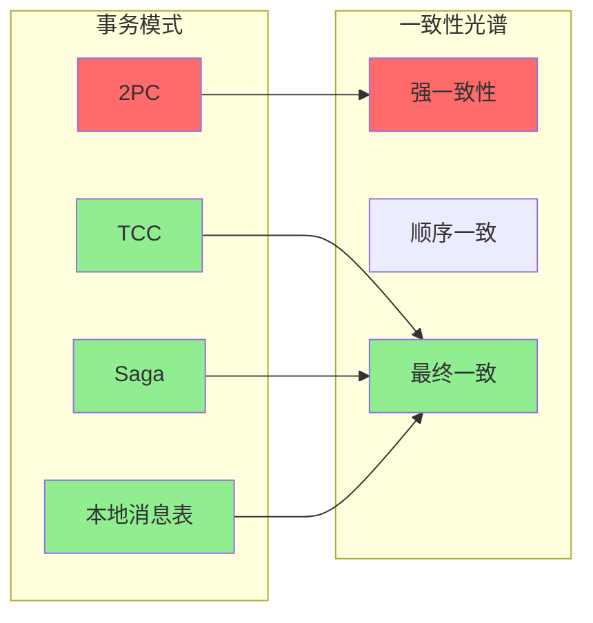
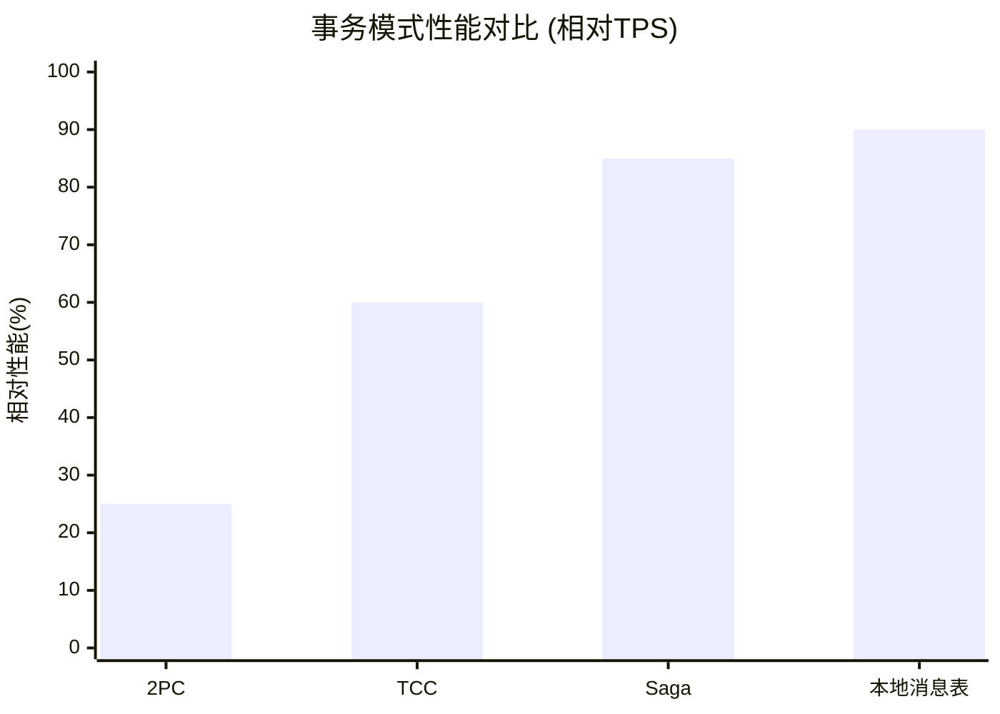
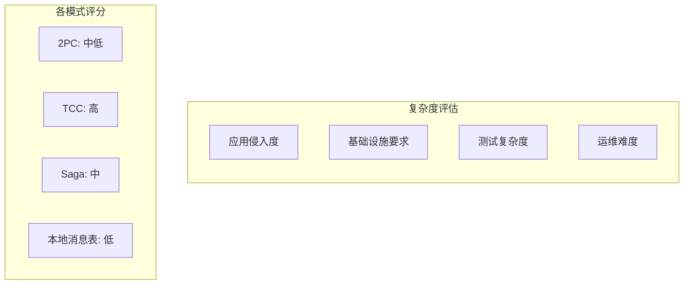
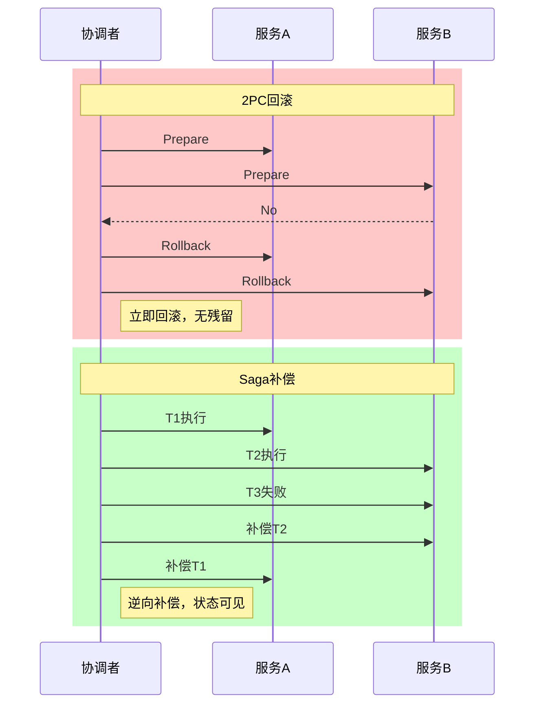
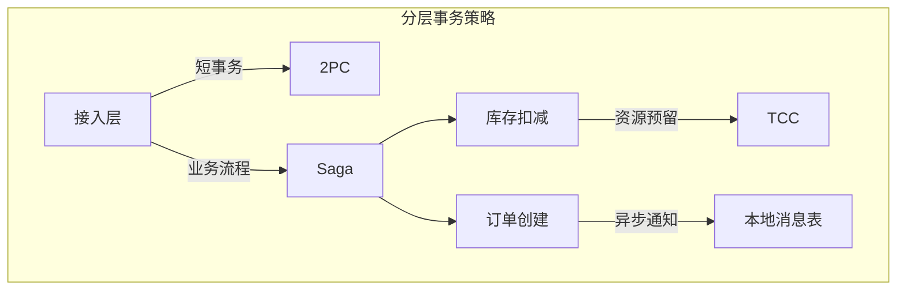

# 事务模式四维对比矩阵

> 📊 全面对比分布式事务解决方案的核心特性

---

## 📈 四维对比总览

| 维度\模式 | 2PC | TCC | Saga | 本地消息表 |
|:--------:|:---:|:---:|:----:|:----------:|
| 一致性强度 | 强一致 | 最终一致 | 最终一致 | 最终一致 |
| 性能影响 | 高 | 中 | 低 | 低 |
| 实现复杂度 | ⭐⭐⭐ | ⭐⭐⭐⭐ | ⭐⭐⭐ | ⭐⭐ |
| 回滚能力 | 完全回滚 | 业务补偿 | 业务补偿 | 业务补偿 |

---

## 维度1：一致性强度 (Consistency Strength)



| 模式 | 一致性级别 | 可见性保证 | 隔离性 | 适用场景 |
|------|-----------|-----------|--------|----------|
| **2PC** | 强一致性 | 提交后立即可见 | 读未提交/读已提交 | 金融转账 |
| **TCC** | 最终一致性 | Try后预留可见 | 无隔离 | 库存扣减 |
| **Saga** | 最终一致性 | 每步完成可见 | 无隔离 | 业务流程 |
| **本地消息表** | 最终一致性 | 本地事务内可见 | 本地隔离 | 异步通知 |

### 一致性详细说明

**2PC - 强一致性保证**

```
事务开始前: A=100, B=200
事务进行中: A锁定, B锁定 (外部不可见)
事务提交后: A=90, B=210 (立即可见)
任意时刻:   A+B=300 (不变量保持)
```

**Saga/TCC/消息表 - 最终一致性**

```
T0: A=100, B=200
T1: 扣减A, A=90 (可见), B=200, 不一致窗口开始
T2: 增加B, B=210 (可见), A=90, 最终一致达成
```

---

## 维度2：性能影响 (Performance Impact)



| 模式 | 同步阻塞 | 锁持有时间 | 网络往返 | 性能等级 | 典型延迟 |
|------|----------|-----------|----------|----------|----------|
| **2PC** | 是 | 整个事务 | 4+ RTT | ⭐⭐ 低 | 100-500ms |
| **TCC** | 部分 | Try阶段 | 3-6 RTT | ⭐⭐⭐ 中 | 50-200ms |
| **Saga** | 否 | 单步本地 | 1 RTT/步 | ⭐⭐⭐⭐ 良 | 10-50ms/步 |
| **本地消息表** | 否 | 本地事务 | 异步 | ⭐⭐⭐⭐⭐ 优 | <10ms本地 |

### 性能影响因素分析

| 因素 | 2PC | TCC | Saga | 本地消息表 |
|------|-----|-----|------|-----------|
| 协调者单点 | 瓶颈 | 轻量 | 无 | 无 |
| 参与者阻塞 | 是 | Try阶段 | 否 | 否 |
| 网络开销 | 高 | 中 | 低 | 极低 |
| 日志开销 | 双份 | 三份 | 单份+事件 | 单份+消息 |
| 回滚成本 | 低 | 中 | 高 | 高 |

---

## 维度3：实现复杂度 (Implementation Complexity)



| 评估维度 | 2PC | TCC | Saga | 本地消息表 |
|----------|-----|-----|------|-----------|
| **业务侵入度** | 低 | 极高 | 中 | 中 |
| **框架依赖** | XA/JTA | 自研/框架 | 状态机框架 | 消息中间件 |
| **代码改造量** | 小 | 大(3倍) | 中 | 中 |
| **测试难度** | 低 | 高 | 高 | 中 |
| **回滚设计** | 自动 | 需实现Cancel | 需补偿逻辑 | 需重试+死信 |

### 代码复杂度对比示例

**2PC - 低侵入**

```java
@Transactional
public void transfer() {
    accountService.debit(from, amount);  // 参与方1
    accountService.credit(to, amount);   // 参与方2
} // 框架处理2PC协议
```

**TCC - 高侵入**

```java
public interface PaymentService {
    boolean tryPay(Order order);      // 预留资源
    boolean confirmPay(Order order);  // 确认执行
    boolean cancelPay(Order order);   // 释放资源
}
// 业务需实现3个方法
```

**Saga - 中等侵入**

```java
@SagaStart
public void createOrder() {
    orderService.create(order);       // T1
    inventoryService.deduct(item);    // T2 失败触发补偿
    paymentService.charge(user);      // T3
}

@Compensate("create")
public void compensateOrder() { ... } // 补偿逻辑
```

---

## 维度4：回滚能力 (Rollback Capability)

| 模式 | 回滚类型 | 回滚粒度 | 回滚延迟 | 数据一致性 | 业务影响 |
|------|----------|----------|----------|-----------|----------|
| **2PC** | 事务回滚 | 整个事务 | 即时 | 原子性保证 | 无中间状态 |
| **TCC** | 补偿回滚 | 单服务 | 即时 | Try已预留 | 资源锁定期 |
| **Saga** | 逆向补偿 | 已执行步骤 | 累积 | 可见中间态 | 可能需要人工 |
| **本地消息表** | 消息重发 | 消息级 | 异步 | 最终一致 | 消费延迟 |

### 回滚机制对比



### 异常场景处理能力

| 异常场景 | 2PC | TCC | Saga | 本地消息表 |
|----------|-----|-----|------|-----------|
| 参与者崩溃 | 阻塞/超时回滚 | 超时Cancel | 重试+补偿 | 重试发送 |
| 协调者崩溃 | 需恢复日志 | 超时处理 | 状态机恢复 | 定时扫描 |
| 网络分区 | 脑裂风险 | 隔离执行 | 事件丢失 | 消息积压 |
| 补偿失败 | 不涉及 | 人工介入 | 重试+告警 | 死信队列 |

---

## 🎯 综合选型决策表

| 业务特征 | 推荐模式 | 关键理由 |
|----------|----------|----------|
| 短事务+强一致+低并发 | 2PC | 简单可靠 |
| 资源预留+短事务 | TCC | 隔离性好 |
| 长事务+业务流程 | Saga | 避免阻塞 |
| 高并发+异步解耦 | 本地消息表 | 性能最优 |
| 异构系统集成 | Saga/消息表 | 灵活适配 |

### 混合使用策略



---

## 📊 综合评分雷达

| 评估项 | 2PC | TCC | Saga | 本地消息表 |
|--------|-----|-----|------|-----------|
| 数据一致性 | ⭐⭐⭐⭐⭐ | ⭐⭐⭐ | ⭐⭐⭐ | ⭐⭐⭐ |
| 系统吞吐量 | ⭐⭐ | ⭐⭐⭐ | ⭐⭐⭐⭐ | ⭐⭐⭐⭐⭐ |
| 开发效率 | ⭐⭐⭐⭐⭐ | ⭐⭐ | ⭐⭐⭐ | ⭐⭐⭐⭐ |
| 运维复杂度 | ⭐⭐⭐⭐ | ⭐⭐⭐ | ⭐⭐⭐ | ⭐⭐⭐⭐ |
| 容错能力 | ⭐⭐⭐⭐ | ⭐⭐⭐⭐ | ⭐⭐⭐ | ⭐⭐⭐⭐ |
| **综合推荐** | 金融核心 | 库存系统 | 业务流程 | 通知类 |

---

## 🔗 导航链接

### 思维导图系列

- [📊 分布式系统全景思维导图](./01-分布式系统全景思维导图.md)
- [🗳️ 共识算法选择思维导图](./02-共识算法选择思维导图.md)
- [💾 存储系统选型思维导图](./03-存储系统选型思维导图.md)

### 决策树系列

- [🌲 分布式事务模式决策树](./04-分布式事务模式决策树.md)
- [⚖️ 一致性级别决策树](./05-一致性级别决策树.md)
- [🔍 故障排查决策树](./06-故障排查决策树.md)

### 对比矩阵系列

- [📊 共识算法五维对比矩阵](./07-共识算法五维对比矩阵.md)
- [📊 存储系统六维选型矩阵](./08-存储系统六维选型矩阵.md)
- [📊 事务模式四维对比矩阵](./09-事务模式四维对比矩阵.md) ← 当前

### 知识树系列

- [🌳 学习路径知识树](./10-学习路径知识树.md)
- [🔗 先决条件依赖树](./11-先决条件依赖树.md)

### 定理推理树系列

- [🧮 CAP定理推理树](./12-CAP定理推理树.md)
- [🧮 Raft安全性推理树](./13-Raft安全性推理树.md)

### 时序与状态图系列

- [⏱️ 共识算法时序对比图](./14-共识算法时序对比图.md)
- [🔄 一致性状态机图](./15-一致性状态机图.md)

---

## 📚 延伸阅读

- [分布式事务原理](../04-transactions/principles.md)
- [Seata实现分析](../04-transactions/seata.md)
- [Saga模式实践](../04-transactions/saga-pattern.md)
