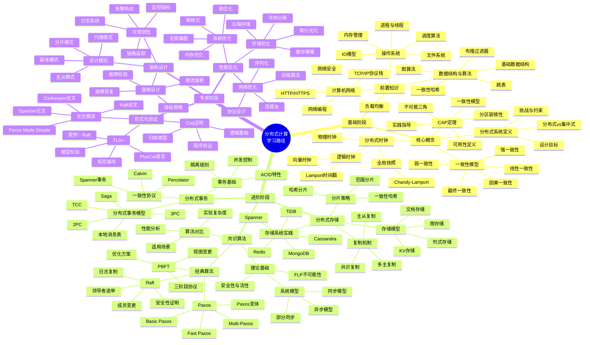
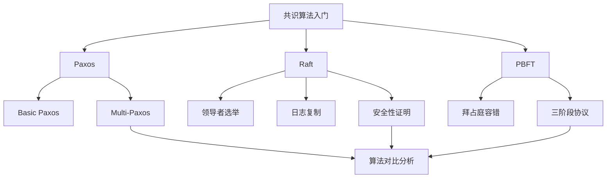
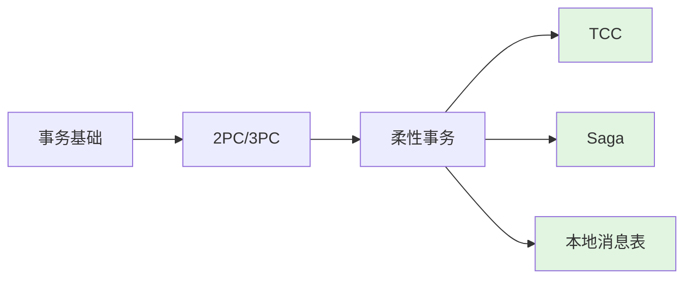
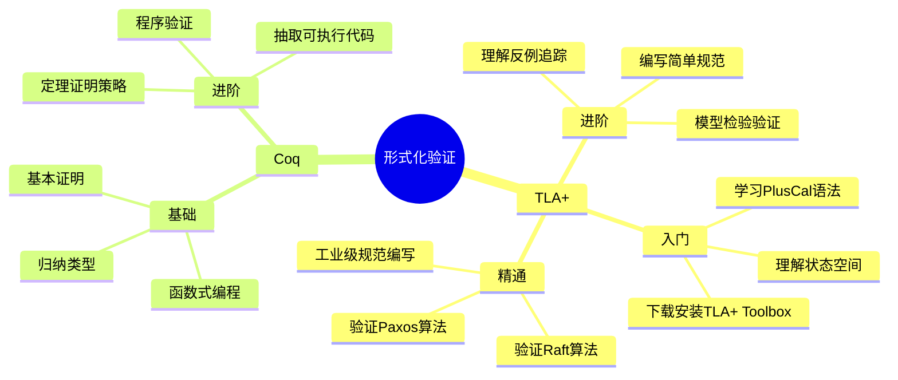
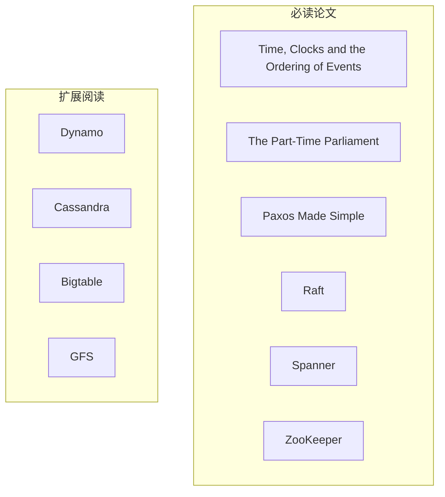

# 学习路径知识树

> 🌳 分布式计算领域系统化学习路径与知识依赖关系

---

## 🗺️ 知识树总览

---

## 📚 分阶段学习指南

### 🟢 基础阶段（预计 4-8 周）

#### 前置知识检查清单

| 知识领域 | 掌握程度 | 验证标准 | 推荐资源 |
|----------|----------|----------|----------|
| 操作系统 | 理解 | 能解释进程调度 | 《OSTEP》 |
| 计算机网络 | 理解 | 能描述TCP握手 | 《自顶向下》 |
| 数据结构与算法 | 熟练 | 能实现一致性哈希 | LeetCode |

#### 核心概念学习路径

**关键里程碑**：

- [ ] 能向他人解释CAP定理及其实践意义
- [ ] 能区分各种一致性模型
- [ ] 理解FLP证明的核心思想

---

### 🟡 进阶阶段（预计 8-16 周）

#### 共识算法学习路径

**推荐学习顺序**：

1. **Raft** (2-3周) - 最佳入门算法，易于理解
2. **Paxos** (2-3周) - 理论基础，必读论文
3. **PBFT** (1-2周) - 了解BFT场景

**实践项目**：

- 实现简化版Raft
- 使用etcd进行配置管理
- 搭建ZooKeeper集群

#### 分布式存储学习路径

| 周数 | 主题 | 实践内容 |
|------|------|----------|
| 1-2 | 存储模型 | 对比Redis/MongoDB |
| 3-4 | 复制机制 | 配置主从复制 |
| 5-6 | 分片策略 | 设计分片方案 |
| 7-8 | 存储系统 | 部署TiDB集群 |

#### 分布式事务学习路径

---

### 🔴 专家阶段（持续学习）

#### 形式化验证

#### 必读书单

| 阶段 | 书名 | 难度 | 优先级 |
|------|------|------|--------|
| 基础 | 《数据密集型应用系统设计》 | ⭐⭐⭐ | P0 |
| 基础 | 《分布式系统：概念与设计》 | ⭐⭐⭐ | P1 |
| 进阶 | 《Paxos Made Simple》 | ⭐⭐⭐⭐ | P0 |
| 进阶 | 《In Search of an Understandable Consensus Algorithm》 | ⭐⭐⭐ | P0 |
| 进阶 | 《Spanner: Google's Globally-Distributed Database》 | ⭐⭐⭐⭐ | P1 |
| 专家 | 《Specifying Systems》 | ⭐⭐⭐⭐⭐ | P2 |

#### 经典论文精读清单

---

## 🎯 技能评估量表

| 技能领域 | 初级 | 中级 | 高级 | 专家 |
|----------|------|------|------|------|
| CAP定理理解 | 能解释概念 | 能分析系统 | 能设计取舍 | 能反驳误区 |
| 共识算法 | 了解Raft | 实现Raft | 理解Paxos | 形式化验证 |
| 存储系统 | 会配置Redis | 能设计分片 | 理解Spanner | 自研存储 |
| 事务处理 | 了解2PC | 能用TCC | 设计Saga | 优化性能 |
| 故障排查 | 看日志 | 用工具 | 设计可观测 | 预测故障 |

---

## 🔗 导航链接

### 思维导图系列

- [📊 分布式系统全景思维导图](./01-分布式系统全景思维导图.md)
- [🗳️ 共识算法选择思维导图](./02-共识算法选择思维导图.md)
- [💾 存储系统选型思维导图](./03-存储系统选型思维导图.md)

### 决策树系列

- [🌲 分布式事务模式决策树](./04-分布式事务模式决策树.md)
- [⚖️ 一致性级别决策树](./05-一致性级别决策树.md)
- [🔍 故障排查决策树](./06-故障排查决策树.md)

### 对比矩阵系列

- [📊 共识算法五维对比矩阵](./07-共识算法五维对比矩阵.md)
- [📊 存储系统六维选型矩阵](./08-存储系统六维选型矩阵.md)
- [📊 事务模式四维对比矩阵](./09-事务模式四维对比矩阵.md)

### 知识树系列

- [🌳 学习路径知识树](./10-学习路径知识树.md) ← 当前
- [🔗 先决条件依赖树](./11-先决条件依赖树.md)

### 定理推理树系列

- [🧮 CAP定理推理树](./12-CAP定理推理树.md)
- [🧮 Raft安全性推理树](./13-Raft安全性推理树.md)

### 时序与状态图系列

- [⏱️ 共识算法时序对比图](./14-共识算法时序对比图.md)
- [🔄 一致性状态机图](./15-一致性状态机图.md)

---

## 📚 延伸阅读

- [分布式系统论文列表](../../papers/)
- [推荐书籍汇总](../../resources/books.md)
- [在线课程推荐](../../resources/courses.md)
