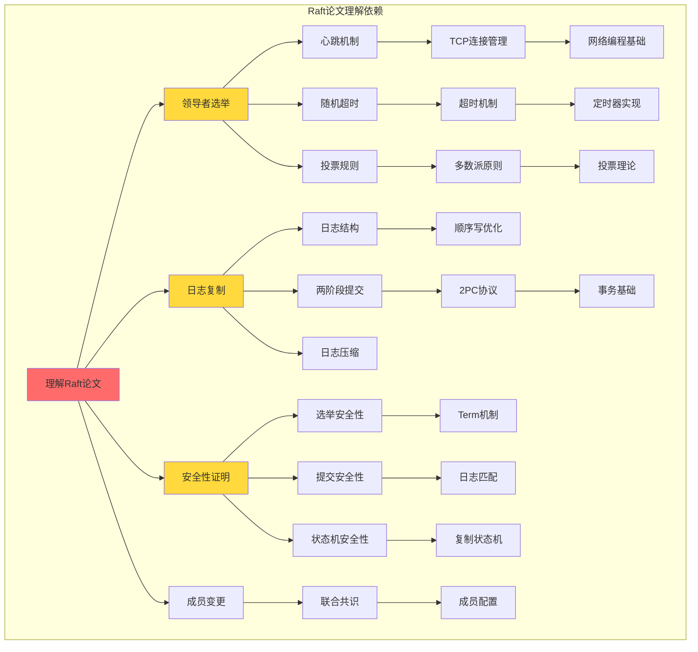
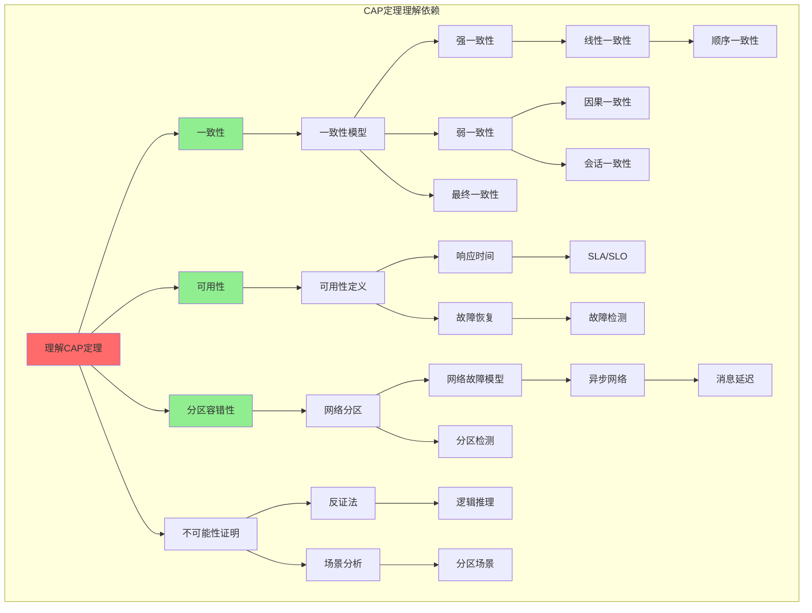
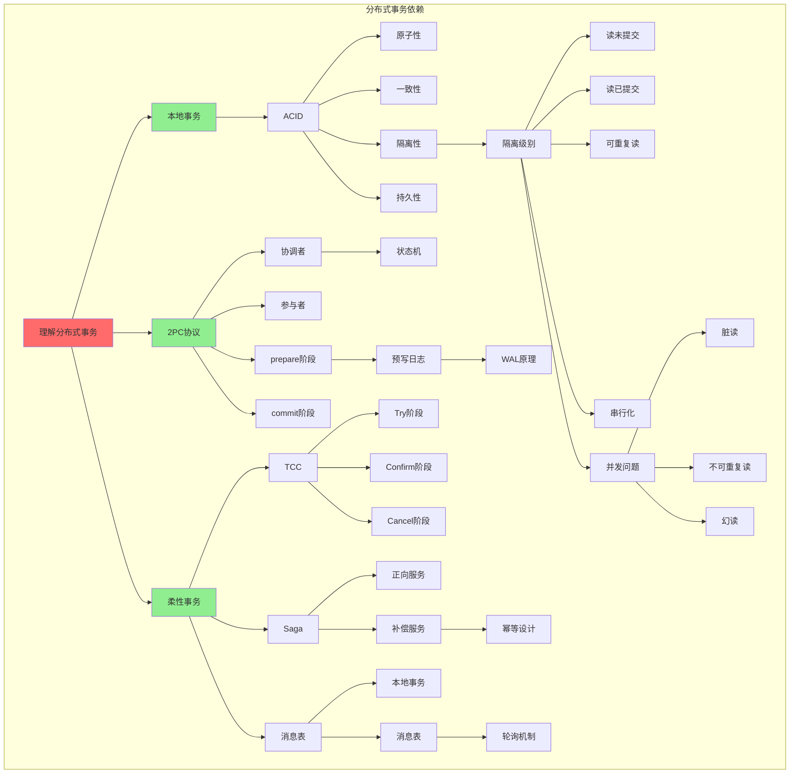
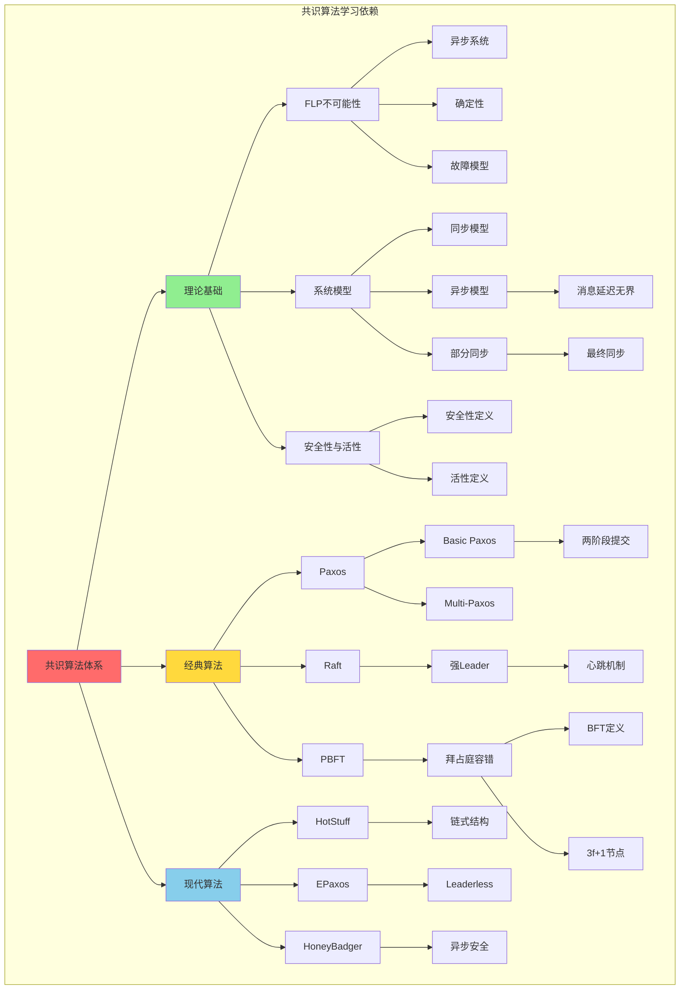
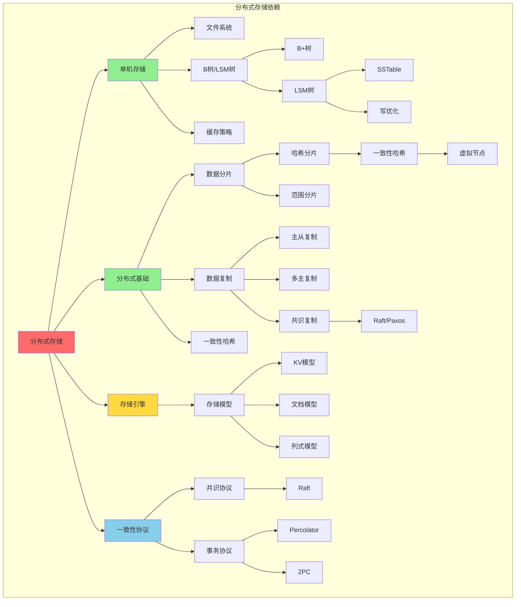

# 先决条件依赖树

> 🔗 展示学习分布式计算核心概念和论文所需的先决知识与依赖关系

---

## 🌳 Raft论文依赖树

---

## 🌳 CAP定理理解依赖树

---

## 🌳 分布式事务理解依赖树

---

## 🌳 共识算法体系依赖树

---

## 🌳 分布式存储理解依赖树

---

## 📋 依赖检查清单

### Raft论文阅读前检查

| 前置知识 | 掌握标准 | 自检 |
|----------|----------|------|
| 心跳机制 | 能解释租约机制 | ☐ |
| 多数派原则 | 理解2f+1公式 | ☐ |
| 两阶段提交 | 了解基本流程 | ☐ |
| 复制状态机 | 理解确定性执行 | ☐ |
| 日志结构 | 了解WAL概念 | ☐ |

### CAP定理深入前检查

| 前置知识 | 掌握标准 | 自检 |
|----------|----------|------|
| 一致性模型 | 能区分强/弱一致 | ☐ |
| 网络分区 | 理解分区场景 | ☐ |
| 可用性定义 | 区分不同可用级别 | ☐ |
| 异步网络 | 理解延迟无界 | ☐ |

### 分布式事务学习前检查

| 前置知识 | 掌握标准 | 自检 |
|----------|----------|------|
| ACID | 能解释四特性 | ☐ |
| 隔离级别 | 了解4种级别 | ☐ |
| 并发问题 | 了解脏读/幻读 | ☐ |
| 2PC协议 | 了解基本流程 | ☐ |

---

## 🔗 导航链接

### 思维导图系列

- [📊 分布式系统全景思维导图](./01-分布式系统全景思维导图.md)
- [🗳️ 共识算法选择思维导图](./02-共识算法选择思维导图.md)
- [💾 存储系统选型思维导图](./03-存储系统选型思维导图.md)

### 决策树系列

- [🌲 分布式事务模式决策树](./04-分布式事务模式决策树.md)
- [⚖️ 一致性级别决策树](./05-一致性级别决策树.md)
- [🔍 故障排查决策树](./06-故障排查决策树.md)

### 对比矩阵系列

- [📊 共识算法五维对比矩阵](./07-共识算法五维对比矩阵.md)
- [📊 存储系统六维选型矩阵](./08-存储系统六维选型矩阵.md)
- [📊 事务模式四维对比矩阵](./09-事务模式四维对比矩阵.md)

### 知识树系列

- [🌳 学习路径知识树](./10-学习路径知识树.md)
- [🔗 先决条件依赖树](./11-先决条件依赖树.md) ← 当前

### 定理推理树系列

- [🧮 CAP定理推理树](./12-CAP定理推理树.md)
- [🧮 Raft安全性推理树](./13-Raft安全性推理树.md)

### 时序与状态图系列

- [⏱️ 共识算法时序对比图](./14-共识算法时序对比图.md)
- [🔄 一致性状态机图](./15-一致性状态机图.md)

---

## 📚 延伸阅读

- [Raft论文中文版](../../papers/raft-zh.md)
- [分布式系统基础](../../01-foundation/)
- [学习资源推荐](../../resources/)
