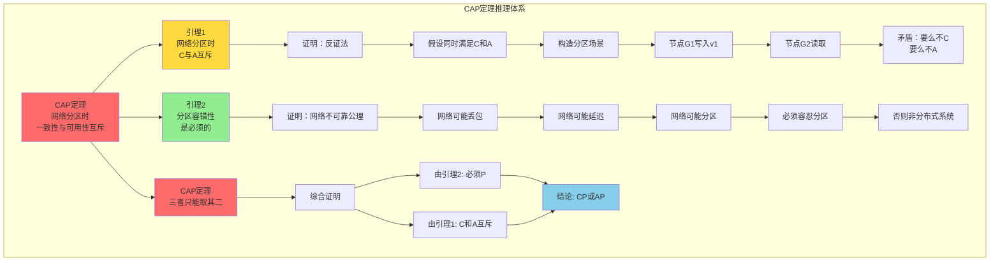
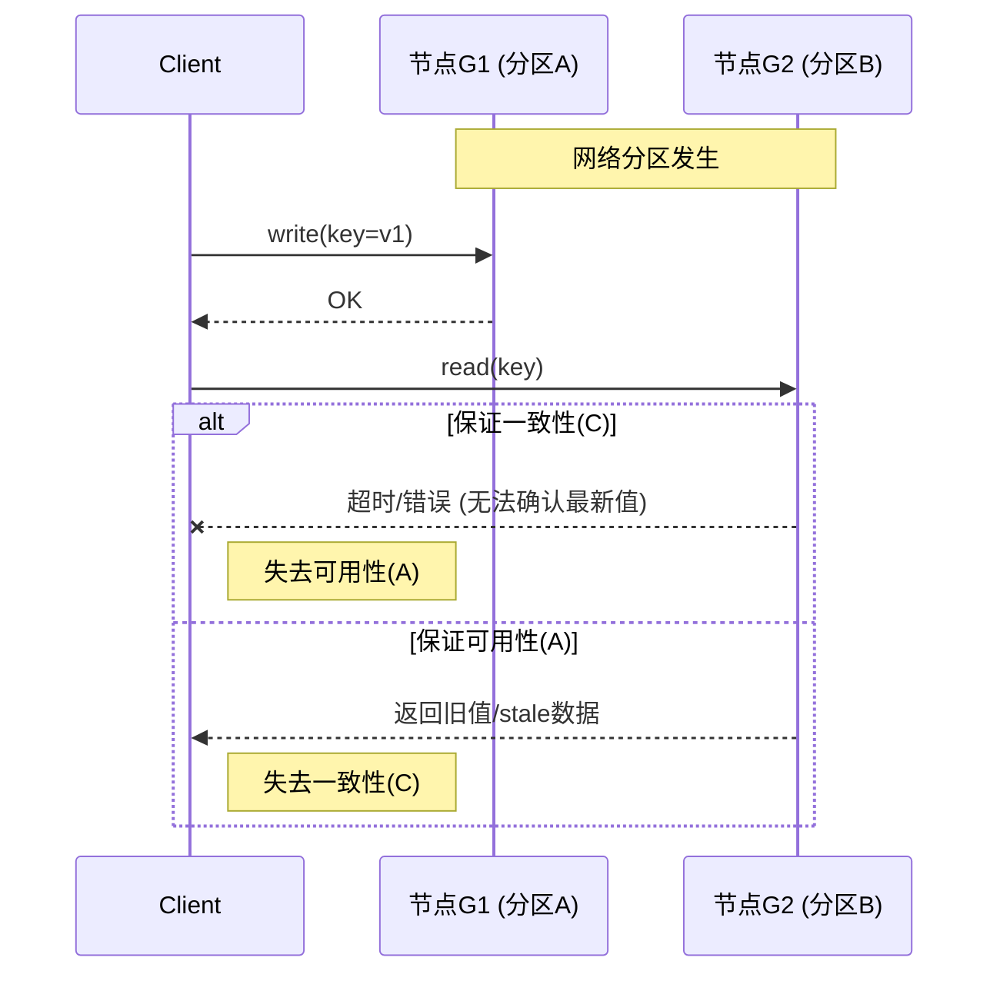
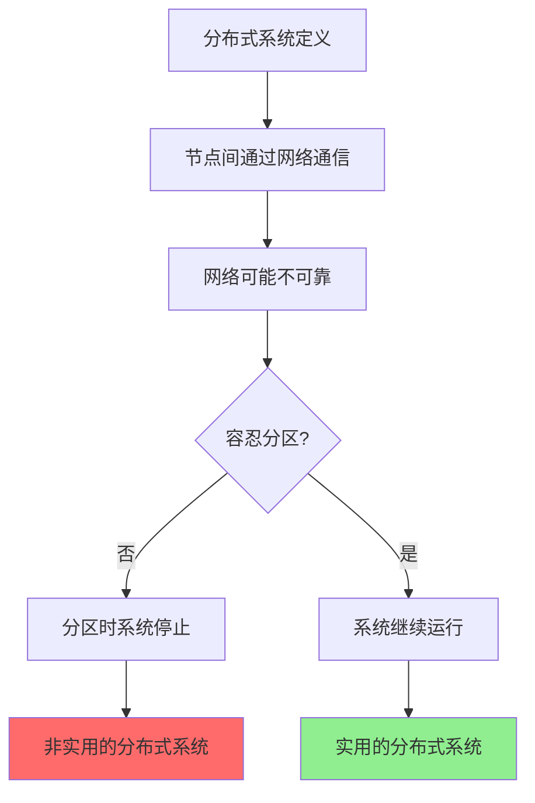
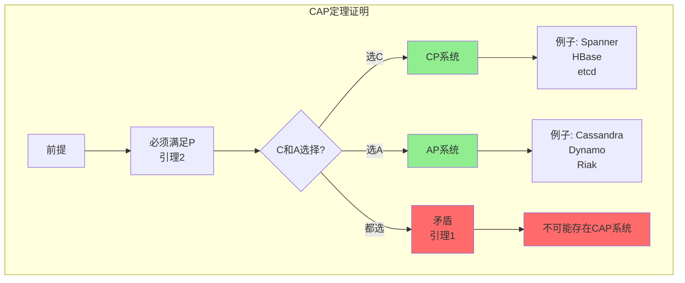
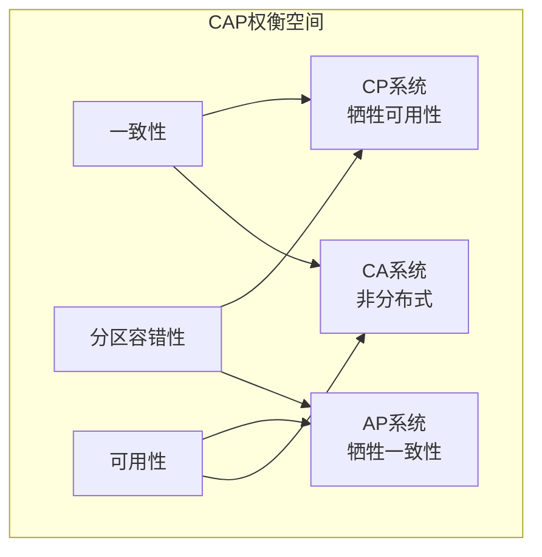
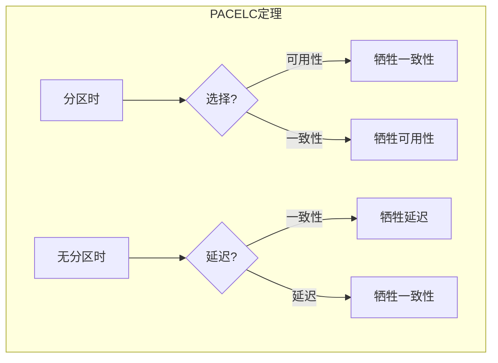

# CAP定理推理树

> 🧮 CAP定理的完整形式化推理过程与证明

---

## 🌳 推理树总览



---

## 📐 引理1：网络分区时，一致性与可用性互斥

### 形式化定义

| 概念 | 定义 |
|------|------|
| **一致性 (C)** | 所有节点在同一时间看到相同的数据 |
| **可用性 (A)** | 每个请求都能在有限时间内得到非错误响应 |
| **分区容错性 (P)** | 系统在网络分区时仍能继续运行 |

### 反证法证明



### 详细推理步骤

**假设**：存在分布式系统同时满足一致性(C)、可用性(A)和分区容错性(P)

**步骤1：构造分区场景**

```
系统S有节点集合 N = {n1, n2, ..., nk}
网络分区将N划分为 G1 和 G2，且 G1 ∪ G2 = N, G1 ∩ G2 = ∅
分区导致 G1 和 G2 之间无法通信
```

**步骤2：发起写操作**

```
Client向G1中的节点n1发送写请求: write(x, v1)
根据可用性(A)，n1必须在有限时间内响应
根据一致性(C)，这次写入必须对所有节点可见
```

**步骤3：发起读操作**

```
Client向G2中的节点n2发送读请求: read(x)
根据可用性(A)，n2必须在有限时间内响应
```

**步骤4：导出矛盾**

```
情况A：如果n2返回v1
  - 满足一致性
  - 但n2无法从G1获取v1（分区隔离）
  - 除非n2等待分区恢复 → 违反可用性

情况B：如果n2返回旧值或超时
  - 违反一致性（情况B1）
  - 或违反可用性（情况B2）
```

**结论**：假设不成立，C和A在分区时互斥 ∎

---

## 📐 引理2：分区容忍性是必须的

### 公理基础

| 公理 | 说明 |
|------|------|
| **网络不可靠** | 网络可能丢包、延迟、分区 |
| **分布式定义** | 节点通过网络通信的系统 |
| **实用性** | 系统必须在真实网络中运行 |

### 证明



**形式化论证**：

1. **网络不可靠性公理**

   ```
   ∀网络N: P(分区|N) > 0
   （任何网络都存在非零的分区概率）
   ```

2. **分布式系统的定义**

   ```
   系统S是分布式的 ⟺ |节点| > 1 ∧ 节点间通过网络通信
   ```

3. **分区的必然性**

   ```
   由于网络不可靠，分区必然可能发生
   如果系统不能容忍分区，则在分区时不可用
   这与分布式系统的实用性要求矛盾
   ```

4. **结论**

   ```
   实用的分布式系统必须满足分区容错性(P)
   ```

---

## 📐 定理：CAP三者只能取其二

### 综合证明



### 证明步骤

**给定**：引理1（C和A互斥）和引理2（必须P）

**证明**：

1. 由引理2，任何实用的分布式系统必须包含P
2. 因此问题转化为：在P的前提下，能同时满足C和A吗？
3. 由引理1，在分区时（P场景），C和A互斥
4. 因此，系统最多同时满足：
   - C + P = **CP系统**
   - A + P = **AP系统**
5. 不可能同时满足 C + A + P

**结论**：CAP三者只能取其二 ∎

---

## 🎯 CAP系统分类



| 类型 | 特点 | 典型系统 | 适用场景 |
|------|------|----------|----------|
| **CP** | 一致优先，分区时拒绝服务 | Spanner, HBase, etcd | 金融交易 |
| **AP** | 可用优先，允许短暂不一致 | Cassandra, Dynamo, Riak | 社交内容 |
| **CA** | 单机或理想网络 | 传统RDBMS | 非分布式 |

---

## 🔄 PACELC扩展



> **PACELC**：如果分区(P)，在可用性(A)和一致性(C)中选择；否则(E)，在延迟(L)和一致性(C)中选择。

---

## 🔗 导航链接

### 思维导图系列

- [📊 分布式系统全景思维导图](./01-分布式系统全景思维导图.md)
- [🗳️ 共识算法选择思维导图](./02-共识算法选择思维导图.md)
- [💾 存储系统选型思维导图](./03-存储系统选型思维导图.md)

### 决策树系列

- [🌲 分布式事务模式决策树](./04-分布式事务模式决策树.md)
- [⚖️ 一致性级别决策树](./05-一致性级别决策树.md)
- [🔍 故障排查决策树](./06-故障排查决策树.md)

### 对比矩阵系列

- [📊 共识算法五维对比矩阵](./07-共识算法五维对比矩阵.md)
- [📊 存储系统六维选型矩阵](./08-存储系统六维选型矩阵.md)
- [📊 事务模式四维对比矩阵](./09-事务模式四维对比矩阵.md)

### 知识树系列

- [🌳 学习路径知识树](./10-学习路径知识树.md)
- [🔗 先决条件依赖树](./11-先决条件依赖树.md)

### 定理推理树系列

- [🧮 CAP定理推理树](./12-CAP定理推理树.md) ← 当前
- [🧮 Raft安全性推理树](./13-Raft安全性推理树.md)

### 时序与状态图系列

- [⏱️ 共识算法时序对比图](./14-共识算法时序对比图.md)
- [🔄 一致性状态机图](./15-一致性状态机图.md)

---

## 📚 延伸阅读

- [PACELC定理](../01-foundation/PACELC.md)
- [CAP实践指南](../01-foundation/cap-practice.md)
- [CAP定理原文](https://sites.cs.ucsb.edu/~rich/class/cs293b-cloud/papers/brewer.pdf)
