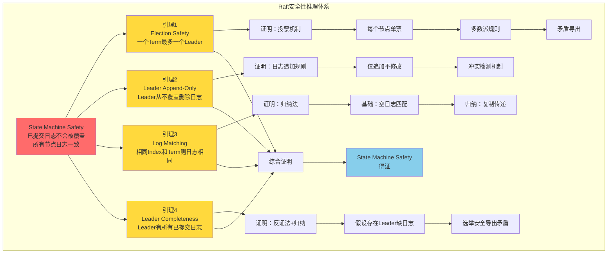
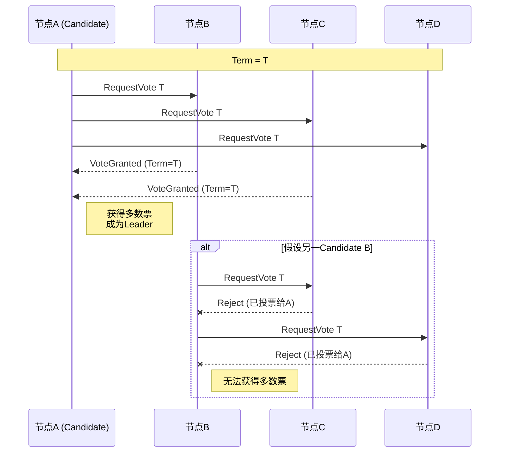
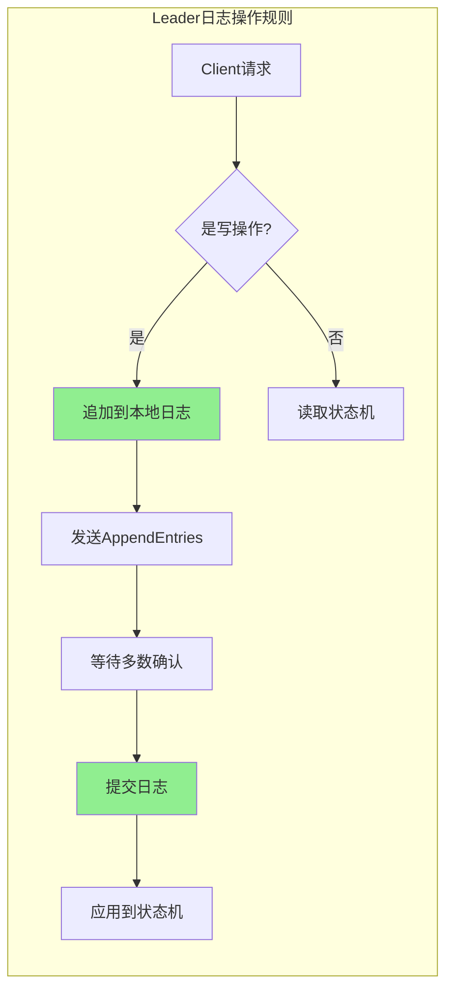
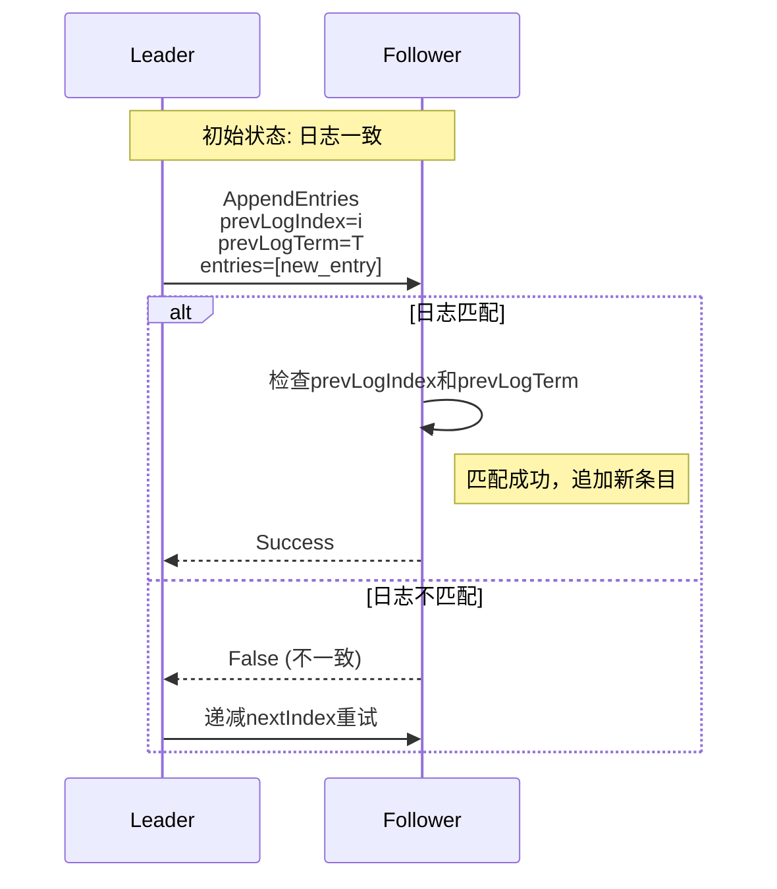
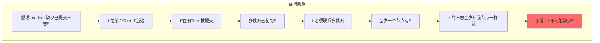
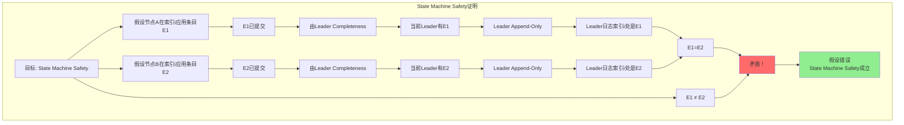
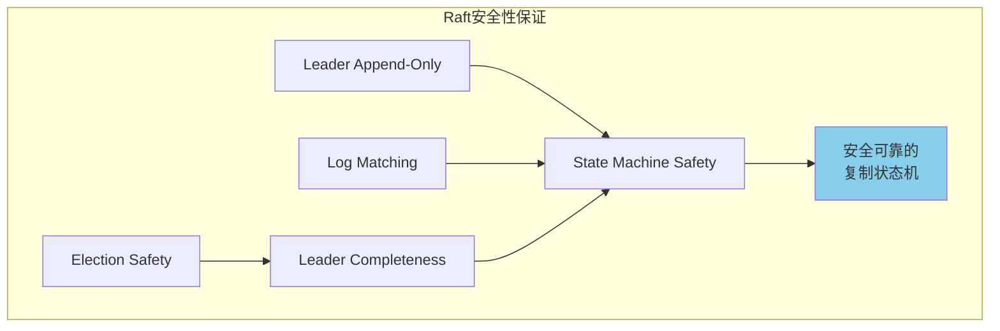

# Raft安全性推理树

> 🧮 Raft算法安全性属性的完整形式化推理与证明

---

## 🌳 State Machine Safety推理树总览

---

## 📐 引理1：Election Safety（选举安全性）

### 定理陈述
>
> **一个Term内最多只有一个Leader被选举出来**

### 证明

### 形式化证明

**前提条件**：

1. 每个节点在一个Term内只能投一票
2. 成为Leader需要获得多数派(⌈n/2⌉+1)选票

**证明**：

假设：在Term T内存在两个Leader L1和L2

1. L1获得多数派选票 M1，|M1| ≥ ⌈n/2⌉+1
2. L2获得多数派选票 M2，|M2| ≥ ⌈n/2⌉+1
3. 由于每个节点只能投一票，M1 ∩ M2 = ∅
4. 但总节点数 n < |M1| + |M2| ≤ n（矛盾！）

**结论**：一个Term内最多只有一个Leader ∎

---

## 📐 引理2：Leader Append-Only（Leader只追加）

### 定理陈述
>
> **Leader永远不会覆盖或删除自己日志中的条目，只追加新条目**

### 证明

### 关键机制

| 机制 | 说明 | 安全保障 |
|------|------|----------|
| **日志追加** | 新条目总是append到末尾 | 历史日志不变 |
| **日志索引** | 单调递增，永不重用 | 位置唯一性 |
| **提交规则** | 只提交当前Term的日志或已复制的旧日志 | 避免覆盖 |

---

## 📐 引理3：Log Matching（日志匹配性）

### 定理陈述
>
> **如果两个日志在相同索引位置的条目具有相同的Term，那么：
>
> 1. 这两个条目存储相同的命令
> 2. 两个日志在该索引之前的所有条目都相同**

### 证明

### 归纳法证明

**基础情况**：

- 空日志在所有节点上都匹配（平凡成立）

**归纳假设**：

- 假设对于索引 i-1，日志匹配性成立

**归纳步骤**：

1. Leader在索引 i 追加条目(Term=T, Command=C)
2. Leader发送AppendEntries，携带prevLogIndex=i-1, prevLogTerm=T'
3. Follower验证索引i-1处Term=T'，确认匹配
4. Follower在索引 i 追加条目
5. 由归纳假设，0到i-1都相同；现在i也相同

**结论**：日志匹配性成立 ∎

---

## 📐 引理4：Leader Completeness（Leader完整性）

### 定理陈述
>
> **如果一个日志条目在某个Term被提交，那么这个条目会出现在所有更高Term的Leader的日志中**

### 证明

### 形式化证明

**假设**：

- 条目E在Term T1被提交
- Leader L在Term T3(T3>T1)当选，但L的日志中缺少E

**推导**：

1. E被提交意味着它被复制到多数派节点（至少⌈n/2⌉+1个）
2. L在T3当选，必须获得多数派(⌈n/2⌉+1)选票
3. 根据鸽巢原理，存在一个节点V同时满足：
   - V有E（来自步骤1的多数派）
   - V投票给L（来自步骤2的多数派）

4. 节点V只会投票给日志至少和自己一样新的Candidate
5. 由于V有E，L的日志必须至少和V一样新
6. 因此L的日志中必须有E（矛盾！）

**结论**：Leader完整性成立 ∎

---

## 📐 定理：State Machine Safety

### 定理陈述
>
> **如果一个节点已经将某个日志条目应用到自己的状态机，那么其他节点不可能在相同索引位置应用不同的命令**

### 综合证明

### 证明步骤

**假设**：

- 节点A在索引i应用了条目E1
- 节点B在索引i应用了条目E2
- E1 ≠ E2

**推导**：

1. 应用到状态机意味着条目已提交
2. 由**Leader Completeness**，当前Leader的日志中同时包含E1和E2
3. 由**Log Matching**，相同索引处不能有两个不同条目
4. 由**Leader Append-Only**，Leader不会覆盖自己的日志
5. 因此E1必须等于E2（矛盾！）

**结论**：State Machine Safety成立 ∎

---

## 🎯 安全性属性总结

| 安全性属性 | 含义 | 关键机制 |
|-----------|------|----------|
| Election Safety | 最多一个Leader/Term | 单票制+多数派 |
| Leader Append-Only | Leader不删改日志 | 追加规则 |
| Log Matching | 相同位置相同内容 | 一致性检查 |
| Leader Completeness | Leader有所有已提交日志 | 选举限制 |
| State Machine Safety | 相同命令相同顺序 | 上述全部 |

---

## 🔗 导航链接

### 思维导图系列

- [📊 分布式系统全景思维导图](./01-分布式系统全景思维导图.md)
- [🗳️ 共识算法选择思维导图](./02-共识算法选择思维导图.md)
- [💾 存储系统选型思维导图](./03-存储系统选型思维导图.md)

### 决策树系列

- [🌲 分布式事务模式决策树](./04-分布式事务模式决策树.md)
- [⚖️ 一致性级别决策树](./05-一致性级别决策树.md)
- [🔍 故障排查决策树](./06-故障排查决策树.md)

### 对比矩阵系列

- [📊 共识算法五维对比矩阵](./07-共识算法五维对比矩阵.md)
- [📊 存储系统六维选型矩阵](./08-存储系统六维选型矩阵.md)
- [📊 事务模式四维对比矩阵](./09-事务模式四维对比矩阵.md)

### 知识树系列

- [🌳 学习路径知识树](./10-学习路径知识树.md)
- [🔗 先决条件依赖树](./11-先决条件依赖树.md)

### 定理推理树系列

- [🧮 CAP定理推理树](./12-CAP定理推理树.md)
- [🧮 Raft安全性推理树](./13-Raft安全性推理树.md) ← 当前

### 时序与状态图系列

- [⏱️ 共识算法时序对比图](./14-共识算法时序对比图.md)
- [🔄 一致性状态机图](./15-一致性状态机图.md)

---

## 📚 延伸阅读

- [Raft论文原文](../02-algorithms/raft/raft-paper.pdf)
- [Raft算法实现指南](../02-algorithms/raft/implementation.md)
- [形式化验证Raft](../02-algorithms/raft/formal-verification.md)
