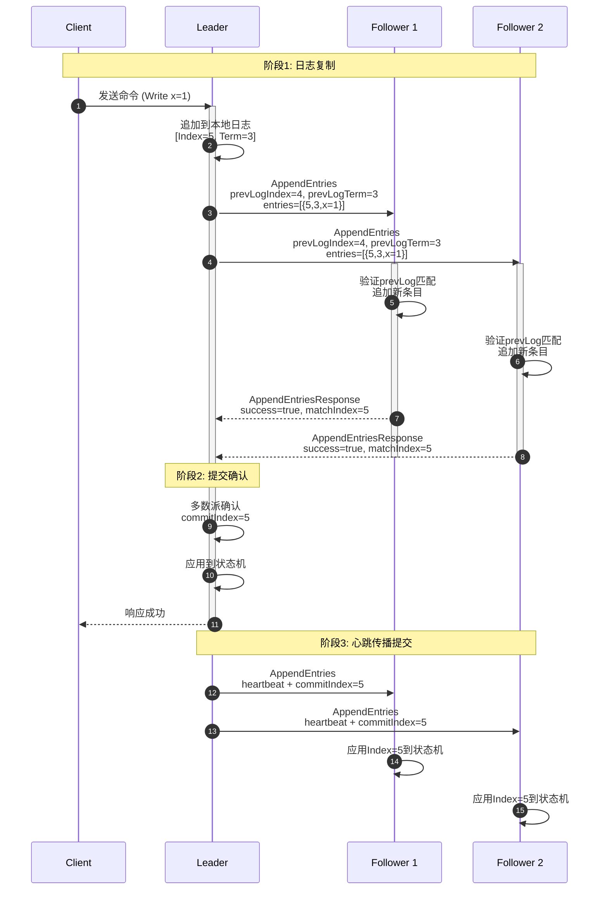
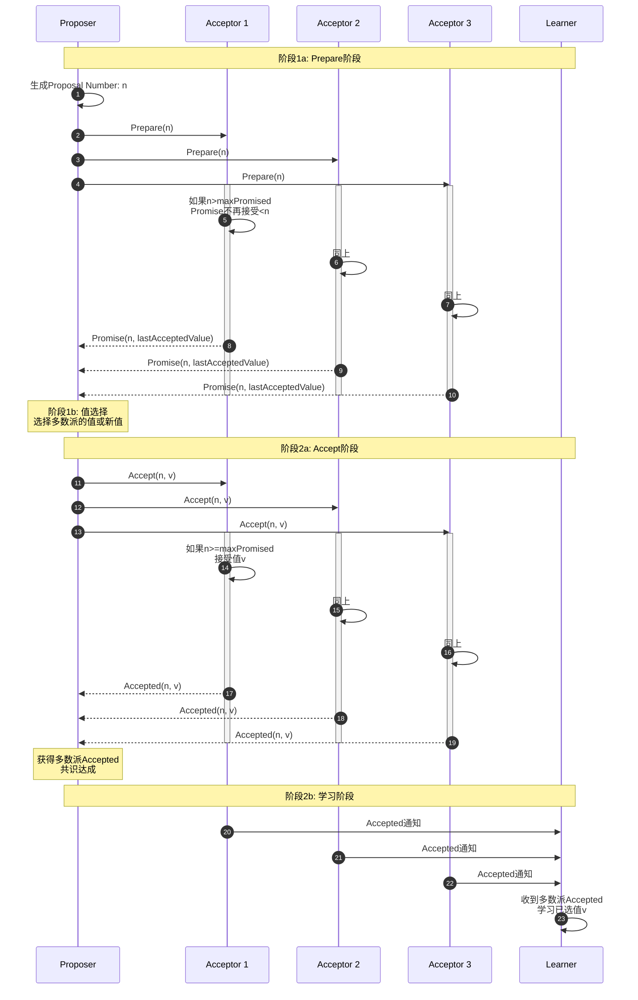
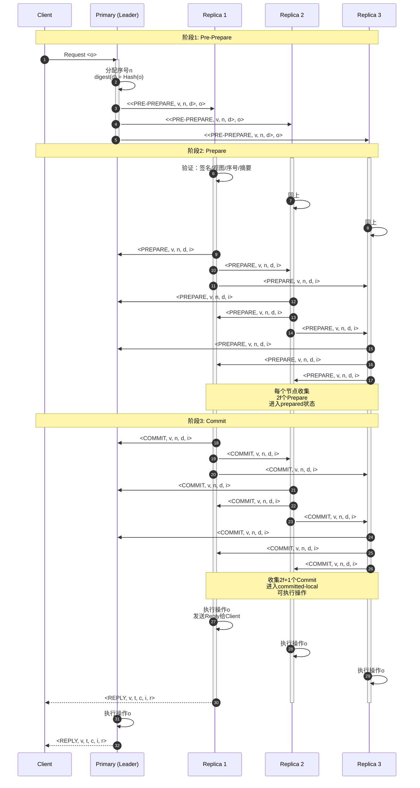
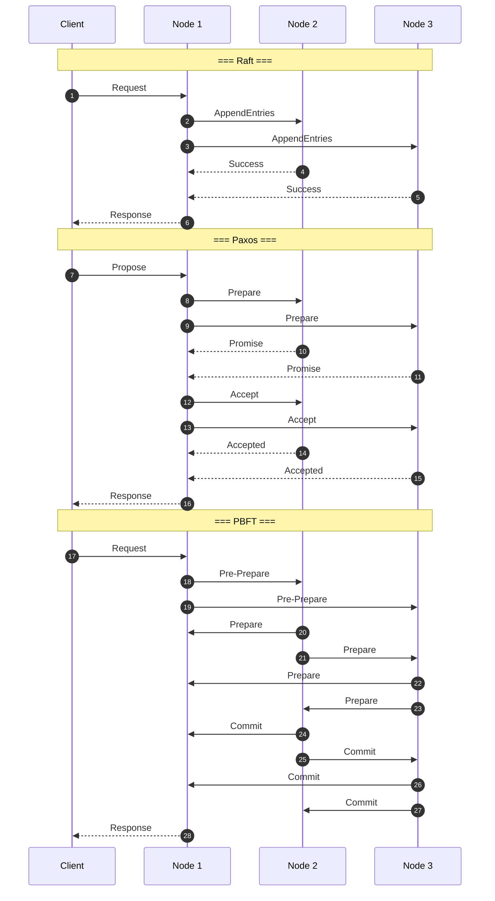
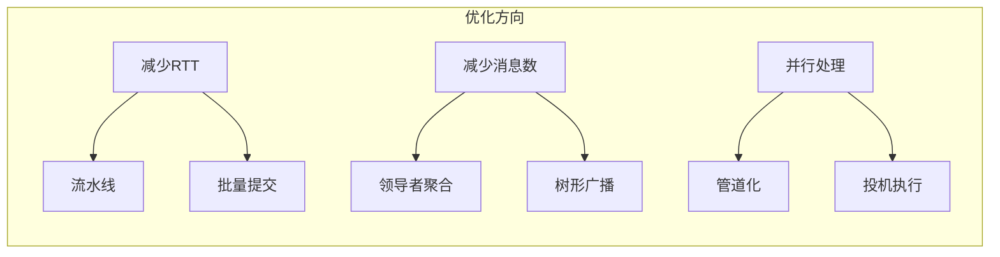

# 共识算法时序对比图

> ⏱️ 使用Mermaid SequenceDiagram对比主流共识算法的消息流程与时序特征

---

## 1️⃣ Raft正常流程

**关键特征**：

- **消息轮次**：2轮（Leader→Followers→Leader）
- **延迟**：2×RTT + 本地处理
- **消息复杂度**：O(n)，n为Follower数量

---

## 2️⃣ Paxos两阶段流程

**关键特征**：

- **消息轮次**：2-3轮（Prepare→Promise→Accept→Accepted）
- **延迟**：2×RTT（最优）~ 3×RTT（含冲突）
- **消息复杂度**：O(n²)，多Proposer时冲突

---

## 3️⃣ PBFT三阶段流程

**关键特征**：

- **消息轮次**：3轮（Pre-Prepare→Prepare→Commit）
- **延迟**：3×RTT
- **消息复杂度**：O(n²)，全互联广播
- **容错**：3f+1节点容忍f个拜占庭故障

---

## 4️⃣ 算法时序对比总览

---

## 📊 时序特征对比表

| 特征 | Raft | Paxos | PBFT |
|------|------|-------|------|
| **消息轮次** | 2轮 | 2-3轮 | 3轮 |
| **最优延迟** | 2×RTT | 2×RTT | 3×RTT |
| **消息复杂度** | O(n) | O(n²) | O(n²) |
| **广播方式** | Leader→All | All→All | All↔All |
| **故障模型** | CFT | CFT | BFT |
| **容错节点** | 2f+1 | 2f+1 | 3f+1 |
| **领导者** | 有 | 可选 | 有(Primary) |

---

## 🎯 时序优化策略

### 优化技术对比

| 优化技术 | 适用算法 | 效果 | 复杂度 |
|----------|----------|------|--------|
| **流水线** | Raft | 减少RTT等待 | 低 |
| **批量提交** | Raft/Paxos | 摊薄开销 | 低 |
| **Fast Paxos** | Paxos | 1轮无冲突 | 中 |
| **链式BFT** | HotStuff | O(n)消息 | 高 |
| **投机执行** | Zyzzyva | 减少延迟 | 高 |

---

## 🔗 导航链接

### 思维导图系列

- [📊 分布式系统全景思维导图](./01-分布式系统全景思维导图.md)
- [🗳️ 共识算法选择思维导图](./02-共识算法选择思维导图.md)
- [💾 存储系统选型思维导图](./03-存储系统选型思维导图.md)

### 决策树系列

- [🌲 分布式事务模式决策树](./04-分布式事务模式决策树.md)
- [⚖️ 一致性级别决策树](./05-一致性级别决策树.md)
- [🔍 故障排查决策树](./06-故障排查决策树.md)

### 对比矩阵系列

- [📊 共识算法五维对比矩阵](./07-共识算法五维对比矩阵.md)
- [📊 存储系统六维选型矩阵](./08-存储系统六维选型矩阵.md)
- [📊 事务模式四维对比矩阵](./09-事务模式四维对比矩阵.md)

### 知识树系列

- [🌳 学习路径知识树](./10-学习路径知识树.md)
- [🔗 先决条件依赖树](./11-先决条件依赖树.md)

### 定理推理树系列

- [🧮 CAP定理推理树](./12-CAP定理推理树.md)
- [🧮 Raft安全性推理树](./13-Raft安全性推理树.md)

### 时序与状态图系列

- [⏱️ 共识算法时序对比图](./14-共识算法时序对比图.md) ← 当前
- [🔄 一致性状态机图](./15-一致性状态机图.md)

---

## 📚 延伸阅读

- [Raft算法详解](../02-algorithms/raft/)
- [PBFT论文](../02-algorithms/pbft/)
- [Paxos优化方案](../02-algorithms/paxos/optimizations.md)
