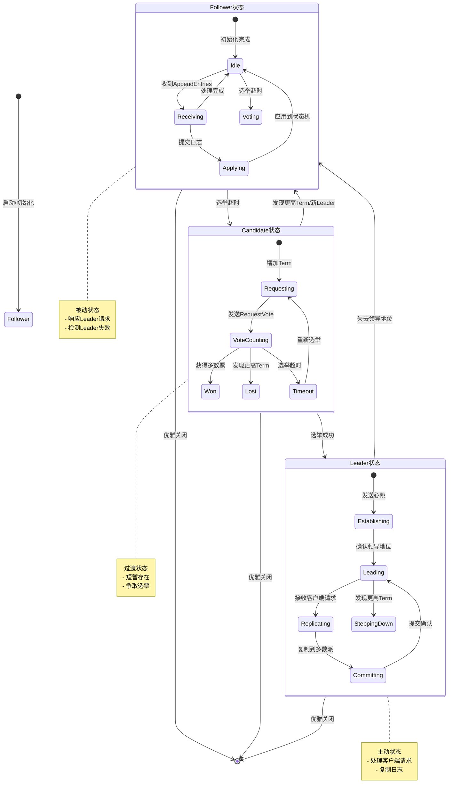
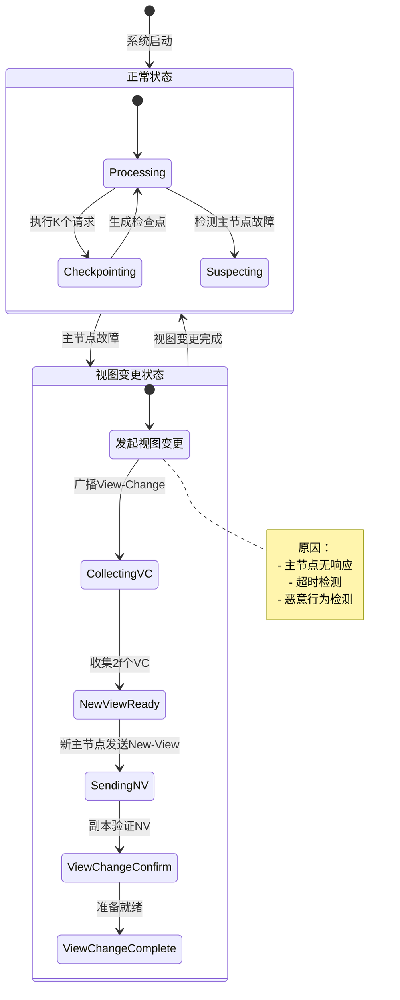
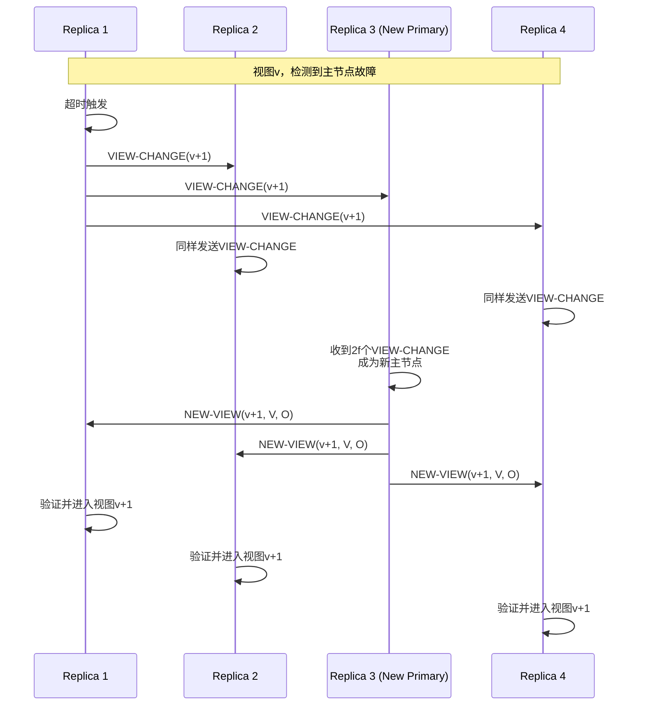
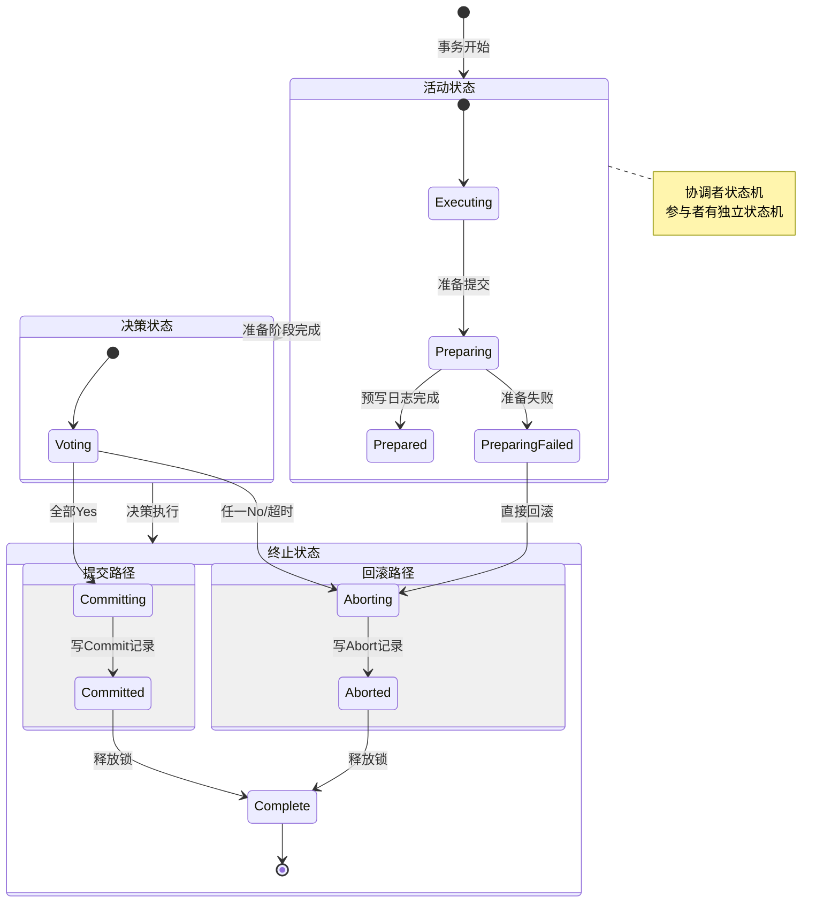
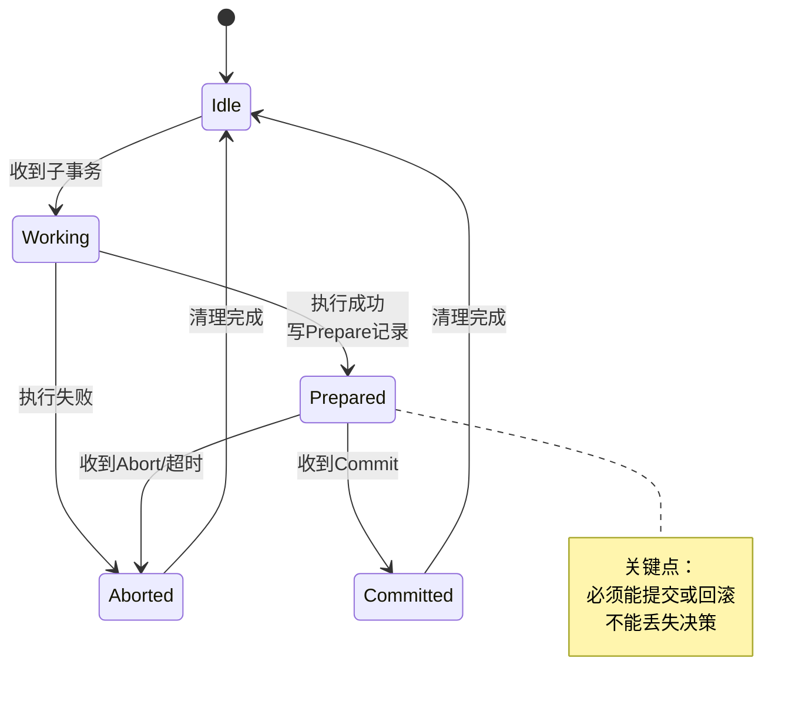
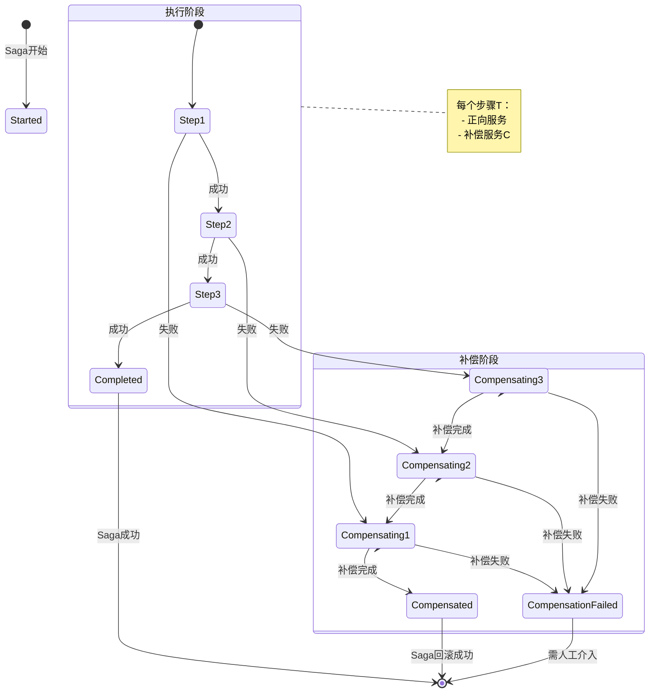
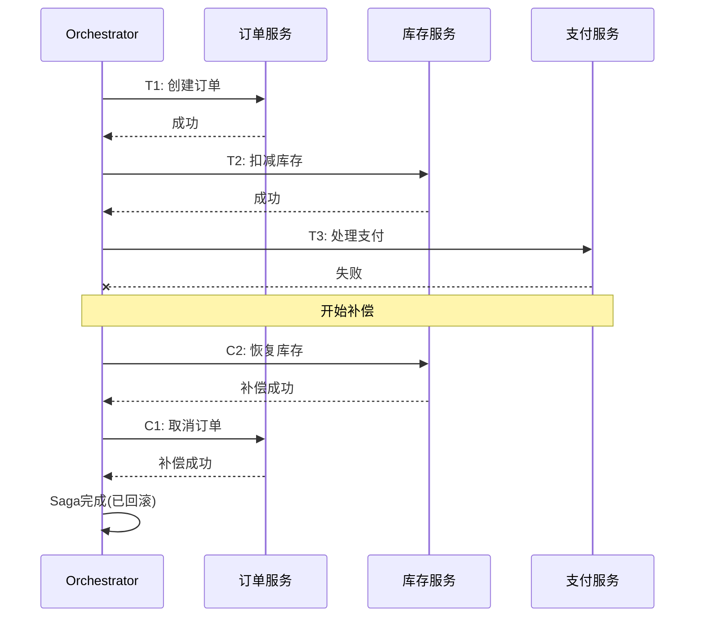
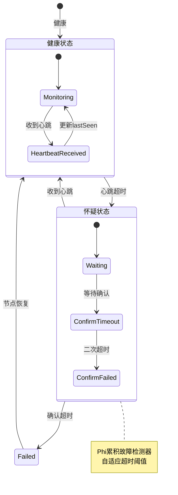

# 一致性状态机图

> 🔄 使用Mermaid StateDiagram展示分布式系统中的关键状态流转

---

## 1️⃣ 副本状态机



**状态说明**：

| 状态 | 职责 | 转换条件 |
|------|------|----------|
| **Follower** | 被动接收日志，响应Leader | 选举超时→Candidate |
| **Candidate** | 发起选举，争取成为Leader | 获得多数票→Leader |
| **Leader** | 处理请求，复制日志到Followers | 发现更高Term→Follower |

---

## 2️⃣ 视图变更状态机 (PBFT)



**视图变更流程**：



---

## 3️⃣ 事务状态流转

### 2PC事务状态机



### 参与者状态机



---

## 4️⃣ Saga事务状态机



**Saga执行示例**：



---

## 5️⃣ 一致性级别状态机

```mermaid
stateDiagram-v2
    [*] --> Linearizable: 线性一致性

    Linearizable --> Sequential: 放宽实时性
    Sequential --> Causal: 放宽全局顺序
    Causal --> Session: 限制为会话
    Session --> MonotonicReads: 放宽写入可见
    MonotonicReads --> ReadYourWrites: 进一步放宽
    ReadYourWrites --> Eventual: 最终一致

    Eventual --> ReadYourWrites: 增强保证
    ReadYourWrites --> MonotonicReads: 增强保证
    MonotonicReads --> Session: 增强保证
    Session --> Causal: 增强保证
    Causal --> Sequential: 增强保证
    Sequential --> Linearizable: 增强保证

    state Linearizable {
        note right of Linearizable
            最强一致性
            每次读取都看到最新写入
        end note
    }

    state Eventual {
        note right of Eventual
            最弱一致性
            最终所有副本一致
        end note
    }

    Linearizable --> [*]: 最高一致性要求
    Eventual --> [*]: 最高可用性要求
```

---

## 6️⃣ 故障检测状态机



---

## 📊 状态机复杂度对比

| 状态机类型 | 状态数 | 复杂度 | 主要用途 |
|------------|--------|--------|----------|
| **Raft副本** | 3 | ⭐⭐ | 领导者选举 |
| **PBFT视图** | 4+ | ⭐⭐⭐⭐ | 拜占庭容错 |
| **2PC事务** | 6+ | ⭐⭐⭐ | 分布式事务 |
| **Saga** | 2n+ | ⭐⭐⭐ | 长事务 |
| **一致性级别** | 6 | ⭐⭐ | 模型选择 |
| **故障检测** | 3 | ⭐⭐ | 故障识别 |

---

## 🔗 导航链接

### 思维导图系列

- [📊 分布式系统全景思维导图](./01-分布式系统全景思维导图.md)
- [🗳️ 共识算法选择思维导图](./02-共识算法选择思维导图.md)
- [💾 存储系统选型思维导图](./03-存储系统选型思维导图.md)

### 决策树系列

- [🌲 分布式事务模式决策树](./04-分布式事务模式决策树.md)
- [⚖️ 一致性级别决策树](./05-一致性级别决策树.md)
- [🔍 故障排查决策树](./06-故障排查决策树.md)

### 对比矩阵系列

- [📊 共识算法五维对比矩阵](./07-共识算法五维对比矩阵.md)
- [📊 存储系统六维选型矩阵](./08-存储系统六维选型矩阵.md)
- [📊 事务模式四维对比矩阵](./09-事务模式四维对比矩阵.md)

### 知识树系列

- [🌳 学习路径知识树](./10-学习路径知识树.md)
- [🔗 先决条件依赖树](./11-先决条件依赖树.md)

### 定理推理树系列

- [🧮 CAP定理推理树](./12-CAP定理推理树.md)
- [🧮 Raft安全性推理树](./13-Raft安全性推理树.md)

### 时序与状态图系列

- [⏱️ 共识算法时序对比图](./14-共识算法时序对比图.md)
- [🔄 一致性状态机图](./15-一致性状态机图.md) ← 当前

---

## 📚 延伸阅读

- [Raft算法状态机](../02-algorithms/raft/state-machine.md)
- [PBFT视图变更](../02-algorithms/pbft/view-change.md)
- [状态机复制理论](../01-foundation/state-machine-replication.md)
