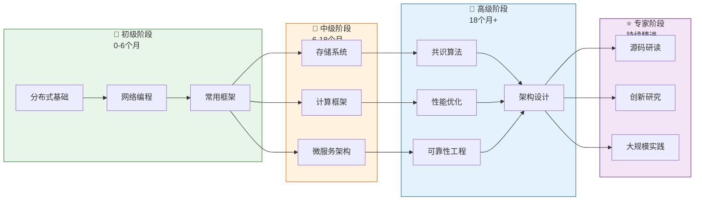

# 分布式计算学习路径

> 🎯 分级学习路线 | 从入门到精通 | 系统化成长

---

## 📚 学习路线图概览



---

## 🌱 初级阶段：夯实基础 (0-6个月)

### 学习目标

- 理解分布式系统的基本概念和挑战
- 掌握网络编程基础
- 熟悉常用的分布式框架和工具

### 推荐文档列表

#### 第一阶段：基础理论（第1-2个月）

| 序号 | 文档 | 预计时间 | 重点内容 |
|:---:|:---|:---:|:---|
| 1 | [MapReduce论文精读](../01-foundation/mapreduce论文精读.md) | 1周 | 分布式计算思想 |
| 2 | [CAP定理专题文档](../02-theory/distributed-systems/CAP定理专题文档.md) | 3天 | 核心理论基础 |
| 3 | [一致性模型专题文档](../02-theory/distributed-systems/一致性模型专题文档.md) | 3天 | 一致性概念 |
| 4 | [OSI与TCP-IP模型](../03-communication/01-network-fundamentals/OSI与TCP-IP模型.md) | 2天 | 网络基础 |
| 5 | [Socket编程详解](../03-communication/01-network-fundamentals/Socket编程详解.md) | 3天 | 网络编程 |

#### 第二阶段：RPC与通信（第2-3个月）

| 序号 | 文档 | 预计时间 | 重点内容 |
|:---:|:---|:---:|:---|
| 6 | [gRPC框架详解](../03-communication/01-network-fundamentals/gRPC框架详解.md) | 1周 | 现代RPC框架 |
| 7 | [Protobuf协议](../03-communication/02-serialization/Protobuf协议.md) | 3天 | 序列化协议 |
| 8 | [ZooKeeper深度分析](../03-communication/03-service-discovery/ZooKeeper深度分析.md) | 1周 | 服务协调 |
| 9 | [etcd详解](../03-communication/03-service-discovery/etcd详解.md) | 5天 | 分布式KV |

#### 第三阶段：消息队列与缓存（第3-4个月）

| 序号 | 文档 | 预计时间 | 重点内容 |
|:---:|:---|:---:|:---|
| 10 | [Kafka架构深度分析](../03-communication/message-queue/Kafka架构深度分析.md) | 1周 | 消息队列原理 |
| 11 | [Redis深度分析](../05-storage/nosql/Redis深度分析.md) | 1周 | 缓存基础 |
| 12 | [Redis集群模式](../05-storage/Redis集群模式.md) | 5天 | 分布式缓存 |

#### 第四阶段：初步实践（第4-6个月）

| 序号 | 文档 | 预计时间 | 重点内容 |
|:---:|:---|:---:|:---|
| 13 | [Docker容器技术](../07-architecture/cloud-computing/Docker容器技术.md) | 1周 | 容器化基础 |
| 14 | [Kubernetes架构深度分析](../07-architecture/cloud-computing/Kubernetes架构深度分析.md) | 2周 | 容器编排 |
| 15 | [微服务架构](../07-architecture/microservices/微服务架构.md) | 1周 | 服务化设计 |
| 16 | [电商系统架构案例](../13-practice/电商系统架构案例.md) | 1周 | 实战案例 |

### 初级技能检查清单

- [ ] 理解CAP定理并能举例说明
- [ ] 掌握至少一种RPC框架（gRPC/Dubbo）
- [ ] 能够使用Redis进行缓存设计
- [ ] 理解Kafka基本架构和使用
- [ ] 能够部署简单的K8s应用
- [ ] 理解微服务基本架构

---

## 🌿 中级阶段：深入专题 (6-18个月)

### 学习目标

- 深入理解存储系统原理
- 掌握大数据计算框架
- 能够设计和实现微服务架构

### 推荐文档列表

#### 第一阶段：存储系统深入（第6-9个月）

| 序号 | 文档 | 预计时间 | 重点内容 |
|:---:|:---|:---:|:---|
| 1 | [LSM-Tree存储引擎](../05-storage/LSM-Tree存储引擎.md) | 1周 | 存储引擎原理 |
| 2 | [B-Tree存储引擎](../05-storage/B-Tree存储引擎.md) | 5天 | B+树原理 |
| 3 | [存储引擎对比](../05-storage/存储引擎对比.md) | 3天 | 选型指南 |
| 4 | [主从复制原理](../05-storage/主从复制原理.md) | 5天 | 复制机制 |
| 5 | [分片策略详解](../05-storage/分片策略详解.md) | 1周 | 数据分片 |
| 6 | [一致性哈希](../05-storage/一致性哈希.md) | 3天 | 分片算法 |
| 7 | [MongoDB架构](../05-storage/nosql/MongoDB架构.md) | 1周 | 文档数据库 |
| 8 | [Cassandra深度分析](../05-storage/nosql/Cassandra深度分析.md) | 1周 | 宽列存储 |

#### 第二阶段：NewSQL与事务（第9-11个月）

| 序号 | 文档 | 预计时间 | 重点内容 |
|:---:|:---|:---:|:---|
| 9 | [TiDB架构深度分析](../05-storage/newsql/TiDB架构深度分析.md) | 2周 | 分布式SQL |
| 10 | [ACID与BASE理论](../08-transactions/theory/ACID与BASE理论.md) | 3天 | 事务理论 |
| 11 | [两阶段提交2PC](../08-transactions/protocols/两阶段提交2PC.md) | 5天 | 2PC协议 |
| 12 | [Saga模式详解](../08-transactions/protocols/Saga模式详解.md) | 1周 | 长事务处理 |
| 13 | [分布式事务选型指南](../08-transactions/分布式事务选型指南.md) | 3天 | 方案选型 |

#### 第三阶段：计算框架（第11-14个月）

| 序号 | 文档 | 预计时间 | 重点内容 |
|:---:|:---|:---:|:---|
| 14 | [Spark-Core详解](../06-computing/batch-processing/Spark-Core详解.md) | 2周 | Spark内核 |
| 15 | [Flink-Runtime详解](../06-computing/stream-processing/Flink-Runtime详解.md) | 2周 | 流处理引擎 |
| 16 | [流处理语义](../06-computing/stream-processing/流处理语义.md) | 1周 | Exactly-Once |
| 17 | [YARN资源管理](../06-computing/resource-scheduling/YARN资源管理.md) | 1周 | 资源调度 |

#### 第四阶段：微服务深化（第14-18个月）

| 序号 | 文档 | 预计时间 | 重点内容 |
|:---:|:---|:---:|:---|
| 18 | [服务网格Istio](../07-architecture/microservices/服务网格Istio.md) | 2周 | Service Mesh |
| 19 | [熔断与限流](../07-architecture/microservices/熔断与限流.md) | 1周 | 弹性设计 |
| 20 | [分布式ID生成](../07-architecture/microservices/分布式ID生成.md) | 3天 | ID生成策略 |
| 21 | [网关与BFF](../07-architecture/microservices/网关与BFF.md) | 5天 | API网关 |
| 22 | [金融系统架构案例](../13-practice/金融系统架构案例.md) | 1周 | 复杂案例 |

### 中级技能检查清单

- [ ] 理解LSM-Tree和B-Tree原理差异
- [ ] 能够设计数据分片方案
- [ ] 掌握至少一种NewSQL数据库
- [ ] 理解2PC和Saga的事务差异
- [ ] 能够调优Spark/Flink作业
- [ ] 能够设计微服务熔断限流方案

---

## 🌳 高级阶段：精通原理 (18个月+)

### 学习目标

- 深入理解共识算法原理
- 掌握大规模系统性能优化
- 能够设计高可靠系统架构

### 推荐文档列表

#### 第一阶段：共识算法（第18-22个月）

| 序号 | 文档 | 预计时间 | 重点内容 |
|:---:|:---|:---:|:---|
| 1 | [Raft算法详解](../04-consensus/classic/Raft算法详解.md) | 2周 | Raft原理 |
| 2 | [Paxos算法详解](../04-consensus/classic/Paxos算法详解.md) | 2周 | Paxos原理 |
| 3 | [Raft与Paxos对比](../04-consensus/Raft与Paxos对比.md) | 3天 | 算法对比 |
| 4 | [ZAB协议详解](../04-consensus/classic/ZAB协议详解.md) | 1周 | ZooKeeper协议 |
| 5 | [共识算法选型指南](../04-consensus/共识算法选型指南.md) | 3天 | 选型指南 |
| 6 | [PBFT实用拜占庭容错](../04-consensus/bft/PBFT实用拜占庭容错.md) | 2周 | BFT算法 |

#### 第二阶段：形式化验证（第22-24个月）

| 序号 | 文档 | 预计时间 | 重点内容 |
|:---:|:---|:---:|:---|
| 7 | [FLP不可能定理专题文档](../02-theory/distributed-systems/FLP不可能定理专题文档.md) | 1周 | 理论限制 |
| 8 | [LTL专题文档](../02-theory/formal-verification/LTL专题文档.md) | 1周 | 时序逻辑 |
| 9 | [TLA+专题文档](../02-theory/formal-verification/TLA+专题文档.md) | 2周 | 规范描述 |

#### 第三阶段：性能优化（第24-28个月）

| 序号 | 文档 | 预计时间 | 重点内容 |
|:---:|:---|:---:|:---|
| 10 | [性能指标详解](../10-performance/01-性能指标详解.md) | 3天 | 指标体系 |
| 11 | [延迟优化](../10-performance/02-延迟优化.md) | 1周 | 延迟分析 |
| 12 | [吞吐量优化](../10-performance/03-吞吐量优化.md) | 1周 | 吞吐优化 |
| 13 | [JVM性能调优](../10-performance/06-JVM性能调优.md) | 2周 | JVM优化 |
| 14 | [网络性能优化](../10-performance/09-网络优化.md) | 1周 | 网络优化 |
| 15 | [缓存一致性](../05-storage/缓存一致性.md) | 1周 | 缓存优化 |

#### 第四阶段：可靠性工程（第28-32个月）

| 序号 | 文档 | 预计时间 | 重点内容 |
|:---:|:---|:---:|:---|
| 16 | [容错设计](../09-reliability/容错设计.md) | 1周 | 容错架构 |
| 17 | [故障检测](../09-reliability/故障检测.md) | 1周 | 故障发现 |
| 18 | [故障恢复](../09-reliability/故障恢复.md) | 1周 | 恢复机制 |
| 19 | [灾备架构](../09-reliability/灾备架构.md) | 1周 | 灾备设计 |
| 20 | [混沌工程](../09-reliability/混沌工程.md) | 1周 | 故障演练 |

#### 第五阶段：安全与可观测性（第32-36个月）

| 序号 | 文档 | 预计时间 | 重点内容 |
|:---:|:---|:---:|:---|
| 21 | [TLS-SSL传输安全](../11-security/02-TLS-SSL传输安全.md) | 1周 | 传输安全 |
| 22 | [零信任架构](../11-security/07-零信任架构.md) | 1周 | 零信任 |
| 23 | [可观测性三支柱](../12-observability/可观测性三支柱.md) | 1周 | 可观测性 |
| 24 | [OpenTelemetry标准](../12-observability/OpenTelemetry标准.md) | 1周 | OTel规范 |
| 25 | [SLO与SLI定义](../12-observability/SLO与SLI定义.md) | 3天 | 服务等级 |

#### 第六阶段：复杂案例（第36-40个月）

| 序号 | 文档 | 预计时间 | 重点内容 |
|:---:|:---|:---:|:---|
| 26 | [社交系统架构案例](../13-practice/社交系统架构案例.md) | 2周 | 高并发设计 |
| 27 | [游戏系统架构案例](../13-practice/游戏系统架构案例.md) | 2周 | 实时系统 |
| 28 | [分布式系统架构设计指南](../13-practice/分布式系统架构设计指南.md) | 2周 | 设计方法论 |

### 高级技能检查清单

- [ ] 能够手写Raft算法核心逻辑
- [ ] 理解Paxos和Raft的本质差异
- [ ] 能够分析系统性能瓶颈
- [ ] 能够设计异地多活架构
- [ ] 能够实施混沌工程实验
- [ ] 能够设计完整的安全架构

---

## ⭐ 专家阶段：持续精进 (持续)

### 学习目标

- 阅读经典论文和源码
- 参与开源社区
- 解决超大规模系统问题
- 创新研究

### 推荐方向

#### 方向一：源码研读

| 项目 | 重点模块 | 建议时长 |
|:---|:---|:---:|
| etcd | Raft实现、WAL、Snapshot | 3个月 |
| TiKV | 分布式事务、Raft、存储引擎 | 6个月 |
| Kafka | 副本机制、日志存储、协调器 | 3个月 |
| Flink | Checkpoint、StateBackend、调度 | 6个月 |

#### 方向二：前沿研究

| 主题 | 推荐论文/资源 | 说明 |
|:---|:---|:---|
| Serverless | AWS Lambda论文 | 无服务器计算 |
| 边缘计算 | KubeEdge架构 | 边缘AI推理 |
| 分布式ML | Ray/Parameter Server论文 | 大规模训练 |
| 新型存储 | Ceph/MinIO架构 | 云原生存储 |

#### 方向三：大规模实践

| 场景 | 挑战 | 能力要求 |
|:---|:---|:---|
| 百万级QPS | 极致性能优化 | 全栈优化能力 |
| 全球多活 | 数据一致性 | 复杂系统设计 |
| 实时计算 | 低延迟处理 | 流计算专家 |
| 超大规模K8s | 集群管理 | 云原生专家 |

---

## 📋 主题域学习顺序建议

### 推荐学习序列

```
第1阶段：基础构建（01-03）
├── 01-基础理论（MapReduce、形式化验证）
├── 02-核心理论（CAP、一致性模型）
└── 03-通信机制（RPC、MQ、服务发现）

第2阶段：核心机制（04-06）
├── 04-共识算法（Raft、Paxos）
├── 05-存储系统（NoSQL、NewSQL、复制分片）
└── 06-计算框架（Spark、Flink）

第3阶段：系统架构（07-08）
├── 07-系统架构（微服务、云原生、容器）
└── 08-分布式事务（2PC、Saga、TCC）

第4阶段：工程实践（09-14）
├── 09-可靠性工程（容错、灾备）
├── 10-性能优化（延迟、吞吐量）
├── 11-安全（TLS、OAuth、零信任）
├── 12-可观测性（Metrics、Logs、Traces）
├── 13-实践案例（行业架构）
└── 14-工具链（压测、监控、CI/CD）
```

---

## 📖 配套资源

### 推荐书籍

| 阶段 | 书名 | 作者 | 说明 |
|:---:|:---|:---|:---|
| 初级 | 《大数据技术原理与应用》 | 林子雨 | 入门教材 |
| 初级 | 《Redis设计与实现》 | 黄健宏 | Redis详解 |
| 中级 | 《Designing Data-Intensive Applications》 | Martin Kleppmann | DDIA经典 |
| 中级 | 《Kubernetes权威指南》 | 龚正等 | K8s详解 |
| 高级 | 《分布式系统：概念与设计》 | Coulouris | 系统教材 |
| 专家 | 《Paxos Made Simple》 | Lamport | 经典论文 |

### 推荐课程

| 阶段 | 课程 | 平台 | 说明 |
|:---:|:---|:---|:---|
| 初级 | MIT 6.824 | MIT | 分布式系统经典课程 |
| 中级 | Stanford CS245 | Stanford | 数据库系统 |
| 高级 | CMU 15-712 | CMU | 高级分布式系统 |

---

## ✅ 学习成果验证

### 项目实践建议

| 阶段 | 项目 | 技能验证 |
|:---:|:---|:---|
| 初级 | 实现简单RPC框架 | 网络编程、序列化 |
| 初级 | 基于Redis的缓存系统 | 缓存设计、一致性 |
| 中级 | 实现简化版Raft | 共识算法理解 |
| 中级 | 简单分布式KV存储 | 存储引擎、分片 |
| 高级 | 实现简化版Flink | 流处理、状态管理 |
| 专家 | 开源项目贡献 | 代码质量、协作 |

---

**最后更新**: 2026-04-04 | **维护者**: 分布式计算知识库团队
