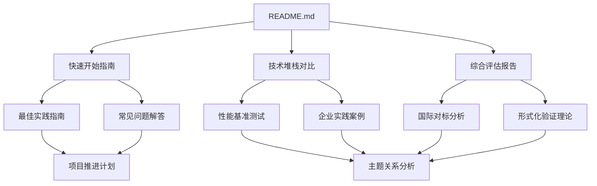

# 文档导航图

本文档提供项目的完整导航结构，帮助您快速找到所需内容。

## 一、文档结构总览

```text
DistributedComputing-WorkFlow/
│
├── README.md                    # 项目主文档（从这里开始）
├── CONTRIBUTING.md              # 贡献指南
├── CHANGELOG.md                 # 更新日志
├── archive/                     # 归档目录（历史文档，详见archive/README.md）
│
└── docs/                        # 文档目录
    │
    ├── 00-index/               # 📑 索引和概览
    │   ├── README.md           # 文档索引
    │   ├── 项目结构总览.md     # 项目结构说明
    │   └── 文档导航图.md       # 本文档
    │
    ├── 01-theme-analysis/      # 📊 主题关系分析
    │   └── 主题关系分析.md     # 主题和子主题关系梳理
    │
    ├── 02-technology-comparison/  # 🔍 技术堆栈对比
    │   └── 技术堆栈对比分析.md   # 框架对比分析
    │
    ├── 03-formal-verification/   # 🔬 形式化验证理论
    │   └── 形式化验证理论.md     # TLA+、CTL/LTL等
    │
    ├── 04-practice-cases/        # 🏢 企业实践案例
    │   └── 企业实践案例.md       # 深度案例分析
    │
    ├── 05-roadmap/              # 🗺️ 项目推进计划
    │   └── 项目推进计划.md       # 32周详细计划
    │
    ├── 06-benchmarks/           # 📈 性能基准测试
    │   └── 性能基准测试.md       # 详细性能测试报告
    │
    ├── 07-international-benchmark/  # 🌍 国际对标分析
    │   └── 国际对标分析.md         # 国际对标报告
    │
    ├── 08-summary/              # 📋 综合评估报告
    │   └── 综合评估报告.md       # 综合评估和结论
    │
    ├── 09-quickstart/           # 🚀 快速开始指南
    │   └── 快速开始指南.md       # 5分钟快速上手
    │
    ├── 10-best-practices/       # ⭐ 最佳实践指南
    │   └── 最佳实践指南.md       # 生产环境最佳实践
    │
    └── 11-faq/                  # ❓ 常见问题解答
        └── 常见问题解答.md       # FAQ和问题解答
```

## 二、阅读路径推荐

### 路径1：快速了解（30分钟）

适合：想要快速了解项目核心结论的用户

1. [README.md](../../README.md) - 项目概览
2. [快速开始指南](../09-quickstart/快速开始指南.md) - 5分钟快速了解
3. [综合评估报告](../08-summary/综合评估报告.md) - 核心结论

### 路径2：技术选型（1-2小时）

适合：需要进行技术选型的决策者

1. [技术堆栈对比分析](../02-technology-comparison/技术堆栈对比分析.md) - 全面对比
2. [性能基准测试](../06-benchmarks/性能基准测试.md) - 性能数据
3. [企业实践案例](../04-practice-cases/企业实践案例.md) - 实践验证
4. [综合评估报告](../08-summary/综合评估报告.md) - 选型建议

### 路径3：深入学习（半天）

适合：想要深入理解理论和实践的开发者

1. [主题关系分析](../01-theme-analysis/主题关系分析.md) - 理解整体架构
2. [形式化验证理论](../03-formal-verification/形式化验证理论.md) - 理论基础
3. [技术堆栈对比分析](../02-technology-comparison/技术堆栈对比分析.md) - 技术对比
4. [企业实践案例](../04-practice-cases/企业实践案例.md) - 实践案例
5. [最佳实践指南](../10-best-practices/最佳实践指南.md) - 最佳实践

### 路径4：项目实施（1-2天）

适合：准备实施项目的团队

1. [快速开始指南](../09-quickstart/快速开始指南.md) - 环境搭建
2. [最佳实践指南](../10-best-practices/最佳实践指南.md) - 实施指南
3. [性能基准测试](../06-benchmarks/性能基准测试.md) - 性能优化
4. [常见问题解答](../11-faq/常见问题解答.md) - 问题解决
5. [项目推进计划](../05-roadmap/项目推进计划.md) - 项目规划

### 路径5：学术研究（2-3天）

适合：进行学术研究的学者

1. [形式化验证理论](../03-formal-verification/形式化验证理论.md) - 理论基础
2. [国际对标分析](../07-international-benchmark/国际对标分析.md) - 学术对标
3. [主题关系分析](../01-theme-analysis/主题关系分析.md) - 理论体系
4. [企业实践案例](../04-practice-cases/企业实践案例.md) - 实践验证
5. [综合评估报告](../08-summary/综合评估报告.md) - 综合结论

## 三、文档关系图



## 四、文档分类

### 按内容类型分类

#### 理论分析类

- [主题关系分析](../01-theme-analysis/主题关系分析.md)
- [形式化验证理论](../03-formal-verification/形式化验证理论.md)
- [国际对标分析](../07-international-benchmark/国际对标分析.md)

#### 技术对比类

- [技术堆栈对比分析](../02-technology-comparison/技术堆栈对比分析.md)
- [性能基准测试](../06-benchmarks/性能基准测试.md)

#### 实践案例类

- [企业实践案例](../04-practice-cases/企业实践案例.md)
- [最佳实践指南](../10-best-practices/最佳实践指南.md)

#### 实用指南类

- [快速开始指南](../09-quickstart/快速开始指南.md)
- [常见问题解答](../11-faq/常见问题解答.md)
- [项目推进计划](../05-roadmap/项目推进计划.md)

#### 综合报告类

- [综合评估报告](../08-summary/综合评估报告.md)
- [归档文档索引](../../archive/README.md) - 查看历史完成报告和状态报告

### 按用户角色分类

#### 决策者

- [综合评估报告](../08-summary/综合评估报告.md)
- [技术堆栈对比分析](../02-technology-comparison/技术堆栈对比分析.md)
- [性能基准测试](../06-benchmarks/性能基准测试.md)

#### 开发者

- [快速开始指南](../09-quickstart/快速开始指南.md)
- [最佳实践指南](../10-best-practices/最佳实践指南.md)
- [常见问题解答](../11-faq/常见问题解答.md)

#### 研究者

- [形式化验证理论](../03-formal-verification/形式化验证理论.md)
- [国际对标分析](../07-international-benchmark/国际对标分析.md)
- [主题关系分析](../01-theme-analysis/主题关系分析.md)

#### 项目经理

- [项目推进计划](../05-roadmap/项目推进计划.md)
- [企业实践案例](../04-practice-cases/企业实践案例.md)
- [归档文档索引](../../archive/README.md) - 查看历史状态报告

## 五、快速查找

### 按主题查找

| 主题 | 相关文档 |
|------|---------|
| **技术选型** | [技术堆栈对比](../02-technology-comparison/技术堆栈对比分析.md)、[综合评估报告](../08-summary/综合评估报告.md) |
| **性能优化** | [性能基准测试](../06-benchmarks/性能基准测试.md)、[最佳实践指南](../10-best-practices/最佳实践指南.md) |
| **实践案例** | [企业实践案例](../04-practice-cases/企业实践案例.md)、[最佳实践指南](../10-best-practices/最佳实践指南.md) |
| **形式化验证** | [形式化验证理论](../03-formal-verification/形式化验证理论.md)、[国际对标分析](../07-international-benchmark/国际对标分析.md) |
| **快速上手** | [快速开始指南](../09-quickstart/快速开始指南.md)、[常见问题解答](../11-faq/常见问题解答.md) |

### 按问题查找

| 问题 | 相关文档 |
|------|---------|
| **如何选择技术栈？** | [技术堆栈对比](../02-technology-comparison/技术堆栈对比分析.md)、[综合评估报告](../08-summary/综合评估报告.md) |
| **如何快速开始？** | [快速开始指南](../09-quickstart/快速开始指南.md) |
| **如何优化性能？** | [性能基准测试](../06-benchmarks/性能基准测试.md)、[最佳实践指南](../10-best-practices/最佳实践指南.md) |
| **遇到问题怎么办？** | [常见问题解答](../11-faq/常见问题解答.md) |
| **如何实施项目？** | [项目推进计划](../05-roadmap/项目推进计划.md)、[最佳实践指南](../10-best-practices/最佳实践指南.md) |

## 六、文档更新记录

- **v1.0.0** (2024-01-XX) - 初始版本，包含所有核心文档

详细更新记录请查看 [CHANGELOG.md](../../CHANGELOG.md)

## 七、反馈和建议

如果您对文档结构或内容有任何建议，请：

1. 提交 [GitHub Issue](https://github.com/your-repo/issues)
2. 创建 [Pull Request](https://github.com/your-repo/pulls)
3. 查看 [贡献指南](../../CONTRIBUTING.md)

---

**文档导航图版本**：1.0.0

**最后更新**：2024年

**维护者**：项目团队
