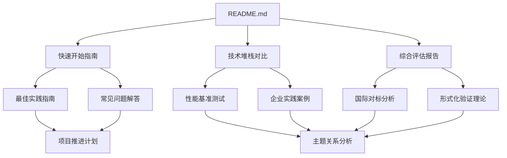

# 文档导航图

本文档提供项目的完整导航结构，帮助您快速找到所需内容。

## 一、文档结构总览

```text
DistributedComputing-WorkFlow/
│
├── README.md                    # 项目主文档（从这里开始）
├── CONTRIBUTING.md              # 贡献指南
├── CHANGELOG.md                 # 更新日志
├── archive/                     # 归档目录（历史文档，详见archive/README.md）
│
└── docs/                        # 文档目录
    │
    ├── 00-index/               # 📑 索引和概览
    │   ├── README.md           # 文档索引
    │   ├── 项目结构总览.md     # 项目结构说明
    │   └── 文档导航图.md       # 本文档
    │
    ├── 01-theme-analysis/      # 📊 主题关系分析
    │   └── 主题关系分析.md     # 主题和子主题关系梳理
    │
    ├── 02-technology-comparison/  # 🔍 技术堆栈对比
    │   └── 技术堆栈对比分析.md   # 框架对比分析
    │
    ├── 03-formal-verification/   # 🔬 形式化验证理论
    │   └── 形式化验证理论.md     # TLA+、CTL/LTL等
    │
    ├── 04-practice-cases/        # 🏢 企业实践案例
    │   └── 企业实践案例.md       # 深度案例分析
    │
    ├── 05-roadmap/              # 🗺️ 项目推进计划
    │   └── 项目推进计划.md       # 32周详细计划
    │
    ├── 06-benchmarks/           # 📈 性能基准测试
    │   └── 性能基准测试.md       # 详细性能测试报告
    │
    ├── 07-international-benchmark/  # 🌍 国际对标分析
    │   └── 国际对标分析.md         # 国际对标报告
    │
    ├── 08-summary/              # 📋 综合评估报告
    │   └── 综合评估报告.md       # 综合评估和结论
    │
    ├── 09-quickstart/           # 🚀 快速开始指南
    │   └── 快速开始指南.md       # 5分钟快速上手
    │
    ├── 10-best-practices/       # ⭐ 最佳实践指南
    │   └── 最佳实践指南.md       # 生产环境最佳实践
    │
    └── 11-faq/                  # ❓ 常见问题解答
        └── 常见问题解答.md       # FAQ和问题解答
    │
    ├── 15-formal-models/        # 📐 理论模型专题文档
    │   ├── README.md            # 理论模型索引
    │   ├── TLA+专题文档.md      # TLA+专题
    │   ├── CAP定理专题文档.md    # CAP定理专题
    │   ├── 树形分层结构专题文档.md # 树形结构专题
    │   └── ...                  # 其他18个理论模型专题文档
    │
    ├── 17-enhancement-plan/     # 🎯 知识增强计划
    │   ├── README.md            # 增强计划索引
    │   ├── 项目知识图谱.md      # 项目知识图谱（新增）
    │   ├── 知识结构组织方法.md  # 知识结构组织方法（新增）
    │   └── 全局知识关联图.md    # 全局知识关联图
    │
    ├── 18-argumentation-enhancement/  # 🔬 论证增强
    │   ├── README.md            # 论证增强索引
    │   ├── Temporal选型论证.md  # Temporal选型论证
    │   ├── PostgreSQL选型论证.md # PostgreSQL选型论证
    │   ├── 形式逻辑推理方法.md  # 形式逻辑推理方法（新增）
    │   ├── 跨学科整合-认知科学.md # 跨学科整合-认知科学（新增）
    │   ├── 跨学科整合-逻辑学.md # 跨学科整合-逻辑学（新增）
    │   ├── 跨学科整合-其他学科.md # 跨学科整合-其他学科（新增）
    │   ├── 新兴技术应用-语境图谱.md # 新兴技术应用-语境图谱（新增）
    │   ├── 新兴技术应用-动态共词网络.md # 新兴技术应用-动态共词网络（新增）
    │   └── 新兴技术应用-情景规划.md # 新兴技术应用-情景规划（新增）
    │
    ├── 19-next-phase/           # 🎯 P2优先级任务（下一阶段）
    │   ├── README.md            # P2优先级任务索引
    │   ├── P2优先级任务计划.md  # P2优先级任务计划
    │   ├── 伦理与社会影响-数据隐私与安全.md # 伦理与社会影响（新增）
    │   ├── 伦理与社会影响-算法公平性与偏见.md # 伦理与社会影响（新增）
    │   ├── 伦理与社会影响-系统透明度与可解释性.md # 伦理与社会影响（新增）
    │   ├── 伦理与社会影响-社会责任与可持续发展.md # 伦理与社会影响（新增）
    │   ├── 动态知识更新-增量更新机制.md # 动态知识更新（新增）
    │   ├── 动态知识更新-版本管理.md # 动态知识更新（新增）
    │   ├── 动态知识更新-一致性维护.md # 动态知识更新（新增）
    │   └── 动态知识更新-质量评估.md # 动态知识更新（新增）
    │
    └── 20-future-enhancement/   # 🚀 下一阶段增强计划
        ├── README.md            # 下一阶段增强计划索引
        └── 下一阶段增强计划.md  # 下一阶段增强计划（新增）
```

## 二、阅读路径推荐

### 路径1：快速了解（30分钟）

适合：想要快速了解项目核心结论的用户

1. [README.md](../../README.md) - 项目概览
2. [快速开始指南](../09-quickstart/快速开始指南.md) - 5分钟快速了解
3. [综合评估报告](../08-summary/综合评估报告.md) - 核心结论

### 路径2：技术选型（1-2小时）

适合：需要进行技术选型的决策者

1. [技术堆栈对比分析](../02-technology-comparison/技术堆栈对比分析.md) - 全面对比
2. [性能基准测试](../06-benchmarks/性能基准测试.md) - 性能数据
3. [企业实践案例](../04-practice-cases/企业实践案例.md) - 实践验证
4. [综合评估报告](../08-summary/综合评估报告.md) - 选型建议

### 路径3：深入学习（半天）

适合：想要深入理解理论和实践的开发者

1. [主题关系分析](../01-theme-analysis/主题关系分析.md) - 理解整体架构
2. [形式化验证理论](../03-formal-verification/形式化验证理论.md) - 理论基础
3. [技术堆栈对比分析](../02-technology-comparison/技术堆栈对比分析.md) - 技术对比
4. [企业实践案例](../04-practice-cases/企业实践案例.md) - 实践案例
5. [最佳实践指南](../10-best-practices/最佳实践指南.md) - 最佳实践

### 路径4：项目实施（1-2天）

适合：准备实施项目的团队

1. [快速开始指南](../09-quickstart/快速开始指南.md) - 环境搭建
2. [最佳实践指南](../10-best-practices/最佳实践指南.md) - 实施指南
3. [性能基准测试](../06-benchmarks/性能基准测试.md) - 性能优化
4. [常见问题解答](../11-faq/常见问题解答.md) - 问题解决
5. [项目推进计划](../05-roadmap/项目推进计划.md) - 项目规划

### 路径5：学术研究（2-3天）

适合：进行学术研究的学者

1. [形式化验证理论](../03-formal-verification/形式化验证理论.md) - 理论基础
2. [国际对标分析](../07-international-benchmark/国际对标分析.md) - 学术对标
3. [理论模型专题文档](../15-formal-models/README.md) - 18个理论模型专题文档
4. [形式逻辑推理方法](../18-argumentation-enhancement/形式逻辑推理方法.md) - 形式逻辑推理方法体系

### 路径6：树形结构专题（1-2天）

适合：研究树形分层结构的用户

1. [树形分层结构专题文档](../15-formal-models/树形分层结构专题文档.md) - 完整的树形结构理论体系

### 路径7：形式论证增强（新增，2025年11月28日）

适合：需要了解形式逻辑推理方法和知识结构体系的用户

1. [形式逻辑推理方法](../18-argumentation-enhancement/形式逻辑推理方法.md) - 演绎推理、归纳推理、反证法
2. [项目知识图谱](../17-enhancement-plan/项目知识图谱.md) - 知识图谱构建
3. [知识结构组织方法](../17-enhancement-plan/知识结构组织方法.md) - 知识结构组织
4. [跨学科整合文档](../18-argumentation-enhancement/跨学科整合-认知科学.md) - 跨学科整合
5. [新兴技术应用文档](../18-argumentation-enhancement/新兴技术应用-语境图谱.md) - 新兴技术应用

### 路径8：P2优先级任务（新增，2025年11月28日）

适合：需要了解伦理与社会影响、动态知识更新的用户

1. [P2优先级任务计划](../19-next-phase/P2优先级任务计划.md) - P2优先级任务计划
2. [伦理与社会影响-数据隐私与安全](../19-next-phase/伦理与社会影响-数据隐私与安全.md) - 数据隐私与安全
3. [伦理与社会影响-算法公平性与偏见](../19-next-phase/伦理与社会影响-算法公平性与偏见.md) - 算法公平性与偏见
4. [动态知识更新-增量更新机制](../19-next-phase/动态知识更新-增量更新机制.md) - 增量更新机制
5. [动态知识更新-版本管理](../19-next-phase/动态知识更新-版本管理.md) - 版本管理

### 路径9：下一阶段增强计划（新增，2025年11月28日）

适合：需要了解下一阶段持续改进和增强计划的用户

1. [下一阶段增强计划](../20-future-enhancement/下一阶段增强计划.md) - 下一阶段增强计划
2. [内容深化与扩展](../20-future-enhancement/下一阶段增强计划.md#p3优先级内容深化与扩展可选持续进行) - 内容深化与扩展
3. [工具化开发](../20-future-enhancement/下一阶段增强计划.md#p4优先级工具化开发可选6-12个月) - 工具化开发
4. [持续演进机制](../20-future-enhancement/下一阶段增强计划.md#p5优先级持续演进机制可选持续进行) - 持续演进机制
2. [view01：跨行业通用模型](../../structure_control/view01.md) - 跨行业普遍性论证
3. [view02：多维度系统论证](../../structure_control/view02.md) - 形式化证明和多维矩阵
4. [view03：数据架构控制领域](../../structure_control/view03.md) - 技术实现和工程化应用

### 路径7：形式论证增强专题（1-2天）

适合：研究形式论证和推理方法的用户

1. [形式逻辑推理方法](../18-argumentation-enhancement/形式逻辑推理方法.md) - 演绎推理、归纳推理、反证法
2. [跨学科整合-认知科学](../18-argumentation-enhancement/跨学科整合-认知科学.md) - 认知科学理论应用
3. [跨学科整合-逻辑学](../18-argumentation-enhancement/跨学科整合-逻辑学.md) - 逻辑学理论应用
4. [新兴技术应用-语境图谱](../18-argumentation-enhancement/新兴技术应用-语境图谱.md) - 语境图谱技术应用

### 路径8：知识结构梳理专题（1天）

适合：研究知识图谱和知识组织的用户

1. [项目知识图谱](../17-enhancement-plan/项目知识图谱.md) - 项目知识图谱构建
2. [知识结构组织方法](../17-enhancement-plan/知识结构组织方法.md) - 知识结构组织方法
3. [全局知识关联图](../18-argumentation-enhancement/全局知识关联图.md) - 全局知识关联图

### 路径9：P2优先级任务专题（3-6个月）

适合：研究伦理与社会影响、动态知识更新的用户

1. [P2优先级任务计划](../19-next-phase/P2优先级任务计划.md) - P2优先级任务详细计划 ✅
2. [伦理与社会影响](../19-next-phase/README.md#伦理与社会影响文档-已完成) - 数据隐私、算法公平性、透明度、社会责任 ✅
   - [数据隐私与安全](../19-next-phase/伦理与社会影响-数据隐私与安全.md)
   - [算法公平性与偏见](../19-next-phase/伦理与社会影响-算法公平性与偏见.md)
   - [系统透明度与可解释性](../19-next-phase/伦理与社会影响-系统透明度与可解释性.md)
   - [社会责任与可持续发展](../19-next-phase/伦理与社会影响-社会责任与可持续发展.md)
3. [动态知识更新](../19-next-phase/README.md#动态知识更新文档-已完成) - 增量更新、版本管理、一致性维护、质量评估 ✅
   - [增量更新机制](../19-next-phase/动态知识更新-增量更新机制.md)
   - [版本管理](../19-next-phase/动态知识更新-版本管理.md)
   - [一致性维护](../19-next-phase/动态知识更新-一致性维护.md)
   - [质量评估](../19-next-phase/动态知识更新-质量评估.md)
3. [主题关系分析](../01-theme-analysis/主题关系分析.md) - 理论体系
4. [树形分层结构专题文档](../15-formal-models/树形分层结构专题文档.md) - 树形结构理论
5. [企业实践案例](../04-practice-cases/企业实践案例.md) - 实践验证
6. [综合评估报告](../08-summary/综合评估报告.md) - 综合结论

### 路径10：下一阶段增强计划（新增，2025年11月28日）

适合：需要了解下一阶段持续改进和增强计划的用户

1. [下一阶段增强计划](../20-future-enhancement/下一阶段增强计划.md) - 下一阶段增强计划
2. [内容深化与扩展](../20-future-enhancement/下一阶段增强计划.md#p3优先级内容深化与扩展可选持续进行) - 内容深化与扩展
3. [工具化开发](../20-future-enhancement/下一阶段增强计划.md#p4优先级工具化开发可选6-12个月) - 工具化开发
4. [持续演进机制](../20-future-enhancement/下一阶段增强计划.md#p5优先级持续演进机制可选持续进行) - 持续演进机制

### 路径6：树形结构专题（1-2天）

适合：想要深入了解树形结构在工作流系统中应用的开发者

1. [树形分层结构专题文档](../15-formal-models/树形分层结构专题文档.md) - 理论基础
2. [项目主题对齐与推进计划](../../structure_control/项目主题对齐与推进计划.md) - 主题对齐
3. [技术堆栈对比分析](../02-technology-comparison/技术堆栈对比分析.md#五树形架构模式与工作流系统集成) - 架构模式
4. [企业实践案例](../04-practice-cases/企业实践案例.md#九树形结构行业应用案例) - 实践案例
5. [最佳实践指南](../10-best-practices/最佳实践指南.md#九树形结构最佳实践) - 最佳实践

## 三、文档关系图



## 四、文档分类

### 按内容类型分类

#### 理论分析类

- [主题关系分析](../01-theme-analysis/主题关系分析.md)
- [形式化验证理论](../03-formal-verification/形式化验证理论.md)
- [国际对标分析](../07-international-benchmark/国际对标分析.md)
- [树形分层结构专题文档](../15-formal-models/树形分层结构专题文档.md) - 树形结构理论与应用
- [形式逻辑推理方法](../18-argumentation-enhancement/形式逻辑推理方法.md) - 形式逻辑推理方法体系（新增）
- [项目知识图谱](../17-enhancement-plan/项目知识图谱.md) - 项目知识图谱（新增）

#### 技术对比类

- [技术堆栈对比分析](../02-technology-comparison/技术堆栈对比分析.md) - 包含树形架构模式章节
- [性能基准测试](../06-benchmarks/性能基准测试.md)

#### 实践案例类

- [企业实践案例](../04-practice-cases/企业实践案例.md) - 包含树形结构行业应用案例
- [最佳实践指南](../10-best-practices/最佳实践指南.md) - 包含树形结构最佳实践

#### 实用指南类

- [快速开始指南](../09-quickstart/快速开始指南.md)
- [常见问题解答](../11-faq/常见问题解答.md)
- [项目推进计划](../05-roadmap/项目推进计划.md)

#### 综合报告类

- [综合评估报告](../08-summary/综合评估报告.md)
- [归档文档索引](../../archive/README.md) - 查看历史完成报告和状态报告

### 按用户角色分类

#### 决策者

- [综合评估报告](../08-summary/综合评估报告.md)
- [技术堆栈对比分析](../02-technology-comparison/技术堆栈对比分析.md)
- [性能基准测试](../06-benchmarks/性能基准测试.md)

#### 开发者

- [快速开始指南](../09-quickstart/快速开始指南.md)
- [最佳实践指南](../10-best-practices/最佳实践指南.md)
- [常见问题解答](../11-faq/常见问题解答.md)

#### 研究者

- [形式化验证理论](../03-formal-verification/形式化验证理论.md)
- [国际对标分析](../07-international-benchmark/国际对标分析.md)
- [主题关系分析](../01-theme-analysis/主题关系分析.md)
- [形式逻辑推理方法](../18-argumentation-enhancement/形式逻辑推理方法.md) - 形式逻辑推理方法（新增）
- [跨学科整合文档](../18-argumentation-enhancement/跨学科整合-认知科学.md) - 跨学科整合（新增）
- [新兴技术应用文档](../18-argumentation-enhancement/新兴技术应用-语境图谱.md) - 新兴技术应用（新增）

#### 项目经理

- [项目推进计划](../05-roadmap/项目推进计划.md)
- [企业实践案例](../04-practice-cases/企业实践案例.md)
- [归档文档索引](../../archive/README.md) - 查看历史状态报告

## 五、快速查找

### 按主题查找

| 主题 | 相关文档 |
|------|---------|
| **技术选型** | [技术堆栈对比](../02-technology-comparison/技术堆栈对比分析.md)、[综合评估报告](../08-summary/综合评估报告.md) |
| **性能优化** | [性能基准测试](../06-benchmarks/性能基准测试.md)、[最佳实践指南](../10-best-practices/最佳实践指南.md) |
| **实践案例** | [企业实践案例](../04-practice-cases/企业实践案例.md)、[最佳实践指南](../10-best-practices/最佳实践指南.md) |
| **形式化验证** | [形式化验证理论](../03-formal-verification/形式化验证理论.md)、[国际对标分析](../07-international-benchmark/国际对标分析.md) |
| **快速上手** | [快速开始指南](../09-quickstart/快速开始指南.md)、[常见问题解答](../11-faq/常见问题解答.md) |

### 按问题查找

| 问题 | 相关文档 |
|------|---------|
| **如何选择技术栈？** | [技术堆栈对比](../02-technology-comparison/技术堆栈对比分析.md)、[综合评估报告](../08-summary/综合评估报告.md) |
| **如何快速开始？** | [快速开始指南](../09-quickstart/快速开始指南.md) |
| **如何优化性能？** | [性能基准测试](../06-benchmarks/性能基准测试.md)、[最佳实践指南](../10-best-practices/最佳实践指南.md) |
| **遇到问题怎么办？** | [常见问题解答](../11-faq/常见问题解答.md) |
| **如何实施项目？** | [项目推进计划](../05-roadmap/项目推进计划.md)、[最佳实践指南](../10-best-practices/最佳实践指南.md) |
| **如何使用树形结构？** | [树形分层结构专题文档](../15-formal-models/树形分层结构专题文档.md)、[最佳实践指南](../10-best-practices/最佳实践指南.md#九树形结构最佳实践) |
| **树形结构与工作流如何结合？** | [项目主题对齐与推进计划](../../structure_control/项目主题对齐与推进计划.md)、[技术堆栈对比分析](../02-technology-comparison/技术堆栈对比分析.md#五树形架构模式与工作流系统集成) |
| **如何进行形式逻辑推理？** | [形式逻辑推理方法](../18-argumentation-enhancement/形式逻辑推理方法.md) |
| **如何构建知识图谱？** | [项目知识图谱](../17-enhancement-plan/项目知识图谱.md)、[知识结构组织方法](../17-enhancement-plan/知识结构组织方法.md) |
| **如何进行跨学科整合？** | [跨学科整合-认知科学](../18-argumentation-enhancement/跨学科整合-认知科学.md)、[跨学科整合-逻辑学](../18-argumentation-enhancement/跨学科整合-逻辑学.md) |
| **如何应用新兴技术？** | [新兴技术应用-语境图谱](../18-argumentation-enhancement/新兴技术应用-语境图谱.md)、[新兴技术应用-动态共词网络](../18-argumentation-enhancement/新兴技术应用-动态共词网络.md) |

## 六、文档更新记录

- **v1.2.0** (2025-11-28) - 添加形式论证增强和知识结构梳理相关文档导航，新增形式论证增强专题和知识结构梳理专题阅读路径
- **v1.1.0** (2024-XX-XX) - 添加树形结构相关文档导航，新增树形结构专题阅读路径
- **v1.0.0** (2024-01-XX) - 初始版本，包含所有核心文档

详细更新记录请查看 [CHANGELOG.md](../../CHANGELOG.md)

## 七、反馈和建议

如果您对文档结构或内容有任何建议，请：

1. 提交 [GitHub Issue](https://github.com/your-repo/issues)
2. 创建 [Pull Request](https://github.com/your-repo/pulls)
3. 查看 [贡献指南](../../CONTRIBUTING.md)

---

**文档导航图版本**：1.2.0

**最后更新**：2025年11月28日

**更新说明**：

- v1.2.0：添加形式论证增强和知识结构梳理相关文档导航，新增形式论证增强专题和知识结构梳理专题阅读路径
- v1.1.0：添加树形结构相关文档导航，新增树形结构专题阅读路径
- v1.0.0：初始版本，包含所有核心文档

**维护者**：项目团队
