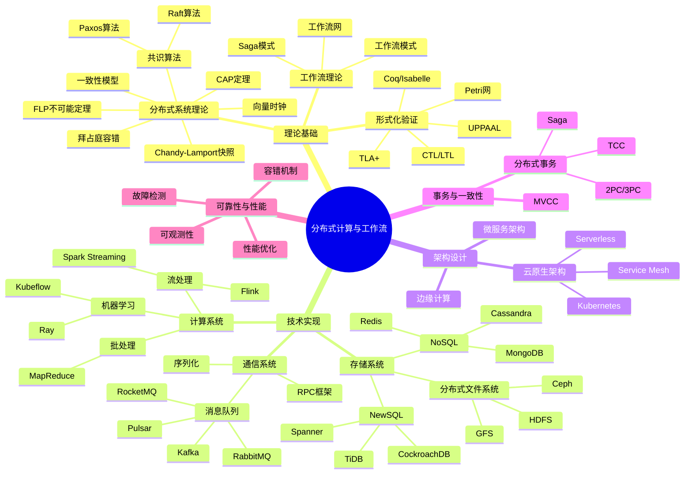
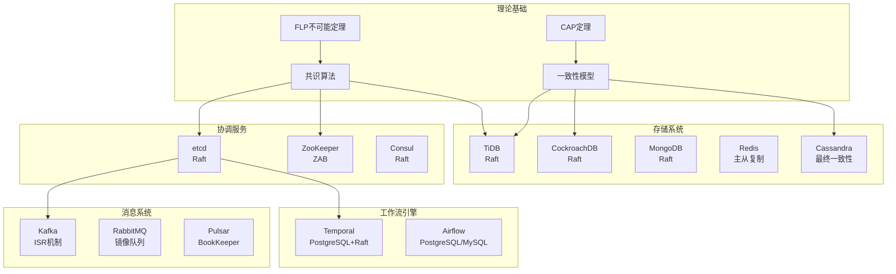

# 文档导航图

本文档提供项目的完整导航结构，帮助您快速找到所需内容。

## 📊 知识网络总览


```mermaid
mindmap
  root((分布式计算与工作流))
    理论基础
      分布式系统理论
        CAP定理
        FLP不可能定理
        一致性模型
        共识算法
          Paxos算法
          Raft算法
        向量时钟
        拜占庭容错
        Chandy-Lamport快照
      形式化验证
        TLA+
        CTL/LTL
        Petri网
        UPPAAL
        Coq/Isabelle
      工作流理论
        工作流网
        工作流模式
        Saga模式
    技术实现
      存储系统
        NewSQL
          TiDB
          CockroachDB
          Spanner
        NoSQL
          MongoDB
          Cassandra
          Redis
        分布式文件系统
          HDFS
          Ceph
          GFS
      通信系统
        消息队列
          Kafka
          RabbitMQ
          RocketMQ
          Pulsar
        RPC框架
        序列化
      计算系统
        批处理
          MapReduce
        流处理
          Flink
          Spark Streaming
        机器学习
          Ray
          Kubeflow
    架构设计
      微服务架构
      云原生架构
        Kubernetes
        Service Mesh
        Serverless
      边缘计算
    事务与一致性
      分布式事务
        2PC/3PC
        TCC
        Saga
      MVCC
    可靠性与性能
      故障检测
      容错机制
      性能优化
      可观测性
```

## 一、文档结构总览

```text
DistributedComputing-WorkFlow/
│
├── README.md                    # 项目主文档（从这里开始）
├── CONTRIBUTING.md              # 贡献指南
├── CHANGELOG.md                 # 更新日志
├── archive/                     # 归档目录（历史文档，详见archive/README.md）
│
└── docs/                        # 文档目录
    │
    ├── 00-index/               # 📑 索引和概览
    │   ├── README.md           # 文档索引
    │   ├── 项目结构总览.md     # 项目结构说明
    │   └── 文档导航图.md       # 本文档
    │
    ├── 01-FOUNDATION/          # 📐 理论基础
    │   ├── 主题关系分析.md
    │   └── 形式化验证理论.md
    │
    ├── 02-THEORY/              # 📚 理论模型
    │   ├── distributed-systems/   # 分布式系统理论
    │   │   ├── CAP定理专题文档.md
    │   │   ├── FLP不可能定理专题文档.md
    │   │   ├── 一致性模型专题文档.md
    │   │   ├── Paxos算法专题文档.md
    │   │   ├── Raft算法专题文档.md
    │   │   ├── 向量时钟专题文档.md
    │   │   ├── 拜占庭容错专题文档.md
    │   │   └── Chandy-Lamport快照算法专题文档.md
    │   ├── formal-verification/   # 形式化验证
    │   │   ├── TLA+专题文档.md
    │   │   ├── CTL专题文档.md
    │   │   ├── LTL专题文档.md
    │   │   ├── Petri网专题文档.md
    │   │   └── ...
    │   ├── workflow/              # 工作流理论
    │   │   ├── 工作流网专题文档.md
    │   │   ├── 工作流模式专题文档.md
    │   │   └── Saga模式专题文档.md
    │   └── architecture/          # 架构理论
    │       └── 树形分层结构专题文档.md
    │
    ├── 03-communication/       # 📡 通信系统
    │   ├── message-queue/         # 消息队列
    │   │   ├── Kafka架构深度分析.md
    │   │   ├── RabbitMQ架构.md
    │   │   ├── RocketMQ深度分析.md
    │   │   └── Pulsar架构.md
    │   ├── protocol/              # 协议
    │   │   ├── Consensus协议对比.md
    │   │   └── 分布式事务协议.md
    │   └── rpc/                   # RPC
    │       └── 分布式RPC深度分析.md
    │
    ├── 04-consensus/           # 🗳️ 共识与区块链
    │   └── blockchain/
    │       ├── 区块链基础.md
    │       ├── 区块链共识机制.md
    │       ├── IPFS星际文件系统.md
    │       └── BitTorrent协议.md
    │
    ├── 05-storage/             # 💾 存储系统
    │   ├── newsql/                # NewSQL
    │   │   ├── TiDB架构深度分析.md
    │   │   ├── CockroachDB架构.md
    │   │   └── Spanner深度分析.md
    │   ├── nosql/                 # NoSQL
    │   │   ├── MongoDB架构.md
    │   │   ├── Cassandra深度分析.md
    │   │   └── Redis深度分析.md
    │   ├── dfs/                   # 分布式文件系统
    │   │   ├── HDFS实现.md
    │   │   ├── Ceph架构.md
    │   │   └── GFS深度分析.md
    │   └── replication/           # 复制与一致性
    │       ├── 一致性哈希.md
    │       └── 数据复制策略.md
    │
    ├── 06-computing/           # 🖥️ 计算系统
    │   ├── batch/                 # 批处理
    │   │   ├── MapReduce模型.md
    │   │   └── 分布式任务调度.md
    │   ├── stream/                # 流处理
    │   │   ├── 流处理框架对比.md
    │   │   └── 实时数仓架构.md
    │   └── machine-learning/      # 机器学习
    │       ├── Ray分布式计算框架.md
    │       ├── Kubeflow.md
    │       └── 分布式训练框架对比.md
    │
    ├── 07-architecture/        # 🏗️ 架构设计
    │   ├── microservices/         # 微服务
    │   │   ├── 微服务架构.md
    │   │   ├── 服务网格Istio.md
    │   │   ├── 熔断与限流.md
    │   │   └── 网关与BFF.md
    │   └── cloud-computing/       # 云计算
    │       ├── Kubernetes架构深度分析.md
    │       ├── Serverless架构.md
    │       └── 云原生架构模式.md
    │
    ├── 08-transactions/        # 💼 事务处理
    │   ├── 2PC与3PC.md
    │   ├── TCC事务模式.md
    │   ├── MVCC多版本并发控制.md
    │   └── 分布式事务选型.md
    │
    ├── 09-reliability/         # 🛡️ 可靠性
    │   ├── 故障检测器.md
    │   ├── 故障恢复机制.md
    │   └── 灾难恢复.md
    │
    ├── 10-performance/         # ⚡ 性能优化
    │   ├── 分布式缓存.md
    │   ├── 负载均衡深度分析.md
    │   └── 性能监控与调优.md
    │
    ├── 11-security/            # 🔒 安全
    │   ├── 分布式安全基础.md
    │   ├── OAuth2与OIDC.md
    │   └── 零信任架构详解.md
    │
    ├── 12-observability/       # 🔍 可观测性
    │   ├── 分布式可观测性.md
    │   ├── 指标监控Prometheus.md
    │   └── 日志系统ELK.md
    │
    ├── 13-practice/            # 🏢 实践案例
    │   ├── 分布式系统架构设计指南.md
    │   ├── 电商系统架构案例.md
    │   ├── 金融系统架构案例.md
    │   └── ...
    │
    └── 07-KNOWLEDGE/           # 📖 知识体系（核心知识库）
        ├── 01-工作流设计模型/
        ├── 02-分布式理论基础/
        ├── 03-形式化验证方法/
        ├── 04-工作流引擎实现/
        ├── 05-存储与一致性实现/
        ├── 06-设计模式与最佳实践/
        ├── 07-实践案例库/
        └── 08-代码示例/
```

## 二、知识关系映射

### 2.1 核心依赖关系

| 上游概念 | 下游应用 | 关系类型 |
|---------|---------|---------|
| [CAP定理](02-THEORY/distributed-systems/CAP定理专题文档.md) | [一致性模型](02-THEORY/distributed-systems/一致性模型专题文档.md)、[分布式事务](08-transactions/2PC与3PC.md) | 理论约束 |
| [FLP不可能定理](02-THEORY/distributed-systems/FLP不可能定理专题文档.md) | [Paxos](02-THEORY/distributed-systems/Paxos算法专题文档.md)、[Raft](02-THEORY/distributed-systems/Raft算法专题文档.md) | 理论基础 |
| [一致性模型](02-THEORY/distributed-systems/一致性模型专题文档.md) | [TiDB](05-storage/newsql/TiDB架构深度分析.md)、[Cassandra](05-storage/nosql/Cassandra深度分析.md) | 实现指导 |
| [Paxos/Raft](02-THEORY/distributed-systems/Raft算法专题文档.md) | [etcd](工具与框架/etcd详解.md)、[TiKV](05-storage/newsql/TiKV详解.md)、[Consul](工具与框架/服务注册发现.md) | 算法实现 |
| [工作流网](02-THEORY/workflow/工作流网专题文档.md) | [Temporal](03-TECHNOLOGY/Temporal-2025新功能深度分析.md)、[Airflow](03-TECHNOLOGY/Airflow-3.0专项分析.md) | 建模方法 |
| [Saga模式](02-THEORY/workflow/Saga模式专题文档.md) | [微服务事务](07-architecture/microservices/微服务架构.md) | 事务模式 |

### 2.2 技术栈关系图


```mermaid
graph TB
    subgraph "理论基础"
        CAP[CAP定理]
        FLP[FLP不可能定理]
        CM[一致性模型]
        CONSENSUS[共识算法]
    end

    subgraph "存储系统"
        TIDB[TiDB<br/>Raft]
        CDB[CockroachDB<br/>Raft]
        MONGO[MongoDB<br/>Raft]
        REDIS[Redis<br/>主从复制]
        CASS[Cassandra<br/>最终一致性]
    end

    subgraph "协调服务"
        ETCD[etcd<br/>Raft]
        ZK[ZooKeeper<br/>ZAB]
        CONSUL[Consul<br/>Raft]
    end

    subgraph "消息系统"
        KAFKA[Kafka<br/>ISR机制]
        RMQ[RabbitMQ<br/>镜像队列]
        PULSAR[Pulsar<br/>BookKeeper]
    end

    subgraph "工作流引擎"
        TEMPORAL[Temporal<br/>PostgreSQL+Raft]
        AIRFLOW[Airflow<br/>PostgreSQL/MySQL]
    end

    CAP --> CM
    FLP --> CONSENSUS
    CM --> TIDB
    CM --> CDB
    CM --> CASS
    CONSENSUS --> ETCD
    CONSENSUS --> ZK
    CONSENSUS --> TIDB
    ETCD --> KAFKA
    ETCD --> TEMPORAL
```

## 三、阅读路径推荐

### 路径1：快速了解（30分钟）

适合：想要快速了解项目核心结论的用户

1. [README.md](../../README.md) - 项目概览
2. [分布式系统架构设计指南](13-practice/分布式系统架构设计指南.md) - 架构概览
3. [技术堆栈对比分析](03-TECHNOLOGY/技术堆栈对比分析.md) - 技术选型

### 路径2：分布式理论学习（2-3天）

适合：想要深入理解分布式系统理论的开发者

1. [CAP定理专题文档](02-THEORY/distributed-systems/CAP定理专题文档.md) - 分布式系统基础约束
2. [FLP不可能定理专题文档](02-THEORY/distributed-systems/FLP不可能定理专题文档.md) - 共识的理论限制
3. [一致性模型专题文档](02-THEORY/distributed-systems/一致性模型专题文档.md) - 一致性保证
4. [Raft算法专题文档](02-THEORY/distributed-systems/Raft算法专题文档.md) - 实用共识算法
5. [Paxos算法专题文档](02-THEORY/distributed-systems/Paxos算法专题文档.md) - 经典共识算法

### 路径3：存储系统专题（2-3天）

适合：研究分布式存储系统的开发者

1. [TiDB架构深度分析](05-storage/newsql/TiDB架构深度分析.md) - NewSQL代表
2. [CockroachDB架构](05-storage/newsql/CockroachDB架构.md) - 全球分布式SQL
3. [Spanner深度分析](05-storage/newsql/Spanner深度分析.md) - Google全球数据库
4. [Cassandra深度分析](05-storage/nosql/Cassandra深度分析.md) - 最终一致性实践
5. [Redis深度分析](05-storage/nosql/Redis深度分析.md) - 内存数据库
6. [一致性哈希](05-storage/replication/一致性哈希.md) - 数据分片算法

### 路径4：工作流与事务（2天）

适合：研究工作流引擎和分布式事务的开发者

1. [工作流网专题文档](02-THEORY/workflow/工作流网专题文档.md) - 工作流建模基础
2. [工作流模式专题文档](02-THEORY/workflow/工作流模式专题文档.md) - 工作流模式分类
3. [Saga模式专题文档](02-THEORY/workflow/Saga模式专题文档.md) - 分布式事务模式
4. [2PC与3PC](08-transactions/2PC与3PC.md) - 分布式事务协议
5. [Temporal-2025新功能深度分析](03-TECHNOLOGY/Temporal-2025新功能深度分析.md) - 现代工作流引擎

### 路径5：微服务架构（2天）

适合：设计和实现微服务系统的架构师

1. [微服务架构](07-architecture/microservices/微服务架构.md) - 微服务基础
2. [服务网格Istio](07-architecture/microservices/服务网格Istio.md) - 服务治理
3. [网关与BFF](07-architecture/microservices/网关与BFF.md) - API网关设计
4. [熔断与限流](07-architecture/microservices/熔断与限流.md) - 容错设计
5. [分布式事务选型](08-transactions/分布式事务选型.md) - 事务处理

### 路径6：形式化验证（3-5天）

适合：进行学术研究和形式化验证的学者

1. [形式化验证理论](01-FOUNDATION/形式化验证理论.md) - 理论基础
2. [TLA+专题文档](02-THEORY/formal-verification/TLA+专题文档.md) - 动作时序逻辑
3. [Petri网专题文档](02-THEORY/formal-verification/Petri网专题文档.md) - 并发建模
4. [CTL专题文档](02-THEORY/formal-verification/CTL专题文档.md) - 计算树逻辑
5. [LTL专题文档](02-THEORY/formal-verification/LTL专题文档.md) - 线性时序逻辑

## 四、主题域索引

### 4.1 分布式理论基础

| 主题 | 相关文档 |
|------|---------|
| **CAP定理** | [CAP定理专题文档](02-THEORY/distributed-systems/CAP定理专题文档.md) |
| **FLP不可能定理** | [FLP不可能定理专题文档](02-THEORY/distributed-systems/FLP不可能定理专题文档.md) |
| **一致性模型** | [一致性模型专题文档](02-THEORY/distributed-systems/一致性模型专题文档.md)、[线性一致性](07-KNOWLEDGE/02-分布式理论基础/一致性模型.md) |
| **共识算法** | [Paxos算法专题文档](02-THEORY/distributed-systems/Paxos算法专题文档.md)、[Raft算法专题文档](02-THEORY/distributed-systems/Raft算法专题文档.md)、[Consensus协议对比](03-communication/protocol/Consensus协议对比.md) |
| **事件排序** | [向量时钟专题文档](02-THEORY/distributed-systems/向量时钟专题文档.md) |
| **容错理论** | [拜占庭容错专题文档](02-THEORY/distributed-systems/拜占庭容错专题文档.md) |

### 4.2 分布式存储

| 类型 | 代表系统 | 相关文档 |
|------|---------|---------|
| **NewSQL** | TiDB | [TiDB架构深度分析](05-storage/newsql/TiDB架构深度分析.md) |
| **NewSQL** | CockroachDB | [CockroachDB架构](05-storage/newsql/CockroachDB架构.md) |
| **NewSQL** | Spanner | [Spanner深度分析](05-storage/newsql/Spanner深度分析.md) |
| **NoSQL** | MongoDB | [MongoDB架构](05-storage/nosql/MongoDB架构.md) |
| **NoSQL** | Cassandra | [Cassandra深度分析](05-storage/nosql/Cassandra深度分析.md) |
| **NoSQL** | Redis | [Redis深度分析](05-storage/nosql/Redis深度分析.md) |
| **DFS** | HDFS/Ceph | [HDFS实现](05-storage/dfs/HDFS实现.md)、[Ceph架构](05-storage/dfs/Ceph架构.md) |

### 4.3 分布式通信

| 类型 | 代表系统 | 相关文档 |
|------|---------|---------|
| **消息队列** | Kafka | [Kafka架构深度分析](03-communication/message-queue/Kafka架构深度分析.md) |
| **消息队列** | RabbitMQ | [RabbitMQ架构](03-communication/message-queue/RabbitMQ架构.md) |
| **消息队列** | RocketMQ | [RocketMQ深度分析](03-communication/message-queue/RocketMQ深度分析.md) |
| **消息队列** | Pulsar | [Pulsar架构](03-communication/message-queue/Pulsar架构.md) |
| **RPC框架** | gRPC/Dubbo | [分布式RPC深度分析](03-communication/rpc/分布式RPC深度分析.md) |
| **协调服务** | etcd/ZooKeeper | [etcd详解](工具与框架/etcd详解.md)、[ZooKeeper深度分析](工具与框架/ZooKeeper深度分析.md) |

### 4.4 分布式计算

| 类型 | 代表系统 | 相关文档 |
|------|---------|---------|
| **批处理** | MapReduce | [MapReduce模型](06-computing/batch/MapReduce模型.md) |
| **流处理** | Flink/Spark | [流处理框架对比](06-computing/stream/流处理框架对比.md) |
| **ML计算** | Ray | [Ray分布式计算框架](06-computing/machine-learning/Ray分布式计算框架.md) |
| **ML平台** | Kubeflow | [Kubeflow](06-computing/machine-learning/Kubeflow.md) |

### 4.5 工作流与事务

| 类型 | 相关文档 |
|------|---------|
| **工作流建模** | [工作流网专题文档](02-THEORY/workflow/工作流网专题文档.md)、[工作流模式专题文档](02-THEORY/workflow/工作流模式专题文档.md) |
| **分布式事务** | [2PC与3PC](08-transactions/2PC与3PC.md)、[TCC事务模式](08-transactions/TCC事务模式.md) |
| **Saga模式** | [Saga模式专题文档](02-THEORY/workflow/Saga模式专题文档.md) |
| **工作流引擎** | [Temporal-2025新功能深度分析](03-TECHNOLOGY/Temporal-2025新功能深度分析.md)、[Airflow-3.0专项分析](03-TECHNOLOGY/Airflow-3.0专项分析.md) |

## 五、快速查找

### 按问题查找

| 问题 | 相关文档 |
|------|---------|
| **如何选择一致性级别？** | [一致性模型专题文档](02-THEORY/distributed-systems/一致性模型专题文档.md)、[CAP定理专题文档](02-THEORY/distributed-systems/CAP定理专题文档.md) |
| **如何设计分布式事务？** | [分布式事务选型](08-transactions/分布式事务选型.md)、[2PC与3PC](08-transactions/2PC与3PC.md)、[Saga模式专题文档](02-THEORY/workflow/Saga模式专题文档.md) |
| **如何选型和部署工作流引擎？** | [Temporal-2025新功能深度分析](03-TECHNOLOGY/Temporal-2025新功能深度分析.md)、[Airflow-3.0专项分析](03-TECHNOLOGY/Airflow-3.0专项分析.md) |
| **如何设计微服务架构？** | [微服务架构](07-architecture/microservices/微服务架构.md)、[服务网格Istio](07-architecture/microservices/服务网格Istio.md) |
| **如何保证数据一致性？** | [一致性模型专题文档](02-THEORY/distributed-systems/一致性模型专题文档.md)、[Raft算法专题文档](02-THEORY/distributed-systems/Raft算法专题文档.md) |
| **如何进行形式化验证？** | [形式化验证理论](01-FOUNDATION/形式化验证理论.md)、[TLA+专题文档](02-THEORY/formal-verification/TLA+专题文档.md) |

## 六、学习路径建议

### 初学者路径（1-2周）

1. 阅读 [分布式系统架构设计指南](13-practice/分布式系统架构设计指南.md) 了解整体架构
2. 学习 [CAP定理专题文档](02-THEORY/distributed-systems/CAP定理专题文档.md) 理解分布式系统的基本约束
3. 阅读 [Raft算法专题文档](02-THEORY/distributed-systems/Raft算法专题文档.md) 理解共识算法
4. 学习 [一致性模型专题文档](02-THEORY/distributed-systems/一致性模型专题文档.md) 理解一致性保证
5. 阅读 [TiDB架构深度分析](05-storage/newsql/TiDB架构深度分析.md) 或 [Redis深度分析](05-storage/nosql/Redis深度分析.md) 了解实际系统

### 进阶路径（1个月）

1. 深入学习 [Paxos算法专题文档](02-THEORY/distributed-systems/Paxos算法专题文档.md)
2. 学习 [2PC与3PC](08-transactions/2PC与3PC.md) 和 [Saga模式专题文档](02-THEORY/workflow/Saga模式专题文档.md)
3. 研究 [微服务架构](07-architecture/microservices/微服务架构.md) 和 [服务网格Istio](07-architecture/microservices/服务网格Istio.md)
4. 学习 [Kafka架构深度分析](03-communication/message-queue/Kafka架构深度分析.md) 或 [RocketMQ深度分析](03-communication/message-queue/RocketMQ深度分析.md)
5. 阅读实践案例：[电商系统架构案例](13-practice/电商系统架构案例.md)、[金融系统架构案例](13-practice/金融系统架构案例.md)

### 专家路径（3个月+）

1. 学习形式化验证：[TLA+专题文档](02-THEORY/formal-verification/TLA+专题文档.md)、[Petri网专题文档](02-THEORY/formal-verification/Petri网专题文档.md)
2. 深入研究存储系统：[Spanner深度分析](05-storage/newsql/Spanner深度分析.md)、[CockroachDB架构](05-storage/newsql/CockroachDB架构.md)
3. 学习工作流理论：[工作流网专题文档](02-THEORY/workflow/工作流网专题文档.md)、[工作流模式专题文档](02-THEORY/workflow/工作流模式专题文档.md)
4. 阅读 [全局知识概念关系图](07-KNOWLEDGE/全局知识概念关系图.md) 建立完整知识体系

## 七、文档更新记录

- **v2.0.0** (2026-04-03) - 重构文档导航图，添加知识网络总览和交叉引用映射
- **v1.2.0** (2025-11-28) - 添加形式论证增强和知识结构梳理相关文档导航
- **v1.1.0** (2024-XX-XX) - 添加树形结构相关文档导航
- **v1.0.0** (2024-01-XX) - 初始版本

## 八、相关文档

### 核心知识文档

- **[全局知识概念关系图](07-KNOWLEDGE/全局知识概念关系图.md)** - 完整的知识概念关系网络
- **[项目知识图谱](07-KNOWLEDGE/项目知识图谱.md)** - 项目知识图谱
- **[知识体系导航](07-KNOWLEDGE/知识体系导航.md)** - 知识体系导航

### 核心论证文档

- **[Temporal选型论证](03-TECHNOLOGY/论证/Temporal选型论证.md)**
- **[PostgreSQL选型论证](03-TECHNOLOGY/论证/PostgreSQL选型论证.md)**
- **[技术堆栈对比分析](03-TECHNOLOGY/技术堆栈对比分析.md)**

### 项目管理文档

- **[文档关联矩阵](../structure_control/文档关联矩阵.md)** - 文档关联矩阵
- **[概念关联网络](../structure_control/概念关联网络.md)** - 概念关联网络

---

**文档导航图版本**：2.0.0

**最后更新**：2026年4月3日

**维护者**：项目团队
