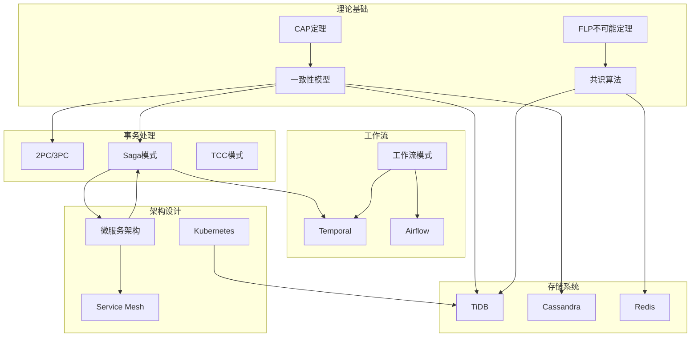

# 知识关系映射表

本文档记录项目文档间的交叉引用关系，形成完整的知识网络。

**创建日期**：2026-04-03
**版本**：v1.0

---

## 一、核心概念依赖关系

### 1.1 理论基础 → 技术实现

| 源文档 | 目标文档 | 关系类型 | 说明 |
|--------|---------|---------|------|
| CAP定理 | 一致性模型 | 理论约束 | CAP决定一致性选择 |
| FLP不可能定理 | Raft/Paxos | 理论基础 | FLP限制推动共识算法设计 |
| 一致性模型 | TiDB/Cassandra | 实现指导 | 指导存储系统一致性设计 |
| 共识算法 | etcd/TiKV | 算法实现 | 共识算法在协调服务中的应用 |
| 工作流网 | Temporal/Airflow | 建模方法 | 工作流理论基础 |
| Saga模式 | 微服务事务 | 事务模式 | 分布式事务解决方案 |

### 1.2 技术组件依赖

| 上游组件 | 下游应用 | 依赖关系 |
|---------|---------|---------|
| Raft算法 | etcd | 状态复制 |
| Raft算法 | TiKV | 数据一致性 |
| Raft算法 | Consul | 服务发现一致性 |
| PostgreSQL | Temporal | 工作流状态存储 |
| Kafka | 事件驱动架构 | 消息传递 |
| Kubernetes | TiDB | 云原生部署 |

---

## 二、主题域交叉引用

### 2.1 分布式理论基础

```
CAP定理
├── 一致性模型 (强/弱/最终一致性)
├── 共识算法 (Paxos/Raft)
└── 分布式事务 (2PC/3PC/Saga)

FLP不可能定理
├── 共识算法限制
├── 故障检测器
└── 异步系统假设
```

### 2.2 存储系统知识网络

```
存储系统
├── NewSQL
│   ├── TiDB → Raft, MVCC, HTAP
│   ├── CockroachDB → Raft, Serializable
│   └── Spanner → TrueTime, 外部一致性
├── NoSQL
│   ├── Cassandra → 最终一致性, Gossip
│   ├── MongoDB → Raft副本集
│   └── Redis → 主从复制
└── 分布式文件系统
    ├── HDFS → 主从架构
    ├── Ceph → CRUSH算法
    └── GFS → 追加写模型
```

### 2.3 工作流与事务

```
工作流系统
├── 理论基础
│   ├── 工作流网 → Petri网
│   ├── 工作流模式 → 控制流/数据流
│   └── Saga模式 → 补偿事务
├── 引擎实现
│   ├── Temporal → PostgreSQL + 事件溯源
│   └── Airflow → DAG调度
└── 事务处理
    ├── 2PC/3PC → 强一致性
    ├── TCC → 业务补偿
    └── Saga → 最终一致性
```

### 2.4 微服务架构

```
微服务架构
├── 服务治理
│   ├── API网关 → 流量入口
│   ├── 服务网格(Istio) → 流量治理
│   ├── 熔断限流 → 容错设计
│   └── 配置中心 → 动态配置
├── 通信机制
│   ├── 同步RPC → gRPC/Dubbo
│   └── 异步消息 → Kafka/RabbitMQ
├── 数据一致性
│   ├── 分布式事务 → 2PC/Saga
│   ├── 分布式缓存 → Redis Cluster
│   └── 事件溯源 → CQRS
└── 可观测性
    ├── 链路追踪 → OpenTelemetry
    ├── 指标监控 → Prometheus
    └── 日志聚合 → ELK
```

---

## 三、文档引用统计

### 3.1 高引用核心文档

| 文档 | 被引用次数 | 重要性 |
|------|-----------|--------|
| Raft算法专题文档 | 15+ | ⭐⭐⭐⭐⭐ |
| 一致性模型专题文档 | 12+ | ⭐⭐⭐⭐⭐ |
| CAP定理专题文档 | 10+ | ⭐⭐⭐⭐⭐ |
| Saga模式专题文档 | 8+ | ⭐⭐⭐⭐⭐ |
| TiDB架构深度分析 | 8+ | ⭐⭐⭐⭐ |
| 2PC与3PC | 6+ | ⭐⭐⭐⭐ |
| 微服务架构 | 6+ | ⭐⭐⭐⭐ |

### 3.2 知识枢纽文档

这些文档连接多个主题域：

1. **全局知识概念关系图** - 连接所有理论模型
2. **项目知识图谱** - 连接所有项目知识
3. **文档导航图** - 连接所有文档
4. **技术堆栈对比分析** - 连接所有技术实现

---

## 四、学习路径依赖

### 4.1 推荐学习顺序

```
入门路径
├── 1. CAP定理（分布式基础约束）
├── 2. 一致性模型（一致性级别理解）
├── 3. Raft算法（实用共识算法）
└── 4. TiDB/Redis（实际系统）

进阶路径
├── 1. FLP不可能定理（理论限制）
├── 2. Paxos算法（经典共识）
├── 3. Saga模式（分布式事务）
├── 4. 微服务架构（系统设计）
└── 5. Kafka（消息系统）

专家路径
├── 1. 形式化验证（TLA+/Petri网）
├── 2. Spanner/CockroachDB（全球分布式）
├── 3. 工作流网（理论建模）
└── 4. 实践案例（综合应用）
```

---

## 五、交叉引用使用指南

### 5.1 如何查找相关知识

1. **按概念查找**：使用概念索引，按字母顺序查找
2. **按主题查找**：使用主题域索引，按类别查找
3. **按依赖查找**：查看文档的「相关主题」部分
4. **按学习路径**：按照推荐的学习路径顺序阅读

### 5.2 如何贡献交叉引用

添加交叉引用时遵循以下原则：

1. **相关性**：只链接真正相关的内容
2. **层次性**：从基础到应用组织链接
3. **双向性**：尽可能建立双向链接
4. **简洁性**：每个文档「相关主题」不超过10-15个链接

---

## 六、知识网络可视化



---

## 七、更新记录

| 日期 | 版本 | 更新内容 |
|------|------|---------|
| 2026-04-03 | v1.0 | 初始版本，建立完整知识关系映射 |

---

## 八、相关文档

- [文档导航图](./文档导航图.md) - 完整文档导航
- [全局知识概念关系图](../07-KNOWLEDGE/全局知识概念关系图.md) - 全局知识网络
- [项目知识图谱](../07-KNOWLEDGE/项目知识图谱.md) - 项目知识索引

---

**维护者**：项目团队
